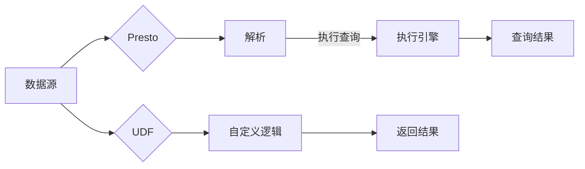

# Presto UDF原理与代码实例讲解

> 关键词：Presto, UDF, 自定义函数, SQL, 编程接口, 数据仓库, 代码实例, 性能优化, 数据处理

## 1. 背景介绍

随着大数据时代的到来，数据仓库和数据湖成为了企业分析和处理海量数据的重要基础设施。Presto，作为一款高性能分布式SQL查询引擎，以其高效、灵活的特性，在数据仓库领域受到了广泛关注。Presto支持多种数据源，包括Hive、Cassandra、Elasticsearch等，并且可以通过用户定义函数（UDF）扩展其功能。本文将深入探讨Presto UDF的原理，并通过代码实例讲解其具体应用。

## 2. 核心概念与联系

### 2.1 核心概念

- **Presto**: 一个开源的分布式SQL查询引擎，适用于执行交互式分析查询，尤其适合于PB级别的大数据集。
- **UDF**: 用户定义函数，允许用户在Presto中定义自定义函数，以扩展其内置函数的功能。
- **SQL**: 结构化查询语言，用于查询和操作关系数据库中的数据。

### 2.2 Mermaid 流程图



### 2.3 核心概念联系

Presto通过解析SQL查询，利用执行引擎处理查询，并返回结果。UDF作为扩展工具，可以在执行过程中引入自定义逻辑，从而处理Presto内置函数无法直接实现的复杂计算。

## 3. 核心算法原理 & 具体操作步骤

### 3.1 算法原理概述

Presto UDF的核心原理是利用Java或Scala编写自定义代码，实现特定的数据处理逻辑。这些函数可以被Presto查询引擎调用，如同内置函数一样使用。

### 3.2 算法步骤详解

1. **定义UDF**: 使用Java或Scala编写自定义函数，实现所需的功能。
2. **注册UDF**: 在Presto集群中注册自定义函数，使其可供查询使用。
3. **在SQL中使用**: 在SQL查询中调用注册的自定义函数，如同内置函数一样。

### 3.3 算法优缺点

#### 优点

- **灵活性**: 可以实现Presto内置函数无法提供的复杂逻辑。
- **扩展性**: 无需修改Presto核心代码即可扩展其功能。
- **兼容性**: 自定义函数与Presto的查询引擎无缝集成。

#### 缺点

- **性能**: 自定义函数可能会影响查询性能，尤其是在处理大量数据时。
- **安全性**: 自定义函数可能引入安全风险，需要严格控制权限。

### 3.4 算法应用领域

- **复杂计算**: 计算复杂的业务指标。
- **数据清洗**: 清洗和转换数据，以满足特定需求。
- **自定义聚合**: 实现自定义的聚合函数。

## 4. 数学模型和公式 & 详细讲解 & 举例说明

### 4.1 数学模型构建

Presto UDF通常涉及数学模型，例如统计模型、机器学习模型等。

### 4.2 公式推导过程

以一个简单的例子，假设我们想要计算一组数据的平均值：

$$
\bar{x} = \frac{1}{N} \sum_{i=1}^{N} x_i
$$

其中，$\bar{x}$ 是平均值，$N$ 是数据点的数量，$x_i$ 是第 $i$ 个数据点。

### 4.3 案例分析与讲解

以下是一个简单的Java UDF，用于计算平均值：

```java
import com.facebook.presto.sql.parser.PrestoException;
import com.facebook.presto.sql.relational.CallExpression;
import com.facebook.presto.sql.relational.FunctionCall;
import com.facebook.presto.sql.relational.StandardTypes;
import com.facebook.presto.sql.type.Type;
import com.facebook.presto.sql.type.TypeManager;

public class AverageFunction implements UDF {
    @Override
    public Type getReturnType() {
        return StandardTypes.DOUBLE;
    }

    @Override
    public Object compute(FunctionCall call) throws PrestoException {
        List<Object> args = call.getArguments();
        double sum = 0.0;
        for (Object arg : args) {
            sum += ((Double) arg).doubleValue();
        }
        return sum / args.size();
    }
}
```

## 5. 项目实践：代码实例和详细解释说明

### 5.1 开发环境搭建

1. 安装Java开发环境。
2. 下载Presto源代码。
3. 配置开发环境，包括Maven和IDE。

### 5.2 源代码详细实现

以上Java代码展示了如何实现一个简单的平均值计算UDF。

### 5.3 代码解读与分析

该UDF定义了一个名为`AverageFunction`的类，实现了`UDF`接口。`getReturnType`方法返回函数的返回类型，这里是`DOUBLE`。`compute`方法实现了具体的计算逻辑。

### 5.4 运行结果展示

在Presto查询中使用UDF：

```sql
SELECT average_column FROM my_table;
```

其中`average_column`是数据表中的列名。

## 6. 实际应用场景

Presto UDF在以下场景中非常有用：

- **业务指标计算**: 计算复杂业务指标，如用户活跃度、销售额等。
- **数据清洗**: 清洗和转换数据，以满足特定需求。
- **自定义聚合**: 实现自定义的聚合函数，如计算时间序列数据的移动平均。

## 7. 工具和资源推荐

### 7.1 学习资源推荐

- Presto官方文档：[https://prestodb.io/docs/](https://prestodb.io/docs/)
- Presto社区：[https://prestodb.io/community/](https://prestodb.io/community/)

### 7.2 开发工具推荐

- IntelliJ IDEA
- Eclipse

### 7.3 相关论文推荐

- [https://prestodb.io/docs/current/query-execution.html](https://prestodb.io/docs/current/query-execution.html)

## 8. 总结：未来发展趋势与挑战

### 8.1 研究成果总结

本文深入探讨了Presto UDF的原理和应用，并通过代码实例展示了如何实现自定义函数。Presto UDF为Presto查询引擎提供了强大的扩展能力，使其能够处理更复杂的业务逻辑。

### 8.2 未来发展趋势

- 支持更多的编程语言，如Python。
- 提供更丰富的内置函数库。
- 支持更复杂的数据类型和计算模型。

### 8.3 面临的挑战

- **性能优化**: 优化UDF的性能，以适应大规模数据集。
- **安全性**: 确保UDF的安全性，防止恶意代码注入。
- **可维护性**: 提高UDF的可维护性，便于后续开发和维护。

### 8.4 研究展望

Presto UDF将继续在数据仓库领域发挥重要作用，为用户提供更强大的数据处理和分析能力。

## 9. 附录：常见问题与解答

**Q1：Presto UDF支持哪些编程语言？**

A1：Presto UDF目前支持Java和Scala。

**Q2：如何将自定义UDF集成到Presto集群？**

A2：将自定义UDF的源代码编译为JAR包，然后在Presto集群中注册该JAR包。

**Q3：Presto UDF的性能如何？**

A3：Presto UDF的性能取决于实现的具体逻辑和数据集的大小。通常，Presto UDF的性能会比Presto的内置函数慢，但仍然可以提供强大的扩展能力。

**Q4：如何确保Presto UDF的安全性？**

A4：确保UDF的代码安全，避免使用外部资源，并对输入数据进行验证。

作者：禅与计算机程序设计艺术 / Zen and the Art of Computer Programming