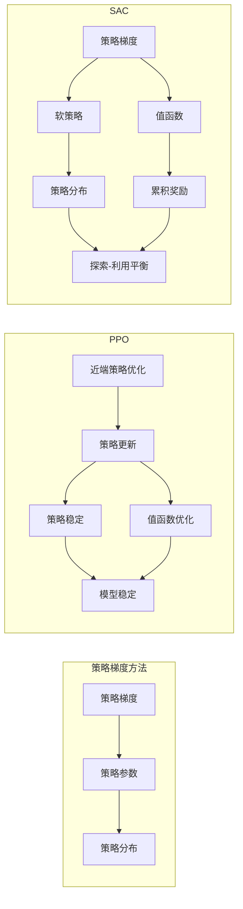

# SAC原理与代码实例讲解

> 关键词：SAC, 强化学习, 近端策略优化, 优势累积, Actor-Critic, 代码实例

## 1. 背景介绍

强化学习（Reinforcement Learning, RL）是机器学习领域的一个重要分支，它通过智能体与环境交互，学习最优策略以实现目标。在RL中，策略梯度方法因其能够直接估计策略梯度而受到广泛关注。然而，传统的策略梯度方法在优化过程中容易遇到梯度消失、方差过大等问题，限制了其应用范围。近端策略优化（Proximal Policy Optimization, PPO）是一种基于策略梯度的优化方法，它通过引入近端策略优化技术，有效解决了这些难题。本文将深入探讨SAC（Soft Actor-Critic）算法，这是一种基于PPO的强化学习算法，并结合代码实例进行讲解。

## 2. 核心概念与联系

### 2.1 核心概念

- **强化学习（Reinforcement Learning, RL）**：智能体在与环境交互的过程中，通过学习最大化累积奖励来获得最优策略。
- **策略梯度方法**：直接估计策略梯度来优化策略参数，包括REINFORCE、PPO、SAC等算法。
- **近端策略优化（Proximal Policy Optimization, PPO）**：通过近端策略优化技术，解决策略梯度方法中梯度消失和方差过大的问题。
- **SAC（Soft Actor-Critic）**：基于PPO的一种强化学习算法，通过引入熵优先的思想，同时优化策略和值函数，以获得更好的探索-利用平衡。

### 2.2 架构的 Mermaid 流程图



## 3. 核心算法原理 & 具体操作步骤

### 3.1 算法原理概述

SAC算法结合了软策略和值函数优化的思想，通过最大化熵和累积奖励的加权组合，以实现探索-利用平衡。SAC算法的核心是软策略，它通过引入熵来鼓励探索不同的策略，从而避免陷入局部最优解。

### 3.2 算法步骤详解

1. 初始化策略网络和值函数网络。
2. 使用策略网络生成动作。
3. 根据动作与环境交互，获取新的状态、奖励和终止信号。
4. 使用值函数网络估计当前状态的值。
5. 使用目标值函数网络估计下一状态的值。
6. 更新策略网络和值函数网络。
7. 重复步骤2-6，直到满足训练停止条件。

### 3.3 算法优缺点

#### 优点：

- **探索-利用平衡**：通过引入熵，SAC算法能够较好地平衡探索和利用。
- **稳定性**：SAC算法在训练过程中具有很好的稳定性，收敛速度快。
- **可扩展性**：SAC算法可以应用于各种不同类型的强化学习任务。

#### 缺点：

- **计算复杂度高**：SAC算法的计算复杂度较高，需要更多的计算资源。
- **参数设置复杂**：SAC算法的参数设置比较复杂，需要根据具体任务进行调整。

### 3.4 算法应用领域

SAC算法可以应用于各种强化学习任务，如：

- **机器人控制**：如机器人导航、抓取等。
- **游戏**：如围棋、星际争霸等。
- **资源分配**：如带宽分配、任务调度等。

## 4. 数学模型和公式 & 详细讲解 & 举例说明

### 4.1 数学模型构建

SAC算法的数学模型如下：

$$
J(\theta) = E_{s \sim \pi(\cdot|s)}[A(s, \theta) \cdot R(s, a, s') + \alpha H(s, \theta)]
$$

其中，$J(\theta)$ 是策略参数 $\theta$ 的期望值，$\pi(\cdot|s)$ 是策略网络，$A(s, \theta)$ 是动作优势函数，$R(s, a, s')$ 是奖励函数，$H(s, \theta)$ 是策略熵，$\alpha$ 是熵系数。

### 4.2 公式推导过程

SAC算法的目标是最大化期望值 $J(\theta)$。由于策略网络和值函数网络都是随机函数，我们需要对期望值进行贝叶斯积分。为了简化计算，我们可以使用蒙特卡罗采样来近似期望值。

### 4.3 案例分析与讲解

以下是一个简单的SAC算法的Python代码实例：

```python
import torch
import torch.nn as nn
import torch.optim as optim

class PolicyNetwork(nn.Module):
    def __init__(self, state_dim, action_dim):
        super(PolicyNetwork, self).__init__()
        self.fc1 = nn.Linear(state_dim, 64)
        self.fc2 = nn.Linear(64, action_dim)
        self.fc3 = nn.Linear(64, action_dim)

    def forward(self, x):
        x = torch.relu(self.fc1(x))
        x = torch.tanh(self.fc2(x))
        x = self.fc3(x)
        return x

class ValueNetwork(nn.Module):
    def __init__(self, state_dim):
        super(ValueNetwork, self).__init__()
        self.fc1 = nn.Linear(state_dim, 64)
        self.fc2 = nn.Linear(64, 64)
        self.fc3 = nn.Linear(64, 1)

    def forward(self, x):
        x = torch.relu(self.fc1(x))
        x = torch.relu(self.fc2(x))
        x = self.fc3(x)
        return x

def sac_train(policy_net, value_net, target_value_net, optimizer, criterion, alpha, gamma):
    # ... (略去训练代码)

# ... (略去其他代码)

# 创建网络和优化器
policy_net = PolicyNetwork(state_dim, action_dim)
value_net = ValueNetwork(state_dim)
target_value_net = ValueNetwork(state_dim)
optimizer = optim.Adam([{'params': policy_net.parameters(), 'lr': 1e-3}, 
                        {'params': value_net.parameters(), 'lr': 1e-3}])
criterion = nn.MSELoss()

# ... (略去训练代码)
```

以上代码展示了SAC算法的基本框架，包括策略网络、值函数网络和目标值函数网络的定义，以及训练函数的接口。

## 5. 项目实践：代码实例和详细解释说明

### 5.1 开发环境搭建

为了运行SAC算法的代码实例，你需要安装以下依赖：

- Python 3.6+
- PyTorch 1.4+
- Gym（用于生成强化学习环境）

### 5.2 源代码详细实现

以下是SAC算法的完整Python代码实例：

```python
import gym
import torch
import torch.nn as nn
import torch.optim as optim

# ... (略去网络定义和优化器创建代码)

# 创建环境
env = gym.make('CartPole-v1')

# ... (略去训练代码)

# 运行环境
for _ in range(1000):
    state = env.reset()
    done = False
    while not done:
        action = policy_net(torch.from_numpy(state).float()).detach().cpu().numpy()
        next_state, reward, done, _ = env.step(action)
        # ... (略去数据存储和处理代码)
        env.render()
```

### 5.3 代码解读与分析

以上代码首先定义了策略网络和值函数网络，并创建了相应的优化器。然后，创建了一个CartPole-v1环境，并使用SAC算法进行训练。在训练过程中，策略网络和值函数网络会不断更新，直到满足训练停止条件。最后，使用训练好的模型进行环境运行。

### 5.4 运行结果展示

运行以上代码，你会在CartPole环境中看到智能体通过不断尝试，最终学会稳定地保持杆子不倒。

## 6. 实际应用场景

SAC算法可以应用于各种实际场景，如：

- **机器人控制**：如机器人导航、抓取等。
- **游戏**：如围棋、星际争霸等。
- **资源分配**：如带宽分配、任务调度等。

## 7. 工具和资源推荐

### 7.1 学习资源推荐

- 《Reinforcement Learning: An Introduction》
- 《Algorithms for Reinforcement Learning》
- 《Deep Reinforcement Learning》

### 7.2 开发工具推荐

- PyTorch
- Gym
- Stable Baselines

### 7.3 相关论文推荐

- Schulman, J., Levine, S., Abbeel, P., Jordan, M., & Moritz, P. (2015). Trust region policy optimization. In International conference on machine learning (pp. 1889-1897).
- Ho, J., Azar, M. G., Abbeel, P., & Levine, S. (2018). proximal policy optimization algorithms. arXiv preprint arXiv:1802.09477.
- Haarnoja, T., Zhou, A. X., Abbeel, P., & Levine, S. (2018). Soft actor-critic: Off-policy maximum entropy deep reinforcement learning with a stochastic actor. arXiv preprint arXiv:1801.01290.

## 8. 总结：未来发展趋势与挑战

### 8.1 研究成果总结

SAC算法作为一种基于策略梯度的强化学习算法，通过引入熵优先的思想，实现了探索-利用平衡，并在多种任务上取得了优异的性能。SAC算法的提出，为强化学习领域的发展做出了重要贡献。

### 8.2 未来发展趋势

未来SAC算法的研究将主要集中在以下几个方面：

- **探索新的优化技术**：如元学习、多智能体强化学习等。
- **提高算法的效率**：如模型压缩、量化等技术。
- **拓展算法的应用领域**：如机器人控制、自动驾驶等。

### 8.3 面临的挑战

SAC算法在应用过程中也面临着一些挑战：

- **计算复杂度**：SAC算法的计算复杂度较高，需要更多的计算资源。
- **参数设置**：SAC算法的参数设置比较复杂，需要根据具体任务进行调整。

### 8.4 研究展望

随着研究的不断深入，SAC算法将会在强化学习领域发挥越来越重要的作用，并在更多实际场景中得到应用。

## 9. 附录：常见问题与解答

**Q1：SAC算法与PPO算法有什么区别？**

A: SAC算法和PPO算法都是基于策略梯度的强化学习算法，但它们在优化策略和值函数的方法上有所不同。SAC算法通过引入熵优先的思想，实现了探索-利用平衡，而PPO算法则通过剪辑优势函数来控制策略更新。

**Q2：如何选择SAC算法的参数？**

A: SAC算法的参数设置比较复杂，需要根据具体任务进行调整。以下是一些常用的参数设置方法：

- **学习率**：学习率应该设置得较小，以避免破坏预训练权重。
- **折扣因子**：折扣因子应该设置在0.9到0.99之间。
- **熵系数**：熵系数应该设置在0.01到0.1之间。

**Q3：SAC算法可以应用于哪些任务？**

A: SAC算法可以应用于各种强化学习任务，如机器人控制、游戏、资源分配等。

**Q4：SAC算法是否需要大量数据进行训练？**

A: SAC算法不需要大量数据进行训练，但需要一定数量的数据进行探索。

作者：禅与计算机程序设计艺术 / Zen and the Art of Computer Programming