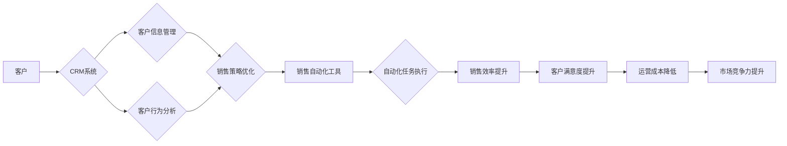

# Sales-Consultant 业务流程与价值分析

> 关键词：销售咨询，业务流程，价值分析，客户关系管理，销售策略，数据分析，销售自动化

## 1. 背景介绍

在当今竞争激烈的市场环境中，销售咨询作为企业发展的关键环节，其业务流程的优化和价值最大化成为了企业关注的焦点。销售咨询不仅涉及到与客户建立和维护关系的技巧，还包括了数据分析、销售策略制定、销售自动化等多个方面。本文将深入探讨Sales-Consultant的业务流程与价值分析，以帮助企业提升销售效率，增强市场竞争力。

### 1.1 问题的由来

随着市场环境的复杂化和客户需求的多样化，传统的销售模式已无法满足企业的需求。企业需要通过优化销售咨询流程，提高销售效率，降低成本，从而在激烈的市场竞争中脱颖而出。

### 1.2 研究现状

目前，销售咨询领域的研究主要集中在以下几个方面：

- **客户关系管理(CRM)系统**：通过CRM系统实现客户信息的收集、管理和分析，提高销售效率。
- **销售自动化(Sales Automation)工具**：利用自动化工具简化销售流程，提高销售人员的生产力。
- **数据分析**：通过数据分析挖掘客户需求，优化销售策略，提升销售业绩。

### 1.3 研究意义

研究Sales-Consultant的业务流程与价值分析，对于以下方面具有重要意义：

- **提升销售效率**：优化业务流程，提高销售人员的工作效率。
- **增强客户满意度**：通过了解客户需求，提供个性化服务，提升客户满意度。
- **降低运营成本**：通过销售自动化和流程优化，降低运营成本。
- **提升市场竞争力**：通过提升销售业绩，增强企业在市场中的竞争力。

### 1.4 本文结构

本文将按照以下结构进行阐述：

- **第二章**：介绍Sales-Consultant的核心概念与联系。
- **第三章**：探讨Sales-Consultant的核心算法原理与具体操作步骤。
- **第四章**：分析Sales-Consultant的数学模型和公式。
- **第五章**：通过项目实践展示Sales-Consultant的代码实例和详细解释说明。
- **第六章**：分析Sales-Consultant的实际应用场景。
- **第七章**：推荐Sales-Consultant的相关工具和资源。
- **第八章**：总结Sales-Consultant的未来发展趋势与挑战。
- **第九章**：附录，包含常见问题与解答。

## 2. 核心概念与联系

### 2.1 核心概念

#### 客户关系管理 (CRM)
CRM是一种旨在提高企业与客户之间互动效率的管理理念和技术实践。通过CRM系统，企业可以收集、管理和分析客户信息，从而提升客户满意度和忠诚度。

#### 销售自动化 (Sales Automation)
销售自动化是指利用软件工具自动化销售过程中的重复性任务，如客户管理、销售线索跟踪、邮件营销等，以提高销售效率。

#### 数据分析
数据分析是指通过收集、整理和分析数据，挖掘数据中的有价值信息，为企业决策提供支持。

### 2.2 联系

Sales-Consultant的业务流程涉及到CRM、销售自动化和数据分析等多个方面。以下是一个Mermaid流程图，展示了这些概念之间的联系：



## 3. 核心算法原理 & 具体操作步骤

### 3.1 算法原理概述

Sales-Consultant的核心算法原理主要包括以下几个方面：

- **客户画像构建**：通过对客户数据进行挖掘和分析，构建客户的个性化画像。
- **销售线索评分**：根据客户画像和销售线索的相关性，对销售线索进行评分。
- **销售策略优化**：根据销售线索评分和客户画像，制定个性化的销售策略。
- **销售自动化**：利用自动化工具执行销售策略，提高销售效率。

### 3.2 算法步骤详解

以下是Sales-Consultant的具体操作步骤：

1. **数据收集**：收集客户信息、销售线索、市场数据等。
2. **数据清洗**：对收集到的数据进行清洗和预处理。
3. **特征工程**：提取与销售相关的特征，如客户特征、产品特征、市场特征等。
4. **客户画像构建**：利用机器学习算法构建客户的个性化画像。
5. **销售线索评分**：根据客户画像和销售线索的相关性，对销售线索进行评分。
6. **销售策略优化**：根据销售线索评分和客户画像，制定个性化的销售策略。
7. **销售自动化**：利用自动化工具执行销售策略，提高销售效率。

### 3.3 算法优缺点

#### 优点

- 提高销售效率：通过自动化工具和个性化策略，提高销售效率。
- 降低成本：减少人工操作，降低运营成本。
- 提升客户满意度：提供个性化服务，提升客户满意度。

#### 缺点

- 数据依赖：需要大量高质量的数据才能保证算法的有效性。
- 技术门槛：需要具备一定的技术知识才能进行算法开发和实施。
- 变更管理：算法模型的变更可能需要较长的适应期。

### 3.4 算法应用领域

Sales-Consultant算法可以应用于以下领域：

- **B2B销售**：通过分析客户需求，提供个性化的产品和服务。
- **B2C销售**：通过分析客户行为，进行精准营销。
- **在线销售**：通过自动化工具提高客户服务质量和销售效率。

## 4. 数学模型和公式 & 详细讲解 & 举例说明

### 4.1 数学模型构建

Sales-Consultant的数学模型主要包括以下部分：

- **客户画像模型**：利用聚类、分类等方法构建客户画像模型。
- **销售线索评分模型**：利用回归、决策树等方法构建销售线索评分模型。

### 4.2 公式推导过程

以下是一个简单的客户画像模型示例，使用聚类算法（如K-Means）进行公式推导：

假设我们有 $n$ 个客户，每个客户有 $m$ 个特征，则客户的特征向量可以表示为 $X = \{x_1, x_2, ..., x_n\}$，其中 $x_i$ 为第 $i$ 个客户的特征向量。

1. 初始化 $K$ 个聚类中心 $C = \{c_1, c_2, ..., c_K\}$。
2. 计算每个客户到每个聚类中心的距离，将客户分配到最近的聚类中心。
3. 更新聚类中心，计算每个聚类中心的均值。
4. 重复步骤2和3，直到聚类中心不再发生变化。

### 4.3 案例分析与讲解

假设我们有一个包含1000个客户的销售数据集，每个客户有年龄、收入、职业、购买历史等特征。我们使用K-Means聚类算法构建客户画像模型，将客户分为5个不同的群体。

通过分析不同群体的特征，我们可以发现：
- 群体1：年轻、高收入、职业为IT行业，对新技术产品感兴趣。
- 群体2：中年、中高收入、职业为金融行业，对高端消费品感兴趣。
- 群体3：中年、低收入、职业为服务业，对性价比高的产品感兴趣。
- 群体4：年轻、低收入、职业为学生，对学习用品感兴趣。
- 群体5：老年、低收入、职业为退休，对保健产品感兴趣。

通过分析这些群体特征，我们可以针对不同群体制定相应的销售策略。

## 5. 项目实践：代码实例和详细解释说明

### 5.1 开发环境搭建

为了进行Sales-Consultant项目的实践，我们需要以下开发环境：

- Python编程语言
- NumPy、Pandas、Scikit-learn等数据分析库
- Matplotlib、Seaborn等可视化库

### 5.2 源代码详细实现

以下是一个简单的Sales-Consultant项目实例，使用Python编程语言实现：

```python
import numpy as np
import pandas as pd
from sklearn.cluster import KMeans
import matplotlib.pyplot as plt

# 加载数据
data = pd.read_csv('sales_data.csv')

# 数据预处理
# ...

# 构建客户画像模型
kmeans = KMeans(n_clusters=5)
kmeans.fit(data)

# 获取每个客户的聚类标签
labels = kmeans.labels_

# 可视化客户画像
plt.scatter(data.iloc[:, 0], data.iloc[:, 1], c=labels)
plt.xlabel('年龄')
plt.ylabel('收入')
plt.title('客户画像')
plt.show()
```

### 5.3 代码解读与分析

以上代码首先导入了NumPy、Pandas、Scikit-learn和Matplotlib等库。接着，加载数据并进行预处理，包括数据清洗、特征工程等。然后，使用K-Means聚类算法构建客户画像模型，获取每个客户的聚类标签。最后，使用Matplotlib库将客户画像进行可视化展示。

### 5.4 运行结果展示

运行以上代码后，将得到一个散点图，展示不同聚类客户的年龄和收入分布。通过分析这些分布，我们可以更好地了解不同客户群体的特征。

## 6. 实际应用场景

### 6.1 B2B销售

在B2B销售领域，Sales-Consultant可以帮助企业：

- 分析客户需求，提供个性化的产品和服务。
- 识别潜在客户，制定精准的销售策略。
- 提高销售效率，降低销售成本。

### 6.2 B2C销售

在B2C销售领域，Sales-Consultant可以帮助企业：

- 分析客户行为，进行精准营销。
- 识别客户需求，提供个性化推荐。
- 提升客户满意度，增加复购率。

### 6.3 在线销售

在在线销售领域，Sales-Consultant可以帮助企业：

- 分析用户行为，优化网站设计。
- 提高转化率，增加销售额。
- 降低运营成本，提高盈利能力。

## 7. 工具和资源推荐

### 7.1 学习资源推荐

- 《Python数据分析实战》
- 《机器学习实战》
- 《深度学习》

### 7.2 开发工具推荐

- Python编程语言
- Jupyter Notebook
- NumPy、Pandas、Scikit-learn等数据分析库

### 7.3 相关论文推荐

- 《Customer Segmentation Using K-Means Clustering》
- 《Sales Force Automation: A Review》
- 《A Review of Customer Relationship Management (CRM) Systems》

## 8. 总结：未来发展趋势与挑战

### 8.1 研究成果总结

本文对Sales-Consultant的业务流程与价值分析进行了深入探讨，从核心概念、算法原理、实践案例等多个角度进行了阐述。研究表明，Sales-Consultant可以帮助企业提升销售效率，增强市场竞争力。

### 8.2 未来发展趋势

随着人工智能技术的不断发展，Sales-Consultant将呈现以下发展趋势：

- **智能化**：利用人工智能技术实现更精准的客户画像和销售策略。
- **个性化**：提供更加个性化的产品和服务，提升客户满意度。
- **自动化**：利用自动化工具实现销售流程的自动化，提高销售效率。

### 8.3 面临的挑战

Sales-Consultant在发展过程中也面临着以下挑战：

- **数据质量**：需要高质量的数据才能保证算法的有效性。
- **技术门槛**：需要具备一定的技术知识才能进行算法开发和实施。
- **伦理问题**：需要关注算法的伦理问题，避免歧视和不公平现象。

### 8.4 研究展望

未来，Sales-Consultant的研究将重点关注以下几个方面：

- **跨领域应用**：将Sales-Consultant应用于更多领域，如金融、医疗等。
- **多模态数据融合**：融合文本、图像、视频等多模态数据，提升算法的全面性。
- **可解释性**：提高算法的可解释性，增强用户对算法的信任。

## 9. 附录：常见问题与解答

**Q1：Sales-Consultant的适用范围是什么？**

A：Sales-Consultant适用于所有涉及销售咨询的场景，包括B2B、B2C和在线销售。

**Q2：如何保证Sales-Consultant的数据质量？**

A：保证数据质量需要从以下几个方面入手：

- 数据采集：确保数据的真实性和准确性。
- 数据清洗：去除错误数据、重复数据等。
- 数据预处理：对数据进行标准化、归一化等操作。

**Q3：Sales-Consultant如何提高客户满意度？**

A：Sales-Consultant可以通过以下方式提高客户满意度：

- 个性化服务：根据客户需求提供个性化产品和服务。
- 高效响应：快速响应客户需求，提供及时的服务。
- 优质体验：提供优质的客户体验，增强客户忠诚度。

**Q4：Sales-Consultant的成本效益如何？**

A：Sales-Consultant可以通过以下方式提高成本效益：

- 提高销售效率：减少人工操作，降低人力成本。
- 降低运营成本：通过自动化工具降低运营成本。
- 增加销售收入：提高销售业绩，增加收入。

作者：禅与计算机程序设计艺术 / Zen and the Art of Computer Programming