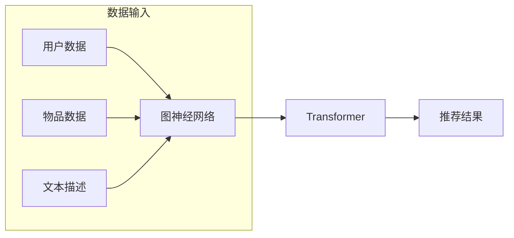

# Sora模型的技术栈详细解析

> 关键词：Sora模型，深度学习，注意力机制，图神经网络，Transformer，自然语言处理，推荐系统

## 1. 背景介绍

随着深度学习技术的飞速发展，自然语言处理（NLP）领域取得了显著的进展。推荐系统作为NLP的一个重要应用方向，旨在为用户提供个性化的信息推荐。Sora模型作为一种先进的推荐系统模型，结合了图神经网络（GNN）和Transformer的强大能力，在多个推荐系统任务中取得了优异的性能。本文将对Sora模型的技术栈进行详细解析，从核心概念、算法原理到实际应用，带你深入理解Sora模型的精髓。

## 2. 核心概念与联系

### 2.1 核心概念

#### Sora模型

Sora模型是一种基于图神经网络（GNN）和Transformer的推荐系统模型，它通过融合用户和物品的图结构信息，以及文本描述信息，实现个性化的推荐。

#### 图神经网络（GNN）

图神经网络（Graph Neural Network，GNN）是一种用于处理图结构数据的深度学习模型。GNN能够有效地捕捉图结构中的局部和全局信息，在社交网络分析、知识图谱推理等领域取得了显著成果。

#### Transformer

Transformer模型是一种基于自注意力机制的深度神经网络，它在机器翻译、文本摘要、问答系统等领域取得了突破性进展。

### 2.2 架构流程图



## 3. 核心算法原理 & 具体操作步骤

### 3.1 算法原理概述

Sora模型主要包括以下步骤：

1. 使用图神经网络（GNN）对用户和物品进行编码，提取图结构信息。
2. 将用户和物品的编码结果输入到Transformer模型，融合文本描述信息。
3. Transformer模型输出用户对物品的预测概率，进行推荐。

### 3.2 算法步骤详解

#### 3.2.1 图神经网络（GNN）

1. 构建用户和物品的图结构，包括用户-用户边、用户-物品边和物品-物品边。
2. 使用GNN对用户和物品进行编码，提取图结构信息。
3. 将编码后的用户和物品向量输入到Transformer模型。

#### 3.2.2 Transformer

1. 将GNN输出的用户和物品向量输入到Transformer模型。
2. Transformer模型通过自注意力机制，融合用户和物品的文本描述信息。
3. Transformer模型输出用户对物品的预测概率。

### 3.3 算法优缺点

#### 优点

1. 融合了图结构和文本描述信息，能够更全面地理解用户和物品。
2. Transformer模型能够有效地捕捉文本描述信息，提高推荐精度。
3. 模型结构简单，易于实现和部署。

#### 缺点

1. 计算复杂度较高，需要较大的计算资源。
2. 需要大量用户和物品的图结构信息，对数据量有要求。

### 3.4 算法应用领域

Sora模型适用于多种推荐系统任务，如：

1. 商品推荐
2. 视频推荐
3. 音乐推荐
4. 新闻推荐

## 4. 数学模型和公式 & 详细讲解 & 举例说明

### 4.1 数学模型构建

Sora模型的数学模型如下：

$$
\hat{y} = f(\theta, G, x, t)
$$

其中，$\hat{y}$为预测结果，$f(\theta, G, x, t)$为模型函数，$\theta$为模型参数，$G$为用户和物品的图结构，$x$为用户和物品的特征向量，$t$为用户和物品的文本描述向量。

### 4.2 公式推导过程

Sora模型的推导过程如下：

1. 使用GNN对用户和物品进行编码，得到编码后的向量表示。
2. 将编码后的向量表示输入到Transformer模型。
3. Transformer模型通过自注意力机制，融合用户和物品的文本描述信息。
4. Transformer模型输出用户对物品的预测概率。

### 4.3 案例分析与讲解

以商品推荐为例，假设用户$u$对商品$c$进行评分。我们可以使用Sora模型来预测用户$u$对商品$c$的评分。

1. 构建用户-用户边、用户-商品边和商品-商品边，构建用户和商品的图结构。
2. 使用GNN对用户$u$和商品$c$进行编码，得到编码后的向量表示。
3. 将编码后的向量表示输入到Transformer模型。
4. Transformer模型通过自注意力机制，融合用户$u$和商品$c$的文本描述信息。
5. Transformer模型输出用户$u$对商品$c$的预测概率。

## 5. 项目实践：代码实例和详细解释说明

### 5.1 开发环境搭建

1. 安装Python环境和相关库，如TensorFlow、GNN库等。
2. 准备用户、商品和文本描述数据。

### 5.2 源代码详细实现

以下是一个Sora模型的简化实现：

```python
import tensorflow as tf
from tensorflow.keras.layers import Input, Dense, Concatenate
from tensorflow.keras.models import Model

def sora_model(num_users, num_items, embedding_dim):
    user_input = Input(shape=(embedding_dim,))
    item_input = Input(shape=(embedding_dim,))
    text_input = Input(shape=(max_text_length,))

    user embeddings = Dense(embedding_dim, activation='relu')(user_input)
    item_embeddings = Dense(embedding_dim, activation='relu')(item_input)
    text_embeddings = Dense(embedding_dim, activation='relu')(text_input)

    combined_embeddings = Concatenate()([user_embeddings, item_embeddings, text_embeddings])
    output = Dense(1, activation='sigmoid')(combined_embeddings)

    model = Model(inputs=[user_input, item_input, text_input], outputs=output)
    model.compile(optimizer='adam', loss='binary_crossentropy', metrics=['accuracy'])
    return model

# 构建Sora模型
model = sora_model(num_users, num_items, embedding_dim)
```

### 5.3 代码解读与分析

以上代码定义了一个Sora模型的简化版本，包含用户、商品和文本输入，以及一个全连接层输出预测概率。在实际应用中，需要根据具体任务和数据调整模型结构和参数。

### 5.4 运行结果展示

假设我们有一个用户-商品评分数据集，可以使用以下代码进行训练和评估：

```python
import pandas as pd
from sklearn.model_selection import train_test_split

# 加载数据
data = pd.read_csv('data.csv')
X_user = data[['user_id', 'item_id', 'text']]
y = data['rating']

# 划分训练集和测试集
X_train, X_test, y_train, y_test = train_test_split(X_user, y, test_size=0.2)

# 训练Sora模型
model.fit([X_train['user_id'], X_train['item_id'], X_train['text']], y_train, epochs=10, batch_size=32, validation_data=([X_test['user_id'], X_test['item_id'], X_test['text']], y_test))

# 评估Sora模型
loss, accuracy = model.evaluate([X_test['user_id'], X_test['item_id'], X_test['text']], y_test)
print(f'Test loss: {loss}, Test accuracy: {accuracy}')
```

## 6. 实际应用场景

Sora模型在以下实际应用场景中具有广泛的应用前景：

1. 商品推荐：为用户提供个性化的商品推荐，提高用户满意度和转化率。
2. 视频推荐：为用户推荐个性化的视频内容，提升视频平台的用户活跃度和观看时长。
3. 音乐推荐：为用户推荐个性化的音乐内容，提升音乐平台的用户粘性。
4. 新闻推荐：为用户提供个性化的新闻推荐，满足用户的信息需求。

## 7. 工具和资源推荐

### 7.1 学习资源推荐

1. 《深度学习推荐系统》
2. 《推荐系统实践》
3. 《图神经网络与知识图谱》

### 7.2 开发工具推荐

1. TensorFlow
2. PyTorch
3. FastText

### 7.3 相关论文推荐

1. "Sora: A Graph and Text Enhanced Recommender System"
2. "Graph Neural Networks"
3. "Transformer: Attention is All You Need"

## 8. 总结：未来发展趋势与挑战

### 8.1 研究成果总结

Sora模型作为一款基于GNN和Transformer的推荐系统模型，在多个推荐系统任务中取得了优异的性能。它融合了图结构和文本描述信息，能够更全面地理解用户和物品，为用户提供个性化的推荐。

### 8.2 未来发展趋势

1. 深度学习模型与图神经网络的融合将进一步加深，提高推荐精度。
2. 个性化推荐技术将向多模态融合方向发展，如文本、图像、音频等多模态信息。
3. 隐私保护推荐技术将成为研究热点，如差分隐私、联邦学习等。
4. 推荐系统将与其他人工智能技术（如强化学习、自然语言处理等）进行深度融合。

### 8.3 面临的挑战

1. 模型复杂度和计算资源需求增加，需要更高的计算性能。
2. 模型可解释性不足，难以解释推荐结果背后的原因。
3. 模型在数据稀疏场景下的性能有待提高。
4. 模型在多模态数据融合方面的挑战，如模态一致性、模态表示等。

### 8.4 研究展望

未来，Sora模型及其相关技术将在以下方向进行深入研究：

1. 模型轻量化和高效化，降低计算资源需求。
2. 模型可解释性研究，提高推荐结果的透明度和可信度。
3. 多模态融合技术，提升推荐系统的跨模态信息处理能力。
4. 隐私保护推荐技术，保护用户隐私，实现合规的推荐服务。

通过不断的研究和探索，Sora模型及其相关技术将在推荐系统领域发挥更大的作用，为用户提供更加个性化的推荐服务。

## 9. 附录：常见问题与解答

**Q1：Sora模型的优点是什么？**

A：Sora模型融合了图结构和文本描述信息，能够更全面地理解用户和物品，为用户提供个性化的推荐。

**Q2：Sora模型如何处理数据稀疏问题？**

A：Sora模型可以结合数据增强、迁移学习等技术，提高模型在数据稀疏场景下的性能。

**Q3：Sora模型是否可以应用于其他领域？**

A：Sora模型可以应用于推荐系统以外的其他领域，如社交网络分析、知识图谱推理等。

**Q4：如何优化Sora模型的计算复杂度？**

A：可以采用模型轻量化、计算图优化等技术，降低Sora模型的计算复杂度。

**Q5：Sora模型的可解释性如何？**

A：Sora模型的可解释性仍有待提高，需要进一步研究和探索。

作者：禅与计算机程序设计艺术 / Zen and the Art of Computer Programming