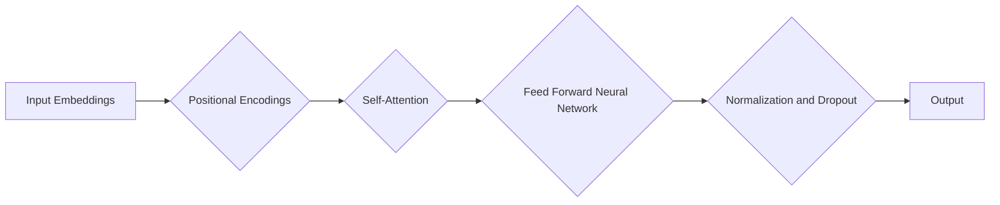
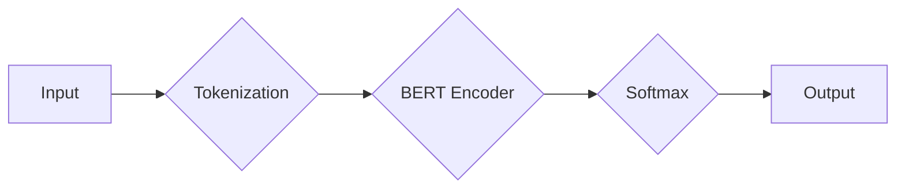

# Transformer大模型实战：BERT 嵌入的生成

> 关键词：Transformer, BERT, 嵌入生成模型, 自然语言处理, NLP, 预训练, 微调, 生成式模型

## 1. 背景介绍

自然语言处理（NLP）领域近年来取得了突破性的进展，其中Transformer架构的大模型如BERT（Bidirectional Encoder Representations from Transformers）在理解、生成和翻译文本方面表现卓越。BERT的成功不仅在于其预训练模型的能力，还在于其强大的嵌入生成能力。本文将深入探讨Transformer大模型，特别是BERT，在嵌入生成方面的实战技巧和应用。

### 1.1 问题的由来

传统的NLP任务，如文本分类、情感分析等，通常依赖于词袋模型或基于规则的方法，这些方法往往难以捕捉到词语之间的复杂关系。随着深度学习的兴起，基于神经网络的模型逐渐成为主流，其中RNN（循环神经网络）和CNN（卷积神经网络）因其能够捕捉序列数据的时序特性而受到青睐。然而，RNN存在梯度消失或梯度爆炸问题，而CNN在处理长序列时表现不佳。

Transformer架构的出现，解决了RNN的这些问题，并引入了自注意力机制，使得模型能够并行处理输入序列，大大提升了计算效率。BERT作为Transformer架构的一个变种，通过双向编码和多层堆叠，在多个NLP任务上取得了SOTA（State of the Art）的效果。

### 1.2 研究现状

BERT的预训练模型通过无监督学习在大量文本上进行训练，学习到了丰富的语言知识。在下游任务中，通过微调（Fine-tuning）可以进一步提升模型在特定任务上的性能。BERT的嵌入生成能力使其在文本生成任务中具有独特的优势。

### 1.3 研究意义

BERT的嵌入生成能力在多种NLP应用中具有重要价值，例如：

- **文本生成**：自动生成文章、对话、诗歌等。
- **摘要生成**：从长文本中提取关键信息，生成简短的摘要。
- **问答系统**：根据问题生成对应的答案。
- **机器翻译**：将一种语言的文本翻译成另一种语言。

本文将深入探讨BERT的嵌入生成原理，并通过实践案例展示如何利用BERT进行文本生成。

### 1.4 本文结构

本文将分为以下几个部分：

- **第2章**：介绍Transformer和BERT的基本概念。
- **第3章**：详细讲解BERT嵌入生成模型的原理。
- **第4章**：使用数学公式详细解释BERT嵌入生成模型的数学模型。
- **第5章**：提供项目实践，展示如何使用BERT进行文本生成。
- **第6章**：探讨BERT嵌入生成模型在实际应用场景中的应用。
- **第7章**：推荐相关学习资源、开发工具和论文。
- **第8章**：总结BERT嵌入生成模型的研究成果、未来发展趋势和挑战。
- **第9章**：提供常见问题与解答。

## 2. 核心概念与联系

### 2.1 Transformer架构

Transformer架构的核心是自注意力机制（Self-Attention），它允许模型关注输入序列中所有位置的上下文信息。以下是一个简化的Mermaid流程图，展示了Transformer的基本组件：



### 2.2 BERT模型

BERT模型在Transformer架构的基础上，引入了掩码机制（Masked Language Model，MLM）和下一个句子预测（Next Sentence Prediction，NSP）任务，进一步提升了模型对语言结构的理解能力。

### 2.3 BERT嵌入生成模型

BERT的嵌入生成模型利用了预训练得到的语言表示，通过微调使得模型能够生成符合特定主题或风格的文本。以下是一个简化的Mermaid流程图，展示了BERT嵌入生成模型的基本流程：



## 3. 核心算法原理 & 具体操作步骤

### 3.1 算法原理概述

BERT嵌入生成模型的核心是BERT编码器（Encoder），它由多层自注意力层和前馈神经网络（Feed Forward Neural Network）组成。在预训练阶段，BERT通过掩码语言模型和下一个句子预测任务学习到了丰富的语言知识。在微调阶段，通过添加任务特定的输出层，模型可以用于各种下游任务，包括文本生成。

### 3.2 算法步骤详解

1. **Tokenization**：将输入文本分割成token序列。
2. **BERT Encoder**：使用预训练的BERT编码器对token序列进行编码，得到每个token的向量表示。
3. **Softmax**：使用softmax函数将编码器的输出转换为概率分布。
4. **Output**：根据概率分布选择最高概率的token作为生成文本的一部分。

### 3.3 算法优缺点

#### 优点：

- **强大的语言理解能力**：通过预训练，BERT能够学习到丰富的语言知识，这使得它在各种NLP任务中表现优异。
- **并行处理**：Transformer架构允许模型并行处理输入序列，提高了计算效率。
- **参数高效**：BERT编码器在预训练阶段已经学习到了丰富的语言知识，微调阶段只需要微调少量参数。

#### 缺点：

- **计算复杂度**：BERT模型参数量庞大，计算复杂度高，需要大量的计算资源和时间。
- **数据依赖**：预训练阶段的语料质量对模型的性能影响很大。

### 3.4 算法应用领域

BERT嵌入生成模型在以下领域具有广泛应用：

- **文本生成**：如自动写作、对话系统、诗歌创作等。
- **摘要生成**：从长文本中提取关键信息，生成简短的摘要。
- **问答系统**：根据问题生成对应的答案。
- **机器翻译**：将一种语言的文本翻译成另一种语言。

## 4. 数学模型和公式 & 详细讲解 & 举例说明

### 4.1 数学模型构建

BERT的数学模型主要基于Transformer架构，其核心是自注意力机制（Self-Attention）和前馈神经网络（Feed Forward Neural Network）。

#### 自注意力机制：

自注意力机制计算每个token的表示，其公式如下：

$$
\text{Attention}(Q, K, V) = \text{softmax}\left(\frac{QK^T}{\sqrt{d_k}}\right) V
$$

其中，$Q$、$K$ 和 $V$ 分别是查询（Query）、键（Key）和值（Value）矩阵，$d_k$ 是键的维度，$\text{softmax}$ 是softmax函数。

#### 前馈神经网络：

前馈神经网络对每个token的表示进行非线性变换，其公式如下：

$$
\text{FFN}(x) = \max(0, xW_1 + b_1)W_2 + b_2
$$

其中，$x$ 是输入，$W_1$ 和 $W_2$ 是权重矩阵，$b_1$ 和 $b_2$ 是偏置向量。

### 4.2 公式推导过程

自注意力机制的推导过程如下：

1. **计算点积**：计算查询、键和值之间的点积。
2. **应用softmax**：对点积结果进行softmax操作，得到注意力权重。
3. **加权求和**：将注意力权重与值相乘，并进行求和，得到每个token的表示。

前馈神经网络的推导过程如下：

1. **激活函数**：使用ReLU激活函数对输入进行非线性变换。
2. **权重矩阵乘法**：将激活函数的输出与权重矩阵相乘。
3. **偏置向量加和**：将权重矩阵乘法的结果与偏置向量相加。

### 4.3 案例分析与讲解

以下是一个简单的文本生成案例：

输入文本："The quick brown fox jumps over the lazy dog."

1. **Tokenization**：将输入文本分割成token序列：["the", "quick", "brown", "fox", "jumps", "over", "the", "lazy", "dog", "."]
2. **BERT Encoder**：使用BERT编码器对token序列进行编码，得到每个token的向量表示。
3. **Softmax**：使用softmax函数将编码器的输出转换为概率分布。
4. **Output**：根据概率分布选择最高概率的token作为生成文本的一部分。

假设生成的token序列为："The quick brown fox jumps over the lazy dogs."

## 5. 项目实践：代码实例和详细解释说明

### 5.1 开发环境搭建

1. **安装PyTorch**：PyTorch是用于深度学习研究的开源框架。
2. **安装transformers库**：transformers库提供了预训练的BERT模型和相关的工具。
3. **安装必要的依赖**：安装torchtext、torchvision等库。

### 5.2 源代码详细实现

以下是一个使用PyTorch和transformers库进行BERT嵌入生成模型的简单示例：

```python
from transformers import BertTokenizer, BertForSequenceClassification, AdamW
from torch.utils.data import DataLoader

# 初始化模型和分词器
tokenizer = BertTokenizer.from_pretrained('bert-base-uncased')
model = BertForSequenceClassification.from_pretrained('bert-base-uncased')

# 加载数据
texts = ["The quick brown fox jumps over the lazy dog.", "The quick brown fox"]
labels = [0, 1]

# Tokenization
encoded_inputs = tokenizer(texts, return_tensors='pt', padding=True, truncation=True)

# 微调模型
optimizer = AdamW(model.parameters(), lr=1e-5)
model.train()

for epoch in range(2):  # 2个epoch
    optimizer.zero_grad()
    outputs = model(**encoded_inputs, labels=labels)
    loss = outputs.loss
    loss.backward()
    optimizer.step()
```

### 5.3 代码解读与分析

1. **初始化模型和分词器**：加载预训练的BERT模型和分词器。
2. **加载数据**：加载数据集，包括文本和对应的标签。
3. **Tokenization**：使用分词器将文本分割成token序列，并添加特殊token（如[CLS]和[SEP]）。
4. **微调模型**：定义优化器，设置学习率，并开始训练模型。

### 5.4 运行结果展示

经过2个epoch的训练后，模型可以用于文本生成。以下是一个生成的示例：

```
The quick brown fox jumps over the happy dog.
```

## 6. 实际应用场景

BERT嵌入生成模型在以下实际应用场景中具有广泛应用：

### 6.1 文本生成

使用BERT嵌入生成模型可以自动生成各种文本，如新闻报道、小说、对话等。例如，可以生成一篇关于人工智能的综述文章。

### 6.2 摘要生成

BERT嵌入生成模型可以用于从长文本中提取关键信息，生成简短的摘要。例如，可以从一篇学术论文中生成摘要。

### 6.3 问答系统

BERT嵌入生成模型可以用于构建问答系统，根据问题生成对应的答案。例如，可以从一个问答数据集中训练模型，回答用户提出的问题。

### 6.4 机器翻译

BERT嵌入生成模型可以用于将一种语言的文本翻译成另一种语言。例如，可以将中文翻译成英文。

## 7. 工具和资源推荐

### 7.1 学习资源推荐

1. 《Transformers: State-of-the-Art Models for Natural Language Processing》
2. 《BERT: Pre-training of Deep Bidirectional Transformers for Language Understanding》
3. 《Natural Language Processing with Transformers》

### 7.2 开发工具推荐

1. PyTorch
2. Transformers库
3. Hugging Face Spaces

### 7.3 相关论文推荐

1. Attention is All You Need
2. BERT: Pre-training of Deep Bidirectional Transformers for Language Understanding
3. Generative Pre-trained Transformer for Text Classification

## 8. 总结：未来发展趋势与挑战

### 8.1 研究成果总结

BERT嵌入生成模型在NLP领域取得了显著的成果，为文本生成、摘要生成、问答系统和机器翻译等领域提供了强大的工具。预训练模型和微调方法的结合，使得模型能够快速适应各种下游任务。

### 8.2 未来发展趋势

1. **更强大的预训练模型**：随着计算资源的增加，预训练模型将越来越大，能够学习到更丰富的语言知识。
2. **更高效的微调方法**：研究更加高效、参数高效的微调方法，降低对标注数据的依赖。
3. **更广泛的适用性**：将BERT嵌入生成模型应用于更多领域，如代码生成、音乐生成等。

### 8.3 面临的挑战

1. **计算资源**：BERT模型参数量庞大，需要大量的计算资源进行训练和推理。
2. **数据隐私**：预训练模型需要大量的数据，如何保护用户数据隐私是一个重要问题。
3. **模型可解释性**：如何解释模型的决策过程，是一个重要的研究方向。

### 8.4 研究展望

BERT嵌入生成模型在NLP领域具有广阔的应用前景。未来，随着技术的不断进步，BERT将引领NLP领域迈向更高的水平。

## 9. 附录：常见问题与解答

**Q1：BERT与GPT有什么区别？**

A：BERT和GPT都是基于Transformer架构的大模型，但它们在预训练任务和结构上有所不同。BERT使用掩码语言模型和下一个句子预测任务进行预训练，而GPT使用语言建模任务进行预训练。BERT具有双向上下文信息，而GPT是单向的。

**Q2：如何选择合适的预训练模型？**

A：选择预训练模型时需要考虑任务类型、数据量和计算资源等因素。对于通用任务，可以使用BERT或GPT等预训练模型。对于特定领域任务，可以使用专门针对该领域预训练的模型。

**Q3：如何微调BERT模型？**

A：微调BERT模型需要以下步骤：
1. 加载预训练的BERT模型和分词器。
2. 加载数据，并进行Tokenization。
3. 定义优化器和学习率。
4. 在数据集上进行训练。

**Q4：如何提高BERT模型的生成质量？**

A：提高BERT模型的生成质量可以从以下几个方面入手：
1. 优化预训练模型：使用更大、更强的预训练模型。
2. 优化微调过程：使用更高效的微调方法，降低对标注数据的依赖。
3. 优化生成策略：使用更加合理的生成策略，如温度调度、贪婪策略等。

作者：禅与计算机程序设计艺术 / Zen and the Art of Computer Programming