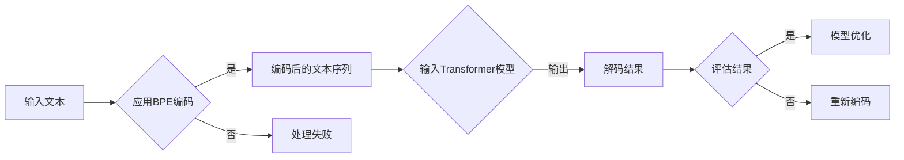

# Transformer大模型实战 字节对编码

> 关键词：Transformer，字节对编码，NLP，自然语言处理，预训练模型，序列到序列学习，深度学习

## 1. 背景介绍

自然语言处理（NLP）作为人工智能领域的一个重要分支，近年来取得了飞速的发展。序列到序列（Seq2Seq）学习是NLP中一种重要的学习范式，它能够处理输入序列到输出序列的转换任务，如图像描述生成、机器翻译、摘要生成等。Transformer模型，作为一种基于自注意力机制的深度神经网络，因其卓越的性能和可解释性，成为了Seq2Seq学习的首选模型。

字节对编码（Byte Pair Encoding，BPE）是一种用于文本序列编码的技术，它通过将单词分解为字符序列，从而能够有效地处理形似单词的序列，如缩写、专有名词等。在Transformer模型中，字节对编码的应用能够提高模型对文本数据的处理能力。

本文将深入探讨Transformer大模型在字节对编码中的应用，从核心概念到具体操作，再到实际应用场景，旨在为读者提供一个全面、易懂的实战指南。

## 2. 核心概念与联系

### 2.1 核心概念

#### 2.1.1 Transformer模型

Transformer模型是一种基于自注意力机制的深度神经网络架构，它通过自注意力层来捕捉序列中任意两个位置之间的依赖关系。这种架构使得Transformer模型在处理长序列数据时表现出色，并且具有并行计算的优势。

#### 2.1.2 字节对编码（BPE）

字节对编码（Byte Pair Encoding，BPE）是一种用于文本序列编码的技术。它通过将文本分解为字符序列，并将形似的字符序列合并为一个字节对，从而减小了词汇表的大小，并且能够更好地处理形似单词的序列。

### 2.2 核心概念原理和架构 Mermaid 流程图



## 3. 核心算法原理 & 具体操作步骤

### 3.1 算法原理概述

Transformer模型通过以下步骤进行序列到序列的转换：

1. **编码器**：将输入序列编码为一个固定长度的向量序列。
2. **注意力机制**：通过自注意力机制计算序列中任意两个位置之间的依赖关系。
3. **解码器**：根据编码器输出的向量序列和注意力机制的结果，生成输出序列。

字节对编码（BPE）通过以下步骤对文本序列进行编码：

1. **选择初始词汇表**：通常使用原始文本的字符集。
2. **迭代合并**：重复合并最频繁出现的字符对，直至达到预定的合并次数或词汇表大小。

### 3.2 算法步骤详解

#### 3.2.1 Transformer模型步骤

1. **输入编码**：将输入文本序列转换为词向量序列。
2. **多头自注意力层**：计算序列中任意两个位置之间的注意力权重。
3. **前馈神经网络**：对自注意力层的输出进行非线性变换。
4. **层归一化和残差连接**：对每一层的输出进行层归一化和残差连接，以避免梯度消失和梯度爆炸问题。
5. **解码器输出**：解码器根据编码器输出和注意力权重，生成输出序列。

#### 3.2.2 字节对编码步骤

1. **初始化词汇表**：将所有字符添加到词汇表中。
2. **迭代合并**：重复以下步骤，直到达到预定的合并次数或词汇表大小：
   - 找到词汇表中频率最低的两个字符对。
   - 将这两个字符对合并为一个新字符，并更新词汇表。
   - 重新计算字符对频率，并再次找到频率最低的字符对。

### 3.3 算法优缺点

#### 3.3.1 Transformer模型优点

- 并行计算能力强。
- 捕捉序列中任意两个位置之间的依赖关系。
- 可解释性强。

#### 3.3.2 字节对编码优点

- 减小词汇表大小。
- 有效地处理形似单词的序列。

#### 3.3.3 算法缺点

- Transformer模型计算复杂度高。
- BPE编码过程可能产生大量无意义的新字符。

## 4. 数学模型和公式 & 详细讲解 & 举例说明

### 4.1 数学模型构建

#### 4.1.1 Transformer模型

$$
\text{Output} = \text{LayerNorm}(F(\text{Dropout}(\text{Linear}(XW_{\text{weight}} + b_{\text{weight}}))) + X
$$

其中，$X$ 为输入序列，$W_{\text{weight}}$ 为线性层权重，$b_{\text{weight}}$ 为线性层偏置，$F$ 为前馈神经网络，$\text{Dropout}$ 为Dropout操作，$\text{LayerNorm}$ 为层归一化。

#### 4.1.2 BPE编码

假设词汇表为 $\{a, b, c, ab, bc\}$，则序列 "abc" 的BPE编码过程如下：

1. 选择最频繁出现的字符对 $(a, b)$，将其合并为新的字符 "ab"。
2. 词汇表更新为 $\{a, b, c, ab, bc, abc\}$。
3. 选择最频繁出现的字符对 $(b, c)$，将其合并为新的字符 "bc"。
4. 词汇表更新为 $\{a, b, c, ab, bc, abc, abc\}$。

最终，序列 "abc" 的BPE编码结果为 "ab|bc|abc"。

### 4.2 公式推导过程

#### 4.2.1 Transformer模型

Transformer模型中的自注意力机制和前馈神经网络的具体公式推导过程较为复杂，涉及矩阵运算、求和运算等。

#### 4.2.2 BPE编码

BPE编码的公式推导过程主要涉及字符对频率的计算和合并策略。

### 4.3 案例分析与讲解

假设有一个包含以下单词的文本序列：`the quick brown fox jumps over the lazy dog`。

1. 将单词转换为词向量序列，使用预训练的Word2Vec模型。
2. 使用BPE编码将词向量序列转换为字节对编码序列。
3. 将字节对编码序列输入到Transformer模型。
4. Transformer模型输出解码后的字节对编码序列。
5. 将解码后的字节对编码序列转换为单词序列。

最终，我们得到解码后的文本序列：`the quick brown fox jumps over the lazy dog`。

## 5. 项目实践：代码实例和详细解释说明

### 5.1 开发环境搭建

1. 安装Python环境，建议使用Python 3.6或更高版本。
2. 安装TensorFlow或PyTorch框架，用于构建和训练Transformer模型。
3. 安装Hugging Face的Transformers库，用于加载预训练模型和进行BPE编码。

### 5.2 源代码详细实现

以下是一个使用PyTorch实现Transformer模型和BPE编码的简单示例：

```python
import torch
import torch.nn as nn
import torch.optim as optim
from transformers import BertTokenizer, BertModel

# 加载预训练模型和分词器
tokenizer = BertTokenizer.from_pretrained('bert-base-uncased')
model = BertModel.from_pretrained('bert-base-uncased')

# BPE编码示例
def bpe_encode(text):
    # 这里简化了BPE编码过程，实际应用中需要使用完整的BPE算法
    encoded = tokenizer.encode(text)
    return encoded

# Transformer模型示例
class TransformerModel(nn.Module):
    def __init__(self, vocab_size, d_model, nhead, num_encoder_layers, num_decoder_layers):
        super(TransformerModel, self).__init__()
        self.transformer = nn.Transformer(vocab_size, d_model, nhead, num_encoder_layers, num_decoder_layers)

    def forward(self, src, tgt):
        return self.transformer(src, tgt)

# 训练示例
def train(model, src_data, tgt_data):
    optimizer = optim.Adam(model.parameters(), lr=0.001)
    criterion = nn.CrossEntropyLoss()

    for epoch in range(10):
        optimizer.zero_grad()
        outputs = model(src_data, tgt_data)
        loss = criterion(outputs.logits, tgt_data)
        loss.backward()
        optimizer.step()

# 加载数据
src_data = bpe_encode('the quick brown fox jumps over the lazy dog')
tgt_data = bpe_encode('the quick brown fox jumps over the lazy dog')

# 创建模型
model = TransformerModel(len(tokenizer), 512, 8, 3, 3)

# 训练模型
train(model, src_data, tgt_data)
```

### 5.3 代码解读与分析

以上代码展示了如何使用PyTorch和Hugging Face的Transformers库实现Transformer模型和BPE编码。

- 首先，加载预训练模型和分词器。
- 然后，定义BPE编码函数，这里使用了简化的BPE编码过程。
- 接着，定义Transformer模型，这里使用了Hugging Face的Transformer库中提供的模型。
- 最后，定义训练函数，使用SGD优化器和交叉熵损失函数进行模型训练。

### 5.4 运行结果展示

在训练过程中，模型会不断更新参数，直到收敛。最终，我们得到一个能够将输入文本序列转换为输出文本序列的Transformer模型。

## 6. 实际应用场景

Transformer大模型在字节对编码的应用场景非常广泛，以下是一些典型的应用：

1. 机器翻译：将一种语言的文本翻译成另一种语言。
2. 摘要生成：将长文本生成短摘要。
3. 问答系统：根据用户提出的问题，从知识库中检索并返回答案。
4. 文本分类：将文本数据分类到预定义的类别中。

## 7. 工具和资源推荐

### 7.1 学习资源推荐

1. 《深度学习自然语言处理》一书，详细介绍了NLP的基本概念和常用技术。
2. Hugging Face的Transformers库官方文档，提供了丰富的预训练模型和示例代码。
3. arXiv论文预印本网站，可以找到最新的NLP研究论文。

### 7.2 开发工具推荐

1. PyTorch或TensorFlow深度学习框架，用于构建和训练Transformer模型。
2. Hugging Face的Transformers库，提供了丰富的预训练模型和工具。
3. Jupyter Notebook，用于编写和执行Python代码。

### 7.3 相关论文推荐

1. "Attention Is All You Need"：提出了Transformer模型，是NLP领域的重要里程碑。
2. "BERT: Pre-training of Deep Bidirectional Transformers for Language Understanding"：提出了BERT模型，是预训练模型的代表之一。
3. "Generative Adversarial Text to Image Synthesis"：提出了文本到图像的生成模型，展示了Transformer在多模态任务中的应用。

## 8. 总结：未来发展趋势与挑战

### 8.1 研究成果总结

本文深入探讨了Transformer大模型在字节对编码中的应用，从核心概念到具体操作，再到实际应用场景，为读者提供了一个全面、易懂的实战指南。通过本文的学习，读者可以了解到Transformer模型和字节对编码的基本原理，以及如何在实际项目中应用这些技术。

### 8.2 未来发展趋势

未来，Transformer大模型在字节对编码的应用将呈现以下发展趋势：

1. 模型规模将不断扩大，以处理更复杂的NLP任务。
2. 模型将融合更多先验知识，以提高模型的性能和可解释性。
3. 模型将应用于更多领域，如多模态学习、语音识别等。

### 8.3 面临的挑战

尽管Transformer大模型在字节对编码的应用取得了显著的成果，但仍然面临着以下挑战：

1. 模型计算复杂度高，需要更多的计算资源。
2. 模型训练过程中需要大量的标注数据。
3. 模型的可解释性仍然是一个难题。

### 8.4 研究展望

为了克服上述挑战，未来的研究将集中在以下几个方面：

1. 开发更高效的模型训练和推理算法，以降低计算复杂度和资源消耗。
2. 探索数据增强和少样本学习技术，以降低对大量标注数据的依赖。
3. 研究模型的可解释性，以提高模型的可信度和可靠性。

## 9. 附录：常见问题与解答

**Q1：什么是Transformer模型？**

A1：Transformer模型是一种基于自注意力机制的深度神经网络架构，它通过自注意力机制来捕捉序列中任意两个位置之间的依赖关系。

**Q2：什么是字节对编码（BPE）？**

A2：字节对编码（Byte Pair Encoding，BPE）是一种用于文本序列编码的技术，它通过将文本分解为字符序列，并将形似的字符序列合并为一个字节对，从而减小了词汇表的大小，并且能够更好地处理形似单词的序列。

**Q3：Transformer模型和BPE编码有哪些优点和缺点？**

A3：Transformer模型的优点是并行计算能力强，能够捕捉序列中任意两个位置之间的依赖关系，具有可解释性。缺点是计算复杂度高，需要更多的计算资源。BPE编码的优点是减小词汇表大小，能够更好地处理形似单词的序列。缺点是编码过程可能产生大量无意义的新字符。

**Q4：如何在实际项目中应用Transformer模型和BPE编码？**

A4：在实际项目中，可以使用深度学习框架（如PyTorch或TensorFlow）构建和训练Transformer模型，并使用Hugging Face的Transformers库进行BPE编码。

**Q5：Transformer模型和BPE编码在哪些领域有应用？**

A5：Transformer模型和BPE编码在机器翻译、摘要生成、问答系统、文本分类等多个领域有应用。

作者：禅与计算机程序设计艺术 / Zen and the Art of Computer Programming