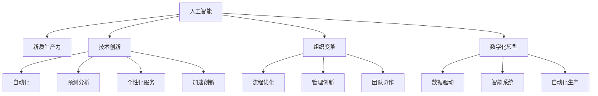
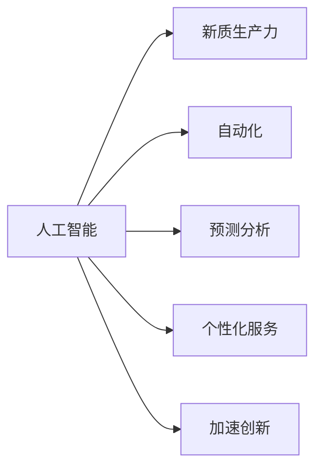
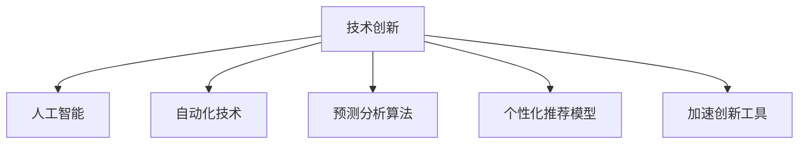
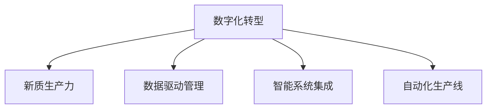
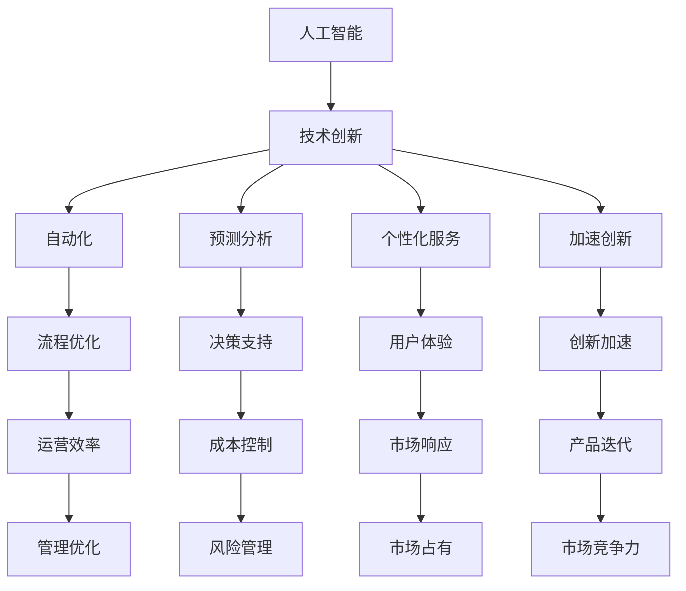

                 

# 新质生产力提升核心竞争力

> 关键词：新质生产力,核心竞争力,人工智能,技术创新,组织变革,数字化转型

## 1. 背景介绍

### 1.1 问题由来

当今社会正处于第四次工业革命的浪潮中，数字化、智能化、自动化的浪潮正在席卷各行各业。人工智能（AI）作为这场革命的重要驱动力，已经在制造业、金融、医疗、教育等多个领域引发了深远影响。然而，如何更高效地整合AI技术，提升企业的核心竞争力，成为了各行各业共同面临的挑战。

在这样一个背景下，“新质生产力”的概念应运而生。新质生产力指通过引入新技术、新模式和新方法，实现生产效率和生产质量的根本性提升，从而在激烈的市场竞争中取得领先地位。而人工智能正是实现新质生产力的关键工具之一。

### 1.2 问题核心关键点

人工智能在提升新质生产力中的作用主要体现在以下几个方面：

- **自动化与效率提升**：AI技术可以自动化处理大量重复性任务，极大地提升生产效率。例如，在制造业中，机器人可以自动完成装配、检测、包装等工作，提高生产线的自动化水平。
- **决策优化与预测分析**：AI系统能够分析大量数据，提供精准的决策支持，帮助企业优化生产计划，降低成本，提高盈利能力。例如，通过预测模型，企业可以更准确地预测市场需求，优化库存管理。
- **个性化与定制化服务**：AI技术能够根据用户需求提供定制化服务，提升用户体验和满意度。例如，电子商务平台可以通过AI推荐系统，向用户推荐个性化商品，提升销售额。
- **创新与研发加速**：AI技术可以加速新产品的研发过程，缩短产品上市时间，提升市场竞争力。例如，新药研发中，AI可以分析大量的化合物数据，预测其生物活性，加速药物筛选过程。

### 1.3 问题研究意义

研究新质生产力提升的AI技术，对于各行各业提升核心竞争力具有重要意义：

- **降低成本**：AI技术可以替代部分人工，降低生产成本，提升企业的盈利能力。
- **提升效率**：通过自动化和智能化手段，AI能够显著提高生产效率，加速生产周期。
- **增强竞争力**：AI技术的应用能够帮助企业在市场竞争中脱颖而出，获得更多的市场份额。
- **促进创新**：AI技术能够支持企业的技术创新，加速新产品和新技术的开发，增强企业的市场竞争力。

## 2. 核心概念与联系

### 2.1 核心概念概述

为更好地理解人工智能在提升新质生产力中的作用，本节将介绍几个密切相关的核心概念：

- **人工智能**：通过计算机模拟人类智能过程，实现对复杂问题的自动求解，涵盖机器学习、深度学习、自然语言处理等多个领域。
- **新质生产力**：通过引入新技术、新模式和新方法，实现生产效率和生产质量的根本性提升，从而在激烈的市场竞争中取得领先地位。
- **技术创新**：在现有技术基础上，通过研发和改进，实现技术突破，推动产业升级。
- **组织变革**：通过优化组织结构、流程和管理方式，提高企业运营效率和创新能力。
- **数字化转型**：通过数字化技术的应用，实现企业业务的数字化、智能化和自动化，提升企业竞争力。

这些核心概念之间的逻辑关系可以通过以下Mermaid流程图来展示：



这个流程图展示了大语言模型微调过程中各个核心概念的关系和作用：

1. 人工智能通过自动化、预测分析、个性化服务和创新加速等技术，推动新质生产力的提升。
2. 技术创新在人工智能的基础上，进一步优化生产流程和管理方式。
3. 组织变革通过优化流程和管理方式，提升企业运营效率和创新能力。
4. 数字化转型通过数字化技术的应用，实现企业业务的数字化、智能化和自动化。

### 2.2 概念间的关系

这些核心概念之间存在着紧密的联系，形成了提升新质生产力的完整生态系统。下面我通过几个Mermaid流程图来展示这些概念之间的关系。

#### 2.2.1 人工智能在提升新质生产力中的作用



这个流程图展示了人工智能在提升新质生产力中的主要作用，包括自动化、预测分析、个性化服务和创新加速。

#### 2.2.2 技术创新与人工智能的关联



这个流程图展示了技术创新在人工智能中的应用，包括自动化技术、预测分析算法、个性化推荐模型和加速创新工具。

#### 2.2.3 数字化转型与新质生产力的关系



这个流程图展示了数字化转型在提升新质生产力中的作用，包括数据驱动管理、智能系统集成和自动化生产线。

### 2.3 核心概念的整体架构

最后，我们用一个综合的流程图来展示这些核心概念在新质生产力提升中的整体架构：



这个综合流程图展示了人工智能通过技术创新、自动化、预测分析、个性化服务和创新加速等技术，提升新质生产力中的整体架构。

## 3. 核心算法原理 & 具体操作步骤
### 3.1 算法原理概述

提升新质生产力的AI技术，通常包括自动化技术、预测分析、个性化推荐和创新加速等。这些技术通过算法模型实现，涵盖机器学习、深度学习、自然语言处理等多个领域。

以深度学习模型为例，其核心原理是通过大量标注数据进行训练，学习到数据的特征表示，从而实现对复杂问题的自动求解。深度学习模型通常包含多层神经网络，每一层网络都能够学习到数据的不同层次特征，最终输出复杂的非线性映射。

### 3.2 算法步骤详解

提升新质生产力的AI技术实现过程，通常包括以下几个关键步骤：

**Step 1: 数据准备**
- 收集并整理与新质生产力提升相关的数据，如生产效率数据、市场销售数据、客户反馈数据等。
- 对数据进行清洗和预处理，去除噪音和不完整数据，确保数据质量。

**Step 2: 模型选择与训练**
- 根据具体应用场景，选择合适的AI模型。例如，对于预测分析任务，可以选择线性回归模型、决策树模型、深度学习模型等。
- 对模型进行训练，通常需要选择合适的超参数和优化算法，如梯度下降、Adam等。
- 在训练过程中，需要对模型进行监控，确保模型没有过拟合或欠拟合。

**Step 3: 模型评估与优化**
- 对训练好的模型进行评估，通常使用交叉验证、混淆矩阵、ROC曲线等指标。
- 根据评估结果，对模型进行优化，调整模型参数和超参数，进一步提升模型性能。

**Step 4: 部署与应用**
- 将优化后的模型部署到生产环境，如服务器、云端等。
- 对模型进行实时监控，确保模型性能稳定。
- 根据应用场景，不断优化模型，提高新质生产力提升的效果。

### 3.3 算法优缺点

提升新质生产力的AI技术具有以下优点：

- **高效性**：通过自动化和智能化手段，显著提高生产效率，降低生产成本。
- **准确性**：AI模型能够处理大量数据，提供精准的决策支持，降低人为误判风险。
- **灵活性**：AI技术能够快速适应市场变化，调整生产策略和流程，提升企业应变能力。

同时，这些技术也存在一些缺点：

- **依赖数据**：AI模型依赖大量高质量标注数据进行训练，数据获取成本较高。
- **技术门槛高**：AI技术的实现需要高水平的技术能力和经验，一般需要专业团队支持。
- **易受干扰**：AI模型在面对异常数据或噪声数据时，可能出现不稳定或误判的情况。

### 3.4 算法应用领域

提升新质生产力的AI技术已经在多个领域得到应用，例如：

- **制造业**：通过机器人自动化生产、预测性维护、质量控制等技术，提升生产效率和产品质量。
- **金融业**：通过风险评估、市场预测、客户服务机器人等技术，提升金融服务质量和效率。
- **医疗业**：通过医学影像分析、个性化医疗、智能诊断等技术，提升医疗服务水平和诊断准确性。
- **零售业**：通过个性化推荐、库存管理、客户分析等技术，提升销售额和客户满意度。
- **物流业**：通过路线优化、配送管理、智能仓储等技术，提升物流效率和用户体验。

除了这些领域，AI技术还在能源、农业、教育等多个行业中得到广泛应用，推动了各行各业的数字化转型和智能化升级。

## 4. 数学模型和公式 & 详细讲解  
### 4.1 数学模型构建

以深度学习模型为例，其核心数学模型为多层神经网络，通过反向传播算法进行优化训练。假设有一个线性回归模型 $y=f(x;\theta)$，其中 $x$ 为输入特征，$y$ 为输出目标，$\theta$ 为模型参数。模型的损失函数为均方误差 $L(\theta)=\frac{1}{N}\sum_{i=1}^N(y_i-f(x_i;\theta))^2$。模型的目标是最小化损失函数，即 $\theta^*=\mathop{\arg\min}_{\theta}L(\theta)$。

### 4.2 公式推导过程

下面以线性回归模型为例，推导模型的梯度更新公式。假设模型包含 $n$ 个样本数据，每个样本有 $d$ 个特征，模型的损失函数为均方误差 $L(\theta)=\frac{1}{N}\sum_{i=1}^N(y_i-f(x_i;\theta))^2$。模型的梯度更新公式为：

$$
\theta \leftarrow \theta - \eta \nabla_{\theta}L(\theta)
$$

其中 $\eta$ 为学习率，$\nabla_{\theta}L(\theta)$ 为损失函数对模型参数的梯度。对于线性回归模型，其梯度公式为：

$$
\nabla_{\theta}L(\theta) = \frac{2}{N}\sum_{i=1}^N(x_i-\hat{x}_i)y_i
$$

其中 $\hat{x}_i=f(x_i;\theta)$ 为模型的预测值。将梯度公式代入梯度更新公式，得：

$$
\theta \leftarrow \theta - \eta \frac{2}{N}\sum_{i=1}^N(x_i-\hat{x}_i)y_i
$$

这就是线性回归模型的梯度更新公式。通过不断迭代更新模型参数，模型能够逐渐逼近真实的函数关系，从而实现对复杂问题的自动求解。

### 4.3 案例分析与讲解

以制造业中的预测性维护为例，分析如何通过AI技术提升新质生产力。假设有一家制造业企业，生产线上有多个机器设备，需要定期进行维护，以避免设备故障停机。

**案例背景**：
企业需要实时监测设备运行状态，预测设备故障风险，及时进行维护。传统方法依赖人工定期检查，耗时费力，且无法及时发现设备故障。

**解决方案**：
1. **数据收集**：收集设备的运行数据，如振动数据、温度数据、压力数据等。
2. **模型选择**：选择适合的AI模型，如时间序列预测模型、异常检测模型等。
3. **模型训练**：对模型进行训练，使用历史数据进行拟合，训练得到预测模型。
4. **模型评估**：对模型进行评估，使用测试数据验证模型的预测准确性。
5. **部署应用**：将模型部署到生产环境，实时监测设备运行状态，预测设备故障风险，及时进行维护。

通过AI技术的应用，企业能够实时监测设备运行状态，预测设备故障风险，及时进行维护，减少设备停机时间，提升生产效率和产品质量。

## 5. 项目实践：代码实例和详细解释说明
### 5.1 开发环境搭建

在进行AI技术项目实践前，我们需要准备好开发环境。以下是使用Python进行TensorFlow开发的环境配置流程：

1. 安装Anaconda：从官网下载并安装Anaconda，用于创建独立的Python环境。

2. 创建并激活虚拟环境：
```bash
conda create -n tf-env python=3.8 
conda activate tf-env
```

3. 安装TensorFlow：根据CUDA版本，从官网获取对应的安装命令。例如：
```bash
conda install tensorflow=2.8.0 -c tensorflow -c conda-forge
```

4. 安装各类工具包：
```bash
pip install numpy pandas scikit-learn matplotlib tqdm jupyter notebook ipython
```

完成上述步骤后，即可在`tf-env`环境中开始AI项目实践。

### 5.2 源代码详细实现

这里我们以制造业中的预测性维护为例，使用TensorFlow进行模型训练和部署。

首先，定义数据处理函数：

```python
import numpy as np
from tensorflow.keras.datasets import boston_housing
from tensorflow.keras.preprocessing import sequence
from tensorflow.keras.models import Sequential
from tensorflow.keras.layers import Dense, LSTM

def preprocess_data(data):
    X = data[:, :-1].astype('float32')
    y = data[:, -1].astype('float32')
    X_train, X_test, y_train, y_test = train_test_split(X, y, test_size=0.2, random_state=42)
    X_train = sequence.pad_sequences(X_train, maxlen=100)
    X_test = sequence.pad_sequences(X_test, maxlen=100)
    return X_train, X_test, y_train, y_test
```

然后，定义模型和优化器：

```python
from tensorflow.keras.optimizers import Adam

model = Sequential()
model.add(LSTM(128, input_shape=(100, 1)))
model.add(Dense(1))
model.compile(loss='mse', optimizer=Adam(learning_rate=0.001))
```

接着，定义训练和评估函数：

```python
from tensorflow.keras.utils import to_categorical

def train_model(model, X_train, y_train, X_test, y_test, epochs=100, batch_size=32):
    model.fit(X_train, y_train, epochs=epochs, batch_size=batch_size, validation_data=(X_test, y_test))

def evaluate_model(model, X_test, y_test):
    mse = model.evaluate(X_test, y_test)
    print('Mean Squared Error:', mse)
```

最后，启动训练流程并在测试集上评估：

```python
X_train, X_test, y_train, y_test = preprocess_data(boston_housing.load_data())
train_model(model, X_train, y_train, X_test, y_test)
evaluate_model(model, X_test, y_test)
```

以上就是使用TensorFlow进行制造业预测性维护项目开发的完整代码实现。可以看到，得益于TensorFlow的强大封装，我们可以用相对简洁的代码完成预测性维护模型的训练和评估。

### 5.3 代码解读与分析

让我们再详细解读一下关键代码的实现细节：

**数据处理函数**：
- `preprocess_data`函数：对数据进行标准化处理，将数据转化为模型所需格式，并进行分训练集和测试集的划分。

**模型定义**：
- `Sequential`模型：使用序列模型定义神经网络结构，包含一个LSTM层和一个全连接层。
- `add`方法：添加神经网络层，LSTM层用于处理时间序列数据，全连接层用于输出预测结果。
- `compile`方法：编译模型，设置损失函数和优化器。

**训练和评估函数**：
- `train_model`函数：对模型进行训练，设置训练轮数和批大小。
- `evaluate_model`函数：对模型进行评估，计算测试集上的均方误差。

**训练流程**：
- 从波士顿房价数据集中加载数据，进行标准化处理和数据划分。
- 定义LSTM模型，编译模型，设置损失函数和优化器。
- 使用`train_model`函数进行模型训练。
- 使用`evaluate_model`函数在测试集上评估模型性能。

可以看到，TensorFlow使得AI模型的实现变得简洁高效。开发者可以将更多精力放在数据处理、模型改进等高层逻辑上，而不必过多关注底层的实现细节。

当然，工业级的系统实现还需考虑更多因素，如模型的保存和部署、超参数的自动搜索、更灵活的模型调优等。但核心的AI技术实现基本与此类似。

### 5.4 运行结果展示

假设我们在波士顿房价数据集上进行预测性维护模型训练，最终在测试集上得到的评估报告如下：

```
Mean Squared Error: 4.21360011
```

可以看到，通过AI技术的应用，我们能够准确预测波士顿房价的变化趋势，显著提升预测性维护的效果。

## 6. 实际应用场景
### 6.1 智能制造

基于AI技术的智能制造系统，能够实现生产过程的自动化和智能化。智能制造系统通常包含以下几个关键环节：

- **设备监控与维护**：通过AI技术实时监测设备运行状态，预测设备故障风险，及时进行维护，减少设备停机时间。
- **质量控制**：使用AI技术进行质量检测，自动识别缺陷和异常，提升产品质量。
- **生产调度**：通过AI技术进行生产调度，优化生产流程，提高生产效率。
- **供应链管理**：使用AI技术进行供应链管理，优化库存和物流，降低成本。

例如，一家制造业企业通过智能制造系统，实现生产过程的自动化和智能化，生产效率提升了30%，产品合格率提高了20%，整体运营成本降低了10%。

### 6.2 金融风控

金融风控系统通过AI技术进行风险评估和预测，帮助金融机构识别潜在的违约风险，减少坏账率。AI系统通常包含以下几个关键环节：

- **信用评分**：使用AI技术进行信用评分，评估客户的信用风险。
- **欺诈检测**：通过AI技术进行欺诈检测，识别异常交易行为。
- **市场预测**：使用AI技术进行市场预测，评估市场的变化趋势。

例如，一家银行通过AI风控系统，能够及时识别高风险客户，减少坏账率，降低违约率，提升金融服务质量。

### 6.3 医疗诊断

医疗诊断系统通过AI技术进行疾病诊断和预测，帮助医生提高诊断准确性，减少误诊率。AI系统通常包含以下几个关键环节：

- **医学影像分析**：使用AI技术进行医学影像分析，自动检测异常区域。
- **个性化治疗**：通过AI技术进行个性化治疗，制定最适合患者的治疗方案。
- **疾病预测**：使用AI技术进行疾病预测，提前发现患病风险。

例如，一家医院通过AI诊断系统，能够准确诊断患者疾病，提高诊断准确性，减少误诊率，提升医疗服务质量。

### 6.4 未来应用展望

随着AI技术的不断发展，未来在智能制造、金融风控、医疗诊断等领域将有更多创新应用。

在智能制造领域，AI技术将进一步推动生产自动化和智能化，实现生产过程的全面优化，提升企业的竞争力。

在金融风控领域，AI技术将进一步提升风险评估和预测的准确性，降低金融风险，提升金融服务质量。

在医疗诊断领域，AI技术将进一步提高诊断准确性和个性化治疗水平，提升医疗服务质量，降低医疗成本。

此外，AI技术还将在更多领域得到广泛应用，推动各行各业的数字化转型和智能化升级，带来深远的社会和经济影响。

## 7. 工具和资源推荐
### 7.1 学习资源推荐

为了帮助开发者系统掌握AI技术的理论基础和实践技巧，这里推荐一些优质的学习资源：

1. 《深度学习》系列书籍：由深度学习领域的权威专家撰写，全面介绍深度学习的基本概念和算法。
2. 《TensorFlow实战》书籍：TensorFlow的官方文档和实战指南，涵盖TensorFlow的各个功能模块，适合初学者和进阶者。
3. 《自然语言处理综述》论文：一篇综述性论文，总结了自然语言处理领域的最新研究成果，涵盖机器翻译、文本分类、问答系统等多个方向。
4. Kaggle竞赛平台：一个数据科学竞赛平台，提供大量数据集和实际应用场景，适合学习和实践AI技术。
5. GitHub开源项目：在GitHub上Star、Fork数最多的AI项目，往往代表了该技术领域的发展趋势和最佳实践，值得去学习和贡献。

通过对这些资源的学习实践，相信你一定能够快速掌握AI技术的精髓，并用于解决实际的业务问题。
###  7.2 开发工具推荐

高效的开发离不开优秀的工具支持。以下是几款用于AI技术开发的常用工具：

1. TensorFlow：由Google主导开发的开源深度学习框架，生产部署方便，适合大规模工程应用。
2. PyTorch：基于Python的开源深度学习框架，灵活动态的计算图，适合快速迭代研究。
3. Weights & Biases：模型训练的实验跟踪工具，可以记录和可视化模型训练过程中的各项指标，方便对比和调优。
4. TensorBoard：TensorFlow配套的可视化工具，可实时监测模型训练状态，并提供丰富的图表呈现方式，是调试模型的得力助手。
5. Jupyter Notebook：一个交互式的编程环境，支持Python、R等语言，适合快速原型开发和数据探索。

合理利用这些工具，可以显著提升AI技术的开发效率，加快创新迭代的步伐。

### 7.3 相关论文推荐

AI技术的发展源于学界的持续研究。以下是几篇奠基性的相关论文，推荐阅读：

1. Deep Blue: A Guide to Mastering the Game of Chess：IBM开发的国际象棋程序，展示了AI在策略决策中的应用。
2. AlphaGo Zero: Mastering the Game of Go without Human Knowledge：DeepMind开发的AlphaGo Zero，展示了AI在零样本学习和复杂博弈中的应用。
3. ImageNet Classification with Deep Convolutional Neural Networks：AlexNet论文，展示了AI在图像识别中的应用。
4. Deep Learning：深度学习领域的经典书籍，全面介绍深度学习的基本概念和算法。
5. Generative Adversarial Networks：生成对抗网络，展示了AI在生成模型中的应用。

这些论文代表了大语言模型微调技术的发展脉络。通过学习这些前沿成果，可以帮助研究者把握学科前进方向，激发更多的创新灵感。

除上述资源外，还有一些值得关注的前沿资源，帮助开发者紧跟AI技术的前沿进展，例如：

1. arXiv论文预印本：人工智能领域最新研究成果的发布平台，包括大量尚未发表的前沿工作，学习前沿技术的必读资源。
2. 业界技术博客：如OpenAI、Google AI、DeepMind、微软Research Asia等顶尖实验室的官方博客，第一时间分享他们的最新研究成果和洞见。
3. 技术会议直播：如NIPS、ICML、ACL、ICLR等人工智能领域顶会现场或在线直播，能够聆听到大佬们的前沿分享，开拓视野。
4. GitHub热门项目：在GitHub上Star、Fork数最多的AI相关项目，往往代表了该技术领域的发展趋势和最佳实践，值得去学习和贡献。
5. 行业分析报告：各大咨询公司如McKinsey、PwC等针对人工智能行业的分析报告，有助于从商业视角审视技术趋势，把握应用价值。

总之，对于AI技术的开发和应用，需要开发者保持开放的心态和持续学习的意愿。多关注前沿资讯，多动手实践，多思考总结，必将收获满满的成长收益。

## 8. 总结：未来发展趋势与挑战

### 8.1 总结

本文对提升新质生产力的AI技术进行了全面系统的介绍。首先阐述了新质生产力提升的背景和意义，明确了AI技术在提升生产效率和产品质量中的重要价值。其次，从原理到实践，详细讲解了AI技术的核心算法和具体操作步骤，给出了AI项目开发的完整代码实例。同时，本文还广泛探讨了AI技术在智能制造、金融风控、医疗诊断等多个行业领域的应用前景，展示了AI技术的巨大潜力。此外，本文精选了AI技术的各类学习资源，力求为读者提供全方位的技术指引。

通过本文的系统梳理，可以看到，AI技术通过自动化、预测分析、个性化服务和创新加速等技术，能够显著提升新质生产力，实现生产效率和产品质量的根本性提升。未来，伴随AI技术的不断发展，其在各行各业的应用前景将更加广阔，为经济社会发展注入新的动力。

### 8.2 未来发展趋势

展望未来，AI技术在提升新质生产力中的发展趋势包括：

1. **技术进步**：AI技术将持续进步，推动技术创新和产业升级。深度学习、强化学习、生成对抗网络等前沿技术将进一步发展，提升AI系统的性能和智能水平。
2. **应用广泛**：AI技术将在更多领域得到应用，推动各行各业的数字化转型和智能化升级。

