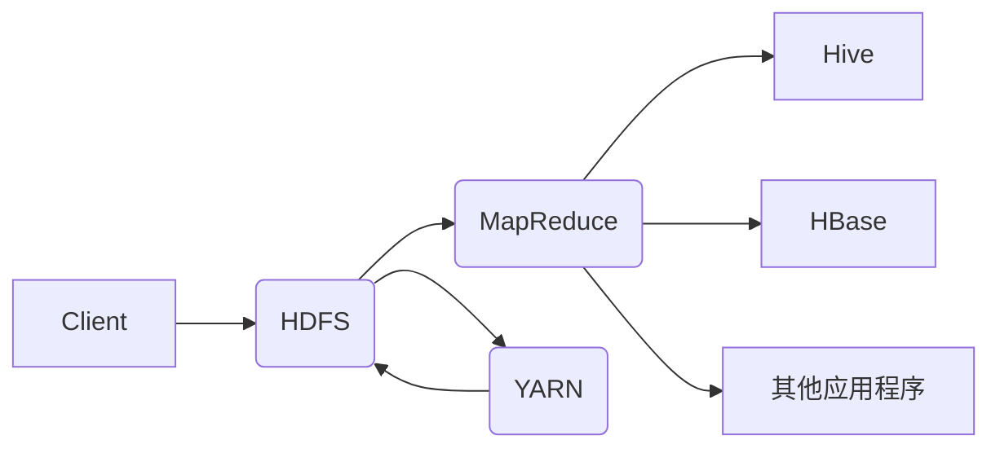

# Hadoop原理与代码实例讲解

> 关键词：Hadoop、分布式计算、HDFS、MapReduce、YARN、数据湖、大数据处理

## 1. 背景介绍

随着互联网和物联网的快速发展，数据量呈爆炸式增长，如何高效地处理海量数据成为了一个亟待解决的问题。Hadoop作为一种分布式计算框架，成为了大数据处理领域的基石。本文将深入讲解Hadoop的原理，并通过代码实例展示其应用。

### 1.1 问题的由来

在传统的关系型数据库中，随着数据量的增加，查询和处理效率会急剧下降。为了解决这个问题，分布式数据库和计算框架应运而生。Hadoop作为其中最具代表性的技术，以其高效、可扩展、可容错的特点，成为大数据处理的首选框架。

### 1.2 研究现状

Hadoop经过多年的发展，已经形成了成熟的技术生态。Hadoop 2.x版本引入了YARN（Yet Another Resource Negotiator）作为资源管理器，进一步提高了框架的灵活性和可扩展性。此外，Hadoop生态中还包含了HDFS（Hadoop Distributed File System）、HBase、Spark等众多组件，共同构成了一个强大的数据处理平台。

### 1.3 研究意义

Hadoop及其生态组件在各个行业都有着广泛的应用，如搜索引擎、社交网络、金融分析、医疗健康等。掌握Hadoop原理和代码实例，对于从事大数据相关工作的开发者来说至关重要。

### 1.4 本文结构

本文将按照以下结构进行讲解：

- 第2章：介绍Hadoop的核心概念与联系。
- 第3章：讲解Hadoop的核心算法原理与具体操作步骤。
- 第4章：介绍Hadoop的数学模型和公式，并举例说明。
- 第5章：通过代码实例讲解Hadoop的实际应用。
- 第6章：探讨Hadoop的实际应用场景和未来展望。
- 第7章：推荐Hadoop相关的学习资源、开发工具和参考文献。
- 第8章：总结Hadoop的发展趋势与挑战。
- 第9章：附录，提供常见问题与解答。

## 2. 核心概念与联系

### 2.1 核心概念

Hadoop的核心概念包括：

- **HDFS (Hadoop Distributed File System)**：Hadoop的分布式文件系统，用于存储海量数据。
- **MapReduce**：Hadoop的核心计算框架，用于并行处理大规模数据集。
- **YARN (Yet Another Resource Negotiator)**：Hadoop的资源管理器，负责管理集群资源，并为应用程序分配资源。
- **Hive**：基于Hadoop的数据仓库工具，用于数据分析和查询。
- **HBase**：Hadoop生态中的NoSQL数据库，用于存储非结构化和半结构化数据。

### 2.2 架构的 Mermaid 流程图



在上述流程图中，客户端通过HDFS存储数据，并通过MapReduce进行处理。YARN负责管理集群资源，并为MapReduce作业分配资源。Hive和HBase等组件作为Hadoop生态系统的一部分，可以与MapReduce协同工作。

## 3. 核心算法原理 & 具体操作步骤

### 3.1 算法原理概述

Hadoop的核心算法原理包括：

- **HDFS**：将文件系统分布在多个节点上，提高数据的可靠性和访问速度。
- **MapReduce**：将大数据集分割成小块，分布式地在多个节点上进行并行处理。
- **YARN**：管理集群资源，为MapReduce作业分配资源，并监控作业的执行。

### 3.2 算法步骤详解

#### 3.2.1 HDFS

1. 文件切分：将大文件切分成多个小文件，以便于分布式存储和访问。
2. 数据复制：将数据复制到多个节点上，提高数据的可靠性。
3. 数据访问：通过HDFS客户端访问数据。

#### 3.2.2 MapReduce

1. 分区：将输入数据切分成多个分区。
2. Map阶段：对每个分区进行处理，生成键值对。
3. Shuffle阶段：将Map阶段的输出按照键进行排序和分组。
4. Reduce阶段：对Shuffle阶段的输出进行聚合操作。

#### 3.2.3 YARN

1. 资源分配：根据作业需求分配资源。
2. 作业调度：将作业分配到合适的节点上执行。
3. 作业监控：监控作业的执行状态。

### 3.3 算法优缺点

#### 3.3.1 优点

- **高可靠性**：HDFS和MapReduce都支持数据的容错机制。
- **高可扩展性**：Hadoop可以很容易地扩展到数千台机器。
- **高效性**：MapReduce能够并行处理大规模数据集。

#### 3.3.2 缺点

- **复杂度高**：Hadoop的架构相对复杂，需要一定的学习成本。
- **不适合小规模任务**：MapReduce的启动开销较大，不适合小规模任务。

### 3.4 算法应用领域

Hadoop及其生态组件在以下领域有着广泛的应用：

- **大数据分析**：Hadoop生态中的Hive和HBase等工具，可以用于大规模数据分析和查询。
- **数据仓库**：Hadoop可以用于构建大数据仓库，存储和分析历史数据。
- **搜索引擎**：Hadoop可以用于构建大规模搜索引擎，如Elasticsearch。

## 4. 数学模型和公式 & 详细讲解 & 举例说明

### 4.1 数学模型构建

Hadoop中的MapReduce算法可以用以下数学模型进行描述：

$$
\text{MapReduce} = \{ \text{Map}, \text{Shuffle}, \text{Reduce} \}
$$

其中：

- Map: $f: \{ x \in X \} \rightarrow \{ (k, v) \in K \times V \}$
- Shuffle: $g: \{ (k, v) \in K \times V \} \rightarrow \{ (k, \{ v \in V \}) \}$
- Reduce: $h: \{ (k, \{ v \in V \}) \} \rightarrow \{ (k, w) \in K \times W \}$

### 4.2 公式推导过程

MapReduce的公式推导过程如下：

1. Map阶段：将输入数据 $x \in X$ 映射到键值对 $(k, v)$。
2. Shuffle阶段：将Map阶段的输出按照键 $k$ 进行排序和分组，生成 $(k, \{ v \in V \})$。
3. Reduce阶段：对Shuffle阶段的输出进行聚合操作，生成 $(k, w) \in K \times W$。

### 4.3 案例分析与讲解

假设有一个文本文件，内容如下：

```
hello world
hello hadoop
hadoop is great
```

使用Hadoop进行词频统计的MapReduce流程如下：

1. Map阶段：将文本文件切分成多个记录，并对每个记录进行处理，生成键值对 `(hello, 1)`、`(world, 1)`、`(hadoop, 1)`、`(is, 1)`、`(great, 1)`。
2. Shuffle阶段：将Map阶段的输出按照键 `k` 进行排序和分组，生成 `(hadoop, [1, 1])`、`(hello, [1, 1])`、`(world, [1, 1])`、`(is, [1, 1])`、`(great, [1, 1])`。
3. Reduce阶段：对Shuffle阶段的输出进行聚合操作，生成 `(hadoop, 2)`、`(hello, 2)`、`(world, 2)`、`(is, 2)`、`(great, 2)`。

## 5. 项目实践：代码实例和详细解释说明

### 5.1 开发环境搭建

在开始编写代码之前，需要搭建Hadoop的开发环境。以下是使用Hadoop 3.x版本的搭建步骤：

1. 下载Hadoop 3.x版本：[Hadoop 3.x下载地址](https://hadoop.apache.org/releases.html)
2. 解压下载的Hadoop包。
3. 配置环境变量：在`.bashrc`或`.bash_profile`文件中添加以下内容：

```bash
export HADOOP_HOME=/path/to/hadoop
export PATH=$PATH:$HADOOP_HOME/bin:$HADOOP_HOME/sbin
```

4. 启动Hadoop集群：

```bash
./sbin/start-dfs.sh
./sbin/start-yarn.sh
```

### 5.2 源代码详细实现

以下是一个简单的Hadoop MapReduce程序，用于统计单词频率：

```java
import org.apache.hadoop.conf.Configuration;
import org.apache.hadoop.fs.Path;
import org.apache.hadoop.io.IntWritable;
import org.apache.hadoop.io.Text;
import org.apache.hadoop.mapreduce.Job;
import org.apache.hadoop.mapreduce.Mapper;
import org.apache.hadoop.mapreduce.Reducer;
import org.apache.hadoop.mapreduce.lib.input.FileInputFormat;
import org.apache.hadoop.mapreduce.lib.output.FileOutputFormat;

public class WordCount {

  public static class TokenizerMapper
       extends Mapper<Object, Text, Text, IntWritable>{

    private final static IntWritable one = new IntWritable(1);
    private Text word = new Text();

    public void map(Object key, Text value, Context context) throws IOException, InterruptedException {
      String[] words = value.toString().split("\\s+");
      for (String word : words) {
        this.word.set(word);
        context.write(this.word, one);
      }
    }
  }

  public static class IntSumReducer
       extends Reducer<Text,IntWritable,Text,IntWritable> {
    private IntWritable result = new IntWritable();

    public void reduce(Text key, Iterable<IntWritable> values,
                       Context context
                       ) throws IOException, InterruptedException {
      int sum = 0;
      for (IntWritable val : values) {
        sum += val.get();
      }
      result.set(sum);
      context.write(key, result);
    }
  }

  public static void main(String[] args) throws Exception {
    Configuration conf = new Configuration();
    Job job = Job.getInstance(conf, "word count");
    job.setJarByClass(WordCount.class);
    job.setMapperClass(TokenizerMapper.class);
    job.setCombinerClass(IntSumReducer.class);
    job.setReducerClass(IntSumReducer.class);
    job.setOutputKeyClass(Text.class);
    job.setOutputValueClass(IntWritable.class);
    FileInputFormat.addInputPath(job, new Path(args[0]));
    FileOutputFormat.setOutputPath(job, new Path(args[1]));
    System.exit(job.waitForCompletion(true) ? 0 : 1);
  }
}
```

### 5.3 代码解读与分析

- `TokenizerMapper`类：实现MapReduce的Mapper接口，用于将输入数据切分成键值对。
- `IntSumReducer`类：实现MapReduce的Reducer接口，用于对Map阶段的输出进行聚合操作。
- `main`方法：设置作业配置、Mapper和Reducer类、输出路径等，并启动作业。

### 5.4 运行结果展示

将上述代码编译成Java类文件，并执行以下命令：

```bash
hadoop jar wordcount.jar WordCount /input /output
```

在输出路径 `/output` 中，将生成以下文件：

- `_SUCCESS`：表示作业成功完成。
- part-r-00000：包含最终的输出结果。

## 6. 实际应用场景

### 6.1 大数据分析

Hadoop及其生态组件在数据分析领域有着广泛的应用。例如，可以构建大数据分析平台，对用户行为、市场趋势、气象数据等进行分析，为企业决策提供数据支持。

### 6.2 数据仓库

Hadoop可以用于构建大数据仓库，存储和分析历史数据。例如，可以将电商平台的交易数据、用户行为数据等存储到Hadoop中，并进行数据挖掘和分析。

### 6.3 搜索引擎

Hadoop可以用于构建大规模搜索引擎，如Elasticsearch。将网页数据存储到Hadoop中，并进行索引和搜索。

## 7. 工具和资源推荐

### 7.1 学习资源推荐

- 《Hadoop权威指南》
- 《Hadoop实战》
- 《Hadoop技术内幕》
- Apache Hadoop官方文档：[https://hadoop.apache.org/docs/stable/](https://hadoop.apache.org/docs/stable/)

### 7.2 开发工具推荐

- Apache Hadoop：[https://hadoop.apache.org/](https://hadoop.apache.org/)
- Apache Hive：[https://hive.apache.org/](https://hive.apache.org/)
- Apache HBase：[https://hbase.apache.org/](https://hbase.apache.org/)
- Apache Spark：[https://spark.apache.org/](https://spark.apache.org/)

### 7.3 相关论文推荐

- The Google File System
- MapReduce: Simplified Data Processing on Large Clusters
- The Design of the Boreas Storage System
- Apache Hadoop YARN: Yet Another Resource Negotiator

## 8. 总结：未来发展趋势与挑战

### 8.1 研究成果总结

Hadoop作为大数据处理领域的基石，经过多年的发展，已经形成了成熟的技术生态。Hadoop 2.x版本引入的YARN和众多生态组件，使得Hadoop更加灵活、高效和可扩展。

### 8.2 未来发展趋势

- **更强大的数据处理能力**：随着硬件性能的提升，Hadoop将支持更大规模的数据处理。
- **更丰富的生态系统**：Hadoop生态将不断扩展，出现更多与Hadoop兼容的组件和工具。
- **云原生化**：Hadoop将逐渐走向云原生，实现更加灵活、便捷的部署方式。

### 8.3 面临的挑战

- **安全性**：随着数据量的增长，Hadoop的安全性问题日益突出，需要加强数据安全和访问控制。
- **可解释性**：Hadoop的算法和模型缺乏可解释性，需要研究如何提高模型的透明度和可解释性。
- **成本控制**：Hadoop的部署和维护成本较高，需要研究如何降低成本。

### 8.4 研究展望

未来，Hadoop及其生态将朝着以下方向发展：

- **智能化**：引入机器学习、深度学习等技术，提高Hadoop的智能化水平。
- **实时化**：支持实时数据处理，满足实时性需求。
- **轻量化**：降低Hadoop的部署和维护成本，提高其可访问性。

## 9. 附录：常见问题与解答

**Q1：Hadoop适用于哪些场景？**

A：Hadoop适用于需要处理大规模数据集的场景，如大数据分析、数据仓库、搜索引擎等。

**Q2：Hadoop有哪些优点？**

A：Hadoop具有高可靠性、高可扩展性、高效性等优点。

**Q3：Hadoop有哪些缺点？**

A：Hadoop的复杂度高，不适合小规模任务。

**Q4：如何学习Hadoop？**

A：可以通过阅读相关书籍、参加培训课程、实践项目等方式学习Hadoop。

**Q5：Hadoop的未来发展趋势是什么？**

A：Hadoop将朝着智能化、实时化、轻量化等方向发展。

---

作者：禅与计算机程序设计艺术 / Zen and the Art of Computer Programming