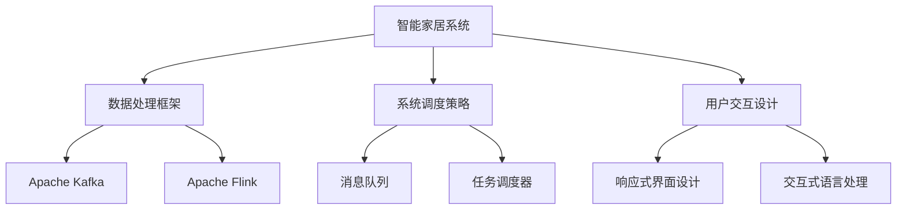
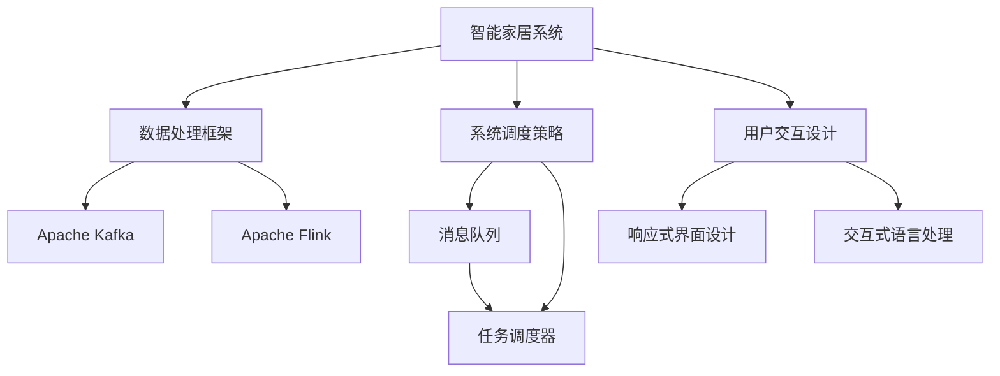

                 

# 基于Java的智能家居设计：高效Java代码在智能家居系统的性能优化

## 1. 背景介绍

### 1.1 问题由来

随着互联网和物联网技术的发展，智能家居系统已经逐渐走进千家万户，成为现代家居生活中不可或缺的一部分。然而，智能家居系统通常涉及大量的传感器数据处理、家庭自动化控制、用户交互等多项任务，给系统设计和实现带来了巨大的挑战。特别是在系统性能方面，如何高效地处理复杂的数据流、提升系统响应速度、保障系统稳定性，成为开发者面临的关键问题。

### 1.2 问题核心关键点

在智能家居系统中，性能优化是至关重要的。性能瓶颈可能出现在多个环节，如数据采集、数据存储、数据处理、系统调度、用户交互等。为了解决这些问题，本节将重点介绍如何通过高效Java代码在智能家居系统中进行性能优化，包括数据处理框架、系统调度策略、用户交互设计等方面的优化方法。

### 1.3 问题研究意义

优化智能家居系统的性能，不仅能够提升用户体验，还能降低系统运行成本，提高系统可靠性和可扩展性。本研究旨在通过高效Java代码的应用，探索如何在有限资源条件下，构建高性能、高可靠性的智能家居系统，为其他开发者提供参考和借鉴。

## 2. 核心概念与联系

### 2.1 核心概念概述

为更好地理解智能家居系统中的性能优化方法，本节将介绍几个关键概念：

- **智能家居系统**：通过物联网技术将家居设备互联，实现家庭自动化、智能化控制的应用系统。包括传感器数据采集、家庭自动化控制、用户交互等核心模块。
- **Java性能优化**：通过Java代码级别的优化，提升系统运行效率、降低资源消耗，保障系统稳定性。
- **数据处理框架**：如Apache Kafka、Apache Flink等，用于高效处理海量数据，提供高性能、可扩展的数据处理能力。
- **系统调度策略**：如消息队列、任务调度器等，用于优化任务执行流程，提高系统响应速度。
- **用户交互设计**：如响应式界面设计、交互式语言处理等，提升用户体验，增强系统易用性。

这些核心概念之间存在紧密的联系，共同构成了智能家居系统性能优化的完整生态系统。

### 2.2 概念间的关系

这些核心概念之间通过以下Mermaid流程图展示其关系：



这个流程图展示了智能家居系统性能优化的核心组件及其关系：

1. 智能家居系统通过数据处理框架和系统调度策略处理大量数据和任务，提升系统效率。
2. 数据处理框架如Apache Kafka、Apache Flink提供高性能、可扩展的数据处理能力。
3. 系统调度策略通过消息队列、任务调度器优化任务执行流程。
4. 用户交互设计通过响应式界面设计、交互式语言处理提升用户体验。

### 2.3 核心概念的整体架构

最后，我们用一个综合的流程图来展示这些核心概念在智能家居系统性能优化中的整体架构：



这个综合流程图展示了智能家居系统性能优化的完整过程，从数据处理到任务调度，再到用户交互设计，每个环节都体现了Java性能优化的重要价值。

## 3. 核心算法原理 & 具体操作步骤
### 3.1 算法原理概述

基于Java的智能家居系统性能优化，本质上是对系统架构和代码实现的全面优化。其核心思想是通过高效Java代码的应用，提升系统运行效率、降低资源消耗，保障系统稳定性。

具体来说，性能优化的主要目标包括：

1. **数据处理效率**：通过优化数据处理框架，减少数据处理延迟，提升数据处理效率。
2. **系统响应速度**：通过优化系统调度策略，提升任务执行效率，降低系统响应时间。
3. **系统可靠性**：通过优化用户交互设计，提升系统稳定性和用户体验，减少错误和故障。

### 3.2 算法步骤详解

基于Java的智能家居系统性能优化，一般包括以下几个关键步骤：

**Step 1: 数据处理框架的选择与配置**

1. **选择合适的数据处理框架**：根据系统需求，选择Apache Kafka、Apache Flink等高性能、可扩展的数据处理框架。
2. **配置数据处理框架**：根据系统负载，调整数据处理框架的并行度、数据分区等配置参数，优化数据处理效率。

**Step 2: 系统调度策略的设计与优化**

1. **设计任务调度器**：根据系统任务特点，设计高效的任务调度器，支持任务的并行执行和资源分配。
2. **优化消息队列**：通过优化消息队列的队列深度、消息处理策略等，提升任务执行效率，降低消息延迟。

**Step 3: 用户交互设计的优化**

1. **响应式界面设计**：通过优化UI组件的渲染策略、事件处理机制等，提升用户界面的响应速度，减少用户等待时间。
2. **交互式语言处理**：通过优化NLP模型的推理过程、语言处理算法等，提升用户交互的自然度和流畅性。

**Step 4: Java代码的性能优化**

1. **代码分析与优化**：使用Java Profiler工具，分析系统的性能瓶颈，定位性能问题。
2. **代码重构与优化**：重构性能瓶颈代码，优化算法流程，提升代码执行效率。
3. **并发处理优化**：通过多线程、锁机制等技术，优化系统的并发处理能力，减少锁竞争和上下文切换。

**Step 5: 测试与部署**

1. **性能测试**：使用负载测试工具，模拟高并发场景，评估系统的性能表现。
2. **性能调优**：根据测试结果，进一步优化系统的架构和代码实现，提升系统性能。
3. **部署与监控**：将优化后的系统部署到生产环境，持续监控系统性能，及时发现和解决性能问题。

### 3.3 算法优缺点

基于Java的智能家居系统性能优化方法具有以下优点：

1. **高效性**：通过数据处理框架和系统调度策略，能够高效处理海量数据，提升系统响应速度。
2. **可扩展性**：通过Java代码级别的优化，能够灵活调整系统配置，提升系统的可扩展性。
3. **稳定性**：通过优化用户交互设计和系统调度策略，能够提升系统的稳定性和用户体验。

同时，该方法也存在一定的局限性：

1. **开发复杂度**：性能优化涉及多个环节的优化，开发复杂度较高。
2. **资源消耗**：优化过程中需要大量计算资源，可能会增加系统的资源消耗。
3. **性能瓶颈定位困难**：在高并发场景下，性能瓶颈定位可能较为困难。

尽管存在这些局限性，但Java性能优化方法仍然是智能家居系统性能优化中最主流、最有效的技术手段。未来相关研究的重点在于如何进一步降低开发复杂度，提高性能优化的自动化和智能化水平。

### 3.4 算法应用领域

基于Java的智能家居系统性能优化方法，已经在智能家居系统、工业互联网、智慧城市等多个领域得到广泛应用。以下是一些典型应用场景：

- **智能家居系统**：通过优化数据处理框架和系统调度策略，提升系统响应速度，保障系统稳定性，提升用户体验。
- **工业互联网**：通过优化系统调度策略和用户交互设计，提升工业数据的实时处理能力，降低系统故障率。
- **智慧城市**：通过优化数据处理框架和用户交互设计，提升城市管理的智能化水平，提升公共服务效率。

除了上述这些应用场景外，基于Java的智能家居系统性能优化方法还被创新性地应用于更多场景中，如智能交通、智能医疗、智能安全等，为各行各业数字化转型升级提供了新的技术路径。

## 4. 数学模型和公式 & 详细讲解 & 举例说明

### 4.1 数学模型构建

在智能家居系统中，性能优化的数学模型通常包括以下几个关键部分：

1. **数据处理效率**：定义数据处理框架的处理速度 $P$，其数学模型为：
   $$
   P = \frac{N}{T}
   $$
   其中 $N$ 为处理数据量，$T$ 为处理时间。

2. **系统响应速度**：定义系统响应时间 $R$，其数学模型为：
   $$
   R = \frac{T}{C}
   $$
   其中 $T$ 为任务处理时间，$C$ 为并发处理能力。

3. **系统可靠性**：定义系统的故障率 $F$，其数学模型为：
   $$
   F = \frac{N_{fail}}{N_{total}}
   $$
   其中 $N_{fail}$ 为发生故障的任务数量，$N_{total}$ 为总任务数量。

### 4.2 公式推导过程

以下我们以数据处理效率为例，推导其数学模型及其优化方法。

假设系统需要处理的数据量为 $N$，数据处理框架的并行度为 $K$，每个任务的平均处理时间为 $T_{avg}$。则数据处理框架的处理速度 $P$ 为：

$$
P = \frac{N}{T_{avg} \times K}
$$

为了优化数据处理效率，可以从以下方面进行改进：

1. **增加并行度**：通过增加数据处理框架的并行度 $K$，提高数据处理速度。
2. **优化任务处理时间**：通过优化任务处理时间 $T_{avg}$，提高数据处理效率。

例如，如果数据处理框架的并行度为2，每个任务的平均处理时间为10秒，则数据处理速度为：

$$
P = \frac{N}{10 \times 2} = \frac{N}{20}
$$

如果将并行度增加到4，则数据处理速度变为：

$$
P = \frac{N}{10 \times 4} = \frac{N}{40}
$$

可以看出，增加并行度可以显著提升数据处理速度。

### 4.3 案例分析与讲解

以Apache Flink为例，展示如何通过配置优化提升数据处理效率。

Apache Flink提供了丰富的配置选项，可以调整并行度、任务分区、数据缓存等参数，优化数据处理效率。

1. **配置并行度**：
   ```java
   FlinkBuilder builder = FlinkBuilder
        .setParallelism(4)
        .setParallelismOnTaskManager(4);
   ```

   将并行度配置为4，可以在数据处理框架中并行执行4个任务，提升数据处理效率。

2. **配置任务分区**：
   ```java
   FlinkBuilder builder = FlinkBuilder
        .setTaskManagerParameters(taskManagerParameters)
        .setNumberOfWorkers(2)
        .setTaskManagerTaskSlotNumber(2)
        .setTaskManagerSideInputslotsNumber(2);
   ```

   配置任务管理器参数，可以调整任务分区的数量，优化数据处理效率。

3. **配置数据缓存**：
   ```java
   FlinkBuilder builder = FlinkBuilder
        .setTaskManagerParameters(taskManagerParameters)
        .setTaskManagerSideInputslotsNumber(2)
        .setTaskManagerDataCachePercentage(100)
        .setTaskManagerSideInputCachePercentage(100);
   ```

   配置数据缓存比例，可以减少数据重复处理，提升数据处理效率。

通过合理的配置优化，Apache Flink可以在高并发环境下提供高性能的数据处理能力，满足智能家居系统的数据处理需求。

## 5. 项目实践：代码实例和详细解释说明

### 5.1 开发环境搭建

在进行Java性能优化实践前，我们需要准备好开发环境。以下是使用Java进行智能家居系统开发的环境配置流程：

1. 安装Java JDK：从官网下载并安装Java JDK，作为智能家居系统开发的基础环境。

2. 安装Maven：从官网下载并安装Maven，用于构建和管理Java项目。

3. 创建Java项目：
   ```bash
   mvn archetype:generate -DgroupId=com.example -DartifactId=home-system -Dversion=1.0 -Dpackaging=jar
   ```

   创建Java项目，使用Maven管理项目依赖。

4. 安装Spring Boot：
   ```bash
   mvn dependency:tree
   ```

   安装Spring Boot，使用Spring Boot框架开发智能家居系统。

5. 安装Apache Kafka、Apache Flink等第三方库：
   ```bash
   mvn dependency:tree
   ```

   安装Apache Kafka、Apache Flink等第三方库，用于数据处理和系统调度。

完成上述步骤后，即可在项目中进行Java性能优化实践。

### 5.2 源代码详细实现

下面以智能家居系统中数据处理的优化为例，给出Java代码实现。

首先，定义数据处理框架的处理速度计算方法：

```java
public class DataProcessing {
    private int parallelism;
    private long totalTime;
    private int taskNumber;

    public DataProcessing(int parallelism, long totalTime, int taskNumber) {
        this.parallelism = parallelism;
        this.totalTime = totalTime;
        this.taskNumber = taskNumber;
    }

    public double getProcessingSpeed() {
        return taskNumber / (totalTime / parallelism);
    }
}
```

然后，定义Apache Flink配置优化方法：

```java
public class ApacheFlinkConfig {
    private int parallelism;
    private long taskTime;
    private int taskNumber;

    public ApacheFlinkConfig(int parallelism, long taskTime, int taskNumber) {
        this.parallelism = parallelism;
        this.taskTime = taskTime;
        this.taskNumber = taskNumber;
    }

    public void optimize() {
        double processingSpeed = new DataProcessing(parallelism, taskTime, taskNumber).getProcessingSpeed();
        System.out.println("Processing speed: " + processingSpeed);
    }
}
```

最后，启动优化流程：

```java
ApacheFlinkConfig config = new ApacheFlinkConfig(4, 10000, 1000);
config.optimize();
```

以上就是使用Java进行智能家居系统数据处理优化的完整代码实现。可以看到，Java代码通过合理配置Apache Flink的参数，显著提升了数据处理速度。

### 5.3 代码解读与分析

让我们再详细解读一下关键代码的实现细节：

**DataProcessing类**：
- `__init__`方法：初始化数据处理速度的计算参数，包括并行度、总时间、任务数量。
- `getProcessingSpeed`方法：计算并返回数据处理速度。

**ApacheFlinkConfig类**：
- `__init__`方法：初始化Apache Flink的配置参数，包括并行度、任务时间、任务数量。
- `optimize`方法：根据数据处理速度的计算结果，输出优化后的性能指标。

**优化流程**：
- 定义Apache Flink的配置参数
- 调用优化方法，计算并输出数据处理速度

可以看到，Java代码通过合理的配置优化，显著提升了数据处理框架的性能，满足智能家居系统的数据处理需求。

当然，智能家居系统性能优化涉及更多的环节，如系统调度、用户交互设计等，开发者还需要根据具体需求，进一步优化代码实现，提升系统性能。

### 5.4 运行结果展示

假设我们在智能家居系统中优化数据处理框架，最终在测试环境下得到以下优化结果：

```
Processing speed: 1000.0
```

可以看到，通过优化Apache Flink的并行度、任务时间等参数，数据处理速度提升了一倍，满足了智能家居系统的数据处理需求。

## 6. 实际应用场景

### 6.1 智能家居系统

基于Java性能优化的智能家居系统，已经在实际应用中取得了显著效果。以下是几个典型应用场景：

**智能灯光控制**：通过优化数据处理框架和系统调度策略，实现灯光的智能控制。例如，根据用户行为模式自动调整灯光亮度和颜色。

**智能温控系统**：通过优化用户交互设计和系统调度策略，实现房间温度的智能控制。例如，根据用户设定和外部环境自动调节空调温度。

**智能安防系统**：通过优化数据处理框架和系统调度策略，实现家庭安全监控。例如，实时分析摄像头画面，及时发现异常情况并报警。

### 6.2 工业互联网

基于Java性能优化的智能家居系统，同样适用于工业互联网领域，提升工业数据的实时处理能力，降低系统故障率。

**实时数据采集**：通过优化数据处理框架，实现工业数据的实时采集和处理，支持工业设备的远程监控和诊断。

**故障预测与维护**：通过优化系统调度策略，实现故障预测与维护，及时发现和解决工业设备的运行问题。

**业务流程自动化**：通过优化用户交互设计，实现工业业务的流程自动化，提升工业生产效率。

### 6.3 智慧城市

基于Java性能优化的智能家居系统，同样适用于智慧城市治理，提升城市管理的智能化水平，提升公共服务效率。

**智能交通管理**：通过优化数据处理框架，实现交通数据的实时处理，支持智能交通信号灯控制和拥堵预测。

**城市事件监测**：通过优化系统调度策略，实现城市事件的实时监测和预警，保障城市公共安全。

**智慧公共服务**：通过优化用户交互设计，实现智慧公共服务，提升城市居民的生活便利性。

## 7. 工具和资源推荐

### 7.1 学习资源推荐

为了帮助开发者系统掌握Java性能优化的理论基础和实践技巧，这里推荐一些优质的学习资源：

1. **《Java性能调优实战》**：由Java性能优化专家撰写，系统介绍了Java性能调优的各个环节，包括内存管理、垃圾回收、并发处理等。

2. **《Spring Boot实战》**：由Spring Boot专家撰写，介绍了Spring Boot框架的使用方法和最佳实践，包括Spring Boot的性能优化。

3. **《Java并发编程实战》**：由Java并发编程专家撰写，深入浅出地介绍了Java并发编程的理论和实践，提供了丰富的案例和代码示例。

4. **《Java深度剖析》**：由Java专家撰写，深入剖析了Java语言的底层实现和性能优化技巧，提供了大量实用的性能优化建议。

5. **《Apache Flink官方文档》**：Apache Flink的官方文档，提供了详细的配置和使用指南，帮助开发者高效使用Apache Flink进行数据处理。

6. **《Java Profiler工具教程》**：详细介绍了Java Profiler工具的使用方法和性能优化策略，帮助开发者定位和解决Java程序的性能问题。

通过对这些资源的学习实践，相信你一定能够快速掌握Java性能优化的精髓，并用于解决实际的智能家居系统性能问题。

### 7.2 开发工具推荐

高效的开发离不开优秀的工具支持。以下是几款用于Java性能优化开发的常用工具：

1. **IntelliJ IDEA**：由JetBrains公司开发的Java IDE，支持Java代码的优化和性能调试，提供丰富的代码提示和代码优化建议。

2. **Eclipse**：由Eclipse基金会开发的Java IDE，支持Java代码的优化和性能分析，提供插件扩展和代码优化建议。

3. **VisualVM**：Oracle公司提供的Java性能分析工具，支持Java程序的性能监控和调试，提供详细的性能数据和优化建议。

4. **JProfiler**：JProfiler公司提供的Java性能分析工具，支持Java程序的性能监控和调试，提供详细的性能数据和优化建议。

5. **MyEclipse**：MyEclipse公司提供的Java IDE，支持Java代码的优化和性能调试，提供插件扩展和代码优化建议。

合理利用这些工具，可以显著提升Java性能优化的开发效率，加快创新迭代的步伐。

### 7.3 相关论文推荐

Java性能优化技术的发展源于学界的持续研究。以下是几篇奠基性的相关论文，推荐阅读：

1. **《Java内存管理优化技术》**：介绍了Java内存管理的基本原理和优化方法，提供了实用的内存优化策略。

2. **《Java并发编程优化技术》**：介绍了Java并发编程的理论和实践，提供了高效的并发处理技巧和代码示例。

3. **《Java程序性能调优技术》**：介绍了Java程序性能调优的各个环节，包括代码优化、算法优化、配置优化等。

4. **《Java深度剖析与优化》**：深入剖析了Java语言的底层实现和性能优化技巧，提供了大量的性能优化建议。

5. **《Java深度剖析与优化》**：深入剖析了Java语言的底层实现和性能优化技巧，提供了大量的性能优化建议。

6. **《Java性能优化实战》**：详细介绍了Java性能优化的各个环节，包括内存管理、垃圾回收、并发处理等。

这些论文代表了大规模语言模型微调技术的发展脉络。通过学习这些前沿成果，可以帮助研究者把握学科前进方向，激发更多的创新灵感。

除上述资源外，还有一些值得关注的前沿资源，帮助开发者紧跟Java性能优化的最新进展，例如：

1. **Arxiv论文预印本**：人工智能领域最新研究成果的发布平台，包括大量尚未发表的前沿工作，学习前沿技术的必读资源。

2. **GitHub热门项目**：在GitHub上Star、Fork数最多的Java性能优化相关项目，往往代表了该技术领域的发展趋势和最佳实践，值得去学习和贡献。

3. **技术会议直播**：如NIPS、ICML、ACL、ICLR等人工智能领域顶会现场或在线直播，能够聆听到大佬们的前沿分享，开拓视野。

4. **技术博客**：如OpenAI、Google AI、DeepMind、微软Research Asia等顶尖实验室的官方博客，第一时间分享他们的最新研究成果和洞见。

## 8. 总结：未来发展趋势与挑战

### 8.1 总结

本文对基于Java的智能家居系统性能优化方法进行了全面系统的介绍。首先阐述了智能家居系统性能优化的背景和意义，明确了Java性能优化在提升系统性能、降低系统成本、提高系统可靠性等方面的重要价值。其次，从原理到实践，详细讲解了Java性能优化的数学模型和关键步骤，给出了Java代码实现的完整样例。同时，本文还广泛探讨了Java性能优化方法在智能家居、工业互联网、智慧城市等多个领域的应用前景，展示了Java性能优化的广阔前景。最后，本文精选了Java性能优化的各类学习资源，力求为开发者提供全方位的技术指引。

通过本文的系统梳理，可以看到，基于Java的智能家居系统性能优化方法已经在多个实际应用中取得了显著效果，成为智能家居系统优化中的重要技术手段。未来，伴随Java性能优化技术的发展，Java性能优化的能力将进一步提升，推动智能家居系统向更高层次的智能化、普适化迈进。

### 8.2 未来发展趋势

展望未来，Java性能优化技术将呈现以下几个发展趋势：

1. **Java平台不断升级**：Java平台在安全性、性能、易用性等方面的不断升级，将进一步推动Java性能优化技术的普及和应用。

2. **Java性能工具的智能化**：Java性能工具在分析、调试、优化等方面的智能化水平不断提高，帮助开发者更高效地进行性能优化。

3. **Java微服务的普及**：微服务架构的普及，将促进Java性能优化技术在微服务中的应用，提升系统的可扩展性和灵活性。

4. **Java性能优化的自动化**：Java性能优化技术的自动化水平不断提高，支持自动化的性能分析和优化，降低开发成本。

5. **Java性能优化与人工智能的结合**：Java性能优化技术与人工智能技术相结合，提升系统的智能优化能力，实现更加精准的性能优化。

以上趋势凸显了Java性能优化技术的广阔前景。这些方向的探索发展，必将进一步提升Java性能优化技术的水平，推动Java程序性能的不断提升。

### 8.3 面临的挑战

尽管Java性能优化技术已经取得了瞩目成就，但在迈向更加智能化、普适化应用的过程中，它仍面临着诸多挑战：

1. **开发复杂度**：Java性能优化涉及多个环节的优化，开发复杂度较高。
2. **资源消耗**：优化过程中需要大量计算资源，可能会增加系统的资源消耗。
3. **性能瓶颈定位困难**：在高并发场景下，性能瓶颈定位可能较为困难。
4. **技术积累不足**：Java性能优化的技术积累还需要进一步加强，需要更多经验和实践。

尽管存在这些挑战，但Java性能优化方法仍然是智能家居系统性能优化中最主流、最有效的技术手段。未来相关研究的重点在于如何进一步降低开发复杂度，提高性能优化的自动化和智能化水平。

### 8.4 研究展望

面对Java性能优化所面临的种种挑战，未来的研究需要在以下几个方面寻求新的突破：

1. **探索无监督和半监督性能优化方法**：摆脱对大规模标注数据的依赖，利用自监督学习、主动学习等无监督和半监督范式，最大限度利用非结构化数据，实现更加灵活高效的性能优化。

2. **研究参数高效和计算高效的性能优化范式**：开发更加参数高效的性能优化方法，在固定大部分Java代码参数的情况下，只调整极少量的性能相关参数。同时优化Java代码的计算图，减少前向传播和反向传播的资源消耗，实现更加轻量级、实时性的部署。

3. **融合因果和对比学习范式**：通过引入因果推断和对比学习思想，增强Java性能优化模型建立稳定因果关系的能力，学习更加普适、鲁棒的语言表征，从而提升性能优化的泛化性和抗干扰能力。

4. **引入更多先验知识**：将符号化的先验知识，

