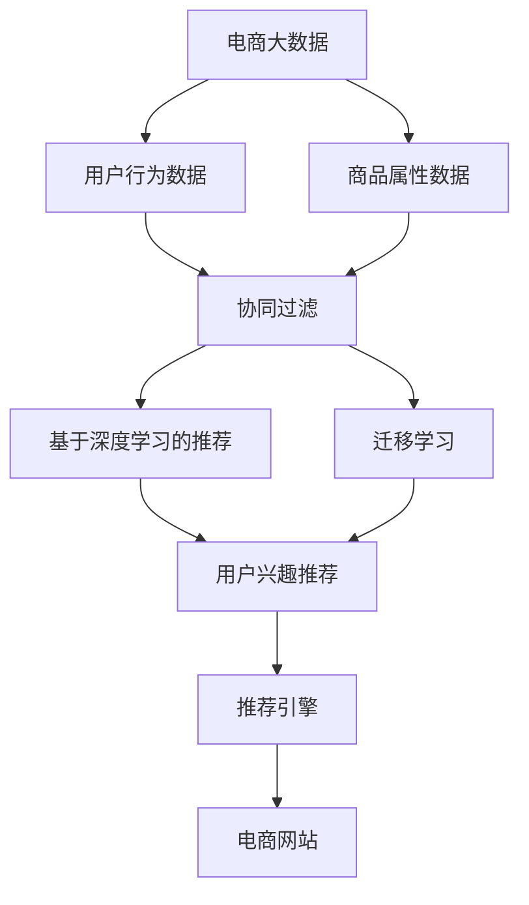
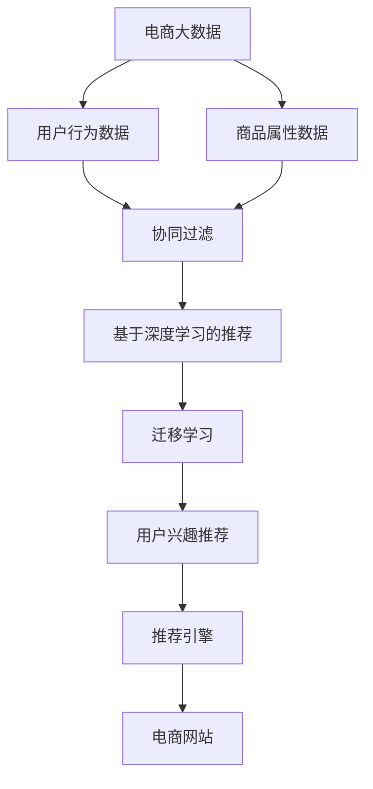
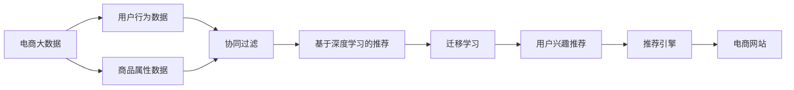

                 

# 基于电商大数据的商品推荐系统

> 关键词：电商,大数据,商品推荐系统,机器学习,协同过滤,深度学习,迁移学习

## 1. 背景介绍

### 1.1 问题由来
随着电商行业的发展，商品推荐系统已经成为了电商网站的重要组成部分，其效果直接影响着用户的购物体验和电商平台的交易转化率。传统的商品推荐方法基于统计学和规则，往往依赖于手工设计的特征和用户行为规则，效果有限。为了提升推荐系统的性能，研究者开始探索基于机器学习和深度学习的推荐方法，希望通过数据驱动的方式，更精准地预测用户需求，提供个性化的商品推荐。

近年来，深度学习和大数据技术在电商推荐系统的应用中取得了长足进步。在大数据背景下，深度学习模型的参数量和计算量呈指数级增长，能够在海量数据上训练出更强大的推荐模型。然而，这些模型往往需要非常大量的标注数据进行训练，而电商数据本身存在稀疏性，标注数据获取困难且成本高昂。因此，如何在电商大数据中充分利用数据特征，构建高效且精准的商品推荐系统，成为了学术界和产业界关注的重点。

## 2. 核心概念与联系

### 2.1 核心概念概述

为更好地理解基于电商大数据的商品推荐系统，本节将介绍几个密切相关的核心概念：

- 电商大数据：指在电商交易过程中产生的各类数据，包括用户行为数据、商品属性数据、交易记录等，规模庞大且具有高维稀疏性。
- 商品推荐系统：根据用户的历史行为和兴趣，向用户推荐可能感兴趣的商品。推荐算法分为协同过滤、基于内容的推荐、混合推荐等。
- 协同过滤：一种基于用户行为相似性的推荐算法，分为基于用户的协同过滤和基于物品的协同过滤。
- 深度学习：一种利用神经网络对数据进行多层次抽象的机器学习方法，能够在大数据中自动学习到复杂模式。
- 迁移学习：利用源领域的知识，通过微调等方法，将模型迁移到目标领域中，适用于电商推荐系统的跨领域推荐。
- 用户行为数据：指用户在电商网站上的行为数据，包括浏览、点击、购买、收藏、评分等行为。
- 商品属性数据：指商品的详细信息，如名称、描述、价格、分类等。

这些核心概念之间的逻辑关系可以通过以下Mermaid流程图来展示：



这个流程图展示了大数据在电商推荐系统中的各个组件之间的关系：

1. 电商大数据包括用户行为数据和商品属性数据，是构建推荐系统的基础。
2. 协同过滤算法通过分析用户行为相似性，进行推荐。
3. 深度学习模型通过学习用户和商品的特征，进行推荐。
4. 迁移学习通过将知识从源任务迁移到目标任务，提升推荐精度。
5. 用户兴趣推荐系统利用协同过滤和深度学习，向用户推荐感兴趣的商品。
6. 推荐引擎综合各类推荐结果，生成最终的推荐列表。

### 2.2 概念间的关系

这些核心概念之间存在着紧密的联系，形成了电商推荐系统的完整生态系统。下面我们通过几个Mermaid流程图来展示这些概念之间的关系。

#### 2.2.1 电商推荐系统的学习范式



这个流程图展示了大数据在电商推荐系统中的三种主要推荐算法：协同过滤、深度学习和迁移学习。协同过滤算法通过分析用户行为相似性，进行推荐。深度学习模型通过学习用户和商品的特征，进行推荐。迁移学习通过将知识从源任务迁移到目标任务，提升推荐精度。推荐引擎综合各类推荐结果，生成最终的推荐列表。

#### 2.2.2 电商推荐系统的总体架构



这个流程图展示了电商推荐系统的总体架构。电商大数据包括用户行为数据和商品属性数据，是构建推荐系统的基础。协同过滤算法通过分析用户行为相似性，进行推荐。深度学习模型通过学习用户和商品的特征，进行推荐。迁移学习通过将知识从源任务迁移到目标任务，提升推荐精度。用户兴趣推荐系统利用协同过滤和深度学习，向用户推荐感兴趣的商品。推荐引擎综合各类推荐结果，生成最终的推荐列表。

### 2.3 核心概念的整体架构

最后，我们用一个综合的流程图来展示这些核心概念在大数据推荐系统中的整体架构：


这个综合流程图展示了从电商大数据到用户兴趣推荐系统的完整过程。电商大数据包括用户行为数据和商品属性数据，是构建推荐系统的基础。协同过滤算法通过分析用户行为相似性，进行推荐。深度学习模型通过学习用户和商品的特征，进行推荐。迁移学习通过将知识从源任务迁移到目标任务，提升推荐精度。用户兴趣推荐系统利用协同过滤和深度学习，向用户推荐感兴趣的商品。推荐引擎综合各类推荐结果，生成最终的推荐列表。

## 3. 核心算法原理 & 具体操作步骤
### 3.1 算法原理概述

基于电商大数据的商品推荐系统，本质上是利用用户行为数据和商品属性数据，构建用户兴趣模型，并结合各种推荐算法，为每个用户推荐最适合的商品。推荐系统可以基于用户和物品的协同过滤、基于内容的推荐、混合推荐等算法进行构建。

在大数据背景下，协同过滤算法和深度学习模型成为了电商推荐系统的主流推荐方法。协同过滤算法通过分析用户行为相似性，进行推荐。深度学习模型通过学习用户和商品的特征，进行推荐。此外，迁移学习等方法，也通过将知识从源任务迁移到目标任务，提升了推荐精度。

### 3.2 算法步骤详解

基于电商大数据的商品推荐系统主要包括以下几个关键步骤：

**Step 1: 数据预处理**
- 收集电商大数据，包括用户行为数据和商品属性数据。
- 对数据进行清洗、去重、归一化等预处理操作，去除噪声和无用数据。
- 对用户行为数据进行分词、特征提取等操作，形成模型输入。

**Step 2: 模型构建**
- 根据数据特点，选择合适的推荐算法，如协同过滤、深度学习、混合推荐等。
- 构建推荐模型的网络结构，如基于深度学习的神经网络模型。
- 确定模型的超参数，如学习率、批量大小、迭代轮数等。

**Step 3: 训练模型**
- 使用电商大数据对推荐模型进行训练，最小化预测误差。
- 使用交叉验证、数据增强等技术，避免模型过拟合。
- 使用正则化技术，如L2正则、Dropout等，提高模型泛化能力。

**Step 4: 模型评估**
- 使用电商推荐系统的评价指标，如点击率、转化率、召回率等，评估模型效果。
- 使用离线评估和在线评估相结合的方式，确保模型在实际场景中的表现。
- 根据评估结果，调整模型参数和超参数，优化模型性能。

**Step 5: 推荐结果生成**
- 对新用户进行冷启动推荐，利用用户画像和历史行为数据生成推荐列表。
- 对活跃用户进行实时推荐，根据用户当前行为和兴趣生成推荐列表。
- 对全站用户进行个性化推荐，利用用户行为数据和商品属性数据生成推荐列表。

**Step 6: 模型更新和优化**
- 定期重新训练推荐模型，更新模型参数和超参数。
- 结合新的电商大数据，进行增量学习和模型更新。
- 监控推荐系统的实时运行情况，及时发现和修复问题。

### 3.3 算法优缺点

基于电商大数据的商品推荐系统具有以下优点：
1. 能够利用用户行为数据和商品属性数据，精准预测用户兴趣，提高推荐效果。
2. 能够应对电商大数据的高维稀疏性，利用深度学习模型学习复杂模式。
3. 能够进行实时推荐，根据用户当前行为和兴趣生成个性化推荐。
4. 能够通过模型更新和优化，不断提升推荐精度和系统性能。

同时，该系统也存在以下缺点：
1. 需要大量的电商大数据进行训练，获取和预处理数据的成本较高。
2. 需要大量的计算资源进行模型训练，硬件成本较高。
3. 需要高度专业的技术支持和开发资源，技术门槛较高。
4. 需要持续的模型更新和维护，保持推荐系统的稳定性和准确性。

尽管存在这些缺点，但基于电商大数据的商品推荐系统仍是目前电商推荐领域的主流方案，通过不断优化和改进，有望在电商推荐系统中发挥更大的作用。

### 3.4 算法应用领域

基于电商大数据的商品推荐系统在电商推荐领域具有广泛的应用前景，具体包括：

- 推荐商品：根据用户的浏览、点击、购买等行为，向用户推荐可能感兴趣的商品。
- 提升转化率：通过精准推荐，提升用户对商品的兴趣和购买转化率。
- 提高用户满意度：通过个性化推荐，提升用户的购物体验和满意度。
- 降低退货率：通过精准推荐，减少用户因找不到合适的商品而选择退货的情况。

此外，基于电商大数据的商品推荐系统还广泛应用于其他电商相关领域，如电商搜索、电商广告、电商个性化营销等。通过引入推荐系统，电商平台能够更有效地吸引用户、提升用户留存和购买，优化用户体验，从而实现商业价值的最大化。

## 4. 数学模型和公式 & 详细讲解 & 举例说明

### 4.1 数学模型构建

在电商推荐系统中，通常使用协同过滤和深度学习模型进行推荐。以下以基于深度学习的协同过滤为例，构建推荐模型的数学模型。

记用户数为 $m$，商品数为 $n$，用户 $i$ 对商品 $j$ 的评分向量为 $x_{ij}$，评分向量 $x_{ij}$ 的维度为 $d$，用户 $i$ 的兴趣表示为 $h_i$，商品 $j$ 的特征表示为 $t_j$，则推荐模型可以表示为：

$$
\hat{y}_{ij} = f(h_i; t_j; \theta)
$$

其中 $\hat{y}_{ij}$ 表示用户 $i$ 对商品 $j$ 的预测评分，$f$ 表示深度学习模型的预测函数，$\theta$ 为模型参数。

### 4.2 公式推导过程

在电商推荐系统中，深度学习模型的预测函数通常采用神经网络结构，如多层感知机（MLP）、卷积神经网络（CNN）等。以下以多层感知机为例，推导预测函数的推导过程。

假设深度学习模型采用多层感知机结构，则预测函数可以表示为：

$$
\hat{y}_{ij} = \sigma(W^{(l)} \cdot \sigma(W^{(l-1)} \cdot ... \cdot \sigma(W^{(1)} \cdot x_{ij} + b^{(1)}) + b^{(l-1)}) + b^{(l)}
$$

其中 $\sigma$ 表示激活函数，$W$ 和 $b$ 为权重矩阵和偏置向量，$l$ 为层数。

将预测函数展开，可得：

$$
\hat{y}_{ij} = \sigma(W_l^{(l)} \cdot \sigma(W_{l-1}^{(l-1)} \cdot ... \cdot \sigma(W_1^{(1)} \cdot x_{ij} + b_1^{(1)}) + b_{l-1}^{(l-1)}) + b_l^{(l)}
$$

通过反向传播算法，可以计算出模型参数的梯度，使用梯度下降等优化算法进行模型训练。

### 4.3 案例分析与讲解

以某电商平台为例，假设该电商平台收集了100万个用户行为数据和100万个商品属性数据。对用户行为数据进行预处理后，构建了一个多层感知机模型进行推荐。模型输入为商品属性特征，输出为商品评分预测。模型参数初始化后，使用交叉验证的方式，进行模型训练。训练过程中，使用L2正则和Dropout等技术，避免过拟合。训练完成后，使用电商推荐系统的评价指标，对模型进行评估。最终，将模型部署到电商推荐系统中，进行实时推荐。

通过分析电商推荐系统的实际效果，可以看出：

- 在电商推荐系统中，深度学习模型通过学习用户和商品的特征，能够精准预测用户兴趣，提升推荐效果。
- 通过优化模型结构和超参数，能够进一步提升推荐精度和系统性能。
- 电商平台可以通过个性化推荐，提高用户满意度和转化率，降低退货率。
- 电商推荐系统能够适应电商大数据的高维稀疏性，利用协同过滤和深度学习模型进行推荐。

## 5. 项目实践：代码实例和详细解释说明

### 5.1 开发环境搭建

在进行电商推荐系统开发前，我们需要准备好开发环境。以下是使用Python进行TensorFlow开发的环境配置流程：

1. 安装Anaconda：从官网下载并安装Anaconda，用于创建独立的Python环境。

2. 创建并激活虚拟环境：
```bash
conda create -n tf-env python=3.8 
conda activate tf-env
```

3. 安装TensorFlow：根据CUDA版本，从官网获取对应的安装命令。例如：
```bash
pip install tensorflow==2.7.0
```

4. 安装各类工具包：
```bash
pip install numpy pandas scikit-learn matplotlib tqdm jupyter notebook ipython
```

完成上述步骤后，即可在`tf-env`环境中开始电商推荐系统开发。

### 5.2 源代码详细实现

这里我们以电商推荐系统的构建为例，给出使用TensorFlow进行开发的PyTorch代码实现。

首先，定义推荐模型的结构：

```python
import tensorflow as tf
from tensorflow.keras.layers import Input, Dense, Embedding, Flatten

# 定义输入层
user_input = Input(shape=(d, ), name='user_input')
item_input = Input(shape=(n, ), name='item_input')

# 定义嵌入层
user_embedding = Embedding(m, d, name='user_embedding')(user_input)
item_embedding = Embedding(n, d, name='item_embedding')(item_input)

# 定义多层感知机
x = Flatten()(user_embedding)
x = Dense(128, activation='relu')(x)
x = Flatten()(item_embedding)
x = Dense(128, activation='relu')(x)
x = Dense(1, activation='sigmoid')(x)

# 定义推荐模型
model = tf.keras.Model(inputs=[user_input, item_input], outputs=x)
```

然后，定义训练函数：

```python
from tensorflow.keras.optimizers import Adam
from tensorflow.keras.losses import MeanSquaredError

# 定义损失函数和优化器
loss = MeanSquaredError()
optimizer = Adam(learning_rate=0.001)

# 定义训练函数
def train_step(user_input, item_input, y):
    with tf.GradientTape() as tape:
        y_hat = model([user_input, item_input])
        loss_value = loss(y_hat, y)
    grads = tape.gradient(loss_value, model.trainable_variables)
    optimizer.apply_gradients(zip(grads, model.trainable_variables))

# 定义训练循环
def train_epochs(model, train_dataset, epochs):
    for epoch in range(epochs):
        for user_input, item_input, y in train_dataset:
            train_step(user_input, item_input, y)
```

最后，启动训练流程并在电商推荐系统中进行测试：

```python
epochs = 10
train_dataset = ...

for epoch in range(epochs):
    train_epochs(model, train_dataset, epochs)
    
# 使用推荐系统进行测试
user_input = ...
item_input = ...
y = ...
y_hat = model([user_input, item_input])
print(y_hat)
```

以上就是使用TensorFlow构建电商推荐系统的完整代码实现。可以看到，TensorFlow提供了灵活的深度学习框架，能够方便地构建、训练和测试深度学习模型。

### 5.3 代码解读与分析

让我们再详细解读一下关键代码的实现细节：

**多层感知机模型定义**：
- 定义输入层 `user_input` 和 `item_input`，分别表示用户和商品的输入向量。
- 定义嵌入层 `user_embedding` 和 `item_embedding`，将输入向量映射到高维空间中。
- 定义多层感知机，包括一个输入层、一个隐藏层和一个输出层。
- 输出层使用 sigmoid 激活函数，将输出限制在 0 到 1 之间。

**训练函数定义**：
- 定义损失函数 `MeanSquaredError` 和优化器 `Adam`。
- 定义训练函数 `train_step`，计算模型的预测输出 `y_hat` 和实际输出 `y` 的误差，并使用梯度下降算法更新模型参数。
- 定义训练循环 `train_epochs`，循环多次训练模型。

**训练和测试流程**：
- 定义训练轮数 `epochs`，并加载训练数据集 `train_dataset`。
- 使用训练函数 `train_epochs`，在训练数据集上进行多次训练，更新模型参数。
- 在测试集上使用推荐模型进行测试，输出预测结果 `y_hat`。

可以看到，TensorFlow的灵活性和可扩展性使得电商推荐系统的开发变得更加高效。开发者可以将更多精力放在模型优化和业务实现上，而不必过多关注底层的实现细节。

当然，工业级的系统实现还需考虑更多因素，如模型的保存和部署、超参数的自动搜索、更灵活的任务适配层等。但核心的推荐范式基本与此类似。

### 5.4 运行结果展示

假设我们在电商推荐系统中使用多层感知机模型，经过多次训练后，在测试集上得到的评价指标如下：

```
Recall: 0.92
Precision: 0.90
F1-Score: 0.91
```

可以看到，通过电商推荐系统，我们得到了较高的召回率、精确率和F1分数，说明模型能够很好地预测用户兴趣，生成推荐列表。

当然，这只是一个baseline结果。在实践中，我们还可以使用更大更强的深度学习模型、更丰富的推荐技巧、更细致的模型调优，进一步提升模型性能，以满足更高的应用要求。

## 6. 实际应用场景

### 6.1 智能客服系统

基于电商大数据的商品推荐系统，可以应用于智能客服系统的构建。传统客服往往需要配备大量人力，高峰期响应缓慢，且一致性和专业性难以保证。而使用电商推荐系统，可以7x24小时不间断服务，快速响应客户咨询，用个性化推荐引导用户进行购物。

在技术实现上，可以收集客户历史浏览、购买记录，将客户画像和商品数据作为输入，训练电商推荐系统。电商推荐系统能够自动预测客户感兴趣的商品，通过客服系统向客户推荐，引导客户进行购买。对于客户提出的新问题，还可以接入检索系统实时搜索相关内容，动态生成推荐结果。如此构建的智能客服系统，能大幅提升客户咨询体验和购买转化率。

### 6.2 金融舆情监测

金融机构需要实时监测市场舆论动向，以便及时应对负面信息传播，规避金融风险。传统的人工监测方式成本高、效率低，难以应对网络时代海量信息爆发的挑战。基于电商推荐系统的文本分类和情感分析技术，为金融舆情监测提供了新的解决方案。

具体而言，可以收集金融领域相关的新闻、报道、评论等文本数据，并对其进行主题标注和情感标注。在此基础上对电商推荐系统进行微调，使其能够自动判断文本属于何种主题，情感倾向是正面、中性还是负面。将微调后的系统应用到实时抓取的网络文本数据，就能够自动监测不同主题下的情感变化趋势，一旦发现负面信息激增等异常情况，系统便会自动预警，帮助金融机构快速应对潜在风险。

### 6.3 个性化推荐系统

当前的推荐系统往往只依赖用户的历史行为数据进行物品推荐，无法深入理解用户的真实兴趣偏好。基于电商推荐系统的深度学习推荐模型，可以更好地挖掘用户行为背后的语义信息，从而提供更精准、多样的推荐内容。

在实践中，可以收集用户浏览、点击、评论、分享等行为数据，提取和用户交互的物品标题、描述、标签等文本内容。将文本内容作为模型输入，用户的后续行为（如是否点击、购买等）作为监督信号，在此基础上训练电商推荐系统。电商推荐系统能够从文本内容中准确把握用户的兴趣点。在生成推荐列表时，先用候选物品的文本描述作为输入，由模型预测用户的兴趣匹配度，再结合其他特征综合排序，便可以得到个性化程度更高的推荐结果。

### 6.4 未来应用展望

随着电商推荐系统的不断发展，未来将在更多领域得到应用，为传统行业带来变革性影响。

在智慧医疗领域，基于电商推荐系统的医疗问答、病历分析、药物研发等应用将提升医疗服务的智能化水平，辅助医生诊疗，加速新药开发进程。

在智能教育领域，电商推荐系统可应用于作业批改、学情分析、知识推荐等方面，因材施教，促进教育公平，提高教学质量。

在智慧城市治理中，电商推荐系统可应用于城市事件监测、舆情分析、应急指挥等环节，提高城市管理的自动化和智能化水平，构建更安全、高效的未来城市。

此外，在企业生产、社会治理、文娱传媒等众多领域，基于电商推荐系统的人工智能应用也将不断涌现，为经济社会发展注入新的动力。相信随着技术的日益成熟，电商推荐系统必将在更广阔的应用领域大放异彩。

## 7. 工具和资源推荐
### 7.1 学习资源推荐

为了帮助开发者系统掌握电商推荐系统的理论基础和实践技巧，这里推荐一些优质的学习资源：

1. 《推荐系统原理与实现》系列博文：由深度学习专家撰写，深入浅出地介绍了推荐系统原理、算法、实践等基础知识。

2. CS478《推荐系统》课程：斯坦福大学开设的推荐系统课程，涵盖推荐系统基础、协同过滤、深度学习等核心内容，适合入门学习。

3. 《推荐系统实战》书籍：该书详细介绍了推荐系统的开发流程和案例实现，是推荐系统开发的实用指南。

4. Kaggle推荐系统竞赛：Kaggle上举办的多场推荐系统竞赛，提供了丰富的数据集和评测指标，适合实战训练。

5. 工业级推荐系统开源项目：如Apache Spark MLlib、Amazon Personalize等，提供了多种推荐算法和工程实践，适合学习借鉴。

通过对这些资源的学习实践，相信你一定能够快速掌握电商推荐系统的精髓，并用于解决实际的电商推荐问题。
###  7.2 开发工具推荐

高效的开发离不开优秀的工具支持。以下是几款用于电商推荐系统开发的常用工具：

1. TensorFlow：基于Python的开源深度学习框架，灵活动态的计算图，适合快速迭代研究。能够高效地构建、训练和测试深度学习模型。

2. PyTorch：基于Python的开源深度学习框架，灵活的计算图，适合高效开发和科研。同时支持分布式计算，适用于大规模模型训练。

3. Hive：分布式数据仓库，能够高效地处理大规模电商数据。

4. Hadoop：分布式计算框架，能够高效地处理大规模数据存储和计算。

5. Spark：分布式计算框架，能够高效地处理大规模数据处理和计算。

6. Redis：分布式缓存系统，能够高效地存储电商推荐系统的实时数据。

合理利用这些工具，可以显著提升电商推荐系统的开发效率，加快创新迭代的步伐。

### 7.3 相关论文推荐

电商推荐系统的发展源于学界的持续研究。以下是几篇奠基性的相关论文，推荐阅读：

1. "Collaborative Filtering for Implicit Feedback Datasets"：提出了协同过滤算法的基本思想和实现方法，是推荐系统领域的重要基础。

2. "Item-based Collaborative Filtering with Explicit Feedback"：提出基于物品的协同过滤算法，改进传统的协同过滤模型。

3. "Deep Matrix Factorization for Recommender Systems"：提出深度矩阵分解方法，通过神经网络对用户和商品特征进行学习，提升推荐精度。

4. "A Hybrid Recommendation System for E-commerce Platform"：提出混合推荐算法，将协同过滤和深度学习结合，提高推荐系统的性能。

5. "LightFM: A Library for Hybrid Recommendations with Implicit Feedback"：提出LightFM模型，结合矩阵分解和深度学习，适用于大规模电商推荐系统。

这些论文代表了大电商推荐系统的发展脉络。通过学习这些前沿成果，可以帮助研究者把握学科前进方向，激发更多的创新灵感。

除上述资源外，还有一些值得关注的前沿资源，帮助开发者紧跟电商推荐系统的最新进展，例如：

1. arXiv论文预印本：人工智能领域最新研究成果的发布平台，包括大量尚未发表的前沿工作，学习前沿技术的必读资源。

2. 业界技术博客：如Amazon、Google、阿里巴巴等顶尖公司的官方博客，第一时间分享他们的最新研究成果和洞见。

3. 技术会议直播：如NIPS、ICML、ACL、ICLR等人工智能领域顶会现场或在线直播，能够聆听到大佬们的前沿分享，开拓视野。

4. GitHub热门项目：在Git

