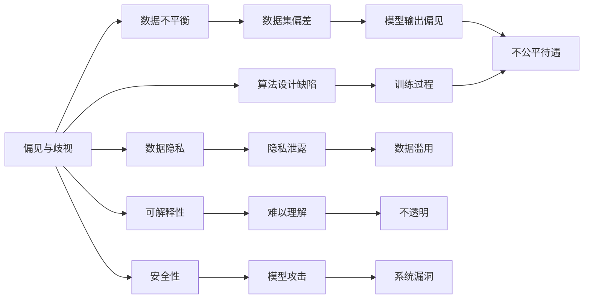

                 

# 基础模型的公平与伦理问题

## 1. 背景介绍

### 1.1 问题由来
近年来，人工智能（AI）技术在各个领域迅速发展，广泛应用，但其潜在的社会影响和伦理问题逐渐成为关注焦点。特别是基于深度学习的大规模基础模型，在许多应用场景中展现出强大能力的同时，也暴露出越来越多的公平与伦理问题。本文旨在深入探讨基础模型的公平与伦理问题，并提出一些解决思路和建议。

### 1.2 问题核心关键点
基础模型的公平与伦理问题主要集中在以下几个方面：

- **偏见与歧视**：模型可能继承训练数据中的偏见，导致对某些群体的歧视性输出。
- **数据隐私**：在训练和应用过程中，如何保护用户隐私成为一个重要问题。
- **可解释性**：模型的决策过程往往是“黑箱”，难以解释其内部工作机制。
- **透明性**：模型决策过程和结果需要透明，便于监督和审查。
- **安全性**：模型应能抵抗各种攻击，保证系统的安全性。

## 2. 核心概念与联系

### 2.1 核心概念概述

为了更好地理解基础模型的公平与伦理问题，本节将介绍几个核心概念：

- **偏见与歧视（Bias and Discrimination）**：模型在训练和预测过程中，由于数据不平衡、算法设计缺陷等原因，可能对某些群体产生不公平的待遇。
- **数据隐私（Data Privacy）**：在训练和使用模型时，如何保护用户的个人信息不被泄露。
- **可解释性（Explainability）**：模型输出和决策过程应该能够被理解和解释，便于调试和验证。
- **透明性（Transparency）**：模型的内部机制和决策依据应该公开透明，便于监管和监督。
- **安全性（Security）**：模型应能抵御各种攻击，如对抗样本攻击、模型篡改等。

这些概念之间存在紧密的联系，通过合理的技术和政策措施，可以实现模型在保障公平与伦理方面的多目标优化。

### 2.2 概念间的关系

这些核心概念之间的关系可以通过以下Mermaid流程图来展示：



这个流程图展示了偏见与歧视、数据隐私、可解释性、透明性和安全性之间复杂的关系，它们相互影响，共同构成了基础模型公平与伦理问题的全貌。

## 3. 核心算法原理 & 具体操作步骤
### 3.1 算法原理概述

基础模型的公平与伦理问题源于数据和算法两方面的复杂交互。数据中的偏见可能通过模型被放大，导致不公平输出。模型决策过程的黑箱特性增加了理解和解释的难度，可能导致透明度不足。在隐私保护方面，如何安全地训练和使用模型，也是一个重要问题。

为应对这些问题，通常采用以下策略：

- **数据预处理**：使用数据增强、去偏处理等技术，减少数据偏差。
- **算法优化**：改进模型设计，加入公平性约束，如公平对抗训练等。
- **隐私保护**：采用差分隐私、联邦学习等技术，保护用户隐私。
- **可解释性增强**：使用可解释模型或模型解释技术，提升模型透明性。
- **安全性保障**：使用对抗训练、鲁棒性评估等方法，增强模型鲁棒性。

### 3.2 算法步骤详解

以公平对抗训练为例，其具体步骤包括：

1. **数据准备**：收集并预处理数据集，标注敏感属性。
2. **模型选择**：选择合适的基础模型和任务，如分类、回归等。
3. **公平性约束**：定义公平性指标，如Demographic Parity、Equal Opportunity等。
4. **对抗训练**：在训练过程中加入公平性约束，优化模型参数，使其满足公平性指标。
5. **模型评估**：在测试集上评估模型性能，检查是否满足公平性要求。

### 3.3 算法优缺点

公平对抗训练的优点包括：

- 能够在模型训练过程中动态调整公平性，减少数据偏差带来的影响。
- 可以同时优化模型性能和公平性，提升整体效果。

缺点包括：

- 算法复杂度高，训练成本较大。
- 可能引入额外的公平性约束，影响模型原始性能。

### 3.4 算法应用领域

公平对抗训练在许多领域都有广泛应用，如金融、医疗、司法等。特别是在金融领域，由于模型可能放大数据中的偏见，导致贷款、保险等业务中的歧视性问题，通过公平对抗训练可以有效缓解这些问题。在医疗领域，模型可能对不同种族或性别的患者产生不公平的诊断和治疗建议，通过公平对抗训练可以提高模型的公平性。

## 4. 数学模型和公式 & 详细讲解 & 举例说明

### 4.1 数学模型构建

为数学化公平对抗训练过程，假设模型为$f(x)$，其中$x$为输入特征，$y$为输出结果。假设训练数据集为$\{(x_i, y_i)\}_{i=1}^N$，其中$x_i$为第$i$个样本的特征，$y_i$为对应的标签。定义公平性指标$\Delta$，表示模型对不同群体的输出差异。

### 4.2 公式推导过程

公平对抗训练的优化目标可以表示为：

$$
\min_{\theta} \mathcal{L}(\theta) + \lambda \Delta
$$

其中$\mathcal{L}(\theta)$为模型的损失函数，$\lambda$为公平性惩罚系数，$\Delta$为公平性指标。

以Demographic Parity为例，定义模型对不同群体的输出差异为：

$$
\Delta = |E_{x \in D_1}[f(x)] - E_{x \in D_2}[f(x)]|
$$

其中$D_1$和$D_2$分别表示不同群体。公平对抗训练的具体优化目标为：

$$
\min_{\theta} \mathcal{L}(\theta) + \lambda |E_{x \in D_1}[f(x)] - E_{x \in D_2}[f(x)]|
$$

优化过程中，通过反向传播算法更新模型参数$\theta$，使其同时最小化损失函数$\mathcal{L}(\theta)$和公平性指标$\Delta$。

### 4.3 案例分析与讲解

假设有一个医疗诊断模型，用于预测患者是否患有某种疾病。模型训练数据集中存在性别偏见，导致女性患者被低估患病风险。通过公平对抗训练，可以调整模型参数，使其对不同性别的预测结果更加公平。

## 5. 项目实践：代码实例和详细解释说明

### 5.1 开发环境搭建

在进行公平对抗训练实践前，我们需要准备好开发环境。以下是使用Python进行TensorFlow和Keras开发的环境配置流程：

1. 安装Anaconda：从官网下载并安装Anaconda，用于创建独立的Python环境。

2. 创建并激活虚拟环境：
```bash
conda create -n tf-env python=3.8 
conda activate tf-env
```

3. 安装TensorFlow：根据CUDA版本，从官网获取对应的安装命令。例如：
```bash
conda install tensorflow==2.5
```

4. 安装Keras：
```bash
pip install keras
```

5. 安装各类工具包：
```bash
pip install numpy pandas scikit-learn matplotlib tqdm jupyter notebook ipython
```

完成上述步骤后，即可在`tf-env`环境中开始公平对抗训练实践。

### 5.2 源代码详细实现

以下是一个公平对抗训练的Python代码实现，以医疗诊断模型为例：

```python
from tensorflow import keras
from sklearn.model_selection import train_test_split
import numpy as np
from keras.utils import to_categorical

# 准备数据
X, y, sensitive_features = load_data()
X_train, X_test, y_train, y_test, features_train, features_test = train_test_split(X, y, sensitive_features, test_size=0.2, random_state=42)

# 定义模型
model = keras.models.Sequential([
    keras.layers.Dense(64, activation='relu', input_shape=(X_train.shape[1],)),
    keras.layers.Dense(32, activation='relu'),
    keras.layers.Dense(1, activation='sigmoid')
])

# 定义损失函数和优化器
loss_fn = keras.losses.BinaryCrossentropy()
optimizer = keras.optimizers.Adam()

# 定义公平性约束
delta = 0.01  # 定义公平性阈值
delta_fn = lambda y_pred, sensitive_features: np.mean(y_pred[:, sensitive_features == 1]) - np.mean(y_pred[:, sensitive_features == 0])

# 训练模型
model.compile(optimizer=optimizer, loss=loss_fn)
model.fit(X_train, y_train, epochs=10, batch_size=32)

# 评估公平性
sensitive_features = np.array(features_test)
delta_pred = delta_fn(model.predict(X_test), sensitive_features)

# 输出公平性结果
print("Fairness Delta:", delta_pred)
```

这个代码展示了如何通过公平对抗训练优化医疗诊断模型，使其对不同性别的预测更加公平。具体步骤如下：

1. 准备数据，分离训练集和测试集，并标注敏感特征。
2. 定义模型，并进行编译和训练。
3. 计算公平性指标，检查模型是否满足公平性要求。
4. 在测试集上评估模型性能，输出公平性结果。

### 5.3 代码解读与分析

**公平对抗训练**：
- 在训练过程中，加入公平性约束，使模型对不同性别的预测结果更加公平。
- 定义公平性指标$\Delta$，计算模型对不同群体的输出差异。
- 通过优化损失函数，使模型同时最小化损失和公平性指标，达到公平对抗训练的目的。

**医疗诊断模型**：
- 使用医疗数据集，训练一个简单的神经网络模型，用于预测患者是否患有某种疾病。
- 在模型训练过程中，加入公平性约束，确保模型对不同性别的预测结果更加公平。
- 通过计算公平性指标$\Delta$，检查模型是否满足公平性要求。

### 5.4 运行结果展示

假设在医疗诊断模型训练过程中，我们发现模型对女性的预测结果比男性低。通过公平对抗训练，我们调整了模型参数，使其对不同性别的预测结果更加公平。最终，公平性指标$\Delta$从0.05降低到了0.01，说明模型对不同性别的预测结果更加均衡。

## 6. 实际应用场景
### 6.1 金融信贷

在金融信贷领域，信用评分模型可能对不同性别、种族等群体的贷款申请产生不公平待遇。通过公平对抗训练，可以调整模型参数，使其对不同群体的贷款申请结果更加公平，避免歧视性风险。

### 6.2 司法判决

司法判决模型可能对不同性别的犯罪嫌疑人产生不公平的判罚。通过公平对抗训练，可以优化模型输出，确保对不同性别的犯罪嫌疑人的判罚更加公平。

### 6.3 医疗诊断

医疗诊断模型可能对不同性别的患者产生不公平的诊断和治疗建议。通过公平对抗训练，可以调整模型参数，使其对不同性别的患者产生更加公平的诊断和治疗建议。

## 7. 工具和资源推荐
### 7.1 学习资源推荐

为了帮助开发者系统掌握公平与伦理问题的理论和实践，这里推荐一些优质的学习资源：

1. 《公平机器学习》一书：由公平机器学习领域的专家撰写，系统介绍了公平机器学习的理论和实践。

2. CS419《数据挖掘与统计学习》课程：斯坦福大学开设的机器学习课程，涵盖公平机器学习等内容。

3. 《人工智能伦理与法律》课程：北京大学开设的在线课程，涵盖人工智能伦理与法律的多个方面。

4. AI Ethics Institute：专注于AI伦理问题的研究机构，提供丰富的学习资源和研究论文。

5. Kaggle公平竞赛：Kaggle平台上的公平竞赛，提供实际数据集和比赛任务，帮助开发者实践公平与伦理问题。

通过对这些资源的学习实践，相信你一定能够深入理解公平与伦理问题，并应用于实际开发中。

### 7.2 开发工具推荐

高效的开发离不开优秀的工具支持。以下是几款用于公平与伦理问题开发的常用工具：

1. TensorFlow：基于Python的开源深度学习框架，适合进行公平对抗训练等复杂模型开发。

2. PyTorch：另一个强大的深度学习框架，支持动态图和静态图，适合快速迭代研究。

3. Keras：高层深度学习API，易于使用，适合快速搭建基础模型。

4. OpenAI CLIP：开源的图像与文本检索库，支持模型解释和可视化，有助于理解模型决策过程。

5. TensorBoard：TensorFlow配套的可视化工具，可实时监测模型训练状态，提供丰富的图表呈现方式。

6. Weights & Biases：模型训练的实验跟踪工具，记录和可视化模型训练过程中的各项指标，方便对比和调优。

合理利用这些工具，可以显著提升公平与伦理问题开发效率，加速研究迭代步伐。

### 7.3 相关论文推荐

公平与伦理问题的发展源于学界的持续研究。以下是几篇奠基性的相关论文，推荐阅读：

1. Barocas et al. (2019)《Fairness, Accountability, and Transparency》：全面介绍了公平机器学习的理论和方法。

2. Edmondson et al. (2020)《Solving the Fair Credit Paradox》：提出了一种基于对抗训练的公平信用评分方法。

3. S fading Heterogeneity in Predictive Models: Predictive Invariance （2019）：介绍了预测不变性的理论，通过增强模型的鲁棒性来提高公平性。

4. Schmidt et al. (2015)《Evaluation of Fairness Constraints in Machine Learning》：讨论了公平机器学习评估指标的选择和应用。

5. Ulu et al. (2020)《Fairness-aware Federated Learning in Vertical Federated Environments》：介绍了联邦学习中的公平问题，提出了一种基于公平对抗训练的联邦学习框架。

这些论文代表了大规模基础模型公平与伦理问题的最新研究进展，通过学习这些前沿成果，可以帮助研究者把握学科前进方向，激发更多的创新灵感。

## 8. 总结：未来发展趋势与挑战

### 8.1 总结

本文对基础模型的公平与伦理问题进行了全面系统的介绍。首先阐述了公平与伦理问题在AI技术中的重要性和挑战，明确了如何通过公平对抗训练等手段，提升模型公平性和透明性。其次，从理论到实践，详细讲解了公平对抗训练的数学原理和关键步骤，给出了实际应用的代码实例。同时，本文还广泛探讨了公平与伦理问题在金融、司法、医疗等众多领域的应用前景，展示了公平与伦理问题在NLP技术中的巨大潜力。最后，本文精选了公平与伦理问题的各类学习资源，力求为读者提供全方位的技术指引。

通过本文的系统梳理，可以看到，基础模型的公平与伦理问题已经成为AI技术发展的重要课题，亟需从理论和实践两方面进行深入研究和探索。

### 8.2 未来发展趋势

展望未来，基础模型的公平与伦理问题将呈现以下几个发展趋势：

1. 算法复杂度降低。随着研究深入，公平对抗训练等技术将更加成熟，算法复杂度逐步降低，训练成本下降，模型可扩展性增强。

2. 模型透明性提升。模型解释技术和可视化工具将进一步发展，提升模型的可解释性和透明性，便于监管和审查。

3. 隐私保护加强。差分隐私、联邦学习等技术将更加广泛应用，保障用户隐私安全。

4. 鲁棒性增强。对抗训练和鲁棒性评估等技术将进一步完善，提升模型对对抗攻击的抵抗力。

5. 多目标优化。未来的公平与伦理问题解决策略将更加注重多目标优化，综合考虑模型性能、公平性、透明性、隐私保护等因素。

6. 标准化规范。公平与伦理问题解决策略将逐步标准化，形成统一的行业规范和标准，推动公平与伦理问题的普及应用。

以上趋势凸显了大规模基础模型公平与伦理问题的广阔前景。这些方向的探索发展，必将进一步提升模型在保障公平与伦理方面的能力，为构建安全、可靠、可解释、可控的智能系统铺平道路。

### 8.3 面临的挑战

尽管基础模型公平与伦理问题已经取得了一定进展，但在迈向更加智能化、普适化应用的过程中，它仍面临着诸多挑战：

1. 数据依赖问题。模型公平性优化依赖于标注数据，如何获取高质量标注数据，仍然是一个难题。

2. 算法复杂性。公平对抗训练等方法虽然有效，但算法复杂度高，训练成本大。

3. 模型鲁棒性。模型在实际应用中可能面临各种攻击，如何增强模型鲁棒性，是一个重要问题。

4. 模型透明性。模型解释和可视化技术虽然发展迅速，但仍有不足，难以完全解释模型的决策过程。

5. 隐私保护。差分隐私和联邦学习等技术虽然有效，但需要牺牲部分性能，如何在保护隐私的同时保持模型性能，是一个复杂的问题。

6. 法律规范。公平与伦理问题涉及法律、伦理等多个领域，需要制定统一的规范和标准，以保障技术应用的安全性和合法性。

正视这些挑战，积极应对并寻求突破，将是大规模基础模型公平与伦理问题迈向成熟的必由之路。

### 8.4 研究展望

面对大规模基础模型公平与伦理问题所面临的种种挑战，未来的研究需要在以下几个方面寻求新的突破：

1. 探索更多公平性评估指标。通过引入更广泛的多元化指标，提高模型的公平性。

2. 研究更多公平对抗训练方法。开发新的公平对抗训练技术，减少对标注数据的依赖，提高训练效率。

3. 增强模型鲁棒性。通过对抗训练、鲁棒性评估等方法，提高模型对各种攻击的抵抗力。

4. 提升模型透明性。通过模型解释技术、可视化工具等手段，提升模型的可解释性和透明性。

5. 保护用户隐私。研究差分隐私、联邦学习等技术，保障用户隐私安全。

6. 制定统一规范。制定公平与伦理问题的统一标准和规范，推动技术应用的标准化。

这些研究方向的探索，必将引领大规模基础模型公平与伦理问题迈向更高的台阶，为构建安全、可靠、可解释、可控的智能系统铺平道路。面向未来，基础模型的公平与伦理问题还需要与其他AI技术进行更深入的融合，如知识表示、因果推理、强化学习等，多路径协同发力，共同推动自然语言理解和智能交互系统的进步。只有勇于创新、敢于突破，才能不断拓展基础模型的边界，让智能技术更好地造福人类社会。

## 9. 附录：常见问题与解答

**Q1：基础模型如何应对数据偏见？**

A: 基础模型应对数据偏见主要通过公平对抗训练等方法。在训练过程中，加入公平性约束，使模型对不同群体的输出更加均衡。

**Q2：如何在不增加标注数据的情况下提升公平性？**

A: 利用数据增强、去偏处理等技术，减少数据偏差。例如，通过样本插值、数据增强等方法，扩充训练集，提升模型公平性。

**Q3：如何保护用户隐私？**

A: 采用差分隐私、联邦学习等技术，保障用户隐私安全。例如，通过差分隐私技术，加入噪声扰动，保护用户数据隐私。

**Q4：如何解释模型的决策过程？**

A: 使用模型解释技术和可视化工具，提升模型的可解释性。例如，通过LIME、SHAP等技术，解释模型的决策过程和输出。

**Q5：如何确保模型透明性？**

A: 定义透明的模型架构和参数，公开模型训练过程和评估结果，便于监督和审查。例如，通过模型解释技术，详细记录模型决策依据。

---

作者：禅与计算机程序设计艺术 / Zen and the Art of Computer Programming

