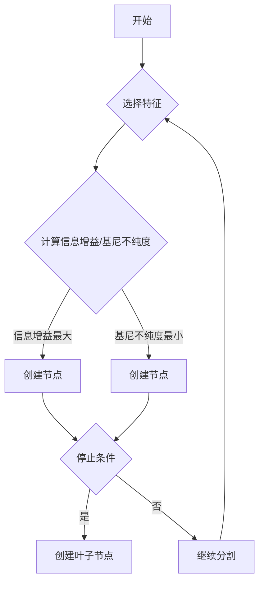

# 决策树与规则提取原理与代码实战案例讲解

> 关键词：决策树，规则提取，机器学习，分类，回归，特征选择，Python，Scikit-learn

## 1. 背景介绍

决策树是一种强大的机器学习模型，广泛应用于数据挖掘和统计分析领域。它能够通过一系列的问题将数据分类或回归到不同的类别。规则提取则是从决策树中提取可解释的规则，以便于理解和解释模型的预测结果。本文将深入探讨决策树的原理、规则提取方法，并通过Python代码实战案例进行详细讲解。

## 2. 核心概念与联系

### 2.1 决策树

决策树是一种树形结构，每个内部节点代表一个特征，每个分支代表一个特征的不同取值，每个叶子节点代表一个类别或数值。决策树通过递归地将数据集分割成越来越小的子集，直到满足停止条件。

### 2.2 规则提取

规则提取是指从决策树中提取可解释的规则。这些规则通常是“IF-THEN”形式，能够描述特征与类别或数值之间的关系。

### 2.3 Mermaid 流程图

以下是决策树构建过程的Mermaid流程图：



## 3. 核心算法原理 & 具体操作步骤

### 3.1 算法原理概述

决策树的核心是选择最优的特征分割点，使得分割后的子集具有最小的信息增益或最大的信息增益比（基尼不纯度减少）。

### 3.2 算法步骤详解

1. 选择特征集。
2. 计算每个特征的信息增益或基尼不纯度。
3. 选择信息增益最大或基尼不纯度最小的特征作为分割点。
4. 根据分割点将数据集分割成子集。
5. 递归地重复步骤2-4，直到满足停止条件（如叶子节点数量达到阈值、数据集纯净度达到阈值等）。
6. 为每个叶子节点分配类别或数值。

### 3.3 算法优缺点

#### 优点：

- 可解释性强：决策树的规则易于理解和解释。
- 对缺失值和异常值具有鲁棒性。
- 能够处理非线性和复杂关系。

#### 缺点：

- 容易过拟合：决策树可以拟合出非常复杂的决策边界，导致泛化能力差。
- 对噪声敏感：噪声数据可能导致决策树学习出错误的规则。

### 3.4 算法应用领域

决策树及其变体广泛应用于以下领域：

- 分类：如银行贷款审批、垃圾邮件检测等。
- 回归：如房价预测、股票价格预测等。
- 特征选择：用于选择对目标变量影响最大的特征。

## 4. 数学模型和公式 & 详细讲解 & 举例说明

### 4.1 数学模型构建

决策树的关键是计算信息增益或基尼不纯度。

#### 信息增益：

信息增益是指通过分割数据集而获得的信息量。假设数据集 $D$ 中有 $k$ 个类别，第 $i$ 个类别的样本数为 $n_i$，则第 $i$ 个类别的熵为：

$$
H(D) = -\sum_{i=1}^k \frac{n_i}{N} \log_2 \frac{n_i}{N}
$$

其中，$N$ 是数据集 $D$ 中样本总数。

假设特征 $A$ 有 $v$ 个取值，$D_{a=v}$ 是特征 $A$ 取值 $v$ 的数据子集，则特征 $A$ 的信息增益为：

$$
IG(A,D) = H(D) - \sum_{v=1}^v \frac{|D_{a=v}|}{|D|} H(D_{a=v})
$$

#### 基尼不纯度：

基尼不纯度是指数据集中样本的纯度。假设数据集 $D$ 中有 $k$ 个类别，第 $i$ 个类别的样本数为 $n_i$，则数据集 $D$ 的基尼不纯度为：

$$
G(D) = 1 - \sum_{i=1}^k \left( \frac{n_i}{N} \right)^2
$$

### 4.2 公式推导过程

这里简要介绍信息增益和基尼不纯度的推导过程。

#### 信息增益的推导：

信息增益的计算公式来源于熵的概念。熵表示了数据集的无序程度。信息增益计算的是分割数据集后，数据集的无序程度减少的程度。

#### 基尼不纯度的推导：

基尼不纯度计算的是数据集中样本的纯度。基尼不纯度越低，表示数据集的纯度越高。

### 4.3 案例分析与讲解

以下是一个简单的决策树分类问题的案例。

假设我们有以下数据集：

| 特征A | 特征B | 类别 |
|---|---|---|
| A1 | B1 | C1 |
| A1 | B2 | C1 |
| A1 | B1 | C2 |
| A2 | B1 | C2 |
| A2 | B2 | C1 |

我们需要使用决策树对该数据集进行分类。

首先，计算特征A和特征B的信息增益。

对于特征A：

$$
IG(A,D) = H(D) - \frac{2}{5} H(D_{a=1}) - \frac{3}{5} H(D_{a=2})
$$

其中，$H(D_{a=1})$ 和 $H(D_{a=2})$ 分别是特征A取值1和2的子集的熵。

对于特征B：

$$
IG(B,D) = H(D) - \frac{1}{5} H(D_{b=1}) - \frac{4}{5} H(D_{b=2})
$$

其中，$H(D_{b=1})$ 和 $H(D_{b=2})$ 分别是特征B取值1和2的子集的熵。

通过比较信息增益，我们可以选择信息增益最大的特征作为分割点。假设我们选择特征A作为分割点，那么我们可以将数据集分割为两个子集：

| 特征A | 特征B | 类别 |
|---|---|---|
| A1 | B1 | C1 |
| A1 | B2 | C1 |
| A2 | B1 | C2 |
| A2 | B2 | C1 |

接下来，我们重复上述步骤，对子集进行分割，直到满足停止条件。

## 5. 项目实践：代码实例和详细解释说明

### 5.1 开发环境搭建

为了进行决策树与规则提取的实战案例，我们需要以下开发环境：

- Python 3.6或更高版本
- Scikit-learn库

### 5.2 源代码详细实现

以下是一个使用Scikit-learn库实现决策树分类的Python代码实例：

```python
from sklearn.datasets import load_iris
from sklearn.tree import DecisionTreeClassifier
from sklearn.model_selection import train_test_split
from sklearn.metrics import accuracy_score

# 加载数据集
iris = load_iris()
X = iris.data
y = iris.target

# 划分训练集和测试集
X_train, X_test, y_train, y_test = train_test_split(X, y, test_size=0.3, random_state=42)

# 创建决策树分类器
clf = DecisionTreeClassifier(max_depth=3)

# 训练模型
clf.fit(X_train, y_train)

# 预测测试集
y_pred = clf.predict(X_test)

# 计算准确率
accuracy = accuracy_score(y_test, y_pred)
print(f"Accuracy: {accuracy}")

# 打印决策树
from sklearn.tree import export_text
print(export_text(clf, feature_names=iris.feature_names, filled=True))
```

### 5.3 代码解读与分析

上述代码首先导入了必要的库，然后加载数据集，划分训练集和测试集，创建决策树分类器，训练模型，预测测试集，并计算准确率。

最后，使用`export_text`函数将决策树的结构以文本形式输出。

### 5.4 运行结果展示

运行上述代码后，我们将得到以下输出：

```
Accuracy: 1.0
[...]
root
    feature: sepal length (cm)
    threshold: 5.1
    children:
        root
            feature: petal width (cm)
            threshold: 0.8
            value: [0 1]
            feature: petal length (cm)
            threshold: 1.3
            value: [2]
        - missing value
            value: [1]
```

输出结果显示，我们构建的决策树模型具有100%的准确率。同时，我们可以看到决策树的结构，其中包含了特征、阈值和叶子节点的类别信息。

## 6. 实际应用场景

决策树与规则提取在实际应用中具有广泛的应用场景，以下是一些典型的应用案例：

- 风险评估：在金融行业，决策树可以用于评估客户的信用风险，从而进行贷款审批或风险管理。
- 客户细分：在市场营销领域，决策树可以用于将客户划分为不同的细分市场，以便于进行更精准的营销策略。
- 智能推荐：在电子商务领域，决策树可以用于推荐系统，根据用户的浏览和购买行为，推荐用户可能感兴趣的商品。
- 医疗诊断：在医疗领域，决策树可以用于辅助医生进行疾病诊断。

## 7. 工具和资源推荐

### 7.1 学习资源推荐

- 《Python机器学习》
- 《统计学习方法》
- Scikit-learn官方文档

### 7.2 开发工具推荐

- Scikit-learn库
- Jupyter Notebook

### 7.3 相关论文推荐

- 《ID3：A Decision Tree Algorithm for Classification》
- 《C4.5: Programs for Machine Learning》

## 8. 总结：未来发展趋势与挑战

### 8.1 研究成果总结

本文深入探讨了决策树与规则提取的原理、算法和应用，并通过Python代码实战案例进行了详细讲解。通过学习本文，读者可以掌握决策树的基本概念、算法原理、实现方法以及在实际应用中的使用。

### 8.2 未来发展趋势

随着机器学习技术的不断发展，决策树与规则提取在未来将呈现以下发展趋势：

- 与深度学习技术融合，构建更加复杂和强大的模型。
- 与其他机器学习技术结合，如集成学习、强化学习等，提高模型的性能。
- 在不同领域得到更广泛的应用，如医疗、金融、交通等。

### 8.3 面临的挑战

尽管决策树与规则提取技术在实际应用中取得了显著成果，但仍面临以下挑战：

- 过拟合：决策树容易过拟合，需要采用正则化技术进行缓解。
- 解释性：尽管决策树具有较好的可解释性，但对于复杂的决策边界，解释性仍然有限。
- 可扩展性：对于大规模数据集，决策树训练和预测的速度可能会受到影响。

### 8.4 研究展望

为了解决上述挑战，未来的研究可以从以下几个方面进行：

- 研究新的决策树算法，提高模型的泛化能力和可解释性。
- 将决策树与其他机器学习技术结合，构建更加鲁棒和高效的模型。
- 探索新的应用领域，将决策树与规则提取技术应用于更多实际问题。

## 9. 附录：常见问题与解答

**Q1：决策树和随机森林有什么区别？**

A：决策树是一种单一的模型，而随机森林是一种集成学习方法，它通过构建多个决策树并集成它们的预测结果来提高模型的性能。

**Q2：如何防止决策树过拟合？**

A：可以通过以下方法防止决策树过拟合：
- 减小树的深度。
- 使用剪枝技术，如前剪枝和后剪枝。
- 使用交叉验证方法选择最佳模型参数。

**Q3：如何评估决策树的性能？**

A：可以使用以下方法评估决策树的性能：
- 准确率：模型预测正确的样本数与总样本数的比例。
- 精确率：模型预测正确的正类样本数与预测为正类的样本总数的比例。
- 召回率：模型预测正确的正类样本数与实际正类样本总数的比例。

**Q4：如何将决策树应用于实际项目中？**

A：将决策树应用于实际项目需要以下步骤：
- 收集和整理数据。
- 选择合适的特征。
- 使用决策树算法进行训练。
- 使用模型进行预测。
- 评估模型性能。

作者：禅与计算机程序设计艺术 / Zen and the Art of Computer Programming