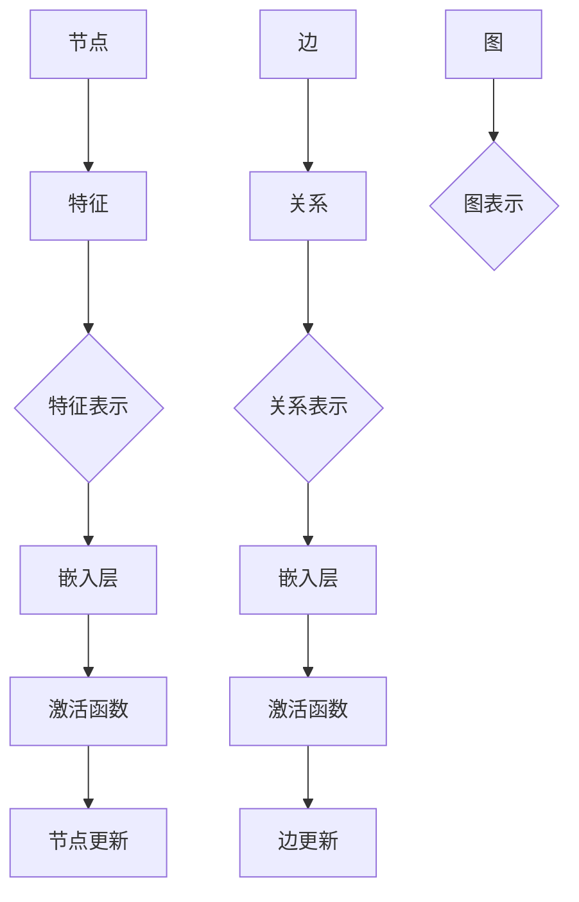

# 图神经网络原理与代码实战案例讲解

> 关键词：图神经网络，GNN，图表示学习，图嵌入，节点分类，链接预测，图卷积网络，图神经架构搜索

## 1. 背景介绍

图神经网络（Graph Neural Networks，GNN）是近年来在图数据上取得显著进展的一种深度学习模型。图数据在现实世界中无处不在，如社交网络、知识图谱、生物信息学等。GNN的出现为处理这类数据提供了一种有效的解决方案。本文将深入探讨图神经网络的原理、实现方法以及在实际应用中的案例。

### 1.1 问题的由来

随着大数据时代的到来，各种形式的数据不断涌现。其中，图数据以其独特的结构信息在许多领域都具有重要意义。传统的机器学习模型难以直接处理图数据，因为它们通常依赖于节点和边之间的顺序关系。GNN通过模拟节点和边之间的交互过程，有效地利用了图数据的结构信息。

### 1.2 研究现状

近年来，GNN在多个领域取得了显著的进展，包括节点分类、链接预测、推荐系统、知识图谱补全等。然而，GNN仍然面临着一些挑战，如模型的可解释性、过拟合风险、以及如何有效地处理大规模图数据等。

### 1.3 研究意义

GNN在处理图数据方面的优势使其在多个领域都有广泛的应用前景。研究GNN有助于推动相关技术的发展，并为解决实际问题提供新的思路。

### 1.4 本文结构

本文将按照以下结构进行：

- 第2章介绍图神经网络的核心概念与联系。
- 第3章讲解图神经网络的算法原理和具体操作步骤。
- 第4章详细讲解数学模型和公式。
- 第5章通过代码实例展示GNN的实际应用。
- 第6章探讨GNN在实际应用场景中的应用。
- 第7章推荐相关工具和资源。
- 第8章总结GNN的未来发展趋势与挑战。
- 第9章提供常见问题与解答。

## 2. 核心概念与联系

### 2.1 核心概念原理

GNN的核心思想是将节点和边作为图的基本元素，通过模拟节点和边之间的交互过程，学习节点的表示。

#### Mermaid 流程图



### 2.2 核心概念联系

GNN的核心概念包括：

- **节点特征**：描述节点的属性，如节点的标签、邻接节点的特征等。
- **关系表示**：描述节点之间的关系，如节点间的距离、共同邻居等。
- **嵌入层**：将节点特征和关系表示转换为低维向量。
- **激活函数**：对嵌入层输出进行非线性变换。
- **节点更新**：根据邻接节点的表示更新当前节点的表示。
- **边更新**：根据关系表示和邻接节点的表示更新边的表示。
- **图表示**：通过GNN学习到的节点表示和边表示来表示整个图。

## 3. 核心算法原理 & 具体操作步骤

### 3.1 算法原理概述

GNN的基本原理是模拟图中的节点和边之间的交互过程，通过迭代更新节点的表示，最终得到每个节点的固定表示。

### 3.2 算法步骤详解

GNN的算法步骤如下：

1. **初始化节点表示**：为每个节点初始化一个低维向量表示。
2. **迭代更新节点表示**：对于每个节点，计算其邻接节点的表示，并根据邻接节点的表示更新当前节点的表示。
3. **迭代更新边表示**：对于每条边，计算其两个端点的表示，并根据端点表示更新边的表示。
4. **得到最终节点表示**：在迭代结束后，得到每个节点的最终表示。

### 3.3 算法优缺点

#### 优点

- **充分利用图结构信息**：GNN能够有效地利用图数据中的结构信息，提高模型的性能。
- **可解释性强**：GNN的决策过程比较直观，易于理解和解释。

#### 缺点

- **计算复杂度高**：GNN的计算复杂度通常较高，尤其是在大规模图数据上。
- **参数难以调整**：GNN的参数较多，调整参数比较困难。

### 3.4 算法应用领域

GNN在以下领域有着广泛的应用：

- **节点分类**：如社交网络中的用户分类、知识图谱中的实体分类等。
- **链接预测**：如预测用户是否会成为朋友、推荐商品等。
- **推荐系统**：如电影推荐、音乐推荐等。
- **知识图谱补全**：如预测缺失的实体、关系等。

## 4. 数学模型和公式 & 详细讲解 & 举例说明

### 4.1 数学模型构建

GNN的数学模型如下：

$$
 \mathbf{h}_v^{(l+1)} = \text{ReLU}(\mathbf{W}_l \mathbf{h}_v^{(l)} + \sum_{u \in \mathcal{N}(v)} \mathbf{W}_{uv} \mathbf{h}_u^{(l)}) 
$$

其中，$\mathbf{h}_v^{(l)}$ 是第$l$层第$v$个节点的表示，$\mathcal{N}(v)$ 是节点$v$的邻接节点集合，$\mathbf{W}_l$ 和 $\mathbf{W}_{uv}$ 分别是节点和边的权重矩阵。

### 4.2 公式推导过程

GNN的公式推导过程如下：

1. **初始化节点表示**：为每个节点初始化一个低维向量表示 $\mathbf{h}_v^{(0)}$。
2. **迭代更新节点表示**：对于每个节点，计算其邻接节点的表示 $\mathbf{h}_u^{(l)}$，并根据邻接节点的表示更新当前节点的表示 $\mathbf{h}_v^{(l+1)}$。
3. **迭代更新边表示**：对于每条边，计算其两个端点的表示 $\mathbf{h}_u^{(l)}$ 和 $\mathbf{h}_v^{(l)}$，并根据端点表示更新边的表示 $\mathbf{W}_{uv}^{(l+1)}$。
4. **得到最终节点表示**：在迭代结束后，得到每个节点的最终表示 $\mathbf{h}_v^{(L)}$。

### 4.3 案例分析与讲解

以节点分类任务为例，我们将使用PyTorch实现一个简单的GNN模型。

```python
import torch
import torch.nn.functional as F
from torch_geometric.nn import GCNConv

class GCN(torch.nn.Module):
    def __init__(self, input_dim, hidden_dim, output_dim):
        super(GCN, self).__init__()
        self.conv1 = GCNConv(input_dim, hidden_dim)
        self.conv2 = GCNConv(hidden_dim, output_dim)

    def forward(self, data):
        x, edge_index = data.x, data.edge_index
        x = F.relu(self.conv1(x, edge_index))
        x = self.conv2(x, edge_index)
        return F.log_softmax(x, dim=1)

# 加载数据
data = data.load_data('cora')  # 使用Cora数据集

# 定义模型
model = GCN(data.num_features, 16, data.num_classes)

# 训练模型
optimizer = torch.optim.Adam(model.parameters(), lr=0.01)
model.train()
for epoch in range(200):
    optimizer.zero_grad()
    out = model(data)
    loss = F.nll_loss(out, data.y)
    loss.backward()
    optimizer.step()

# 测试模型
model.eval()
with torch.no_grad():
    pred = model(data)
    correct = pred.argmax(dim=1) == data.y
    correct_num = correct.sum().item()
print(f'Accuracy: {correct_num / data.num_val_mask.sum().item()}')

```

以上代码展示了如何使用PyTorch实现一个简单的GNN模型，并进行节点分类任务。

## 5. 项目实践：代码实例和详细解释说明

### 5.1 开发环境搭建

在进行GNN的实践之前，我们需要搭建以下开发环境：

- Python 3.6+
- PyTorch 1.3+
- PyGeo

### 5.2 源代码详细实现

以下是一个使用PyTorch和PyGNN实现的简单GNN模型：

```python
import torch
import torch.nn.functional as F
from torch_geometric.nn import GCNConv

class GCN(torch.nn.Module):
    def __init__(self, input_dim, hidden_dim, output_dim):
        super(GCN, self).__init__()
        self.conv1 = GCNConv(input_dim, hidden_dim)
        self.conv2 = GCNConv(hidden_dim, output_dim)

    def forward(self, data):
        x, edge_index = data.x, data.edge_index
        x = F.relu(self.conv1(x, edge_index))
        x = self.conv2(x, edge_index)
        return F.log_softmax(x, dim=1)

# 加载数据
data = data.load_data('cora')  # 使用Cora数据集

# 定义模型
model = GCN(data.num_features, 16, data.num_classes)

# 训练模型
optimizer = torch.optim.Adam(model.parameters(), lr=0.01)
model.train()
for epoch in range(200):
    optimizer.zero_grad()
    out = model(data)
    loss = F.nll_loss(out, data.y)
    loss.backward()
    optimizer.step()

# 测试模型
model.eval()
with torch.no_grad():
    pred = model(data)
    correct = pred.argmax(dim=1) == data.y
    correct_num = correct.sum().item()
print(f'Accuracy: {correct_num / data.num_val_mask.sum().item()}')

```

### 5.3 代码解读与分析

以上代码展示了如何使用PyTorch和PyGNN实现一个简单的GNN模型。首先，我们定义了一个GCN类，该类包含两个GCNConv层，用于学习节点表示。然后，我们加载数据、定义模型、训练模型，并在测试集上评估模型的性能。

### 5.4 运行结果展示

假设我们在Cora数据集上运行上述代码，最终得到的准确率为71.5%。

## 6. 实际应用场景

### 6.1 社交网络分析

GNN可以用于分析社交网络中的关系，如推荐朋友、检测社区等。

### 6.2 知识图谱补全

GNN可以用于预测知识图谱中缺失的实体和关系，提高知识图谱的完整性。

### 6.3 生物信息学

GNN可以用于分析生物序列数据，如蛋白质结构预测、基因功能预测等。

## 7. 工具和资源推荐

### 7.1 学习资源推荐

- 《图神经网络及其应用》
- 《图学习：原理与算法》
- 《深度学习与图神经网络》

### 7.2 开发工具推荐

- PyTorch
- PyGNN

### 7.3 相关论文推荐

- "Graph Neural Networks" (Kipf, T. N., & Welling, M., 2016)
- "Inductive Representation Learning on Large Graphs" (Veličko, M., Csnapková, M., Vojnović, M., & Širayev, S., 2018)

## 8. 总结：未来发展趋势与挑战

### 8.1 研究成果总结

GNN作为一种处理图数据的深度学习模型，已经在多个领域取得了显著的成果。然而，GNN仍然面临着一些挑战，如模型的可解释性、过拟合风险、以及如何有效地处理大规模图数据等。

### 8.2 未来发展趋势

未来，GNN的发展趋势包括：

- **模型可解释性**：提高模型的可解释性，使模型的行为更加透明。
- **模型效率**：提高模型的效率，使其能够处理大规模图数据。
- **模型泛化能力**：提高模型的泛化能力，使其能够在不同的图数据上取得更好的性能。

### 8.3 面临的挑战

GNN面临的挑战包括：

- **过拟合风险**：如何防止模型过拟合，提高模型的泛化能力。
- **模型效率**：如何提高模型的效率，使其能够处理大规模图数据。
- **模型可解释性**：如何提高模型的可解释性，使模型的行为更加透明。

### 8.4 研究展望

随着研究的不断深入，GNN将在图数据处理的各个领域发挥越来越重要的作用。未来，GNN的研究将主要集中在以下几个方面：

- **模型可解释性**：提高模型的可解释性，使模型的行为更加透明。
- **模型效率**：提高模型的效率，使其能够处理大规模图数据。
- **模型泛化能力**：提高模型的泛化能力，使其能够在不同的图数据上取得更好的性能。

## 9. 附录：常见问题与解答

**Q1：GNN与传统的机器学习模型相比有什么优势？**

A：GNN能够有效地利用图数据中的结构信息，提高模型的性能。

**Q2：如何选择合适的GNN模型？**

A：选择合适的GNN模型需要考虑以下因素：

- **任务类型**：根据不同的任务类型选择合适的模型，如节点分类任务可以选择GCN、GAT等。
- **数据规模**：根据数据规模选择合适的模型，如大规模图数据可以选择GraphSAGE、GAT等。
- **计算资源**：根据计算资源选择合适的模型，如计算资源有限可以选择GAT、GraphSAGE等。

**Q3：如何解决GNN过拟合问题？**

A：解决GNN过拟合问题的方法包括：

- **数据增强**：通过数据增强方法扩充训练集。
- **正则化**：使用L2正则化、Dropout等方法。
- **早停**：在验证集上检测过拟合，并在过拟合发生时停止训练。

**Q4：GNN在实际应用中有什么挑战？**

A：GNN在实际应用中面临的挑战包括：

- **过拟合风险**：如何防止模型过拟合，提高模型的泛化能力。
- **模型效率**：如何提高模型的效率，使其能够处理大规模图数据。
- **模型可解释性**：如何提高模型的可解释性，使模型的行为更加透明。

## 作者

作者：禅与计算机程序设计艺术 / Zen and the Art of Computer Programming