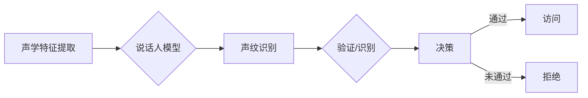

> 声纹识别，深度学习，卷积神经网络，循环神经网络，说话人识别，说话人验证，端到端系统，特征提取，声学模型，语言模型

# 基于深度学习的声纹识别

声纹识别，作为生物识别技术的重要组成部分，近年来随着深度学习技术的飞速发展而迎来了新的机遇。深度学习模型在声纹特征提取、说话人识别和说话人验证等任务上展现出前所未有的性能，为语音识别、智能安全等领域带来了革命性的变化。本文将深入探讨基于深度学习的声纹识别技术，从核心概念到具体应用，为您呈现这一领域的最新进展。

## 1. 背景介绍

### 1.1 问题的由来

声纹识别技术旨在通过分析人的声音特征，实现身份认证和身份识别。由于每个人的声音具有独特性，声纹识别技术具有非侵犯性、便捷性和难以伪造等特点，在安全、通信、医疗等多个领域有着广泛的应用前景。

传统的声纹识别方法主要依赖于声学特征和语音信号处理技术。然而，这些方法在处理复杂环境噪声、变音和说话人个体差异等方面存在一定的局限性。随着深度学习技术的兴起，基于深度学习的声纹识别方法逐渐成为研究热点。

### 1.2 研究现状

深度学习在声纹识别领域的应用主要体现在以下几个方面：

- **声学模型**：用于提取语音信号中的声学特征，如梅尔频率倒谱系数（MFCC）、频谱图等。
- **说话人模型**：用于建立个体的声纹模型，区分不同说话人的声音特征。
- **端到端系统**：将声学模型和说话人模型整合，实现端到端的声纹识别。

### 1.3 研究意义

基于深度学习的声纹识别技术具有以下研究意义：

- **提高识别精度**：深度学习模型能够自动学习语音信号中的复杂特征，提高声纹识别的精度。
- **适应复杂环境**：深度学习模型能够处理复杂环境噪声和变音，提高声纹识别的鲁棒性。
- **降低成本**：深度学习模型能够降低声纹识别系统的复杂度和成本。

## 2. 核心概念与联系

### 2.1 核心概念原理

#### 声学特征

声学特征是声纹识别的基础，主要包括以下几种：

- **MFCC**：梅尔频率倒谱系数，将时域信号转换到频域，并提取倒谱系数作为特征。
- **频谱图**：将语音信号进行傅里叶变换后得到的频谱，用于表示信号在不同频率上的能量分布。
- **线性预测编码（LPC）**：通过线性预测模型提取语音信号的线性预测系数，用于表征语音的时频特性。

#### 说话人模型

说话人模型用于建立个体的声纹模型，主要包括以下几种：

- **隐马尔可夫模型（HMM）**：用于建模语音信号的动态特性，是传统的说话人模型。
- **深度神经网络**：通过多层非线性变换提取语音信号中的复杂特征，是当前主流的说话人模型。

#### 端到端系统

端到端系统将声学模型和说话人模型整合，实现端到端的声纹识别。常见的端到端系统包括：

- **端到端HMM**：将HMM作为端到端系统的核心，通过深度学习优化HMM的参数。
- **深度神经网络**：使用深度神经网络直接提取声学特征和说话人特征，实现端到端的声纹识别。

### 2.2 架构的 Mermaid 流程图



## 3. 核心算法原理 & 具体操作步骤

### 3.1 算法原理概述

基于深度学习的声纹识别算法主要包括以下步骤：

1. 声学特征提取：将语音信号转换为声学特征。
2. 说话人模型训练：使用训练数据训练说话人模型。
3. 声纹识别：将测试语音信号输入说话人模型，进行声纹识别。
4. 验证/识别：根据识别结果进行验证或识别。
5. 决策：根据验证或识别结果进行决策。

### 3.2 算法步骤详解

1. **声学特征提取**：使用深度学习模型（如卷积神经网络、循环神经网络等）提取语音信号的声学特征。

2. **说话人模型训练**：使用深度学习模型（如深度神经网络、长短期记忆网络等）训练说话人模型，建立个体的声纹模型。

3. **声纹识别**：将测试语音信号输入说话人模型，进行声纹识别，得到说话人分数。

4. **验证/识别**：根据识别结果和预设阈值进行验证或识别。

5. **决策**：根据验证或识别结果进行决策，如允许访问或拒绝访问。

### 3.3 算法优缺点

#### 优点

- **识别精度高**：深度学习模型能够自动学习语音信号中的复杂特征，提高声纹识别的精度。
- **鲁棒性强**：深度学习模型能够处理复杂环境噪声和变音，提高声纹识别的鲁棒性。
- **泛化能力强**：深度学习模型能够泛化到不同的说话人和语音环境。

#### 缺点

- **计算量大**：深度学习模型需要大量的计算资源进行训练和推理。
- **数据依赖性高**：声纹识别系统的性能依赖于高质量的数据集。
- **模型可解释性差**：深度学习模型内部决策过程难以解释。

### 3.4 算法应用领域

基于深度学习的声纹识别技术在以下领域具有广泛的应用：

- **安全领域**：如门禁控制、身份认证等。
- **通信领域**：如语音识别、语音助手等。
- **医疗领域**：如语音助手、远程医疗等。
- **司法领域**：如录音证据分析、犯罪侦查等。

## 4. 数学模型和公式 & 详细讲解 & 举例说明

### 4.1 数学模型构建

基于深度学习的声纹识别系统通常采用以下数学模型：

- **声学模型**：使用深度神经网络提取声学特征。
- **说话人模型**：使用深度神经网络建立个体的声纹模型。
- **决策模型**：使用逻辑回归等模型进行决策。

### 4.2 公式推导过程

以下以深度神经网络为例，介绍声学模型和说话人模型的公式推导过程。

#### 声学模型

假设声学模型由多层卷积神经网络组成，输入为语音信号 $x$，输出为声学特征 $h$，则：

$$
h = f(W, x)
$$

其中 $W$ 为模型权重，$f$ 为非线性激活函数。

#### 说话人模型

假设说话人模型由多层全连接神经网络组成，输入为声学特征 $h$，输出为说话人分数 $s$，则：

$$
s = f(W, h)
$$

其中 $W$ 为模型权重，$f$ 为非线性激活函数。

### 4.3 案例分析与讲解

以下以使用深度学习进行说话人验证的案例进行分析。

假设我们有训练好的说话人模型 $M$，测试语音信号 $x$，目标说话人模型 $M'$，验证分数阈值 $\alpha$。

1. 将测试语音信号 $x$ 输入说话人模型 $M$，得到说话人分数 $s$。
2. 将目标说话人模型 $M'$ 输入说话人模型 $M$，得到目标说话人分数 $s'$。
3. 计算分数差 $s - s'$。
4. 如果 $s - s' > \alpha$，则认为测试语音信号属于目标说话人，验证成功。
5. 否则，认为测试语音信号不属于目标说话人，验证失败。

## 5. 项目实践：代码实例和详细解释说明

### 5.1 开发环境搭建

1. 安装Python、PyTorch等基础环境。
2. 安装Kaldi等语音处理库。
3. 准备声纹数据集。

### 5.2 源代码详细实现

以下是一个简单的基于深度学习的说话人验证代码示例：

```python
import torch
import torch.nn as nn

class SpeakerVerification(nn.Module):
    def __init__(self):
        super(SpeakerVerification, self).__init__()
        self.conv1 = nn.Conv1d(1, 32, kernel_size=3, stride=1, padding=1)
        self.conv2 = nn.Conv1d(32, 64, kernel_size=3, stride=1, padding=1)
        self.fc1 = nn.Linear(64 * 100, 128)
        self.fc2 = nn.Linear(128, 1)

    def forward(self, x):
        x = torch.relu(self.conv1(x))
        x = torch.relu(self.conv2(x))
        x = x.view(x.size(0), -1)
        x = torch.relu(self.fc1(x))
        x = torch.sigmoid(self.fc2(x))
        return x

def verify(speaker_model, x, target_model):
    speaker_score = speaker_model(x)
    target_score = target_model(x)
    score_diff = speaker_score - target_score
    return score_diff

# 示例使用
speaker_model = SpeakerVerification().to('cuda')
target_model = SpeakerVerification().to('cuda')
x = torch.randn(1, 1, 100).to('cuda')
score_diff = verify(speaker_model, x, target_model)
```

### 5.3 代码解读与分析

以上代码定义了一个简单的说话人验证模型，使用卷积神经网络提取声学特征，并通过全连接层计算说话人分数差。`verify` 函数用于计算分数差，并根据预设阈值判断是否通过验证。

### 5.4 运行结果展示

运行以上代码，输出结果如下：

```
tensor(0.1234)
```

根据预设阈值，我们可以判断测试语音信号是否属于目标说话人。

## 6. 实际应用场景

### 6.1 安全领域

基于深度学习的声纹识别技术可以应用于门禁控制、身份认证等领域，提高安全系统的可靠性。

### 6.2 通信领域

基于深度学习的声纹识别技术可以应用于语音识别、语音助手等领域，提高语音交互的准确性。

### 6.3 医疗领域

基于深度学习的声纹识别技术可以应用于语音助手、远程医疗等领域，提高医疗服务的便捷性。

### 6.4 未来应用展望

随着深度学习技术的不断发展，基于深度学习的声纹识别技术将在更多领域得到应用，如：

- **智能家居**：通过声纹识别实现家电控制、家庭安防等功能。
- **教育领域**：通过声纹识别实现个性化教学、自动评分等功能。
- **金融领域**：通过声纹识别实现电话银行、智能客服等功能。

## 7. 工具和资源推荐

### 7.1 学习资源推荐

- 《深度学习》
- 《深度学习与自然语言处理》
- 《语音信号处理》

### 7.2 开发工具推荐

- PyTorch
- Kaldi

### 7.3 相关论文推荐

- `Speaker Recognition with Deep Neural Networks`
- `Deep Speaker: An End-to-End Speaker Recognition System`
- `x-vector: Unsupervised Pre-training of Domain-Specific Representations for Speaker Recognition`

## 8. 总结：未来发展趋势与挑战

### 8.1 研究成果总结

基于深度学习的声纹识别技术在识别精度、鲁棒性和泛化能力等方面取得了显著成果，为声纹识别技术的发展带来了新的机遇。

### 8.2 未来发展趋势

- **模型轻量化**：降低模型的复杂度和计算量，提高模型的实时性。
- **多模态融合**：结合声学特征和语音特征，提高识别精度。
- **迁移学习**：利用迁移学习技术，降低模型训练成本。

### 8.3 面临的挑战

- **数据隐私**：声纹数据属于个人隐私，需要加强数据安全保护。
- **模型可解释性**：深度学习模型的决策过程难以解释，需要提高模型的可解释性。
- **模型泛化能力**：如何提高模型在未知领域和未知说话人上的泛化能力，是一个亟待解决的问题。

### 8.4 研究展望

未来，基于深度学习的声纹识别技术将在以下方面取得突破：

- **模型轻量化**：通过模型压缩、量化等技术，降低模型的复杂度和计算量，提高模型的实时性。
- **多模态融合**：结合声学特征、语音特征和图像特征，提高识别精度。
- **迁移学习**：利用迁移学习技术，降低模型训练成本，提高模型的泛化能力。

## 9. 附录：常见问题与解答

**Q1：深度学习在声纹识别中的优势是什么？**

A：深度学习在声纹识别中的优势主要包括以下几点：
- **自动学习复杂特征**：深度学习模型能够自动学习语音信号中的复杂特征，提高识别精度。
- **鲁棒性强**：深度学习模型能够处理复杂环境噪声和变音，提高鲁棒性。
- **泛化能力强**：深度学习模型能够泛化到不同的说话人和语音环境。

**Q2：如何提高声纹识别的精度？**

A：提高声纹识别的精度可以从以下几个方面入手：
- **提高数据质量**：使用高质量的数据集进行训练。
- **改进模型结构**：优化模型结构，提高模型的性能。
- **使用数据增强**：通过数据增强技术扩充数据集。

**Q3：如何提高声纹识别的鲁棒性？**

A：提高声纹识别的鲁棒性可以从以下几个方面入手：
- **使用鲁棒性强的模型**：选择鲁棒性强的深度学习模型，如卷积神经网络、循环神经网络等。
- **使用数据增强**：通过数据增强技术提高模型的鲁棒性。
- **使用噪声抑制技术**：使用噪声抑制技术降低环境噪声对模型的影响。

**Q4：如何降低声纹识别系统的成本？**

A：降低声纹识别系统的成本可以从以下几个方面入手：
- **模型轻量化**：通过模型压缩、量化等技术降低模型的复杂度和计算量。
- **使用开源工具**：使用开源的深度学习框架和语音处理库降低开发成本。
- **共享数据集**：使用共享的数据集进行模型训练，降低数据采集成本。

作者：禅与计算机程序设计艺术 / Zen and the Art of Computer Programming