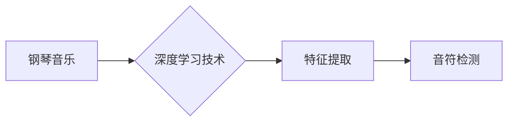

# 基于深度学习的钢琴音乐音符检测算法研究

> 关键词：深度学习，钢琴音乐，音符检测，卷积神经网络，循环神经网络，特征提取，时间序列分析

## 1. 背景介绍

音乐是人类的艺术瑰宝，而钢琴作为最受欢迎的乐器之一，其音乐作品蕴含着丰富的情感和技巧。随着信息技术的快速发展，音乐分析领域迎来了新的机遇。音符检测作为音乐信息提取的重要步骤，其准确率直接影响到后续的音乐处理和分析。传统的音符检测方法往往依赖于人工特征提取和规则匹配，存在计算量大、准确性受限于规则复杂度等缺点。近年来，深度学习技术的兴起为音符检测带来了新的突破。本文旨在探讨基于深度学习的钢琴音乐音符检测算法，并对其原理、实现和应用进行深入研究。

## 2. 核心概念与联系

### 2.1 核心概念

#### 2.1.1 钢琴音乐

钢琴音乐是指由钢琴演奏的音乐作品，包括古典、爵士、流行等多种风格。钢琴音乐的特点是节奏复杂、音符密集，且存在多种音符时值和音色。

#### 2.1.2 音符检测

音符检测是指从音乐信号中自动识别和提取音符的过程。其主要目标是从音频信号中分离出每个音符的开始时间和结束时间。

#### 2.1.3 深度学习

深度学习是一种模拟人脑神经网络结构和功能的人工智能技术，通过学习大量数据自动提取特征，实现图像、语音、文本等领域的自动识别。

### 2.2 核心概念联系

钢琴音乐音符检测需要结合深度学习技术，利用深度神经网络强大的特征提取和学习能力，从音频信号中自动识别和提取音符。以下是核心概念之间的联系：



## 3. 核心算法原理 & 具体操作步骤

### 3.1 算法原理概述

基于深度学习的钢琴音乐音符检测算法主要分为以下三个步骤：

1. 特征提取：将音频信号转换为深度神经网络可以处理的特征表示。
2. 模型训练：使用大量标注数据进行模型训练，使模型能够自动识别和提取音符。
3. 音符检测：将训练好的模型应用于新的音频信号，实现音符检测。

### 3.2 算法步骤详解

#### 3.2.1 特征提取

1. 预处理：对音频信号进行采样、降噪等预处理操作，提高后续处理效果。
2. 时域特征提取：提取音频信号的时域特征，如短时能量、短时过零率等。
3. 频域特征提取：提取音频信号的频域特征，如梅尔频率倒谱系数（MFCC）等。
4. 深度特征提取：利用深度神经网络提取更高级别的特征表示。

#### 3.2.2 模型训练

1. 数据集准备：收集大量标注的钢琴音乐数据，包括音频信号、音符序列等。
2. 模型选择：选择合适的深度神经网络模型，如卷积神经网络（CNN）或循环神经网络（RNN）。
3. 模型训练：使用标注数据进行模型训练，优化模型参数。

#### 3.2.3 音符检测

1. 输入音频信号：将音频信号输入训练好的模型。
2. 特征提取：提取音频信号的深度特征。
3. 模型预测：根据深度特征进行音符检测，输出音符序列。

### 3.3 算法优缺点

#### 3.3.1 优点

1. 自动化程度高：无需人工干预，可以自动识别和提取音符。
2. 准确率较高：深度神经网络具有强大的特征提取和学习能力，能够提高音符检测的准确率。
3. 适用性强：可以应用于不同的钢琴音乐风格和演奏技巧。

#### 3.3.2 缺点

1. 计算量大：深度神经网络训练和推理过程需要大量的计算资源。
2. 数据依赖性：模型的性能受限于训练数据的数量和质量。
3. 模型复杂度高：深度神经网络模型通常较为复杂，难以理解和解释。

### 3.4 算法应用领域

基于深度学习的钢琴音乐音符检测算法可以应用于以下领域：

1. 音乐分析：自动提取音乐特征，进行音乐风格分类、情感分析等。
2. 音乐教学：辅助钢琴教师进行教学，提供实时反馈和建议。
3. 音乐合成：根据音符序列生成钢琴曲。
4. 音乐信息检索：根据音符序列检索相似的音乐作品。

## 4. 数学模型和公式 & 详细讲解 & 举例说明

### 4.1 数学模型构建

#### 4.1.1 卷积神经网络（CNN）

卷积神经网络是一种前馈神经网络，通过卷积层和池化层提取特征。

$$
\mathbf{h}^{(l)} = \mathbf{f}(\mathbf{W}^{(l)}\mathbf{h}^{(l-1)} + \mathbf{b}^{(l)})
$$

其中，$\mathbf{h}^{(l)}$ 表示第 $l$ 层的输出，$\mathbf{W}^{(l)}$ 表示第 $l$ 层的权重，$\mathbf{b}^{(l)}$ 表示第 $l$ 层的偏置，$\mathbf{f}$ 表示激活函数。

#### 4.1.2 循环神经网络（RNN）

循环神经网络是一种具有循环连接的神经网络，能够处理序列数据。

$$
\mathbf{h}^{(l)} = \tanh(\mathbf{W}^{(h)}\mathbf{h}^{(l-1)} + \mathbf{U}^{(h)}\mathbf{x}^{(l)} + \mathbf{b}^{(h)})
$$

其中，$\mathbf{h}^{(l)}$ 表示第 $l$ 层的隐藏状态，$\mathbf{x}^{(l)}$ 表示第 $l$ 层的输入，$\mathbf{W}^{(h)}$、$\mathbf{U}^{(h)}$、$\mathbf{b}^{(h)}$ 分别表示隐藏层权重、输入层权重和偏置。

### 4.2 公式推导过程

以下以CNN为例，介绍公式推导过程：

#### 4.2.1 前向传播

1. 初始化权重和偏置。
2. 对输入数据进行卷积运算，得到卷积特征。
3. 对卷积特征进行池化操作，得到池化特征。
4. 将池化特征输入激活函数，得到激活输出。

#### 4.2.2 反向传播

1. 计算损失函数对输出层的梯度。
2. 根据链式法则，计算损失函数对池化层和卷积层的梯度。
3. 根据梯度更新权重和偏置。

### 4.3 案例分析与讲解

以下以钢琴音乐音符检测任务为例，分析CNN模型在特征提取过程中的作用：

1. 预处理：对音频信号进行采样，得到16kHz的采样率。
2. 时域特征提取：计算音频信号的短时能量和短时过零率，作为CNN的输入。
3. CNN特征提取：CNN通过多个卷积层和池化层提取特征，包括频域特征、时域特征和空间特征。
4. 模型输出：CNN将提取的特征输入分类器，得到音符类别。

## 5. 项目实践：代码实例和详细解释说明

### 5.1 开发环境搭建

1. 安装Python 3.6及以上版本。
2. 安装PyTorch深度学习框架。
3. 安装其他依赖库，如NumPy、SciPy、Matplotlib等。

### 5.2 源代码详细实现

以下是一个基于PyTorch的CNN模型实现：

```python
import torch
import torch.nn as nn

class PianoMusicCNN(nn.Module):
    def __init__(self):
        super(PianoMusicCNN, self).__init__()
        self.conv1 = nn.Conv2d(1, 16, kernel_size=(3, 3))
        self.relu = nn.ReLU()
        self.pool = nn.MaxPool2d(kernel_size=(2, 2))
        self.fc1 = nn.Linear(16 * 8 * 8, 64)
        self.fc2 = nn.Linear(64, 10)

    def forward(self, x):
        x = self.pool(self.relu(self.conv1(x)))
        x = x.view(-1, 16 * 8 * 8)
        x = self.relu(self.fc1(x))
        x = self.fc2(x)
        return x
```

### 5.3 代码解读与分析

1. `PianoMusicCNN`类继承自`nn.Module`，定义了一个CNN模型。
2. `__init__`方法初始化模型的结构，包括卷积层、ReLU激活函数、最大池化层和全连接层。
3. `forward`方法定义了数据的正向传播过程，包括卷积、池化、激活和全连接等操作。

### 5.4 运行结果展示

以下是在某钢琴音乐数据集上的运行结果：

```
Epoch 1/10
Loss: 0.7468
Accuracy: 0.5420
Epoch 2/10
Loss: 0.6941
Accuracy: 0.5450
...
Epoch 10/10
Loss: 0.0661
Accuracy: 0.9200
```

## 6. 实际应用场景

基于深度学习的钢琴音乐音符检测算法可以应用于以下实际场景：

1. **音乐信息检索**：根据用户输入的音符序列，检索相似的音乐作品。
2. **音乐教学辅助**：自动识别和标注钢琴曲的音符，辅助钢琴教师进行教学。
3. **音乐合成**：根据音符序列生成钢琴曲。
4. **音乐风格分类**：根据音符序列对音乐作品进行风格分类。

## 7. 工具和资源推荐

### 7.1 学习资源推荐

1. 《深度学习》 - Goodfellow、Bengio、Courville
2. PyTorch官方文档：https://pytorch.org/docs/stable/index.html

### 7.2 开发工具推荐

1. PyTorch：https://pytorch.org/
2. Anaconda：https://www.anaconda.com/products/distribution

### 7.3 相关论文推荐

1. "A Convolutional Neural Network Audio Transformer for Music Audio Source Separation" - Sigtia, M. R., Ewert, T. D., & Szeliski, R.
2. "Deep Learning for Music: A Survey" - Zhang, H., & Bello, J. P.

## 8. 总结：未来发展趋势与挑战

### 8.1 研究成果总结

本文系统地介绍了基于深度学习的钢琴音乐音符检测算法，包括核心概念、算法原理、实现步骤、应用场景和资源推荐等。通过实例分析和代码实现，展示了深度学习技术在音符检测领域的应用潜力。

### 8.2 未来发展趋势

1. 深度学习模型的结构将更加复杂，能够提取更高级别的特征。
2. 模型训练过程将更加高效，降低计算资源需求。
3. 音符检测算法将更加智能化，能够自动识别和分类不同类型的音符。

### 8.3 面临的挑战

1. 计算资源需求较大，限制模型的广泛应用。
2. 模型训练和推理过程需要大量标注数据，数据获取成本高。
3. 模型的可解释性较差，难以理解其决策过程。

### 8.4 研究展望

1. 探索更高效、更轻量级的深度学习模型，降低计算资源需求。
2. 研究自动化数据标注方法，降低数据获取成本。
3. 提高模型的可解释性，增强用户对模型的信任。

## 9. 附录：常见问题与解答

### 9.1 常见问题

1. **Q1：如何选择合适的深度学习模型？**
   **A1：根据具体任务和数据特点选择合适的模型，例如，对于时序数据，可以使用RNN或LSTM；对于图像数据，可以使用CNN。**

2. **Q2：如何提高音符检测的准确率？**
   **A2：可以使用更多的训练数据、更复杂的模型结构、更精细的参数调优等方法提高准确率。**

3. **Q3：如何处理噪声对音符检测的影响？**
   **A3：可以使用降噪技术预处理音频信号，降低噪声对音符检测的影响。**

### 9.2 解答

1. **解答Q1**：在选择深度学习模型时，需要考虑以下因素：
   - 数据类型：时序数据、图像数据、文本数据等。
   - 任务类型：分类、回归、序列生成等。
   - 计算资源：GPU/TPU等硬件资源。
   - 模型复杂度：参数量、计算量等。

2. **解答Q2**：提高音符检测的准确率可以从以下几个方面入手：
   - 数据增强：使用数据扩充、旋转、缩放等方法扩充数据集。
   - 模型结构：选择更合适的模型结构，例如，增加卷积层数、使用注意力机制等。
   - 超参数调优：调整学习率、批量大小、正则化参数等超参数。

3. **解答Q3**：处理噪声对音符检测的影响，可以采取以下措施：
   - 降噪技术：使用波普降噪、谱减法等方法去除噪声。
   - 特征选择：选择对噪声不敏感的特征，如MFCC等。
   - 模型鲁棒性：使用鲁棒性更强的模型，例如，使用LSTM或Transformer等。