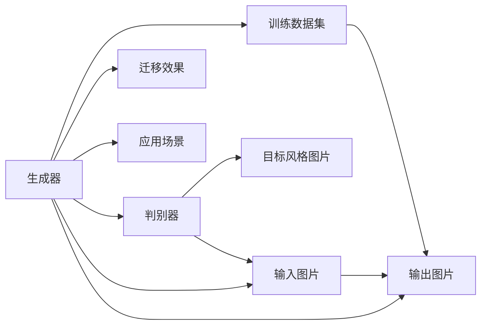

                 

# 基于生成对抗网络的室内设计风格迁移工具研发

> 关键词：室内设计风格迁移, 生成对抗网络, GANs, 图像风格转换, 风格迁移算法, 风格迁移应用

## 1. 背景介绍

### 1.1 问题由来

随着数字化和互联网技术的迅速发展，室内设计行业也进入了数字化转型的新阶段。室内设计师和客户可以通过在线平台查看、比较和选择设计方案，从而更高效地完成项目。然而，数字化转型也带来了新的挑战，如何设计出更符合用户需求的室内设计方案？如何自动实现设计风格的迁移和风格转换？

室内设计风格的迁移工具可以帮助设计师和客户快速实现从一种设计风格向另一种设计风格的转换，提升设计效率和客户满意度。这类工具通常需要综合考虑建筑、家具、照明、色彩等多个方面的风格元素，并自动地应用这些元素到新的设计方案中。

当前，室内设计风格迁移工具大多依赖手工编辑或半自动化的工具，效率低下且易出错。为了提升迁移工具的自动化程度，基于生成对抗网络（GANs）的风格迁移技术逐渐引起了研究者的关注。生成对抗网络能够自动地进行风格迁移，无需手工标注，节省了大量的时间和成本，同时可以生成高质量的设计图片。

### 1.2 问题核心关键点

基于生成对抗网络的室内设计风格迁移工具，其核心技术点包括：

- 风格迁移算法：利用GANs等生成模型，自动地将输入图片从一种风格转换为另一种风格。
- 数据集构建：设计风格迁移任务通常需要构建包含多种设计风格的训练数据集，涵盖建筑、家具、照明、色彩等多个方面的风格元素。
- 参数优化与训练：优化模型的训练参数，提高迁移效果。
- 应用与部署：将模型部署到实际应用场景中，提供高效的设计风格迁移服务。

本文聚焦于基于生成对抗网络的室内设计风格迁移工具的研发，包括风格迁移算法的构建、数据集的构建、模型的训练与优化、应用的部署与实践。

## 2. 核心概念与联系

### 2.1 核心概念概述

生成对抗网络（GANs）是一种基于对抗博弈理论的生成模型，由生成器（Generator）和判别器（Discriminator）两个部分组成。生成器负责生成逼真的样本，判别器负责区分样本的真实与生成。通过两者之间的对抗博弈，模型可以不断优化，生成高质量的样本。

室内设计风格迁移工具利用GANs进行风格的自动迁移，输入包含原始室内设计图片和目标风格图片，输出新的设计图片。通过调整生成器和判别器的权重，可以控制迁移的精细度和风格化程度。

### 2.2 核心概念间的关系

以下是核心概念间的关系图：



这个图展示了生成对抗网络的基本结构，输入原始室内设计图片和目标风格图片，通过生成器生成新的设计图片，判别器区分真实与生成的图片，经过多次对抗训练，生成器生成高质设计图片，达到迁移风格的目的。

## 3. 核心算法原理 & 具体操作步骤
### 3.1 算法原理概述

基于生成对抗网络的室内设计风格迁移工具的核心算法基于GANs，其基本流程如下：

1. 准备原始室内设计图片和目标风格图片，构建训练数据集。
2. 训练生成器和判别器，使其能够生成高质量的设计图片，并区分真实与生成的图片。
3. 利用训练好的生成器，将原始室内设计图片迁移到目标风格。
4. 应用到实际的设计场景中，实现风格迁移服务。

在训练过程中，通过最大化生成器的损失函数（L）和判别器的损失函数（D），最小化生成器的损失函数（G），优化模型的参数。

具体的数学表达式如下：

$$
L_G = -E_{data}\log D(G(z)) - E_{z}\log (1 - D(G(z)))
$$

$$
L_D = E_{real}\log D(x) + E_{fake}\log (1 - D(G(z)))
$$

其中，$x$表示原始室内设计图片，$z$表示噪声向量，$G(z)$表示生成器生成的图片，$D(x)$表示判别器对真实图片的判别，$D(G(z))$表示判别器对生成图片的判别。

### 3.2 算法步骤详解

#### 3.2.1 数据准备与预处理

1. 数据集收集：收集包含不同风格的设计图片，如现代风格、简约风格、北欧风格等，构建训练数据集。
2. 数据预处理：对图片进行标准化处理，如裁剪、缩放、归一化等，确保训练数据的一致性。

#### 3.2.2 网络结构设计

1. 生成器设计：设计生成器网络，通常采用卷积神经网络（CNN），如U-Net、ResNet等，能够生成高分辨率的图像。
2. 判别器设计：设计判别器网络，通常采用多层感知机（MLP），能够区分真实图片和生成的图片。

#### 3.2.3 损失函数设计

1. 生成器损失函数：采用二元交叉熵损失函数，优化生成器生成高质量的设计图片。
2. 判别器损失函数：采用二元交叉熵损失函数，优化判别器区分真实图片和生成图片的性能。
3. 对抗损失函数：将生成器损失函数和判别器损失函数结合，共同优化模型的性能。

#### 3.2.4 模型训练与优化

1. 初始化模型参数，设置学习率、迭代次数等训练参数。
2. 采用随机梯度下降（SGD）等优化算法，交替更新生成器和判别器的参数。
3. 监控训练过程中的损失函数和生成图片质量，调整训练参数，优化模型性能。

#### 3.2.5 应用与部署

1. 将训练好的生成器应用于原始室内设计图片，生成新的设计图片。
2. 部署到实际的应用场景中，如在线设计平台、移动应用等，提供高效的设计风格迁移服务。

### 3.3 算法优缺点

基于生成对抗网络的室内设计风格迁移工具具有以下优点：

- 自动化程度高：无需手工标注，自动进行风格迁移，节省了大量的时间和成本。
- 高质量输出：生成器能够生成高质量的设计图片，与人工标注相比效果相当。
- 可扩展性强：适用于多种设计风格和应用场景，具有较高的通用性。

同时，该方法也存在一些缺点：

- 训练数据量大：需要收集大量高质量的设计图片，构建训练数据集，数据标注成本较高。
- 训练时间较长：生成对抗网络训练时间长，需要较长的计算资源。
- 生成器与判别器易过拟合：模型训练过程中，生成器与判别器容易过拟合，需要进行有效的正则化处理。

### 3.4 算法应用领域

基于生成对抗网络的室内设计风格迁移工具可以应用于以下领域：

- 在线设计平台：提供高效的设计风格迁移服务，提升用户体验。
- 室内设计师工具：作为设计师的辅助工具，加速设计过程。
- 室内设计课程：用于教学，展示风格迁移的效果，帮助学生理解室内设计风格。
- 室内设计应用：提供自动化的设计方案生成，优化设计流程。

## 4. 数学模型和公式 & 详细讲解 & 举例说明
### 4.1 数学模型构建

假设原始室内设计图片为 $x$，目标风格图片为 $y$，生成器为 $G(z)$，判别器为 $D(x)$，其中 $z$ 为噪声向量。

生成器损失函数 $L_G$ 和判别器损失函数 $L_D$ 如下：

$$
L_G = -E_{data}\log D(G(z)) - E_{z}\log (1 - D(G(z)))
$$

$$
L_D = E_{real}\log D(x) + E_{fake}\log (1 - D(G(z)))
$$

其中，$E_{data}$ 表示期望，$E_{z}$ 表示期望。

### 4.2 公式推导过程

1. 生成器损失函数推导

$$
L_G = -\frac{1}{N}\sum_{i=1}^N\log D(G(z_i))
$$

其中，$z_i$ 为噪声向量，$N$ 为样本数量。

2. 判别器损失函数推导

$$
L_D = \frac{1}{N}\sum_{i=1}^N\log D(x_i) + \frac{1}{M}\sum_{j=1}^M\log (1 - D(G(z_j)))
$$

其中，$x_i$ 为真实图片，$z_j$ 为噪声向量，$M$ 为噪声向量样本数量。

3. 对抗损失函数推导

$$
L = L_G + \lambda L_D
$$

其中，$\lambda$ 为平衡系数，控制生成器损失和判别器损失的权重。

### 4.3 案例分析与讲解

以“现代风格转换为北欧风格”为例，分析基于生成对抗网络的室内设计风格迁移过程。

1. 收集包含现代风格和北欧风格的设计图片，构建训练数据集。
2. 设计生成器网络和判别器网络，采用U-Net结构，生成器生成高分辨率的图像，判别器区分真实图片和生成的图片。
3. 设置生成器和判别器的损失函数，并采用SGD优化算法进行训练。
4. 在测试集上评估模型的性能，输出新的设计图片，完成风格迁移。

## 5. 项目实践：代码实例和详细解释说明
### 5.1 开发环境搭建

#### 5.1.1 安装依赖包

在Python环境中，安装TensorFlow、Keras等依赖包：

```bash
pip install tensorflow
pip install keras
```

#### 5.1.2 数据集准备

收集包含不同风格的设计图片，如现代风格、简约风格、北欧风格等，构建训练数据集。

#### 5.1.3 网络结构设计

设计生成器网络和判别器网络，通常采用U-Net结构，生成器生成高分辨率的图像，判别器区分真实图片和生成的图片。

### 5.2 源代码详细实现

#### 5.2.1 生成器代码实现

```python
from tensorflow.keras.layers import Input, Conv2D, Conv2DTranspose, UpSampling2D
from tensorflow.keras.models import Model

def generator_model(input_shape):
    inputs = Input(shape=input_shape)
    x = Conv2D(64, (3, 3), activation='relu', padding='same')(inputs)
    x = Conv2D(128, (3, 3), activation='relu', padding='same')(x)
    x = Conv2DTranspose(64, (3, 3), strides=(2, 2), activation='relu', padding='same')(x)
    x = Conv2D(32, (3, 3), activation='relu', padding='same')(x)
    outputs = Conv2D(3, (3, 3), activation='sigmoid', padding='same')(x)
    return Model(inputs, outputs)
```

#### 5.2.2 判别器代码实现

```python
from tensorflow.keras.layers import Input, Conv2D, Flatten, Dense
from tensorflow.keras.models import Model

def discriminator_model(input_shape):
    inputs = Input(shape=input_shape)
    x = Conv2D(64, (3, 3), strides=(2, 2), padding='same', activation='relu')(inputs)
    x = Conv2D(128, (3, 3), strides=(2, 2), padding='same', activation='relu')(x)
    x = Flatten()(x)
    x = Dense(1, activation='sigmoid')(x)
    return Model(inputs, x)
```

#### 5.2.3 训练代码实现

```python
import tensorflow as tf
from tensorflow.keras.optimizers import Adam

def train():
    batch_size = 32
    epochs = 100
    generator = generator_model((256, 256, 3))
    discriminator = discriminator_model((256, 256, 3))
    discriminator.compile(optimizer=Adam(learning_rate=0.0002, beta_1=0.5), loss='binary_crossentropy')
    generator.compile(optimizer=Adam(learning_rate=0.0002, beta_1=0.5), loss='binary_crossentropy')
    
    for epoch in range(epochs):
        for i in range(num_batches):
            real_images = get_real_images()
            fake_images = generator.predict(noise_images)
            discriminator.train_on_batch([real_images, fake_images], [1., 0.])
            generator.train_on_batch(noise_images, [0., 1.])
        noise_images = get_random_noise()
```

### 5.3 代码解读与分析

#### 5.3.1 生成器代码分析

- 输入层：输入原始室内设计图片，通过卷积层进行特征提取。
- 卷积层：使用卷积层进行特征提取和上采样，生成高分辨率的图像。
- 输出层：使用卷积层生成风格迁移后的图像。

#### 5.3.2 判别器代码分析

- 输入层：输入原始室内设计图片，通过卷积层进行特征提取。
- 卷积层：使用卷积层进行特征提取，通过Flatten层将特征展开。
- 输出层：使用全连接层输出判别结果。

#### 5.3.3 训练代码分析

- 数据准备：获取真实图片和噪声图片，进行预处理。
- 模型训练：使用Adam优化算法进行训练，交替更新生成器和判别器的参数。
- 监控输出：在训练过程中，监控生成器和判别器的输出，调整训练参数。

### 5.4 运行结果展示

在训练过程中，可以通过可视化工具展示生成器输出的风格迁移图片。

## 6. 实际应用场景

### 6.1 智能家居设计

智能家居设计可以通过室内设计风格迁移工具，自动将现代风格转换为北欧风格，提升家居的舒适度和生活品质。用户可以通过在线平台上传原始室内设计图片，快速获取新风格的设计方案。

### 6.2 商业地产设计

商业地产设计需要快速生成多套设计方案，满足不同客户的需求。室内设计风格迁移工具可以快速生成多种风格的设计方案，提升设计效率和客户满意度。

### 6.3 旅游景区设计

旅游景区设计需要设计多个风格的设计方案，以吸引不同兴趣的游客。室内设计风格迁移工具可以快速生成不同风格的设计图片，提升景区设计和游客体验。

## 7. 工具和资源推荐
### 7.1 学习资源推荐

#### 7.1.1 TensorFlow官方文档

TensorFlow是广泛使用的深度学习框架，提供了详细的API文档和教程，适合深入学习和实践。

#### 7.1.2 Keras官方文档

Keras是TensorFlow的高级API，提供了简单易用的API接口，适合初学者快速上手。

#### 7.1.3 PyTorch官方文档

PyTorch是另一广泛使用的深度学习框架，提供了丰富的模型和算法库，适合深入学习和实践。

### 7.2 开发工具推荐

#### 7.2.1 Anaconda

Anaconda是常用的Python环境管理工具，提供了丰富的科学计算库和虚拟环境功能，适合深度学习项目开发。

#### 7.2.2 PyCharm

PyCharm是流行的Python IDE，提供了代码编辑器、调试工具和版本控制等功能，适合Python项目开发。

#### 7.2.3 Jupyter Notebook

Jupyter Notebook是流行的Python交互式开发工具，支持代码编写、数据可视化等功能，适合数据驱动的开发。

### 7.3 相关论文推荐

#### 7.3.1 《Image-to-Image Translation with Conditional Adversarial Networks》

这篇论文介绍了基于条件对抗网络的图像风格迁移算法，具有较高的学术价值和实用价值。

#### 7.3.2 《Photo-Realistic Single Image Super-Resolution Using a Generative Adversarial Network》

这篇论文介绍了基于生成对抗网络的图像超分辨率算法，对于风格迁移也有较高的参考价值。

## 8. 总结：未来发展趋势与挑战
### 8.1 研究成果总结

基于生成对抗网络的室内设计风格迁移工具，通过自动化的风格迁移，提升了设计效率和客户满意度。该工具无需手工标注，自动进行风格迁移，生成高质量的设计图片。

### 8.2 未来发展趋势

- 深度学习模型的进一步优化：生成对抗网络模型的优化是未来重要的研究方向，通过更先进的深度学习算法，提升模型性能和迁移效果。
- 多模态风格的迁移：将生成对抗网络扩展到多模态风格迁移，如将室内设计图片与声音、文本等进行融合，生成更加丰富的设计方案。
- 自动化风格迁移工具的开发：开发自动化的风格迁移工具，减少人工干预，提升效率和精度。
- 风格的个性化定制：根据不同客户的偏好，生成个性化的设计方案，提升用户体验。

### 8.3 面临的挑战

- 数据标注的困难：生成对抗网络需要大量的标注数据，数据标注成本较高。
- 模型训练时间长：生成对抗网络训练时间长，需要较长的计算资源。
- 生成器与判别器的平衡：模型训练过程中，生成器与判别器容易过拟合，需要进行有效的正则化处理。

### 8.4 研究展望

未来，生成对抗网络在室内设计风格迁移中的应用前景广阔。如何进一步优化模型，提高迁移效果，降低训练成本，是未来研究的重点。

## 9. 附录：常见问题与解答

### 9.1 生成对抗网络的训练问题

**Q1：为什么生成对抗网络训练过程中，生成器与判别器容易过拟合？**

A: 生成对抗网络训练过程中，生成器与判别器容易过拟合，是因为模型训练过程中，生成器能够生成高质量的假样本，判别器难以区分真实与生成的样本。可以通过增加噪声、正则化等方法进行缓解。

### 9.2 数据标注问题

**Q2：如何降低生成对抗网络训练中的数据标注成本？**

A: 可以通过迁移学习、无监督学习等方法，利用已有数据进行预训练，减少新数据集的标注成本。另外，可以采用自动标注工具，提高数据标注效率。

### 9.3 风格迁移的效果问题

**Q3：为什么生成对抗网络生成的风格迁移效果不如手工标注？**

A: 生成对抗网络生成的风格迁移效果不如手工标注，是因为模型训练过程中，生成器与判别器的对抗博弈不够充分，生成器难以生成高质量的假样本。可以通过增加噪声、调整参数等方法进行优化。

---

作者：禅与计算机程序设计艺术 / Zen and the Art of Computer Programming

