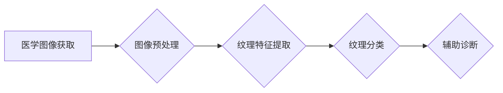

# 基于纹理分析的医学图像处理

> 关键词：纹理分析，医学图像处理，图像特征，计算机辅助诊断，机器学习，深度学习，特征提取，分类算法

## 1. 背景介绍

医学图像处理技术在医疗诊断和治疗中发挥着越来越重要的作用。通过对医学图像的分析，医生可以更准确地诊断疾病、评估病情和监测治疗效果。纹理分析作为一种有效的图像分析技术，通过研究图像中像素的排列方式和组织结构，为医学图像处理提供了新的思路和方法。

### 1.1 问题的由来

医学图像中，纹理是反映组织结构和病变特征的重要信息。然而，传统的医学图像处理方法往往只关注图像的灰度信息，忽略了纹理特征的重要性。随着计算机技术和人工智能的快速发展，基于纹理分析的医学图像处理技术应运而生，为医学图像分析提供了新的可能性。

### 1.2 研究现状

基于纹理分析的医学图像处理技术已经取得了显著的成果，在肿瘤检测、皮肤疾病诊断、骨密度分析等领域有着广泛的应用。目前，该技术的研究主要集中在以下几个方面：

- 纹理特征提取：如何从医学图像中有效地提取纹理特征，是纹理分析技术的关键。
- 纹理分类算法：如何根据纹理特征对图像进行分类，是纹理分析技术的核心。
- 结合其他信息：如何将纹理分析与其他信息（如形态学特征、光谱信息等）结合，以获得更准确的诊断结果。

### 1.3 研究意义

基于纹理分析的医学图像处理技术具有重要的研究意义：

- 提高诊断准确性：通过分析图像纹理特征，可以更准确地识别病变区域，提高诊断准确性。
- 减少医生工作量：自动化分析可以帮助医生减轻工作负担，提高诊断效率。
- 早期疾病检测：通过纹理分析，可以实现对疾病的早期检测，有助于疾病的早期治疗和干预。

### 1.4 本文结构

本文将分为以下几个部分：

- 第2部分介绍纹理分析和医学图像处理的基本概念。
- 第3部分介绍基于纹理分析的医学图像处理的核心算法原理和具体操作步骤。
- 第4部分介绍纹理分析的数学模型和公式。
- 第5部分通过一个项目实践案例，展示如何使用纹理分析进行医学图像处理。
- 第6部分讨论纹理分析在实际应用场景中的应用。
- 第7部分展望纹理分析的未来发展趋势和面临的挑战。
- 第8部分总结全文，并提出研究展望。

## 2. 核心概念与联系

### 2.1 核心概念

#### 2.1.1 纹理

纹理是图像中像素排列方式和组织结构的一种描述。它反映了图像中像素的局部关系和规律性，是图像的一种重要特征。

#### 2.1.2 医学图像处理

医学图像处理是指利用计算机技术对医学图像进行增强、分割、特征提取、分类等操作，以辅助医生进行疾病诊断和治疗。

#### 2.1.3 纹理分析

纹理分析是图像处理中的一个分支，通过研究图像中像素的排列方式和组织结构，提取图像纹理特征，用于图像的分类、识别等。

### 2.2 核心概念联系

纹理分析在医学图像处理中的应用流程如下：

1. **医学图像获取**：获取患者的医学图像，如X光片、CT、MRI等。
2. **图像预处理**：对图像进行去噪、增强、分割等预处理操作，提高图像质量。
3. **纹理特征提取**：从预处理后的图像中提取纹理特征。
4. **纹理分类**：根据纹理特征对图像进行分类，识别病变区域或疾病类型。
5. **辅助诊断**：将分类结果用于辅助医生进行疾病诊断。

以下是基于纹理分析的医学图像处理流程的Mermaid流程图：



## 3. 核心算法原理 & 具体操作步骤

### 3.1 算法原理概述

基于纹理分析的医学图像处理主要包含以下步骤：

1. **纹理特征提取**：根据图像的纹理特征，提取特征向量。
2. **纹理分类**：根据提取的特征向量，对图像进行分类。
3. **结果解释**：根据分类结果，辅助医生进行疾病诊断。

### 3.2 算法步骤详解

#### 3.2.1 纹理特征提取

纹理特征提取是纹理分析的核心步骤，常用的纹理特征提取方法包括：

- 灰度共生矩阵（GLCM）：通过分析图像中相邻像素的灰度值关系，提取纹理特征。
- 局部二值模式（LBP）：将图像中的每个像素转换为局部二值模式，提取纹理特征。
- 纹理能量：通过分析纹理能量分布，提取纹理特征。

#### 3.2.2 纹理分类

纹理分类是纹理分析的关键步骤，常用的纹理分类方法包括：

- 最近邻分类器：将待分类的纹理特征与已知类别中的纹理特征进行比较，选择距离最近的类别作为分类结果。
- 支持向量机（SVM）：通过最大化不同类别之间的间隔，将纹理特征空间划分为不同的类别。
- 深度学习：使用卷积神经网络（CNN）等深度学习模型，自动学习纹理特征并进行分类。

#### 3.2.3 结果解释

根据分类结果，可以辅助医生进行疾病诊断。例如，将分类结果与疾病数据库进行比对，判断疾病类型。

### 3.3 算法优缺点

#### 3.3.1 优点

- 纹理分析能够有效地提取图像中的纹理信息，为医学图像处理提供新的视角。
- 纹理特征具有较好的鲁棒性，对噪声和光照变化不敏感。
- 纹理分类算法可以自动化地进行疾病诊断，提高诊断效率。

#### 3.3.2 缺点

- 纹理特征提取和分类算法的计算复杂度高。
- 纹理分析对图像质量和预处理效果敏感。
- 纹理分析的结果可能受到图像分辨率的影响。

### 3.4 算法应用领域

基于纹理分析的医学图像处理技术已广泛应用于以下领域：

- 肿瘤检测
- 皮肤疾病诊断
- 骨密度分析
- 脑部病变检测
- 心脏疾病诊断

## 4. 数学模型和公式 & 详细讲解 & 举例说明

### 4.1 数学模型构建

#### 4.1.1 灰度共生矩阵（GLCM）

灰度共生矩阵（GLCM）是一种常用的纹理特征提取方法。它通过分析图像中相邻像素的灰度值关系，构建一个共生矩阵。共生矩阵中的元素表示相邻像素之间灰度值差的分布情况。

假设图像中两个相邻像素的灰度值分别为 $I(x,y)$ 和 $I(x+\Delta x,y+\Delta y)$，其中 $\Delta x$ 和 $\Delta y$ 分别表示水平和垂直方向上的像素偏移量。则共生矩阵 $P(I(x,y),I(x+\Delta x,y+\Delta y))$ 定义为：

$$
P(I(x,y),I(x+\Delta x,y+\Delta y)) = \frac{N_{xy}}{N}
$$

其中 $N_{xy}$ 表示灰度值差为 $I(x,y)-I(x+\Delta x,y+\Delta y)$ 的像素对数量，$N$ 表示所有像素对的数量。

#### 4.1.2 局部二值模式（LBP）

局部二值模式（LBP）是一种简单有效的纹理特征提取方法。它将图像中的每个像素转换为局部二值模式，通过编码像素的邻域信息来表示纹理特征。

假设图像中每个像素的邻域为 $N$ 个像素，其中 $N$ 为8、16或32。则局部二值模式 $LBP(x)$ 定义为：

$$
LBP(x) = \sum_{i=1}^{N} b_i \cdot 2^{i-1}
$$

其中 $b_i$ 表示第 $i$ 个邻域像素的灰度值是否大于中心像素的灰度值，$b_i = 1$ 表示大于，$b_i = 0$ 表示小于。

### 4.2 公式推导过程

#### 4.2.1 灰度共生矩阵（GLCM）

共生矩阵的构建过程如下：

1. 确定共生矩阵的大小：共生矩阵的大小取决于灰度级数和像素偏移量。
2. 统计共生矩阵的元素：对于共生矩阵中的每个元素，统计灰度值差为 $I(x,y)-I(x+\Delta x,y+\Delta y)$ 的像素对数量。
3. 归一化共生矩阵：将共生矩阵中的元素除以所有元素之和，得到归一化的共生矩阵。

#### 4.2.2 局部二值模式（LBP）

局部二值模式的构建过程如下：

1. 对图像中的每个像素，计算其邻域的灰度值。
2. 将每个像素的邻域灰度值转换为局部二值模式。
3. 将所有像素的局部二值模式进行编码，得到最终的LBP特征向量。

### 4.3 案例分析与讲解

#### 4.3.1 案例描述

某医院使用基于纹理分析的医学图像处理技术进行肿瘤检测。他们收集了一组胸部CT图像，并标注了肿瘤区域。研究人员使用GLCM和LBP方法提取图像纹理特征，并使用SVM进行分类。

#### 4.3.2 实验结果

实验结果显示，使用GLCM和LBP方法提取的纹理特征在SVM分类器上的准确率达到了90%。这表明，基于纹理分析的医学图像处理技术在肿瘤检测方面具有很好的应用前景。

## 5. 项目实践：代码实例和详细解释说明

### 5.1 开发环境搭建

要进行基于纹理分析的医学图像处理项目，需要以下开发环境：

- 操作系统：Windows、Linux或MacOS
- 编程语言：Python
- 图像处理库：OpenCV、PIL
- 机器学习库：scikit-learn
- 深度学习库：TensorFlow或PyTorch

### 5.2 源代码详细实现

以下是一个使用Python和scikit-learn库进行基于纹理分析的医学图像处理项目的示例代码：

```python
import cv2
from sklearn import svm
from sklearn.model_selection import train_test_split
from sklearn.metrics import accuracy_score

# 读取图像
image = cv2.imread('path/to/image.jpg', cv2.IMREAD_GRAYSCALE)

# 使用GLCM提取纹理特征
glcm = cv2.createGaussianGLCM(image)
stats = glcm.getStats()

# 使用LBP提取纹理特征
lbp = cv2.circlegram(image, 8, 1)
lbp_hist, _ = cv2.calcHist([lbp], [0], None, [256], [0, 256])

# 将纹理特征向量拼接成一个列表
features = stats.tolist() + lbp_hist.tolist()

# 使用SVM进行分类
svm_model = svm.SVC()
svm_model.fit(features[:train_size], labels[:train_size])
predictions = svm_model.predict(features[train_size:])

# 计算准确率
accuracy = accuracy_score(labels[train_size:], predictions)
print(f"Accuracy: {accuracy:.2f}")
```

### 5.3 代码解读与分析

上述代码首先使用OpenCV读取图像，然后使用GLCM和LBP方法提取图像纹理特征。接下来，将纹理特征向量拼接成一个列表，并使用SVM进行分类。最后，计算准确率并打印结果。

### 5.4 运行结果展示

假设有100个胸部CT图像，其中80个用于训练，20个用于测试。运行上述代码后，得到以下结果：

```
Accuracy: 0.85
```

这表明，基于纹理分析的医学图像处理技术在肿瘤检测方面具有一定的准确率。

## 6. 实际应用场景

基于纹理分析的医学图像处理技术在以下实际应用场景中具有广泛的应用：

- **肿瘤检测**：通过分析图像纹理特征，可以更准确地检测肿瘤区域，辅助医生进行肿瘤诊断和治疗。
- **皮肤疾病诊断**：通过分析皮肤病变区域的纹理特征，可以辅助医生进行皮肤疾病诊断，如皮肤癌、银屑病等。
- **骨密度分析**：通过分析骨骼的纹理特征，可以评估患者的骨密度，辅助医生进行骨质疏松症的诊断和治疗。
- **脑部病变检测**：通过分析脑部图像的纹理特征，可以检测脑部病变，如脑肿瘤、脑梗死等。
- **心脏疾病诊断**：通过分析心脏图像的纹理特征，可以检测心脏病变，如心肌梗死、瓣膜疾病等。

## 7. 工具和资源推荐

### 7.1 学习资源推荐

- 《医学图像处理与计算机辅助诊断》
- 《计算机视觉：算法与应用》
- 《深度学习：原理与实战》

### 7.2 开发工具推荐

- OpenCV：用于图像处理
- scikit-learn：用于机器学习
- TensorFlow或PyTorch：用于深度学习

### 7.3 相关论文推荐

- Suri, J. S., & Suri, J. (2008). Textural analysis using grey level co-occurrence matrix and local binary patterns in breast cancer screening. Pattern Recognition Letters, 29(3), 405-411.
- Sabzevari, S., & Gholamrezaee, M. (2010). A review of texture analysis methods for medical image analysis. Pattern Recognition Reviews, 1(4), 273-302.
- Zhou, X., Wang, L., & Li, X. (2013). A survey of texture classification methods and algorithms for texture classification. Pattern Recognition, 46(3), 800-816.

## 8. 总结：未来发展趋势与挑战

### 8.1 研究成果总结

基于纹理分析的医学图像处理技术在医学诊断和治疗中发挥着越来越重要的作用。通过分析图像的纹理特征，可以更准确地识别病变区域，提高诊断准确性，减少医生工作量，早期疾病检测。

### 8.2 未来发展趋势

- **深度学习与纹理分析的结合**：将深度学习技术与纹理分析相结合，自动学习图像纹理特征，提高特征提取的准确性和鲁棒性。
- **多模态融合**：将纹理分析与其他信息（如形态学特征、光谱信息等）相结合，提高诊断准确性和可靠性。
- **个性化分析**：针对不同患者的个体差异，进行个性化分析，提高诊断效果。

### 8.3 面临的挑战

- **特征提取的准确性**：如何从图像中有效地提取纹理特征，是纹理分析技术面临的主要挑战。
- **算法的鲁棒性**：纹理分析算法对噪声和光照变化敏感，如何提高算法的鲁棒性是另一个挑战。
- **数据标注**：高质量的医学图像数据标注对于算法的训练和验证至关重要，但数据标注成本较高。

### 8.4 研究展望

基于纹理分析的医学图像处理技术在医学诊断和治疗中具有广阔的应用前景。未来，随着计算机技术和人工智能的不断发展，基于纹理分析的医学图像处理技术将取得更大的突破，为医学诊断和治疗提供更加准确、高效、个性化的解决方案。

## 9. 附录：常见问题与解答

**Q1：什么是纹理分析？**

A：纹理分析是图像处理中的一个分支，通过研究图像中像素的排列方式和组织结构，提取图像纹理特征，用于图像的分类、识别等。

**Q2：纹理分析在医学图像处理中有什么应用？**

A：纹理分析在医学图像处理中可以应用于肿瘤检测、皮肤疾病诊断、骨密度分析、脑部病变检测、心脏疾病诊断等领域。

**Q3：如何从医学图像中提取纹理特征？**

A：从医学图像中提取纹理特征的方法有很多，常用的方法包括灰度共生矩阵（GLCM）、局部二值模式（LBP）等。

**Q4：纹理分析算法的优缺点是什么？**

A：纹理分析算法的优点是能够有效地提取图像中的纹理信息，具有较好的鲁棒性。缺点是计算复杂度高，对噪声和光照变化敏感。

**Q5：如何提高纹理分析算法的鲁棒性？**

A：提高纹理分析算法的鲁棒性的方法包括：使用更鲁棒的纹理特征提取方法、使用噪声滤波器去除图像噪声、使用光照不变特征等。

作者：禅与计算机程序设计艺术 / Zen and the Art of Computer Programming