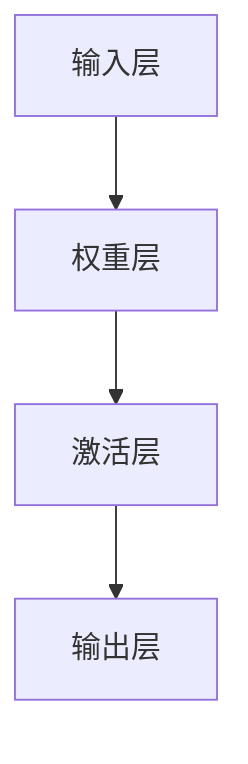
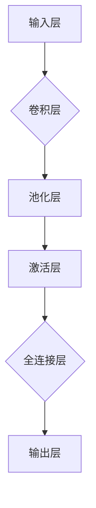
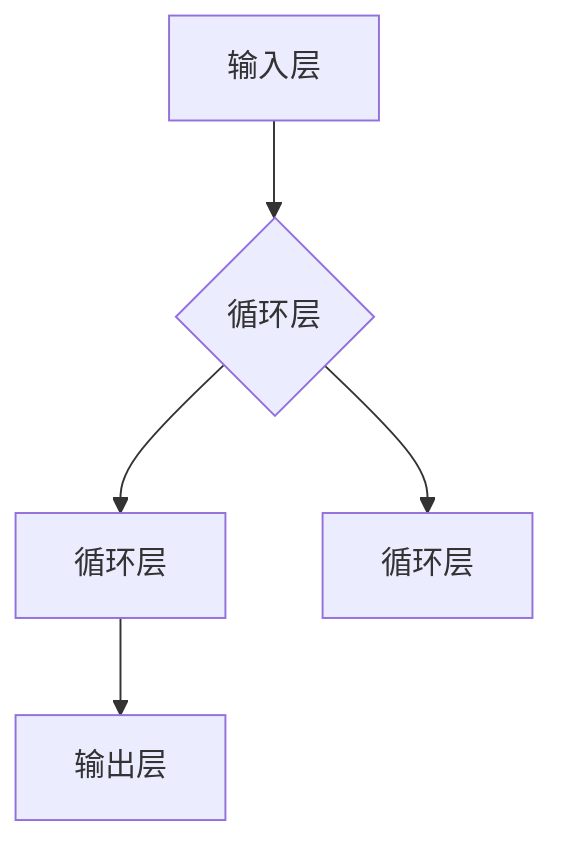

# 基础模型的深度神经网络

> 关键词：深度神经网络，基础模型，感知机，Sigmoid函数，ReLU函数，卷积神经网络，循环神经网络，神经网络架构，前向传播，反向传播，损失函数

## 1. 背景介绍

深度神经网络（Deep Neural Networks，DNN）是人工智能领域的重要突破，它模拟人脑神经元的工作方式，通过多层神经元之间的相互连接和激活函数的处理，实现了对复杂数据的自动学习和特征提取。本文将深入探讨深度神经网络的基础模型，包括感知机、Sigmoid函数、ReLU函数、卷积神经网络（CNN）和循环神经网络（RNN），并分析其原理、操作步骤、优缺点以及应用领域。

## 2. 核心概念与联系

### 2.1 感知机

感知机（Perceptron）是深度神经网络的基本单元，它由输入层、权重层、激活层和输出层组成。感知机通过线性组合输入向量与权重向量，然后应用激活函数得到最终的输出。



### 2.2 Sigmoid函数

Sigmoid函数是一种常用的激活函数，它将输入值映射到(0,1)区间，常用于二分类问题。

$$
\sigma(x) = \frac{1}{1 + e^{-x}}
$$

### 2.3 ReLU函数

ReLU函数（Rectified Linear Unit）是一种非线性激活函数，它将所有负数输入映射为0，正数输入映射为其本身。

$$
\text{ReLU}(x) = \max(0, x)
$$

### 2.4 卷积神经网络（CNN）

卷积神经网络（Convolutional Neural Network，CNN）是一种专门用于处理具有网格结构数据（如图像）的深度神经网络，它通过卷积层提取图像特征。



### 2.5 循环神经网络（RNN）

循环神经网络（Recurrent Neural Network，RNN）是一种处理序列数据的神经网络，它可以记住之前的信息，并利用这些信息进行预测。



## 3. 核心算法原理 & 具体操作步骤

### 3.1 算法原理概述

深度神经网络的核心原理是通过前向传播和反向传播算法，不断调整网络中的权重和偏置，使模型的输出与真实标签之间的差异最小化。

### 3.2 算法步骤详解

1. **前向传播**：将输入数据输入到网络中，逐层计算每个神经元的输出值，直到最后一层输出层得到最终预测结果。

2. **损失计算**：计算预测结果与真实标签之间的损失值，常用的损失函数有均方误差（MSE）和交叉熵（Cross-Entropy）。

3. **反向传播**：根据损失值计算每个权重的梯度，并利用梯度下降算法调整权重和偏置。

4. **迭代优化**：重复前向传播、损失计算和反向传播步骤，直到模型收敛。

### 3.3 算法优缺点

**优点**：

- 能够自动学习数据特征，无需人工设计特征。
- 能够处理复杂数据，如图像、文本和语音。
- 模型性能优异，在许多领域都取得了突破性进展。

**缺点**：

- 计算量大，训练时间长。
- 难以解释模型的决策过程。
- 需要大量的训练数据。

### 3.4 算法应用领域

深度神经网络在以下领域取得了显著的应用成果：

- 图像识别：人脸识别、物体检测、图像分类等。
- 自然语言处理：文本分类、机器翻译、情感分析等。
- 推荐系统：商品推荐、电影推荐、音乐推荐等。
- 语音识别：语音转文字、语音合成等。

## 4. 数学模型和公式 & 详细讲解 & 举例说明

### 4.1 数学模型构建

深度神经网络可以用以下数学模型表示：

$$
y = f(W \cdot x + b)
$$

其中，$y$ 为输出，$x$ 为输入，$W$ 为权重，$b$ 为偏置，$f$ 为激活函数。

### 4.2 公式推导过程

以下以Sigmoid函数为例，推导其公式：

1. **假设**：输入 $z$ 经过线性变换 $W \cdot x + b$ 得到 $z$。
2. **定义**：激活函数 $f(z) = \sigma(z)$，其中 $\sigma(x) = \frac{1}{1 + e^{-x}}$。
3. **代入**：$y = f(W \cdot x + b) = \sigma(W \cdot x + b)$。
4. **得到**：$y = \frac{1}{1 + e^{-(W \cdot x + b)}}$。

### 4.3 案例分析与讲解

以下以一个简单的分类任务为例，说明深度神经网络的训练过程。

1. **数据**：输入数据为 $x_1 = [1, 2]$，真实标签为 $y_1 = 1$。
2. **模型**：假设模型由一个单层神经网络组成，其中权重 $W = [0.5, 0.5]$，偏置 $b = 0$。
3. **训练**：使用交叉熵损失函数计算损失值，并使用梯度下降算法更新权重和偏置。
4. **迭代**：重复步骤3，直到模型收敛。

## 5. 项目实践：代码实例和详细解释说明

### 5.1 开发环境搭建

1. 安装Python和TensorFlow或PyTorch等深度学习框架。
2. 准备训练数据。

### 5.2 源代码详细实现

以下是一个使用TensorFlow实现的简单分类任务代码示例：

```python
import tensorflow as tf

# 定义模型
model = tf.keras.models.Sequential([
    tf.keras.layers.Dense(10, activation='relu', input_shape=[2]),
    tf.keras.layers.Dense(1, activation='sigmoid')
])

# 编译模型
model.compile(optimizer='adam', loss='binary_crossentropy', metrics=['accuracy'])

# 训练模型
model.fit(x_train, y_train, epochs=10)

# 评估模型
model.evaluate(x_test, y_test)
```

### 5.3 代码解读与分析

1. **模型定义**：使用Sequential模型定义一个包含两个全连接层的神经网络，第一个层使用ReLU激活函数，第二个层使用Sigmoid激活函数。
2. **模型编译**：设置优化器、损失函数和评估指标。
3. **模型训练**：使用训练数据对模型进行训练。
4. **模型评估**：使用测试数据评估模型的性能。

### 5.4 运行结果展示

在训练完成后，我们可以看到模型的损失值和准确率逐渐下降和上升，最终达到收敛。

## 6. 实际应用场景

深度神经网络在以下场景中有着广泛的应用：

- **图像识别**：通过卷积神经网络识别图像中的物体。
- **自然语言处理**：通过循环神经网络分析文本数据，进行情感分析、机器翻译等。
- **推荐系统**：通过深度神经网络分析用户行为，进行个性化推荐。
- **语音识别**：通过循环神经网络识别语音数据，将语音转换为文本。

## 7. 工具和资源推荐

### 7.1 学习资源推荐

- TensorFlow官方文档
- PyTorch官方文档
- 《深度学习》
- 《神经网络与深度学习》

### 7.2 开发工具推荐

- Jupyter Notebook
- Google Colab
- Visual Studio Code

### 7.3 相关论文推荐

- "A guide to convolution arithmetic for deep learning"
- "Sequence to sequence learning with neural networks"
- "Deep Learning for Natural Language Processing"

## 8. 总结：未来发展趋势与挑战

### 8.1 研究成果总结

深度神经网络作为一种强大的学习模型，在图像识别、自然语言处理、推荐系统等领域取得了显著的成果。

### 8.2 未来发展趋势

- 模型小型化和高效化
- 可解释性和鲁棒性
- 多模态学习和跨领域迁移

### 8.3 面临的挑战

- 计算资源消耗
- 数据隐私和安全
- 模型可解释性和鲁棒性

### 8.4 研究展望

深度神经网络将在人工智能领域继续发挥重要作用，为人类社会带来更多创新和变革。

## 9. 附录：常见问题与解答

**Q1：什么是深度神经网络？**

A1：深度神经网络是一种由多层神经元组成的神经网络，通过模拟人脑神经元的工作方式，实现复杂数据的自动学习和特征提取。

**Q2：深度神经网络有哪些优点？**

A2：深度神经网络能够自动学习数据特征，处理复杂数据，模型性能优异。

**Q3：深度神经网络有哪些缺点？**

A3：深度神经网络计算量大，训练时间长，难以解释模型的决策过程。

**Q4：深度神经网络在哪些领域有应用？**

A4：深度神经网络在图像识别、自然语言处理、推荐系统等领域有广泛的应用。

**Q5：如何提高深度神经网络的性能？**

A5：可以通过以下方法提高深度神经网络的性能：
- 使用更强大的硬件设备
- 选择合适的网络架构
- 使用更多的训练数据
- 调整超参数

作者：禅与计算机程序设计艺术 / Zen and the Art of Computer Programming