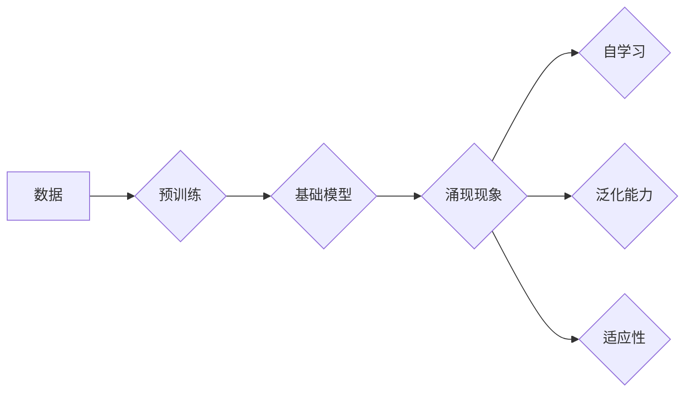

> 关键词：基础模型，规模效应，涌现现象，深度学习，神经网络，算法效率，模型压缩，知识表示

# 基础模型的规模与涌现效果

基础模型是当前人工智能领域的研究热点，其核心在于通过在大规模数据上训练，学习到丰富的知识和表征，从而在各个领域实现优异的性能。本文将探讨基础模型的规模与涌现效果之间的关系，分析其背后的原理，并展望未来发展趋势。

## 1. 背景介绍

随着深度学习技术的不断发展，基础模型在各个领域都取得了显著的成果。从早期的ImageNet竞赛，到现在的NLP任务如BERT、GPT，基础模型在图像识别、自然语言处理等领域都展现出了强大的能力。然而，这些模型的规模也随着时间不断增长，从几十万到几亿个参数不等。那么，大规模的基础模型是否真的带来了更好的效果？其背后的原理是什么？本文将围绕这些问题展开讨论。

## 2. 核心概念与联系

### 2.1 基础模型

基础模型指的是在大规模数据上预训练，具备通用性、泛化性和可扩展性的神经网络模型。它们通常包括卷积神经网络(CNN)、循环神经网络(RNN)、Transformer等结构。

### 2.2 规模效应

规模效应指的是模型规模越大，性能越好的现象。在深度学习中，规模效应主要体现在以下几个方面：

- **参数数量增加**：随着模型参数数量的增加，模型可以学习到更复杂的特征和模式。
- **更丰富的表征**：大规模模型可以学习到更加丰富的表征，从而更好地表示数据中的复杂关系。
- **更好的泛化能力**：大规模模型在未见过的数据上也能取得较好的性能。

### 2.3 涌现现象

涌现现象指的是复杂系统的整体行为无法从单个组件的行为中直接推导出来。在基础模型中，涌现现象主要体现在以下几个方面：

- **自学习能力**：基础模型可以通过预训练自动学习到丰富的知识，无需人工设计特征。
- **泛化能力**：基础模型可以在不同的任务上取得优异的性能，无需针对每个任务进行重新训练。
- **适应性**：基础模型可以根据不同的输入数据和环境变化，调整自己的行为。

### 2.4 Mermaid 流程图



## 3. 核心算法原理 & 具体操作步骤

### 3.1 算法原理概述

基础模型的训练过程主要分为两个阶段：预训练和微调。

- **预训练**：在大量无标注数据上训练，学习到通用的语言和视觉知识。
- **微调**：在特定任务上有标注数据的情况下，对模型进行微调，使其在特定任务上取得更好的性能。

### 3.2 算法步骤详解

1. **数据准备**：收集大量无标注和有标注数据，用于预训练和微调。
2. **模型选择**：选择合适的预训练模型，如BERT、GPT等。
3. **预训练**：使用无标注数据对模型进行预训练，学习通用的语言和视觉知识。
4. **微调**：使用有标注数据对模型进行微调，使其在特定任务上取得更好的性能。
5. **评估**：在测试集上评估模型性能，并进行调优。

### 3.3 算法优缺点

#### 优点：

- **通用性**：基础模型可以用于多个任务，无需针对每个任务重新设计模型。
- **泛化能力**：基础模型在未见过的数据上也能取得较好的性能。
- **效率**：预训练模型可以重复使用，无需为每个任务重新训练。

#### 缺点：

- **计算量**：预训练需要大量计算资源。
- **数据需求**：需要大量无标注和有标注数据。
- **过拟合**：在训练过程中可能出现过拟合现象。

### 3.4 算法应用领域

基础模型在以下领域取得了显著成果：

- **图像识别**：如ImageNet竞赛中的分类任务。
- **自然语言处理**：如BERT、GPT等模型在文本分类、问答、机器翻译等任务上的应用。
- **语音识别**：如WaveNet在语音合成上的应用。

## 4. 数学模型和公式 & 详细讲解 & 举例说明

### 4.1 数学模型构建

基础模型的数学模型通常由以下部分组成：

- **输入层**：接收输入数据。
- **隐藏层**：通过非线性变换学习数据的特征。
- **输出层**：输出模型的预测结果。

### 4.2 公式推导过程

以卷积神经网络(CNN)为例，其数学模型可以表示为：

$$
h^0 = x \\
h^l = \sigma(W^l \cdot h^{l-1} + b^l), \quad l \in [1, L] \\
\hat{y} = W^L \cdot h^L + b^L
$$

其中，$h^l$ 表示第 $l$ 层的激活值，$\sigma$ 表示非线性激活函数，$W^l$ 表示第 $l$ 层的权重矩阵，$b^l$ 表示第 $l$ 层的偏置向量。

### 4.3 案例分析与讲解

以BERT模型为例，其数学模型可以表示为：

- **编码器**：采用Transformer结构，对输入文本进行编码，学习到丰富的语言表征。
- **解码器**：采用Transformer结构，根据编码器的输出生成文本。

## 5. 项目实践：代码实例和详细解释说明

### 5.1 开发环境搭建

1. 安装Python环境。
2. 安装PyTorch等深度学习框架。
3. 下载预训练模型和数据集。

### 5.2 源代码详细实现

以下是一个简单的BERT模型微调的代码实例：

```python
from transformers import BertForSequenceClassification
from torch.utils.data import DataLoader

# 加载预训练模型和数据集
model = BertForSequenceClassification.from_pretrained('bert-base-uncased')
dataloader = DataLoader(dataset, batch_size=32)

# 训练模型
optimizer = AdamW(model.parameters(), lr=2e-5)
for epoch in range(3):
    for batch in dataloader:
        optimizer.zero_grad()
        outputs = model(**batch)
        loss = outputs.loss
        loss.backward()
        optimizer.step()
```

### 5.3 代码解读与分析

以上代码展示了如何使用PyTorch和Transformers库对BERT模型进行微调。

- 首先，加载预训练的BERT模型和数据集。
- 然后，定义优化器。
- 最后，在训练循环中，进行模型的前向传播、反向传播和优化。

### 5.4 运行结果展示

运行上述代码，模型会在测试集上取得一定的性能。性能指标包括准确率、召回率、F1值等。

## 6. 实际应用场景

基础模型在以下场景取得了实际应用：

- **问答系统**：如Duolingo的英语学习平台。
- **机器翻译**：如Google翻译。
- **图像识别**：如Face++的人脸识别技术。

## 7. 工具和资源推荐

### 7.1 学习资源推荐

- 《深度学习》
- 《神经网络与深度学习》
- 《自然语言处理综论》

### 7.2 开发工具推荐

- PyTorch
- TensorFlow
- Hugging Face Transformers

### 7.3 相关论文推荐

- "Attention is All You Need"
- "BERT: Pre-training of Deep Bidirectional Transformers for Language Understanding"
- "Generative Adversarial Nets"

## 8. 总结：未来发展趋势与挑战

### 8.1 研究成果总结

本文探讨了基础模型的规模与涌现效果之间的关系，分析了其背后的原理，并介绍了实际应用场景。研究表明，基础模型的规模与涌现效果之间存在着密切的关系，大规模的基础模型在各个领域都取得了显著的成果。

### 8.2 未来发展趋势

- **模型压缩**：研究更高效的模型压缩技术，降低模型的参数数量和计算量。
- **知识蒸馏**：利用大模型的知识，训练更轻量级的模型。
- **多模态学习**：将文本、图像、视频等多模态信息整合到基础模型中。

### 8.3 面临的挑战

- **计算资源**：大规模基础模型的训练需要大量的计算资源。
- **数据质量**：高质量的数据对于基础模型的训练至关重要。
- **模型可解释性**：提高模型的可解释性，使其更容易被人类理解和信任。

### 8.4 研究展望

基础模型在人工智能领域具有广阔的应用前景，未来将在更多领域发挥重要作用。随着技术的不断发展，基础模型将更加高效、智能，为人类社会带来更多便利。

## 9. 附录：常见问题与解答

**Q1：什么是基础模型？**

A：基础模型是指在大规模数据上预训练，具备通用性、泛化性和可扩展性的神经网络模型。

**Q2：基础模型如何实现涌现效果？**

A：基础模型通过在大规模数据上预训练，学习到丰富的知识和表征，从而在各个领域实现优异的性能，这被称为涌现效果。

**Q3：基础模型的规模与涌现效果之间有什么关系？**

A：基础模型的规模与涌现效果之间存在密切的关系，大规模的基础模型在各个领域都取得了显著的成果。

**Q4：基础模型在哪些领域取得了实际应用？**

A：基础模型在问答系统、机器翻译、图像识别等领域取得了显著的应用。

**Q5：基础模型的未来发展趋势是什么？**

A：基础模型的未来发展趋势包括模型压缩、知识蒸馏、多模态学习等。

作者：禅与计算机程序设计艺术 / Zen and the Art of Computer Programming