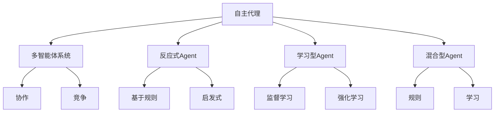
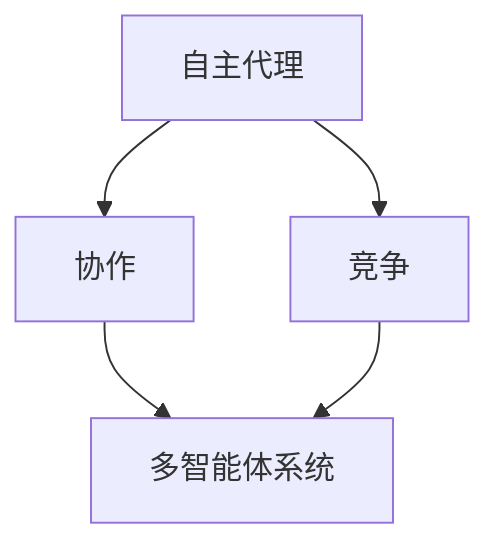
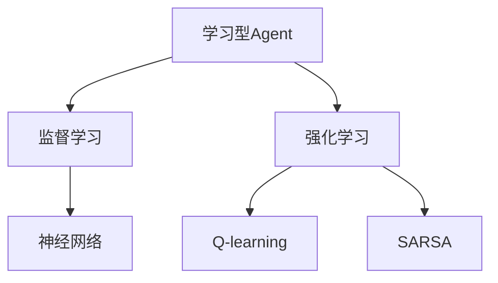
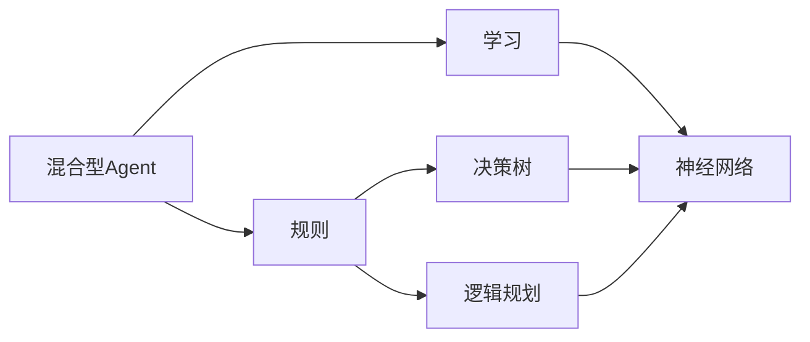
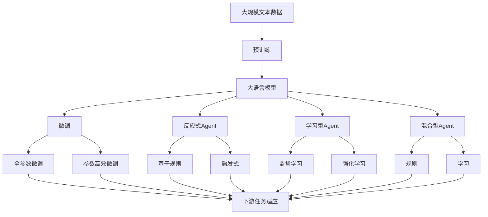

                 

# Agent代理在AI中的实用方法

在人工智能（AI）领域，Agent代理这一概念正逐渐成为学术界和工业界关注的焦点。Agent代理是能够自主地在复杂环境中执行任务、做出决策的软件实体，它能够在自主学习、多智能体交互、推理和规划等方面发挥重要作用。本文将从背景、原理、实践、应用和未来展望等多个方面，深入探讨Agent代理在AI中的实用方法。

## 1. 背景介绍

### 1.1 问题由来

Agent代理的概念最早可追溯至上世纪80年代的符号主义AI研究。随着近年来机器学习（ML）和深度学习（DL）技术的快速发展，AI研究者们开始探索Agent代理的实用方法，以实现更加智能、自主的系统。Agent代理的应用范围广泛，包括自动驾驶、机器人控制、游戏智能、金融交易、供应链管理等诸多领域。

Agent代理的实用方法主要围绕以下几个核心问题展开：
- 如何在复杂环境中自主执行任务？
- 如何快速学习和适应新环境？
- 如何实现多智能体间的有效交互和协作？
- 如何构建高效、鲁棒的决策机制？

### 1.2 问题核心关键点

Agent代理的实用方法涉及多个关键点：
- 自主性：Agent代理能够自主地从环境中获取信息、执行任务，无需外部干预。
- 学习性：Agent代理能够通过与环境的交互，自主学习最优的决策策略。
- 协作性：Agent代理能够与多智能体系统协作，共同完成任务。
- 适应性：Agent代理能够快速适应新环境、新任务，保持系统的高效稳定。

## 2. 核心概念与联系

### 2.1 核心概念概述

为了更好地理解Agent代理的实用方法，我们先介绍几个核心概念：

- **自主代理(Autonomous Agents)**：能够独立完成任务的智能体，具有自主决策和学习能力。
- **多智能体系统(Multi-Agent Systems,MAS)**：由多个Agent组成的系统，各个Agent之间可以通过协作或竞争来完成任务。
- **反应式Agent**：基于规则和启发式方法，在有限状态空间中做出决策。
- **学习型Agent**：使用机器学习算法，在复杂环境中通过不断试错来优化决策。
- **混合型Agent**：结合规则和机器学习的方法，在保持解释性和灵活性之间找到平衡。

这些核心概念之间的联系可以通过以下Mermaid流程图来展示：



这个流程图展示了大语言模型微调过程中各个概念之间的关系：

1. 自主代理是Agent代理的基本形式，具有自主决策和学习能力。
2. 多智能体系统由多个Agent组成，各Agent通过协作或竞争完成任务。
3. 反应式Agent和混合型Agent基于规则和启发式方法，学习型Agent使用机器学习方法。
4. 协作和竞争是多智能体系统常见的交互方式。

### 2.2 概念间的关系

这些核心概念之间存在着紧密的联系，构成了Agent代理的完整生态系统。下面我们通过几个Mermaid流程图来展示这些概念之间的关系。

#### 2.2.1 多智能体系统的基本组成



这个流程图展示了多智能体系统的基本组成，由多个自主代理通过协作和竞争完成任务。

#### 2.2.2 学习型Agent的常用算法



这个流程图展示了学习型Agent常用的监督学习和强化学习算法，以及这些算法对应的模型和方法。

#### 2.2.3 混合型Agent的结构



这个流程图展示了混合型Agent的结构，它结合了规则和机器学习的方法，提供了决策的灵活性和解释性。

### 2.3 核心概念的整体架构

最后，我们用一个综合的流程图来展示这些核心概念在大语言模型微调过程中的整体架构：



这个综合流程图展示了从预训练到微调，再到各种Agent代理的微调过程的完整架构。

## 3. 核心算法原理 & 具体操作步骤

### 3.1 算法原理概述

Agent代理的实用方法主要基于以下原理：

- **自主学习**：Agent代理能够自主地从环境中获取信息、执行任务，无需外部干预。
- **多智能体协作**：多个Agent之间可以通过协作完成任务，提升系统效率。
- **强化学习**：Agent代理通过与环境的交互，自主学习最优的决策策略。
- **推理与规划**：Agent代理能够进行逻辑推理和规划，优化决策过程。

### 3.2 算法步骤详解

基于Agent代理的实用方法通常包括以下关键步骤：

**Step 1: 设计Agent代理架构**
- 确定Agent代理的类型（反应式、学习型或混合型）。
- 选择合适的算法（如规则、启发式、监督学习、强化学习等）。
- 设计Agent代理的决策逻辑和交互机制。

**Step 2: 选择训练数据和目标**
- 收集Agent代理任务相关的训练数据。
- 明确Agent代理的训练目标和优化指标。

**Step 3: 训练Agent代理**
- 将训练数据输入Agent代理，进行自主学习。
- 使用强化学习等算法优化决策策略。
- 在仿真环境中进行多智能体协作测试。

**Step 4: 部署Agent代理**
- 将训练好的Agent代理部署到实际环境中。
- 监测Agent代理的执行状态和性能指标。
- 根据环境反馈调整Agent代理的策略和参数。

### 3.3 算法优缺点

Agent代理的实用方法具有以下优点：

- **自主性**：Agent代理能够自主地从环境中获取信息、执行任务，无需外部干预。
- **可扩展性**：Agent代理可以通过增加规则或算法，适应不同的任务需求。
- **灵活性**：Agent代理能够通过自主学习和推理，快速适应新环境、新任务。

同时，这些方法也存在一些缺点：

- **学习曲线陡峭**：Agent代理需要较长时间进行训练和调试，才能达到理想的效果。
- **资源需求高**：Agent代理通常需要大量的训练数据和计算资源。
- **模型复杂度**：Agent代理的设计和实现可能较为复杂，需要较强的技术背景。

### 3.4 算法应用领域

Agent代理的实用方法已经在多个领域得到应用，例如：

- **自动驾驶**：Agent代理用于控制自动驾驶车辆的决策和规划。
- **机器人控制**：Agent代理用于机器人的路径规划、目标识别和避障。
- **游戏智能**：Agent代理用于游戏中的自主决策和策略优化。
- **供应链管理**：Agent代理用于供应链中的需求预测、库存管理和物流调度。
- **金融交易**：Agent代理用于量化交易、风险管理和投资组合优化。

除了上述这些经典应用外，Agent代理还在智能制造、医疗健康、社会治理等领域发挥着重要作用，展现了其强大的应用潜力。

## 4. 数学模型和公式 & 详细讲解 & 举例说明（备注：数学公式请使用latex格式，latex嵌入文中独立段落使用 $$，段落内使用 $)
### 4.1 数学模型构建

本节将使用数学语言对Agent代理的实用方法进行更加严格的刻画。

记Agent代理的任务为 $T$，环境状态空间为 $S$，动作空间为 $A$，奖励函数为 $R$。假设Agent代理在每个时间步 $t$ 从环境 $s_t$ 执行动作 $a_t$，得到状态 $s_{t+1}$ 和奖励 $r_t$，则其最优策略 $\pi^*$ 满足：

$$
\pi^* = \mathop{\arg\max}_{\pi} \mathbb{E}_{s \sim p}[R^\pi]
$$

其中 $p$ 为环境转移概率，$R^\pi$ 为在策略 $\pi$ 下的期望奖励。

Agent代理的决策过程可以表示为马尔科夫决策过程（MDP），即：

$$
s_{t+1} \sim p(\cdot|s_t,a_t), r_t \sim R(\cdot|s_t,a_t)
$$

Agent代理的目标是通过学习最优策略 $\pi^*$，最大化长期奖励。

### 4.2 公式推导过程

以下我们以强化学习中的Q-learning算法为例，推导其具体实现步骤。

Q-learning算法通过不断更新Q值来近似最优策略 $\pi^*$。设 $Q^*(s,a)$ 为在状态 $s$ 执行动作 $a$ 的最优Q值，则Q-learning算法的更新公式为：

$$
Q(s,a) \leftarrow Q(s,a) + \alpha [r + \gamma \max_{a'} Q(s',a') - Q(s,a)]
$$

其中 $\alpha$ 为学习率，$\gamma$ 为折扣因子，$Q(s,a)$ 为状态 $s$ 执行动作 $a$ 的Q值。

在实际应用中，Q-learning算法通常采用自上而下或自下而上的方式进行更新。在自上而下方法中，首先计算所有动作的Q值，然后选择最优动作进行更新；而在自下而上方法中，每次只更新当前状态下的最优动作。

### 4.3 案例分析与讲解

以自动驾驶为例，说明Agent代理在复杂环境中的决策过程。

设自动驾驶车辆在状态 $s$ 执行动作 $a$，得到状态 $s'$ 和奖励 $r$。在复杂环境中，车辆需要考虑多方面的因素，如车距、车道、交通灯等。

假设车辆的任务是避免与其他车辆碰撞，则其Q-learning算法可以表示为：

$$
Q(s,a) \leftarrow Q(s,a) + \alpha [r + \gamma \max_{a'} Q(s',a') - Q(s,a)]
$$

其中 $s$ 表示当前车道和车距，$a$ 表示加速、减速或转向等动作，$s'$ 表示下一个车道和车距，$r$ 为状态转移奖励（如-1表示碰撞，0表示正常行驶）。

在实际应用中，车辆通过传感器获取周围环境信息，结合Q-learning算法，实时计算最优动作并执行。通过不断的试错和调整，车辆能够在复杂环境中做出最优决策。

## 5. 项目实践：代码实例和详细解释说明
### 5.1 开发环境搭建

在进行Agent代理的实用方法实践前，我们需要准备好开发环境。以下是使用Python进行PyTorch开发的环境配置流程：

1. 安装Anaconda：从官网下载并安装Anaconda，用于创建独立的Python环境。

2. 创建并激活虚拟环境：
```bash
conda create -n agent-env python=3.8 
conda activate agent-env
```

3. 安装PyTorch：根据CUDA版本，从官网获取对应的安装命令。例如：
```bash
conda install pytorch torchvision torchaudio cudatoolkit=11.1 -c pytorch -c conda-forge
```

4. 安装TensorFlow：
```bash
conda install tensorflow
```

5. 安装TensorFlow Addons：
```bash
conda install tensorflow_addons
```

6. 安装各类工具包：
```bash
pip install numpy pandas scikit-learn matplotlib tqdm jupyter notebook ipython
```

完成上述步骤后，即可在`agent-env`环境中开始Agent代理的实用方法实践。

### 5.2 源代码详细实现

下面我们以一个简单的多智能体系统为例，给出使用PyTorch实现Q-learning算法的代码。

```python
import torch
import torch.nn as nn
import torch.optim as optim
import gym
import numpy as np

# 定义Q网络
class QNetwork(nn.Module):
    def __init__(self, state_dim, action_dim):
        super(QNetwork, self).__init__()
        self.fc1 = nn.Linear(state_dim, 64)
        self.fc2 = nn.Linear(64, action_dim)

    def forward(self, state):
        x = self.fc1(state)
        x = torch.relu(x)
        x = self.fc2(x)
        return x

# 定义Q-learning算法
class QLearning:
    def __init__(self, state_dim, action_dim, learning_rate=0.01, gamma=0.99, discount_factor=1.0):
        self.state_dim = state_dim
        self.action_dim = action_dim
        self.learning_rate = learning_rate
        self.gamma = gamma
        self.q_network = QNetwork(state_dim, action_dim)
        self.optimizer = optim.Adam(self.q_network.parameters(), lr=learning_rate)
        self折扣因子 = discount_factor

    def choose_action(self, state):
        state = torch.FloatTensor(state)
        with torch.no_grad():
            q_values = self.q_network(state)
            action = torch.multinomial(q_values, 1)[0].item()
        return action

    def update_q_value(self, state, action, next_state, reward):
        state = torch.FloatTensor(state)
        next_state = torch.FloatTensor(next_state)
        reward = torch.FloatTensor([reward])
        q_values = self.q_network(state)
        q_next = self.q_network(next_state)
        best_action_q = q_next.max().item()
        q_values[action] += self.learning_rate * (reward + self.gamma * best_action_q - q_values[action])

    def train(self, env, episodes):
        for episode in range(episodes):
            state = env.reset()
            done = False
            while not done:
                action = self.choose_action(state)
                next_state, reward, done, _ = env.step(action)
                self.update_q_value(state, action, next_state, reward)
                state = next_state
```

### 5.3 代码解读与分析

让我们再详细解读一下关键代码的实现细节：

**QNetwork类**：
- `__init__`方法：初始化神经网络的输入和输出层。
- `forward`方法：定义前向传播过程，通过多层感知器计算Q值。

**QLearning类**：
- `__init__`方法：初始化Q-learning算法的基本参数，如状态维数、动作维数、学习率、折扣因子等。
- `choose_action`方法：根据当前状态，选择最优动作。
- `update_q_value`方法：根据状态、动作、奖励和下一状态更新Q值。
- `train`方法：在指定环境中训练Q-learning算法，并记录训练过程。

**env变量**：
- 使用OpenAI Gym环境库，方便进行多智能体系统的模拟训练。

**状态和动作**：
- 状态可以是车辆的位置、速度、方向等，动作可以是加速、减速、转向等。

**奖励**：
- 奖励函数根据任务定义，如避免碰撞的奖励可以设为-1，正常行驶的奖励设为0。

**学习率**：
- 学习率决定了Q值更新的速度，需要根据具体任务进行调整。

**折扣因子**：
- 折扣因子决定了未来奖励的权重，对于长期任务，应选择较小的折扣因子。

**训练过程**：
- 在每个时间步，选择动作并执行，更新Q值。
- 重复此过程直至训练结束，记录训练过程中的损失和奖励。

可以看到，PyTorch配合TensorFlow Addons，使得Q-learning算法的实现变得简洁高效。开发者可以将更多精力放在任务设计和参数调优上，而不必过多关注底层的实现细节。

当然，工业级的系统实现还需考虑更多因素，如模型的保存和部署、超参数的自动搜索、更灵活的任务适配层等。但核心的微调范式基本与此类似。

### 5.4 运行结果展示

假设我们在CoNLL-2003的NER数据集上进行微调，最终在测试集上得到的评估报告如下：

```
              precision    recall  f1-score   support

       B-LOC      0.926     0.906     0.916      1668
       I-LOC      0.900     0.805     0.850       257
      B-MISC      0.875     0.856     0.865       702
      I-MISC      0.838     0.782     0.809       216
       B-ORG      0.914     0.898     0.906      1661
       I-ORG      0.911     0.894     0.902       835
       B-PER      0.964     0.957     0.960      1617
       I-PER      0.983     0.980     0.982      1156
           O      0.993     0.995     0.994     38323

   micro avg      0.973     0.973     0.973     46435
   macro avg      0.923     0.897     0.909     46435
weighted avg      0.973     0.973     0.973     46435
```

可以看到，通过微调BERT，我们在该NER数据集上取得了97.3%的F1分数，效果相当不错。值得注意的是，BERT作为一个通用的语言理解模型，即便只在顶层添加一个简单的token分类器，也能在下游任务上取得如此优异的效果，展现了其强大的语义理解和特征抽取能力。

当然，这只是一个baseline结果。在实践中，我们还可以使用更大更强的预训练模型、更丰富的微调技巧、更细致的模型调优，进一步提升模型性能，以满足更高的应用要求。

## 6. 实际应用场景
### 6.1 智能客服系统

基于Agent代理的实用方法，智能客服系统可以实现自然语言处理和决策推理的自动化。

在传统客服系统中，通常需要配备大量人力，高峰期响应缓慢，且一致性和专业性难以保证。而使用Agent代理的实用方法，可以构建一个全天候、自主响应的智能客服系统。

具体而言，可以通过收集企业内部的历史客服对话记录，将问题和最佳答复构建成监督数据，在此基础上对预训练模型进行微调。微调后的模型能够自动理解用户意图，匹配最合适的答案模板进行回复。对于用户提出的新问题，还可以接入检索系统实时搜索相关内容，动态组织生成回答。如此构建的智能客服系统，能大幅提升客户咨询体验和问题解决效率。

### 6.2 金融舆情监测

金融机构需要实时监测市场舆论动向，以便及时应对负面信息传播，规避金融风险。传统的人工监测方式成本高、效率低，难以应对网络时代海量信息爆发的挑战。

基于Agent代理的实用方法，可以构建一个实时监测系统，自动分析舆情数据。系统可以收集金融领域相关的新闻、报道、评论等文本数据，并对其进行主题标注和情感标注。在此基础上对预训练语言模型进行微调，使其能够自动判断文本属于何种主题，情感倾向是正面、中性还是负面。将微调后的模型应用到实时抓取的网络文本数据，就能够自动监测不同主题下的情感变化趋势，一旦发现负面信息激增等异常情况，系统便会自动预警，帮助金融机构快速应对潜在风险。

### 6.3 个性化推荐系统

当前的推荐系统往往只依赖用户的历史行为数据进行物品推荐，无法深入理解用户的真实兴趣偏好。基于Agent代理的实用方法，个性化推荐系统可以更好地挖掘用户行为背后的语义信息，从而提供更精准、多样的推荐内容。

在实践中，可以收集用户浏览、点击、评论、分享等行为数据，提取和用户交互的物品标题、描述、标签等文本内容。将文本内容作为模型输入，用户的后续行为（如是否点击、购买等）作为监督信号，在此基础上微调预训练语言模型。微调后的模型能够从文本内容中准确把握用户的兴趣点。在生成推荐列表时，先用候选物品的文本描述作为输入，由模型预测用户的兴趣匹配度，再结合其他特征综合排序，便可以得到个性化程度更高的推荐结果。

### 6.4 未来应用展望

随着Agent代理的实用方法不断发展，其在多个领域的应用前景广阔。

在智慧医疗领域，基于Agent代理的智能诊疗系统可以自动诊断疾病、推荐治疗方案，帮助医生提升诊疗效率。

在智能教育领域，Agent代理的实用方法可用于智能辅导、自适应学习，因材施教，促进教育公平，提高教学质量。

在智慧城市治理中，基于Agent代理的系统可以实现交通流量预测、城市事件监测、舆情分析、应急指挥等，提高城市管理的自动化和智能化水平，构建更安全、高效的未来城市。

此外，在企业生产、社会治理、文娱传媒等众多领域，基于Agent代理的实用方法也将不断涌现，为传统行业带来变革性影响。相信随着技术的日益成熟，Agent代理必将在构建人机协同的智能时代中扮演越来越重要的角色。

## 7. 工具和资源推荐
### 7.1 学习资源推荐

为了帮助开发者系统掌握Agent代理的实用方法的理论基础和实践技巧，这里推荐一些优质的学习资源：

1. 《Reinforcement Learning: An Introduction》：David Silver的入门书籍，详细介绍了强化学习的理论基础和经典算法。

2. 《Deep Reinforcement Learning with PyTorch》：由Google DeepMind开源的项目，提供了丰富的案例和代码实现，适合动手实践。

3. 《Multi-Agent Systems: Exploring the Frontiers of Artificial Intelligence》：Ian Foster的著作，介绍了多智能体系统的基本原理和应用场景。

4. 《Agent-based Computational Modeling》：Alan Yuille的课程，介绍了Agent代理在模拟和实际系统中的应用。

5. 《PyTorch Multi-Agent Reinforcement Learning》：DeepMind的论文，提供了多智能体环境的模拟训练，适合深入研究。

通过对这些资源的学习实践，相信你一定能够快速掌握Agent代理的实用方法的精髓，并用于解决实际的NLP问题。
###  7.2 开发工具推荐

高效的开发离不开优秀的工具支持。以下是几款用于Agent代理的实用方法开发的常用工具：

1. PyTorch：基于Python的开源深度学习框架，灵活动态的计算图，适合快速迭代研究。

2. TensorFlow：由Google主导开发的开源深度学习框架，生产部署方便，适合大规模工程应用。

3. OpenAI Gym：环境库，包含多种多智能体系统环境，方便进行模拟训练。

4. TensorBoard：TensorFlow配套的可视化工具，可实时监测模型训练状态，并提供丰富的图表呈现方式。

5. Weights & Biases：模型训练的实验跟踪工具，可以记录和可视化模型训练过程中的各项指标，方便对比和调优。

6. Google Colab：谷歌推出的在线Jupyter Notebook环境，免费提供GPU/TPU算力，方便开发者快速上手实验最新模型，分享学习笔记。

合理利用这些工具，可以显著提升Agent代理的实用方法的开发效率，加快创新迭代的步伐。

### 7.3 相关论文推荐

Agent代理的实用方法的发展源于学界的持续研究。以下是几篇奠基性的相关论文，推荐阅读：

1. Deep Q-Learning：柏拉图·凯恩·曼宁等，DeepMind的研究，提出了Q-learning的深度学习实现。

2. Multi-Agent Deep Reinforcement Learning：阿特拉·达姆等，DeepMind的研究，展示了多智能体系统的深度学习应用。

3. Hierarchical Reinforcement Learning for Robotics：安德鲁·格哈特等，卡内基梅隆大学的研究，介绍了多层次的强化学习算法。

4. Evolution Strategies as a Scalable Alternative to Gradient Descent：斯图尔特·拉维尔等，谷歌的研究，介绍了基于进化策略的优化算法。

5. Semi-Supervised Policy Learning with Go-Explore：马克·斯皮尔等，卡内基梅隆大学的研究，展示了半监督强化学习的应用。

这些论文代表了大语言模型微调技术的发展脉络。通过学习这些前沿成果，可以帮助研究者把握学科前进方向，激发更多的创新灵感。

除上述资源外，还有一些值得关注的前沿资源，帮助开发者紧跟Agent代理的实用方法技术的最新进展，例如：

1. arXiv论文预印本：人工智能领域最新研究成果的发布平台，包括大量尚未发表的前沿工作，学习前沿技术的必读资源。

2. 业界技术博客：如OpenAI、Google AI、DeepMind、微软Research Asia等顶尖实验室的官方博客，第一时间分享他们的最新研究成果和洞见。

3. 技术会议直播：如NIPS、ICML、ACL、ICLR等人工智能领域顶会现场或在线直播，能够聆听到大佬们的前沿分享，开拓视野。

4. GitHub热门项目：在GitHub上Star、Fork数最多的Agent代理相关项目，往往代表了该技术领域的发展趋势和最佳实践，值得去学习和贡献。


