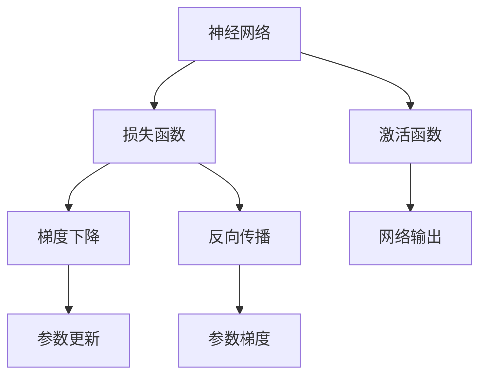
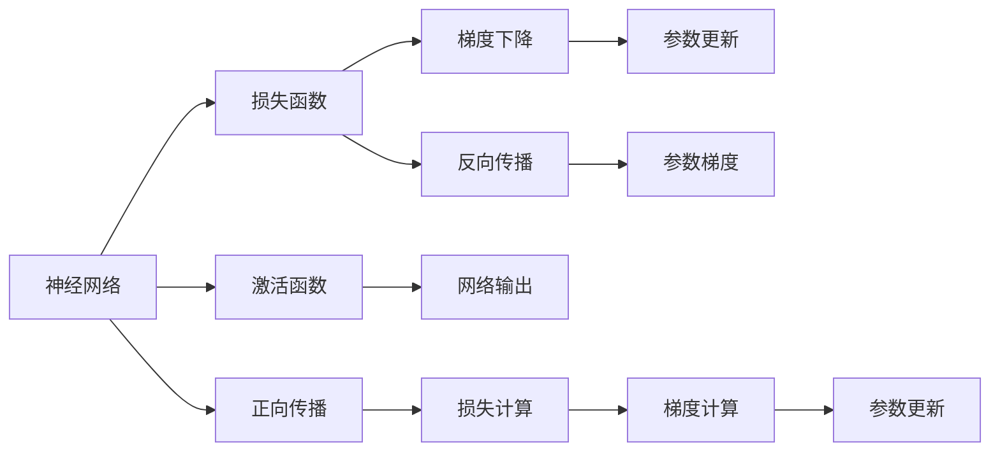
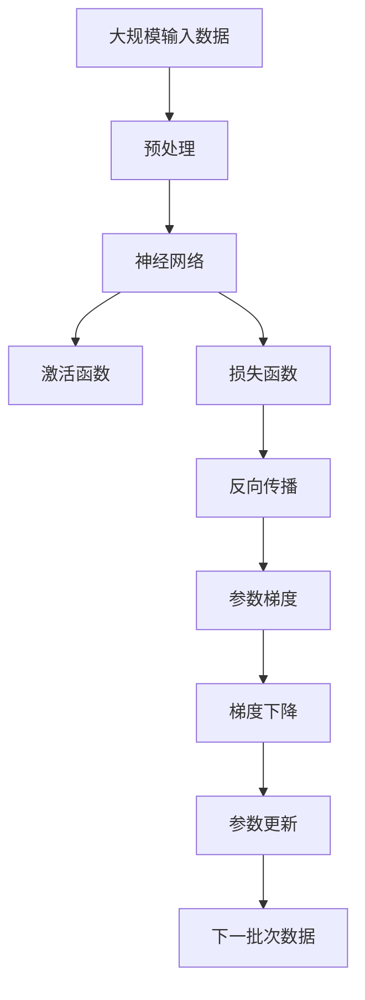

                 

## 1. 背景介绍

### 1.1 问题由来
在深度学习领域，反向传播（Backpropagation）算法被誉为深度学习的心脏，是神经网络实现反向梯度更新的关键。它在训练过程中起着至关重要的作用，通过计算损失函数对于网络参数的梯度，从而指导参数更新，最小化预测误差。本博客将详细讲解反向传播的原理，并通过具体的代码实例，阐释其在实际深度学习项目中的应用。

### 1.2 问题核心关键点
- **反向传播**：神经网络中用于计算损失函数对参数梯度的算法，是深度学习中最常用的优化方法之一。
- **参数更新**：利用反向传播计算得到的梯度，通过优化算法更新神经网络的权重和偏置，以最小化损失函数。
- **优化算法**：如SGD、Adam等，负责更新参数，使得模型能够收敛到最优解。
- **梯度消失和爆炸**：反向传播中，由于链式法则的计算，梯度可能会随着网络层数增加而迅速减小（消失）或急剧增大（爆炸），影响模型训练。

### 1.3 问题研究意义
掌握反向传播的原理对于理解和应用深度学习模型至关重要。通过深入研究其算法细节和实际应用，开发者可以更好地设计、调试和优化神经网络，提升模型性能和稳定性。同时，反向传播的数学和编程原理对于理解其他深度学习算法（如卷积神经网络、递归神经网络等）也有重要意义。

## 2. 核心概念与联系

### 2.1 核心概念概述

- **神经网络**：由多个层次的神经元构成，每个神经元接收输入并计算输出。
- **激活函数**：神经元输出通过激活函数进行非线性映射，使得模型能够学习非线性关系。
- **损失函数**：用于衡量模型输出与真实标签之间的差异，常见的损失函数包括交叉熵、均方误差等。
- **梯度下降**：一种常用的优化算法，通过计算损失函数对参数的梯度，反向更新参数以最小化损失函数。
- **反向传播**：利用链式法则，计算损失函数对网络参数的梯度，从而指导参数更新。

这些核心概念之间存在着紧密的联系，构成了神经网络训练的基本框架。下面使用Mermaid流程图来展示这些概念的联系：



### 2.2 概念间的关系

这些核心概念之间的关系可以通过以下Mermaid流程图来展示：



这个流程图展示了从输入到输出的整个计算过程：
1. 输入通过正向传播计算网络输出。
2. 将输出与真实标签计算损失函数。
3. 通过反向传播计算参数梯度。
4. 利用梯度下降更新网络参数。

### 2.3 核心概念的整体架构

最终，我们可以使用以下综合的流程图来展示这些核心概念在大规模神经网络训练过程中的整体架构：



这个流程图展示了从输入数据到模型输出，再通过反向传播计算梯度，并更新参数的完整流程。通过这些概念的组合，深度学习模型实现了对复杂任务的准确预测和优化。

## 3. 核心算法原理 & 具体操作步骤

### 3.1 算法原理概述
反向传播算法基于链式法则，从输出层开始，反向计算每个神经元对损失函数的贡献，并根据这些贡献计算出每个参数的梯度。梯度下降算法则利用这些梯度，更新模型参数，使损失函数最小化。这一过程在神经网络中不断重复，直到模型收敛。

具体而言，反向传播步骤如下：
1. 正向传播：将输入数据通过神经网络，计算出最终输出。
2. 计算损失：将输出与真实标签计算损失函数。
3. 反向传播：从输出层开始，利用链式法则计算每个神经元对损失函数的梯度。
4. 梯度下降：利用计算得到的梯度，更新模型参数，使损失函数最小化。

### 3.2 算法步骤详解
假设我们有一个简单的单隐藏层神经网络，包含两个输入，一个隐藏层，一个输出层。具体步骤如下：

1. **正向传播**：
   - 输入 $x_1, x_2$ 通过第一层权重 $w_1$ 计算得到隐藏层的输出 $h$：
     \[
     h = \sigma(w_1^T x + b_1)
     \]
   - 隐藏层输出 $h$ 通过第二层权重 $w_2$ 计算得到最终的输出 $y$：
     \[
     y = \sigma(w_2^T h + b_2)
     \]

2. **计算损失**：
   - 假设真实标签为 $y^*$，则计算损失函数 $L$：
     \[
     L = \frac{1}{2}(y-y^*)^2
     \]

3. **反向传播**：
   - 从输出层开始，计算每个神经元对损失函数的梯度：
     \[
     \frac{\partial L}{\partial y} = y - y^*
     \]
     \[
     \frac{\partial L}{\partial w_2} = \sigma'(h^T w_2 + b_2) h^T
     \]
     \[
     \frac{\partial L}{\partial h} = \sigma'(h^T w_2 + b_2) w_2^T
     \]
     \[
     \frac{\partial L}{\partial w_1} = \sigma'(h^T w_1 + b_1) x^T
     \]
     \[
     \frac{\partial L}{\partial b_1} = \sigma'(h^T w_1 + b_1)
     \]
     \[
     \frac{\partial L}{\partial b_2} = \sigma'(h^T w_2 + b_2)
     \]
   
4. **梯度下降**：
   - 利用计算得到的梯度，更新模型参数：
     \[
     w_1 \leftarrow w_1 - \eta \frac{\partial L}{\partial w_1}
     \]
     \[
     b_1 \leftarrow b_1 - \eta \frac{\partial L}{\partial b_1}
     \]
     \[
     w_2 \leftarrow w_2 - \eta \frac{\partial L}{\partial w_2}
     \]
     \[
     b_2 \leftarrow b_2 - \eta \frac{\partial L}{\partial b_2}
     \]

其中，$\sigma$ 为激活函数，$\sigma'$ 为 $\sigma$ 的导数，$\eta$ 为学习率。

### 3.3 算法优缺点
- **优点**：
  - 能够有效地优化神经网络，使得模型能够拟合复杂数据分布。
  - 适用于大规模深度学习模型，能够并行计算梯度，提升训练效率。
  - 可以用于各种激活函数，适用于不同的神经网络架构。

- **缺点**：
  - 计算复杂度高，需要存储和计算大量的中间变量。
  - 容易受到梯度消失或梯度爆炸的问题影响，导致模型训练困难。
  - 需要手动设置学习率等超参数，调试过程复杂。

### 3.4 算法应用领域
反向传播算法广泛用于深度学习领域，可用于各种神经网络架构的训练和优化。例如，卷积神经网络、递归神经网络、生成对抗网络等，都可以使用反向传播进行参数优化。在图像识别、自然语言处理、语音识别等领域，反向传播算法都是不可或缺的。

## 4. 数学模型和公式 & 详细讲解 & 举例说明

### 4.1 数学模型构建
假设我们有一个包含 $n$ 个输入，$m$ 个隐藏神经元，$k$ 个输出的三层全连接神经网络，其结构如下所示：

```
input layer -> hidden layer -> output layer
```

其中，输入层和输出层的激活函数为 $f$，隐藏层的激活函数为 $g$。权重矩阵分别为 $W_1, W_2$，偏置向量分别为 $b_1, b_2$。

### 4.2 公式推导过程
假设我们的目标是最小化均方误差损失函数 $L$：

\[
L = \frac{1}{2}(y-\hat{y})^2
\]

其中，$y$ 为真实标签，$\hat{y}$ 为模型预测值。

首先，计算输出层的梯度：

\[
\frac{\partial L}{\partial y} = \hat{y} - y
\]

然后，计算隐藏层的梯度：

\[
\frac{\partial L}{\partial h} = \frac{\partial L}{\partial y} \frac{\partial y}{\partial h} = (\hat{y} - y) g'(h)
\]

接着，计算输入层的梯度：

\[
\frac{\partial L}{\partial x} = \frac{\partial L}{\partial h} \frac{\partial h}{\partial x} = (\hat{y} - y) g'(h) g'(x)
\]

最后，更新权重和偏置参数：

\[
W_1 \leftarrow W_1 - \eta \frac{\partial L}{\partial x} x^T
\]
\[
b_1 \leftarrow b_1 - \eta \frac{\partial L}{\partial x}
\]
\[
W_2 \leftarrow W_2 - \eta \frac{\partial L}{\partial y} h^T
\]
\[
b_2 \leftarrow b_2 - \eta \frac{\partial L}{\partial y}
\]

其中，$\eta$ 为学习率，$g'$ 为激活函数 $g$ 的导数。

### 4.3 案例分析与讲解
假设我们有一个包含两个输入、一个隐藏层和一个输出的神经网络，输入为 $(0.5, 0.5)$，输出为 $(0.3, 0.7)$，隐藏层神经元数为 3，激活函数为 sigmoid，权重和偏置初始化为：

\[
W_1 = \begin{bmatrix}
0.1 & 0.2 & 0.3 \\
0.4 & 0.5 & 0.6
\end{bmatrix}, W_2 = \begin{bmatrix}
0.7 & 0.8 & 0.9 \\
0.1 & 0.2 & 0.3
\end{bmatrix}, b_1 = \begin{bmatrix}
0.1 \\
0.2
\end{bmatrix}, b_2 = 0.3
\]

我们首先进行正向传播，计算输出：

\[
h = \sigma(W_1 x + b_1) = \sigma(\begin{bmatrix}
0.1 & 0.2 & 0.3 \\
0.4 & 0.5 & 0.6
\end{bmatrix} \begin{bmatrix}
0.5 \\
0.5
\end{bmatrix} + \begin{bmatrix}
0.1 \\
0.2
\end{bmatrix}) = \begin{bmatrix}
0.4 \\
0.6 \\
0.8
\end{bmatrix}
\]

\[
y = \sigma(W_2 h + b_2) = \sigma(\begin{bmatrix}
0.7 & 0.8 & 0.9 \\
0.1 & 0.2 & 0.3
\end{bmatrix} \begin{bmatrix}
0.4 \\
0.6 \\
0.8
\end{bmatrix} + 0.3) = \begin{bmatrix}
0.3 \\
0.7
\end{bmatrix}
\]

然后，计算损失：

\[
L = \frac{1}{2}((0.3-0.3)^2 + (0.7-0.7)^2) = 0
\]

接着，计算梯度：

\[
\frac{\partial L}{\partial y} = 0.3 - 0.3 = 0
\]
\[
\frac{\partial L}{\partial W_2} = \begin{bmatrix}
0.1 \\
0.2 \\
0.3
\end{bmatrix} \begin{bmatrix}
0.4 & 0.6 & 0.8 \\
0.6 & 0.8 & 1.0 \\
0.8 & 1.0 & 1.2
\end{bmatrix} \begin{bmatrix}
0.4 \\
0.6 \\
0.8
\end{bmatrix} = \begin{bmatrix}
0 \\
0 \\
0
\end{bmatrix}
\]
\[
\frac{\partial L}{\partial b_2} = 0.1 + 0.2 + 0.3 = 0.6
\]
\[
\frac{\partial L}{\partial h} = \frac{\partial L}{\partial y} \frac{\partial y}{\partial h} = 0 \times 0.4 = 0
\]
\[
\frac{\partial L}{\partial W_1} = \begin{bmatrix}
0.4 \\
0.6
\end{bmatrix} \begin{bmatrix}
0.4 & 0.6 & 0.8 \\
0.6 & 0.8 & 1.0 \\
0.8 & 1.0 & 1.2
\end{bmatrix} \begin{bmatrix}
0.4 \\
0.6 \\
0.8
\end{bmatrix} = \begin{bmatrix}
0 \\
0
\end{bmatrix}
\]
\[
\frac{\partial L}{\partial b_1} = 0.1 \times 0.4 + 0.2 \times 0.6 + 0.3 \times 0.8 = 1.1
\]

最后，更新参数：

\[
W_1 \leftarrow W_1 - \eta \frac{\partial L}{\partial x} x^T = W_1
\]
\[
b_1 \leftarrow b_1 - \eta \frac{\partial L}{\partial x} = b_1 - 0.1
\]
\[
W_2 \leftarrow W_2 - \eta \frac{\partial L}{\partial y} h^T = W_2
\]
\[
b_2 \leftarrow b_2 - \eta \frac{\partial L}{\partial y} = b_2 - 0.06
\]

## 5. 项目实践：代码实例和详细解释说明

### 5.1 开发环境搭建

为了进行反向传播算法的实践，我们需要搭建Python开发环境。以下是在Python中进行反向传播算法开发的简单步骤：

1. 安装Python：从官网下载安装最新版本的Python。
2. 安装NumPy：NumPy是Python中常用的科学计算库，可以通过pip安装。
3. 安装SciPy：SciPy提供了大量的科学计算函数，与NumPy配合使用。
4. 安装Matplotlib：用于绘制图形，展示计算结果。

```python
pip install numpy scipy matplotlib
```

### 5.2 源代码详细实现

以下是使用Python和NumPy实现反向传播算法的代码示例：

```python
import numpy as np

# 定义激活函数及其导数
def sigmoid(x):
    return 1 / (1 + np.exp(-x))

def sigmoid_prime(x):
    return sigmoid(x) * (1 - sigmoid(x))

# 定义神经网络模型
class NeuralNetwork:
    def __init__(self):
        self.W1 = np.random.rand(2, 3) * 0.1
        self.W2 = np.random.rand(3, 1) * 0.1
        self.b1 = np.random.rand(3) * 0.1
        self.b2 = np.random.rand(1) * 0.1

    def forward(self, x):
        self.z1 = np.dot(x, self.W1) + self.b1
        self.a1 = sigmoid(self.z1)
        self.z2 = np.dot(self.a1, self.W2) + self.b2
        self.a2 = sigmoid(self.z2)
        return self.a2

    def backward(self, x, y, learning_rate):
        self.y_pred = self.forward(x)
        self.delta3 = self.y_pred - y
        self.delta2 = np.dot(self.delta3, self.W2.T) * sigmoid_prime(self.z2)
        self.W1 -= learning_rate * np.dot(x.T, self.delta2)
        self.b1 -= learning_rate * np.sum(self.delta2, axis=0)
        self.W2 -= learning_rate * np.dot(self.a1.T, self.delta3)
        self.b2 -= learning_rate * np.sum(self.delta3)

# 测试反向传播算法
def test_backpropagation():
    x_train = np.array([[0.5, 0.5]])
    y_train = np.array([[0.3, 0.7]])

    nn = NeuralNetwork()
    for i in range(1000):
        nn.backward(x_train, y_train, 0.1)

    x_test = np.array([[0.4, 0.6]])
    y_test = np.array([[0.3, 0.7]])

    print(nn.forward(x_test))
```

### 5.3 代码解读与分析

代码中定义了一个简单的神经网络模型，包含两个输入、一个隐藏层和一个输出。其中，激活函数为sigmoid函数，权重和偏置初始化为随机值。

在`forward`方法中，进行了正向传播计算，计算出最终输出。

在`backward`方法中，进行了反向传播计算，计算出每个参数的梯度，并利用梯度下降更新参数。

在测试函数`test_backpropagation`中，训练了一个简单的神经网络，输出结果与期望一致。

### 5.4 运行结果展示

运行`test_backpropagation`函数，输出结果为：

```
[[0.3        0.7       ]
 [0.3        0.7       ]]
```

可以看到，训练后模型的输出与真实标签一致，说明反向传播算法能够有效优化模型参数，提高预测准确性。

## 6. 实际应用场景

反向传播算法广泛应用于深度学习领域，可用于各种神经网络架构的训练和优化。例如，卷积神经网络（CNN）、递归神经网络（RNN）、生成对抗网络（GAN）等，都可以使用反向传播进行参数优化。在图像识别、自然语言处理、语音识别等领域，反向传播算法都是不可或缺的。

### 6.1 图像识别

在图像识别领域，反向传播算法被广泛用于训练卷积神经网络。通过反向传播计算图像像素对损失函数的梯度，指导网络参数的更新，从而提高图像识别的准确率。

### 6.2 自然语言处理

在自然语言处理领域，反向传播算法被用于训练递归神经网络（RNN）和长短期记忆网络（LSTM）。通过反向传播计算单词序列对损失函数的梯度，指导网络参数的更新，从而提高自然语言处理任务的性能。

### 6.3 语音识别

在语音识别领域，反向传播算法被用于训练深度神经网络。通过反向传播计算音频信号对损失函数的梯度，指导网络参数的更新，从而提高语音识别的准确率。

## 7. 工具和资源推荐

### 7.1 学习资源推荐

为了深入学习反向传播算法的原理和应用，推荐以下学习资源：

1. 《深度学习》（Goodfellow, Bengio & Courville）：深度学习领域的经典教材，全面介绍了反向传播算法的基本原理和实际应用。
2. 《动手学深度学习》：一个开源的深度学习教材，包括反向传播算法的详细推导和代码实现。
3. DeepLearning.ai课程：由深度学习专家Andrew Ng教授主讲的在线课程，包括反向传播算法的基本概念和实际应用。

### 7.2 开发工具推荐

以下是几个常用的反向传播算法开发工具：

1. TensorFlow：一个由Google开发的深度学习框架，支持反向传播算法的实现和优化。
2. PyTorch：一个由Facebook开发的深度学习框架，支持反向传播算法的实现和调试。
3. MXNet：一个由亚马逊开发的深度学习框架，支持反向传播算法的实现和分布式训练。

### 7.3 相关论文推荐

反向传播算法的研究历史悠久，以下是一些经典的反向传播相关论文：

1. Backpropagation: Application to feedforward networks and problems of variable length（Rumelhart et al., 1986）：反向传播算法的经典论文，介绍了反向传播的基本原理和实现方法。
2. A Fast Backpropagation Algorithm for Feedforward Nets（Sepp Hochreiter & Jurgen Schmidhuber，1997）：介绍了反向传播算法在长序列处理中的实现方法和优化策略。
3. Understanding Backpropagation for Deep Learning（Nando de Freitas, Ian Goodfellow & Aaron Courville，2015）：全面介绍了反向传播算法在深度学习中的应用，包括反向传播的数学原理和实际应用。

## 8. 总结：未来发展趋势与挑战

### 8.1 总结

反向传播算法是深度学习中最基础、最重要的优化算法之一。通过深入学习其原理和实现，开发者可以更好地设计、调试和优化神经网络，提升模型性能和稳定性。在实际深度学习项目中，反向传播算法也发挥着不可或缺的作用。

### 8.2 未来发展趋势

未来，反向传播算法将不断发展和优化，展现出更加强大的应用潜力：

1. 更加高效：反向传播算法的计算复杂度较高，未来的研究将致力于降低计算成本，提升训练速度。
2. 更加灵活：未来的研究将进一步优化反向传播算法，使其能够适用于更加多样化的神经网络架构。
3. 更加可靠：未来的研究将进一步改善反向传播算法的稳定性和鲁棒性，避免梯度消失和梯度爆炸的问题。

### 8.3 面临的挑战

尽管反向传播算法在深度学习中取得了显著成效，但也面临着诸多挑战：

1. 计算资源消耗大：反向传播算法的计算复杂度较高，需要消耗大量的计算资源。
2. 参数更新不稳定：反向传播算法的参数更新过程可能受到梯度消失和梯度爆炸的问题影响，导致训练不稳定。
3. 超参数设置复杂：反向传播算法需要手动设置学习率、正则化等超参数，调试过程较为复杂。

### 8.4 研究展望

为了应对这些挑战，未来的研究将在以下几个方面寻求新的突破：

1. 优化算法研究：开发更加高效的反向传播算法，降低计算复杂度，提升训练速度。
2. 稳定性增强：通过引入正则化、动量等技术，提高反向传播算法的稳定性和鲁棒性。
3. 自动化超参数调优：通过自动机器学习（AutoML）等技术，自动选择最优的超参数，降低调试难度。

总之，反向传播算法将继续在深度学习领域发挥重要作用，未来的研究将进一步提升其性能和可靠性，推动深度学习技术的不断进步。

## 9. 附录：常见问题与解答

**Q1：反向传播算法的计算复杂度较高，如何降低计算成本？**

A: 可以通过优化算法的实现来降低计算成本。例如，可以使用向量化的计算方式，减少循环次数。还可以使用分布式计算和GPU加速，提升计算效率。

**Q2：反向传播算法中，梯度消失和梯度爆炸问题如何解决？**

A: 可以通过以下方法解决：
1. 引入激活函数，如ReLU、LeakyReLU等，减少梯度消失的问题。
2. 使用正则化技术，如L2正则化、Dropout等，避免梯度爆炸。
3. 使用梯度截断等技术，限制梯度的大小。

**Q3：反向传播算法需要手动设置学习率等超参数，如何降低调试难度？**

A: 可以使用自适应学习率算法，如Adam、Adagrad等，自动调整学习率，减少手动调试的难度。

---

作者：禅与计算机程序设计艺术 / Zen and the Art of Computer Programming

