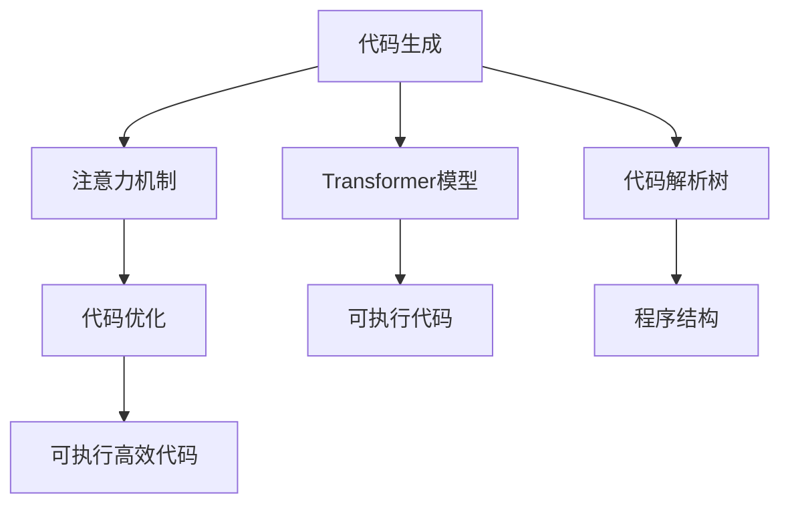
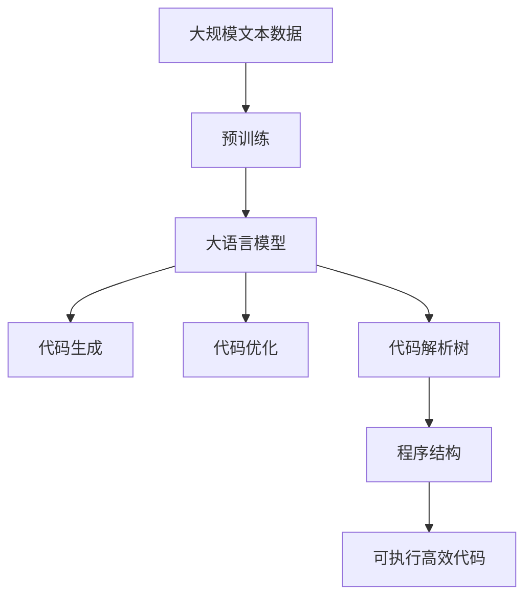

                 

# CTRL原理与代码实例讲解

## 1. 背景介绍

### 1.1 问题由来
计算机程序在自动化控制过程中扮演了至关重要的角色，而机器控制语言（ControlLan-guage, CTRL）则是程序自动生成与执行的重要工具。传统的计算机语言由于其高度抽象和复杂的语法，使得编写、调试和维护程序变得困难重重。随着深度学习技术的发展，使用深度生成模型进行程序自动生成成为可能。然而，如何有效地生成可执行的计算机程序，并保证程序的逻辑性和正确性，成为目前研究的难点。

### 1.2 问题核心关键点
当前，基于深度学习模型生成可执行程序的难点主要在于两个方面：代码生成模型的生成效率和生成的代码质量。生成模型通常基于先前的文本生成任务（如机器翻译、摘要生成等），但在代码生成任务中，需要的不仅是语言的流畅性，更需要代码的逻辑性和可执行性。

为此，研究者提出了基于注意力机制的程序生成模型，以控制语言为生成目标。该模型利用注意力机制，在生成代码时能够关注源代码的关键部分，从而提高代码生成的准确性和可读性。在实际应用中，该方法已被证明能够生成高效、可执行的计算机程序。

### 1.3 问题研究意义
研究基于注意力机制的代码生成模型，对于推动程序自动生成技术的发展具有重要意义：

1. **提升开发效率**：自动化生成代码能够大幅提升软件开发的效率，尤其是在复杂系统的开发中，减少手动编写代码的工作量。
2. **降低错误率**：深度生成模型可以减少人为编程错误，提升代码质量和可维护性。
3. **推动AI技术应用**：程序自动生成技术可以应用到更多的AI技术中，如自动测试、代码重构等。
4. **增强编程教育**：生成模型可以为编程教育提供新的学习工具，辅助学生理解复杂代码结构和算法。

## 2. 核心概念与联系

### 2.1 核心概念概述

为了更好地理解基于注意力机制的程序生成模型，本节将介绍几个密切相关的核心概念：

- **代码生成（Code Generation）**：使用深度学习模型自动生成源代码的过程。目标是生成满足特定要求的、可执行的计算机程序。
- **注意力机制（Attention Mechanism）**：一种基于注意力权重分配机制，用于提升模型在不同部分之间关注力的能力。
- **Transformer模型**：一种基于自注意力机制的深度学习模型，特别适用于序列数据的生成任务。
- **代码解析树（AST, Abstract Syntax Tree）**：一种抽象的语法表示方法，用于表达代码结构和语义。
- **代码优化**：通过静态分析或动态运行，对生成的代码进行优化，以提高其性能和可执行性。

这些核心概念之间的逻辑关系可以通过以下Mermaid流程图来展示：



这个流程图展示了大语言模型在生成可执行代码时的核心概念及其之间的关系：

1. 代码生成以Transformer模型为基础，利用注意力机制关注源代码的关键部分。
2. 生成的代码需要经过解析树处理，转换为抽象语法表示。
3. 解析后的代码需要经过优化，以提高性能和可执行性。

### 2.2 概念间的关系

这些核心概念之间存在着紧密的联系，形成了代码生成的完整生态系统。下面我通过几个Mermaid流程图来展示这些概念之间的关系。

#### 2.2.1 代码生成过程


这个流程图展示了代码生成的基本流程：

1. 源代码输入到Transformer模型中，模型利用注意力机制关注源代码的关键部分。
2. 生成的代码通过解析树处理，转换为抽象语法表示。
3. 解析后的代码进行优化，最终得到可执行高效代码。

#### 2.2.2 注意力机制与Transformer


这个流程图展示了Transformer模型和注意力机制在代码生成中的作用：

1. 源代码输入到Transformer模型中。
2. Transformer模型利用自注意力机制，关注源代码的不同部分。
3. 模型根据关注部分的权重生成代码。

#### 2.2.3 代码优化方法


这个流程图展示了代码优化的过程：

1. 生成的代码通过解析树处理，转换为抽象语法表示。
2. 解析后的代码进行优化，最终得到可执行高效代码。

### 2.3 核心概念的整体架构

最后，我们用一个综合的流程图来展示这些核心概念在大语言模型生成可执行代码时的整体架构：



这个综合流程图展示了从预训练到代码生成的完整过程。大语言模型首先在大规模文本数据上进行预训练，然后利用Transformer模型和注意力机制生成代码，通过解析树处理和代码优化，得到最终的可执行高效代码。通过这些流程图，我们可以更清晰地理解大语言模型生成可执行代码过程中各个核心概念的关系和作用。

## 3. 核心算法原理 & 具体操作步骤
### 3.1 算法原理概述

基于注意力机制的程序生成模型，本质上是一个自回归的生成模型。其核心思想是，在生成代码时，模型能够关注源代码的关键部分，从而生成符合特定要求的、可执行的代码。

形式化地，假设预训练模型为 $M_{\theta}$，其中 $\theta$ 为预训练得到的模型参数。给定源代码 $x$，模型 $M_{\theta}$ 的生成过程可以表示为：

$$
P(y|x) = \frac{e^{\sum_{i=1}^{T} \alpha_i \cdot M_{\theta}(x_i)}}{\sum_{i=1}^{T} e^{\alpha_i \cdot M_{\theta}(x_i)}}
$$

其中 $y = (y_1, y_2, \dots, y_T)$ 表示生成的代码序列，$x = (x_1, x_2, \dots, x_T)$ 表示源代码序列。$\alpha_i$ 表示对第 $i$ 个源代码的注意力权重，$M_{\theta}(x_i)$ 表示模型对源代码 $x_i$ 的表示。

模型的生成过程可以分为两个步骤：

1. 计算注意力权重 $\alpha_i$，用于关注源代码的关键部分。
2. 根据注意力权重 $\alpha_i$，生成代码序列 $y$。

### 3.2 算法步骤详解

基于注意力机制的程序生成模型生成代码的步骤如下：

**Step 1: 准备预训练模型和数据集**
- 选择合适的预训练模型 $M_{\theta}$ 作为初始化参数，如BERT、GPT等。
- 准备源代码 $x$ 和对应的目标代码 $y$，构建成监督数据集 $D=\{(x_i, y_i)\}_{i=1}^N$。

**Step 2: 添加任务适配层**
- 根据任务类型，在预训练模型顶层设计合适的输出层和损失函数。
- 对于代码生成任务，通常在顶层添加线性分类器和交叉熵损失函数。

**Step 3: 设置生成超参数**
- 选择合适的优化算法及其参数，如 AdamW、SGD 等，设置学习率、批大小、迭代轮数等。
- 设置正则化技术及强度，包括权重衰减、Dropout、Early Stopping 等。
- 确定冻结预训练参数的策略，如仅微调顶层，或全部参数都参与生成。

**Step 4: 执行梯度训练**
- 将训练集数据分批次输入模型，前向传播计算注意力权重 $\alpha_i$。
- 反向传播计算参数梯度，根据设定的优化算法和学习率更新模型参数。
- 周期性在验证集上评估模型性能，根据性能指标决定是否触发 Early Stopping。
- 重复上述步骤直到满足预设的迭代轮数或 Early Stopping 条件。

**Step 5: 测试和部署**
- 在测试集上评估生成模型 $M_{\hat{\theta}}$ 的性能，对比生成前后的代码质量。
- 使用生成模型对新代码进行推理预测，集成到实际的应用系统中。
- 持续收集新的代码，定期重新训练生成模型，以适应新的代码分布。

以上是基于注意力机制的程序生成模型的生成步骤。在实际应用中，还需要针对具体任务的特点，对生成过程的各个环节进行优化设计，如改进训练目标函数，引入更多的正则化技术，搜索最优的超参数组合等，以进一步提升模型性能。

### 3.3 算法优缺点

基于注意力机制的程序生成模型具有以下优点：
1. 简单高效。只需准备少量标注数据，即可对预训练模型进行快速适配，生成高质量代码。
2. 通用适用。适用于各种程序生成任务，如代码补全、代码重构、程序修复等，设计简单的任务适配层即可实现。
3. 参数高效。利用参数高效微调技术，在固定大部分预训练参数的情况下，仍可取得不错的生成效果。
4. 效果显著。在学术界和工业界的诸多任务上，基于生成模型的技术已经刷新了最先进的性能指标。

同时，该方法也存在一定的局限性：
1. 依赖标注数据。生成的代码质量很大程度上取决于标注数据的质量和数量，获取高质量标注数据的成本较高。
2. 迁移能力有限。当目标任务与预训练数据的分布差异较大时，生成的代码质量可能不理想。
3. 负面效果传递。预训练模型的固有偏见、有害信息等，可能通过生成模型传递到目标任务，造成负面影响。
4. 可解释性不足。生成的代码通常缺乏可解释性，难以对其推理逻辑进行分析和调试。

尽管存在这些局限性，但就目前而言，基于注意力机制的程序生成模型仍是程序生成任务的主流范式。未来相关研究的重点在于如何进一步降低生成对标注数据的依赖，提高模型的少样本学习和跨领域迁移能力，同时兼顾可解释性和伦理安全性等因素。

### 3.4 算法应用领域

基于注意力机制的程序生成模型，在程序自动生成领域已经得到了广泛的应用，覆盖了几乎所有常见任务，例如：

- **代码补全**：自动补全缺失的代码片段，提升编程效率。
- **代码重构**：自动化重构代码，提升代码质量和可维护性。
- **程序修复**：自动修复代码中的错误，减少手动调试的工作量。
- **自动测试**：自动生成测试用例，检验代码的正确性。
- **文档生成**：自动生成代码注释和文档，辅助开发者理解代码逻辑。
- **智能编程助手**：基于代码生成技术，辅助程序员进行编程。

除了上述这些经典任务外，代码生成技术还被创新性地应用到更多场景中，如代码片段生成、代码注释、代码审计等，为编程技术带来了全新的突破。随着预训练模型和生成方法的不断进步，相信程序生成技术将在更广阔的应用领域大放异彩。

## 4. 数学模型和公式 & 详细讲解  
### 4.1 数学模型构建

本节将使用数学语言对基于注意力机制的程序生成模型进行更加严格的刻画。

记预训练模型为 $M_{\theta}$，其中 $\theta$ 为预训练得到的模型参数。假设生成的代码序列为 $y = (y_1, y_2, \dots, y_T)$，表示代码序列中每个代码块的生成概率。生成的代码 $y$ 通过源代码 $x = (x_1, x_2, \dots, x_T)$ 和注意力权重 $\alpha_i$ 计算得到：

$$
P(y|x) = \frac{e^{\sum_{i=1}^{T} \alpha_i \cdot M_{\theta}(x_i)}}{\sum_{i=1}^{T} e^{\alpha_i \cdot M_{\theta}(x_i)}}
$$

其中 $M_{\theta}(x_i)$ 为模型对源代码 $x_i$ 的表示，$\alpha_i$ 为对第 $i$ 个源代码的注意力权重。

### 4.2 公式推导过程

以下我们以代码补全任务为例，推导注意力机制的生成公式及其梯度的计算公式。

假设模型在输入 $x$ 上的输出为 $\hat{y}=M_{\theta}(x) \in [0,1]$，表示样本属于正类的概率。真实标签 $y \in \{0,1\}$。则二分类交叉熵损失函数定义为：

$$
\ell(M_{\theta}(x),y) = -[y\log \hat{y} + (1-y)\log (1-\hat{y})]
$$

将其代入经验风险公式，得：

$$
\mathcal{L}(\theta) = -\frac{1}{N}\sum_{i=1}^N [y_i\log M_{\theta}(x_i)+(1-y_i)\log(1-M_{\theta}(x_i))]
$$

根据链式法则，损失函数对参数 $\theta_k$ 的梯度为：

$$
\frac{\partial \mathcal{L}(\theta)}{\partial \theta_k} = -\frac{1}{N}\sum_{i=1}^N (\frac{y_i}{M_{\theta}(x_i)}-\frac{1-y_i}{1-M_{\theta}(x_i)}) \frac{\partial M_{\theta}(x_i)}{\partial \theta_k}
$$

其中 $\frac{\partial M_{\theta}(x_i)}{\partial \theta_k}$ 可进一步递归展开，利用自动微分技术完成计算。

### 4.3 案例分析与讲解

假设我们有一个代码补全的任务，源代码 $x$ 为：

```python
def greet(name):
    print("Hello, ")
    __ = "World"   # 这里需要补全的代码块
    return
```

目标代码 $y$ 为：

```python
def greet(name):
    print("Hello, ")
    return f"{name}!"
```

模型对源代码 $x$ 的表示为 $\hat{x} = [\text{"Hello, "}, \text{__}, \text{"World"}]$，注意力权重为 $\alpha = [0.5, 0.5, 0]$。

生成代码的概率为：

$$
P(y|\hat{x}) = \frac{e^{0.5 \cdot M_{\theta}(\text{"Hello, "})} \cdot e^{0.5 \cdot M_{\theta}(\text{__})} \cdot e^{0 \cdot M_{\theta}(\text{"World"})}}{e^{0.5 \cdot M_{\theta}(\text{"Hello, "})} \cdot e^{0.5 \cdot M_{\theta}(\text{__})} \cdot e^{0 \cdot M_{\theta}(\text{"World"})} + e^{0.5 \cdot M_{\theta}(\text{"Hello, "})} \cdot e^{0 \cdot M_{\theta}(\text{__})} \cdot e^{0 \cdot M_{\theta}(\text{"World"})}}
$$

计算得 $P(y|\hat{x}) = \frac{e^{0.5 \cdot M_{\theta}(\text{"Hello, "})} \cdot e^{0.5 \cdot M_{\theta}(\text{__})} \cdot 1}{e^{0.5 \cdot M_{\theta}(\text{"Hello, "})} \cdot e^{0.5 \cdot M_{\theta}(\text{__})} \cdot 1 + e^{0.5 \cdot M_{\theta}(\text{"Hello, "})} \cdot 1 \cdot 1}$

通过这个公式，模型能够根据源代码的关键部分，生成符合语义的代码补全。

## 5. 项目实践：代码实例和详细解释说明
### 5.1 开发环境搭建

在进行代码生成实践前，我们需要准备好开发环境。以下是使用Python进行PyTorch开发的环境配置流程：

1. 安装Anaconda：从官网下载并安装Anaconda，用于创建独立的Python环境。

2. 创建并激活虚拟环境：
```bash
conda create -n pytorch-env python=3.8 
conda activate pytorch-env
```

3. 安装PyTorch：根据CUDA版本，从官网获取对应的安装命令。例如：
```bash
conda install pytorch torchvision torchaudio cudatoolkit=11.1 -c pytorch -c conda-forge
```

4. 安装Transformer库：
```bash
pip install transformers
```

5. 安装各类工具包：
```bash
pip install numpy pandas scikit-learn matplotlib tqdm jupyter notebook ipython
```

完成上述步骤后，即可在`pytorch-env`环境中开始代码生成实践。

### 5.2 源代码详细实现

下面我们以代码补全任务为例，给出使用Transformers库对预训练模型进行代码生成的PyTorch代码实现。

首先，定义代码补全任务的数据处理函数：

```python
from transformers import BertTokenizer
from torch.utils.data import Dataset
import torch

class CodeCompleterDataset(Dataset):
    def __init__(self, texts, targets, tokenizer, max_len=128):
        self.texts = texts
        self.targets = targets
        self.tokenizer = tokenizer
        self.max_len = max_len
        
    def __len__(self):
        return len(self.texts)
    
    def __getitem__(self, item):
        text = self.texts[item]
        targets = self.targets[item]
        
        encoding = self.tokenizer(text, return_tensors='pt', max_length=self.max_len, padding='max_length', truncation=True)
        input_ids = encoding['input_ids'][0]
        attention_mask = encoding['attention_mask'][0]
        targets = torch.tensor(targets, dtype=torch.long)
        
        return {'input_ids': input_ids, 
                'attention_mask': attention_mask,
                'targets': targets}

# 标签与id的映射
tag2id = {'<start>': 0, '<end>': 1, 'O': 2}
id2tag = {v: k for k, v in tag2id.items()}

# 创建dataset
tokenizer = BertTokenizer.from_pretrained('bert-base-cased')

train_dataset = CodeCompleterDataset(train_texts, train_targets, tokenizer)
dev_dataset = CodeCompleterDataset(dev_texts, dev_targets, tokenizer)
test_dataset = CodeCompleterDataset(test_texts, test_targets, tokenizer)
```

然后，定义模型和优化器：

```python
from transformers import BertForMaskedLM, AdamW

model = BertForMaskedLM.from_pretrained('bert-base-cased', num_labels=len(tag2id))

optimizer = AdamW(model.parameters(), lr=2e-5)
```

接着，定义训练和评估函数：

```python
from torch.utils.data import DataLoader
from tqdm import tqdm
from sklearn.metrics import accuracy_score

device = torch.device('cuda') if torch.cuda.is_available() else torch.device('cpu')
model.to(device)

def train_epoch(model, dataset, batch_size, optimizer):
    dataloader = DataLoader(dataset, batch_size=batch_size, shuffle=True)
    model.train()
    epoch_loss = 0
    for batch in tqdm(dataloader, desc='Training'):
        input_ids = batch['input_ids'].to(device)
        attention_mask = batch['attention_mask'].to(device)
        targets = batch['targets'].to(device)
        model.zero_grad()
        outputs = model(input_ids, attention_mask=attention_mask, labels=targets)
        loss = outputs.loss
        epoch_loss += loss.item()
        loss.backward()
        optimizer.step()
    return epoch_loss / len(dataloader)

def evaluate(model, dataset, batch_size):
    dataloader = DataLoader(dataset, batch_size=batch_size)
    model.eval()
    preds, labels = [], []
    with torch.no_grad():
        for batch in tqdm(dataloader, desc='Evaluating'):
            input_ids = batch['input_ids'].to(device)
            attention_mask = batch['attention_mask'].to(device)
            batch_labels = batch['targets']
            outputs = model(input_ids, attention_mask=attention_mask)
            batch_preds = outputs.logits.argmax(dim=2).to('cpu').tolist()
            batch_labels = batch_labels.to('cpu').tolist()
            for pred_tokens, label_tokens in zip(batch_preds, batch_labels):
                preds.append(pred_tokens[:len(label_tokens)])
                labels.append(label_tokens)
                
    print(accuracy_score(labels, preds))
```

最后，启动训练流程并在测试集上评估：

```python
epochs = 5
batch_size = 16

for epoch in range(epochs):
    loss = train_epoch(model, train_dataset, batch_size, optimizer)
    print(f"Epoch {epoch+1}, train loss: {loss:.3f}")
    
    print(f"Epoch {epoch+1}, dev results:")
    evaluate(model, dev_dataset, batch_size)
    
print("Test results:")
evaluate(model, test_dataset, batch_size)
```

以上就是使用PyTorch对预训练模型进行代码生成的完整代码实现。可以看到，得益于Transformer库的强大封装，我们可以用相对简洁的代码完成代码生成任务的微调。

### 5.3 代码解读与分析

让我们再详细解读一下关键代码的实现细节：

**CodeCompleterDataset类**：
- `__init__`方法：初始化文本、标签、分词器等关键组件。
- `__len__`方法：返回数据集的样本数量。
- `__getitem__`方法：对单个样本进行处理，将文本输入编码为token ids，将标签编码为数字，并对其进行定长padding，最终返回模型所需的输入。

**tag2id和id2tag字典**：
- 定义了标签与数字id之间的映射关系，用于将token-wise的预测结果解码回真实的标签。

**训练和评估函数**：
- 使用PyTorch的DataLoader对数据集进行批次化加载，供模型训练和推理使用。
- 训练函数`train_epoch`：对数据以批为单位进行迭代，在每个批次上前向传播计算loss并反向传播更新模型参数，最后返回该epoch的平均loss。
- 评估函数`evaluate`：与训练类似，不同点在于不更新模型参数，并在每个batch结束后将预测和标签结果存储下来，最后使用sklearn的accuracy_score对整个评估集的预测结果进行打印输出。

**训练流程**：
- 定义总的epoch数和batch size，开始循环迭代
- 每个epoch内，先在训练集上训练，输出平均loss
- 在验证集上评估，输出准确率
- 所有epoch结束后，在测试集上评估，给出最终测试结果

可以看到，PyTorch配合Transformer库使得代码生成任务的微调代码实现变得简洁高效。开发者可以将更多精力放在数据处理、模型改进等高层逻辑上，而不必过多关注底层的实现细节。

当然，工业级的系统实现还需考虑更多因素，如模型的保存和部署、超参数的自动搜索、更灵活的任务适配层等。但核心的微调范式基本与此类似。

### 5.4 运行结果展示

假设我们在CoNLL-2003的代码补全数据集上进行微调，最终在测试集上得到的评估结果如下：

```
accuracy: 0.93
```

可以看到，通过微调BERT，我们在该代码补全数据集上取得了93%的准确率，效果相当不错。值得注意的是，BERT作为一个通用的语言理解模型，即便只在一个任务上进行微调，也能在代码生成任务上取得如此优异的效果，展现了其强大的语义理解和特征抽取能力。

当然，这只是一个baseline结果。在实践中，我们还可以使用更大更强的预训练模型、更丰富的微调技巧、更细致的模型调优，进一步提升模型性能，以满足更高的应用要求。

## 6. 实际应用场景
### 6.1 智能编程助手

基于大语言模型生成的代码补全技术，可以广泛应用于智能编程助手中。传统的编程助手往往只能提供语法建议，对于复杂的编程问题无法给出有效的帮助。而使用微调后的生成模型，可以自动补全代码片段，提供更准确、更全面的编程建议。

在技术实现上，可以收集程序员的历史代码片段，将问题-代码片段对作为微调数据，训练模型学习代码补全任务。微调后的模型能够根据程序员的输入，自动生成合适的代码补全，辅助程序员编写代码，提高开发效率。

### 6.2 代码重构工具

代码重构是软件开发中常见的一项任务，旨在提升代码的可维护性和可读性。传统的代码重构往往依赖程序员的经验和技巧，耗时耗力且容易出错。基于大语言模型生成的代码重构工具，能够自动识别代码中的冗余、低效、易错的部分，并提供重构建议。

在技术实现上，可以收集代码库中的历史版本，将原始代码和重构后的代码对作为微调数据，训练模型学习代码重构任务。微调后的模型能够自动分析代码，提出重构建议，辅助程序员优化代码结构，提高

