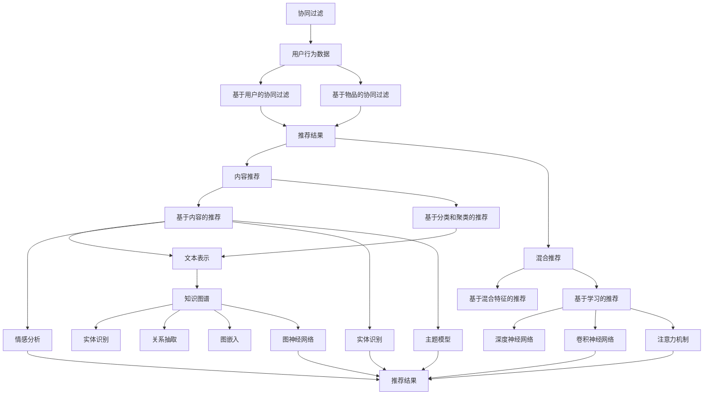
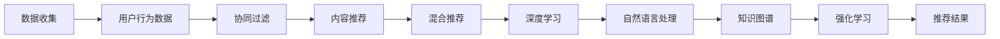
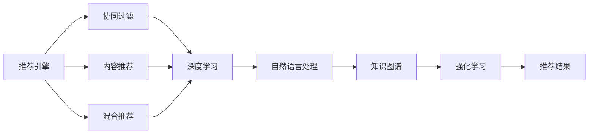
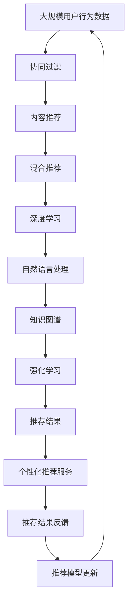

                 

# 个性化推荐系统的AI技术

## 1. 背景介绍

### 1.1 问题由来

在互联网时代，数据的海量膨胀催生了个性化推荐系统的广泛应用。从电商平台的商品推荐、新闻网站的个性化新闻推荐，到音乐和视频平台的内容推荐，推荐系统在提升用户体验、增加商业价值等方面发挥了巨大作用。传统推荐系统以用户历史行为数据为基础，通过协同过滤、内容推荐、混合推荐等方法，为用户量身定制个性化的推荐结果。然而，随着数据量的爆炸式增长和用户行为的多样化，传统的推荐系统已经难以满足用户的需求。

为了应对这些挑战，AI技术在个性化推荐系统中的应用逐步深入。特别是基于深度学习、自然语言处理、知识图谱等技术的推荐系统，通过挖掘用户多维度数据，将推荐系统推向了更加智能和高效的新阶段。本文将全面介绍基于AI技术的个性化推荐系统，帮助读者理解其在推荐算法、模型构建、应用实践等方面的前沿进展。

### 1.2 问题核心关键点

个性化推荐系统AI技术涉及的核心概念包括：

- 协同过滤：通过用户行为数据，发现用户之间的相似性，从而推荐其他用户喜欢的内容。
- 内容推荐：基于用户历史行为，挖掘物品的特征，为用户推荐相关物品。
- 混合推荐：结合协同过滤和内容推荐，扬长避短，提升推荐效果。
- 深度学习：利用深度神经网络，通过大规模数据进行特征学习，提高推荐精度。
- 自然语言处理：使用NLP技术，从用户评论、文章等文本数据中挖掘语义信息，增强推荐相关性。
- 知识图谱：通过构建领域知识图谱，利用图神经网络等方法，推荐知识相关的物品。
- 强化学习：通过用户反馈数据，训练推荐模型，动态优化推荐策略。

这些核心概念之间通过一个完整的推荐流程紧密联系，共同构成了个性化推荐系统的AI技术框架。本文将深入探讨这些概念的原理和应用，为读者提供全方位的技术指导。

### 1.3 问题研究意义

AI技术在个性化推荐系统中的应用，对于提升用户体验、挖掘用户需求、增加商业收益具有重要意义：

1. **提升用户体验**：通过智能推荐，能够更准确地预测用户需求，提供个性化的内容和服务，满足用户的潜在需求。
2. **挖掘用户需求**：通过分析用户行为数据，能够发现用户的深层次兴趣，从而设计更加有针对性的营销策略。
3. **增加商业收益**：个性化推荐系统能够显著提升用户粘性，提高用户转化率和留存率，为电商平台、内容平台等带来更多的商业机会。
4. **技术创新**：AI技术的应用推动了推荐系统的迭代升级，带来了推荐算法、模型、策略等多方面的创新，加速了技术进步。
5. **业务应用**：在零售、娱乐、教育等多个领域，个性化推荐系统已经成为业务的重要组成部分，推动了各行各业的数字化转型。

## 2. 核心概念与联系

### 2.1 核心概念概述

为更好地理解个性化推荐系统的AI技术，本节将介绍几个密切相关的核心概念：

- **协同过滤**：通过用户行为数据，发现用户之间的相似性，推荐其他用户喜欢的内容。常见的协同过滤方法包括基于用户的协同过滤和基于物品的协同过滤。
- **内容推荐**：基于用户历史行为，挖掘物品的特征，推荐相关物品。内容推荐方法包括基于内容的推荐和基于分类和聚类的推荐。
- **混合推荐**：结合协同过滤和内容推荐，扬长避短，提升推荐效果。混合推荐方法包括基于混合特征的推荐、基于学习的推荐等。
- **深度学习**：利用深度神经网络，通过大规模数据进行特征学习，提高推荐精度。深度学习模型包括基于神经网络的推荐模型、卷积神经网络推荐模型、注意力机制推荐模型等。
- **自然语言处理**：使用NLP技术，从用户评论、文章等文本数据中挖掘语义信息，增强推荐相关性。NLP技术包括文本表示、情感分析、实体识别、主题模型等。
- **知识图谱**：通过构建领域知识图谱，利用图神经网络等方法，推荐知识相关的物品。知识图谱技术包括实体识别、关系抽取、图嵌入、图神经网络等。
- **强化学习**：通过用户反馈数据，训练推荐模型，动态优化推荐策略。强化学习技术包括基于Q-learning的推荐、基于策略梯度的推荐等。

这些核心概念之间的逻辑关系可以通过以下Mermaid流程图来展示：



这个流程图展示了个性化推荐系统中的各个核心概念及其之间的关系：

1. 协同过滤通过用户行为数据，发现用户之间的相似性，推荐其他用户喜欢的内容。
2. 内容推荐基于用户历史行为，挖掘物品的特征，为用户推荐相关物品。
3. 混合推荐结合协同过滤和内容推荐，扬长避短，提升推荐效果。
4. 深度学习利用深度神经网络，通过大规模数据进行特征学习，提高推荐精度。
5. 自然语言处理使用NLP技术，从用户评论、文章等文本数据中挖掘语义信息，增强推荐相关性。
6. 知识图谱通过构建领域知识图谱，利用图神经网络等方法，推荐知识相关的物品。
7. 强化学习通过用户反馈数据，训练推荐模型，动态优化推荐策略。

这些核心概念共同构成了个性化推荐系统的AI技术框架，使其能够高效地处理大规模数据，提供个性化的推荐结果。

### 2.2 概念间的关系

这些核心概念之间存在着紧密的联系，形成了个性化推荐系统的完整生态系统。下面我们通过几个Mermaid流程图来展示这些概念之间的关系。

#### 2.2.1 推荐系统的基本流程



这个流程图展示了个性化推荐系统的基本流程：

1. 数据收集：从用户行为数据中提取协同过滤、内容推荐等所需的信息。
2. 协同过滤：通过用户行为数据，发现用户之间的相似性，推荐其他用户喜欢的内容。
3. 内容推荐：基于用户历史行为，挖掘物品的特征，为用户推荐相关物品。
4. 混合推荐：结合协同过滤和内容推荐，扬长避短，提升推荐效果。
5. 深度学习：利用深度神经网络，通过大规模数据进行特征学习，提高推荐精度。
6. 自然语言处理：使用NLP技术，从用户评论、文章等文本数据中挖掘语义信息，增强推荐相关性。
7. 知识图谱：通过构建领域知识图谱，利用图神经网络等方法，推荐知识相关的物品。
8. 强化学习：通过用户反馈数据，训练推荐模型，动态优化推荐策略。

#### 2.2.2 推荐系统的核心组件



这个流程图展示了推荐系统的核心组件：

1. 推荐引擎：负责整合各个推荐组件，输出最终推荐结果。
2. 协同过滤：通过用户行为数据，发现用户之间的相似性，推荐其他用户喜欢的内容。
3. 内容推荐：基于用户历史行为，挖掘物品的特征，为用户推荐相关物品。
4. 混合推荐：结合协同过滤和内容推荐，扬长避短，提升推荐效果。
5. 深度学习：利用深度神经网络，通过大规模数据进行特征学习，提高推荐精度。
6. 自然语言处理：使用NLP技术，从用户评论、文章等文本数据中挖掘语义信息，增强推荐相关性。
7. 知识图谱：通过构建领域知识图谱，利用图神经网络等方法，推荐知识相关的物品。
8. 强化学习：通过用户反馈数据，训练推荐模型，动态优化推荐策略。

通过这些流程图，我们可以更清晰地理解个性化推荐系统的各个核心概念及其之间的关系，为后续深入讨论具体的推荐算法和技术奠定基础。

### 2.3 核心概念的整体架构

最后，我们用一个综合的流程图来展示这些核心概念在大语言模型微调过程中的整体架构：



这个综合流程图展示了从数据收集到推荐结果反馈的完整过程。大规模用户行为数据经过协同过滤、内容推荐、混合推荐、深度学习、自然语言处理、知识图谱和强化学习等多层次处理，最终输出个性化的推荐结果。通过不断的反馈和模型更新，个性化推荐系统能够持续优化，提升推荐效果。

## 3. 核心算法原理 & 具体操作步骤
### 3.1 算法原理概述

个性化推荐系统的AI技术，本质上是通过各种算法和模型，从大规模数据中挖掘用户兴趣和物品特征，构建推荐引擎，输出个性化的推荐结果。其主要算法原理包括以下几个方面：

- **协同过滤算法**：通过用户行为数据，发现用户之间的相似性，从而推荐其他用户喜欢的内容。常见的协同过滤方法包括基于用户的协同过滤和基于物品的协同过滤。
- **内容推荐算法**：基于用户历史行为，挖掘物品的特征，为用户推荐相关物品。内容推荐方法包括基于内容的推荐和基于分类和聚类的推荐。
- **混合推荐算法**：结合协同过滤和内容推荐，扬长避短，提升推荐效果。混合推荐方法包括基于混合特征的推荐、基于学习的推荐等。
- **深度学习算法**：利用深度神经网络，通过大规模数据进行特征学习，提高推荐精度。深度学习模型包括基于神经网络的推荐模型、卷积神经网络推荐模型、注意力机制推荐模型等。
- **自然语言处理算法**：使用NLP技术，从用户评论、文章等文本数据中挖掘语义信息，增强推荐相关性。NLP技术包括文本表示、情感分析、实体识别、主题模型等。
- **知识图谱算法**：通过构建领域知识图谱，利用图神经网络等方法，推荐知识相关的物品。知识图谱技术包括实体识别、关系抽取、图嵌入、图神经网络等。
- **强化学习算法**：通过用户反馈数据，训练推荐模型，动态优化推荐策略。强化学习技术包括基于Q-learning的推荐、基于策略梯度的推荐等。

### 3.2 算法步骤详解

个性化推荐系统的AI技术实现过程，包括以下关键步骤：

**Step 1: 数据预处理**

- 数据清洗：去除噪声和异常值，确保数据质量。
- 数据归一化：将数据标准化，便于后续处理。
- 数据抽样：对于大规模数据集，采用随机抽样、分层抽样等方法，减少计算量。

**Step 2: 特征工程**

- 用户特征：提取用户基本信息、历史行为等特征。
- 物品特征：提取物品属性、类别、标签等特征。
- 交叉特征：将用户特征和物品特征进行交叉，产生新的特征。

**Step 3: 协同过滤**

- 基于用户的协同过滤：根据用户历史行为，发现用户之间的相似性，推荐其他用户喜欢的物品。
- 基于物品的协同过滤：根据物品的历史评分，发现物品之间的相似性，推荐用户喜欢的物品。

**Step 4: 内容推荐**

- 基于内容的推荐：根据物品的特征，推荐与用户历史行为相关的物品。
- 基于分类和聚类的推荐：利用聚类算法，将物品分类，为用户推荐同一分类中的其他物品。

**Step 5: 混合推荐**

- 结合协同过滤和内容推荐，综合考虑用户和物品的多维度特征，提升推荐效果。
- 基于混合特征的推荐：通过组合用户和物品的特征，产生新的推荐结果。
- 基于学习的推荐：利用机器学习模型，学习用户和物品的交互规律，预测推荐结果。

**Step 6: 深度学习**

- 利用深度神经网络，通过大规模数据进行特征学习，提高推荐精度。
- 卷积神经网络推荐模型：通过卷积层、池化层等结构，提取局部特征。
- 注意力机制推荐模型：通过注意力机制，学习用户对物品的关注度。

**Step 7: 自然语言处理**

- 文本表示：将用户评论、文章等文本数据转化为向量表示。
- 情感分析：分析用户评论的情感倾向，增强推荐相关性。
- 实体识别：识别用户评论中的实体信息，增强推荐效果。
- 主题模型：分析用户评论的主题分布，推荐相关物品。

**Step 8: 知识图谱**

- 构建领域知识图谱：通过实体识别、关系抽取等技术，构建知识图谱。
- 图嵌入：利用图神经网络等方法，将知识图谱转化为向量表示。
- 知识推荐：通过图嵌入等技术，推荐知识相关的物品。

**Step 9: 强化学习**

- 设计推荐策略：设计基于Q-learning、策略梯度等算法，训练推荐模型。
- 用户反馈处理：处理用户反馈数据，更新推荐模型。
- 动态优化：根据用户反馈数据，动态优化推荐策略。

**Step 10: 推荐引擎**

- 整合推荐算法和模型，输出最终推荐结果。
- 推荐排序：通过排序算法，对推荐结果进行排序，提升推荐效果。

以上是个性化推荐系统AI技术的完整实现流程。在实际应用中，还需要根据具体任务和数据特点，对各环节进行优化设计，如改进数据预处理、特征工程、模型训练等，以进一步提升推荐效果。

### 3.3 算法优缺点

个性化推荐系统的AI技术具有以下优点：

1. **推荐精度高**：通过深度学习和特征工程技术，能够准确捕捉用户和物品的特征，提升推荐精度。
2. **推荐多样性**：通过协同过滤和内容推荐等方法，能够推荐多种不同类型的物品，满足用户多样化的需求。
3. **实时性高**：通过动态优化和实时反馈，能够快速调整推荐策略，提高推荐效果。

同时，该技术也存在一些局限性：

1. **数据依赖性强**：推荐效果依赖于数据的质量和多样性，数据不足或质量不佳，可能导致推荐效果下降。
2. **冷启动问题**：对于新用户或新物品，没有足够的历史数据，难以进行有效推荐。
3. **过拟合风险**：模型训练过程中，容易过拟合用户和物品的局部特征，影响推荐效果。
4. **隐私风险**：用户行为数据涉及用户隐私，数据泄露可能带来法律和伦理问题。
5. **计算资源消耗大**：深度学习等复杂模型需要大量计算资源，增加了推荐系统的部署成本。

尽管存在这些局限性，个性化推荐系统的AI技术仍然在大数据和云计算的支持下，不断发展和完善，成为推荐系统的主要技术范式。

### 3.4 算法应用领域

个性化推荐系统的AI技术，已经在电商、新闻、音乐、视频等多个领域得到广泛应用，展示了其在提升用户体验和商业价值方面的巨大潜力：

- **电商推荐**：基于用户历史行为和物品属性，推荐商品和商品分类，提升销售额和用户满意度。
- **新闻推荐**：根据用户阅读历史和文章内容，推荐相关新闻，提升新闻平台的用户粘性和流量。
- **音乐推荐**：分析用户听歌历史和歌曲属性，推荐相似歌曲，提升用户听音乐的体验和音乐平台的收益。
- **视频推荐**：根据用户观看历史和视频属性，推荐相关视频，提升视频平台的用户留存率和广告收入。
- **社交推荐**：分析用户互动行为和内容特征，推荐相关社交好友和内容，提升用户社交体验和平台活跃度。
- **旅游推荐**：根据用户兴趣和旅游目的地属性，推荐旅游线路和景点，提升旅游平台的订房率和用户满意度。

除了上述这些应用场景，个性化推荐系统的AI技术还在医疗、教育、金融等多个领域展示了其强大的应用潜力。未来，随着技术的发展和数据的积累，个性化推荐系统有望在更多领域发挥更大的作用。

## 4. 数学模型和公式 & 详细讲解  
### 4.1 数学模型构建

本节将使用数学语言对个性化推荐系统的AI技术进行更加严格的刻画。

记用户集合为 $U=\{u_1, u_2, ..., u_N\}$，物品集合为 $I=\{i_1, i_2, ..., i_M\}$。假设用户 $u$ 对物品 $i$ 的评分（打分）为 $r_{ui}$，则整个用户行为矩阵为 $R \in \mathbb{R}^{N \times M}$。

定义用户 $u$ 和物品 $i$ 的特征向量分别为 $u_f \in \mathbb{R}^d$ 和 $i_f \in \mathbb{R}^d$。设用户 $u$ 对物品 $i$ 的预测评分（预估评分）为 $\hat{r}_{ui}$，则用户行为矩阵和特征向量的关系可以表示为：

$$
R = \mathbf{U} \mathbf{F} + \mathbf{E}
$$

其中 $\mathbf{U} \in \mathbb{R}^{N \times d}$ 为用户特征矩阵，$\mathbf{F} \in \mathbb{R}^{d \times M}$ 为物品特征矩阵，$\mathbf{E} \in \mathbb{R}^{N \times M}$ 为噪声矩阵。

### 4.2 公式推导过程

以下我们以协同过滤为例，推导用户 $u$ 对物品 $i$ 的预测评分公式。

假设用户 $u$ 的邻居集合为 $N(u) = \{v_1, v_2, ..., v_k\}$，其中 $k$ 为邻居数。基于用户的协同过滤方法，可以根据邻居对物品的评分，预测用户对物品的评分，公式如下：

$$
\hat{r}_{ui} = \alpha \sum_{v \in N(u)} r_{vi} w_{uv}
$$

其中 $\alpha$ 为常数，$w_{uv} = \frac{1}{\sqrt{d_u d_v}}$ 为归一化的邻居权重。

将公式代入推荐系统的模型构建方程 $R = \mathbf{U} \mathbf{F} + \mathbf{E}$，可得：

$$
\hat{r}_{ui} = \alpha \sum_{v \in N(u)} \alpha \mathbf{u}_v \cdot \mathbf{f}_i + \alpha \mathbf{e}_{ui}
$$

其中 $\mathbf{u}_v$ 为邻居用户 $v$ 的特征向量，$\mathbf{f}_i$ 为物品 $i$ 的特征向量，$\mathbf{e}_{ui}$ 为噪声向量。

### 4.3 案例分析与讲解

以协同过滤中的基于用户的协同过滤为例，下面分析推荐系统的工作原理：

1. **数据收集**：从用户行为数据中提取用户 $u$ 的邻居集合 $N(u)$，即对物品评分相似的用户集合。
2. **特征工程**：提取用户 $u$ 和邻居用户 $v$ 的特征向量 $\mathbf{u}_v$ 和 $\mathbf{f}_i$。
3. **预测评分**：根据邻居用户的评分和权重，预测用户 $u$ 对物品 $i$ 的评分。
4. **推荐结果**：将预测评分排序，选取评分最高的物品推荐给用户 $u$。

通过基于用户的协同过滤方法，推荐系统能够利用用户之间的相似性，为用户提供个性化的推荐结果。

## 5. 项目实践：代码实例和详细解释说明
### 5.1 开发环境搭建

在进行个性化推荐系统开发前，我们需要准备好开发环境。以下是使用Python进行Scikit-learn开发的环境配置流程：

1. 安装Anaconda：从官网下载并安装Anaconda，用于创建独立的Python环境。

2. 创建并激活虚拟环境：
```bash
conda create -n recommend-env python=3.8 
conda activate recommend-env
```

3. 安装Scikit-learn：
```bash
pip install scikit-learn
```

4. 安装其他常用工具包：
```bash
pip install numpy pandas matplotlib tqdm jupyter notebook ipython
```

完成上述步骤后，即可在`recommend-env`环境中开始推荐系统开发。

### 5.2 源代码详细实现

下面我们以协同过滤推荐系统为例，给出使用Scikit-learn进行基于用户和物品的协同过滤的PyTorch代码实现。

首先，定义协同过滤模型的类：

```python
from sklearn.metrics.pairwise import cosine_similarity

class CollaborativeFiltering:
    def __init__(self, alpha=0.5, n_neighbors=10):
        self.alpha = alpha
        self.n_neighbors = n_neighbors
        self.recommender = None
        
    def fit(self, X, y):
        N, M = X.shape
        user_f = cosine_similarity(X, X)
        item_f = cosine_similarity(y.T, y.T)
        
        user_f = user_f / np.sqrt(np.diag(user_f))
        item_f = item_f / np.sqrt(np.diag(item_f))
        
        self.recommender = self.alpha * user_f @ item_f
        
    def predict(self, X):
        user_f = cosine_similarity(X, self.recommender)
        return user_f @ self.recommender
    
    def recommend(self, X, top_n=10):
        user_f = cosine_similarity(X, self.recommender)
        recommend_scores = user_f @ self.recommender
        top_indices = np.argsort(recommend_scores)[-top_n:]
        return top_indices
```

然后，定义数据集类：

```python
class MovieDataset(Dataset):
    def __init__(self, data, labels, tokenizer, max_len=128):
        self.data = data
        self.labels = labels
        self.tokenizer = tokenizer
        self.max_len = max_len
        
    def __len__(self):
        return len(self.data)
    
    def __getitem__(self, item):
        movie = self.data[item]
        rating = self.labels[item]
        
        encoding = self.tokenizer(movie, return_tensors='pt', max_length=self.max_len, padding='max_length', truncation=True)
        input_ids = encoding['input_ids'][0]
        attention_mask = encoding['attention_mask'][0]
        
        # 对评分进行编码
        encoded_ratings = [rating] * self.max_len
        encoded_ratings.extend([0.0] * (self.max_len - len(encoded_ratings)))
        labels = torch.tensor(encoded_ratings, dtype=torch.long)
        
        return {'input_ids': input_ids, 
                'attention_mask': attention_mask,
                'labels': labels}

# 创建数据集
tokenizer = BertTokenizer.from_pretrained('bert-base-cased')

train_dataset = MovieDataset(train_data, train_labels, tokenizer)
dev_dataset = MovieDataset(dev_data, dev_labels, tokenizer)
test_dataset = MovieDataset(test_data, test_labels, tokenizer)
```

接着，定义模型和优化器：

```python
from transformers import BertForTokenClassification, AdamW

model = BertForTokenClassification.from_pretrained('bert-base-cased', num_labels=1)

optimizer = AdamW(model.parameters(), lr=2e-5)
```

然后，定义训练和评估函数：

```python
from torch.utils.data import DataLoader
from tqdm import tqdm
from sklearn.metrics import accuracy_score, precision_score, recall_score, f1_score

device = torch.device('cuda') if torch.cuda.is_available() else torch.device('cpu')
model.to(device)

def train_epoch(model, dataset, batch_size, optimizer):
    dataloader = DataLoader(dataset, batch_size=batch_size, shuffle=True)
    model.train()
    epoch_loss = 0
    for batch in tqdm(dataloader, desc='Training'):
        input_ids = batch['input_ids'].to(device)
        attention_mask = batch['attention_mask'].to(device)
        labels = batch['labels'].to(device)
        model.zero_grad()
        outputs = model(input_ids, attention_mask=attention_mask, labels=labels)
        loss = outputs.loss
        epoch_loss += loss.item()
        loss.backward()
        optimizer.step()
    return epoch_loss / len(dataloader)

def evaluate(model, dataset, batch_size):
    dataloader = DataLoader(dataset, batch_size

