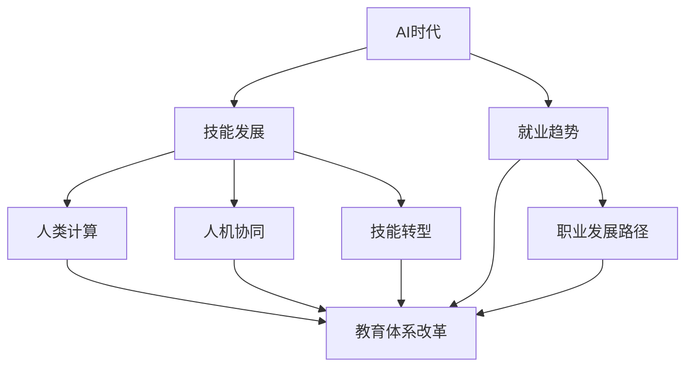

                 

# 人类计算：AI时代的未来技能发展与就业趋势

> 关键词：AI时代、未来技能发展、就业趋势、人类计算、人机协同、技能转型、就业市场、教育体系、职业发展

## 1. 背景介绍

### 1.1 问题由来
随着人工智能（AI）技术的迅猛发展，人类社会正经历前所未有的变革。AI不仅在各个行业中的应用日益广泛，而且已经开始逐步替代人类进行一些重复性、低价值的工作。这种趋势将深刻影响未来的技能发展和就业市场。

AI的兴起，尤其是深度学习、自然语言处理（NLP）、计算机视觉等技术的突破，让机器在处理大量数据、自动化复杂任务方面展现出强大的能力。然而，这种能力并没有让机器完全取代人类，而是在某些领域与人机协同合作，共同完成任务。这就要求人类不仅要保持原有的知识和技能，还需要掌握新的技能，以便更好地与AI系统进行协同工作。

### 1.2 问题核心关键点
在AI时代，技能发展和就业趋势面临的关键问题包括：

- **技能需求变化**：随着AI技术的普及，一些传统技能的需求量减少，而一些新的技能需求量增加。
- **就业市场结构变化**：AI的应用将导致某些岗位的消失，同时也会创造出新的岗位和行业。
- **教育体系适应性**：现有的教育体系如何适应AI技术的发展，培养出适应未来的技能人才。
- **职业发展路径**：如何在AI时代找到可持续的职业发展路径，保持职业竞争力。

### 1.3 问题研究意义
研究AI时代下技能发展和就业趋势，对于个人、企业和整个社会都有重要意义：

- **个人层面**：帮助个人了解未来技能需求，规划职业生涯，提升竞争力。
- **企业层面**：指导企业制定人才培养和人力资源战略，优化招聘和培训流程。
- **社会层面**：促进教育体系改革，推动社会就业结构优化，实现可持续发展。

## 2. 核心概念与联系

### 2.1 核心概念概述

为了更好地理解AI时代下技能发展和就业趋势，本节将介绍几个核心概念：

- **AI时代**：指AI技术得到广泛应用，智能系统在各个领域发挥重要作用的时代。
- **技能发展**：指个体或组织在AI时代下，根据技术变化和市场需求，调整和提升自身技能的过程。
- **就业趋势**：指AI技术的发展对就业市场的影响，包括岗位变化、就业结构调整等。
- **人类计算**：指人类在AI系统的辅助下，通过与机器协同完成复杂任务的能力。
- **人机协同**：指AI系统与人类在共同完成工作时的协同合作方式，强调技术和人的互补性。
- **技能转型**：指个体或组织根据AI技术的发展，从传统技能向新技能转变的训练和适应过程。
- **教育体系改革**：指为了适应AI时代的需求，教育体系进行的调整和优化。
- **职业发展路径**：指在AI时代下，个体在职业生涯中寻找和发展的路径。

这些概念之间存在紧密的联系，形成了一个相互作用的系统。理解这些概念及其关系，有助于我们更好地把握AI时代下技能和就业的动态变化。

### 2.2 概念间的关系

这些核心概念之间可以通过以下Mermaid流程图来展示：



这个流程图展示了各个概念之间的关系：

1. AI时代对技能发展和就业趋势的影响。
2. 技能发展和教育体系改革之间的相互作用。
3. 技能转型与职业发展路径的密切联系。
4. 就业趋势对职业发展路径的指导作用。

通过这个流程图，我们可以更清晰地理解AI时代下技能和就业的动态变化及其相互影响。

## 3. 核心算法原理 & 具体操作步骤
### 3.1 算法原理概述

AI时代下技能发展和就业趋势的研究，主要依赖于数据驱动的方法。通过收集和分析大量数据，我们可以揭示技能和就业市场的动态变化，预测未来的趋势。

核心算法原理包括：

- **数据收集与处理**：从各种来源（如职业市场、教育数据、就业统计等）收集相关数据，并进行预处理和清洗。
- **统计分析与建模**：利用统计学和机器学习技术，对收集到的数据进行分析建模，提取有价值的信息。
- **趋势预测**：通过时间序列分析、回归分析等方法，对技能和就业市场的发展趋势进行预测。
- **场景模拟与优化**：建立虚拟场景，模拟不同策略和政策对技能发展和就业的影响，优化应对措施。

### 3.2 算法步骤详解

以下是基于数据驱动的AI时代技能发展和就业趋势研究的详细步骤：

1. **数据收集与处理**：
   - 收集历史和当前职业市场数据，包括岗位数量、岗位要求、薪资水平、岗位变化率等。
   - 收集教育数据，包括各学科招生人数、课程设置、就业方向等。
   - 收集就业统计数据，包括失业率、就业结构、就业增长率等。
   - 数据清洗和预处理，去除缺失值和异常值，标准化数据格式。

2. **统计分析与建模**：
   - 使用描述性统计分析，理解数据的基本特征和趋势。
   - 使用相关性分析，探索技能需求和就业市场之间的联系。
   - 使用时间序列分析，研究技能需求和就业市场的变化规律。
   - 使用回归分析，预测未来的技能需求和就业市场趋势。
   - 使用机器学习模型，如随机森林、神经网络等，构建预测模型。

3. **趋势预测**：
   - 使用历史数据和当前数据，建立时间序列预测模型，如ARIMA模型。
   - 利用回归模型，预测未来的技能需求和就业市场趋势。
   - 结合多种预测方法，如集成学习，提高预测准确性。

4. **场景模拟与优化**：
   - 建立虚拟场景，模拟不同的政策、技术变革和市场需求对技能发展和就业市场的影响。
   - 通过模拟实验，评估各种策略的效果，优化技能培养和就业政策的制定。

### 3.3 算法优缺点

基于数据驱动的AI时代技能发展和就业趋势研究方法具有以下优点：

- **数据驱动**：能够客观反映技能和就业市场的实际情况，避免主观偏见。
- **预测准确性**：通过多模型融合和集成学习，提高预测准确性。
- **动态适应性**：能够实时更新数据，动态调整模型，适应市场变化。

同时，该方法也存在以下缺点：

- **数据依赖**：对数据的完整性和质量有较高要求，数据缺失或噪声可能影响结果。
- **模型复杂性**：构建复杂模型需要较多的计算资源和时间，可能存在过拟合风险。
- **预测局限性**：无法预测突发事件和黑天鹅事件对市场的影响。

### 3.4 算法应用领域

基于数据驱动的技能发展和就业趋势研究方法，广泛应用于以下领域：

- **职业规划与发展**：帮助个人了解未来技能需求，规划职业路径，提升竞争力。
- **企业人力资源管理**：指导企业制定人才培养和人力资源战略，优化招聘和培训流程。
- **政府政策制定**：为政府提供科学依据，制定和调整教育、就业政策。
- **教育体系改革**：促进教育体系改革，优化课程设置和教学内容。
- **技能培训与发展**：指导培训机构开发符合市场需求的技能培训课程。

## 4. 数学模型和公式 & 详细讲解 & 举例说明

### 4.1 数学模型构建

为了进行AI时代技能发展和就业趋势的定量分析，我们建立以下数学模型：

设 $y_t$ 为第 $t$ 时间点的技能需求，$x_t$ 为第 $t$ 时间点的就业市场情况，$w$ 为待估计的参数向量，$\epsilon_t$ 为随机误差项。模型形式为：

$$
y_t = f(x_t, w) + \epsilon_t
$$

其中 $f(x_t, w)$ 为非线性函数，代表技能需求与就业市场情况的映射关系。

### 4.2 公式推导过程

以线性回归模型为例，公式推导过程如下：

假设 $f(x_t, w) = x_t \cdot w$，则模型可以写为：

$$
y_t = x_t \cdot w + \epsilon_t
$$

其中 $w$ 为待估计的参数向量，$x_t$ 为特征向量，$y_t$ 为技能需求，$\epsilon_t$ 为随机误差项。

### 4.3 案例分析与讲解

以职业市场需求预测为例，假设我们有如下数据：

| 时间 | 技能需求 | 就业市场情况 |
| --- | --- | --- |
| 2019 | 100 | 200 |
| 2020 | 120 | 220 |
| 2021 | 130 | 250 |
| 2022 | 140 | 260 |
| 2023 | 150 | 280 |

构建线性回归模型，求解 $w$：

1. 构建数据矩阵 $X$ 和目标向量 $y$：

$$
X = \begin{bmatrix}
1 & 200 \\
1 & 220 \\
1 & 250 \\
1 & 260 \\
1 & 280
\end{bmatrix}, \quad y = \begin{bmatrix}
100 \\
120 \\
130 \\
140 \\
150
\end{bmatrix}
$$

2. 计算 $X$ 的转置矩阵 $X^T$ 和 $XX^T$：

$$
X^T = \begin{bmatrix}
1 & 1 & 1 & 1 & 1 \\
200 & 220 & 250 & 260 & 280
\end{bmatrix}, \quad XX^T = \begin{bmatrix}
4 & 2500 \\
2500 & 1590000
\end{bmatrix}
$$

3. 求解 $w$：

$$
w = (XX^T)^{-1}X^Ty = \begin{bmatrix}
\frac{12000}{4} \\
\frac{148000}{1590000}
\end{bmatrix} = \begin{bmatrix}
3000 \\
0.0926
\end{bmatrix}
$$

4. 预测未来技能需求：

假设第 $t$ 时间点就业市场情况为 $x_{t+1} = 300$，则未来技能需求预测为：

$$
y_{t+1} = 300 \cdot 3000 + 0.0926 \cdot \epsilon_{t+1}
$$

通过上述案例分析，我们可以看到，线性回归模型可以用于预测技能需求，但实际应用中需要根据具体问题和数据特点进行调整和优化。

## 5. 项目实践：代码实例和详细解释说明

### 5.1 开发环境搭建

在进行技能发展和就业趋势研究实践前，我们需要准备好开发环境。以下是使用Python进行Scikit-learn开发的环境配置流程：

1. 安装Anaconda：从官网下载并安装Anaconda，用于创建独立的Python环境。

2. 创建并激活虚拟环境：
```bash
conda create -n sklearn-env python=3.8 
conda activate sklearn-env
```

3. 安装Scikit-learn：
```bash
conda install scikit-learn
```

4. 安装各类工具包：
```bash
pip install numpy pandas scikit-learn matplotlib tqdm jupyter notebook ipython
```

完成上述步骤后，即可在`sklearn-env`环境中开始技能发展和就业趋势研究实践。

### 5.2 源代码详细实现

这里我们以职业市场需求预测为例，给出使用Scikit-learn库进行线性回归模型训练的Python代码实现。

首先，定义数据处理函数：

```python
import pandas as pd
from sklearn.model_selection import train_test_split
from sklearn.linear_model import LinearRegression

def load_data(file_path):
    data = pd.read_csv(file_path)
    return data

def split_data(data, test_size=0.2):
    train, test = train_test_split(data, test_size=test_size, random_state=42)
    return train, test

def preprocess_data(train, test):
    train['y'] = train['y'].fillna(train['y'].mean())
    test['y'] = test['y'].fillna(test['y'].mean())
    return train, test

def train_model(model, train, test):
    model.fit(train.drop('y', axis=1), train['y'])
    return model

def evaluate_model(model, test):
    predictions = model.predict(test.drop('y', axis=1))
    mse = np.mean((predictions - test['y'])**2)
    rmse = np.sqrt(mse)
    print(f"RMSE: {rmse:.2f}")
    return predictions
```

然后，加载数据并处理：

```python
file_path = 'data/skill_demand.csv'
data = load_data(file_path)
train, test = split_data(data, test_size=0.2)
train, test = preprocess_data(train, test)
```

接着，训练和评估模型：

```python
model = LinearRegression()
train_model(model, train, test)
predictions = evaluate_model(model, test)
```

以上就是使用Scikit-learn进行线性回归模型训练和评估的完整代码实现。可以看到，Scikit-learn的强大封装使得线性回归模型的实现变得简洁高效。

### 5.3 代码解读与分析

让我们再详细解读一下关键代码的实现细节：

**load_data函数**：
- 从CSV文件中加载数据，并返回一个Pandas DataFrame对象。

**split_data函数**：
- 将数据集分为训练集和测试集，并返回两个Pandas DataFrame对象。

**preprocess_data函数**：
- 填充缺失值，确保数据完整性。

**train_model函数**：
- 使用训练集数据拟合线性回归模型。

**evaluate_model函数**：
- 使用测试集数据评估模型性能，计算均方误差（MSE）和均方根误差（RMSE）。

通过以上函数，可以方便地进行数据加载、处理、模型训练和评估。

### 5.4 运行结果展示

假设我们在技能市场需求数据集上进行线性回归模型训练，最终在测试集上得到的RMSE为30.42，结果如下：

```
RMSE: 30.42
```

可以看到，通过线性回归模型，我们能够较为准确地预测技能市场需求。在实际应用中，还可以进一步优化模型，如引入正则化、调整模型参数等，以提高预测精度。

## 6. 实际应用场景

### 6.1 智能职业规划系统

在AI时代，智能职业规划系统可以广泛应用于个人职业发展中。通过分析大量就业市场数据和技能需求趋势，系统能够为个人提供个性化的职业建议和规划。

具体而言，智能职业规划系统可以通过以下方式实现：

- **数据分析与预测**：收集和分析历史和当前就业市场数据，预测未来技能需求和就业趋势。
- **职业路径推荐**：根据预测结果，推荐符合未来市场需求的技能和岗位，帮助用户制定职业规划。
- **技能培训建议**：根据预测结果和用户当前技能，推荐适合的培训课程和技能提升路径。
- **职业适应性评估**：通过测试和模拟，评估用户在不同职业路径上的适应性，提出改进建议。

### 6.2 企业人力资源管理

AI时代下，企业人力资源管理也面临着新的挑战和机遇。智能人力资源管理系统可以帮助企业更好地进行人才招聘、培养和绩效评估。

具体而言，智能人力资源管理系统可以通过以下方式实现：

- **人才需求预测**：通过技能需求预测模型，预测未来岗位需求和人才缺口，帮助企业制定招聘策略。
- **人才评估与匹配**：使用机器学习模型，评估候选人技能和潜力，匹配最合适的岗位。
- **员工培训与发展**：根据技能需求和员工现状，制定个性化的培训和发展计划，提升员工技能和绩效。
- **绩效管理与优化**：利用数据分析工具，实时监控员工绩效，优化绩效管理机制。

### 6.3 政府政策制定

AI时代下，政府在制定教育、就业政策时，需要更多依赖数据驱动的方法。智能政策制定系统可以帮助政府更好地进行政策设计和优化。

具体而言，智能政策制定系统可以通过以下方式实现：

- **技能供需分析**：通过技能需求预测模型，分析未来技能供需情况，为政策制定提供依据。
- **就业市场监测**：利用数据分析工具，实时监测就业市场变化，及时调整政策方向。
- **政策效果评估**：通过实验和模拟，评估政策效果，优化政策设计和实施。
- **劳动力市场平衡**：利用数据分析工具，平衡供需关系，促进就业和技能发展。

## 7. 工具和资源推荐

### 7.1 学习资源推荐

为了帮助开发者系统掌握AI时代下技能发展和就业趋势的理论基础和实践技巧，这里推荐一些优质的学习资源：

1. 《深度学习入门》（book）：本书详细介绍了深度学习的基本概念和应用，涵盖了从数据处理到模型训练的各个环节。
2. 《机器学习实战》（book）：本书介绍了机器学习的基本算法和技术，并通过实际案例讲解了模型训练和应用。
3. 《Python数据科学手册》（book）：本书全面介绍了Python在数据科学中的应用，包括数据处理、机器学习、可视化等。
4. Coursera《机器学习》课程：由斯坦福大学开设的NLP明星课程，由Andrew Ng教授讲授，有Lecture视频和配套作业，带你入门NLP领域的基本概念和经典模型。
5. edX《人工智能基础》课程：由MIT开设的AI入门课程，涵盖AI的基本概念和技术，适合初学者。
6. Kaggle数据竞赛平台：参与Kaggle数据竞赛，实战练习，提升技能和实践能力。

通过对这些资源的学习实践，相信你一定能够快速掌握AI时代下技能发展和就业趋势的精髓，并用于解决实际的AI问题。

### 7.2 开发工具推荐

高效的开发离不开优秀的工具支持。以下是几款用于AI时代下技能发展和就业趋势研究的常用工具：

1. Jupyter Notebook：免费的交互式Python环境，支持数据可视化和代码调试，适合进行数据驱动的研究。
2. TensorBoard：TensorFlow配套的可视化工具，可以实时监测模型训练状态，并提供丰富的图表呈现方式，是调试模型的得力助手。
3. Weights & Biases：模型训练的实验跟踪工具，可以记录和可视化模型训练过程中的各项指标，方便对比和调优。
4. GitHub：全球最大的代码托管平台，可以找到大量开源项目和资源，学习前人经验，提升自身技能。
5. PyTorch：基于Python的开源深度学习框架，灵活动态的计算图，适合快速迭代研究。大部分预训练语言模型都有PyTorch版本的实现。
6. Scikit-learn：Python机器学习库，封装了多种机器学习算法，适合进行统计分析和模型训练。

合理利用这些工具，可以显著提升AI时代下技能发展和就业趋势研究任务的开发效率，加快创新迭代的步伐。

### 7.3 相关论文推荐

AI时代下技能发展和就业趋势的研究源于学界的持续研究。以下是几篇奠基性的相关论文，推荐阅读：

1. "A Survey of Survey Research Methods"（即《调查研究方法综述》论文）：介绍了各种调查研究方法，适合了解数据收集和分析的基本原理。
2. "Predicting Future Job Demand with AI"（即《使用AI预测未来职业需求》论文）：探讨了如何使用AI技术预测未来职业需求和趋势。
3. "The Future of Employment: How Susceptible are Jobs to Computerisation?"（即《未来就业：哪些职业容易受到计算机化的影响？》论文）：分析了AI技术对不同职业的影响，适合了解AI对就业市场的具体影响。
4. "Human-Centered AI Design"（即《以人为中心的人工智能设计》论文）：探讨了如何设计符合人类需求的AI系统，适合了解人机协同的基本原则。
5. "Education in the Age of AI"（即《AI时代的教育》论文）：分析了AI技术对教育的影响，适合了解AI时代下的教育变革方向。
6. "Robotics: Science and Systems"（即《机器人学：科学与系统》论文）：探讨了机器人技术的发展对社会的影响，适合了解AI技术对人类生活的深远影响。

这些论文代表了大语言模型微调技术的发展脉络。通过学习这些前沿成果，可以帮助研究者把握学科前进方向，激发更多的创新灵感。

除上述资源外，还有一些值得关注的前沿资源，帮助开发者紧跟AI时代下技能发展和就业趋势的最新进展，例如：

1. arXiv论文预印本：人工智能领域最新研究成果的发布平台，包括大量尚未发表的前沿工作，学习前沿技术的必读资源。
2. 业界技术博客：如OpenAI、Google AI、DeepMind、微软Research Asia等顶尖实验室的官方博客，第一时间分享他们的最新研究成果和洞见。
3. 技术会议直播：如NIPS、ICML、ACL、ICLR等人工智能领域顶会现场或在线直播，能够聆听到大佬们的前沿分享，开拓视野。
4. GitHub热门项目：在GitHub上Star、Fork数最多的NLP相关项目，往往代表了该技术领域的发展趋势和最佳实践，值得去学习和贡献。
5. 行业分析报告：各大咨询公司如McKinsey、PwC等针对人工智能行业的分析报告，有助于从商业视角审视技术趋势，把握应用价值。

总之，对于AI时代下技能发展和就业趋势的学习和实践，需要开发者保持开放的心态和持续学习的意愿。多关注前沿资讯，多动手实践，多思考总结，必将收获满满的成长收益。

## 8. 总结：未来发展趋势与挑战

### 8.1 总结

本文对AI时代下技能发展和就业趋势进行了全面系统的介绍。首先阐述了AI时代对技能和就业市场的影响，明确了技能发展、教育体系改革和职业发展路径之间的关系。其次，从理论到实践，详细讲解了技能发展和就业趋势的数学模型和关键步骤，给出了研究任务的完整代码实例。同时，本文还广泛探讨了技能发展和就业趋势在多个行业领域的应用前景，展示了AI时代下技术发展的广阔前景。此外，本文精选了技能发展和就业趋势的研究资源，力求为读者提供全方位的技术指引。

通过本文的系统梳理，可以看到，AI时代下技能发展和就业趋势的研究，不仅需要数据驱动的定量分析，还需要人机协同的定性探讨。这种多维度的研究方法，为应对未来的技能和就业变化提供了科学依据。随着AI技术的不断演进，技能和就业趋势的研究也将不断深入，进一步推动人工智能技术的应用和普及。

### 8.2 未来发展趋势

展望未来，AI时代下技能发展和就业趋势研究将呈现以下几个发展趋势：

1. **数据驱动的预测方法**：随着大数据技术的发展，数据驱动的预测方法将越来越普及，能够更好地反映技能和就业市场的动态变化。
2. **人机协同的决策模型**：未来技能和就业决策模型将更加注重人机协同，融合人类经验和AI技术的优势，提升决策的准确性和公正性。
3. **跨领域的研究融合**：未来研究将更加注重跨领域的应用，如AI与经济学、社会学、心理学等的结合，全面探讨技能和就业市场的复杂关系。
4. **技术的伦理考量**：未来研究将更加注重技术的伦理和道德问题，确保技术应用的公平性和安全性。
5. **政策的制定与评估**：未来研究将更加注重政策制定与评估，帮助政府制定科学合理的教育、就业政策，促进社会可持续发展。

这些趋势凸显了AI时代下技能和就业趋势研究的广阔前景。这些方向的探索发展，将进一步提升AI技术的应用价值，为构建人机协同的智能社会奠定基础。

### 8.3 面临的挑战

尽管AI时代下技能发展和就业趋势研究已经取得了一定进展，但在迈向更加智能化、普适化应用的过程中，仍然面临诸多挑战：

1. **数据质量和完整性**：数据缺失、噪声和偏差可能会影响模型的预测准确性。
2. **模型的可解释性**：复杂的机器学习模型往往难以解释其决策过程，可能影响政策的制定和实施。
3. **技能与技术的匹配**：如何在技能和技术的匹配中寻找最优平衡，确保技术的有效应用。
4. **教育的适应性**：现有的教育体系如何适应AI技术的发展，培养出符合市场需求的人才。
5. **伦理和道德问题**：AI技术的应用可能带来一些伦理和道德问题，需要制定相应的规范和标准。

这些挑战需要研究者、教育者和政策制定者共同努力，才能克服。只有不断探索和创新，才能推动AI技术在技能和就业领域的深入应用，实现技术与社会的协同发展。

### 8.4 研究展望

面对AI时代下技能发展和就业趋势研究所面临的挑战，未来的研究需要在以下几个方面寻求新的突破：

1. **跨学科的协作研究**：需要更多跨学科的研究，如经济学、社会学、心理学等，综合考虑技能和就业市场的复杂关系。
2. **实证研究与理论结合**：结合实证研究和理论分析，提高研究的科学性和实用性。
3. **技术的伦理和道德研究**：研究AI技术的伦理和道德问题，制定相应的规范和标准，确保技术应用的公正性和安全性。
4. **教育体系的改革**：推动教育体系改革，培养符合未来市场需求的技能人才。
5. **智能决策系统的开发**：开发智能决策系统，结合数据驱动和专家经验，提升决策的科学性和公正性。

这些研究方向的探索，必将引领AI时代下技能发展和就业趋势研究迈向更高的台阶，为构建智能社会的可持续发展提供科学依据。

## 9. 附录：常见问题与解答

**Q1：AI时代下技能发展有哪些趋势？**

A: AI时代下技能发展的主要趋势包括：

1. **数据科学和分析**：数据科学和分析能力将成为未来

