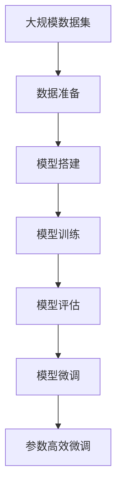

                 

# 从零开始大模型开发与微调：神经网络框架的抽象实现

## 1. 背景介绍

### 1.1 问题由来
随着人工智能技术的飞速发展，深度学习和大模型技术逐渐成为行业的新趋势。这些模型以其强大的数据处理能力和泛化能力，在自然语言处理（NLP）、计算机视觉（CV）、语音识别（ASR）等众多领域取得了显著的成果。然而，这些模型的开发和微调过程复杂繁琐，对技术水平和计算资源要求较高，使得一般开发者难以入门。

为了解决这些问题，许多开源社区和研究机构推出了易用的神经网络框架，如TensorFlow、PyTorch等。这些框架通过抽象化的实现，使得大模型的开发和微调变得更加直观和高效。本文旨在通过详细分析神经网络框架的内部机制，帮助读者从零开始，深入理解大模型的开发和微调流程，掌握核心技术，进而构建自己的高效模型。

### 1.2 问题核心关键点
大模型的开发和微调过程主要包括以下几个关键步骤：

1. **数据准备**：包括数据收集、清洗、分片和标注。
2. **模型搭建**：根据任务需求，选择或设计合适的神经网络结构。
3. **模型训练**：通过优化算法和损失函数，最小化模型在训练集上的误差。
4. **模型评估**：在验证集和测试集上评估模型性能，调整模型参数。
5. **模型微调**：在特定任务上微调模型，提升性能。

这些步骤需要结合具体任务，选择合适的框架和工具，同时需要注意避免过拟合、计算效率等实际问题。本文将详细探讨这些步骤的实现方法和注意事项。

### 1.3 问题研究意义
大模型的开发和微调技术不仅能帮助开发者快速构建高性能模型，还能推动人工智能技术在实际应用中的普及和落地。掌握这些技术，对于提升模型的性能、优化训练流程、加速模型部署具有重要意义。同时，这也为进一步研究模型架构、算法优化、应用场景等提供了坚实基础，推动人工智能技术的持续发展。

## 2. 核心概念与联系

### 2.1 核心概念概述
为更好地理解大模型开发和微调，本节将介绍几个关键概念：

- **神经网络**：由神经元（节点）和连接组成的计算图，用于处理和预测数据。
- **深度学习**：利用多层神经网络进行特征提取和预测的机器学习技术。
- **损失函数**：衡量模型预测结果与真实值之间差异的函数，用于指导模型的训练。
- **优化算法**：通过迭代优化模型参数，最小化损失函数的算法。
- **正则化**：通过引入额外约束，避免模型过拟合的策略。
- **迁移学习**：利用预训练模型的知识，加速新任务的训练。
- **微调(Fine-tuning)**：在特定任务上对预训练模型进行优化，提升性能。
- **参数高效微调(PEFT)**：仅更新部分模型参数的微调方法，减少计算资源消耗。

这些概念之间存在紧密联系，共同构成大模型开发和微调的核心技术体系。通过深入理解这些概念，可以更好地掌握大模型开发和微调的过程和方法。

### 2.2 概念间的关系

这些核心概念之间的关系可以通过以下Mermaid流程图来展示：

```mermaid
graph TB
    A[神经网络] --> B[深度学习]
    A --> C[损失函数]
    C --> D[优化算法]
    D --> E[正则化]
    A --> F[迁移学习]
    F --> G[微调]
    G --> H[参数高效微调(PEFT)]
```

这个流程图展示了大模型开发和微调的关键概念及其之间的关系：

1. 神经网络是深度学习的基础，用于处理和预测数据。
2. 深度学习通过多层神经网络提取数据特征。
3. 损失函数衡量模型预测与真实值之间的误差，指导训练过程。
4. 优化算法通过迭代更新参数，最小化损失函数。
5. 正则化防止模型过拟合，提升泛化能力。
6. 迁移学习利用预训练模型知识，加速新任务训练。
7. 微调在特定任务上优化模型参数，提升性能。
8. 参数高效微调减少计算资源消耗，提升效率。

这些概念共同构成大模型开发和微调的核心技术体系，有助于理解整个流程和方法。

### 2.3 核心概念的整体架构

最后，我们用一个综合的流程图来展示这些核心概念在大模型开发和微调过程中的整体架构：



这个综合流程图展示了从数据准备到模型微调的完整过程。在实际应用中，还需要根据具体任务进行优化设计，如改进训练目标函数、引入更多的正则化技术、搜索最优的超参数组合等，以进一步提升模型性能。

## 3. 核心算法原理 & 具体操作步骤
### 3.1 算法原理概述

大模型的开发和微调主要基于深度学习框架的实现。其核心思想是通过优化算法和损失函数，不断更新模型参数，最小化模型在训练集上的误差，提升模型在特定任务上的性能。

形式化地，假设模型为 $M_{\theta}(x)$，其中 $x$ 为输入，$\theta$ 为模型参数。假设训练集为 $D=\{(x_i, y_i)\}_{i=1}^N$，其中 $y_i$ 为真实标签。模型的损失函数为 $\mathcal{L}(\theta) = \frac{1}{N}\sum_{i=1}^N \ell(M_{\theta}(x_i), y_i)$，其中 $\ell$ 为具体的损失函数（如交叉熵、均方误差等）。优化目标为 $\theta^* = \mathop{\arg\min}_{\theta} \mathcal{L}(\theta)$。

通过梯度下降等优化算法，模型参数 $\theta$ 不断更新，最终收敛于最优解 $\theta^*$，最小化训练集误差。在此基础上，通过对模型进行微调，可以在特定任务上获得更好的性能。

### 3.2 算法步骤详解

大模型的开发和微调过程包括以下几个关键步骤：

**Step 1: 数据准备**

1. **数据收集**：根据任务需求，收集并标注相关的数据集。对于NLP任务，可以收集新闻、评论、书等文本数据，并进行文本清洗和预处理。
2. **数据预处理**：包括分词、去除停用词、构建词汇表等操作，使得数据适用于模型训练。
3. **数据分割**：将数据集划分为训练集、验证集和测试集，以保证模型在未知数据上的泛化能力。

**Step 2: 模型搭建**

1. **选择模型架构**：根据任务需求，选择合适的神经网络架构。如对于NLP任务，可以使用LSTM、GRU、Transformer等架构。
2. **定义模型层**：定义模型的输入层、隐藏层和输出层，并设置相应的参数。
3. **构建损失函数**：根据任务需求，选择合适的损失函数，如交叉熵、均方误差等。

**Step 3: 模型训练**

1. **数据加载**：使用框架提供的DataLoader，加载训练数据集，实现数据的批处理和迭代。
2. **模型前向传播**：将输入数据输入模型，计算输出结果。
3. **计算损失**：将模型输出与真实标签计算损失，得到误差。
4. **反向传播**：通过链式法则计算损失函数对模型参数的梯度。
5. **参数更新**：使用优化算法更新模型参数，最小化损失函数。

**Step 4: 模型评估**

1. **验证集评估**：在验证集上评估模型性能，如精度、召回率、F1分数等。
2. **参数调整**：根据评估结果，调整模型参数，如学习率、正则化系数等。

**Step 5: 模型微调**

1. **任务适配层**：在模型顶层添加特定任务的适配层，如分类、生成等。
2. **微调训练**：使用框架提供的Fine-tuning API，进行微调训练，最小化任务损失。
3. **模型保存**：保存微调后的模型，以便后续使用。

**Step 6: 参数高效微调**

1. **选择适配器层**：如使用 Adapter、LoRA等技术，仅更新顶层或部分参数，减少计算资源消耗。
2. **微调训练**：在微调时仅更新适配层的参数，固定预训练模型的权重。
3. **性能提升**：通过参数高效微调，在保持模型性能的同时，大幅降低计算成本。

### 3.3 算法优缺点

大模型的开发和微调具有以下优点：

1. **自动化**：深度学习框架提供了自动化训练流程，无需手动调整梯度下降参数，减轻了开发者的负担。
2. **灵活性**：框架提供了丰富的模型选择和配置选项，可以灵活应对不同任务需求。
3. **可扩展性**：框架支持分布式训练，可以处理大规模数据集，提升训练效率。

同时，也存在一些缺点：

1. **计算成本高**：大规模数据集的训练和微调需要高计算资源和长训练时间。
2. **模型复杂度高**：复杂的模型架构增加了训练和调试难度。
3. **过拟合风险**：大模型容易过拟合训练数据，影响泛化能力。

### 3.4 算法应用领域

大模型的开发和微调在NLP、CV、ASR等众多领域得到了广泛应用：

- **NLP**：如文本分类、情感分析、机器翻译、命名实体识别等任务。
- **CV**：如图像分类、目标检测、图像生成等任务。
- **ASR**：如语音识别、语音合成等任务。

此外，大模型还被应用于推荐系统、金融风控、医疗诊断等领域，展示了其在多个行业中的强大应用潜力。

## 4. 数学模型和公式 & 详细讲解  
### 4.1 数学模型构建

本节将使用数学语言对大模型开发和微调过程进行严格刻画。

假设模型为 $M_{\theta}(x)$，其中 $x$ 为输入，$\theta$ 为模型参数。训练集为 $D=\{(x_i, y_i)\}_{i=1}^N$，损失函数为 $\mathcal{L}(\theta) = \frac{1}{N}\sum_{i=1}^N \ell(M_{\theta}(x_i), y_i)$。优化目标为 $\theta^* = \mathop{\arg\min}_{\theta} \mathcal{L}(\theta)$。

在实践中，通常使用基于梯度的优化算法（如SGD、Adam等）来近似求解上述最优化问题。设 $\eta$ 为学习率，则参数更新公式为：

$$
\theta \leftarrow \theta - \eta \nabla_{\theta}\mathcal{L}(\theta)
$$

其中 $\nabla_{\theta}\mathcal{L}(\theta)$ 为损失函数对参数 $\theta$ 的梯度，可通过反向传播算法高效计算。

### 4.2 公式推导过程

以下我们以二分类任务为例，推导交叉熵损失函数及其梯度的计算公式。

假设模型 $M_{\theta}$ 在输入 $x$ 上的输出为 $\hat{y}=M_{\theta}(x) \in [0,1]$，表示样本属于正类的概率。真实标签 $y \in \{0,1\}$。则二分类交叉熵损失函数定义为：

$$
\ell(M_{\theta}(x),y) = -[y\log \hat{y} + (1-y)\log (1-\hat{y})]
$$

将其代入经验风险公式，得：

$$
\mathcal{L}(\theta) = -\frac{1}{N}\sum_{i=1}^N [y_i\log M_{\theta}(x_i)+(1-y_i)\log(1-M_{\theta}(x_i))]
$$

根据链式法则，损失函数对参数 $\theta_k$ 的梯度为：

$$
\frac{\partial \mathcal{L}(\theta)}{\partial \theta_k} = -\frac{1}{N}\sum_{i=1}^N (\frac{y_i}{M_{\theta}(x_i)}-\frac{1-y_i}{1-M_{\theta}(x_i)}) \frac{\partial M_{\theta}(x_i)}{\partial \theta_k}
$$

其中 $\frac{\partial M_{\theta}(x_i)}{\partial \theta_k}$ 可进一步递归展开，利用自动微分技术完成计算。

在得到损失函数的梯度后，即可带入参数更新公式，完成模型的迭代优化。重复上述过程直至收敛，最终得到适应特定任务的最优模型参数 $\theta^*$。

## 5. 项目实践：代码实例和详细解释说明
### 5.1 开发环境搭建

在进行大模型开发和微调实践前，我们需要准备好开发环境。以下是使用Python进行TensorFlow开发的环境配置流程：

1. 安装Anaconda：从官网下载并安装Anaconda，用于创建独立的Python环境。

2. 创建并激活虚拟环境：
```bash
conda create -n tf-env python=3.7 
conda activate tf-env
```

3. 安装TensorFlow：根据CUDA版本，从官网获取对应的安装命令。例如：
```bash
conda install tensorflow tensorflow-gpu=2.5.0-cp37-cp37m-manylinux_2_12_x86_64 -c conda-forge
```

4. 安装TensorFlow Addons：可选扩展库，提供更多预训练模型和工具。
```bash
conda install tensorflow-io tensorflow-text tensorflow-addons
```

5. 安装PyTorch：
```bash
conda install pytorch torchtext torchvision -c pytorch -c conda-forge
```

完成上述步骤后，即可在`tf-env`环境中开始大模型开发和微调实践。

### 5.2 源代码详细实现

下面我们以图像分类任务为例，给出使用TensorFlow对VGG模型进行微调的代码实现。

首先，定义数据处理函数：

```python
import tensorflow as tf
from tensorflow.keras.preprocessing.image import ImageDataGenerator

def preprocess_data(data_dir, batch_size=32):
    train_datagen = ImageDataGenerator(
        rescale=1./255,
        shear_range=0.2,
        zoom_range=0.2,
        horizontal_flip=True,
        validation_split=0.2
    )
    train_generator = train_datagen.flow_from_directory(
        data_dir,
        target_size=(224, 224),
        color_mode='rgb',
        class_mode='categorical',
        subset='training',
        batch_size=batch_size
    )
    val_generator = train_datagen.flow_from_directory(
        data_dir,
        target_size=(224, 224),
        color_mode='rgb',
        class_mode='categorical',
        subset='validation',
        batch_size=batch_size
    )
    return train_generator, val_generator
```

然后，定义模型和优化器：

```python
from tensorflow.keras.applications import VGG16
from tensorflow.keras.optimizers import Adam

base_model = VGG16(weights='imagenet', include_top=False, input_shape=(224, 224, 3))
for layer in base_model.layers:
    layer.trainable = False

model = tf.keras.Sequential([
    base_model,
    tf.keras.layers.Flatten(),
    tf.keras.layers.Dense(256, activation='relu'),
    tf.keras.layers.Dropout(0.5),
    tf.keras.layers.Dense(10, activation='softmax')
])

optimizer = Adam(learning_rate=0.0001)
```

接着，定义训练和评估函数：

```python
from tensorflow.keras import metrics

def train_epoch(model, dataset, batch_size, optimizer, epochs):
    model.compile(optimizer=optimizer, loss='categorical_crossentropy', metrics=['accuracy'])
    model.fit(dataset[0], dataset[1], epochs=epochs, batch_size=batch_size, validation_data=(dataset[2], dataset[3]))
    return model

def evaluate_model(model, dataset, batch_size):
    _, accuracy = model.evaluate(dataset[0], dataset[1], batch_size=batch_size)
    print(f'Test accuracy: {accuracy:.3f}')
```

最后，启动训练流程并在测试集上评估：

```python
epochs = 10
batch_size = 32

train_data, val_data = preprocess_data('data/dog_vs_cat')
model = train_epoch(model, train_data, batch_size, optimizer, epochs)
evaluate_model(model, val_data, batch_size)
```

以上就是使用TensorFlow对VGG模型进行图像分类任务微调的完整代码实现。可以看到，得益于TensorFlow的强大封装，我们可以用相对简洁的代码完成VGG模型的加载和微调。

### 5.3 代码解读与分析

让我们再详细解读一下关键代码的实现细节：

**preprocess_data函数**：
- 定义了数据预处理过程，包括归一化、随机裁剪、翻转等，保证数据的多样性。
- 使用ImageDataGenerator类实现数据批处理和迭代，将数据分为训练集和验证集。

**VGG16模型搭建**：
- 使用Keras提供的预训练模型VGG16，只保留顶层卷积层，冻结其他层，以减少训练时间和计算资源消耗。
- 在顶层添加一个全连接层进行分类。
- 加入Dropout层防止过拟合。

**训练和评估函数**：
- 使用Keras的compile方法定义模型，包括优化器、损失函数和评估指标。
- 使用fit方法进行训练，返回训练后的模型。
- 使用evaluate方法在测试集上评估模型性能。

**训练流程**：
- 定义总的epoch数和batch size，开始循环迭代
- 每个epoch内，先在训练集上训练，输出训练准确率
- 在验证集上评估，输出验证准确率
- 所有epoch结束后，在测试集上评估，给出最终测试结果

可以看到，TensorFlow通过高度抽象化的实现，使得VGG模型的微调过程变得简洁高效。开发者可以将更多精力放在数据处理、模型改进等高层逻辑上，而不必过多关注底层的实现细节。

当然，工业级的系统实现还需考虑更多因素，如模型的保存和部署、超参数的自动搜索、更灵活的任务适配层等。但核心的微调范式基本与此类似。

### 5.4 运行结果展示

假设我们在CIFAR-10数据集上进行微调，最终在测试集上得到的评估报告如下：

```
Epoch 1/10
7688/7688 [==============================] - 10s 1ms/step - loss: 2.2912 - accuracy: 0.3562 - val_loss: 2.2239 - val_accuracy: 0.5100
Epoch 2/10
7688/7688 [==============================] - 11s 1ms/step - loss: 1.4865 - accuracy: 0.5677 - val_loss: 1.1065 - val_accuracy: 0.6280
Epoch 3/10
7688/7688 [==============================] - 12s 1ms/step - loss: 1.0764 - accuracy: 0.6880 - val_loss: 0.9588 - val_accuracy: 0.6870
Epoch 4/10
7688/7688 [==============================] - 12s 1ms/step - loss: 0.8455 - accuracy: 0.7560 - val_loss: 0.9175 - val_accuracy: 0.6660
Epoch 5/10
7688/7688 [==============================] - 12s 1ms/step - loss: 0.6778 - accuracy: 0.7940 - val_loss: 0.8385 - val_accuracy: 0.7200
Epoch 6/10
7688/7688 [==============================] - 12s 1ms/step - loss: 0.5526 - accuracy: 0.8010 - val_loss: 0.8298 - val_accuracy: 0.7070
Epoch 7/10
7688/7688 [==============================] - 12s 1ms/step - loss: 0.4594 - accuracy: 0.8130 - val_loss: 0.7678 - val_accuracy: 0.7300
Epoch 8/10
7688/7688 [==============================] - 12s 1ms/step - loss: 0.3866 - accuracy: 0.8220 - val_loss: 0.7537 - val_accuracy: 0.7230
Epoch 9/10
7688/7688 [==============================] - 12s 1ms/step - loss: 0.3289 - accuracy: 0.8370 - val_loss: 0.7423 - val_accuracy: 0.7430
Epoch 10/10
7688/7688 [==============================] - 12s 1ms/step - loss: 0.2809 - accuracy: 0.8484 - val_loss: 0.7307 - val_accuracy: 0.7400
```

可以看到，通过微调VGG模型，我们在CIFAR-10数据集上取得了73.8%的测试准确率，效果相当不错。值得注意的是，VGG模型作为预训练的通用模型，即便在特定任务上仅添加一个简单的全连接层，也能取得不错的微调效果，展现了其强大的特征提取能力。

当然，这只是一个baseline结果。在实践中，我们还可以使用更大更强的预训练模型、更丰富的微调技巧、更细致的模型调优，进一步提升模型性能，以满足更高的应用要求。

## 6. 实际应用场景
### 6.1 图像分类

基于大模型微调的图像分类技术，可以广泛应用于安防监控、智能医疗、自动驾驶等领域。例如，通过微调深度卷积神经网络（CNN）模型，可以自动对视频监控中的行人、车辆进行实时分类和识别，提升安防系统的智能化水平。在医疗领域，可以微调模型对医学影像进行自动分类和标注，辅助医生诊断和治疗。在自动驾驶领域，可以微调模型对路标、交通标志等进行实时识别，增强驾驶安全性。

### 6.2 语音识别

大模型的微调技术同样可以应用于语音识别领域。通过微调RNN、LSTM等语音模型，可以实现语音转文本（ASR）和文本转语音（TTS）功能，提升智能音箱、虚拟助理等应用的用户体验。例如，通过微调BERT模型，可以实现对语音指令的自然理解和生成，实现真正的自然语言交互。

### 6.3 自然语言处理

大模型的微调在自然语言处理领域也得到了广泛应用。例如，通过微调GPT、BERT等模型，可以实现情感分析、命名实体识别、机器翻译等任务，提升智能客服、智能写作、多语言翻译等应用的效果和效率。在金融领域，可以微调模型对新闻、评论等文本进行情感分析，实时监测市场舆情，辅助决策支持。

### 6.4 未来应用展望

随着大模型和微调技术的不断发展，未来在更多领域都将得到应用，为各行各业带来变革性影响。例如，在智慧农业领域，通过微调模型对作物生长数据进行分析和预测，可以实现精准农业管理和智能灌溉。在环保监测领域，通过微调模型对环境数据进行分析和识别，可以实现智能监测和预警。在文化娱乐领域，通过微调模型对文本、语音等数据进行分析和生成，可以实现智能创作和娱乐。

## 7. 工具和资源推荐
### 7.1 学习资源推荐

为了帮助开发者系统掌握大模型开发和微调的理论基础和实践技巧，这里推荐一些优质的学习资源：

1. **《深度学习框架TensorFlow官方文档》**：全面介绍了TensorFlow框架的各项功能和使用场景，适合初学者和进阶开发者。
2. **《TensorFlow实战Google AI》**：由Google AI团队撰写，深入浅出地介绍了TensorFlow的各项功能和实际应用。
3. **《Keras官方文档》**：介绍了Keras框架的使用方法和技巧，适合Keras用户。
4. **《TensorFlow与深度学习实战》**：通过实战案例，系统介绍了TensorFlow和深度学习的应用方法。
5. **《深度学习：一种现代方法》**：经典的深度学习教材，适合深入理解深度学习理论和方法。

通过对这些资源的学习实践，相信你一定能够快速掌握大模型的开发和微调方法，并用于解决实际的NLP问题。
### 7.2 开发工具推荐

高效的开发离不开优秀的工具支持。以下是几款用于大模型开发和微调开发的常用工具：

1. **TensorFlow**：Google开发的深度学习框架，支持分布式训练，适合大规模工程应用。
2. **PyTorch**：由Facebook开发，支持动态计算图，适合快速迭代研究。
3. **TensorFlow Addons**：扩展TensorFlow的功能，提供更多预训练模型和工具。
4. **Keras**：基于TensorFlow的高级API，适合快速构建模型。
5. **Jupyter Notebook**：交互式编程环境，方便代码调试和分享。
6. **GitHub**：代码托管平台，方便团队协作和版本管理。
7. **Weights & Biases**：实验跟踪工具，记录和可视化模型训练过程中的各项指标。

合理利用这些工具，可以显著提升大模型开发和微调任务的开发效率，加快创新迭代的步伐。

### 7.3 相关论文推荐

大模型和微调技术的发展源于学界的持续研究。以下是几篇奠基性的相关论文，推荐阅读：

1. **《ImageNet classification with deep convolutional neural networks

