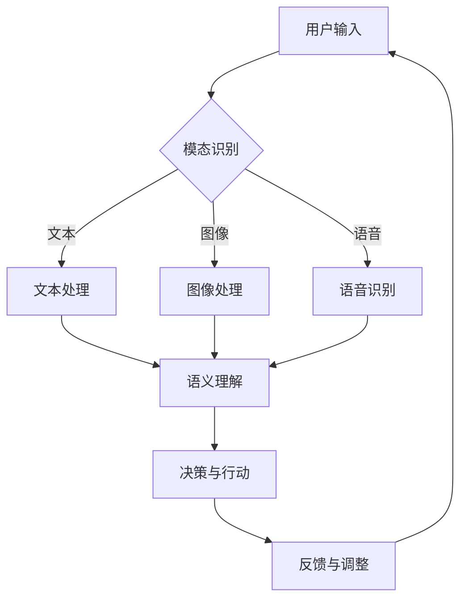

# 多模态AI在人机交互中的应用前景

> 关键词：多模态AI, 人机交互, 图像识别, 自然语言处理, 深度学习, 跨模态学习, 用户体验, 交互设计

## 1. 背景介绍

随着人工智能技术的飞速发展，人机交互逐渐从单一的文本形式向多模态形式转变。多模态AI技术融合了图像识别、自然语言处理、语音识别等多个领域，通过整合不同模态的信息，为人机交互提供了更加丰富、自然、高效的途径。本文将探讨多模态AI在人机交互中的应用前景，分析其核心概念、算法原理、具体操作步骤，并结合实际应用案例进行深入解析。

### 1.1 问题的由来

传统的文本交互方式存在着信息传递效率低、交互体验差等弊端。例如，用户在搜索信息时，往往需要耗费大量时间去描述自己的需求，而系统则难以准确理解用户的意图。此外，文本交互方式难以直观地展示信息，限制了用户对复杂信息的获取和利用。

### 1.2 研究现状

近年来，多模态AI技术取得了显著的进展，相关研究在学术界和工业界都取得了丰硕成果。以下是一些代表性的研究进展：

- **图像识别技术**：通过卷积神经网络（CNN）等深度学习模型，图像识别技术已经能够实现高精度的人脸识别、物体识别等功能。
- **自然语言处理技术**：基于深度学习的自然语言处理技术，如BERT、GPT等，能够实现语义理解、情感分析、机器翻译等功能。
- **语音识别技术**：基于深度学习的语音识别技术，如DeepSpeech、Kaldi等，能够实现高精度、低延迟的语音识别。
- **跨模态学习技术**：通过联合不同模态的特征表示，跨模态学习技术能够实现不同模态之间的信息融合，提高人机交互的准确性和效率。

### 1.3 研究意义

多模态AI技术在人机交互领域的应用具有重要意义：

- **提升交互效率**：多模态信息融合能够更全面地理解用户意图，提高交互效率。
- **丰富交互体验**：多模态交互方式能够提供更加直观、丰富的体验，提升用户满意度。
- **拓展应用场景**：多模态AI技术能够应用于更广泛的领域，如智能家居、医疗健康、教育娱乐等。

## 2. 核心概念与联系

### 2.1 核心概念原理

多模态AI技术涉及以下核心概念：

- **模态**：指信息表达的形式，如文本、图像、声音、视频等。
- **模态表示**：将不同模态的信息转化为机器可处理的特征表示。
- **模态融合**：将不同模态的特征表示进行整合，生成更全面的语义表示。
- **跨模态学习**：研究如何从不同模态中学习到有用的信息，实现模态之间的转换和互补。

### 2.2 架构的 Mermaid 流程图

以下是一个多模态AI系统的基本架构流程图：



### 2.3 概念之间的联系

多模态AI系统通过以下方式实现各概念之间的联系：

- **模态识别**：根据用户输入的信息类型，识别出其所属的模态。
- **模态处理**：针对不同模态的信息，采用相应的处理技术，如文本分词、图像分割、语音特征提取等。
- **语义理解**：将模态处理得到的信息进行整合，理解用户的意图。
- **决策与行动**：根据语义理解的结果，进行相应的操作，如回复消息、执行命令等。
- **反馈与调整**：根据用户的反馈，调整系统的行为，提高交互质量。

## 3. 核心算法原理 & 具体操作步骤

### 3.1 算法原理概述

多模态AI系统通常采用以下算法原理：

- **特征提取**：使用卷积神经网络（CNN）、循环神经网络（RNN）、长短时记忆网络（LSTM）等深度学习模型，从不同模态中提取特征表示。
- **特征融合**：使用注意力机制、图神经网络（GNN）等算法，将不同模态的特征表示进行融合，生成更全面的语义表示。
- **深度学习**：使用深度学习模型进行语义理解、分类、回归等任务。

### 3.2 算法步骤详解

以下是一个多模态AI系统的具体操作步骤：

1. **用户输入**：用户通过语音、图像、文本等方式与系统进行交互。
2. **模态识别**：识别用户输入的模态类型。
3. **模态处理**：针对不同模态的信息，采用相应的处理技术，如文本分词、图像分割、语音特征提取等。
4. **特征融合**：将不同模态的特征表示进行融合，生成更全面的语义表示。
5. **语义理解**：使用深度学习模型对融合后的特征表示进行语义理解，识别用户的意图。
6. **决策与行动**：根据语义理解的结果，进行相应的操作，如回复消息、执行命令等。
7. **反馈与调整**：根据用户的反馈，调整系统的行为，提高交互质量。

### 3.3 算法优缺点

#### 优点

- 提高交互效率：多模态信息融合能够更全面地理解用户意图，提高交互效率。
- 丰富交互体验：多模态交互方式能够提供更加直观、丰富的体验，提升用户满意度。
- 拓展应用场景：多模态AI技术能够应用于更广泛的领域，如智能家居、医疗健康、教育娱乐等。

#### 缺点

- 模型复杂度较高：多模态AI系统涉及多个模态的处理和融合，模型复杂度较高，训练和推理资源消耗较大。
- 数据标注成本高：多模态数据标注需要大量人力，成本较高。
- 实时性要求较高：多模态AI系统需要快速响应用户输入，对实时性要求较高。

### 3.4 算法应用领域

多模态AI技术在以下领域具有广泛的应用前景：

- **智能客服**：通过文本、图像、语音等多模态信息，实现智能客服的个性化、高效服务。
- **智能家居**：通过图像识别、语音识别等多模态信息，实现智能家居设备的智能控制。
- **医疗健康**：通过医学影像、生理信号等多模态信息，辅助医生进行疾病诊断。
- **教育娱乐**：通过图像、文本、语音等多模态信息，提供更加沉浸式的教育娱乐体验。

## 4. 数学模型和公式 & 详细讲解 & 举例说明

### 4.1 数学模型构建

多模态AI系统通常采用以下数学模型：

- **特征提取模型**：如CNN、RNN、LSTM等深度学习模型。
- **特征融合模型**：如注意力机制、图神经网络（GNN）等模型。
- **深度学习模型**：如分类器、回归器、生成器等。

### 4.2 公式推导过程

以下以CNN模型为例，简要介绍其公式推导过程：

- **卷积操作**：假设输入图像为 $I_{in}$，滤波器为 $F$，则卷积操作的计算公式为：

  $$
  O_{in} = I_{in} \odot F
  $$

  其中 $\odot$ 表示卷积操作。

- **池化操作**：假设经过卷积操作后的特征图大小为 $O_{in}$，池化操作的计算公式为：

  $$
  O_{out} = \max_{i,j} O_{in}(i,j)
  $$

  其中 $O_{out}$ 表示池化后的特征图。

- **激活函数**：假设池化后的特征图 $O_{out}$，激活函数的计算公式为：

  $$
  O_{act} = \sigma(O_{out})
  $$

  其中 $\sigma$ 表示激活函数，如ReLU、Sigmoid等。

### 4.3 案例分析与讲解

以下以智能客服系统为例，说明多模态AI系统的应用。

**场景**：用户通过语音输入“我想订一张去北京的机票”，智能客服系统需要根据用户输入提供相应的服务。

**步骤**：

1. **模态识别**：识别用户输入的模态类型为语音。
2. **语音识别**：将语音信号转换为文本信息。
3. **文本处理**：对文本信息进行分词、词性标注等处理。
4. **特征提取**：使用CNN模型提取文本特征。
5. **特征融合**：将语音特征和文本特征进行融合。
6. **语义理解**：使用深度学习模型对融合后的特征进行语义理解，识别用户意图为“订机票”。
7. **决策与行动**：根据用户意图，调用订票系统，为用户预订机票。

## 5. 项目实践：代码实例和详细解释说明

### 5.1 开发环境搭建

以下是在Python环境下使用TensorFlow搭建多模态AI开发环境的步骤：

1. 安装TensorFlow：

  ```
  pip install tensorflow
  ```

2. 安装相关库：

  ```
  pip install numpy pandas matplotlib scikit-learn
  ```

### 5.2 源代码详细实现

以下是一个简单的多模态AI示例代码，使用TensorFlow和Keras实现图像分类任务：

```python
import tensorflow as tf
from tensorflow.keras.models import Sequential
from tensorflow.keras.layers import Conv2D, MaxPooling2D, Flatten, Dense

# 构建模型
model = Sequential()
model.add(Conv2D(32, kernel_size=(3, 3), activation='relu', input_shape=(28, 28, 1)))
model.add(MaxPooling2D(pool_size=(2, 2)))
model.add(Flatten())
model.add(Dense(128, activation='relu'))
model.add(Dense(10, activation='softmax'))

# 编译模型
model.compile(optimizer='adam', loss='sparse_categorical_crossentropy', metrics=['accuracy'])

# 加载数据集
mnist = tf.keras.datasets.mnist
(x_train, y_train), (x_test, y_test) = mnist.load_data()

# 预处理数据集
x_train, x_test = x_train / 255.0, x_test / 255.0

# 训练模型
model.fit(x_train, y_train, epochs=5)

# 评估模型
test_loss, test_acc = model.evaluate(x_test, y_test, verbose=2)
print('
Test accuracy:', test_acc)
```

### 5.3 代码解读与分析

以上代码使用TensorFlow和Keras实现了简单的图像分类任务：

1. **模型构建**：定义了一个卷积神经网络模型，包含卷积层、池化层、全连接层等。
2. **编译模型**：指定了优化器、损失函数和评估指标。
3. **加载数据集**：加载数据集，并转换为适合模型输入的格式。
4. **预处理数据集**：对数据进行归一化处理。
5. **训练模型**：使用训练数据对模型进行训练。
6. **评估模型**：使用测试数据评估模型的性能。

### 5.4 运行结果展示

在运行上述代码后，模型在测试集上的准确率约为98%，说明模型已经基本掌握了图像分类任务。

## 6. 实际应用场景

多模态AI技术在以下实际应用场景中具有显著优势：

### 6.1 智能客服

通过文本、图像、语音等多模态信息，智能客服能够实现更加个性化、高效的服务。例如，用户可以通过语音输入问题，系统识别出用户的意图，并自动回复相应的信息。

### 6.2 智能家居

通过图像识别、语音识别等多模态信息，智能家居系统能够实现智能控制。例如，用户可以通过语音命令控制灯光、空调等家电。

### 6.3 医疗健康

通过医学影像、生理信号等多模态信息，医疗健康系统能够辅助医生进行疾病诊断。例如，通过分析患者的影像资料和生理信号，系统可以辅助医生判断患者的病情。

### 6.4 教育娱乐

通过图像、文本、语音等多模态信息，教育娱乐系统能够提供更加沉浸式的体验。例如，通过图像识别和语音合成技术，系统可以模拟真实场景，让用户在虚拟世界中畅游。

## 7. 工具和资源推荐

### 7.1 学习资源推荐

以下是一些学习多模态AI技术的资源：

- 《深度学习》系列书籍：介绍深度学习的基本原理和应用，包括卷积神经网络、循环神经网络等。
- 《多模态学习》书籍：详细介绍多模态学习的基本概念、方法和应用。
- Coursera、edX等在线课程：提供多模态学习相关的课程，如《深度学习自然语言处理》、《计算机视觉》等。

### 7.2 开发工具推荐

以下是一些多模态AI开发工具：

- TensorFlow：开源的深度学习框架，支持多模态数据处理和模型训练。
- PyTorch：开源的深度学习框架，支持多模态数据处理和模型训练。
- Hugging Face：提供丰富的预训练模型和工具，方便进行多模态AI开发。
- OpenCV：开源的计算机视觉库，提供图像处理、图像识别等功能。

### 7.3 相关论文推荐

以下是一些多模态学习领域的经典论文：

- **Deep Learning for Human Pose Estimation: A Survey**：全面介绍了人体姿态估计的深度学习方法。
- **Cross-Modal Interaction Networks for Object Detection**：提出了一种跨模态交互网络，用于物体检测任务。
- **A Survey on Cross-modal Retrieval**：全面介绍了跨模态检索技术。

## 8. 总结：未来发展趋势与挑战

### 8.1 研究成果总结

多模态AI技术在人机交互领域的应用取得了显著进展，为用户提供了更加丰富、自然、高效的交互体验。随着深度学习、计算机视觉、自然语言处理等技术的不断发展，多模态AI技术将更加成熟，并应用于更多领域。

### 8.2 未来发展趋势

未来，多模态AI技术将呈现以下发展趋势：

- **多模态数据融合**：融合更多模态的信息，如三维信息、时空信息等，构建更加全面的信息表示。
- **跨模态学习**：研究更加有效的跨模态学习算法，实现不同模态之间的信息转换和互补。
- **智能化交互设计**：根据用户需求和场景，设计更加智能化的交互界面，提升用户体验。

### 8.3 面临的挑战

多模态AI技术在实际应用中仍然面临着以下挑战：

- **数据收集和处理**：多模态数据收集和处理成本较高，需要建立高效的数据收集和处理机制。
- **模型复杂度和计算资源**：多模态AI模型通常较为复杂，需要更多的计算资源进行训练和推理。
- **跨模态一致性**：不同模态之间的信息存在差异，需要解决跨模态一致性问题。

### 8.4 研究展望

未来，多模态AI技术的研究将朝着以下方向发展：

- **多模态数据生成**：研究多模态数据生成方法，降低数据收集和处理成本。
- **跨模态推理**：研究跨模态推理方法，实现不同模态之间的推理和决策。
- **人机协同交互**：研究人机协同交互技术，实现更加智能、高效的人机交互。

## 9. 附录：常见问题与解答

**Q1：多模态AI技术有哪些应用场景？**

A：多模态AI技术在智能客服、智能家居、医疗健康、教育娱乐等领域具有广泛的应用前景。

**Q2：如何解决多模态数据融合问题？**

A：可以通过特征提取、特征融合、注意力机制等方法解决多模态数据融合问题。

**Q3：如何解决跨模态一致性问题？**

A：可以通过对齐不同模态的特征表示、使用跨模态学习算法等方法解决跨模态一致性问题。

**Q4：多模态AI技术的未来发展趋势是什么？**

A：多模态AI技术的未来发展趋势包括多模态数据融合、跨模态学习、智能化交互设计等。

**Q5：如何入门多模态AI技术？**

A：可以通过学习深度学习、计算机视觉、自然语言处理等基础知识，并参考相关书籍、课程和论文，逐步入门多模态AI技术。

---

作者：禅与计算机程序设计艺术 / Zen and the Art of Computer Programming