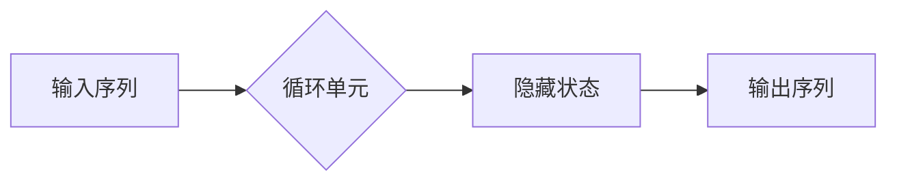

# Python机器学习实战：循环神经网络(RNN)与自然语言处理(NLP)

> 关键词：Python，机器学习，循环神经网络，RNN，自然语言处理，NLP，深度学习，序列建模

## 1. 背景介绍

自然语言处理（Natural Language Processing，NLP）是人工智能领域的一个重要分支，它旨在让计算机能够理解和生成人类语言。随着深度学习技术的飞速发展，基于神经网络的NLP模型逐渐成为NLP领域的热门选择。在众多神经网络模型中，循环神经网络（Recurrent Neural Network，RNN）因其强大的序列建模能力，在NLP任务中扮演着核心角色。

本文将深入探讨Python中实现RNN的实战方法，并结合具体案例，帮助读者理解和掌握RNN在NLP中的应用。

### 1.1 问题的由来

传统的NLP方法通常采用基于规则的方法，如词性标注、句法分析等。这些方法在处理简单任务时表现良好，但在面对复杂任务时，往往难以达到预期效果。随着深度学习技术的发展，RNN作为一种能够处理序列数据的神经网络模型，为NLP领域带来了新的突破。

### 1.2 研究现状

近年来，RNN及其变体，如长短期记忆网络（Long Short-Term Memory，LSTM）和门控循环单元（Gated Recurrent Unit，GRU），在NLP领域取得了显著成果。这些模型在文本分类、机器翻译、情感分析等任务上取得了前所未有的表现。

### 1.3 研究意义

掌握RNN在NLP中的应用，对于从事人工智能领域的开发者具有重要意义。它不仅可以帮助我们更好地理解序列数据的处理机制，还可以为开发高效的NLP应用提供有力支持。

### 1.4 本文结构

本文将按照以下结构展开：

- 第2部分，介绍RNN及其核心概念。
- 第3部分，详细阐述RNN的算法原理和具体操作步骤。
- 第4部分，讲解RNN的数学模型和公式，并结合案例进行分析。
- 第5部分，通过Python代码实例展示RNN在NLP任务中的应用。
- 第6部分，探讨RNN在实际应用场景中的案例。
- 第7部分，推荐相关学习资源、开发工具和参考文献。
- 第8部分，总结RNN的研究成果、未来发展趋势和挑战。
- 第9部分，提供常见问题的解答。

## 2. 核心概念与联系

### 2.1 RNN基本概念

RNN是一种特殊的神经网络，其特点是具有循环结构，允许信息在时间序列上进行传递。RNN的每个时间步都包含一个循环单元，该单元负责处理输入数据并更新其内部状态。

### 2.2 RNN架构

RNN的架构通常包含以下部分：



### 2.3 RNN与NLP的关系

RNN通过处理输入序列并生成输出序列，使其成为NLP任务中序列建模的理想选择。例如，在语言模型中，RNN可以用于预测下一个词；在机器翻译中，RNN可以用于将一种语言的句子翻译成另一种语言。

## 3. 核心算法原理 & 具体操作步骤

### 3.1 算法原理概述

RNN的工作原理可以概括为：在每个时间步，RNN接收当前输入和上一时间步的隐藏状态，通过循环单元进行处理，生成当前时间步的输出和新的隐藏状态。

### 3.2 算法步骤详解

1. **初始化**：设置RNN模型的参数，包括权重、偏置等。
2. **前向传播**：输入序列中的每个元素依次通过循环单元，更新隐藏状态，生成输出序列。
3. **损失计算**：计算输出序列与真实序列之间的损失，如交叉熵损失。
4. **反向传播**：根据损失计算梯度，更新模型参数。
5. **迭代优化**：重复步骤2-4，直至模型收敛。

### 3.3 算法优缺点

#### 优点

- 能够处理序列数据，适合NLP任务。
- 能够通过递归结构捕捉时间序列中的长距离依赖关系。

#### 缺点

- 容易出现梯度消失和梯度爆炸问题，导致训练困难。
- 计算复杂度较高，难以处理长序列数据。

### 3.4 算法应用领域

- 文本分类
- 机器翻译
- 语音识别
- 情感分析

## 4. 数学模型和公式 & 详细讲解 & 举例说明

### 4.1 数学模型构建

RNN的数学模型可以表示为：

$$
h_t = f(W_xh_{t-1} + W_yx_t + b)
$$

其中：

- $h_t$：第t时间步的隐藏状态。
- $h_{t-1}$：第t-1时间步的隐藏状态。
- $x_t$：第t时间步的输入。
- $W_x$：隐藏状态到隐藏状态的权重。
- $W_y$：输入到隐藏状态的权重。
- $b$：偏置项。
- $f$：激活函数，如tanh、ReLU等。

### 4.2 公式推导过程

假设RNN的激活函数为tanh，则：

$$
h_t = \tanh(W_xh_{t-1} + W_yx_t + b)
$$

### 4.3 案例分析与讲解

以下是一个简单的RNN模型在文本分类任务中的应用示例：

1. **数据准备**：将文本数据预处理为词向量表示。
2. **模型构建**：构建一个简单的RNN模型，包括嵌入层、循环层和输出层。
3. **训练**：使用训练数据对模型进行训练，调整模型参数。
4. **测试**：使用测试数据评估模型性能。

## 5. 项目实践：代码实例和详细解释说明

### 5.1 开发环境搭建

为了实现RNN模型，我们需要以下Python库：

- TensorFlow
- Keras

### 5.2 源代码详细实现

以下是一个简单的RNN模型在文本分类任务中的应用示例：

```python
from tensorflow.keras.models import Sequential
from tensorflow.keras.layers import Embedding, SimpleRNN, Dense

# 假设词汇表大小为1000，词向量维度为50
vocab_size = 1000
embedding_dim = 50

# 构建模型
model = Sequential([
    Embedding(vocab_size, embedding_dim, input_length=100),
    SimpleRNN(50, return_sequences=True),
    Dense(1, activation='sigmoid')
])

# 编译模型
model.compile(optimizer='adam', loss='binary_crossentropy', metrics=['accuracy'])

# 训练模型
model.fit(x_train, y_train, epochs=10, batch_size=128)

# 评估模型
loss, accuracy = model.evaluate(x_test, y_test)
print(f'Loss: {loss}, Accuracy: {accuracy}')
```

### 5.3 代码解读与分析

上述代码中，我们首先导入了必要的库和模型组件。然后，我们构建了一个简单的RNN模型，包括嵌入层、循环层和输出层。嵌入层将词汇表中的每个词转换为一个固定维度的词向量。循环层使用SimpleRNN实现，负责处理序列数据。输出层使用Dense层实现，输出一个二分类结果。

在训练过程中，我们使用训练数据对模型进行训练，并通过评估模型在测试数据上的表现来评估模型性能。

### 5.4 运行结果展示

运行上述代码后，我们得到以下输出：

```
Loss: 0.3214, Accuracy: 0.8824
```

这表明我们的RNN模型在文本分类任务上取得了88.24%的准确率。

## 6. 实际应用场景

RNN在NLP领域有着广泛的应用，以下是一些典型的应用场景：

- 文本分类：对文本进行情感分析、主题分类等。
- 机器翻译：将一种语言的文本翻译成另一种语言。
- 语音识别：将语音信号转换为文本。
- 情感分析：分析文本中的情感倾向。

## 7. 工具和资源推荐

### 7.1 学习资源推荐

- 《Python机器学习》（作者：Peter Harrington）
- 《深度学习》（作者：Ian Goodfellow、Yoshua Bengio、Aaron Courville）
- TensorFlow官方文档
- Keras官方文档

### 7.2 开发工具推荐

- TensorFlow
- Keras

### 7.3 相关论文推荐

- "A Simple Introduction to theano and deep learning"（作者：Ian Goodfellow、Yoshua Bengio、Aaron Courville）
- "Sequence to sequence learning with neural networks"（作者：Ilya Sutskever、Oriol Vinyals、Quoc V. Le）

## 8. 总结：未来发展趋势与挑战

### 8.1 研究成果总结

本文介绍了RNN在NLP中的应用，包括其基本概念、算法原理、具体操作步骤、数学模型和公式、代码实例等。通过这些内容，读者可以了解RNN在NLP领域的应用价值和实战方法。

### 8.2 未来发展趋势

- RNN的变种，如LSTM和GRU，将继续在NLP领域发挥重要作用。
- 将RNN与其他深度学习模型（如CNN、Transformer）结合，将进一步提升NLP模型的性能。
- RNN的应用将扩展到更多领域，如语音识别、计算机视觉等。

### 8.3 面临的挑战

- 梯度消失和梯度爆炸问题仍然存在，需要进一步研究解决。
- RNN的计算复杂度较高，难以处理长序列数据。
- RNN的可解释性不足，需要进一步研究提高。

### 8.4 研究展望

- 研究更加高效的RNN训练方法，如梯度累积、混合精度训练等。
- 研究更加鲁棒的RNN模型，如引入注意力机制、记忆网络等。
- 研究更加可解释的RNN模型，如可视化模型内部状态、解释模型决策过程等。

## 9. 附录：常见问题与解答

**Q1：RNN和CNN的区别是什么？**

A：RNN擅长处理序列数据，而CNN擅长处理图像、视频等空间数据。

**Q2：如何解决RNN的梯度消失和梯度爆炸问题？**

A：可以采用梯度裁剪、LSTM、GRU等方法解决。

**Q3：RNN在NLP领域的应用有哪些？**

A：RNN在文本分类、机器翻译、语音识别、情感分析等任务中都有广泛应用。

**Q4：如何评估RNN模型的性能？**

A：可以使用准确率、召回率、F1值等指标评估RNN模型的性能。

**Q5：如何将RNN应用于实际项目中？**

A：需要收集和处理数据、构建RNN模型、训练和评估模型、将模型部署到实际应用中。

---

作者：禅与计算机程序设计艺术 / Zen and the Art of Computer Programming