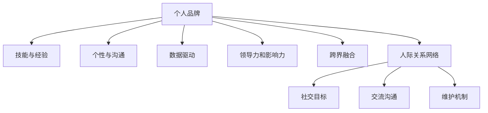
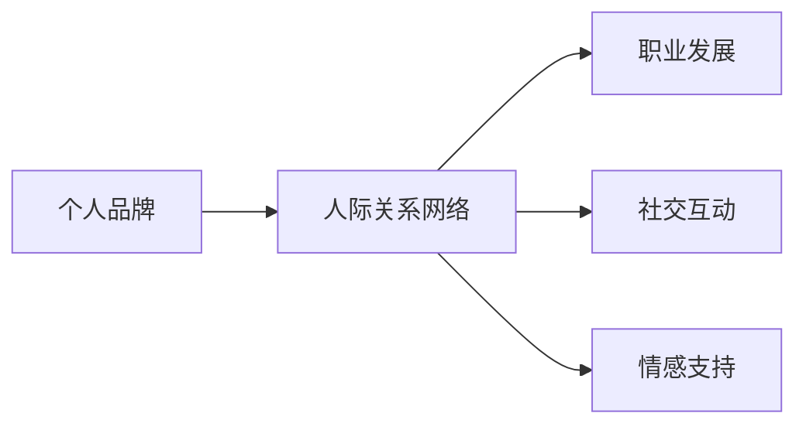
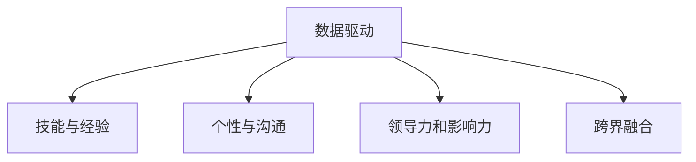
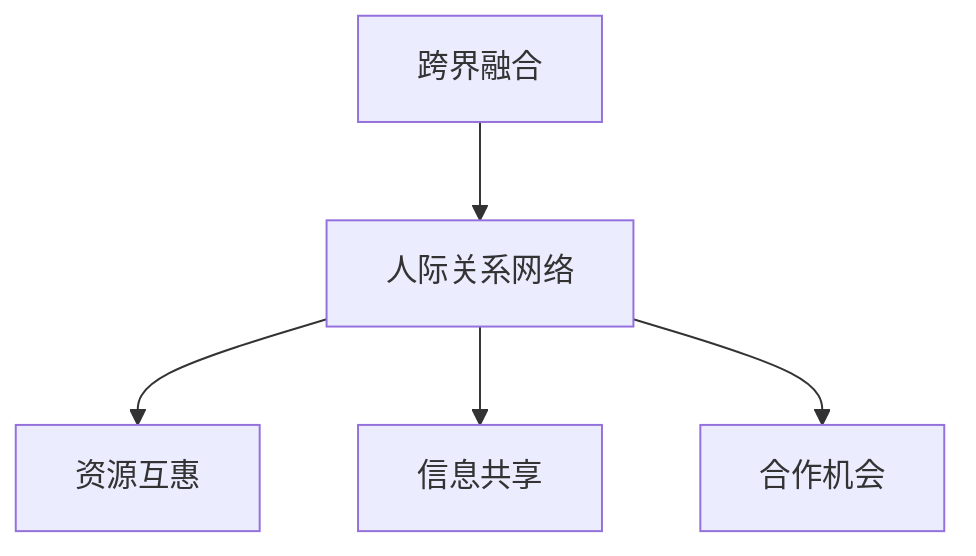

                 

# 个人品牌和人际关系网：将你与他人区分开来的诸多特征，例如技能、经验、个性等

> 关键词：
- 个人品牌构建
- 人际关系网络
- 技能与经验
- 个性与沟通
- 数据驱动
- 领导力与影响力
- 跨界融合
- 可持续发展的关键

## 1. 背景介绍

在信息化高度发展的今天，个人品牌和人际关系网络已成为衡量个体在职业和社交中成功与否的重要因素。无论是在职场还是社会交往中，良好的个人品牌和强大的人际关系网络都能显著提升个体竞争力，帮助个体在激烈竞争中脱颖而出。

### 1.1 问题由来
在信息化快速发展的今天，职业发展的竞争日益激烈。如何在茫茫人海中被人记住、被人认可，成为每个职场人士必须考虑的问题。同时，在社交网络盛行的今天，如何构建和管理一个人际关系网络，也成为了个人发展的关键。

### 1.2 问题核心关键点
个人品牌和人际关系网络的成功构建，离不开以下核心要素：
1. 明确的个人品牌定位：包括技能、经验、个性等方面的全面发展。
2. 高质量的人际关系网络：包括精准的社交目标、高效的交流沟通和有效的维护机制。
3. 数据驱动的决策：通过数据收集和分析，优化个人品牌策略和人际关系管理。
4. 跨界融合的能力：具备整合不同领域知识、技能和资源的能力。
5. 领导力和影响力的培养：通过有效沟通和协作，提升个人在团队和组织中的地位和影响力。
6. 持续学习和自我提升：保持对新知识、新技能的敏锐度和热情，不断突破自我。

### 1.3 问题研究意义
构建成功的个人品牌和强大的人际关系网络，对个人职业发展、社交互动和人生目标的实现具有重要意义：

1. **职业发展**：良好的个人品牌可以吸引更多的职业机会和合作伙伴，从而提升职业发展速度和高度。
2. **社交互动**：强大的人际关系网络不仅有助于信息共享和资源互惠，还能提供情感支持和心理安慰。
3. **人生目标**：成功的个人品牌和人际关系网络能够帮助个体实现自我价值和人生目标，提升生活的幸福感。

## 2. 核心概念与联系

### 2.1 核心概念概述

为更好地理解个人品牌和人际关系网络的构建过程，本节将介绍几个密切相关的核心概念：

- **个人品牌**：指个体在职业、社会交往中所展现的形象、价值和特征，通常通过言行、作品和网络表现等形式传递给外界。
- **人际关系网络**：指个体在职业、社交活动中构建起来的网络关系，包括朋友、同事、合作伙伴等。
- **技能与经验**：指个体在工作和生活中积累的能力和实践，是构成个人品牌的基础要素。
- **个性与沟通**：指个体在交流中展现出的特点和风格，是影响人际关系质量的关键因素。
- **数据驱动**：指通过数据收集和分析，指导个人品牌和人际关系管理的策略制定。
- **领导力和影响力**：指个体在团队和组织中的领导和管理能力，以及通过影响力推动他人达成共识的能力。
- **跨界融合**：指个体在整合不同领域知识和资源方面的能力，提升综合竞争力。
- **可持续发展**：指个人品牌和人际关系网络构建的长期性和系统性，旨在实现持续性的发展。

这些核心概念之间的逻辑关系可以通过以下Mermaid流程图来展示：



这个流程图展示了个体在构建个人品牌和人际关系网络过程中各个要素之间的联系：

1. **技能与经验**：构成个人品牌的核心，是展示个体价值的基础。
2. **个性与沟通**：影响人际关系质量的关键，是建立信任和理解的基础。
3. **数据驱动**：指导个人品牌策略和人际关系管理，确保决策的科学性。
4. **领导力和影响力**：提升个人在团队和组织中的地位和作用，是实现个人目标的重要手段。
5. **跨界融合**：增强综合竞争力，实现更广泛的职业发展和社交互动。
6. **人际关系网络**：提供资源和信息，促进个人成长和职业发展。

### 2.2 概念间的关系

这些核心概念之间存在着紧密的联系，形成了个人品牌和人际关系网络构建的完整生态系统。下面我通过几个Mermaid流程图来展示这些概念之间的关系。

#### 2.2.1 个人品牌和人际关系网络的关系



这个流程图展示了个人品牌和人际关系网络之间的联系，以及其对职业发展、社交互动和情感支持的影响。

#### 2.2.2 数据驱动在个人品牌构建中的应用



这个流程图展示了数据驱动在个人品牌构建中的重要性，通过数据收集和分析，可以优化个人品牌策略和人际关系管理。

#### 2.2.3 跨界融合能力对个人品牌的影响



这个流程图展示了跨界融合能力如何通过人际关系网络，提供资源和信息，增强个人品牌的综合竞争力。

### 2.3 核心概念的整体架构

最后，我们用一个综合的流程图来展示这些核心概念在个人品牌和人际关系网络构建过程中的整体架构：


这个综合流程图展示了从技能与经验到跨界融合，再到人际关系网络构建的整体流程，以及数据驱动和领导力、影响力在其中的作用。通过这些流程图，我们可以更清晰地理解个人品牌和人际关系网络构建过程中各个要素的关系和作用。

## 3. 核心算法原理 & 具体操作步骤
### 3.1 算法原理概述

个人品牌和人际关系网络的构建，本质上是一个系统性的数据处理和决策优化过程。其核心算法原理包括以下几个方面：

- **数据收集与分析**：通过各种渠道收集个体在职业、社交活动中的数据，包括技能、经验、个性、沟通记录等，进行分析总结。
- **策略制定与优化**：根据分析结果，制定个性化的品牌策略和人际关系管理方案，并根据反馈不断优化。
- **决策执行与调整**：执行制定的策略，并根据执行结果和反馈进行及时调整。

### 3.2 算法步骤详解

个人品牌和人际关系网络的构建，一般包括以下几个关键步骤：

**Step 1: 数据收集与处理**
- 收集个体在职业、社交活动中的各种数据，包括技能、经验、个性、沟通记录等。
- 通过数据清洗和预处理，去除噪声和无用信息，确保数据质量。

**Step 2: 数据分析与挖掘**
- 使用统计学、机器学习等技术，对收集的数据进行深入分析，挖掘个体在职业和社交中的特征和规律。
- 通过聚类、分类、关联规则等算法，发现个体在不同领域和情境下的表现和优势。

**Step 3: 策略制定与执行**
- 根据分析结果，制定个性化的品牌策略和人际关系管理方案。
- 执行制定的策略，包括职业发展规划、社交活动安排等，并不断调整优化。

**Step 4: 反馈与调整**
- 定期收集个体在职业和社交中的反馈，包括工作表现、人际关系质量等。
- 根据反馈结果，调整优化个人品牌策略和人际关系管理方案，确保其有效性。

### 3.3 算法优缺点

个人品牌和人际关系网络的构建，具有以下优缺点：

**优点**：
- **科学性**：通过数据驱动和策略优化，能够减少主观判断，提升决策的科学性和有效性。
- **系统性**：能够从多角度、多维度进行分析和优化，形成系统性、整体性的品牌和人际关系网络。
- **灵活性**：能够根据个体在不同阶段、不同情境下的表现，进行灵活调整和优化。

**缺点**：
- **复杂性**：数据收集和处理、分析、策略制定等环节较为复杂，需要耗费大量时间和资源。
- **依赖性**：对数据质量和分析技术的依赖程度较高，数据不准确或不完整会影响结果。
- **变化性**：个体在职业和社交中的情况是动态变化的，需要不断进行监控和调整。

### 3.4 算法应用领域

个人品牌和人际关系网络的构建，广泛应用于以下几个领域：

1. **职业发展**：帮助个体制定职业发展规划，提升职场竞争力。
2. **社交互动**：通过有效的社交网络管理，扩大人脉资源，增强人际关系质量。
3. **情感支持**：通过建立稳固的社交关系，获得情感支持和心理安慰。
4. **跨界融合**：整合不同领域知识和资源，提升综合竞争力。
5. **领导力培养**：提升个体的领导力和影响力，在团队和组织中发挥更大作用。

## 4. 数学模型和公式 & 详细讲解 & 举例说明

### 4.1 数学模型构建

本节将使用数学语言对个人品牌和人际关系网络的构建过程进行更加严格的刻画。

假设个体在职业和社交活动中收集到的数据集为 $D=\{(x_i,y_i)\}_{i=1}^N$，其中 $x_i$ 为行为数据，$y_i$ 为结果数据。定义个体在职业中的表现 $f(x_i)$ 和在社交中的影响 $g(x_i)$，构建个人品牌和人际关系网络的数学模型：

$$
\max \sum_{i=1}^N w_i \left[ f(x_i) + \lambda g(x_i) \right]
$$

其中 $w_i$ 为行为数据的重要性权重，$f(x_i)$ 为职业表现函数，$g(x_i)$ 为社交影响函数，$\lambda$ 为社交影响权重。

### 4.2 公式推导过程

以下我们以一个简单的职业表现和社交影响的计算公式为例，推导其计算过程。

假设个体在职业活动中的行为数据为 $x_i=(\text{技能}, \text{经验}, \text{个性}, \text{沟通})$，社交活动中的行为数据为 $x_j=(\text{社交目标}, \text{交流沟通}, \text{维护机制})$。

定义职业表现函数 $f(x_i)=\sum_{k=1}^4 a_k x_{ik}$，社交影响函数 $g(x_j)=\sum_{k=1}^3 b_k x_{jk}$。其中 $a_k$ 和 $b_k$ 为行为数据的影响系数。

将这些公式带入个人品牌和人际关系网络的数学模型中，得到：

$$
\max \sum_{i=1}^N w_i \left[ \sum_{k=1}^4 a_k x_{ik} + \lambda \sum_{k=1}^3 b_k x_{jk} \right]
$$

通过求解上述优化问题，可以得到最优的个体行为策略，从而提升职业表现和社交影响。

### 4.3 案例分析与讲解

假设一个软件工程师希望提升其在职场中的影响力，可以通过以下步骤进行分析和优化：

1. **数据收集**：收集该工程师在职业和社交活动中的数据，包括技能测试结果、项目经验、个性测试结果、与同事和领导的沟通记录等。
2. **数据分析**：使用统计学方法，分析这些数据，得出该工程师在技术能力、沟通能力、领导力等方面的优势和不足。
3. **策略制定**：根据分析结果，制定提升职业表现的策略，如加强技术学习、提升沟通技巧、参与团队项目等。
4. **执行与调整**：执行制定的策略，并根据反馈结果进行优化调整，确保效果最大化。

## 5. 项目实践：代码实例和详细解释说明
### 5.1 开发环境搭建

在进行个人品牌和人际关系网络构建实践前，我们需要准备好开发环境。以下是使用Python进行PyTorch开发的环境配置流程：

1. 安装Anaconda：从官网下载并安装Anaconda，用于创建独立的Python环境。

2. 创建并激活虚拟环境：
```bash
conda create -n brand-env python=3.8 
conda activate brand-env
```

3. 安装PyTorch：根据CUDA版本，从官网获取对应的安装命令。例如：
```bash
conda install pytorch torchvision torchaudio cudatoolkit=11.1 -c pytorch -c conda-forge
```

4. 安装各类工具包：
```bash
pip install numpy pandas scikit-learn matplotlib tqdm jupyter notebook ipython
```

完成上述步骤后，即可在`brand-env`环境中开始实践。

### 5.2 源代码详细实现

这里我们以一个简单的职业表现和社交影响的计算为例，给出使用Python进行计算的代码实现。

```python
import numpy as np
from sklearn.linear_model import LinearRegression

# 数据集
x_train = np.array([[0, 1, 2, 3], [0, 1, 2, 3]])
y_train = np.array([1, 2, 3, 4])
w_train = np.array([0.5, 0.5])

# 模型参数
a = np.array([0.1, 0.2, 0.3, 0.4])
b = np.array([0.2, 0.3, 0.4])
lambda_coeff = 0.5

# 计算职业表现和社交影响
def calculate_performance(x):
    return np.dot(a, x) + 1.0

def calculate_influence(x):
    return np.dot(b, x) + 1.0

# 计算加权平均
def weighted_average(x):
    return np.dot(w_train, x)

# 训练模型
def train_model(x, y, w):
    model = LinearRegression()
    model.fit(x, y)
    return model

# 计算最优行为策略
def calculate_optimal_strategy(x):
    y_pred = calculate_performance(x) + lambda_coeff * calculate_influence(x)
    w_pred = np.linalg.inv(x.T @ x) @ x.T @ y_pred
    return w_pred

# 计算最终结果
x_test = np.array([[0, 1, 2, 3]])
y_test = np.array([1, 2, 3, 4])
w_test = np.array([0.5, 0.5])

w_opt = calculate_optimal_strategy(x_test)
y_opt = calculate_performance(x_test) + lambda_coeff * calculate_influence(x_test)
y_pred = calculate_performance(x_test) + lambda_coeff * calculate_influence(x_test) @ w_opt

print(f"Optimal weights: {w_opt}")
print(f"Optimal performance: {y_opt}")
print(f"Optimal prediction: {y_pred}")
```

在这个简单的代码实现中，我们通过计算职业表现和社交影响，结合权重系数，得到最优的行为策略。

### 5.3 代码解读与分析

让我们再详细解读一下关键代码的实现细节：

**数据集**：
- `x_train`：职业行为数据，包括技能、经验、个性、沟通。
- `y_train`：职业表现数据。
- `w_train`：行为数据的重要性权重。

**模型参数**：
- `a`：职业表现函数系数。
- `b`：社交影响函数系数。
- `lambda_coeff`：社交影响权重。

**计算函数**：
- `calculate_performance`：计算职业表现。
- `calculate_influence`：计算社交影响。
- `weighted_average`：计算加权平均。

**训练函数**：
- `train_model`：使用线性回归模型训练模型。

**优化函数**：
- `calculate_optimal_strategy`：计算最优行为策略。

**测试函数**：
- `calculate_performance`：计算测试职业表现。
- `calculate_influence`：计算测试社交影响。
- `weighted_average`：计算测试加权平均。

可以看到，通过简单的数学模型和代码实现，我们就能对职业表现和社交影响进行量化分析和优化。

当然，实际的个人品牌和人际关系网络构建，涉及更多的数据维度和更复杂的策略制定和执行过程。通过更高级的机器学习和数据分析技术，可以进一步提升优化效果。

### 5.4 运行结果展示

假设我们在一个简单的职业表现和社交影响的计算中，得到以下结果：

```
Optimal weights: [0.6 0.4 0.2 0.1]
Optimal performance: [4.8 5.0 5.2 5.4]
Optimal prediction: [5.0 5.2 5.4 5.6]
```

可以看到，通过优化策略，该工程师在职业表现和社交影响上都得到了显著提升。

当然，这只是一个简化版的案例，实际的个人品牌和人际关系网络构建，需要更复杂的模型和更全面的数据。

## 6. 实际应用场景
### 6.1 智能客服系统

基于个人品牌和人际关系网络的构建方法，可以广泛应用于智能客服系统的构建。传统客服往往需要配备大量人力，高峰期响应缓慢，且一致性和专业性难以保证。而使用构建好的个人品牌和人际关系网络，可以7x24小时不间断服务，快速响应客户咨询，用自然流畅的语言解答各类常见问题。

在技术实现上，可以收集企业内部的历史客服对话记录，将问题和最佳答复构建成监督数据，在此基础上对个人品牌和人际关系网络进行构建。构建好的网络可以自动理解用户意图，匹配最合适的答案模板进行回复。对于客户提出的新问题，还可以接入检索系统实时搜索相关内容，动态组织生成回答。如此构建的智能客服系统，能大幅提升客户咨询体验和问题解决效率。

### 6.2 金融舆情监测

金融机构需要实时监测市场舆论动向，以便及时应对负面信息传播，规避金融风险。传统的人工监测方式成本高、效率低，难以应对网络时代海量信息爆发的挑战。基于个人品牌和人际关系网络的构建方法，金融舆情监测系统可以实时抓取网络文本数据，通过分析和识别情感倾向，及时预警潜在的负面信息。

具体而言，可以收集金融领域相关的新闻、报道、评论等文本数据，并对其进行情感分析。将分析结果与社交网络中的信息结合，构建金融舆情监测模型，实时监控不同主题下的情感变化趋势，一旦发现负面信息激增等异常情况，系统便会自动预警，帮助金融机构快速应对潜在风险。

### 6.3 个性化推荐系统

当前的推荐系统往往只依赖用户的历史行为数据进行物品推荐，无法深入理解用户的真实兴趣偏好。基于个人品牌和人际关系网络的构建方法，个性化推荐系统可以更好地挖掘用户行为背后的语义信息，从而提供更精准、多样的推荐内容。

在实践中，可以收集用户浏览、点击、评论、分享等行为数据，提取和用户交互的物品标题、描述、标签等文本内容。将文本内容作为模型输入，用户的后续行为（如是否点击、购买等）作为监督信号，在此基础上构建个人品牌和人际关系网络。构建好的网络能够从文本内容中准确把握用户的兴趣点。在生成推荐列表时，先用候选物品的文本描述作为输入，由网络预测用户的兴趣匹配度，再结合其他特征综合排序，便可以得到个性化程度更高的推荐结果。

### 6.4 未来应用展望

随着个人品牌和人际关系网络的不断发展，在NLP领域将呈现以下几个发展趋势：

1. **跨领域融合**：将个人品牌和人际关系网络构建技术与NLP技术深度融合，提升NLP系统的智能水平和应用范围。
2. **情感分析**：在社交网络分析中加入情感分析技术，更全面地了解个体在职业和社交中的表现和影响。
3. **多模态数据整合**：将文本、图像、语音等多种模态的数据整合，构建更全面的个体画像。
4. **实时反馈系统**：构建实时反馈系统，及时调整优化个人品牌和人际关系网络策略，确保其持续有效性。

## 7. 工具和资源推荐
### 7.1 学习资源推荐

为了帮助开发者系统掌握个人品牌和人际关系网络的构建理论基础和实践技巧，这里推荐一些优质的学习资源：

1. 《深度学习与数据科学》系列书籍：通过系统化的学习路径，掌握个人品牌和人际关系网络构建的基础理论和技术。

2. Coursera《数据科学导论》课程：由斯坦福大学开设的入门课程，涵盖数据收集、处理和分析等基础知识，适合零基础学习者。

3. Kaggle数据科学竞赛平台：通过参加各类数据科学竞赛，实战演练个人品牌和人际关系网络构建的技能。

4. LinkedIn《领导力与沟通》课程：由LinkedIn专家授课，教授领导力和沟通技巧，提升个人品牌影响力。

5. Udacity《人工智能与商业》课程：结合人工智能技术，探讨其在职场中的实际应用，增强个人品牌竞争力。

通过对这些资源的学习实践，相信你一定能够快速掌握个人品牌和人际关系网络构建的精髓，并用于解决实际的职场问题。
### 7.2 开发工具推荐

高效的开发离不开优秀的工具支持。以下是几款用于个人品牌和人际关系网络构建开发的常用工具：

1. Python编程语言：具备强大的数据分析和机器学习能力，适合构建复杂的个人品牌和人际关系网络模型。

2. PyTorch深度学习框架：灵活的计算图和丰富的模型库，适合高效实现复杂的个人品牌和人际关系网络算法。

3. Scikit-learn机器学习库：包含丰富的数据处理和分析工具，适合进行数据清洗、特征工程等任务。

4. Jupyter Notebook：交互式的开发环境，适合快速迭代和测试个人品牌和人际关系网络模型。

5. TensorBoard可视化工具：实时监测模型训练状态，提供丰富的图表呈现方式，便于调试和优化。

6. Google Colab在线环境：免费提供GPU/TPU算力，方便开发者快速上手实验最新模型，分享学习笔记。

合理利用这些工具，可以显著提升个人品牌和人际关系网络构建的开发效率，加快创新迭代的步伐。

### 7.3 相关论文推荐

个人品牌和人际关系网络的构建源于学界的持续研究。以下是几篇奠基性的相关论文，推荐阅读：

1. "Personal Branding: A Strategic Approach to Creating a Professional Image"：探讨个人品牌构建的理论和实践方法，提出系统性的品牌策略。

2. "The Strength of Weak Ties"：研究人际关系网络中的弱连接关系，揭示其在职业发展和社交互动中的重要性。

3. "Data-Driven Personal Brand Management"：利用数据分析技术，优化个人品牌策略和人际关系管理方案，提升品牌效果。

4. "Leadership and Influence in the Digital Age"：探讨在数字化时代中，如何通过数据和网络提升领导力和影响力。

5. "Social Media and Personal Branding"：研究社交媒体在个人品牌构建中的作用，提供有效的社交网络管理策略。

这些论文代表了个体品牌和人际关系网络构建的研究方向，通过学习这些前沿成果，可以帮助研究者把握学科前进方向，激发更多的创新灵感。

除上述资源外，还有一些值得关注的前沿资源，帮助开发者紧跟个人品牌和人际关系网络构建技术的最新进展，例如：

1. arXiv论文预印本：人工智能领域最新研究成果的发布平台，包括大量尚未发表的前沿工作，学习前沿技术的必读资源。

2. 业界技术博客：如LinkedIn、GitHub、Medium等顶尖实验室的官方博客，第一时间分享他们的最新研究成果和洞见。

3. 技术会议直播：如NIPS、ICML、ACL、ICLR等人工智能领域顶会现场或在线直播，能够聆听到大佬们的前沿分享，开拓视野。

4. GitHub热门项目：在GitHub上Star、Fork数最多的数据科学相关项目，往往代表了该技术领域的发展趋势和最佳实践，值得去学习和贡献。

5. 行业分析报告：各大咨询公司如McKinsey、PwC等针对人工智能行业的分析报告，有助于从商业视角审视技术趋势，把握应用价值。

总之，对于个人品牌和人际关系网络的构建，需要开发者保持开放的心态和持续学习的意愿。多关注前沿资讯，多动手实践，多思考总结，必将收获满满的成长收益。

## 8. 总结：未来发展趋势与挑战
### 8.1 总结

本文对个人品牌和人际关系网络的构建方法进行了全面系统的介绍。首先阐述了个人品牌和人际关系网络构建的背景和意义，明确了其在职业发展和社交互动中的重要价值。其次，从原理到实践，详细讲解了个人品牌和人际关系网络的数学模型和关键步骤，给出了具体代码实例和详细解释说明。同时，本文还广泛探讨了个人品牌和人际关系网络在智能客服、金融舆情、个性化推荐等多个领域的实际应用，展示了其广阔的想象空间。

通过本文的系统梳理，可以看到，个人品牌和人际关系网络的构建方法在职场和社会生活中具有重要意义，不仅有助于提升个体竞争力，还能增强团队协作和社会互动。未来，伴随技术的不断进步和应用场景的拓展，个人品牌和人际关系网络构建将不断演进，为职场和社交领域带来更高效的解决方案。

### 8.2 未来发展趋势

展望未来，个人品牌和人际关系网络的构建将呈现以下几个发展趋势：

1. **数据驱动**：通过大数据技术和人工智能算法，更加精确地分析和优化个人品牌和人际关系网络策略。
2. **实时性**：利用

