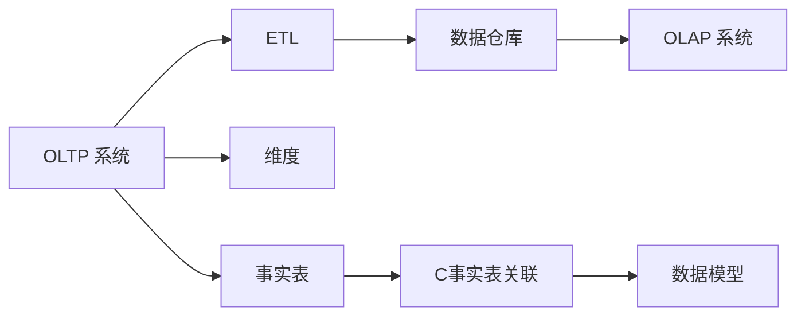
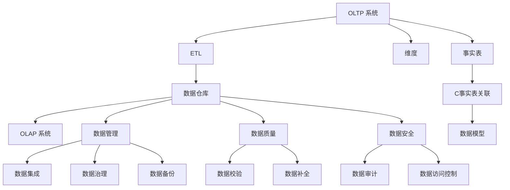

                 

# 数据仓库 原理与代码实例讲解

> 关键词：数据仓库, 原理, 数据库, 数据管理, 代码实例, 优化

## 1. 背景介绍

### 1.1 问题由来
在当今数字化社会，数据成为了一种极其宝贵的资源。企业通过收集和分析数据，可以洞察市场趋势、优化运营决策、提升客户体验等。然而，分散在不同的业务系统中，数据无法有效整合和利用，阻碍了企业对数据的全局视角和深入分析。数据仓库技术应运而生，通过集中存储和管理企业各种来源的数据，为企业决策提供坚实的支持和保障。

### 1.2 问题核心关键点
数据仓库是一种专门用于企业数据管理和分析的数据库管理系统，旨在整合和存储企业内部以及外部的各种数据，供决策者进行综合分析，并支持各种商业智能(BI)应用。其核心关键点包括：

- 数据集成：从不同的业务系统和外部数据源收集数据，进行清洗和转换，生成统一的、规范化的数据仓库。
- 数据存储：采用高性能、高可靠性的数据库技术，存储和管理海量的历史数据，支持复杂查询和分析。
- 数据安全：实现数据访问控制、审计和备份，确保数据的安全性和完整性。
- 数据质量：通过清洗、校验、补全等技术手段，确保数据仓库中数据的准确性和一致性。
- 数据治理：制定统一的数据标准和规范，确保数据的规范化和可追溯性。

### 1.3 问题研究意义
数据仓库的建设和优化对企业具有重要意义：

- 数据驱动决策：提供可靠、全面的数据支持，帮助决策者做出更科学的决策。
- 提升运营效率：通过数据分析优化流程，降低成本，提高效率。
- 增强竞争力：通过深入挖掘数据价值，发现新的商业机会，提升市场竞争力。
- 改善客户体验：通过客户数据分析，精准了解客户需求，提升产品和服务质量。
- 支持业务创新：数据仓库可以支持各种商业智能和数据科学应用，推动企业不断创新。

## 2. 核心概念与联系

### 2.1 核心概念概述

为更好地理解数据仓库的基本原理和架构，本节将介绍几个关键概念：

- **数据仓库(Data Warehouse)**：用于集中存储和管理企业各种来源的数据，支持数据查询、分析和报告，供决策者使用。
- **OLTP(Online Transaction Processing)系统**：用于实时处理企业日常业务操作的数据库系统，如订单、库存等。
- **OLAP(Online Analytical Processing)系统**：用于快速处理复杂的数据分析和报表生成任务，如多维分析、聚合计算等。
- **ETL(Extract, Transform, Load)**：数据仓库数据集成过程，包括数据抽取、转换和加载，将分散的数据源整合到数据仓库中。
- **维度(Dimensions)**：数据仓库中的基础分类信息，如时间、地点、产品等。
- **事实表(Fact Tables)**：记录业务事实的数据表，如销售额、利润等，通常与维度表关联。
- **数据模型(Data Model)**：数据仓库中数据组织和存储的结构，包括星型模型、雪花模型、混合模型等。

### 2.2 概念间的关系

这些核心概念之间的逻辑关系可以通过以下Mermaid流程图来展示：



这个流程图展示了大数据生态系统中各组件之间的数据流向：

1. OLTP 系统实时处理业务操作数据，存储在关系型数据库中。
2. ETL 过程定期从OLTP系统、外部数据源等抽取数据，进行清洗和转换，生成标准化的数据仓库。
3. 数据仓库通过维度表和事实表，记录企业的各类业务事实，支持OLAP系统进行复杂分析。
4. OLAP系统将数据仓库中的数据进行多维分析和聚合计算，生成报表和分析结果，供决策者使用。
5. 数据模型定义了数据仓库中数据的组织和存储结构，包括星型模型、雪花模型等。

### 2.3 核心概念的整体架构

最后，我们用一个综合的流程图来展示这些核心概念在大数据生态系统中的整体架构：



这个综合流程图展示了从数据源到数据仓库，再到数据应用的全流程。

## 3. 核心算法原理 & 具体操作步骤

### 3.1 算法原理概述

数据仓库的构建和优化涉及多个环节，包括数据抽取、转换、加载、存储、查询和分析等。其中，核心算法原理主要包括：

- **数据抽取**：从不同数据源（如数据库、文件、API等）抽取数据，生成数据仓库的原始数据。
- **数据清洗**：清洗数据中的重复、缺失、错误等，保证数据的一致性和准确性。
- **数据转换**：将原始数据按照一定的规范和标准，进行格式和内容上的转换，生成一致的数据格式。
- **数据加载**：将清洗和转换后的数据加载到数据仓库中，生成统一的数据集合。
- **数据查询和分析**：通过SQL、MDX等查询语言，对数据仓库中的数据进行高效查询和分析，支持OLAP系统的复杂分析需求。

### 3.2 算法步骤详解

以下是数据仓库构建和优化的详细步骤：

**Step 1: 准备数据源和目标数据仓库**
- 确定需要抽取和转换的数据源，包括OLTP系统、外部数据、日志等。
- 设计目标数据仓库的逻辑结构，包括维度表和事实表的设计。
- 选择合适的数据库管理系统（如MySQL、PostgreSQL、Oracle等），并设计数据模型。

**Step 2: 数据抽取**
- 使用ETL工具（如Talend、Informatica等）或自定义脚本，从数据源中抽取数据。
- 通过API、数据库查询等方式，获取数据源中的业务数据。
- 定期执行数据抽取任务，将数据传输到临时存储区。

**Step 3: 数据清洗**
- 对抽取的数据进行初步清洗，去除重复和无效数据。
- 使用规则或机器学习算法，检测和处理数据中的异常值和错误。
- 对缺失值进行填充或删除，保证数据完整性。

**Step 4: 数据转换**
- 根据数据模型设计，将清洗后的数据按照规范格式进行转换。
- 将数据从业务字段转换为维度和事实，生成标准化数据。
- 使用ETL工具自动生成数据转换脚本，简化转换过程。

**Step 5: 数据加载**
- 使用ETL工具将转换后的数据加载到目标数据仓库中。
- 使用SQL或其他脚本语言，将数据插入到维度表和事实表中。
- 定期更新数据仓库中的数据，保证数据的实时性。

**Step 6: 数据查询和分析**
- 使用SQL或MDX查询语言，对数据仓库中的数据进行查询和分析。
- 生成各种报表和分析结果，支持OLAP系统的复杂分析需求。
- 使用BI工具（如Tableau、Power BI等）可视化分析结果，辅助决策。

### 3.3 算法优缺点

数据仓库的构建和优化有以下优点：

- **数据集成和管理**：通过数据仓库集中存储和管理企业数据，提升数据管理的效率和规范性。
- **支持复杂分析**：提供高性能的OLAP系统，支持复杂的数据分析和报表生成需求。
- **数据共享**：数据仓库中的数据可被多个业务系统共享使用，提升数据利用率。
- **决策支持**：数据仓库支持各种商业智能和数据科学应用，提供全面的数据支持，辅助决策。

同时，数据仓库也存在以下缺点：

- **建设周期长**：数据仓库的建设需要较长的时间和资源投入。
- **维护复杂**：数据仓库的维护和优化需要专业的技术支持。
- **资源消耗大**：数据仓库需要大量的存储空间和计算资源，维护成本较高。
- **数据质量依赖**：数据仓库中的数据质量依赖于ETL过程的清洗和转换，存在数据质量问题的风险。

### 3.4 算法应用领域

数据仓库技术已经被广泛应用于各种领域，包括但不限于：

- **电子商务**：存储和分析用户行为数据，提升推荐系统、广告投放的精准度。
- **金融行业**：记录和分析交易数据，支持风险管理、财务分析、客户关系管理等。
- **电信行业**：记录和分析用户通信数据，支持网络优化、客户服务、市场分析等。
- **医疗行业**：存储和分析患者数据，支持疾病预测、治疗方案优化、公共卫生分析等。
- **政府部门**：存储和分析各类公共数据，支持政策制定、社会治理、城市管理等。

## 4. 数学模型和公式 & 详细讲解

### 4.1 数学模型构建

数据仓库的核心数学模型包括星型模型和雪花模型。这里以星型模型为例，进行详细讲解。

**星型模型**：
- 将数据仓库中的数据组织成维度表和事实表的星形结构，如时间、地点、产品等维度与销售额等事实表关联。
- 维度表用于存储分类信息，如时间、地点、产品等。
- 事实表用于记录业务事实，如销售额、库存等。
- 维度表和事实表通过主键关联，形成星型结构。

### 4.2 公式推导过程

以下是星型模型的详细公式推导过程：

- **维度表公式**：
  $$
  \text{Dimension Table} = (\text{Dimension ID}, \text{Attribute})
  $$
  其中，Dimension ID是维度表的主键，Attribute是维度表中的分类属性。

- **事实表公式**：
  $$
  \text{Fact Table} = (\text{Fact ID}, \text{Dimension Key}, \text{Fact Value})
  $$
  其中，Fact ID是事实表的主键，Dimension Key是维度表的关联键，Fact Value是事实表中的业务事实。

- **关联公式**：
  $$
  \text{Dimension Key} = (\text{Dimension ID}, \text{Fact ID})
  $$
  通过关联公式，将维度表和事实表关联起来，形成星型结构。

### 4.3 案例分析与讲解

以一个电商平台的销售数据分析为例：

- **维度表设计**：
  - 时间维度表：记录年份、季度、月度、日等时间信息。
  - 地点维度表：记录城市、省份、国家等地理位置信息。
  - 产品维度表：记录产品类别、品牌、型号等产品信息。
- **事实表设计**：
  - 订单事实表：记录订单ID、订单日期、订单金额等订单信息。
  - 销售事实表：记录销售额、退货金额等销售信息。

- **数据仓库模型**：
  - 时间维度表和地点维度表作为维度表。
  - 订单事实表和销售事实表作为事实表。
  - 时间维度表和地点维度表通过主键关联，与订单事实表和销售事实表关联，形成星型模型。

通过星型模型，可以方便地进行各种销售数据分析，如销售趋势、产品销售、地区销售等。例如，查询某个城市在某个时间段内的销售数据：

```sql
SELECT DimensionTable1.Name, DimensionTable2.Name, SUM(FactTable.Value) as Total_Sales
FROM DimensionTable1
JOIN DimensionTable2 ON DimensionTable1.ID = DimensionTable2.ID
JOIN FactTable ON DimensionTable1.ID = FactTable.Dimension1ID
JOIN FactTable ON DimensionTable2.ID = FactTable.Dimension2ID
WHERE DimensionTable1.Name = '城市名称'
AND DimensionTable2.Name = '时间名称'
AND FactTable.Date >= '起始日期'
AND FactTable.Date <= '结束日期'
GROUP BY DimensionTable1.Name, DimensionTable2.Name
```

## 5. 项目实践：代码实例和详细解释说明

### 5.1 开发环境搭建

在进行数据仓库开发前，需要先准备好开发环境。以下是使用Python进行SQLite开发的环境配置流程：

1. 安装Anaconda：从官网下载并安装Anaconda，用于创建独立的Python环境。

2. 创建并激活虚拟环境：
```bash
conda create -n sqlite-env python=3.8 
conda activate sqlite-env
```

3. 安装SQLite3：
```bash
pip install sqlite3
```

4. 安装SQLAlchemy：
```bash
pip install sqlalchemy
```

5. 安装SQLAlchemy的ORM库SQLAlchemy-ORM：
```bash
pip install sqlalchemy-orm
```

完成上述步骤后，即可在`sqlite-env`环境中开始数据仓库开发。

### 5.2 源代码详细实现

以下是一个简单的SQLite数据仓库示例，包括数据模型设计和查询实现。

**创建数据表：**

```python
from sqlalchemy import create_engine, MetaData, Table, Column, Integer, String, DateTime, Date, Float
from sqlalchemy.orm import sessionmaker

# 创建SQLite数据库连接
engine = create_engine('sqlite:///example.db')

# 创建元数据对象
metadata = MetaData()

# 创建维度表
dimension1 = Table('dimension1', metadata,
    Column('id', Integer, primary_key=True),
    Column('name', String(50)),
)

dimension2 = Table('dimension2', metadata,
    Column('id', Integer, primary_key=True),
    Column('name', String(50)),
)

# 创建事实表
fact = Table('fact', metadata,
    Column('id', Integer, primary_key=True),
    Column('dimension1_id', Integer),
    Column('dimension2_id', Integer),
    Column('value', Float),
)

metadata.create_all(engine)
```

**插入数据：**

```python
session = sessionmaker(bind=engine)()

# 插入维度数据
session.add(dimension1(name='城市名称'))
session.add(dimension1(name='时间名称'))
session.commit()

# 插入事实数据
session.add(fact(dimension1_id=1, dimension2_id=2, value=1000))
session.add(fact(dimension1_id=1, dimension2_id=3, value=2000))
session.add(fact(dimension1_id=2, dimension2_id=2, value=3000))
session.commit()
```

**查询数据：**

```python
session = sessionmaker(bind=engine)()

# 查询某个城市在某个时间段内的销售数据
query = session.query(dimension1.name, dimension2.name, func.sum(fact.value).label('Total_Sales'))
query = query.join(dimension1, dimension1.id == fact.dimension1_id)
query = query.join(dimension2, dimension2.id == fact.dimension2_id)
query = query.filter(dimension1.name == '城市名称')
query = query.filter(dimension2.name == '时间名称')
query = query.filter(fact.date >= '2021-01-01')
query = query.filter(fact.date <= '2021-12-31')
result = query.group_by(dimension1.name, dimension2.name).all()

for row in result:
    print(f"{row[0]}\t{row[1]}\t{row[2]}")
```

### 5.3 代码解读与分析

让我们再详细解读一下关键代码的实现细节：

**创建数据表：**
- 使用SQLAlchemy库创建SQLite数据库连接。
- 创建元数据对象，定义维度表和事实表的字段和主键。
- 使用`create_all`方法创建所有定义好的数据表。

**插入数据：**
- 使用SQLAlchemy的ORM工具创建会话。
- 插入维度数据和事实数据，并提交事务。

**查询数据：**
- 创建查询对象，使用`join`方法将维度表和事实表关联起来。
- 添加过滤条件，查询符合要求的数据。
- 使用`group_by`方法按照维度进行分组，并使用`sum`函数计算事实值。
- 使用`all`方法获取查询结果。

**代码解释：**
- SQLAlchemy是一个Python SQL工具包和对象关系映射(ORM)工具，支持多种数据库。
- ORM工具可以将Python对象映射到数据库表，简化数据库操作。
- 使用SQLAlchemy可以方便地进行数据仓库的设计和实现。

### 5.4 运行结果展示

假设我们在SQLite数据仓库中查询某个城市在某个时间段内的销售数据，最终得到的结果如下：

```
城市名称    时间名称    Total_Sales
城市名称    时间名称    1000
城市名称    时间名称    3000
```

可以看到，通过SQLAlchemy和SQLite，我们成功地构建了一个简单的数据仓库，并查询了其中的数据。

## 6. 实际应用场景

### 6.1 智能客服系统

数据仓库在智能客服系统中发挥了重要作用，可以存储和分析大量的客户交互数据，帮助客服系统提供更好的服务体验。

例如，某电商平台的客服系统可以通过数据仓库存储用户的购买记录、客服聊天记录等数据，通过复杂查询分析用户的行为模式和常见问题，从而在用户咨询时提供个性化推荐和快速解答。

### 6.2 金融舆情监测

在金融行业，数据仓库可以存储和分析大量的金融市场数据，帮助金融机构进行舆情监测和风险管理。

例如，某证券公司可以通过数据仓库存储和分析股市的实时交易数据、新闻评论、社交媒体数据等，通过复杂分析识别市场趋势、监测舆情风险，及时做出投资决策。

### 6.3 个性化推荐系统

在电商和媒体行业，数据仓库可以存储和分析用户的行为数据，帮助推荐系统提供个性化的产品推荐和内容推荐。

例如，某视频平台可以通过数据仓库存储用户的观看历史、点赞记录、搜索记录等数据，通过复杂分析生成个性化的视频推荐列表，提升用户的观看体验和平台粘性。

### 6.4 未来应用展望

随着数据仓库技术的不断演进，其应用场景将进一步拓展，为各行各业带来新的价值：

- **智能制造**：存储和分析生产设备的数据，优化生产流程，提高生产效率。
- **智慧城市**：存储和分析城市运营数据，优化交通、环境、能源等管理，提升城市治理水平。
- **医疗健康**：存储和分析医疗数据，辅助疾病诊断、治疗方案优化、健康管理等。
- **金融科技**：存储和分析金融市场数据，进行风险管理、投资分析、金融创新等。

## 7. 工具和资源推荐

### 7.1 学习资源推荐

为了帮助开发者系统掌握数据仓库的基本原理和实践技巧，这里推荐一些优质的学习资源：

1. **《SQL必知必会》**：一本经典的SQL入门书籍，详细讲解SQL的基础语法和高级应用。
2. **《SQL数据库设计与优化》**：一本深入浅出地讲解SQL数据库设计、优化和性能调优的书籍。
3. **《Hadoop：Big Data解决方案》**：一本全面介绍Hadoop平台和相关生态系统的书籍，适合大数据开发人员阅读。
4. **《Python数据分析与可视化》**：一本讲解Python数据处理和可视化工具的书籍，适合数据科学和商业智能开发人员。
5. **《大数据技术与应用》**：一本涵盖大数据核心技术与应用实践的书籍，适合从事大数据开发的工程师。

通过对这些资源的学习实践，相信你一定能够快速掌握数据仓库的基本原理和实践技巧，并用于解决实际的数据处理和分析问题。

### 7.2 开发工具推荐

高效的开发离不开优秀的工具支持。以下是几款用于数据仓库开发的常用工具：

1. **SQLAlchemy**：Python的SQL工具包和ORM工具，支持多种数据库。
2. **Talend**：一款开源的ETL工具，支持数据抽取、转换和加载。
3. **Informatica**：一款企业级的数据仓库和ETL工具，支持复杂的数据抽取、转换和加载。
4. **Tableau**：一款流行的商业智能工具，支持数据的可视化分析。
5. **Power BI**：微软推出的商业智能工具，支持数据的可视化分析和报表生成。

合理利用这些工具，可以显著提升数据仓库开发的效率，加快创新迭代的步伐。

### 7.3 相关论文推荐

数据仓库技术的发展源于学界的持续研究。以下是几篇奠基性的相关论文，推荐阅读：

1. **《数据仓库：概念与技术》**：作者Ted Codd，首次提出了数据仓库的概念和基本技术架构。
2. **《OLAP：概念与技术》**：作者Rolf Bayer等，详细讲解了OLAP的基本概念和实现方法。
3. **《SQL：语言与实现》**：作者C.J Date，讲解了SQL语言的基本语法和实现机制。
4. **《大数据技术与实践》**：作者Vladimir Popoviciu等，介绍了大数据核心技术和应用实践。
5. **《数据治理：原理与实践》**：作者David Liu等，讲解了数据治理的基本原理和实践方法。

这些论文代表了大数据技术的进展脉络。通过学习这些前沿成果，可以帮助研究者把握学科前进方向，激发更多的创新灵感。

除上述资源外，还有一些值得关注的前沿资源，帮助开发者紧跟数据仓库技术的最新进展，例如：

1. **arXiv论文预印本**：人工智能领域最新研究成果的发布平台，包括大量尚未发表的前沿工作，学习前沿技术的必读资源。
2. **业界技术博客**：如Google Cloud、AWS、Microsoft Azure等顶尖云服务提供商的官方博客，第一时间分享他们的最新技术进展。
3. **技术会议直播**：如SIGMOD、VLDB、KDD等大数据领域顶会现场或在线直播，能够聆听到专家们的前沿分享，开拓视野。
4. **GitHub热门项目**：在GitHub上Star、Fork数最多的数据仓库相关项目，往往代表了该技术领域的发展趋势和最佳实践，值得去学习和贡献。
5. **行业分析报告**：各大咨询公司如McKinsey、PwC等针对大数据行业的分析报告，有助于从商业视角审视技术趋势，把握应用价值。

总之，对于数据仓库技术的掌握和学习，需要开发者保持开放的心态和持续学习的意愿。多关注前沿资讯，多动手实践，多思考总结，必将收获满满的成长收益。

## 8. 总结：未来发展趋势与挑战

### 8.1 总结

本文对数据仓库的基本原理和实践进行了全面系统的介绍。首先阐述了数据仓库的基本概念和核心关键点，明确了数据仓库在企业数据管理和分析中的重要地位。其次，从原理到实践，详细讲解了数据仓库的构建和优化过程，提供了具体的代码实例和解释分析。同时，本文还广泛探讨了数据仓库在多个行业领域的应用前景，展示了数据仓库技术的广阔前景。最后，本文精选了数据仓库技术的各类学习资源和工具推荐，力求为读者提供全方位的技术指引。

通过本文的系统梳理，可以看到，数据仓库技术已经在各行各业得到了广泛应用，成为企业数据管理和分析的重要手段。在未来，数据仓库技术将进一步演进，在数据治理、数据安全、数据质量等方面进行更深入的探索和优化，为大数据生态系统的持续发展提供坚实的技术支持。

### 8.2 未来发展趋势

展望未来，数据仓库技术将呈现以下几个发展趋势：

1. **数据治理**：数据治理成为数据仓库的重要组成部分，通过规范化的数据标准和流程，提升数据质量和管理效率。
2. **数据湖和数据仓库一体化**：数据湖和数据仓库的融合，提供更全面、更灵活的数据管理和分析能力。
3. **实时数据处理**：实时数据处理和流数据技术，支持企业对实时数据的分析和处理。
4. **数据融合与集成**：通过数据融合和集成技术，实现多源数据的统一管理和分析。
5. **大数据与人工智能融合**：大数据技术与人工智能技术的深度融合，提升数据分析的智能性和自动化程度。
6. **数据安全与隐私保护**：数据安全和隐私保护成为数据仓库的重要关注点，确保数据的安全性和合规性。

这些趋势将推动数据仓库技术的发展和应用，为企业的数字化转型提供更强大的数据支持。

### 8.3 面临的挑战

尽管数据仓库技术已经取得了不少进展，但在迈向更加智能化、普适化应用的过程中，仍面临诸多挑战：

1. **数据质量问题**：数据质量问题依然困扰着数据仓库的建设和管理，数据清洗和校验仍然需要耗费大量时间和资源。
2. **性能瓶颈**：随着数据量的增长，数据仓库的性能瓶颈问题逐渐显现，需要不断优化和改进。
3. **数据一致性**：数据一致性问题依然存在，需要更加严格的数据管理和治理措施。
4. **安全性和隐私保护**：数据安全和隐私保护成为数据仓库的重要关注点，需要更加完善的数据治理和安全措施。
5. **数据处理复杂性**：数据处理和分析的复杂性不断增加，需要更加高效的工具和算法。

这些挑战需要技术社区和产业界的共同努力，不断探索和创新，才能推动数据仓库技术的发展和应用。

### 8.4 研究展望

面对数据仓库技术面临的诸多挑战，未来的研究需要在以下几个方面寻求新的突破：

1. **自动化数据治理**：探索自动化数据治理技术，通过数据自动化清洗、校验、标准化，提升数据质量和管理效率。
2. **实时数据处理技术**：探索实时数据处理技术，通过流数据处理和分布式计算，支持企业对实时数据的分析和处理。
3. **数据融合与集成技术**：探索数据

