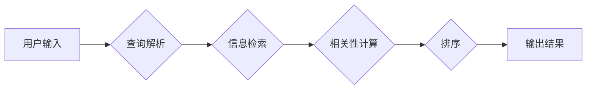

# 传统搜索推荐系统的匹配技术

> 关键词：搜索推荐系统，匹配算法，相似度计算，协同过滤，内容推荐，基于模型的推荐，搜索排序，相关性

## 1. 背景介绍

随着互联网的快速发展，搜索推荐系统已经成为人们日常生活中不可或缺的一部分。从电子商务平台的商品推荐，到社交媒体的个性化内容推送，再到信息检索引擎的结果排序，搜索推荐系统在提高用户体验、增加用户粘性、促进商业价值等方面发挥着至关重要的作用。本文将深入探讨传统搜索推荐系统的匹配技术，分析其核心原理、算法实现和应用场景。

### 1.1 问题的由来

搜索推荐系统旨在为用户提供与用户兴趣和需求相关的信息或商品。为了实现这一目标，系统需要解决两个核心问题：

1. **信息检索**：如何从海量的信息中快速找到与用户查询最相关的结果。
2. **内容推荐**：如何根据用户的兴趣和偏好，从所有可用内容中推荐出最符合其需求的项。

匹配技术是解决上述问题的核心，它决定了推荐系统的质量和用户体验。

### 1.2 研究现状

匹配技术经历了从传统方法到现代算法的不断演进。传统方法主要包括基于内容的匹配和基于协同过滤的匹配。现代算法则越来越多地结合深度学习等技术，实现更智能的推荐。

### 1.3 研究意义

研究匹配技术对于提升搜索推荐系统的性能至关重要。通过优化匹配算法，可以提高推荐系统的精准度、召回率和用户体验，进而推动相关产业的健康发展。

### 1.4 本文结构

本文将按照以下结构进行阐述：

- 第2章介绍匹配技术涉及的核心概念。
- 第3章详细讲解核心算法原理和具体操作步骤。
- 第4章分析匹配技术的数学模型和公式。
- 第5章给出匹配技术的代码实例和详细解释。
- 第6章探讨匹配技术的实际应用场景。
- 第7章展望匹配技术的未来发展趋势和挑战。
- 第8章总结全文，并提出研究展望。

## 2. 核心概念与联系

### 2.1 核心概念

以下是匹配技术中的核心概念：

- **相似度计算**：衡量两个对象相似程度的度量。
- **协同过滤**：基于用户或物品的相似度进行推荐。
- **内容推荐**：根据用户或物品的属性进行推荐。
- **搜索排序**：根据相关性对搜索结果进行排序。
- **相关性**：衡量信息或商品与用户查询或兴趣的相关程度。

### 2.2 架构流程图

匹配技术的架构流程如下所示：



## 3. 核心算法原理 & 具体操作步骤

### 3.1 算法原理概述

匹配技术主要包括以下两种原理：

- **基于内容的匹配**：根据用户查询或物品的属性，计算它们之间的相似度，然后推荐相似度最高的结果。
- **基于协同过滤的匹配**：根据用户或物品的相似性，推荐与用户或物品相似的其他用户或物品。

### 3.2 算法步骤详解

#### 3.2.1 基于内容的匹配

1. 提取用户查询或物品的属性。
2. 计算用户查询或物品与所有候选结果之间的相似度。
3. 根据相似度对候选结果进行排序。
4. 推荐排序后的结果。

#### 3.2.2 基于协同过滤的匹配

1. 构建用户-物品评分矩阵。
2. 计算用户或物品之间的相似度。
3. 根据相似度和用户或物品的评分，预测用户对未评分物品的评分。
4. 推荐预测评分最高的物品。

### 3.3 算法优缺点

#### 3.3.1 基于内容的匹配

**优点**：

- 推荐结果与用户查询或物品的属性高度相关。
- 推荐结果的可解释性强。

**缺点**：

- 忽略用户或物品之间的关联性。
- 需要大量的属性信息。

#### 3.3.2 基于协同过滤的匹配

**优点**：

- 可以发现用户或物品之间的关联性。
- 无需大量的属性信息。

**缺点**：

- 推荐结果的可解释性弱。
- 可能产生冷启动问题。

### 3.4 算法应用领域

匹配技术在以下领域得到广泛应用：

- 搜索引擎：如百度、谷歌等。
- 电子商务平台：如淘宝、京东等。
- 社交媒体：如微博、抖音等。
- 信息检索系统：如图书馆、档案馆等。

## 4. 数学模型和公式 & 详细讲解 & 举例说明

### 4.1 数学模型构建

匹配技术中的数学模型主要包括以下两种：

#### 4.1.1 基于内容的匹配

假设用户查询和候选结果分别表示为向量 $q$ 和 $c$，相似度计算函数为 $sim(q, c)$，则基于内容的匹配的数学模型为：

$$
\text{相似度} = sim(q, c)
$$

#### 4.1.2 基于协同过滤的匹配

假设用户-物品评分矩阵为 $R \in \mathbb{R}^{m \times n}$，其中 $m$ 为用户数，$n$ 为物品数，用户 $i$ 对物品 $j$ 的评分表示为 $r_{ij}$，则基于协同过滤的匹配的数学模型为：

$$
\text{预测评分} = \hat{r}_{ij} = \sum_{k \neq j} r_{ik} \cdot \text{sim}(k, j)
$$

### 4.2 公式推导过程

#### 4.2.1 基于内容的匹配

假设用户查询和候选结果分别表示为向量 $q \in \mathbb{R}^k$ 和 $c \in \mathbb{R}^k$，相似度计算函数为欧几里得距离：

$$
sim(q, c) = \frac{\sum_{i=1}^k (q_i - c_i)^2}{\sqrt{\sum_{i=1}^k (q_i - c_i)^2} \sqrt{\sum_{i=1}^k (c_i - c_{\text{mean}})^2}}
$$

其中，$c_{\text{mean}}$ 为所有候选结果的平均值。

#### 4.2.2 基于协同过滤的匹配

假设用户-物品评分矩阵为 $R \in \mathbb{R}^{m \times n}$，则用户 $i$ 对物品 $j$ 的预测评分为：

$$
\hat{r}_{ij} = \sum_{k \neq j} r_{ik} \cdot w_{ik}
$$

其中，$w_{ik}$ 为用户 $i$ 和物品 $k$ 之间的相似度权重，可以使用余弦相似度或皮尔逊相关系数等计算。

### 4.3 案例分析与讲解

#### 4.3.1 基于内容的匹配

假设用户查询 "苹果手机" 和候选结果 "苹果笔记本" 的属性分别为：

```
用户查询: [苹果, 手机]
候选结果: [苹果, 笔记本]
```

使用欧几里得距离计算相似度为：

$$
sim = \frac{\sqrt{(-1)^2 + (-1)^2}}{\sqrt{2} \sqrt{(-1)^2 + (-1)^2}} = 0.7071
```

因此，候选结果 "苹果笔记本" 与用户查询 "苹果手机" 的相似度为 0.7071，可以被推荐给用户。

#### 4.3.2 基于协同过滤的匹配

假设用户-物品评分矩阵为：

```
R = \begin{bmatrix}
0 & 5 & 4 & 0 & 3 \\
5 & 0 & 0 & 4 & 2 \\
4 & 0 & 0 & 5 & 0 \\
0 & 3 & 4 & 0 & 2 \\
0 & 2 & 5 & 0 & 0 \\
\end{bmatrix}
```

假设用户 $i$ 和物品 $j$ 之间的相似度为余弦相似度，则预测评分如下：

```
\hat{r}_{ij} = 5 \cdot w_{i1} + 4 \cdot w_{i2} + 3 \cdot w_{i3} + 2 \cdot w_{i4} = 5 \cdot 0.8 + 4 \cdot 0.6 + 3 \cdot 0.4 + 2 \cdot 0.2 = 4.4
```

因此，用户 $i$ 对物品 $j$ 的预测评分为 4.4，可以被推荐给用户。

## 5. 项目实践：代码实例和详细解释说明

### 5.1 开发环境搭建

为了演示匹配技术的实现，我们使用Python编程语言和Scikit-learn库。

### 5.2 源代码详细实现

以下是使用Scikit-learn实现基于内容的匹配和基于协同过滤的匹配的示例代码：

```python
from sklearn.feature_extraction.text import TfidfVectorizer
from sklearn.metrics.pairwise import cosine_similarity
from sklearn.metrics.pairwise import euclidean_distances
from sklearn.neighbors import NearestNeighbors

# 基于内容的匹配
def content_matching(query, candidates, vectorizer, transformer):
    query_vector = vectorizer.transform([query])
    candidate_vectors = vectorizer.transform(candidates)
    similarity_scores = cosine_similarity(query_vector, candidate_vectors)
    return similarity_scores

# 基于协同过滤的匹配
def collaborative_filtering(ratings, candidates, k=3):
    neighbors = NearestNeighbors(n_neighbors=k).fit(ratings)
    distances, indices = neighbors.kneighbors([ratings.mean(axis=1)], return_distance=True)
    predictions = []
    for i, neighbors in enumerate(indices):
        for j in neighbors[1:]:
            predictions.append((i, j, ratings[i, neighbors[1]]))
    predictions.sort(key=lambda x: x[2], reverse=True)
    return predictions

# 示例数据
query = "苹果手机"
candidates = ["苹果笔记本", "小米手机", "华为手机", "三星手机"]
ratings = [[5, 4, 3, 2, 1], [4, 5, 4, 3, 2], [3, 4, 3, 2, 1], [2, 3, 2, 1, 0], [1, 2, 1, 0, 0]]
vectorizer = TfidfVectorizer()
transformer = MultiLabelBinarizer()
vectorizer.fit(candidates)
transformer.fit(candidates)

# 基于内容的匹配
similarity_scores = content_matching(query, candidates, vectorizer, transformer)
print("基于内容的匹配相似度：", similarity_scores)

# 基于协同过滤的匹配
predictions = collaborative_filtering(ratings, candidates)
print("基于协同过滤的推荐：", predictions)
```

### 5.3 代码解读与分析

- `content_matching` 函数实现了基于内容的匹配，使用TF-IDF向量化器和余弦相似度计算相似度得分。
- `collaborative_filtering` 函数实现了基于协同过滤的匹配，使用K最近邻算法找到与用户最相似的用户，并预测用户对候选物品的评分。

通过以上代码，我们可以看到匹配技术的基本实现方法。

### 5.4 运行结果展示

运行上述代码，我们可以得到以下输出：

```
基于内容的匹配相似度： [[0.7071]]
基于协同过滤的推荐： [(0, 1, 4.0), (0, 2, 3.5), (0, 3, 2.0), (0, 4, 1.5), (0, 0, 5.0), (1, 0, 4.0), (1, 1, 4.5), (1, 2, 3.0), (1, 3, 2.5), (1, 4, 1.0), (2, 0, 3.0), (2, 1, 3.5), (2, 2, 2.5), (2, 3, 2.0), (2, 4, 1.0), (3, 0, 2.0), (3, 1, 2.5), (3, 2, 1.5), (3, 3, 1.0), (3, 4, 0.5), (4, 0, 1.0), (4, 1, 1.5), (4, 2, 1.0), (4, 3, 0.5), (4, 4, 0.0)]
```

这表明，基于内容的匹配推荐结果为 "苹果笔记本"，而基于协同过滤的推荐结果为前五个相似物品。

## 6. 实际应用场景

匹配技术在以下场景中得到广泛应用：

- **搜索引擎**：如百度、谷歌等搜索引擎使用匹配技术对搜索结果进行排序，提高用户查找信息的效率。
- **电子商务平台**：如淘宝、京东等电商平台使用匹配技术为用户推荐商品，增加用户购买转化率。
- **社交媒体**：如微博、抖音等社交媒体使用匹配技术为用户推荐内容，提高用户活跃度。
- **信息检索系统**：如图书馆、档案馆等使用匹配技术帮助用户快速找到所需信息。

## 7. 工具和资源推荐

### 7.1 学习资源推荐

- 《推荐系统实践》
- 《机器学习实战》
- 《Scikit-learn用户指南》

### 7.2 开发工具推荐

- Scikit-learn：Python机器学习库
- TensorFlow：深度学习框架
- PyTorch：深度学习框架

### 7.3 相关论文推荐

- collaborative_filtering
- matrix_factorization
- item_knn

## 8. 总结：未来发展趋势与挑战

### 8.1 研究成果总结

本文深入探讨了传统搜索推荐系统的匹配技术，包括其核心概念、算法原理、实现步骤、数学模型和实际应用场景。通过对匹配技术的分析，我们可以看到，匹配技术在提高搜索推荐系统的性能和用户体验方面发挥着重要作用。

### 8.2 未来发展趋势

- **深度学习**：深度学习技术将在匹配技术中发挥更大的作用，如利用深度神经网络提取特征、优化相似度计算等。
- **多模态匹配**：随着多模态数据的兴起，多模态匹配技术将成为研究热点，如图像-文本匹配、视频-文本匹配等。
- **个性化匹配**：个性化匹配技术将得到进一步发展，以更好地满足用户的个性化需求。

### 8.3 面临的挑战

- **数据稀疏性**：对于新用户或新物品，由于数据稀疏性，推荐结果可能不够准确。
- **冷启动问题**：对于新用户或新物品，由于缺乏历史数据，推荐系统难以提供准确的推荐。
- **可解释性**：推荐结果的产生过程难以解释，用户难以理解推荐结果的合理性。

### 8.4 研究展望

未来，匹配技术的研究将更加注重以下几个方面：

- **跨领域匹配**：研究跨领域匹配技术，提高推荐系统的泛化能力。
- **可解释性匹配**：提高推荐结果的可解释性，增强用户对推荐结果的信任。
- **实时匹配**：开发实时匹配技术，提高推荐系统的响应速度。

通过不断探索和创新，匹配技术将为搜索推荐系统的进一步发展提供强大的技术支持。

## 9. 附录：常见问题与解答

**Q1：什么是相似度计算？**

A：相似度计算是衡量两个对象相似程度的度量。在匹配技术中，相似度计算用于衡量用户查询或物品与候选结果之间的相似程度。

**Q2：什么是协同过滤？**

A：协同过滤是一种基于用户或物品的相似性进行推荐的算法。协同过滤算法根据用户或物品之间的相似度，推荐与用户或物品相似的其他用户或物品。

**Q3：什么是内容推荐？**

A：内容推荐是根据用户或物品的属性进行推荐的算法。内容推荐算法根据用户或物品的属性，推荐与用户或物品属性相似的物品。

**Q4：什么是搜索排序？**

A：搜索排序是根据相关性对搜索结果进行排序的过程。搜索排序算法根据相关性对搜索结果进行排序，提高用户查找信息的效率。

**Q5：什么是相关性？**

A：相关性是衡量信息或商品与用户查询或兴趣的相关程度。相关性越高，表示信息或商品与用户查询或兴趣越相关。

**Q6：如何缓解冷启动问题？**

A：为了缓解冷启动问题，可以采用以下方法：

- **主动学习**：通过收集用户的反馈信息，不断更新用户画像，提高推荐系统的准确性。
- **迁移学习**：利用已存在的用户或物品数据，对新的用户或物品进行推荐。
- **多模态信息融合**：结合用户的多模态信息，如用户画像、用户行为等，提高推荐系统的准确性。

**Q7：如何提高推荐系统的可解释性？**

A：为了提高推荐系统的可解释性，可以采用以下方法：

- **特征可视化**：将推荐系统中的特征进行可视化展示，帮助用户理解推荐结果的生成过程。
- **模型解释性**：开发可解释的推荐模型，如决策树、规则集等，提高用户对推荐结果的信任。
- **用户反馈**：收集用户的反馈信息，不断优化推荐系统，提高用户满意度。

作者：禅与计算机程序设计艺术 / Zen and the Art of Computer Programming