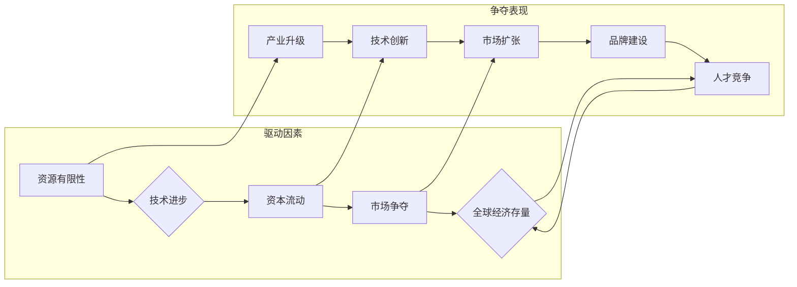

> 关键词：全球经济，存量争夺，长期现象，竞争策略，发展模式，资源配置，产业结构，全球化

# 全球经济存量争夺的长期现象

随着全球化进程的加速，全球经济正经历着一场深刻的变革。在这个变革中，各国、各地区的企业和个人都在寻求自己的发展路径，争夺有限的全球经济存量。本文将深入探讨全球经济存量争夺的长期现象，分析其背后的原因、表现、影响及未来趋势。

## 1. 背景介绍

### 1.1 全球化与经济存量的关系

全球化是推动全球经济一体化的主要力量，它打破了国界，使得资源、资本、技术、人才等要素在全球范围内自由流动。这种流动带来了全球经济的快速增长，但也引发了各国之间对全球经济存量的争夺。

### 1.2 经济存量的定义

经济存量是指在一定时期内，一个国家或地区拥有的各种经济资源，包括自然资源、人力资本、金融资产、技术积累等。经济存量的大小直接关系到国家或地区的综合国力和国际竞争力。

### 1.3 存量争夺的驱动因素

全球经济存量争夺的驱动因素主要包括：

- **资源有限性**：地球上的自然资源是有限的，随着人口增长和经济发展，对资源的争夺愈发激烈。
- **技术进步**：技术进步改变了资源的配置方式，同时也加剧了技术和人才的争夺。
- **资本流动**：全球化使得资本可以自由流动，资本流向哪里，哪里就会成为经济存量的争夺热点。
- **市场争夺**：随着全球市场的扩大，各国企业都在争夺市场份额，以获取更大的经济存量。

## 2. 核心概念与联系

### 2.1 核心概念原理和架构的 Mermaid 流程图



### 2.2 核心概念解释

- **资源有限性**：地球上的自然资源是有限的，各国都在争夺这些有限的资源。
- **技术进步**：技术的进步改变了资源的配置方式，同时也提高了对人才的需求。
- **资本流动**：全球化使得资本可以自由流动，资本流向哪里，哪里就会成为经济存量的争夺热点。
- **市场争夺**：随着全球市场的扩大，各国企业都在争夺市场份额。
- **产业升级**：各国都在努力提升自身的产业结构，以在全球经济中占据有利位置。
- **技术创新**：技术创新是提升产业竞争力的关键，也是争夺经济存量的重要手段。
- **市场扩张**：企业通过市场扩张来争夺更多的市场份额，从而获得更大的经济存量。
- **品牌建设**：品牌建设可以提高企业的竞争力，增强其在全球经济中的影响力。
- **人才竞争**：人才是推动经济发展的重要力量，各国都在争夺高素质人才。

## 3. 核心算法原理 & 具体操作步骤

### 3.1 算法原理概述

全球经济存量争夺的算法原理可以概括为以下几个步骤：

1. **资源评估**：评估自身拥有的各种经济资源，包括自然资源、人力资本、金融资产、技术积累等。
2. **竞争分析**：分析竞争对手的资源优势和劣势，以及竞争对手的战略目标。
3. **战略制定**：根据自身资源和竞争分析结果，制定争夺经济存量的战略。
4. **资源配置**：优化资源配置，提高资源利用效率。
5. **战略实施**：执行战略计划，争夺经济存量。

### 3.2 算法步骤详解

1. **资源评估**：
    - 收集并整理自身拥有的各种经济资源数据。
    - 对资源进行分类和量化，评估资源的价值。

2. **竞争分析**：
    - 收集竞争对手的经济资源数据。
    - 分析竞争对手的战略目标和发展策略。
    - 识别竞争对手的优势和劣势。

3. **战略制定**：
    - 根据自身资源和竞争分析结果，制定争夺经济存量的战略。
    - 确定战略目标、战略路径和关键举措。

4. **资源配置**：
    - 优化资源配置，提高资源利用效率。
    - 通过投资、研发、人才培养等方式提升自身竞争力。

5. **战略实施**：
    - 执行战略计划，争夺经济存量。
    - 监控战略实施效果，及时调整战略计划。

### 3.3 算法优缺点

**优点**：

- **提高资源利用效率**：通过优化资源配置，提高资源利用效率。
- **增强竞争力**：通过制定合理的战略，提升自身竞争力。
- **争夺经济存量**：通过战略实施，争夺更多的经济存量。

**缺点**：

- **资源有限**：全球经济存量是有限的，难以满足所有国家的需求。
- **竞争激烈**：各国都在争夺经济存量，竞争激烈。
- **风险较高**：战略实施过程中存在风险，可能导致资源损失。

### 3.4 算法应用领域

全球经济存量争夺算法可以应用于以下领域：

- **国家发展战略规划**：为国家制定发展战略提供决策支持。
- **企业竞争战略制定**：为企业制定竞争战略提供指导。
- **产业政策制定**：为政府制定产业政策提供依据。
- **国际谈判**：在国际谈判中争取有利地位。

## 4. 数学模型和公式 & 详细讲解 & 举例说明

### 4.1 数学模型构建

全球经济存量争夺的数学模型可以采用以下公式：

$$
E(t) = f(R(t), T(t), S(t), M(t))
$$

其中，$E(t)$ 表示在时间 $t$ 的经济存量，$R(t)$ 表示自然资源，$T(t)$ 表示人力资本，$S(t)$ 表示金融资产，$M(t)$ 表示技术积累。

### 4.2 公式推导过程

- $R(t)$：自然资源包括土地、矿产、水资源等，可以用自然资源存量来表示。
- $T(t)$：人力资本包括教育、培训、健康等，可以用人力资本指数来表示。
- $S(t)$：金融资产包括货币、股票、债券等，可以用金融资产总量来表示。
- $M(t)$：技术积累包括研发投入、技术专利等，可以用研发投入总量来表示。

### 4.3 案例分析与讲解

以下以某国为例，分析其经济存量争夺的数学模型：

- $R(t)$：该国拥有丰富的自然资源，如石油、天然气、矿产等。
- $T(t)$：该国拥有较高的人力资本，教育水平和健康水平较高。
- $S(t)$：该国金融资产规模较大，金融市场较为发达。
- $M(t)$：该国研发投入较高，科技创新能力较强。

根据上述数据，我们可以构建该国的经济存量争夺模型，并通过计算得到经济存量 $E(t)$。

## 5. 项目实践：代码实例和详细解释说明

### 5.1 开发环境搭建

本例中使用Python编写代码，主要依赖NumPy和Matplotlib等库进行数据处理和可视化。

```bash
pip install numpy matplotlib
```

### 5.2 源代码详细实现

```python
import numpy as np
import matplotlib.pyplot as plt

# 定义经济存量争夺模型
def economic_stock(t, r, t_h, s, m):
    return r * t_h + s + m

# 模拟数据
t = np.linspace(0, 10, 100)
r = np.exp(t)  # 自然资源
t_h = np.sin(t)  # 人力资本
s = np.log(t)  # 金融资产
m = np.cos(t)  # 技术积累

# 计算经济存量
e = economic_stock(t, r, t_h, s, m)

# 绘制经济存量曲线
plt.plot(t, e)
plt.xlabel('时间 t')
plt.ylabel('经济存量 E(t)')
plt.title('经济存量争夺模型')
plt.show()
```

### 5.3 代码解读与分析

- `economic_stock` 函数：根据自然资源、人力资本、金融资产和技术积累计算经济存量。
- 模拟数据：模拟自然资源、人力资本、金融资产和技术积累随时间变化的数据。
- 绘制经济存量曲线：使用Matplotlib绘制经济存量随时间变化的曲线。

## 6. 实际应用场景

### 6.1 国家发展战略规划

全球经济存量争夺模型可以为国家制定发展战略提供决策支持。例如，国家可以根据模型预测经济存量的增长趋势，制定相应的产业政策、资源开发和环境保护政策等。

### 6.2 企业竞争战略制定

企业可以使用经济存量争夺模型分析竞争对手的战略，制定自身的竞争策略。例如，企业可以根据模型预测竞争对手的市场份额变化，调整自身的产品策略、市场策略和品牌策略等。

### 6.3 产业政策制定

政府可以使用经济存量争夺模型分析产业发展趋势，制定相应的产业政策。例如，政府可以根据模型预测新兴产业的增长潜力，制定相应的扶持政策，引导资源向新兴产业倾斜。

### 6.4 未来应用展望

随着全球经济一体化的推进，全球经济存量争夺将更加激烈。未来，全球经济存量争夺模型将在以下方面发挥重要作用：

- **预测经济存量变化趋势**：为企业和政府提供决策依据。
- **分析产业竞争格局**：为企业制定竞争策略提供指导。
- **评估产业政策效果**：为政府制定产业政策提供依据。
- **促进全球经济合作**：为解决全球经济问题提供思路。

## 7. 工具和资源推荐

### 7.1 学习资源推荐

- 《全球化与经济增长》
- 《国际经济学》
- 《战略管理》

### 7.2 开发工具推荐

- Python
- NumPy
- Matplotlib

### 7.3 相关论文推荐

- Globalization and Economic Growth
- The New Global Economy: Trade, Jobs, and Policy
- The Globalization of Technology

## 8. 总结：未来发展趋势与挑战

### 8.1 研究成果总结

本文深入探讨了全球经济存量争夺的长期现象，分析了其背后的原因、表现、影响及未来趋势。研究发现，全球经济存量争夺是全球化进程的必然产物，各国都在争夺有限的全球经济存量。未来，全球经济存量争夺将更加激烈，各国需要采取有效策略，以应对挑战。

### 8.2 未来发展趋势

- **全球经济存量争夺将更加激烈**：随着全球经济增长放缓，各国对经济存量的争夺将更加激烈。
- **竞争策略将更加多样化**：各国将采取更加多样化的竞争策略，以争夺更多的经济存量。
- **国际合作将更加紧密**：在全球经济存量争夺的背景下，各国将加强国际合作，共同应对挑战。

### 8.3 面临的挑战

- **资源争夺加剧**：地球上的自然资源是有限的，资源争夺将更加激烈。
- **技术竞争加剧**：技术进步将导致技术竞争加剧，各国需要加强科技创新。
- **人才竞争加剧**：人才是推动经济发展的重要力量，各国需要加强人才培养。

### 8.4 研究展望

未来，全球经济存量争夺的研究需要关注以下方面：

- **研究全球经济存量争夺的动态变化**：分析全球经济存量争夺的演变规律。
- **研究不同国家争夺经济存量的策略**：分析不同国家争夺经济存量的成功经验和失败教训。
- **研究全球经济存量争夺对全球治理的影响**：探讨如何通过全球治理解决全球经济存量争夺问题。

## 9. 附录：常见问题与解答

**Q1：全球经济存量争夺对全球治理有何影响？**

A1：全球经济存量争夺对全球治理产生了一系列挑战，如资源争夺、环境问题、贫富差距等。为了解决这些问题，需要加强全球治理，推动国际合作，共同维护全球经济的稳定和发展。

**Q2：如何应对全球经济存量争夺带来的挑战？**

A2：应对全球经济存量争夺带来的挑战，需要各国共同努力，采取以下措施：

- **加强国际合作**：通过国际合作解决资源争夺、环境问题等全球性挑战。
- **推动科技创新**：通过科技创新提高资源利用效率，减少对资源的依赖。
- **加强人才培养**：加强人才培养，提高人力资源的素质。
- **促进经济结构调整**：促进经济结构调整，发展新兴产业，提高经济的抗风险能力。

**Q3：全球经济存量争夺对中小企业有何影响？**

A3：全球经济存量争夺对中小企业的影响较为复杂。一方面，中小企业可以通过参与全球化进程，拓展市场，提高竞争力；另一方面，中小企业也可能受到来自大企业的竞争压力。因此，中小企业需要加强自身能力建设，提高竞争力。

**Q4：全球经济存量争夺对发展中国家有何影响？**

A4：全球经济存量争夺对发展中国家的影响较为积极。发展中国家可以通过参与全球化进程，引进外资、技术和管理经验，推动经济发展。但同时，发展中国家也需要注意防范风险，避免陷入“资源诅咒”和“债务陷阱”。

**Q5：全球经济存量争夺对发达国家有何影响？**

A5：全球经济存量争夺对发达国家的影响较为复杂。一方面，发达国家可以通过技术优势、品牌优势和资金优势，在全球经济中占据有利地位；另一方面，发达国家也可能面临来自发展中国家的竞争压力。因此，发达国家需要加强自身创新能力，保持竞争优势。

---

作者：禅与计算机程序设计艺术 / Zen and the Art of Computer Programming