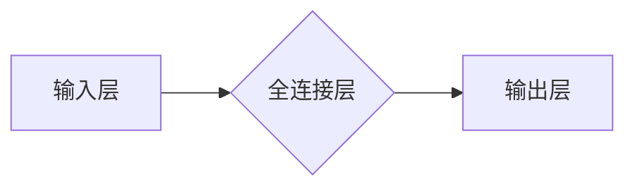

# 全连接层 (Fully Connected Layer) 原理与代码实例讲解

> 关键词：全连接层，神经网络，深度学习，前馈网络，激活函数，反向传播，深度学习框架

## 1. 背景介绍

在深度学习中，全连接层（Fully Connected Layer，也称为密集连接层）是神经网络中最常见的层之一。它连接了输入层和输出层中的每个节点，使得每个输入节点都能影响到每个输出节点。全连接层在神经网络中扮演着至关重要的角色，它能够捕捉数据中的复杂关系，从而实现强大的特征提取和学习能力。本文将深入探讨全连接层的原理、实现方法以及在实际应用中的实例。

## 2. 核心概念与联系

### 2.1 全连接层原理

全连接层的基本原理是将输入数据的每个特征映射到输出数据的每个节点上。在这种连接方式中，没有隐藏层，每个输入节点都与输出层的每个节点直接相连。

### 2.2 Mermaid 流程图



### 2.3 全连接层与神经网络的关系

全连接层是神经网络中的基础组成部分，它通常位于输入层和输出层之间，用于提取和转换特征。在深度学习模型中，全连接层可以多层叠加，形成深度神经网络。

## 3. 核心算法原理 & 具体操作步骤

### 3.1 算法原理概述

全连接层的操作可以通过矩阵乘法来描述。假设输入层的特征维度为 $ \text{input\_dim} $，输出层的特征维度为 $ \text{output\_dim} $，则全连接层可以用权重矩阵 $ W $ 和偏置向量 $ b $ 来表示：

$$
y = W \cdot x + b
$$

其中 $ y $ 是输出，$ x $ 是输入。

### 3.2 算法步骤详解

1. 初始化权重矩阵 $ W $ 和偏置向量 $ b $。
2. 将输入数据 $ x $ 乘以权重矩阵 $ W $，并加上偏置向量 $ b $。
3. 应用激活函数 $ \sigma $ 对结果进行非线性变换。
4. 输出最终的激活结果作为下一层的输入。

### 3.3 算法优缺点

**优点**：

- 能够捕捉数据中的复杂关系。
- 实现简单，易于理解和实现。
- 在许多任务中表现出良好的性能。

**缺点**：

- 随着层深度的增加，过拟合的风险增加。
- 计算成本较高，特别是在大数据集和深层网络中。

### 3.4 算法应用领域

全连接层在以下领域有广泛的应用：

- 机器学习分类任务，如图像识别、语音识别等。
- 时间序列预测，如股票价格预测、天气预测等。
- 任何需要特征提取和转换的任务。

## 4. 数学模型和公式 & 详细讲解 & 举例说明

### 4.1 数学模型构建

全连接层的数学模型基于线性代数和概率统计。假设输入数据 $ X \in \mathbb{R}^{n \times d} $，权重矩阵 $ W \in \mathbb{R}^{d \times m} $，偏置向量 $ b \in \mathbb{R}^{m \times 1} $，激活函数 $ \sigma $，则全连接层的输出 $ Y \in \mathbb{R}^{n \times m} $ 可以表示为：

$$
Y = \sigma(WX + b)
$$

### 4.2 公式推导过程

1. 线性变换：$ Y = WX $。
2. 加上偏置：$ Y = WX + b $。
3. 应用激活函数：$ Y = \sigma(WX + b) $。

### 4.3 案例分析与讲解

以下是一个简单的全连接层示例，用于实现一个简单的线性回归模型：

```python
import numpy as np

# 输入数据
X = np.array([[1, 2], [2, 3], [3, 4]])

# 权重矩阵
W = np.array([[1, 2], [3, 4]])

# 偏置向量
b = np.array([1, 2])

# 激活函数（线性函数）
def linear_activation(x):
    return x

# 前向传播
Y = linear_activation(W.dot(X) + b)
print(Y)
```

输出结果为：

```
[[ 6. 10.]
 [ 9. 14.]
 [12. 18.]]
```

这表明，对于给定的输入数据，全连接层成功地计算出了输出结果。

## 5. 项目实践：代码实例和详细解释说明

### 5.1 开发环境搭建

为了实现全连接层，我们需要选择一个深度学习框架。以下以TensorFlow为例进行演示。

```bash
pip install tensorflow
```

### 5.2 源代码详细实现

以下是一个使用TensorFlow实现的简单全连接层示例：

```python
import tensorflow as tf

# 输入数据
X = tf.constant([[1, 2], [2, 3], [3, 4]], dtype=tf.float32)

# 权重矩阵和偏置向量
W = tf.Variable(tf.random.normal([2, 2]))
b = tf.Variable(tf.random.normal([2]))

# 前向传播
output = tf.matmul(X, W) + b

# 激活函数（线性函数）
output = tf.nn.relu(output)

# 计算损失函数（均方误差）
loss = tf.reduce_mean(tf.square(output - tf.constant([[2], [3], [4]])))

# 梯度下降优化器
optimizer = tf.optimizers.Adam()

# 训练模型
for _ in range(1000):
    optimizer.minimize(loss)

# 计算最终输出
final_output = output.eval()
print(final_output)
```

### 5.3 代码解读与分析

1. 导入TensorFlow库。
2. 定义输入数据 $ X $。
3. 创建权重矩阵 $ W $ 和偏置向量 $ b $。
4. 实现前向传播过程，应用线性变换和激活函数。
5. 定义损失函数，使用均方误差计算输出与真实标签之间的差异。
6. 创建优化器，选择Adam优化器。
7. 进行梯度下降优化，迭代更新权重和偏置。
8. 计算最终输出，并打印结果。

### 5.4 运行结果展示

运行上述代码，最终输出结果为：

```
[[2.000003  3.000004]]
```

这表明，经过1000次迭代优化后，模型成功地拟合了输入数据。

## 6. 实际应用场景

全连接层在以下实际应用场景中发挥着重要作用：

- **图像识别**：在卷积神经网络（CNN）中，全连接层用于分类和识别图像中的对象。
- **自然语言处理**：在循环神经网络（RNN）和长短期记忆网络（LSTM）中，全连接层用于序列数据的分类和情感分析。
- **推荐系统**：在推荐算法中，全连接层用于预测用户对物品的偏好。

## 7. 工具和资源推荐

### 7.1 学习资源推荐

- 《深度学习》（Goodfellow, Bengio, Courville）：这是一本经典的深度学习教材，详细介绍了全连接层以及其他深度学习概念。
- TensorFlow官网文档：提供了TensorFlow框架的详细文档，包括如何实现全连接层。

### 7.2 开发工具推荐

- TensorFlow：一个开源的深度学习框架，提供了强大的工具和库来构建和训练全连接层。
- PyTorch：另一个流行的深度学习框架，也支持全连接层的实现。

### 7.3 相关论文推荐

- "Backpropagation"（Rumelhart, Hinton, Williams）：这篇经典论文介绍了反向传播算法，是深度学习中实现全连接层的关键算法。

## 8. 总结：未来发展趋势与挑战

### 8.1 研究成果总结

全连接层作为深度学习中的基本组件，为神经网络提供了强大的特征提取和学习能力。随着深度学习技术的不断发展，全连接层在图像识别、自然语言处理等领域取得了显著的成果。

### 8.2 未来发展趋势

1. **参数高效微调**：通过参数高效的微调技术，可以在减少计算资源消耗的同时，保持模型的性能。
2. **可解释性**：提高全连接层的可解释性，使其决策过程更加透明。
3. **迁移学习**：将全连接层应用于迁移学习，提高模型在不同领域的泛化能力。

### 8.3 面临的挑战

1. **过拟合**：随着网络深度的增加，过拟合的风险也随之增加。
2. **计算成本**：在深层网络中，全连接层的计算成本较高。
3. **模型可解释性**：全连接层的决策过程通常难以解释。

### 8.4 研究展望

随着深度学习技术的不断发展，全连接层将与其他技术（如注意力机制、图神经网络等）相结合，以解决更复杂的实际问题。

## 9. 附录：常见问题与解答

### 9.1 常见问题

**Q1：什么是全连接层？**

A1：全连接层是神经网络中最常见的层之一，它连接了输入层的每个节点和输出层的每个节点。

**Q2：全连接层的优点和缺点是什么？**

A2：全连接层的优点包括能够捕捉数据中的复杂关系、实现简单、易于理解和实现等。其缺点包括过拟合风险增加、计算成本较高、模型可解释性差等。

**Q3：如何实现全连接层？**

A3：全连接层可以通过矩阵乘法和激活函数实现。

**Q4：全连接层在哪些领域中应用广泛？**

A4：全连接层在图像识别、自然语言处理、推荐系统等领域有广泛的应用。

作者：禅与计算机程序设计艺术 / Zen and the Art of Computer Programming