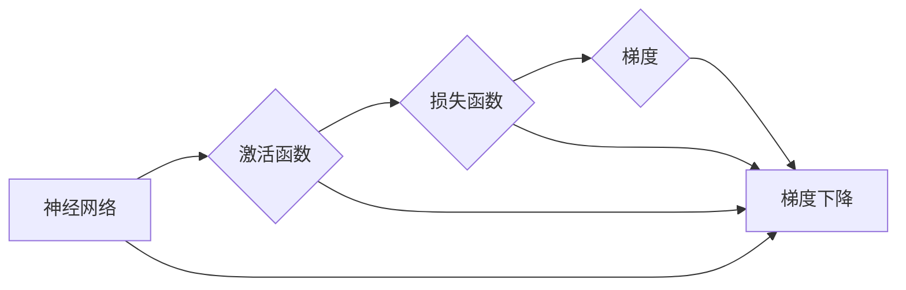

# 反向传播(Backpropagation) - 原理与代码实例讲解

> 关键词：反向传播，神经网络，梯度下降，梯度，激活函数，损失函数，反向传播算法，深度学习

## 1. 背景介绍

反向传播（Backpropagation）是深度学习中最核心的算法之一，它使得神经网络的学习过程变得可行和高效。自1986年由Rumelhart, Hinton和Williams提出以来，反向传播算法在神经网络领域的应用已经取得了巨大的成功，成为了构建现代深度学习模型的基础。

本篇文章将深入探讨反向传播算法的原理、操作步骤、优缺点以及应用领域，并通过具体的代码实例进行详细讲解，帮助读者全面理解这一关键算法。

## 2. 核心概念与联系

### 2.1 核心概念原理

在深入探讨反向传播算法之前，我们需要了解以下几个核心概念：

- **神经网络（Neural Network）**：由多个相互连接的神经元组成的计算系统，每个神经元都是一个简单的计算单元，通过前馈和反馈的方式处理信息。
- **激活函数（Activation Function）**：用于引入非线性因素到神经网络中，常见的激活函数包括Sigmoid、ReLU、Tanh等。
- **损失函数（Loss Function）**：用于衡量模型预测值与真实值之间的差异，常见的损失函数包括均方误差（MSE）、交叉熵（Cross-Entropy）等。
- **梯度（Gradient）**：在函数中，某个变量的变化对函数值变化的敏感程度。
- **梯度下降（Gradient Descent）**：一种优化算法，通过不断调整模型参数，使得损失函数值最小化。

以下是用Mermaid流程图表示这些概念之间的联系：



### 2.2 架构

反向传播算法的核心是计算损失函数对模型参数的梯度，并通过梯度下降算法更新参数。这个过程可以看作是一个前向传播和后向传播的循环：

1. **前向传播**：将输入数据传递到神经网络的输入层，经过各层的处理，最终输出预测结果。
2. **计算损失**：使用损失函数计算预测结果与真实标签之间的差异。
3. **后向传播**：从输出层开始，反向计算损失函数对每个参数的梯度。
4. **参数更新**：使用梯度下降算法根据梯度更新模型参数。

## 3. 核心算法原理 & 具体操作步骤

### 3.1 算法原理概述

反向传播算法的原理基于链式法则和微分。具体来说，它通过以下步骤工作：

1. **前向传播**：计算神经网络的输出。
2. **计算损失**：使用损失函数计算预测值与真实值之间的差异。
3. **梯度计算**：从输出层开始，反向计算损失函数对每个参数的梯度。
4. **参数更新**：使用梯度下降算法根据梯度更新参数。

### 3.2 算法步骤详解

反向传播算法的具体步骤如下：

1. **初始化**：设置初始参数、学习率等超参数。
2. **前向传播**：将输入数据传递到神经网络的输入层，经过各层的处理，最终输出预测结果。
3. **计算损失**：使用损失函数计算预测结果与真实标签之间的差异。
4. **梯度计算**：对于神经网络中的每个神经元，计算损失函数对该神经元输出的梯度。
5. **参数更新**：使用梯度下降算法根据梯度更新参数。

### 3.3 算法优缺点

**优点**：

- **高效**：反向传播算法可以快速计算损失函数对参数的梯度，从而高效地进行参数更新。
- **通用**：反向传播算法适用于各种神经网络结构。
- **自动微分**：现代深度学习框架通常内置自动微分功能，可以自动计算梯度。

**缺点**：

- **局部最小值**：梯度下降算法可能陷入局部最小值，导致模型无法收敛到全局最小值。
- **计算量大**：在大型神经网络中，反向传播算法的计算量可能非常大。
- **对初始化敏感**：参数的初始化对模型的收敛性能有很大影响。

### 3.4 算法应用领域

反向传播算法广泛应用于各种深度学习模型，包括：

- **神经网络**：多层感知机（MLP）、卷积神经网络（CNN）、循环神经网络（RNN）、长短期记忆网络（LSTM）、门控循环单元（GRU）等。
- **计算机视觉**：图像分类、目标检测、图像分割等。
- **自然语言处理**：文本分类、情感分析、机器翻译等。
- **语音识别**：语音识别、语音合成等。

## 4. 数学模型和公式 & 详细讲解 & 举例说明

### 4.1 数学模型构建

反向传播算法的数学基础是链式法则。以下是一个简单的神经网络示例，包括输入层、隐藏层和输出层。

```
输入层: [x1, x2, ..., xn]
隐藏层: [h1, h2, ..., hm]
输出层: [o1, o2, ..., op]
```

### 4.2 公式推导过程

假设我们使用交叉熵损失函数，其公式为：

$$
\text{Loss} = -\sum_{i=1}^{p} y_i \log(\hat{y}_i)
$$

其中 $y_i$ 是真实标签，$\hat{y}_i$ 是预测概率。

我们需要计算损失函数对每个神经元输出的梯度，即 $\frac{\partial \text{Loss}}{\partial \hat{y}_i}$。

### 4.3 案例分析与讲解

以下是一个使用PyTorch实现的简单神经网络，该网络使用ReLU激活函数和交叉熵损失函数进行训练。

```python
import torch
import torch.nn as nn

# 定义神经网络
class SimpleNet(nn.Module):
    def __init__(self, input_size, hidden_size, output_size):
        super(SimpleNet, self).__init__()
        self.fc1 = nn.Linear(input_size, hidden_size)
        self.relu = nn.ReLU()
        self.fc2 = nn.Linear(hidden_size, output_size)

    def forward(self, x):
        x = self.fc1(x)
        x = self.relu(x)
        x = self.fc2(x)
        return x

# 实例化网络
model = SimpleNet(input_size=2, hidden_size=5, output_size=2)
```

接下来，我们可以使用反向传播算法训练这个网络。

```python
# 设置训练参数
learning_rate = 0.01
criterion = nn.CrossEntropyLoss()
optimizer = torch.optim.SGD(model.parameters(), lr=learning_rate)

# 训练数据
x = torch.tensor([[1, 2], [3, 4]])
y = torch.tensor([1])

# 前向传播
outputs = model(x)

# 计算损失
loss = criterion(outputs, y)

# 反向传播
optimizer.zero_grad()
loss.backward()
optimizer.step()
```

在这个例子中，我们首先使用随机初始化的参数进行前向传播，然后计算损失函数。接着，使用反向传播算法计算梯度，并更新参数。重复这个过程多次，直到模型收敛。

## 5. 项目实践：代码实例和详细解释说明

### 5.1 开发环境搭建

为了实现反向传播算法，我们需要安装以下软件和库：

- Python 3.x
- PyTorch

安装PyTorch：

```bash
pip install torch torchvision torchaudio
```

### 5.2 源代码详细实现

以下是一个使用PyTorch实现的简单神经网络，该网络使用ReLU激活函数和交叉熵损失函数进行训练。

```python
import torch
import torch.nn as nn
import torch.optim as optim

# 定义神经网络
class SimpleNet(nn.Module):
    def __init__(self, input_size, hidden_size, output_size):
        super(SimpleNet, self).__init__()
        self.fc1 = nn.Linear(input_size, hidden_size)
        self.relu = nn.ReLU()
        self.fc2 = nn.Linear(hidden_size, output_size)

    def forward(self, x):
        x = self.fc1(x)
        x = self.relu(x)
        x = self.fc2(x)
        return x

# 实例化网络
model = SimpleNet(input_size=2, hidden_size=5, output_size=2)

# 设置训练参数
learning_rate = 0.01
criterion = nn.CrossEntropyLoss()
optimizer = optim.SGD(model.parameters(), lr=learning_rate)

# 训练数据
x = torch.tensor([[1, 2], [3, 4]])
y = torch.tensor([1])

# 训练循环
for epoch in range(100):
    # 前向传播
    outputs = model(x)

    # 计算损失
    loss = criterion(outputs, y)

    # 反向传播
    optimizer.zero_grad()
    loss.backward()
    optimizer.step()

    if epoch % 10 == 0:
        print(f'Epoch {epoch+1}, Loss: {loss.item()}')
```

### 5.3 代码解读与分析

在这个例子中，我们首先定义了一个简单的神经网络，该网络包含两个线性层和ReLU激活函数。然后，我们设置训练参数和训练数据，并使用梯度下降算法进行训练。在训练循环中，我们进行前向传播和反向传播，并打印出每10个epoch的损失值。

### 5.4 运行结果展示

运行上述代码，我们可以看到损失值逐渐减小，表明模型在训练过程中不断收敛。最终，损失值稳定在一个较小的值，说明模型已经很好地拟合了训练数据。

## 6. 实际应用场景

反向传播算法在深度学习中被广泛应用于各种实际应用场景，以下是一些常见的应用：

- **图像分类**：使用卷积神经网络（CNN）对图像进行分类，如识别猫、狗、汽车等。
- **目标检测**：使用卷积神经网络（CNN）检测图像中的物体，并定位其位置。
- **图像分割**：使用卷积神经网络（CNN）将图像分割成不同的区域，如将图像分割为前景和背景。
- **自然语言处理**：使用循环神经网络（RNN）或长短期记忆网络（LSTM）进行文本分类、情感分析、机器翻译等任务。
- **语音识别**：使用循环神经网络（RNN）或卷积神经网络（CNN）进行语音识别，将语音信号转换为文本。

## 7. 工具和资源推荐

### 7.1 学习资源推荐

- 《深度学习》（Goodfellow, Bengio, Courville）：深度学习领域的经典教材，详细介绍了深度学习的基本概念、理论和技术。
- 《神经网络与深度学习》（邱锡鹏）：中文深度学习教材，内容全面，适合中文读者。
- 《动手学深度学习》（花老师）：基于PyTorch的开源深度学习教材，包含大量实践案例。

### 7.2 开发工具推荐

- PyTorch：开源的深度学习框架，易于使用和扩展。
- TensorFlow：Google开源的深度学习框架，功能强大，适合工业应用。
- Keras：Python的深度学习库，易于使用，可以与TensorFlow和Theano等框架结合使用。

### 7.3 相关论文推荐

- "An Introduction to Backpropagation Learning" by David E. Rumelhart, Geoffrey E. Hinton, and Ronald J. Williams
- "Backpropagation: The Mathematical Tutorial" by Michael A. Nielsen
- "Learning representations by backpropagation" by Rumelhart, Hinton, and Williams

## 8. 总结：未来发展趋势与挑战

### 8.1 研究成果总结

反向传播算法是深度学习领域的一项重要成果，它使得神经网络的学习过程变得可行和高效。自从提出以来，反向传播算法已经经历了多次改进和优化，成为了构建现代深度学习模型的基础。

### 8.2 未来发展趋势

未来，反向传播算法可能会在以下几个方面得到进一步发展：

- **算法优化**：开发更高效的反向传播算法，减少计算量，提高计算效率。
- **并行计算**：利用并行计算技术，加快反向传播算法的计算速度。
- **自适应学习率**：开发自适应学习率的算法，提高学习效率和收敛速度。
- **可解释性**：提高反向传播算法的可解释性，让算法的决策过程更加透明。

### 8.3 面临的挑战

反向传播算法也面临着一些挑战：

- **计算复杂度**：随着神经网络规模的增大，反向传播算法的计算量也会随之增加。
- **局部最小值**：梯度下降算法可能陷入局部最小值，导致模型无法收敛到全局最小值。
- **初始化问题**：参数的初始化对模型的收敛性能有很大影响。

### 8.4 研究展望

未来，反向传播算法的研究将朝着更加高效、可解释和可扩展的方向发展。随着深度学习技术的不断进步，反向传播算法将会在更多领域得到应用，为人工智能的发展做出更大的贡献。

## 9. 附录：常见问题与解答

**Q1：什么是反向传播算法？**

A：反向传播算法是一种用于训练神经网络的学习算法，它通过计算损失函数对参数的梯度，并使用梯度下降算法更新参数，使得模型预测结果更加接近真实标签。

**Q2：反向传播算法是如何工作的？**

A：反向传播算法通过以下步骤工作：
1. 前向传播：将输入数据传递到神经网络的输入层，经过各层的处理，最终输出预测结果。
2. 计算损失：使用损失函数计算预测结果与真实标签之间的差异。
3. 梯度计算：从输出层开始，反向计算损失函数对每个参数的梯度。
4. 参数更新：使用梯度下降算法根据梯度更新参数。

**Q3：反向传播算法的优缺点是什么？**

A：反向传播算法的优点包括高效、通用和自动微分。缺点包括可能陷入局部最小值、计算量大和对初始化敏感。

**Q4：如何优化反向传播算法？**

A：可以采取以下措施优化反向传播算法：
1. 使用更高效的优化算法，如Adam、RMSprop等。
2. 使用并行计算技术，加快计算速度。
3. 使用自适应学习率算法，提高学习效率和收敛速度。

**Q5：反向传播算法在哪些领域有应用？**

A：反向传播算法在深度学习中被广泛应用于各种实际应用场景，包括图像分类、目标检测、图像分割、自然语言处理和语音识别等。

---

作者：禅与计算机程序设计艺术 / Zen and the Art of Computer Programming