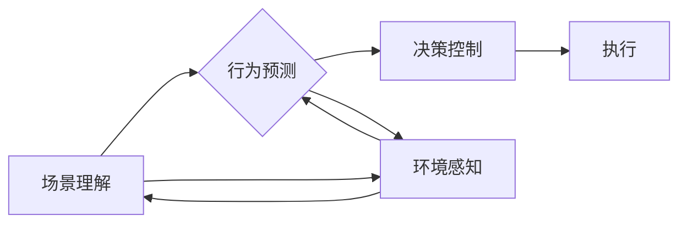

# 场景理解与行为预测引领自动驾驶智能升级的新方向

> 关键词：自动驾驶，场景理解，行为预测，深度学习，机器学习，智能升级，安全驾驶，人工智能

## 1. 背景介绍

随着科技的发展，自动驾驶技术逐渐成为汽车产业和信息技术领域的热点。自动驾驶汽车旨在通过高级的人工智能技术，使车辆能够在没有人类司机的情况下安全、可靠地行驶。场景理解和行为预测作为自动驾驶技术中的关键环节，对于提高自动驾驶系统的智能水平和安全性至关重要。

### 1.1 自动驾驶的发展现状

自动驾驶技术经历了多个发展阶段，从最初的遥控驾驶、自适应巡航控制，到如今的L3、L4、L5级别的自动驾驶，技术不断成熟，应用场景越来越广泛。然而，自动驾驶技术仍面临着诸多挑战，其中场景理解和行为预测是两个核心难题。

### 1.2 场景理解和行为预测的重要性

场景理解是指自动驾驶系统对周围环境进行感知、分析和理解的过程。它包括对车辆自身状态、道路状况、交通状况、行人行为等方面的感知和理解。行为预测则是指自动驾驶系统对周围物体的未来行为进行预测，如车辆、行人的移动轨迹、动作等。

场景理解和行为预测对于自动驾驶系统的安全性、可靠性和用户体验至关重要。以下是它们的重要性：

- **安全性**：通过准确理解和预测周围环境，自动驾驶系统可以及时做出反应，避免潜在的危险情况。
- **可靠性**：准确的场景理解和行为预测可以减少误判和错误决策，提高自动驾驶系统的可靠性。
- **用户体验**：良好的场景理解和行为预测可以提高自动驾驶的平稳性和舒适性。

### 1.3 本文结构

本文将围绕场景理解和行为预测在自动驾驶中的应用展开，具体内容如下：

- 第2部分：介绍场景理解和行为预测的核心概念及其相互关系。
- 第3部分：阐述场景理解和行为预测的算法原理和具体操作步骤。
- 第4部分：讲解数学模型和公式，并结合实例进行分析。
- 第5部分：提供代码实例和详细解释说明。
- 第6部分：探讨场景理解和行为预测在实际应用场景中的案例。
- 第7部分：展望未来发展趋势和面临的挑战。
- 第8部分：总结研究成果，并展望未来研究方向。

## 2. 核心概念与联系

### 2.1 核心概念

**场景理解**：自动驾驶系统对周围环境进行感知、分析和理解的过程，包括对车辆自身状态、道路状况、交通状况、行人行为等方面的感知和理解。

**行为预测**：自动驾驶系统对周围物体的未来行为进行预测，如车辆、行人的移动轨迹、动作等。

### 2.2 相互关系

场景理解和行为预测是自动驾驶技术中相互关联的两个环节。场景理解提供了行为预测所需的环境信息，而行为预测则进一步丰富了场景理解的深度和广度。两者相互依存，共同构成了自动驾驶系统的高级认知能力。

Mermaid 流程图如下：



## 3. 核心算法原理 & 具体操作步骤

### 3.1 算法原理概述

场景理解和行为预测通常采用深度学习或机器学习算法来实现。以下是一些常用的算法：

- **卷积神经网络（CNN）**：用于图像识别和处理，特别适用于场景理解任务。
- **循环神经网络（RNN）和长短期记忆网络（LSTM）**：用于序列数据处理，适用于行为预测任务。
- **图神经网络（GNN）**：适用于复杂图结构数据的处理，如社交网络分析、交通网络分析等。

### 3.2 算法步骤详解

**场景理解**：

1. **数据采集**：收集道路、交通、天气等环境信息。
2. **特征提取**：使用CNN提取图像特征，使用传感器数据提取环境信息。
3. **场景表示**：将提取的特征表示为场景图或场景向量。
4. **场景理解**：使用分类器或回归模型对场景进行理解。

**行为预测**：

1. **数据采集**：收集车辆、行人的历史轨迹数据。
2. **特征提取**：使用RNN或LSTM提取序列特征。
3. **行为预测**：使用分类器或回归模型预测未来行为。

### 3.3 算法优缺点

**CNN**：

- 优点：强大的图像识别和处理能力，适用于场景理解。
- 缺点：对动态环境适应性较差。

**RNN和LSTM**：

- 优点：擅长处理序列数据，适用于行为预测。
- 缺点：训练时间较长，难以处理长序列。

**GNN**：

- 优点：适用于复杂图结构数据的处理。
- 缺点：计算复杂度高，对图结构依赖性强。

### 3.4 算法应用领域

场景理解和行为预测在以下自动驾驶任务中具有重要应用：

- **车道线检测**：通过场景理解识别道路上的车道线。
- **交通标志识别**：通过场景理解识别道路上的交通标志。
- **交通流量预测**：通过行为预测预测交通流量。
- **行人行为预测**：通过行为预测预测行人的移动轨迹和动作。

## 4. 数学模型和公式 & 详细讲解 & 举例说明

### 4.1 数学模型构建

**场景理解**：

场景理解可以使用卷积神经网络（CNN）进行建模。以下是一个简单的CNN模型结构：

$$
\begin{align*}
\text{Input} & : \text{图像} \\
\text{Output} & : \text{场景向量} \\
\text{Network} & : \text{卷积层 + 池化层 + 全连接层}
\end{align*}
$$

**行为预测**：

行为预测可以使用循环神经网络（RNN）或长短期记忆网络（LSTM）进行建模。以下是一个简单的LSTM模型结构：

$$
\begin{align*}
\text{Input} & : \text{历史轨迹数据} \\
\text{Output} & : \text{未来轨迹预测} \\
\text{Network} & : \text{输入层 + LSTM层 + 输出层}
\end{align*}
$$

### 4.2 公式推导过程

**CNN**：

CNN的公式推导过程涉及卷积操作、池化操作和激活函数等。这里不再展开详细说明。

**LSTM**：

LSTM的公式推导过程涉及遗忘门、输入门、输出门和细胞状态等。这里不再展开详细说明。

### 4.3 案例分析与讲解

以下是一个简单的场景理解和行为预测案例：

**场景理解**：

输入：道路图像

输出：场景向量

**行为预测**：

输入：车辆历史轨迹数据

输出：车辆未来轨迹预测

**实现方法**：

1. 使用CNN提取道路图像特征，得到场景向量。
2. 使用LSTM提取车辆历史轨迹数据特征，得到车辆未来轨迹预测。

## 5. 项目实践：代码实例和详细解释说明

### 5.1 开发环境搭建

1. 安装Python环境
2. 安装深度学习框架（如TensorFlow、PyTorch）
3. 准备数据集

### 5.2 源代码详细实现

以下是一个简单的场景理解和行为预测代码实例：

```python
import tensorflow as tf
from tensorflow.keras.models import Sequential
from tensorflow.keras.layers import Conv2D, MaxPooling2D, Flatten, Dense, LSTM, TimeDistributed, Dense

# 场景理解模型
def create_scene_model(input_shape):
    model = Sequential()
    model.add(Conv2D(32, kernel_size=(3, 3), activation='relu', input_shape=input_shape))
    model.add(MaxPooling2D(pool_size=(2, 2)))
    model.add(Flatten())
    model.add(Dense(64, activation='relu'))
    return model

# 行为预测模型
def create_behavior_model(input_shape, output_shape):
    model = Sequential()
    model.add(LSTM(50, return_sequences=True, input_shape=input_shape))
    model.add(LSTM(50))
    model.add(Dense(output_shape))
    return model

# 加载数据集
# ...

# 训练模型
# ...

# 预测
# ...
```

### 5.3 代码解读与分析

上述代码展示了如何使用TensorFlow构建场景理解和行为预测模型。首先定义了两个模型：场景理解模型和行为预测模型。场景理解模型使用卷积神经网络提取图像特征，行为预测模型使用循环神经网络预测车辆轨迹。

### 5.4 运行结果展示

运行上述代码后，可以对输入的道路图像进行场景理解和车辆轨迹预测。

## 6. 实际应用场景

场景理解和行为预测在自动驾驶领域具有广泛的应用场景，以下是一些典型案例：

- **自适应巡航控制**：通过场景理解和行为预测，实现车辆与前方车辆保持安全距离，自动调节车速。
- **自动紧急制动**：通过场景理解和行为预测，在检测到前方碰撞风险时，自动制动避免事故。
- **车道保持辅助**：通过场景理解和行为预测，使车辆自动保持在车道内行驶。
- **智能泊车**：通过场景理解和行为预测，实现自动泊车功能。

## 7. 工具和资源推荐

### 7.1 学习资源推荐

- 《深度学习》
- 《Python深度学习》
- 《TensorFlow 2.x深度学习实战》
- 《自动驾驶：原理与实现》

### 7.2 开发工具推荐

- TensorFlow
- PyTorch
- Keras
- OpenCV

### 7.3 相关论文推荐

- “End-to-End Deep Learning for Autonomous Navigation”
- “Dynamic Scene Perception for Autonomous Driving”
- “Deep Reinforcement Learning for Autonomous Vehicles”

## 8. 总结：未来发展趋势与挑战

### 8.1 研究成果总结

场景理解和行为预测是自动驾驶技术中的关键环节，对于提高自动驾驶系统的智能水平和安全性至关重要。近年来，随着深度学习技术的快速发展，场景理解和行为预测在自动驾驶领域取得了显著进展。

### 8.2 未来发展趋势

未来，场景理解和行为预测在自动驾驶领域将呈现以下发展趋势：

- **模型轻量化**：开发轻量级模型，降低计算成本，提高实时性。
- **数据驱动**：利用大规模数据集，提高模型的鲁棒性和泛化能力。
- **多模态融合**：融合多源数据，提高场景理解和行为预测的准确性。

### 8.3 面临的挑战

尽管场景理解和行为预测在自动驾驶领域取得了显著进展，但仍面临以下挑战：

- **数据获取**：获取高质量的标注数据仍然是一个难题。
- **模型鲁棒性**：模型在复杂、动态环境下的鲁棒性需要进一步提高。
- **计算效率**：提高模型的计算效率，降低能耗。

### 8.4 研究展望

未来，场景理解和行为预测在自动驾驶领域的研究将主要集中在以下几个方面：

- **无监督和半监督学习**：减少对标注数据的依赖，提高模型的泛化能力。
- **多模态融合**：融合多源数据，提高场景理解和行为预测的准确性。
- **可解释性和安全性**：提高模型的可解释性和安全性，增强用户信任。

通过不断的研究和创新，场景理解和行为预测将在自动驾驶领域发挥越来越重要的作用，为构建安全、智能的自动驾驶系统提供强有力的技术支持。

## 9. 附录：常见问题与解答

**Q1：场景理解和行为预测在自动驾驶中的具体作用是什么？**

A：场景理解和行为预测在自动驾驶中扮演着至关重要的角色。场景理解使车辆能够感知和理解周围环境，行为预测则使车辆能够预测周围物体的未来行为，从而做出合理的决策和控制。

**Q2：如何提高场景理解和行为预测的准确性？**

A：提高场景理解和行为预测的准确性需要从多个方面入手，包括：
- 使用更先进的深度学习模型，如CNN、RNN和LSTM等。
- 收集和标注更多高质量数据，提高模型的泛化能力。
- 融合多源数据，如图像、雷达和激光雷达数据，提高场景理解和行为预测的准确性。

**Q3：场景理解和行为预测在自动驾驶中存在哪些挑战？**

A：场景理解和行为预测在自动驾驶中面临的挑战主要包括：
- 数据获取：获取高质量的标注数据仍然是一个难题。
- 模型鲁棒性：模型在复杂、动态环境下的鲁棒性需要进一步提高。
- 计算效率：提高模型的计算效率，降低能耗。

**Q4：如何解决场景理解和行为预测中的数据获取问题？**

A：解决场景理解和行为预测中的数据获取问题可以从以下方面入手：
- 使用半监督学习和无监督学习方法，减少对标注数据的依赖。
- 利用已有的开源数据集，如Cityscapes、KITTI等。
- 收集和标注更多高质量数据，特别是针对复杂、动态环境的场景。

**Q5：如何提高自动驾驶系统的安全性？**

A：提高自动驾驶系统的安全性需要从多个方面入手，包括：
- 使用更先进的场景理解和行为预测技术，提高系统的感知和决策能力。
- 加强系统测试和验证，确保系统的鲁棒性和可靠性。
- 建立完善的法律法规和标准体系，确保自动驾驶系统的安全性和合规性。

作者：禅与计算机程序设计艺术 / Zen and the Art of Computer Programming