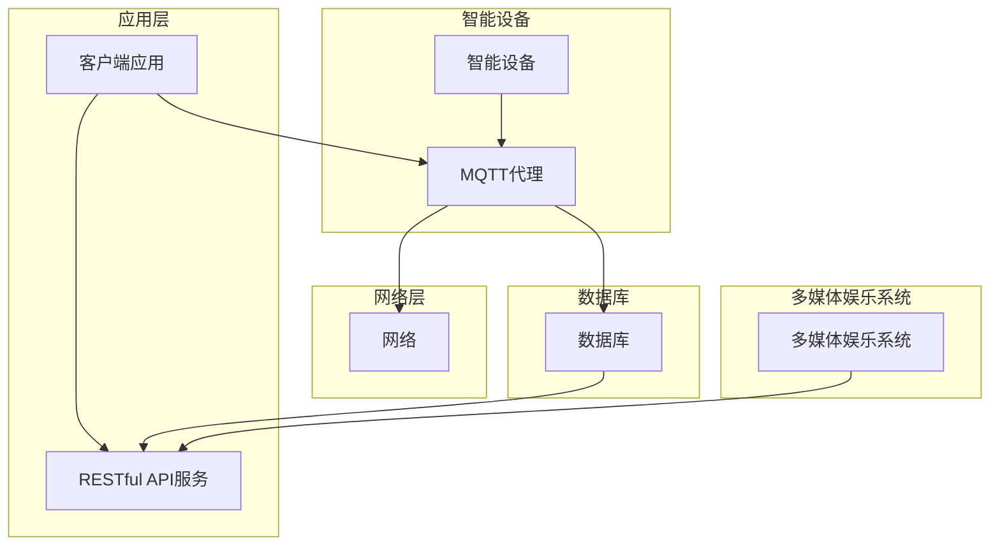

# 基于MQTT协议和RESTful API的智能家居多媒体娱乐系统

> 关键词：MQTT协议，RESTful API，智能家居，多媒体娱乐，物联网，边缘计算，用户体验

## 1. 背景介绍

随着物联网（IoT）技术的快速发展，智能家居市场迎来了爆发式增长。人们对于家庭自动化和智能化的需求日益增长，智能家居系统逐渐成为现代家庭生活的重要组成部分。智能家居系统通常集成了各种智能设备，如灯光控制、安防监控、环境监测、能源管理以及多媒体娱乐等。为了实现这些功能，智能家居系统需要一个稳定、高效、可靠的网络通信方案。

MQTT（Message Queuing Telemetry Transport）协议是一种轻量级的消息传输协议，适用于低带宽、高延迟的网络环境，非常适合物联网应用。RESTful API则是一种基于HTTP协议的API设计风格，它简单、灵活，易于实现，已成为Web服务和移动应用开发的标准。

本文将探讨如何结合MQTT协议和RESTful API构建一个智能家居多媒体娱乐系统，实现设备之间的互联互通，提供便捷、智能的家庭娱乐体验。

## 2. 核心概念与联系

### 2.1 核心概念

#### MQTT协议

MQTT协议是一种轻量级的消息传输协议，它基于发布/订阅（Pub/Sub）模式，允许客户端（发布者或订阅者）发布或订阅消息到服务器（代理），而无需建立持久的连接。MQTT协议具有以下特点：

- **轻量级**：协议开销小，适合低带宽、高延迟的网络环境。
- **发布/订阅模式**：客户端可以订阅特定的主题，服务器将匹配主题的消息推送给订阅者。
- **QoS服务质量**：MQTT支持三种服务质量（QoS）级别，以满足不同的消息传输需求。
- **持久连接**：连接在断开时，客户端可以恢复连接并接收之前丢失的消息。

#### RESTful API

RESTful API是一种基于HTTP协议的API设计风格，它使用统一的资源表示和HTTP方法（GET、POST、PUT、DELETE等）来访问和操作资源。RESTful API具有以下特点：

- **无状态**：服务器不存储客户端的状态信息，每次请求都是独立的。
- **统一接口**：使用标准化的接口设计，易于理解和实现。
- **易于缓存**：HTTP缓存机制可以提高性能和可扩展性。

### 2.2 架构流程图

智能家居多媒体娱乐系统的架构流程图如下：



## 3. 核心算法原理 & 具体操作步骤

### 3.1 算法原理概述

智能家居多媒体娱乐系统的核心算法原理主要包括以下几个部分：

- **设备控制**：通过MQTT协议实现智能设备与MQTT代理之间的通信，控制设备的开关、状态获取等功能。
- **数据存储**：使用RESTful API将设备数据存储到数据库中，便于查询和分析。
- **多媒体娱乐**：通过RESTful API实现多媒体内容的播放、暂停、停止等功能。
- **用户交互**：通过RESTful API实现用户对智能家居系统的操作和控制。

### 3.2 算法步骤详解

1. **设备初始化**：智能设备连接到MQTT代理，订阅相关主题，准备接收来自客户端的命令。
2. **客户端请求**：用户通过客户端应用发送控制请求，请求内容包含设备类型、操作类型、操作参数等信息。
3. **MQTT通信**：MQTT代理接收到客户端请求后，将请求内容转换为MQTT消息，发布到对应的主题。
4. **设备响应**：智能设备接收到MQTT消息后，执行相应的操作，并将操作结果返回给MQTT代理。
5. **数据存储**：RESTful API服务将设备状态信息存储到数据库中。
6. **多媒体娱乐**：用户通过客户端应用发送多媒体播放请求，RESTful API服务根据请求播放多媒体内容。
7. **用户交互**：用户通过客户端应用与智能家居系统进行交互，如查询设备状态、调整播放设置等。

### 3.3 算法优缺点

#### 优点

- **高效稳定**：MQTT协议轻量级，适用于低带宽、高延迟的网络环境，保证了系统的稳定性和高效性。
- **易于扩展**：RESTful API设计简单，易于扩展和集成。
- **易于实现**：MQTT和RESTful API都有成熟的库和框架，易于实现。

#### 缺点

- **安全性**：MQTT协议和RESTful API本身不提供安全性保证，需要额外的安全措施。
- **复杂性**：系统架构相对复杂，需要处理多种协议和数据格式。

### 3.4 算法应用领域

智能家居多媒体娱乐系统可以应用于以下领域：

- 家庭娱乐中心
- 智能社区
- 商业大厦
- 智能酒店

## 4. 数学模型和公式 & 详细讲解 & 举例说明

智能家居多媒体娱乐系统的核心算法主要涉及MQTT协议和RESTful API，其数学模型和公式相对简单，主要涉及网络传输速率、延迟、丢包率等指标。

### 4.1 数学模型构建

假设网络传输速率为 $R$，延迟为 $D$，丢包率为 $P$，则系统性能可以表示为：

$$
P_{sys} = R \times (1 - P) \times e^{-D}
$$

其中，$P_{sys}$ 为系统性能，$e$ 为自然对数的底数。

### 4.2 公式推导过程

系统性能 $P_{sys}$ 可以分解为以下三个部分：

- **网络传输速率 $R$**：表示网络能够传输的数据量。
- **丢包率 $P$**：表示数据包丢失的概率。
- **延迟 $D$**：表示数据传输的延迟时间。

因此，系统性能可以表示为：

$$
P_{sys} = R \times (1 - P) \times e^{-D}
$$

### 4.3 案例分析与讲解

假设智能家居多媒体娱乐系统的网络传输速率为1Mbps，延迟为100ms，丢包率为1%，则系统性能可以计算如下：

$$
P_{sys} = 1 \times (1 - 0.01) \times e^{-0.1} \approx 0.99
$$

这意味着系统性能约为99%，仍有1%的概率出现数据丢失或延迟过高的情况。为了提高系统性能，可以采取以下措施：

- 提高网络带宽，降低丢包率。
- 优化网络拓扑结构，降低延迟。
- 采用更可靠的传输协议，如TCP。
- 优化算法，减少计算量和延迟。

## 5. 项目实践：代码实例和详细解释说明

### 5.1 开发环境搭建

开发智能家居多媒体娱乐系统需要以下环境：

- 操作系统：Linux或Windows
- 开发工具：Python、Node.js等
- MQTT代理：Mosquitto、EMQX等
- RESTful API框架：Flask、Express等
- 数据库：MySQL、MongoDB等

### 5.2 源代码详细实现

以下是一个简单的Python示例，演示了如何使用paho-mqtt库连接到MQTT代理，并订阅一个主题：

```python
import paho.mqtt.client as mqtt

# MQTT代理地址和端口
broker_address = "192.168.1.10:1883"

# 创建MQTT客户端实例
client = mqtt.Client()

# 连接到MQTT代理
client.connect(broker_address)

# 订阅主题
client.subscribe("home/entertainment")

# 处理订阅消息
def on_message(client, userdata, message):
    print(f"Received message '{str(message.payload)}' on topic '{message.topic}' with QoS {message.qos}")

# 绑定消息处理函数
client.on_message = on_message

# 循环等待消息
client.loop_forever()
```

### 5.3 代码解读与分析

上述代码首先导入了paho-mqtt库，并创建了一个MQTT客户端实例。然后，连接到指定的MQTT代理，并订阅了"home/entertainment"主题。最后，定义了一个消息处理函数，用于接收和打印订阅主题的消息。

### 5.4 运行结果展示

运行上述代码后，MQTT客户端将连接到代理，并订阅了"home/entertainment"主题。当有消息发布到该主题时，客户端将接收到消息并打印出来。

## 6. 实际应用场景

智能家居多媒体娱乐系统可以应用于以下场景：

- **家庭影院**：通过系统控制电视、投影仪、音响等设备，实现家庭影院的观影体验。
- **智能音箱**：通过语音控制播放音乐、新闻、天气预报等内容。
- **健身设备**：通过系统控制健身设备，如跑步机、动感单车等，实现智能健身管理。
- **智能照明**：通过系统控制灯光，实现场景化照明，如影院模式、阅读模式等。

## 7. 工具和资源推荐

### 7.1 学习资源推荐

- 《MQTT Essentials》
- 《RESTful API Design》
- 《Home Automation with Raspberry Pi》
- 《Designing Internet of Things Systems》

### 7.2 开发工具推荐

- Python：用于编写智能家居多媒体娱乐系统应用程序。
- Node.js：用于构建RESTful API服务。
- MQTT代理：Mosquitto、EMQX等。
- RESTful API框架：Flask、Express等。

### 7.3 相关论文推荐

- 《MQTT: A Protocol for Efficient Message Transport》
- 《RESTful API Design: Guidelines for RESTful API Development》

## 8. 总结：未来发展趋势与挑战

### 8.1 研究成果总结

本文介绍了基于MQTT协议和RESTful API的智能家居多媒体娱乐系统的原理、架构、实现方法和应用场景。通过结合MQTT协议的轻量级通信和RESTful API的易用性，智能家居多媒体娱乐系统可以实现设备之间的互联互通，提供便捷、智能的家庭娱乐体验。

### 8.2 未来发展趋势

随着物联网、人工智能、5G等技术的发展，智能家居多媒体娱乐系统将呈现以下发展趋势：

- **更加智能化**：通过人工智能技术，实现更智能化的设备控制和场景化服务。
- **更加便捷**：通过语音、手势等自然交互方式，提高用户体验。
- **更加开放**：支持更多第三方设备和服务的接入，构建更加开放的生态系统。

### 8.3 面临的挑战

智能家居多媒体娱乐系统在发展过程中也面临着以下挑战：

- **安全性**：智能家居系统涉及到用户隐私和数据安全，需要加强安全防护。
- **兼容性**：智能家居设备种类繁多，需要确保系统与各种设备兼容。
- **标准化**：需要制定统一的智能家居接口标准，促进设备互联互通。

### 8.4 研究展望

未来，智能家居多媒体娱乐系统将朝着更加智能化、个性化、安全化和标准化的方向发展。通过技术创新和应用场景拓展，智能家居多媒体娱乐系统将为用户带来更加便捷、舒适、智能的生活体验。

## 9. 附录：常见问题与解答

**Q1：MQTT协议和RESTful API有什么区别？**

A：MQTT协议是一种轻量级的消息传输协议，适用于物联网应用；RESTful API是一种基于HTTP协议的API设计风格，适用于Web服务和移动应用开发。两者在应用场景和设计理念上有所不同，但都可以实现设备之间的通信和数据交互。

**Q2：如何确保智能家居系统的安全性？**

A：确保智能家居系统的安全性需要从以下几个方面入手：

- 使用安全的通信协议，如TLS/SSL。
- 限制访问权限，如使用用户名和密码验证。
- 定期更新软件和设备固件，修复已知漏洞。
- 对敏感数据进行加密存储和传输。

**Q3：智能家居系统如何实现跨平台兼容？**

A：实现智能家居系统的跨平台兼容需要：

- 使用统一的通信协议和数据格式。
- 支持多种操作系统和设备。
- 提供多种接入方式，如手机应用、网页端等。

**Q4：如何优化智能家居系统的性能？**

A：优化智能家居系统的性能可以从以下几个方面入手：

- 优化网络连接，提高网络带宽和稳定性。
- 优化设备控制算法，减少不必要的通信和数据传输。
- 使用高性能的硬件设备，如高性能的CPU、内存等。
- 优化系统架构，提高系统可扩展性。

---

作者：禅与计算机程序设计艺术 / Zen and the Art of Computer Programming