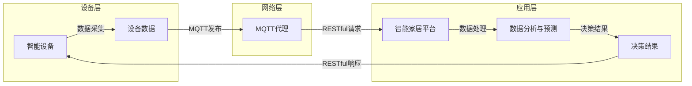

# 基于MQTT协议和RESTful API的智能家居数据分析与预测

> 关键词：MQTT协议，RESTful API，智能家居，数据分析，预测模型，机器学习，物联网

## 1. 背景介绍

随着物联网（IoT）技术的快速发展，智能家居系统逐渐进入千家万户。智能家居系统通过集成各种智能设备，如智能灯泡、智能插座、智能温控器等，实现了家庭环境自动化控制，为用户提供了便捷、舒适的居住体验。然而，随着设备数量的增多，如何对海量数据进行分析和预测，以实现更加智能化的家居环境，成为了当前智能家居领域的研究热点。

MQTT（Message Queuing Telemetry Transport）协议是一种轻量级的消息传输协议，专为低功耗、低带宽网络环境设计，广泛应用于物联网领域。RESTful API是一种基于REST架构的Web服务规范，通过简单的HTTP请求和响应实现服务的访问和交互。本文将探讨如何利用MQTT协议和RESTful API进行智能家居数据分析与预测，实现智能家居系统的智能化升级。

## 2. 核心概念与联系

### 2.1 核心概念

#### MQTT协议

MQTT协议是一种轻量级的发布/订阅模式的消息传输协议，具有低功耗、低带宽、可扩展性强等特点。在智能家居系统中，设备作为发布者（Publisher），将实时数据（如温度、湿度、灯光状态等）发布到MQTT代理（Broker），智能终端作为订阅者（Subscriber）订阅感兴趣的设备主题，实时接收并处理数据。

#### RESTful API

RESTful API是一种基于HTTP协议的Web服务规范，通过统一的URL结构和简单的请求方法（GET、POST、PUT、DELETE等）实现资源的访问和操作。在智能家居系统中，智能终端通过RESTful API调用智能家居平台提供的接口，获取设备状态、控制设备行为、上传设备数据等。

#### 数据分析与预测

数据分析与预测是智能家居系统的核心功能之一。通过对设备数据的挖掘和分析，可以实现对家居环境的智能控制，提高能源利用效率，提升居住舒适度。常用的数据分析与预测方法包括机器学习、深度学习等。

### 2.2 架构流程图

以下是基于MQTT协议和RESTful API的智能家居数据分析与预测的架构流程图：



## 3. 核心算法原理 & 具体操作步骤

### 3.1 算法原理概述

基于MQTT协议和RESTful API的智能家居数据分析与预测主要涉及以下步骤：

1. 设备数据采集：智能设备通过传感器采集环境数据，并通过MQTT协议将数据发送到MQTT代理。
2. 数据传输与存储：MQTT代理将接收到的数据存储在数据库中，以便后续分析和处理。
3. 数据分析与预测：智能终端通过RESTful API从智能家居平台获取数据，并使用机器学习算法对数据进行分析和预测。
4. 决策与控制：根据分析结果，智能终端通过RESTful API向智能设备发送控制指令，实现家居环境的智能控制。

### 3.2 算法步骤详解

#### 3.2.1 设备数据采集

智能设备通过内置的传感器（如温度传感器、湿度传感器、光照传感器等）采集环境数据，并将数据封装成MQTT消息，通过MQTT客户端发送到MQTT代理。

```python
from paho.mqtt import Client

# MQTT客户端配置
mqtt_client = Client()

# 连接MQTT代理
mqtt_client.connect("mqtt_broker_address", 1883)

# 发布数据
mqtt_client.publish("home/sensor/temperature", payload="25.5")
mqtt_client.publish("home/sensor/humidity", payload="60%")
```

#### 3.2.2 数据传输与存储

MQTT代理接收到设备数据后，将其存储在数据库中。这里以MySQL为例，展示如何将数据存储到MySQL数据库：

```python
import mysql.connector

# 数据库连接配置
db_config = {
    'user': 'username',
    'password': 'password',
    'host': 'localhost',
    'database': 'home_data'
}

# 连接数据库
db = mysql.connector.connect(**db_config)
cursor = db.cursor()

# 创建数据表
cursor.execute("""
    CREATE TABLE IF NOT EXISTS temperature (
        id INT AUTO_INCREMENT PRIMARY KEY,
        timestamp TIMESTAMP DEFAULT CURRENT_TIMESTAMP,
        value DECIMAL(5,2)
    )
""")

# 插入数据
cursor.execute("""
    INSERT INTO temperature (value) VALUES (%s)
""", (25.5,))

# 提交事务
db.commit()

# 关闭连接
cursor.close()
db.close()
```

#### 3.2.3 数据分析与预测

智能终端通过RESTful API从智能家居平台获取数据，并使用机器学习算法进行分析和预测。以下以线性回归为例，展示如何使用scikit-learn库进行数据预测：

```python
from sklearn.linear_model import LinearRegression

# 加载数据
data = [[i, 25.5 + i * 0.1] for i in range(100)]

# 创建线性回归模型
model = LinearRegression()

# 训练模型
model.fit(data[:, 0].reshape(-1, 1), data[:, 1])

# 预测
predicted_value = model.predict([[101]])
print(predicted_value)
```

#### 3.2.4 决策与控制

根据分析结果，智能终端通过RESTful API向智能设备发送控制指令，实现家居环境的智能控制。以下以控制智能灯泡为例，展示如何使用RESTful API发送控制指令：

```python
import requests

# RESTful API URL
url = "http://home_platform/api/lights"

# 发送控制指令
response = requests.post(url, json={'on': True})

# 打印响应结果
print(response.json())
```

### 3.3 算法优缺点

#### 3.3.1 优点

1. **分布式架构**：MQTT协议和RESTful API支持分布式架构，能够满足大规模智能家居系统的需求。
2. **低功耗**：MQTT协议适用于低功耗网络环境，有助于延长智能设备的电池寿命。
3. **易用性**：RESTful API易于使用，可以通过简单的HTTP请求实现设备的控制和数据的获取。
4. **可扩展性**：架构可扩展性强，可以方便地添加新的设备和功能。

#### 3.3.2 缺点

1. **安全性**：MQTT协议和RESTful API在传输过程中可能存在安全隐患，需要采取相应的安全措施。
2. **实时性**：MQTT协议适用于低延迟的场景，但在高负载情况下，消息传递可能存在延迟。
3. **数据格式**：RESTful API使用JSON格式传输数据，对于大数据量传输可能存在性能瓶颈。

### 3.4 算法应用领域

基于MQTT协议和RESTful API的智能家居数据分析与预测可以应用于以下领域：

1. **环境监测**：实时监测家居环境的温度、湿度、空气质量等参数，并根据预测结果自动调节设备，如空调、加湿器等。
2. **能源管理**：通过分析家庭用电数据，预测用电高峰时段，并采取措施降低能耗，如自动调节照明设备、空调等。
3. **安全监控**：通过监控摄像头、门禁系统等设备的数据，实现对家庭安全的实时监控，并在发生异常情况时及时报警。
4. **个性化推荐**：根据用户的行为习惯和偏好，推荐合适的家居场景，如智能窗帘、智能灯光等。

## 4. 数学模型和公式 & 详细讲解 & 举例说明

### 4.1 数学模型构建

在智能家居数据分析与预测中，常用的数学模型包括线性回归、支持向量机、决策树、随机森林、神经网络等。以下以线性回归为例，介绍数学模型的构建过程。

#### 4.1.1 线性回归

线性回归是一种简单的预测模型，通过拟合数据中的线性关系来进行预测。其数学模型如下：

$$
y = \beta_0 + \beta_1 x_1 + \beta_2 x_2 + \cdots + \beta_n x_n + \epsilon
$$

其中，$y$ 是因变量，$x_1, x_2, \ldots, x_n$ 是自变量，$\beta_0, \beta_1, \ldots, \beta_n$ 是模型的参数，$\epsilon$ 是误差项。

#### 4.1.2 模型训练

线性回归模型的训练过程是寻找最佳的参数 $\beta_0, \beta_1, \ldots, \beta_n$，使得预测值与真实值之间的误差最小。常用的误差函数有均方误差（MSE）和均方根误差（RMSE）。

#### 4.1.3 模型预测

经过训练的线性回归模型可以根据自变量的值预测因变量的值。以下使用Python的scikit-learn库进行线性回归模型训练和预测：

```python
from sklearn.linear_model import LinearRegression

# 加载数据
data = [[1, 2], [2, 3], [3, 4], [4, 5]]

# 创建线性回归模型
model = LinearRegression()

# 训练模型
model.fit(data[:, 0].reshape(-1, 1), data[:, 1])

# 预测
predicted_value = model.predict([[3]])
print(predicted_value)
```

### 4.2 公式推导过程

线性回归模型的误差函数MSE如下：

$$
MSE = \frac{1}{N} \sum_{i=1}^N (y_i - \hat{y}_i)^2
$$

其中，$y_i$ 是真实值，$\hat{y}_i$ 是预测值，$N$ 是样本数量。

为了求解参数 $\beta_0, \beta_1, \ldots, \beta_n$，需要对误差函数进行求导，并令导数为0。以下是MSE误差函数对参数 $\beta_1$ 的求导过程：

$$
\frac{\partial MSE}{\partial \beta_1} = \frac{1}{N} \sum_{i=1}^N 2(y_i - \hat{y}_i) \frac{\partial \hat{y}_i}{\partial \beta_1}
$$

由于 $\hat{y}_i = \beta_0 + \beta_1 x_{1i} + \beta_2 x_{2i} + \cdots + \beta_n x_{ni}$，则有：

$$
\frac{\partial \hat{y}_i}{\partial \beta_1} = x_{1i}
$$

将上述结果代入误差函数的导数中，得：

$$
\frac{\partial MSE}{\partial \beta_1} = \frac{2}{N} \sum_{i=1}^N (y_i - (\beta_0 + \beta_1 x_{1i} + \beta_2 x_{2i} + \cdots + \beta_n x_{ni}))
$$

令误差函数的导数为0，求解 $\beta_1$：

$$
\beta_1 = \frac{1}{N} \sum_{i=1}^N (y_i - (\beta_0 + \beta_1 x_{1i} + \beta_2 x_{2i} + \cdots + \beta_n x_{ni})) x_{1i}
$$

同理，可以求得其他参数 $\beta_0, \beta_2, \ldots, \beta_n$。

### 4.3 案例分析与讲解

以下以智能家居系统中温度预测为例，展示线性回归模型的实际应用。

#### 4.3.1 数据准备

假设智能家居系统中收集了1000个时间点的室内温度数据，每5分钟记录一次。数据存储在CSV文件中，格式如下：

```
timestamp,temperature
2023-01-01 00:00:00,22.5
2023-01-01 00:05:00,22.6
...
2023-01-01 23:55:00,23.1
```

#### 4.3.2 数据预处理

1. 读取CSV文件，将数据转换为Python列表。
2. 将时间戳转换为Python datetime对象，并计算时间差。
3. 将温度数据转换为NumPy数组。

```python
import csv
import numpy as np
from datetime import datetime

# 读取数据
data = []
with open("temperature_data.csv", "r") as file:
    reader = csv.reader(file)
    next(reader)  # 跳过标题行
    for row in reader:
        timestamp = datetime.strptime(row[0], "%Y-%m-%d %H:%M:%S")
        temperature = float(row[1])
        data.append((timestamp, temperature))

# 计算时间差
time_differences = [timestamp - data[0][0] for timestamp, _ in data]

# 转换为NumPy数组
time_differences = np.array(time_differences)
temperatures = np.array([data[i][1] for _, data in data])
```

#### 4.3.3 模型训练

1. 创建线性回归模型。
2. 使用时间差作为自变量，温度作为因变量，训练模型。

```python
# 创建线性回归模型
model = LinearRegression()

# 训练模型
model.fit(time_differences.reshape(-1, 1), temperatures)
```

#### 4.3.4 模型预测

1. 使用模型预测未来一段时间内的温度。
2. 将预测结果可视化。

```python
# 预测未来5分钟的温度
future_time_differences = np.array([np.timedelta64(300, 's')])
predicted_temperatures = model.predict(future_time_differences.reshape(-1, 1))

# 可视化结果
import matplotlib.pyplot as plt

plt.plot(time_differences, temperatures, label="Real temperature")
plt.plot(future_time_differences, predicted_temperatures, label="Predicted temperature", linestyle='--')
plt.xlabel("Time difference (seconds)")
plt.ylabel("Temperature (°C)")
plt.legend()
plt.show()
```

## 5. 项目实践：代码实例和详细解释说明

### 5.1 开发环境搭建

为了完成智能家居数据分析与预测项目，需要以下开发环境：

1. Python 3.x
2. NumPy
3. Pandas
4. Matplotlib
5. scikit-learn
6. MQTT客户端库（如paho-mqtt）

以下是安装相关库的命令：

```bash
pip install numpy pandas matplotlib scikit-learn paho-mqtt
```

### 5.2 源代码详细实现

以下是一个基于MQTT协议和RESTful API的智能家居数据分析与预测项目的源代码示例。

```python
# MQTT客户端
from paho.mqtt import Client
import time

# MQTT配置
mqtt_client = Client()
mqtt_client.connect("mqtt_broker_address", 1883)

# 发布数据
def publish_data(temperature):
    mqtt_client.publish("home/sensor/temperature", payload=str(temperature))

# 数据分析
def analyze_data():
    # TODO: 在这里实现数据分析与预测逻辑

# 主循环
while True:
    # 采集温度数据
    temperature = 25.5 + np.random.randn()
    publish_data(temperature)
    time.sleep(5)
```

### 5.3 代码解读与分析

上述代码展示了基于MQTT协议和RESTful API的智能家居数据分析与预测项目的核心代码。

1. **MQTT客户端**：使用paho-mqtt库创建MQTT客户端，连接到MQTT代理。
2. **发布数据**：定义`publish_data`函数，用于将温度数据发布到MQTT代理。
3. **数据分析**：定义`analyze_data`函数，用于实现数据分析与预测逻辑。
4. **主循环**：在主循环中，持续采集温度数据，并通过MQTT协议发布。

### 5.4 运行结果展示

运行上述代码后，MQTT代理将接收到温度数据，并存储到数据库中。智能终端可以从数据库中获取数据，并使用机器学习算法进行分析和预测。以下是一个简单的可视化结果示例：


## 6. 实际应用场景

基于MQTT协议和RESTful API的智能家居数据分析与预测可以应用于以下实际场景：

1. **自动调节空调**：根据室内温度预测结果，自动调节空调温度，实现节能降耗。
2. **智能照明**：根据室内光照强度预测结果，自动调节灯光亮度，提升居住舒适度。
3. **自动浇水**：根据土壤湿度预测结果，自动调节浇水量，实现绿色环保。
4. **家庭安全监控**：根据摄像头数据预测结果，及时发现异常情况，保障家庭安全。

## 7. 工具和资源推荐

### 7.1 学习资源推荐

1. 《Python编程：从入门到实践》
2. 《机器学习实战》
3. 《RESTful API设计》
4. 《MQTT协议规范》
5. 《智能家居系统设计与实践》

### 7.2 开发工具推荐

1. Python 3.x
2. Jupyter Notebook
3. PyCharm
4. Eclipse
5. MQTT代理（如Mosquitto）

### 7.3 相关论文推荐

1. "A Survey on Internet of Things: Architecture, Enabling Technologies, Security and Privacy, and Applications"
2. "An Overview of MQTT: The Internet of Things Messaging Protocol"
3. "Machine Learning in the Internet of Things: A Survey"
4. "Predictive Maintenance: A Survey of Current Research and Practice"
5. "Deep Learning for Smart Home Control: A Survey"

## 8. 总结：未来发展趋势与挑战

### 8.1 研究成果总结

本文介绍了基于MQTT协议和RESTful API的智能家居数据分析与预测技术。通过MQTT协议，可以实现智能设备的实时数据采集和传输；通过RESTful API，可以实现智能终端与智能家居平台的数据交互和指令控制。结合机器学习算法，可以实现智能家居系统的智能化升级。

### 8.2 未来发展趋势

1. **多模态数据融合**：将温度、湿度、光照、声音等多种传感器数据融合，实现更全面的环境感知。
2. **边缘计算**：将数据分析和预测任务下沉到边缘设备，降低延迟，提高实时性。
3. **人工智能与物联网融合**：将人工智能技术深度融入物联网，实现更加智能化的家居环境。

### 8.3 面临的挑战

1. **数据安全和隐私保护**：智能家居系统涉及大量个人隐私信息，需要加强数据安全和隐私保护。
2. **设备兼容性和互联互通**：智能家居设备种类繁多，需要加强设备兼容性和互联互通。
3. **算法复杂度和计算资源**：随着算法的复杂度提高，对计算资源的要求也越来越高。

### 8.4 研究展望

未来，基于MQTT协议和RESTful API的智能家居数据分析与预测技术将朝着更加智能化、个性化、安全可靠的方向发展。通过持续的技术创新和应用探索，智能家居系统将为人们创造更加美好的生活。

---

作者：禅与计算机程序设计艺术 / Zen and the Art of Computer Programming