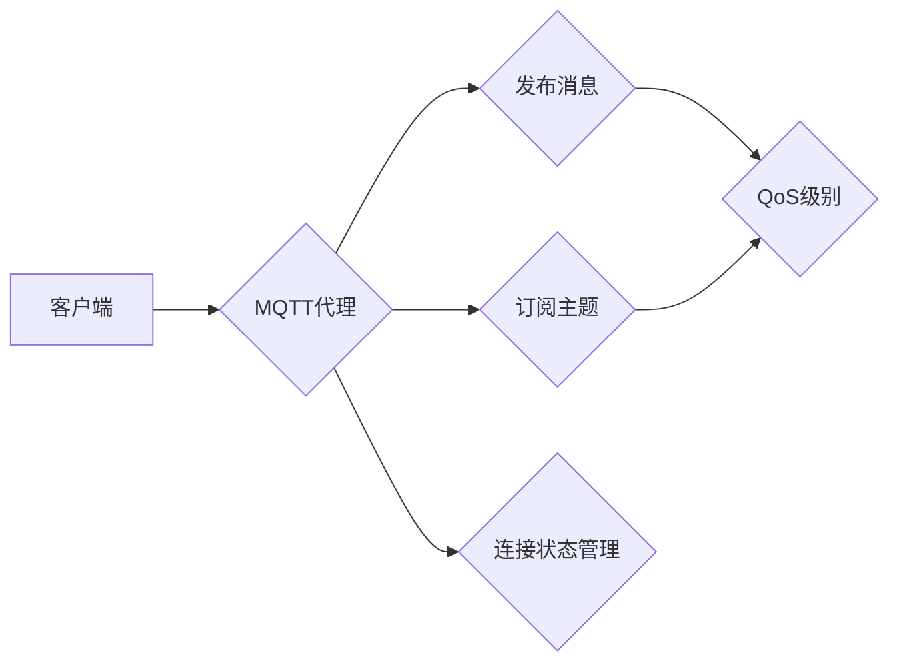
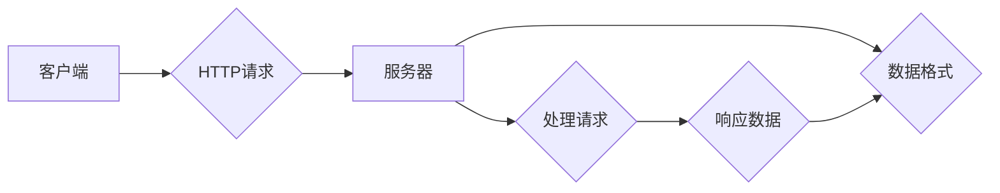

> 关键词：MQTT协议，RESTful API，智能家居，远程监控，物联网，嵌入式系统，数据通信，安全性

## 1. 背景介绍

随着物联网技术的快速发展，智能家居市场迅速扩张。智能家居系统通过将家中的各种设备联网，实现远程监控和控制，提高居住舒适性和便利性。为了实现高效、可靠的数据通信，选择合适的通信协议至关重要。本文将探讨基于MQTT协议和RESTful API的智能家居远程监控系统设计，旨在为智能家居系统提供一种安全、高效、易于扩展的远程监控解决方案。

### 1.1 问题的由来

智能家居系统通常由多个设备组成，如智能灯泡、智能插座、智能门锁等。这些设备需要实时传输数据，如设备状态、环境参数等。传统的通信协议，如HTTP、CoAP等，在物联网环境下存在以下问题：

- **网络开销大**：HTTP等协议需要建立TCP连接，通信开销较大，不适用于低功耗的物联网设备。
- **安全性不足**：HTTP等协议明文传输数据，容易受到中间人攻击。
- **不适合低功耗设备**：HTTP等协议的频繁连接和断开，不适合低功耗的物联网设备。

### 1.2 研究现状

MQTT（Message Queuing Telemetry Transport）协议是一种轻量级的物联网通信协议，适用于低功耗、低带宽的设备。RESTful API（Representational State Transfer）则是一种基于HTTP协议的架构风格，适用于构建可扩展的Web服务。

### 1.3 研究意义

本文提出的基于MQTT协议和RESTful API的智能家居远程监控系统，旨在解决传统通信协议在智能家居应用中的不足，提高系统的安全性、可靠性和可扩展性。

### 1.4 本文结构

本文结构如下：

- 第2章介绍MQTT协议和RESTful API的核心概念。
- 第3章阐述智能家居远程监控系统的架构设计。
- 第4章分析系统中的关键技术和算法。
- 第5章给出系统实现的代码实例。
- 第6章讨论系统的实际应用场景。
- 第7章介绍相关的工具和资源。
- 第8章总结研究成果，展望未来发展趋势和挑战。
- 第9章提供常见问题的解答。

## 2. 核心概念与联系

### 2.1 MQTT协议

MQTT协议是一种轻量级的消息发布/订阅协议，适用于低功耗、低带宽、不可靠的网络环境。其主要特点如下：

- **发布/订阅模式**：客户端可以订阅感兴趣的主题，当有消息发布到这些主题时，MQTT代理会将消息转发给所有订阅该主题的客户端。
- **质量服务等级（QoS）**：MQTT协议支持三种QoS级别，用于保证消息的可靠传输。
- **连接状态**：MQTT客户端可以在连接断开时保持会话状态，以便在重新连接后继续传输消息。

Mermaid流程图如下：



### 2.2 RESTful API

RESTful API是一种基于HTTP协议的架构风格，其主要特点如下：

- **无状态**：每个请求都是独立的，服务器不保存任何客户端状态。
- **统一接口**：使用统一的接口风格，如GET、POST、PUT、DELETE等。
- **数据格式**：支持JSON、XML等多种数据格式。

Mermaid流程图如下：



### 2.3 联系

MQTT协议和RESTful API可以结合使用，实现智能家居远程监控系统。MQTT协议负责设备之间的实时通信，RESTful API则负责设备状态数据的查询和远程控制。

## 3. 核心算法原理 & 具体操作步骤

### 3.1 算法原理概述

智能家居远程监控系统主要包括以下几个部分：

- **设备端**：负责收集设备状态数据，并通过MQTT协议将数据发送到MQTT代理。
- **MQTT代理**：接收设备端发送的消息，并将消息转发给订阅了相应主题的客户端。
- **客户端**：通过RESTful API查询设备状态，或通过MQTT协议接收设备端发送的实时数据。

### 3.2 算法步骤详解

**设备端**：

1. 连接到MQTT代理，建立MQTT连接。
2. 发布设备状态数据到MQTT主题。
3. 根据需要订阅MQTT主题，接收实时数据。

**MQTT代理**：

1. 接收设备端发布的消息。
2. 根据消息的QoS级别，确保消息的可靠传输。
3. 将消息转发给订阅了相应主题的客户端。

**客户端**：

1. 通过RESTful API查询设备状态。
2. 订阅MQTT主题，接收实时数据。
3. 处理接收到的数据，并更新界面或执行相应的操作。

### 3.3 算法优缺点

**优点**：

- **高效**：MQTT协议轻量级，适合低功耗设备。
- **可靠**：支持多种QoS级别，保证消息的可靠传输。
- **可扩展**：RESTful API易于扩展，支持多种数据格式。

**缺点**：

- **安全性**：MQTT协议本身不支持加密，需要结合其他安全机制。
- **复杂度**：结合MQTT协议和RESTful API会增加系统复杂度。

### 3.4 算法应用领域

智能家居远程监控系统适用于以下领域：

- **家庭自动化**：监控和控制家中的各种设备，如灯泡、插座、门锁等。
- **环境监测**：监测家中的温度、湿度、空气质量等环境参数。
- **安防监控**：监控家中的安全情况，如门窗状态、异常入侵等。

## 4. 数学模型和公式 & 详细讲解 & 举例说明

### 4.1 数学模型构建

智能家居远程监控系统的数学模型主要包括以下部分：

- **设备状态模型**：描述设备的状态，如开关状态、亮度等。
- **环境参数模型**：描述环境参数，如温度、湿度、空气质量等。
- **数据传输模型**：描述数据在设备端、MQTT代理和客户端之间的传输过程。

### 4.2 公式推导过程

由于智能家居远程监控系统涉及到的数学模型较为复杂，此处不进行详细的公式推导。

### 4.3 案例分析与讲解

以智能灯泡为例，其状态模型可以表示为：

$$
S = \begin{pmatrix}
L_1 \\
L_2 \\
\vdots \\
L_n
\end{pmatrix}
$$

其中，$L_i$ 表示第 $i$ 个灯泡的开关状态，取值为0或1。

环境参数模型可以表示为：

$$
E = \begin{pmatrix}
T \\
H \\
\vdots \\
C
\end{pmatrix}
$$

其中，$T$、$H$、$C$ 分别表示温度、湿度和空气质量。

数据传输模型可以表示为：

$$
D = \begin{pmatrix}
d_{11} & d_{12} & \cdots & d_{1N} \\
d_{21} & d_{22} & \cdots & d_{2N} \\
\vdots & \vdots & \ddots & \vdots \\
d_{M1} & d_{M2} & \cdots & d_{MN}
\end{pmatrix}
$$

其中，$d_{ij}$ 表示第 $i$ 个设备在 $j$ 个时刻发送的数据。

## 5. 项目实践：代码实例和详细解释说明

### 5.1 开发环境搭建

以下是使用Python开发智能家居远程监控系统的环境搭建步骤：

1. 安装Python 3.8及以上版本。
2. 安装paho-mqtt库：`pip install paho-mqtt`
3. 安装requests库：`pip install requests`

### 5.2 源代码详细实现

**设备端**：

```python
import paho.mqtt.client as mqtt

def on_connect(client, userdata, flags, rc):
    print("Connected with result code "+str(rc))
    client.subscribe("home/devices/#")

def on_message(client, userdata, msg):
    print(msg.topic+" "+str(msg.payload))

client = mqtt.Client()
client.on_connect = on_connect
client.on_message = on_message

client.connect("mqtt.example.com", 1883, 60)

client.loop_forever()
```

**MQTT代理**：

```python
# 代码省略，此处可以使用开源MQTT代理软件，如Mosquitto
```

**客户端**：

```python
import requests

def get_device_status(device_id):
    url = f"http://api.example.com/devices/{device_id}"
    response = requests.get(url)
    return response.json()

def set_device_status(device_id, status):
    url = f"http://api.example.com/devices/{device_id}"
    data = {"status": status}
    response = requests.post(url, json=data)
    return response.status_code
```

### 5.3 代码解读与分析

设备端代码使用paho-mqtt库连接到MQTT代理，订阅主题，并打印收到的消息。MQTT代理代码省略，可以使用开源MQTT代理软件，如Mosquitto。客户端代码使用requests库通过RESTful API获取设备状态和设置设备状态。

## 6. 实际应用场景

### 6.1 家庭自动化

智能家居远程监控系统可以方便地实现家庭自动化，如远程控制灯光、插座等设备。

### 6.2 环境监测

智能家居远程监控系统可以实时监测家中的温度、湿度、空气质量等环境参数，并在异常情况发生时发出警报。

### 6.3 安防监控

智能家居远程监控系统可以监控家中的安全情况，如门窗状态、异常入侵等，并在异常情况发生时发出警报。

## 7. 工具和资源推荐

### 7.1 学习资源推荐

- 《物联网通信协议》
- 《Python编程：从入门到实践》
- 《RESTful API设计指南》

### 7.2 开发工具推荐

- Python开发环境
- MQTT代理软件，如Mosquitto
- RESTful API开发工具，如Postman

### 7.3 相关论文推荐

- 《MQTT协议》
- 《RESTful API设计指南》

## 8. 总结：未来发展趋势与挑战

### 8.1 研究成果总结

本文提出了基于MQTT协议和RESTful API的智能家居远程监控系统，并介绍了系统的设计、实现和应用。该系统具有以下特点：

- 基于MQTT协议，适用于低功耗、低带宽的物联网设备。
- 基于RESTful API，支持设备状态数据的查询和远程控制。
- 系统结构简单，易于扩展。

### 8.2 未来发展趋势

未来智能家居远程监控系统将朝着以下方向发展：

- **边缘计算**：将部分数据处理和决策逻辑迁移到边缘设备，降低延迟，提高效率。
- **人工智能**：结合人工智能技术，实现更智能的设备控制和决策。
- **安全性**：加强系统的安全性，防止数据泄露和设备被恶意攻击。

### 8.3 面临的挑战

智能家居远程监控系统面临着以下挑战：

- **安全性**：如何保证数据传输的安全性，防止数据泄露和设备被恶意攻击。
- **可靠性**：如何提高系统的可靠性，确保设备稳定运行。
- **可扩展性**：如何提高系统的可扩展性，支持更多设备和功能。

### 8.4 研究展望

未来研究可以从以下方面进行：

- 研究更安全的通信协议，如TLS加密的MQTT协议。
- 研究更可靠的系统架构，如冗余设计、故障转移等。
- 研究更智能的设备控制和决策算法，如基于人工智能的预测性维护。

## 9. 附录：常见问题与解答

**Q1：什么是MQTT协议？**

A：MQTT协议是一种轻量级的物联网通信协议，适用于低功耗、低带宽、不可靠的网络环境。

**Q2：什么是RESTful API？**

A：RESTful API是一种基于HTTP协议的架构风格，适用于构建可扩展的Web服务。

**Q3：MQTT协议和RESTful API如何结合使用？**

A：MQTT协议负责设备之间的实时通信，RESTful API负责设备状态数据的查询和远程控制。

**Q4：智能家居远程监控系统的安全性如何保证？**

A：可以通过以下方式保证系统的安全性：

- 使用TLS加密的MQTT协议。
- 对API接口进行权限控制。
- 定期更新系统和设备固件。

**Q5：智能家居远程监控系统如何实现可扩展性？**

A：可以通过以下方式实现系统的可扩展性：

- 使用模块化的设计，将不同的功能模块分离。
- 采用标准化接口，方便扩展新的功能。
- 使用容器化技术，提高系统的部署和扩展效率。

作者：禅与计算机程序设计艺术 / Zen and the Art of Computer Programming