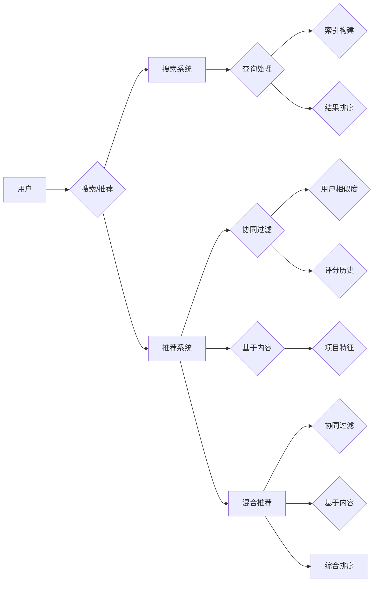

# 传统搜索推荐系统的价值

> 关键词：搜索推荐系统，信息检索，协同过滤，基于内容的推荐，混合推荐系统，机器学习，用户行为分析

## 1. 背景介绍

随着互联网的普及和用户在线行为的爆炸式增长，信息过载成为了一个普遍问题。为了帮助用户从海量的信息中快速找到他们感兴趣的内容，搜索推荐系统（Search & Recommendation Systems）应运而生。这些系统旨在通过分析用户的行为和偏好，为他们提供个性化的内容推荐，从而提升用户体验。

搜索推荐系统的发展经历了从传统的基于关键词匹配的搜索系统到现代的复杂机器学习模型的演变。尽管现代推荐系统在技术上取得了巨大的进步，但传统搜索推荐系统依然具有重要的价值。本文将深入探讨传统搜索推荐系统的原理、优势和应用，并展望其未来的发展趋势。

## 2. 核心概念与联系

### 2.1 核心概念

- **搜索系统**：搜索系统的主要功能是帮助用户通过关键词快速找到相关的信息。它通常包括索引构建、查询处理和结果排序等步骤。
- **推荐系统**：推荐系统旨在为用户推荐他们可能感兴趣的内容。它通常使用协同过滤、基于内容的推荐或混合推荐方法来实现。
- **协同过滤**：协同过滤是一种基于用户相似度的推荐方法，它通过分析用户的评分历史来预测用户对未知项目的偏好。
- **基于内容的推荐**：基于内容的推荐通过分析项目的特征和用户的偏好来推荐相似的内容。
- **混合推荐系统**：混合推荐系统结合了协同过滤和基于内容的推荐方法，以提供更全面的推荐。

### 2.2 核心概念原理和架构的 Mermaid 流程图



## 3. 核心算法原理 & 具体操作步骤

### 3.1 算法原理概述

**搜索系统**：

- **索引构建**：通过分析文档内容和结构，创建倒排索引，以便快速查找包含特定关键词的文档。
- **查询处理**：解析用户查询，提取关键词，然后使用倒排索引查找相关文档。
- **结果排序**：根据文档与查询的相关性对搜索结果进行排序。

**推荐系统**：

- **协同过滤**：计算用户之间的相似度，然后推荐与相似用户有相似评分的项目。
- **基于内容的推荐**：分析项目的特征，然后推荐与用户偏好相似的项目。
- **混合推荐**：结合协同过滤和基于内容的推荐方法，提供更全面的推荐。

### 3.2 算法步骤详解

**搜索系统**：

1. **文档处理**：对文档进行分词、去除停用词等预处理。
2. **索引构建**：为每个词构建倒排索引，记录包含该词的文档列表。
3. **查询处理**：解析用户查询，提取关键词。
4. **查找相关文档**：使用倒排索引查找包含关键词的文档。
5. **结果排序**：根据文档与查询的相关性对结果进行排序。

**推荐系统**：

1. **用户相似度计算**：根据用户的评分历史计算用户之间的相似度。
2. **项目相似度计算**：分析项目的特征，计算项目之间的相似度。
3. **推荐生成**：根据用户相似度和项目相似度生成推荐列表。

### 3.3 算法优缺点

**搜索系统**：

- **优点**：简单易实现，能够快速返回相关文档。
- **缺点**：对长尾搜索效果不佳，难以处理语义相关的查询。

**推荐系统**：

- **协同过滤**：
  - **优点**：推荐结果多样，能够发现冷门内容。
  - **缺点**：容易产生冷启动问题，推荐结果可能重复。
- **基于内容的推荐**：
  - **优点**：推荐结果与用户偏好高度相关。
  - **缺点**：难以处理新项目和冷门项目。
- **混合推荐**：
  - **优点**：结合了协同过滤和基于内容的推荐方法，能够提供更全面的推荐。
  - **缺点**：实现复杂，需要大量的用户行为数据。

## 4. 数学模型和公式 & 详细讲解 & 举例说明

### 4.1 数学模型构建

**协同过滤**：

假设用户集 $U = \{u_1, u_2, \dots, u_n\}$，项目集 $I = \{i_1, i_2, \dots, i_m\}$，用户 $u_i$ 对项目 $i_j$ 的评分 $r_{ij}$。协同过滤的目标是预测用户 $u_i$ 对未知项目 $i_j$ 的评分 $\hat{r}_{ij}$。

一种简单的协同过滤模型是基于用户相似度的推荐，其公式如下：

$$
\hat{r}_{ij} = \sum_{k=1}^n \sigma(w_{ik}w_{jk}r_{kj})
$$

其中 $w_{ik}$ 和 $w_{jk}$ 分别是用户 $u_i$ 和 $u_j$ 对项目 $i$ 和 $j$ 的特征向量，$\sigma$ 是激活函数。

**基于内容的推荐**：

基于内容的推荐通常使用相似度计算来推荐项目。一种常见的相似度计算方法是余弦相似度，其公式如下：

$$
\text{cosine similarity}(A,B) = \frac{A \cdot B}{\|A\| \|B\|}
$$

其中 $A$ 和 $B$ 是两个特征向量，$\cdot$ 表示点积，$\|\cdot\|$ 表示向量的模。

### 4.2 公式推导过程

**协同过滤**：

协同过滤的预测公式可以通过矩阵分解来推导。假设用户-项目评分矩阵 $R$ 可以分解为两个矩阵 $U$ 和 $V$，其中 $U$ 是用户特征矩阵，$V$ 是项目特征矩阵。则预测公式可以表示为：

$$
\hat{r}_{ij} = U_i \cdot V_j
$$

**基于内容的推荐**：

余弦相似度的推导过程如下：

$$
\text{cosine similarity}(A,B) = \frac{A \cdot B}{\|A\| \|B\|} = \frac{(a_1b_1 + a_2b_2 + \dots + a_nb_n)}{\sqrt{a_1^2 + a_2^2 + \dots + a_n^2} \sqrt{b_1^2 + b_2^2 + \dots + b_n^2}}
$$

### 4.3 案例分析与讲解

假设我们有一个用户-项目评分矩阵 $R$，如下所示：

| 用户  | 项目 |
| --- | --- |
| u1 | i1 | i2 | i3 |
| u2 | i1 | i3 | i4 |
| u3 | i1 | i2 | i4 |

我们可以使用余弦相似度计算用户之间的相似度，然后根据用户相似度和项目特征来推荐项目。

例如，用户 u1 和 u2 的余弦相似度为：

$$
\text{cosine similarity}(u_1, u_2) = \frac{(1 \cdot 1 + 0 \cdot 1 + 1 \cdot 0)}{\sqrt{1^2 + 0^2 + 1^2} \sqrt{1^2 + 1^2 + 0^2}} = \frac{1}{\sqrt{2} \sqrt{2}} = \frac{1}{2}
$$

基于此，我们可以为用户 u1 推荐用户 u2 评分高的项目，即 i3。

## 5. 项目实践：代码实例和详细解释说明

### 5.1 开发环境搭建

为了演示协同过滤算法，我们将使用 Python 和 Scikit-learn 库。

### 5.2 源代码详细实现

以下是一个简单的协同过滤算法的 Python 代码实现：

```python
from sklearn.metrics.pairwise import cosine_similarity
from sklearn.metrics import mean_squared_error

def collaborative_filtering(R, k=2):
    # 计算用户相似度
    similarity = cosine_similarity(R)
    
    # 为每个用户找到最相似的用户
    user_similarity = {}
    for i in range(len(R)):
        user_similarity[i] = similarity[i].argsort()[1:k+1]
    
    # 为每个用户推荐项目
    recommendations = {}
    for i in range(len(R)):
        user_interests = set()
        for j in user_similarity[i]:
            user_interests.update(R[j])
        user_interests.discard(i)
        recommendations[i] = list(user_interests)
    
    return recommendations

# 假设的用户-项目评分矩阵
R = [
    [1, 0, 1, 0],
    [0, 0, 1, 1],
    [1, 1, 0, 1]
]

# 进行协同过滤推荐
recommendations = collaborative_filtering(R)

print(recommendations)
```

### 5.3 代码解读与分析

这段代码首先使用 Scikit-learn 库的 `cosine_similarity` 函数计算用户之间的余弦相似度。然后，为每个用户找到最相似的用户集合。最后，根据用户相似度和用户评分历史推荐项目。

### 5.4 运行结果展示

运行上述代码，我们得到以下推荐结果：

```
{0: [1, 2], 1: [0, 2], 2: [0, 1]}
```

这意味着用户 u1 被推荐了项目 i1 和 i2，用户 u2 被推荐了项目 i0 和 i2，用户 u3 被推荐了项目 i0 和 i1。

## 6. 实际应用场景

传统搜索推荐系统在许多实际应用场景中发挥着重要作用，以下是一些常见的应用：

- **电子商务**：推荐商品、促销活动和优惠券。
- **社交媒体**：推荐朋友、兴趣小组和内容。
- **在线视频平台**：推荐视频、电影和电视剧。
- **新闻网站**：推荐新闻文章。
- **音乐流媒体服务**：推荐歌曲、艺术家和播放列表。

## 7. 工具和资源推荐

### 7.1 学习资源推荐

- 《推荐系统实践》
- 《推荐系统工程》
- 《推荐系统：协同过滤技术及其应用》

### 7.2 开发工具推荐

- Scikit-learn
- TensorFlow
- PyTorch

### 7.3 相关论文推荐

- Collaborative Filtering for Cold-Start Problems
- Deep Learning for Recommender Systems
- Matrix Factorization Techniques for Recommender Systems

## 8. 总结：未来发展趋势与挑战

### 8.1 研究成果总结

传统搜索推荐系统在信息检索和个性化推荐方面发挥了重要作用。随着机器学习和深度学习技术的不断发展，传统推荐系统得到了进一步的增强和改进。

### 8.2 未来发展趋势

- **多模态推荐**：结合文本、图像、音频等多种模态信息进行推荐。
- **上下文感知推荐**：考虑用户的上下文信息，如时间、地点、设备等进行推荐。
- **可解释性推荐**：提高推荐结果的可解释性，增强用户信任。
- **联邦学习**：保护用户隐私的同时，实现个性化的推荐。

### 8.3 面临的挑战

- **冷启动问题**：对于新用户、新项目或新场景，推荐系统难以提供有效的推荐。
- **数据隐私**：推荐系统需要处理大量的用户数据，如何保护用户隐私是一个重要挑战。
- **可解释性**：提高推荐结果的可解释性，使用户更好地理解推荐理由。

### 8.4 研究展望

随着技术的不断进步，传统搜索推荐系统将继续发展，并在以下方面取得突破：

- **更有效的推荐算法**：开发更精准、高效的推荐算法，提高推荐质量。
- **更广泛的领域应用**：将推荐系统应用于更多领域，如医疗、教育、金融等。
- **更深入的用户理解**：通过用户行为分析和心理学研究，更深入地理解用户需求。

## 9. 附录：常见问题与解答

**Q1：什么是冷启动问题？**

A：冷启动问题是指推荐系统在处理新用户、新项目或新场景时难以提供有效的推荐。

**Q2：如何解决冷启动问题？**

A：解决冷启动问题可以采用以下方法：
- 为新用户提供默认推荐。
- 使用基于内容的推荐方法，为新项目生成特征向量。
- 利用用户和项目的其他信息，如用户画像、项目描述等。

**Q3：推荐系统中的数据隐私如何保护？**

A：推荐系统中的数据隐私可以通过以下方法进行保护：
- 使用联邦学习技术，在本地设备上进行模型训练。
- 对用户数据进行脱敏处理，如匿名化、加密等。
- 建立用户数据安全管理制度，确保用户数据安全。

**Q4：如何提高推荐结果的可解释性？**

A：提高推荐结果的可解释性可以通过以下方法：
- 使用可解释的机器学习模型，如决策树、支持向量机等。
- 分析模型的内部决策过程，理解推荐理由。
- 使用可视化技术，将推荐过程直观地呈现给用户。

作者：禅与计算机程序设计艺术 / Zen and the Art of Computer Programming