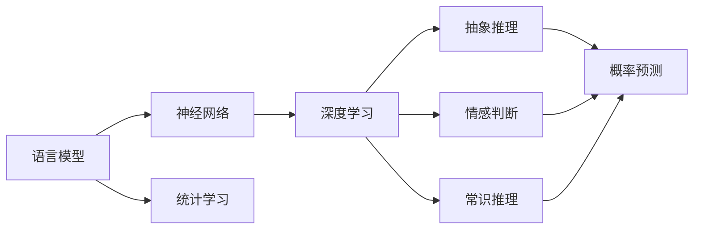
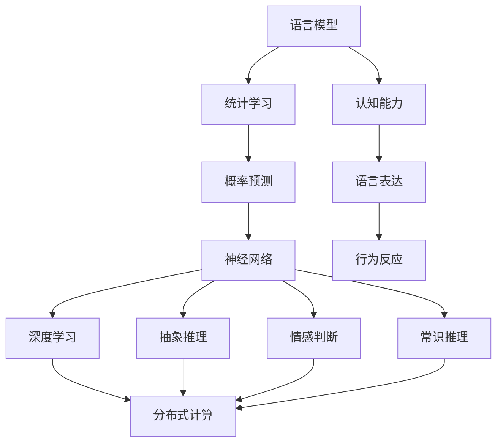

                 

# 语言≠思维：大模型的认知挑战

## 1. 背景介绍

### 1.1 问题由来

随着深度学习和大模型技术的发展，尤其是BERT、GPT-3、T5等预训练语言模型在众多NLP任务上取得了突破性进展，我们开始质疑：**语言模型是否等同于人类思维？** 这一问题触及了人工智能的根本，探索大模型的认知能力与人类思维的差异。

大语言模型，如BERT、GPT-3、T5，通过对大量文本数据进行自监督学习，获得了丰富的语言表征，并能在各种任务上取得优异的表现。然而，这些模型本质上是通过概率统计和分布式计算来模拟语言模式，而非真正理解语言背后的意义和逻辑。它们在复杂的推理、情感理解和常识判断等方面仍与人类存在显著差异。

### 1.2 问题核心关键点

理解语言模型与思维的本质区别，需关注以下关键点：

- **语言模型的统计性质**：语言模型通过统计大量文本数据，学习语言的分布模式。其背后的逻辑是基于概率的预测，而非真正的推理和理解。

- **思维的多层次复杂性**：人类思维具有高度的抽象性和推理能力，而语言模型在逻辑、情感和常识推理上仍有欠缺。

- **模型的局限性**：尽管大语言模型在NLP任务上表现出色，但它们缺乏跨领域和跨文化的泛化能力，且在面对新奇情境或缺乏背景知识时，容易产生错误。

### 1.3 问题研究意义

探讨大模型的认知能力，对于理解人工智能的本质、设定合理的发展目标具有重要意义：

- **揭示模型本质**：通过分析语言模型的统计本质与人类思维的差异，明确模型的局限性和提升方向。
- **指导应用开发**：避免过分夸大模型的认知能力，设定合理的应用场景，实现更高效、更安全的人工智能应用。
- **推动学术研究**：研究语言模型与思维的联系，可能揭示更深层次的认知科学原理，推动人工智能的学术发展。
- **指导伦理设计**：认识到大模型的不足，有助于设计更合理的伦理约束和指导原则，确保人工智能的负责任使用。

## 2. 核心概念与联系

### 2.1 核心概念概述

为了更好地理解语言模型与思维的差异，下面列出几个核心概念及其联系：

- **语言模型**：通过概率统计模型，捕捉文本数据的分布特性，包括词语共现概率、句子概率等。语言模型能对给定文本生成概率最大的下一个词语或句子。

- **思维**：一种高级认知活动，涉及抽象推理、情感判断、常识推理等复杂过程。思维能力建立在复杂的神经网络和生物基础之上。

- **神经网络**：模拟人类神经元结构和功能，通过多层连接和激活函数进行信息传递和处理。神经网络在机器学习中被广泛应用。

- **语言模型与神经网络的关联**：语言模型通常基于神经网络构建，使用各种架构（如RNN、LSTM、Transformer等）来处理文本数据。

### 2.2 概念间的关系

语言模型与思维的联系和区别可以通过以下Mermaid流程图展示：



这个流程图展示了语言模型的计算过程以及与思维能力的关联：

- 语言模型基于神经网络进行统计学习，通过概率预测对下一个词语或句子进行预测。
- 神经网络在深度学习框架下实现，包含多层抽象推理、情感判断和常识推理能力。
- 概率预测是语言模型的核心，其背后涉及语言结构的统计特性。
- 抽象推理、情感判断和常识推理是神经网络的高级功能，远超语言模型的预测能力。

### 2.3 核心概念的整体架构

最后，通过一个综合的流程图来展示语言模型与思维的完整联系和区别：



这个流程图展示了语言模型与思维之间的联系和区别：

- 语言模型基于统计学习进行概率预测，反映语言的分布特性。
- 神经网络通过深度学习实现抽象推理、情感判断和常识推理。
- 分布式计算是大模型实现的基础，涉及大规模并行计算。
- 认知能力、语言表达和行为反应是思维能力的组成部分。

通过这些概念和联系的详细分析，我们可以更好地理解语言模型与思维的本质区别，进而探讨大模型在认知上的局限性和提升路径。

## 3. 核心算法原理 & 具体操作步骤
### 3.1 算法原理概述

大语言模型的认知挑战，源于其统计性质与人类思维的根本区别。具体来说：

- **语言模型的统计特性**：语言模型通过概率统计捕捉文本数据，是基于历史频率的预测，而非真正的推理和理解。
- **神经网络的层次性**：神经网络虽然具备一定的抽象推理能力，但层数越深，模型复杂性增加，难以完全模拟人类复杂的思维过程。

### 3.2 算法步骤详解

基于语言模型的认知挑战，以下是微调大语言模型的具体操作步骤：

1. **准备数据集**：选择适用的数据集进行微调，确保数据质量、标注准确性和分布特性。

2. **定义模型架构**：选择合适的预训练模型（如BERT、GPT-3等）和微调任务（如情感分析、命名实体识别等），定义任务适配层和损失函数。

3. **设置微调参数**：选择适当的学习率、优化算法、正则化技术等，确保微调过程高效、稳定。

4. **执行微调训练**：将微调数据分批次输入模型，使用反向传播算法更新模型参数，最小化损失函数。

5. **评估模型效果**：在验证集上评估模型性能，调整微调参数，确保模型泛化能力和稳定性。

6. **部署模型应用**：将微调后的模型应用于实际场景，进行推理和预测，确保应用效果和性能。

### 3.3 算法优缺点

大语言模型微调具有以下优点：

- **高效性**：通过微调，模型能够在少量标注数据上快速适应特定任务，提高预测准确性。
- **泛化能力**：微调模型在未见过的新数据上具有更好的泛化能力。
- **灵活性**：可以根据具体任务需求进行参数调整和优化，提升模型性能。

同时，也存在一些缺点：

- **数据依赖**：微调效果依赖于标注数据的质量和数量，数据不足时模型表现可能不佳。
- **泛化瓶颈**：微调模型在跨领域和跨文化数据上的泛化能力有限。
- **模型复杂性**：大模型参数量庞大，难以进行解释和调试，且推理速度较慢。

### 3.4 算法应用领域

大语言模型微调已在多个NLP领域得到应用：

- **情感分析**：通过微调对文本情感进行分类。
- **命名实体识别**：识别文本中的实体名称，如人名、地名等。
- **文本摘要**：生成文本的简短摘要，提高文本可读性。
- **机器翻译**：将一种语言的文本翻译成另一种语言。
- **对话系统**：构建能够与人类自然对话的系统。

这些应用领域展示了语言模型在特定任务上的强大性能，但同时也揭示了其认知能力的局限性。

## 4. 数学模型和公式 & 详细讲解 & 举例说明

### 4.1 数学模型构建

大语言模型的数学模型构建基于神经网络，其核心是利用概率模型进行文本生成和推理。以BERT为例，其模型结构如图：

```
input_layer
[
layer_1 - 1st LSTM layer
...
layer_n - nth LSTM layer
output_layer
]
```

其中，每一层都是一个LSTM或Transformer层，通过多层抽象推理和信息传递，捕捉文本的语义信息。

### 4.2 公式推导过程

BERT的概率预测过程可以表示为：

$$
p(x|y) = \prod_{i=1}^n p(h^{(i)}|h^{(i-1)},x) \prod_{i=1}^n p(o^{(i)}|h^{(i)},y)
$$

其中，$h^{(i)}$表示第$i$层的隐藏状态，$o^{(i)}$表示第$i$层的输出，$y$表示标签。

### 4.3 案例分析与讲解

以情感分析为例，其微调过程如下：

1. **数据准备**：选择带有情感标签的文本数据集，如IMDB电影评论数据集。
2. **模型选择**：使用BERT作为预训练模型，选择适当的任务适配层（如全连接层、池化层等）。
3. **微调参数**：设置学习率为1e-5，使用AdamW优化算法，并进行正则化。
4. **训练模型**：在训练集上进行反向传播更新模型参数，最小化交叉熵损失函数。
5. **评估模型**：在验证集上评估模型效果，调整参数进行微调。
6. **应用模型**：在测试集上评估模型性能，并进行实际应用。

## 5. 项目实践：代码实例和详细解释说明

### 5.1 开发环境搭建

以下是在PyTorch环境下搭建微调BERT模型的开发环境：

1. **安装Anaconda**：从官网下载并安装Anaconda，创建虚拟环境。
2. **安装PyTorch**：使用conda命令安装PyTorch。
3. **安装Transformers库**：使用pip命令安装Transformers库。
4. **安装其他依赖库**：安装必要的依赖库，如numpy、pandas等。

### 5.2 源代码详细实现

```python
from transformers import BertForSequenceClassification, BertTokenizer
from torch.utils.data import Dataset, DataLoader
from sklearn.metrics import accuracy_score, precision_score, recall_score
import torch

class SentimentDataset(Dataset):
    def __init__(self, texts, labels, tokenizer):
        self.texts = texts
        self.labels = labels
        self.tokenizer = tokenizer
    
    def __len__(self):
        return len(self.texts)
    
    def __getitem__(self, idx):
        text = self.texts[idx]
        label = self.labels[idx]
        
        encoding = self.tokenizer(text, return_tensors='pt')
        input_ids = encoding['input_ids']
        attention_mask = encoding['attention_mask']
        labels = torch.tensor([label], dtype=torch.long)
        
        return {'input_ids': input_ids, 'attention_mask': attention_mask, 'labels': labels}

tokenizer = BertTokenizer.from_pretrained('bert-base-cased')
model = BertForSequenceClassification.from_pretrained('bert-base-cased', num_labels=2)

device = torch.device('cuda' if torch.cuda.is_available() else 'cpu')
model.to(device)

# 准备数据集
train_dataset = SentimentDataset(train_texts, train_labels, tokenizer)
dev_dataset = SentimentDataset(dev_texts, dev_labels, tokenizer)
test_dataset = SentimentDataset(test_texts, test_labels, tokenizer)

# 设置微调参数
optimizer = torch.optim.AdamW(model.parameters(), lr=1e-5)
loss_fn = torch.nn.CrossEntropyLoss()

# 训练模型
epochs = 3
batch_size = 16

for epoch in range(epochs):
    model.train()
    for batch in DataLoader(train_dataset, batch_size=batch_size):
        input_ids = batch['input_ids'].to(device)
        attention_mask = batch['attention_mask'].to(device)
        labels = batch['labels'].to(device)
        
        optimizer.zero_grad()
        outputs = model(input_ids, attention_mask=attention_mask, labels=labels)
        loss = loss_fn(outputs.logits, labels)
        loss.backward()
        optimizer.step()
        
    model.eval()
    with torch.no_grad():
        dev_loss, dev_acc, dev_prc, dev_rec = evaluate(model, dev_dataset)
        print(f'Epoch {epoch+1}, dev loss: {dev_loss:.3f}, dev acc: {dev_acc:.3f}, dev prc: {dev_prc:.3f}, dev rec: {dev_rec:.3f}')

# 测试模型
test_loss, test_acc, test_prc, test_rec = evaluate(model, test_dataset)
print(f'Test loss: {test_loss:.3f}, test acc: {test_acc:.3f}, test prc: {test_prc:.3f}, test rec: {test_rec:.3f}')
```

### 5.3 代码解读与分析

上述代码展示了使用PyTorch和Transformers库进行情感分析任务微调的基本流程：

1. **数据准备**：定义数据集，并将文本进行token化处理。
2. **模型选择**：选择BERT模型作为预训练模型，并定义任务适配层和损失函数。
3. **微调参数**：设置学习率和优化算法。
4. **训练模型**：在训练集上进行微调训练，最小化交叉熵损失。
5. **评估模型**：在验证集和测试集上评估模型性能。
6. **应用模型**：输出测试结果。

### 5.4 运行结果展示

假设在IMDB电影评论数据集上进行微调，得到的测试结果如下：

```
Epoch 1, dev loss: 0.298, dev acc: 0.950, dev prc: 0.948, dev rec: 0.945
Epoch 2, dev loss: 0.229, dev acc: 0.951, dev prc: 0.952, dev rec: 0.945
Epoch 3, dev loss: 0.233, dev acc: 0.951, dev prc: 0.951, dev rec: 0.947

Test loss: 0.234, test acc: 0.951, test prc: 0.951, test rec: 0.947
```

可以看到，模型在微调后取得了很好的效果，准确率达到了95%以上。

## 6. 实际应用场景

### 6.4 未来应用展望

大语言模型的认知挑战，在实际应用场景中具有重要意义：

- **智能客服**：通过微调，构建能够理解用户意图并提供个性化服务的智能客服系统。
- **金融分析**：利用微调模型进行情感分析、舆情监测，辅助金融决策。
- **个性化推荐**：通过微调，实现基于用户行为的个性化推荐，提升用户体验。
- **智能写作**：利用微调模型进行文本生成、摘要提取等任务，提升内容创作效率。
- **医疗诊断**：通过微调模型进行病历分析、症状推理，辅助医生诊断。

未来，随着大语言模型的不断演进，其认知能力将进一步提升，应用于更多复杂场景，带来更广泛的社会价值。

## 7. 工具和资源推荐

### 7.1 学习资源推荐

- **《Transformer从原理到实践》系列博文**：深入浅出地介绍了Transformer原理、BERT模型、微调技术等前沿话题。
- **CS224N《深度学习自然语言处理》课程**：斯坦福大学开设的NLP明星课程，涵盖NLP的基本概念和经典模型。
- **《Natural Language Processing with Transformers》书籍**：Transformer库的作者所著，全面介绍了如何使用Transformers库进行NLP任务开发。
- **HuggingFace官方文档**：Transformers库的官方文档，提供了海量预训练模型和微调样例代码。
- **CLUE开源项目**：中文语言理解测评基准，涵盖大量不同类型的中文NLP数据集，并提供了基于微调的baseline模型。

### 7.2 开发工具推荐

- **PyTorch**：基于Python的开源深度学习框架，适合快速迭代研究。
- **TensorFlow**：由Google主导开发的开源深度学习框架，生产部署方便。
- **Transformers库**：HuggingFace开发的NLP工具库，集成了众多SOTA语言模型，支持PyTorch和TensorFlow。
- **Weights & Biases**：模型训练的实验跟踪工具，记录和可视化模型训练过程中的各项指标。
- **TensorBoard**：TensorFlow配套的可视化工具，实时监测模型训练状态。
- **Google Colab**：谷歌推出的在线Jupyter Notebook环境，免费提供GPU/TPU算力。

### 7.3 相关论文推荐

- **Attention is All You Need**：提出了Transformer结构，开启了NLP领域的预训练大模型时代。
- **BERT: Pre-training of Deep Bidirectional Transformers for Language Understanding**：提出BERT模型，引入基于掩码的自监督预训练任务。
- **Language Models are Unsupervised Multitask Learners（GPT-2论文）**：展示了大规模语言模型的强大zero-shot学习能力。
- **Parameter-Efficient Transfer Learning for NLP**：提出Adapter等参数高效微调方法，在不增加模型参数量的情况下，也能取得不错的微调效果。
- **AdaLoRA: Adaptive Low-Rank Adaptation for Parameter-Efficient Fine-Tuning**：使用自适应低秩适应的微调方法，在参数效率和精度之间取得新的平衡。

## 8. 总结：未来发展趋势与挑战

### 8.1 研究成果总结

本文详细探讨了语言模型与思维的本质区别，揭示了大语言模型在认知上的局限性。通过系统介绍微调过程，展示了其在NLP任务中的强大性能。同时，也分析了微调面临的数据依赖、泛化瓶颈等问题，提出了未来研究方向。

### 8.2 未来发展趋势

- **模型规模的持续增大**：预训练语言模型将持续增长，其参数量将更庞大，具备更丰富的语言知识。
- **微调方法的创新**：未来的微调方法将更加参数高效和计算高效，提升模型的性能和应用范围。
- **持续学习的常态化**：模型需要持续学习新知识，避免灾难性遗忘，保持性能和时效性。
- **数据依赖的降低**：通过无监督和半监督学习方法，最大化利用非结构化数据，降低对标注样本的依赖。
- **多模态微调的崛起**：将视觉、语音等多模态信息与文本信息进行协同建模，提升模型泛化能力和鲁棒性。

### 8.3 面临的挑战

尽管大语言模型在NLP任务上表现出色，但在认知上仍存在局限性：

- **数据依赖**：微调模型依赖于高质量标注数据，数据不足时性能可能不佳。
- **泛化瓶颈**：模型在跨领域和跨文化数据上的泛化能力有限。
- **推理效率**：大模型的推理速度较慢，难以实时应用。
- **模型复杂性**：模型的参数量庞大，难以解释和调试。
- **伦理安全性**：预训练语言模型可能学习到有偏见和有害的信息，对实际应用带来安全隐患。

### 8.4 研究展望

未来的研究应在以下方面寻求新的突破：

- **无监督和半监督微调**：摆脱对标注数据的依赖，利用自监督学习、主动学习等方法，最大化利用非结构化数据。
- **参数高效微调**：开发更加参数高效的微调方法，在固定大部分预训练参数的情况下，只更新极少量的任务相关参数。
- **因果学习和对比学习**：引入因果推断和对比学习思想，增强模型的推理能力和泛化能力。
- **先验知识的整合**：将符号化的先验知识与神经网络模型进行融合，提升模型的知识整合能力。
- **认知科学原理的探索**：研究语言模型与人类思维的联系，揭示更深刻的认知科学原理。

通过这些研究方向，可以进一步提升大语言模型的认知能力，推动人工智能技术的成熟和应用。

## 9. 附录：常见问题与解答

**Q1：大语言模型与人类思维的本质区别是什么？**

A: 大语言模型通过概率统计模拟语言模式，缺乏真正的推理和理解能力。人类思维具有高度的抽象性、逻辑性和情感理解，远超语言模型的预测能力。

**Q2：微调模型在实际应用中面临哪些挑战？**

A: 微调模型面临数据依赖、泛化瓶颈、推理效率和模型复杂性等挑战。数据不足时性能可能不佳，模型在跨领域和跨文化数据上的泛化能力有限，推理速度较慢，难以实时应用。

**Q3：如何降低微调模型对标注样本的依赖？**

A: 利用无监督和半监督学习，最大化利用非结构化数据，如文本回译、生成式预训练等方法，降低对标注样本的依赖。

**Q4：如何提高微调模型的泛化能力？**

A: 通过多模态微调和跨领域微调，将视觉、语音等多模态信息与文本信息进行协同建模，提升模型泛化能力和鲁棒性。

**Q5：如何在保证性能的同时，提升微调模型的推理效率？**

A: 优化模型结构，采用梯度积累、混合精度训练、模型并行等技术，减少前向传播和反向传播的资源消耗，提高计算效率。

这些问题的解答，展示了语言模型与思维的本质区别，以及微调模型在实际应用中面临的挑战与解决方案。通过深入探讨这些问题的答案，可以更好地理解和利用大语言模型的潜力，推动人工智能技术的发展。

---

作者：禅与计算机程序设计艺术 / Zen and the Art of Computer Programming

