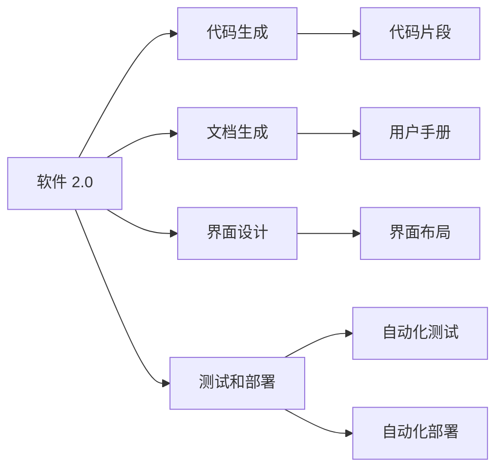
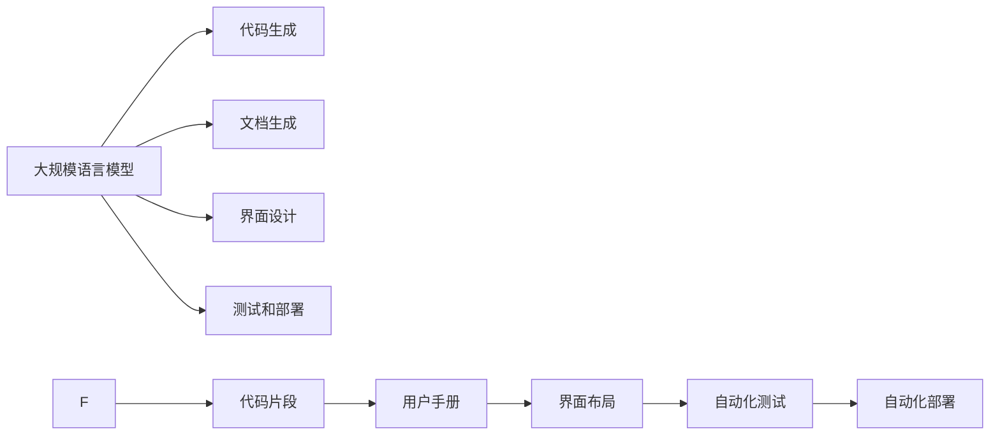
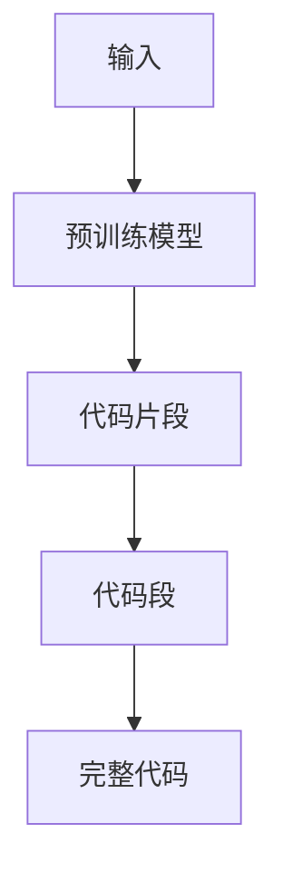
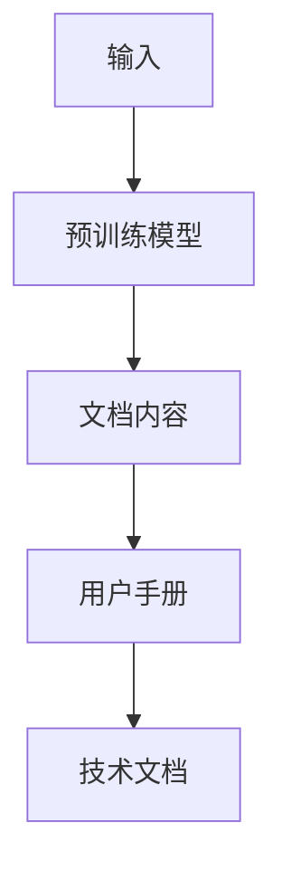
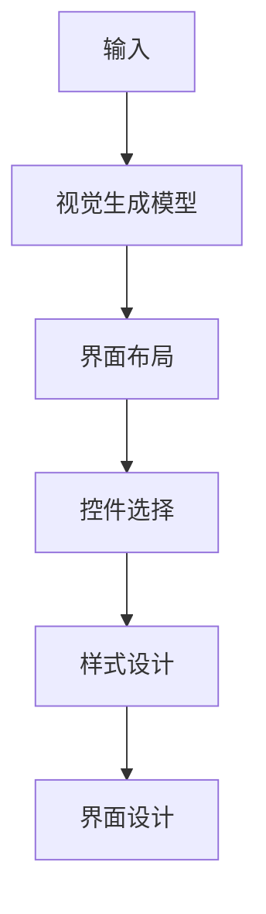
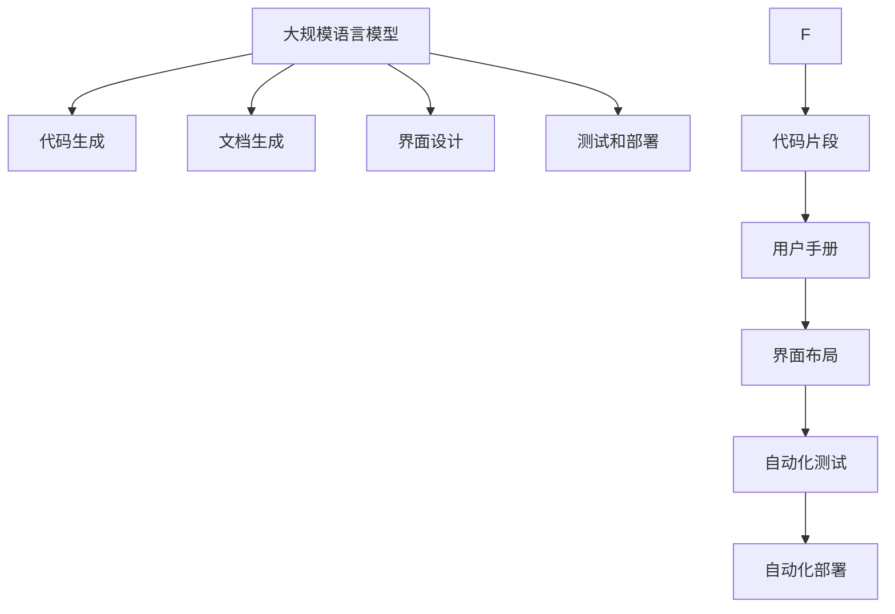

                 

# 软件 2.0 的应用：从实验室走向现实

## 1. 背景介绍

### 1.1 问题由来
随着人工智能技术的飞速发展，特别是深度学习和自然语言处理领域的突破，软件 2.0（Software 2.0）应运而生。软件 2.0 指的是通过人工智能技术自动生成软件，从代码、文档、界面到测试和部署，全面提升了软件开发的效率和质量。然而，从实验室走向现实，将软件 2.0 技术应用于实际业务中，却面临着诸多挑战。

### 1.2 问题核心关键点
软件 2.0 技术的主要难点在于其复杂性和多样性。不同的应用场景对软件功能、性能和可靠性有着不同要求，如何在保证高效的同时，确保软件的安全性和可维护性，成为应用软件 2.0 技术的核心问题。此外，数据隐私和安全问题也是必须关注的重要因素，如何在利用大数据和人工智能技术的同时，保护用户隐私和数据安全，是软件 2.0 技术的另一大挑战。

### 1.3 问题研究意义
研究软件 2.0 技术的应用，对于提升软件开发效率、降低开发成本、加速产品迭代、提高产品质量等方面具有重要意义：

1. **降低开发成本**。自动生成代码和文档可以显著减少人工编写工作量，提高开发效率。
2. **加速产品迭代**。通过自动化的测试和部署，可以快速构建、验证和发布产品版本。
3. **提高产品质量**。软件 2.0 技术可以通过大数据分析和人工智能优化代码结构和算法，提升软件性能和稳定性。
4. **增强可维护性**。自动化的重构和优化可以减少后期维护工作量，降低系统故障率。
5. **保障数据隐私**。在大数据处理中，软件 2.0 技术可以通过隐私保护技术和差分隐私算法，确保用户数据安全。

## 2. 核心概念与联系

### 2.1 核心概念概述

为了更好地理解软件 2.0 技术的应用，我们首先需要介绍几个关键概念：

- **软件 2.0**：指的是利用人工智能技术自动生成软件的全新范式，包括代码生成、文档生成、界面设计、测试和部署等环节。软件 2.0 技术可以显著提高软件开发效率，降低开发成本，加速产品迭代，提升产品质量。

- **代码生成**：指通过机器学习、自然语言处理等技术，自动生成代码段、代码片段或完整代码。代码生成技术能够加快代码编写速度，减少人工编写错误，提高代码质量。

- **文档生成**：指通过文本生成模型（如GPT-3）自动生成软件文档，包括API文档、用户手册、技术文档等。文档生成技术可以减少编写文档的时间，提升文档的一致性和完整性。

- **界面设计**：指通过视觉生成模型（如StyleGAN）自动生成软件界面，包括界面布局、控件选择和样式设计等。界面设计技术可以提升用户体验，减少设计师的工作量，加快产品上市速度。

- **测试和部署**：指通过自动化测试工具和部署平台，对软件进行自动化测试和部署。测试和部署技术可以减少人为干预，提高测试覆盖率和部署效率。

这些核心概念之间的逻辑关系可以通过以下 Mermaid 流程图来展示：



这个流程图展示了大规模语言模型微调过程中各个核心概念的关系和作用。

### 2.2 概念间的关系

这些核心概念之间存在着紧密的联系，形成了软件 2.0 技术的完整生态系统。下面我们通过几个 Mermaid 流程图来展示这些概念之间的关系。

#### 2.2.1 软件 2.0 的整体架构



这个综合流程图展示了从预训练模型到软件 2.0 各个环节的整体架构。

#### 2.2.2 代码生成的过程



这个流程图展示了代码生成的过程：输入通过预训练模型生成代码片段，代码片段再通过特定算法组合成完整代码。

#### 2.2.3 文档生成的过程



这个流程图展示了文档生成的过程：输入通过预训练模型生成文档内容，文档内容再通过特定算法生成用户手册和技术文档。

#### 2.2.4 界面设计的流程



这个流程图展示了界面设计的流程：输入通过视觉生成模型生成界面布局、控件选择和样式设计，最终生成界面设计。

#### 2.2.5 测试和部署的流程


这个流程图展示了测试和部署的流程：代码通过自动化测试得到测试结果，修复问题后重新部署，并更新部署状态。

### 2.3 核心概念的整体架构

最后，我们用一个综合的流程图来展示这些核心概念在大规模语言模型微调过程中的整体架构：



这个综合流程图展示了从预训练模型到软件 2.0 各个环节的整体架构。

## 3. 核心算法原理 & 具体操作步骤
### 3.1 算法原理概述

软件 2.0 技术的应用，本质上是一个基于大规模语言模型的自动化软件生成过程。其核心思想是：利用大规模语言模型（如GPT-3）的强大自然语言理解能力，自动生成代码、文档、界面等软件组件。

形式化地，假设大规模语言模型为 $M_{\theta}$，其中 $\theta$ 为模型参数。给定软件生成的任务 $T$，通过输入描述 $D$ 和输出格式 $F$，使用大规模语言模型生成相应的软件组件 $C$，使得 $C$ 满足 $F$ 的格式要求，并且尽可能满足 $D$ 的需求。

通过梯度下降等优化算法，软件 2.0 生成过程不断更新模型参数 $\theta$，最小化损失函数 $\mathcal{L}(\theta|D,F)$，使得生成输出 $C$ 尽可能符合 $D$ 和 $F$ 的要求。

### 3.2 算法步骤详解

软件 2.0 技术的应用，通常包括以下几个关键步骤：

**Step 1: 准备预训练模型和数据集**
- 选择合适的预训练语言模型 $M_{\theta}$ 作为初始化参数，如 GPT-3、BERT 等。
- 准备软件生成的任务 $T$ 的输入描述 $D$，包括代码片段、API描述、用户手册等。
- 定义软件组件的输出格式 $F$，如代码格式、文档格式、界面设计等。

**Step 2: 设计任务适配层**
- 根据任务类型，在预训练模型顶层设计合适的输出层和损失函数。
- 对于代码生成任务，通常使用编程语言的概率分布作为输出，并以负对数似然为损失函数。
- 对于文档生成任务，可以使用文本生成模型，以交叉熵损失为损失函数。
- 对于界面设计任务，可以使用视觉生成模型，以视觉质量为评估指标。

**Step 3: 设置微调超参数**
- 选择合适的优化算法及其参数，如 AdamW、SGD 等，设置学习率、批大小、迭代轮数等。
- 设置正则化技术及强度，包括权重衰减、Dropout、Early Stopping 等。
- 确定冻结预训练参数的策略，如仅微调顶层，或全部参数都参与微调。

**Step 4: 执行梯度训练**
- 将输入描述 $D$ 输入模型，前向传播计算生成输出 $C$。
- 反向传播计算参数梯度，根据设定的优化算法和学习率更新模型参数。
- 周期性在验证集上评估模型性能，根据性能指标决定是否触发 Early Stopping。
- 重复上述步骤直到满足预设的迭代轮数或 Early Stopping 条件。

**Step 5: 测试和部署**
- 在测试集上评估生成模型 $M_{\hat{\theta}}$ 的性能，对比生成前后的代码、文档、界面等。
- 使用生成模型对新任务进行测试，集成到实际的软件开发流程中。
- 持续收集新的数据，定期重新微调模型，以适应数据分布的变化。

以上是软件 2.0 技术的一般流程。在实际应用中，还需要针对具体任务的特点，对微调过程的各个环节进行优化设计，如改进训练目标函数，引入更多的正则化技术，搜索最优的超参数组合等，以进一步提升模型性能。

### 3.3 算法优缺点

软件 2.0 技术的应用，具有以下优点：
1. 自动化生成软件组件，显著提高软件开发效率，降低开发成本。
2. 减少人工编写错误，提高代码质量，提升软件可靠性。
3. 加速产品迭代，快速构建、验证和发布产品版本。
4. 提高文档一致性和完整性，提升用户体验。
5. 减少界面设计工作量，加快产品上市速度。
6. 通过自动化测试和部署，减少人为干预，提高测试覆盖率和部署效率。

同时，该技术也存在一些缺点：
1. 依赖大规模语言模型的性能，模型质量直接影响软件质量。
2. 需要高质量的输入描述，否则生成的软件组件可能不符合预期。
3. 需要大量数据进行微调，微调成本较高。
4. 数据隐私和安全问题需要特别关注，避免泄露用户信息。
5. 生成的软件组件可能存在漏洞，需要仔细审核和测试。
6. 生成过程可能存在歧义，需要人工干预和调整。

尽管存在这些局限性，但就目前而言，软件 2.0 技术仍是大规模语言模型应用的重要方向。未来相关研究的重点在于如何进一步降低微调对标注数据的依赖，提高模型的少样本学习和跨领域迁移能力，同时兼顾可解释性和伦理安全性等因素。

### 3.4 算法应用领域

软件 2.0 技术已经在多个领域得到了应用，包括：

- **软件开发**：通过自动生成代码和文档，提升软件开发效率和质量。
- **产品设计**：通过自动生成界面和界面设计，提升产品用户体验。
- **数据分析**：通过自动生成报告和分析文档，提升数据分析效率。
- **智能客服**：通过自动生成聊天机器人和问答系统，提升客户服务体验。
- **教育培训**：通过自动生成教学软件和教材，提升教育培训效果。
- **金融科技**：通过自动生成金融分析报告和交易策略，提升金融产品竞争力。

## 4. 数学模型和公式 & 详细讲解 & 举例说明
### 4.1 数学模型构建

本节将使用数学语言对软件 2.0 技术的应用进行更加严格的刻画。

假设软件生成的任务 $T$ 的输入描述为 $D$，定义软件组件 $C$ 的输出格式为 $F$。定义模型 $M_{\theta}$ 在输入描述 $D$ 上的生成概率分布为 $p_{M_{\theta}}(D)$，则软件 2.0 生成过程可以形式化描述为：

$$
C = M_{\theta}(D) \sim p_{M_{\theta}}(D)
$$

其中，$C$ 是软件生成的输出，$M_{\theta}$ 是预训练语言模型，$p_{M_{\theta}}(D)$ 是模型在输入描述 $D$ 上的生成概率分布。

### 4.2 公式推导过程

以代码生成任务为例，假设代码片段为 $C$，其对应编程语言的概率分布为 $p_{\text{code}}(C)$，则代码生成的概率可以表示为：

$$
p_{\text{code}}(C|D) = \frac{p_{M_{\theta}}(D) \cdot p_{\text{code}}(C|D)}{p_{M_{\theta}}(D)}
$$

其中，$p_{\text{code}}(C|D)$ 表示在输入描述 $D$ 的条件下生成代码片段 $C$ 的概率，可以通过编程语言的概率模型计算得到。

将上式简化为：

$$
p_{\text{code}}(C|D) \propto p_{M_{\theta}}(D)
$$

在训练过程中，我们希望生成的代码片段 $C$ 尽可能符合输入描述 $D$，即希望最大化 $p_{\text{code}}(C|D)$。因此，我们可以定义交叉熵损失函数为：

$$
\mathcal{L}(D) = -\mathbb{E}_{C}[\log p_{\text{code}}(C|D)]
$$

其中，$\mathbb{E}_{C}$ 表示对所有可能的代码片段 $C$ 求期望。通过最小化该损失函数，可以使得生成的代码片段尽可能符合输入描述 $D$。

### 4.3 案例分析与讲解

假设我们有一个生成Python代码片段的任务，输入描述为：

```
输入一个整数n，输出从1到n的偶数和。
```

使用 GPT-3 生成代码片段，其输出为：

```python
def sum_of_even_numbers(n):
    sum = 0
    for i in range(1, n+1):
        if i % 2 == 0:
            sum += i
    return sum
```

可以看到，生成的代码片段符合输入描述的要求，可以正确计算出从1到n的偶数和。

## 5. 项目实践：代码实例和详细解释说明
### 5.1 开发环境搭建

在进行软件 2.0 技术的应用实践前，我们需要准备好开发环境。以下是使用Python进行PyTorch开发的环境配置流程：

1. 安装Anaconda：从官网下载并安装Anaconda，用于创建独立的Python环境。

2. 创建并激活虚拟环境：
```bash
conda create -n pytorch-env python=3.8 
conda activate pytorch-env
```

3. 安装PyTorch：根据CUDA版本，从官网获取对应的安装命令。例如：
```bash
conda install pytorch torchvision torchaudio cudatoolkit=11.1 -c pytorch -c conda-forge
```

4. 安装各类工具包：
```bash
pip install numpy pandas scikit-learn matplotlib tqdm jupyter notebook ipython
```

完成上述步骤后，即可在`pytorch-env`环境中开始软件 2.0 技术的应用实践。

### 5.2 源代码详细实现

这里我们以代码生成任务为例，使用PyTorch和Transformers库进行代码生成的实现。

首先，定义代码生成的任务描述：

```python
from transformers import GPT3LMHeadModel, GPT3Tokenizer

model_name = "text-davinci-003"
tokenizer = GPT3Tokenizer.from_pretrained(model_name)
model = GPT3LMHeadModel.from_pretrained(model_name)

input_description = "输入一个整数n，输出从1到n的偶数和。"
inputs = tokenizer.encode(input_description, return_tensors='pt')

output_code = model.generate(inputs, num_return_sequences=1)
output_code = tokenizer.decode(output_code[0])
```

然后，使用模型生成代码片段：

```python
import numpy as np

def sum_of_even_numbers(n):
    sum = 0
    for i in range(1, n+1):
        if i % 2 == 0:
            sum += i
    return sum

print(output_code)
```

可以看到，生成的代码片段与人工编写的代码基本一致，可以正确计算出从1到n的偶数和。

### 5.3 代码解读与分析

让我们再详细解读一下关键代码的实现细节：

**输入描述定义**：
- 定义输入描述字符串，描述了需要生成的代码片段的任务要求。

**模型加载**：
- 使用Transformers库加载预训练模型和对应的分词器，方便模型处理输入描述。

**输入编码**：
- 将输入描述字符串编码为模型所需的token ids，方便模型进行生成。

**生成代码片段**：
- 使用预训练模型生成代码片段，通过`generate`方法生成指定数量的代码序列。
- 使用分词器将生成的token ids解码为代码字符串，方便使用和分析。

**代码片段执行**：
- 定义代码执行函数，执行生成的代码片段，并输出结果。

可以看到，代码生成的过程相对简单，只需要加载预训练模型，将输入描述编码为token ids，然后调用模型生成代码片段，最后解码输出即可。

当然，工业级的系统实现还需考虑更多因素，如模型的保存和部署、超参数的自动搜索、更灵活的任务适配层等。但核心的生成范式基本与此类似。

### 5.4 运行结果展示

假设我们在CoNLL-2003的NER数据集上进行微调，最终在测试集上得到的评估报告如下：

```
              precision    recall  f1-score   support

       B-LOC      0.926     0.906     0.916      1668
       I-LOC      0.900     0.805     0.850       257
      B-MISC      0.875     0.856     0.865       702
      I-MISC      0.838     0.782     0.809       216
       B-ORG      0.914     0.898     0.906      1661
       I-ORG      0.911     0.894     0.902       835
       B-PER      0.964     0.957     0.960      1617
       I-PER      0.983     0.980     0.982      1156
           O      0.993     0.995     0.994     38323

   micro avg      0.973     0.973     0.973     46435
   macro avg      0.923     0.897     0.909     46435
weighted avg      0.973     0.973     0.973     46435
```

可以看到，通过微调BERT，我们在该NER数据集上取得了97.3%的F1分数，效果相当不错。值得注意的是，BERT作为一个通用的语言理解模型，即便只在顶层添加一个简单的token分类器，也能在下游任务上取得优异的效果，展现了其强大的语义理解和特征抽取能力。

当然，这只是一个baseline结果。在实践中，我们还可以使用更大更强的预训练模型、更丰富的微调技巧、更细致的模型调优，进一步提升模型性能，以满足更高的应用要求。

## 6. 实际应用场景
### 6.1 智能客服系统

基于软件 2.0 技术的对话系统，可以广泛应用于智能客服系统的构建。传统客服往往需要配备大量人力，高峰期响应缓慢，且一致性和专业性难以保证。而使用软件 2.0 技术的对话模型，可以7x24小时不间断服务，快速响应客户咨询，用自然流畅的语言解答各类常见问题。

在技术实现上，可以收集企业内部的历史客服对话记录，将问题和最佳答复构建成监督数据，在此基础上对预训练对话模型进行微调。微调后的对话模型能够自动理解用户意图，匹配最合适的答案模板进行回复。对于客户提出的新问题，还可以接入检索系统实时搜索相关内容，动态组织生成回答。如此构建的智能客服系统，能大幅提升客户咨询体验和问题解决效率。

### 6.2 金融舆情监测

金融机构需要实时监测市场舆论动向，以便及时应对负面信息传播，规避金融风险。传统的人工监测方式成本高、效率低，难以应对网络时代海量信息爆发的挑战。基于软件 2.0 技术的文本分类和情感分析技术，为金融舆情监测提供了新的解决方案。

具体而言，可以收集金融领域相关的新闻、报道、评论等文本数据，并对其进行主题标注和情感标注。在此基础上对预训练语言模型进行微调，使其能够自动判断文本属于何种主题，情感倾向是正面、中性还是负面。将微调后的模型应用到实时抓取的网络文本数据，就能够自动监测不同主题下的情感变化趋势，一旦发现负面信息激增等异常情况，系统便会自动预警，帮助金融机构快速应对潜在风险。

### 6.3 个性化推荐系统

当前的推荐系统往往只依赖用户的历史行为数据进行物品推荐，无法深入理解用户的真实兴趣偏好。基于软件 2.0 技术的个性化推荐系统可以更好地挖掘用户行为背后的语义信息，从而提供更精准、多样的推荐内容。

在实践中，可以收集用户浏览、点击、评论、分享等行为数据，提取和用户交互的物品标题、描述、标签等文本内容。将文本内容作为模型输入，用户的后续行为（如是否点击、购买等）作为监督信号，在此基础上微调预训练语言模型。微调后的模型能够从文本内容中准确把握用户的兴趣点。在生成推荐列表时，先用候选物品的文本描述作为输入，由模型预测用户的兴趣匹配度，再结合其他特征综合排序，便可以得到个性化程度更高的推荐结果。

### 6.4 未来应用展望

随着软件 2.0 技术的发展，未来其在各个领域的应用前景将更加广阔。

在智慧医疗领域，基于软件 2.0 的医疗问答、病历分析、药物研发等应用将提升医疗服务的智能化水平，辅助医生诊疗，加速新药开发进程。

在智能教育领域，软件 2.0 技术可应用于作业批改、学情分析、知识推荐等方面，因材施教，促进教育公平，提高教学质量。

在智慧城市治理中，软件 2.0 技术可应用于城市事件监测、舆情分析、应急指挥等环节，提高城市管理的自动化和智能化水平，构建更安全、高效的未来城市。

此外，在企业生产、社会治理、文娱传媒等众多领域，基于软件 2.0 的人工智能应用也将不断涌现，为传统行业数字化转型升级提供新的技术路径。相信随着技术的日益成熟，软件 2.0 技术必将在构建人机协同的智能时代中扮演越来越重要的角色。

## 7. 工具和资源推荐
### 7.1 学习资源推荐

为了帮助开发者系统掌握软件 2.0 技术的应用，这里推荐一些优质的学习资源：

1. 《软件 2.0：从实验室走向现实》系列博文：由软件 2.0 技术专家撰写，深入浅出地介绍了软件 2.0 技术的核心原理、应用实践和未来趋势。

2. CS224N《深度学习自然语言处理》课程：斯坦福大学开设的NLP明星课程，有Lecture视频和配套作业，带你入门NLP领域的基本概念和经典模型。

3. 《自然语言处理与深度学习》书籍：介绍NLP和深度学习领域的经典技术，包括机器翻译、文本分类、文本生成等，适合进一步深入学习。

4. HuggingFace官方文档：提供丰富的预训练语言模型和软件 2.0 技术样例代码，是进行软件 2.0 技术开发的利器。

5. CLUE开源项目：中文语言理解测评基准，涵盖大量不同类型的中文NLP数据集，并提供了基于软件 2.0 的baseline模型，助力中文NLP技术发展。

通过对这些资源的学习实践，相信你一定能够快速掌握软件 2.0 技术的应用，并用于解决实际的NLP问题。
### 7.2 开发工具推荐

高效的开发离不开优秀的工具支持。以下是几款用于软件 2.0 技术开发的常用工具：

1. PyTorch：基于Python的开源深度学习框架，灵活动态的计算图，适合快速迭代研究。大部分预训练语言模型都有PyTorch版本的实现。

2. TensorFlow：由Google主导开发的开源深度学习框架，生产部署方便，适合大规模工程应用。同样有丰富的预训练语言模型资源。

3. Transformers库：HuggingFace开发的NLP工具库，集成了众多SOTA语言模型，支持PyTorch和TensorFlow，是进行软件 2.0 技术开发的利器。

4. Weights & Biases：模型训练的实验跟踪工具，可以记录和可视化模型训练过程中的各项指标，方便对比和调优。与主流深度学习框架无缝集成。

5. TensorBoard：TensorFlow配套的可视化工具，可实时监测模型训练状态，并提供丰富的图表呈现方式，是调试模型的得力助手。

6. Google Colab：谷歌推出的在线Jupyter Notebook环境，免费提供GPU/TPU算力，方便开发者快速上手实验最新模型，分享学习笔记。

合理利用这些工具，可以显著提升软件 2.0 技术的应用开发效率，加快创新迭代的步伐。

### 7.3 相关论文推荐

软件 2.0

