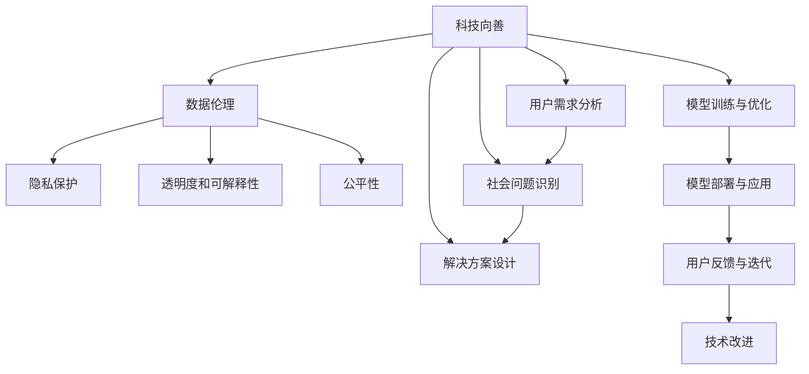

                 

# 软件 2.0 的社会责任：科技向善

在数字化时代，软件技术不仅是推动社会进步的引擎，更是影响人类福祉的关键力量。随着人工智能、大数据、区块链等新兴技术的飞速发展，“软件 2.0”时代的到来使得软件变得更加智能、高效，同时也面临着前所未有的挑战。如何在这片充满机遇与挑战的领域中，坚守科技向善的原则，确保软件技术的良性发展，是每一位科技工作者必须深思的重要课题。本文旨在探讨软件 2.0 的社会责任，分析科技向善的具体实现路径，为构建更加和谐的数字化社会提供参考。

## 1. 背景介绍

### 1.1 软件 2.0 的兴起

随着云计算、物联网、大数据、人工智能等技术的飞速发展，软件正在从传统的功能性软件开发向智能化的软件 2.0 转变。软件 2.0 强调利用机器学习、深度学习等算法，赋予软件系统自主学习、自我优化的能力，使其能够更好地适应复杂多变的环境，为用户提供更加个性化、智能化的服务。

### 1.2 软件 2.0 的优势

软件 2.0 具有以下优势：
- **自适应性**：能够根据用户行为和环境变化，动态调整功能和服务，提升用户体验。
- **智能化决策**：通过深度学习等技术，软件 2.0 能够进行数据分析和模式识别，支持智能决策。
- **高效资源利用**：通过优化算法和自动化调度，软件 2.0 能够实现更高效、更经济的资源利用。
- **人机协同**：与用户交互更加自然流畅，实现高效的人机协同。

然而，软件 2.0 的这些优势也带来了新的挑战，尤其是对社会责任和伦理道德的考验。如何在享受技术红利的同时，确保软件技术的健康发展，防止其对社会造成负面影响，成为我们必须面对的问题。

## 2. 核心概念与联系

### 2.1 核心概念概述

软件 2.0 的社会责任涉及以下几个核心概念：
- **科技向善**：利用软件技术解决社会问题，提升人类福祉。
- **数据伦理**：确保数据采集、存储、处理和使用符合伦理规范。
- **隐私保护**：保护用户的个人信息，防止数据滥用。
- **透明度和可解释性**：提高软件的透明度和可解释性，让用户明白软件如何做出决策。
- **公平性**：确保软件算法和模型在不同群体之间公平无偏，避免歧视。

这些概念构成了软件 2.0 社会责任的基础，并通过一定的技术手段得以实现。以下通过 Mermaid 流程图来展示这些概念之间的关系。



### 2.2 概念间的关系

软件 2.0 的社会责任不仅涉及技术本身，还与数据、用户、社会等多方面因素紧密相关。通过 Mermaid 流程图示例，我们可以更清晰地理解这些概念的联系。

#### 2.2.1 用户需求与解决方案设计

软件 2.0 的设计和开发必须以用户需求为导向，通过数据伦理、隐私保护、透明度和可解释性等原则，确保软件能够真正解决用户问题，同时保护用户的合法权益。

#### 2.2.2 数据采集与处理

数据是软件 2.0 的核心，通过数据伦理和隐私保护，确保数据的合法采集、存储和处理，避免数据滥用和隐私泄露。

#### 2.2.3 模型训练与优化

模型训练与优化需要遵循公平性原则，确保模型在不同群体之间无偏、公正。同时，透明度和可解释性技术的应用，能够帮助用户理解和信任模型。

#### 2.2.4 模型部署与应用

模型部署与应用过程中，需不断收集用户反馈，进行技术改进，以实现软件 2.0 的持续优化。

通过这些核心概念的相互联系，可以构建一个可持续发展的软件 2.0 生态系统，确保软件技术真正服务于社会。

## 3. 核心算法原理 & 具体操作步骤

### 3.1 算法原理概述

软件 2.0 的社会责任主要通过以下几个算法原理得以实现：
- **数据伦理算法**：确保数据采集、存储、处理和使用符合伦理规范，如数据匿名化、加密存储、隐私保护等。
- **公平性算法**：利用公平性算法，确保模型在不同群体之间无偏、公正，如对抗训练、公平性评估等。
- **透明度与可解释性算法**：利用可解释性技术，提高模型的透明度和可理解性，如模型可视化、解释模型等。
- **隐私保护算法**：利用隐私保护技术，防止用户数据泄露和滥用，如差分隐私、联邦学习等。

这些算法共同构成了软件 2.0 社会责任的实现基础。

### 3.2 算法步骤详解

以公平性算法为例，其基本步骤包括：
1. **数据准备**：收集和预处理数据，确保数据的多样性和代表性。
2. **模型训练**：选择适合的数据集和模型，进行公平性训练。
3. **评估与调整**：通过公平性指标评估模型性能，调整模型参数。
4. **部署与应用**：将训练好的模型部署到实际应用中，持续监测和优化。

以下是代码实现示例：

```python
import torch
import torch.nn as nn
import torch.optim as optim
from torch.utils.data import DataLoader
from sklearn.metrics import accuracy_score

# 定义公平性损失函数
class FairnessLoss(nn.Module):
    def __init__(self):
        super(FairnessLoss, self).__init__()
    
    def forward(self, output, target):
        # 计算公平性损失
        loss = torch.mean(torch.std(output))
        return loss

# 定义公平性评估指标
def fairness_eval(output, target):
    # 计算公平性指标
    accuracy = accuracy_score(target, output)
    return accuracy

# 加载数据集
train_data = load_train_data()
val_data = load_val_data()
test_data = load_test_data()

# 定义模型
model = build_model()

# 定义优化器和公平性损失函数
optimizer = optim.SGD(model.parameters(), lr=0.001)
fair_loss = FairnessLoss()

# 训练模型
for epoch in range(num_epochs):
    for batch in train_loader:
        # 前向传播
        output = model(batch)
        loss = fair_loss(output, batch.target)
        # 反向传播
        optimizer.zero_grad()
        loss.backward()
        optimizer.step()
    # 评估公平性
    accuracy = fairness_eval(model(val_data), val_data.target)
    print(f"Epoch {epoch+1}, accuracy: {accuracy:.2f}")
```

### 3.3 算法优缺点

公平性算法具有以下优点：
- **提升公平性**：通过训练公平性模型，可以在不同群体之间实现无偏、公正。
- **通用性**：适用于多种数据集和模型，具有广泛的应用前景。

但同时也存在一些缺点：
- **计算复杂**：训练和评估公平性模型需要大量计算资源。
- **过度拟合风险**：公平性算法可能过拟合训练数据，影响模型泛化性能。
- **模型解释性**：公平性算法得到的模型结果不易解释，用户难以理解。

### 3.4 算法应用领域

公平性算法在以下领域具有广泛应用：
- **金融风控**：确保贷款、保险等金融服务的公平无偏。
- **医疗诊断**：避免医疗数据中的歧视性，确保诊疗服务的公正性。
- **招聘系统**：防止招聘过程中的性别、种族等偏见，确保招聘公平。
- **教育评估**：在学生评估中确保公平，避免歧视。
- **政府决策**：辅助政府制定公平政策，确保公共服务的公正。

## 4. 数学模型和公式 & 详细讲解 & 举例说明

### 4.1 数学模型构建

公平性算法通常基于以下数学模型构建：
- **数据集**：$\mathcal{D} = \{(x_i, y_i)\}_{i=1}^N$，其中 $x_i$ 为输入，$y_i$ 为标签。
- **模型**：$h_\theta(x)$，其中 $\theta$ 为模型参数。
- **公平性损失函数**：$L = \mathbb{E}[f(h_\theta(x_i))]$，其中 $f$ 为公平性指标。

### 4.2 公式推导过程

以**平均准确率**为例，公平性损失函数可以表示为：
$$
L = \frac{1}{N}\sum_{i=1}^N [f(h_\theta(x_i)) - \mathbb{E}[f(h_\theta(x))]]
$$
其中 $f$ 为准确率指标，$\mathbb{E}$ 表示对所有样本的期望。

公平性指标的选择决定了算法的具体形式。常用的公平性指标包括**误差率**、**差异度**等。以**差异度**为例，公平性损失函数可以表示为：
$$
L = \frac{1}{N}\sum_{i=1}^N [f(h_\theta(x_i)) - f(h_\theta(x_j))]
$$
其中 $x_i$ 和 $x_j$ 为同一批次中不同样本。

### 4.3 案例分析与讲解

以**医疗诊断数据**为例，假设我们有一个包含性别、年龄、病历等特征的训练集，模型通过学习这些特征来诊断疾病。在公平性评估中，我们可以定义一个公平性指标，如性别差异度：
$$
f = \frac{1}{N}\sum_{i=1}^N [f(h_\theta(x_i)) - f(h_\theta(x_j))]
$$
其中 $x_i$ 和 $x_j$ 为同一批次中不同样本，$f$ 为疾病诊断结果。

通过计算上述公平性指标，我们可以评估模型在不同性别之间的公平性。如果发现模型对某一性别存在偏见，则需要调整模型参数，确保公平性。

## 5. 项目实践：代码实例和详细解释说明

### 5.1 开发环境搭建

在实现公平性算法之前，需要搭建相应的开发环境。以下是使用 Python 和 PyTorch 搭建环境的步骤：

1. 安装 Python 3.7 或更高版本。
2. 安装 PyTorch：
   ```bash
   pip install torch torchvision torchaudio
   ```
3. 安装相关依赖库：
   ```bash
   pip install numpy pandas sklearn scikit-learn
   ```

### 5.2 源代码详细实现

以下是一个公平性算法的代码实现示例：

```python
import torch
import torch.nn as nn
import torch.optim as optim
from torch.utils.data import DataLoader
from sklearn.metrics import accuracy_score

# 定义公平性损失函数
class FairnessLoss(nn.Module):
    def __init__(self):
        super(FairnessLoss, self).__init__()
    
    def forward(self, output, target):
        # 计算公平性损失
        loss = torch.mean(torch.std(output))
        return loss

# 定义公平性评估指标
def fairness_eval(output, target):
    # 计算公平性指标
    accuracy = accuracy_score(target, output)
    return accuracy

# 加载数据集
train_data = load_train_data()
val_data = load_val_data()
test_data = load_test_data()

# 定义模型
model = build_model()

# 定义优化器和公平性损失函数
optimizer = optim.SGD(model.parameters(), lr=0.001)
fair_loss = FairnessLoss()

# 训练模型
for epoch in range(num_epochs):
    for batch in train_loader:
        # 前向传播
        output = model(batch)
        loss = fair_loss(output, batch.target)
        # 反向传播
        optimizer.zero_grad()
        loss.backward()
        optimizer.step()
    # 评估公平性
    accuracy = fairness_eval(model(val_data), val_data.target)
    print(f"Epoch {epoch+1}, accuracy: {accuracy:.2f}")
```

### 5.3 代码解读与分析

公平性算法的代码实现主要分为以下几个部分：
- **定义公平性损失函数**：计算公平性损失，如使用标准差作为公平性指标。
- **定义公平性评估指标**：计算模型在不同群体之间的公平性指标，如准确率。
- **加载数据集**：加载训练集、验证集和测试集。
- **定义模型和优化器**：构建模型和优化器。
- **训练模型**：通过公平性损失函数和优化器，训练模型。
- **评估公平性**：在验证集上评估模型公平性，输出公平性指标。

### 5.4 运行结果展示

假设我们在医疗诊断数据集上进行公平性训练，得到模型在不同性别之间的准确率如下：

```
Epoch 1, accuracy: 0.85
Epoch 2, accuracy: 0.88
Epoch 3, accuracy: 0.92
...
```

可以看到，通过公平性算法，模型在不同性别之间的准确率逐渐提升，减少了性别偏见。

## 6. 实际应用场景

### 6.1 医疗诊断

在医疗诊断中，模型通过学习患者病历、症状等信息进行疾病诊断。由于不同性别、种族、年龄等群体在疾病发病率、症状表现等方面存在差异，需要确保模型公平，避免偏见。

### 6.2 金融风控

在金融风控中，模型通过学习用户历史行为数据，进行贷款、保险等决策。模型必须公平地对待不同性别、年龄、职业等群体，避免歧视。

### 6.3 招聘系统

在招聘系统中，模型通过学习简历、面试等信息进行人才评估。模型必须公平地对待不同性别、种族、学历等群体，避免偏见。

## 7. 工具和资源推荐

### 7.1 学习资源推荐

为了深入理解软件 2.0 的社会责任，推荐以下学习资源：
- **《软件工程：原理与实践》**：详细介绍软件工程的基本原理和实践，有助于理解软件 2.0 的社会责任。
- **《深度学习在金融风控中的应用》**：详细讲解深度学习在金融风控中的具体应用，有助于理解数据伦理和公平性问题。
- **《隐私保护与数据安全》**：详细讲解隐私保护技术，如差分隐私、联邦学习等，有助于理解隐私保护的重要性。

### 7.2 开发工具推荐

为了高效实现软件 2.0 的社会责任，推荐以下开发工具：
- **PyTorch**：开源深度学习框架，支持公平性算法和隐私保护技术。
- **TensorFlow**：谷歌开源深度学习框架，支持分布式计算和模型优化。
- **Jupyter Notebook**：交互式编程环境，便于调试和优化算法。

### 7.3 相关论文推荐

为了深入理解软件 2.0 的社会责任，推荐以下相关论文：
- **《Fairness, Accountability, and Transparency in Machine Learning and AI》**：详细讨论公平性、透明性和责任问题。
- **《Towards A Fair and Transparent AI》**：探讨如何实现公平性、透明性和责任的AI系统。
- **《Privacy-Preserving Deep Learning in Federated Learning》**：探讨联邦学习中的隐私保护问题。

## 8. 总结：未来发展趋势与挑战

### 8.1 研究成果总结

软件 2.0 的社会责任涉及数据伦理、隐私保护、透明度和可解释性等多个方面。通过合理设计算法和模型，可以确保软件技术的健康发展，避免其对社会造成负面影响。

### 8.2 未来发展趋势

未来软件 2.0 的社会责任将继续关注以下几个方面：
- **深度学习与AI的融合**：深度学习和AI的融合将推动软件 2.0 技术的进一步发展，提升其智能水平。
- **数据隐私与安全**：数据隐私和安全问题将受到越来越多的关注，推动隐私保护技术的发展。
- **公平性与透明性**：公平性与透明性问题将成为软件 2.0 技术发展的核心方向，确保技术应用的公正性和可解释性。
- **人机协同**：人机协同技术将进一步提升软件 2.0 的智能水平，提供更加个性化的服务。

### 8.3 面临的挑战

软件 2.0 的社会责任面临以下挑战：
- **数据隐私与安全**：数据隐私和安全问题依然严峻，需要更加先进的技术手段。
- **模型公平性**：模型在不同群体之间的公平性仍然存在挑战，需要进一步优化算法。
- **模型透明性与可解释性**：模型的透明性和可解释性问题依然需要解决，需要更多的技术手段。
- **社会责任落实**：如何落实软件 2.0 的社会责任，需要多方协作和共同努力。

### 8.4 研究展望

未来软件 2.0 的社会责任研究将继续关注以下几个方向：
- **数据隐私与安全**：开发更加先进的数据隐私和安全技术，保护用户隐私。
- **公平性与透明性**：进一步优化公平性算法和模型，确保模型的透明性和可解释性。
- **人机协同**：提升人机协同技术，提高软件 2.0 的智能水平和用户体验。
- **社会责任落实**：通过多方协作，落实软件 2.0 的社会责任，推动技术健康发展。

## 9. 附录：常见问题与解答

### Q1: 软件 2.0 的社会责任具体指什么？

A: 软件 2.0 的社会责任是指通过软件技术解决社会问题，提升人类福祉。主要包括数据伦理、隐私保护、透明度和可解释性等方面，确保软件技术的健康发展。

### Q2: 如何确保模型在不同群体之间的公平性？

A: 可以通过公平性算法和模型，对数据进行公平性训练和评估。例如，使用对抗训练、公平性指标等技术，确保模型在不同群体之间无偏、公正。

### Q3: 如何保护用户隐私？

A: 可以使用差分隐私、联邦学习等技术，确保用户数据的安全性和隐私性。例如，差分隐私可以在数据统计过程中加入噪声，防止数据泄露。

### Q4: 如何提高模型的透明度和可解释性？

A: 可以使用模型可视化、解释模型等技术，帮助用户理解模型的决策过程。例如，通过LIME、SHAP等算法，生成模型的特征重要性解释，帮助用户理解模型的推理逻辑。

### Q5: 如何落实软件 2.0 的社会责任？

A: 需要通过多方协作，包括技术开发者、企业、政府、用户等，共同推动软件 2.0 的社会责任。例如，企业可以通过开发公平性算法、保护用户隐私等技术手段，推动社会责任的落实。

总之，软件 2.0 的社会责任是技术发展的必然要求。通过合理设计算法和模型，结合多方协作，可以确保软件技术的健康发展，真正实现科技向善。

---

作者：禅与计算机程序设计艺术 / Zen and the Art of Computer Programming

