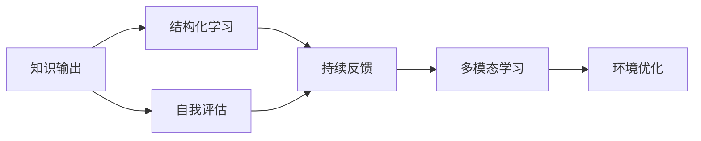
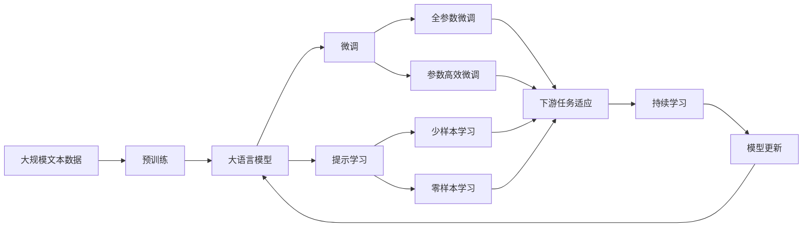

                 

## 1. 背景介绍

### 1.1 问题由来
在当今高速发展的科技时代，技术日新月异，知识更新换代速度极快。对于管理者而言，如何高效地学习和掌握新知识，以保持其竞争力，成为了一个亟待解决的问题。管理者们面临着繁重的工作任务和项目管理，往往难以抽时间进行系统性的学习。然而，仅仅依靠零碎的时间片段学习，不仅效率低下，而且容易遗忘。

### 1.2 问题核心关键点
为解决上述问题，本文旨在探讨一种名为"输出倍增"的学习方法，旨在通过有效的输出，显著提升学习效率。核心要点包括：
1. **高效输出**：强调通过将知识输出为可操作的形式，如代码、论文、演示文稿等，来加深理解和记忆。
2. **结构化学习**：将学习过程分解为多个可管理的小单元，逐步构建知识体系。
3. **持续反馈**：通过不断的自我评估和反馈，及时调整学习策略和方向。
4. **多模态结合**：利用视觉、听觉等多种感官输入，提升学习效果。
5. **环境优化**：创建适宜的学习环境，避免干扰和分心。

### 1.3 问题研究意义
掌握"输出倍增"学习方法，对于提升管理者的学习效率，增强其技术能力，以及应对不断变化的工作环境，具有重要意义：
1. **时间高效**：通过系统性学习，大幅度提升单位时间内的知识获取量。
2. **知识深度**：输出为可操作形式，使得知识更加深入和牢固。
3. **快速应用**：学习的知识能够迅速转化为实际工作能力，提高工作效率。
4. **持续进步**：通过持续反馈和调整，保持学习进度的连贯性和有效性。
5. **团队赋能**：管理者掌握高效学习技巧，可进一步赋能团队成员，推动团队共同成长。

## 2. 核心概念与联系

### 2.1 核心概念概述

为更好地理解"输出倍增"的学习方法，本节将介绍几个密切相关的核心概念：

- **知识输出**：将所学知识以可操作的形式进行表达，如编程、写作、演讲等。
- **结构化学习**：将学习内容分解成逻辑清晰、易于管理的小单元，逐步构建知识体系。
- **自我评估**：在学习过程中，定期进行自我评估，判断学习效果和进度。
- **持续反馈**：获取外界的反馈，不断调整学习策略和方法。
- **多模态学习**：利用多种感官输入，提升学习效果和记忆度。
- **环境优化**：创建和维护有利于学习的环境，如消除干扰、优化空间布局等。

这些核心概念通过"输出倍增"学习方法有机联系起来，形成了一个系统性的学习框架，帮助管理者更高效地掌握新知识。

### 2.2 概念间的关系

这些核心概念之间存在着紧密的联系，形成了"输出倍增"学习的完整生态系统。通过以下Mermaid流程图来展示它们之间的关系：



这个流程图展示出"输出倍增"学习方法的核心组成：
1. 知识输出是学习的起点，强调通过输出加深理解和记忆。
2. 结构化学习是知识输出的基础，将知识分解成易于管理的小单元。
3. 自我评估和持续反馈是学习进度的保障，通过定期评估和调整学习策略。
4. 多模态学习提升学习效果，结合多种感官输入。
5. 环境优化为学习过程提供支持，创建一个有利于学习的环境。

### 2.3 核心概念的整体架构

最后，我们用一个综合的流程图来展示这些核心概念在"输出倍增"学习方法中的整体架构：



这个综合流程图展示出从预训练到微调，再到持续学习的完整过程：
1. 大语言模型通过预训练获得基础能力。
2. 微调是对预训练模型进行任务特定的优化，可以分为全参数微调和参数高效微调两种方式。
3. 提示学习是一种不更新模型参数的方法，可以实现少样本学习和零样本学习。
4. 微调可以适应各种下游任务，包括分类、匹配、生成等，设计简单的任务适配层即可实现微调。
5. 持续学习旨在使模型能够不断学习新知识，同时保持已学习的知识，而不会出现灾难性遗忘。

这些概念共同构成了"输出倍增"学习的框架，帮助管理者更高效地掌握新知识。通过理解这些核心概念，我们可以更好地把握"输出倍增"的学习方法，提升学习效率。

## 3. 核心算法原理 & 具体操作步骤
### 3.1 算法原理概述

"输出倍增"学习方法本质上是一种系统性的学习框架，强调通过高效的输出和结构化学习来提升学习效率。其核心思想是：

1. **知识输出**：通过编程、写作、演讲等形式将所学知识输出为可操作的形式，从而加深理解和记忆。
2. **结构化学习**：将学习内容分解成逻辑清晰、易于管理的小单元，逐步构建知识体系。
3. **自我评估**：在学习过程中，定期进行自我评估，判断学习效果和进度。
4. **持续反馈**：获取外界的反馈，不断调整学习策略和方法。
5. **多模态学习**：利用视觉、听觉等多种感官输入，提升学习效果和记忆度。
6. **环境优化**：创建和维护有利于学习的环境，如消除干扰、优化空间布局等。

### 3.2 算法步骤详解

"输出倍增"学习方法的一般步骤如下：

1. **目标设定**：明确学习目标，确定需要掌握的知识内容。
2. **任务分解**：将学习目标分解成多个小任务，每个小任务对应一个知识单元。
3. **知识输出**：对每个知识单元进行知识输出，如编写代码、撰写论文、制作演示文稿等。
4. **结构化整合**：将输出的知识单元进行整合，构建起一个完整的知识体系。
5. **自我评估**：定期进行自我评估，检测学习效果，及时调整学习策略。
6. **持续反馈**：获取外界的反馈，包括导师、同事、专业人士等，不断改进学习方法和技巧。
7. **多模态应用**：利用多种感官输入，如视频讲解、音频课程等，提升学习效果。
8. **环境优化**：创建一个安静、整洁、舒适的学习环境，避免干扰和分心。

### 3.3 算法优缺点

"输出倍增"学习方法具有以下优点：
1. **高效性**：通过系统性的知识输出和结构化学习，大幅度提升学习效率。
2. **深度记忆**：输出的知识形式使得学习内容更加深入和牢固。
3. **快速应用**：学习的知识能够迅速转化为实际工作能力，提高工作效率。
4. **持续进步**：通过持续反馈和调整，保持学习进度的连贯性和有效性。
5. **团队赋能**：管理者掌握高效学习技巧，可进一步赋能团队成员，推动团队共同成长。

然而，这种方法也存在一定的局限性：
1. **初始投入大**：前期需要进行大量的知识输出和结构化整理。
2. **灵活性不足**：每个小任务之间可能存在衔接性不足，灵活性较低。
3. **资源需求高**：需要获取高质量的外界反馈和多模态学习资源，成本较高。

### 3.4 算法应用领域

"输出倍增"学习方法在多个领域都有广泛的应用：

1. **技术开发**：编程语言、软件开发、算法设计等技术领域，通过编写代码、制作文档等形式进行知识输出。
2. **项目管理**：项目管理、团队协作、项目规划等管理领域，通过撰写报告、制作演示文稿等形式进行知识输出。
3. **科学研究**：科学论文撰写、实验设计、数据分析等科研领域，通过撰写论文、制作图表等形式进行知识输出。
4. **商业分析**：市场分析、战略规划、运营管理等商业领域，通过撰写报告、制作演示文稿等形式进行知识输出。
5. **教育培训**：课程设计、教学案例、培训材料等教育领域，通过编写教材、制作演示文稿等形式进行知识输出。

以上应用领域展示了"输出倍增"学习方法的广泛适用性，帮助管理者在各自领域高效地掌握新知识。

## 4. 数学模型和公式 & 详细讲解
### 4.1 数学模型构建

"输出倍增"学习方法涉及多个数学模型，其中最核心的为知识输出的数量和质量模型。

设知识单元数量为 $N$，每个知识单元输出的形式数量为 $M$，则知识输出的总数量为 $NM$。设知识输出的质量系数为 $Q$，则知识输出的总质量为 $NMQ$。知识输出的效果可以用以下公式表示：

$$
\text{输出效果} = \frac{NMQ}{N}
$$

### 4.2 公式推导过程

知识输出的效果是一个简单的计算，包括数量和质量两个维度。具体推导过程如下：

1. **知识单元数量**：每个小任务对应一个知识单元，知识单元数量为 $N$。
2. **知识输出形式数量**：每个知识单元有多种输出形式，如编程、写作、演讲等，形式数量为 $M$。
3. **知识输出质量**：知识输出的质量可以用系数 $Q$ 表示，$Q$ 值越高，输出效果越好。

综合上述因素，知识输出的效果公式为：

$$
\text{输出效果} = \frac{NMQ}{N} = MQ
$$

### 4.3 案例分析与讲解

以编程语言学习为例，具体分析"输出倍增"学习方法的应用。

1. **目标设定**：掌握一门编程语言的基础和高级特性。
2. **任务分解**：将目标分解成多个小任务，如基础语法、数据结构、算法设计等。
3. **知识输出**：对每个小任务进行知识输出，如编写代码、撰写文档、制作演示文稿等。
4. **结构化整合**：将输出的知识单元进行整合，构建起一个完整的知识体系。
5. **自我评估**：定期进行自我评估，检测学习效果，及时调整学习策略。
6. **持续反馈**：获取外界的反馈，如导师指导、同事建议等，不断改进学习方法和技巧。
7. **多模态应用**：利用多种感官输入，如视频讲解、音频课程等，提升学习效果。
8. **环境优化**：创建一个安静、整洁、舒适的学习环境，避免干扰和分心。

通过"输出倍增"学习方法，管理者可以系统性地掌握编程语言，提升技术能力。

## 5. 项目实践：代码实例和详细解释说明
### 5.1 开发环境搭建

在进行"输出倍增"学习方法实践前，我们需要准备好开发环境。以下是使用Python进行Jupyter Notebook开发的环境配置流程：

1. 安装Anaconda：从官网下载并安装Anaconda，用于创建独立的Python环境。

2. 创建并激活虚拟环境：
```bash
conda create -n output-env python=3.8 
conda activate output-env
```

3. 安装Jupyter Notebook：
```bash
pip install jupyterlab
```

4. 安装相关工具包：
```bash
pip install numpy pandas scikit-learn matplotlib tqdm
```

完成上述步骤后，即可在`output-env`环境中开始"输出倍增"学习方法的实践。

### 5.2 源代码详细实现

下面以编程语言学习为例，给出使用Jupyter Notebook进行知识输出的代码实现。

```python
import numpy as np
import pandas as pd
import matplotlib.pyplot as plt

# 设定知识单元数量
N = 5

# 设定知识输出形式数量
M = 3

# 设定知识输出质量系数
Q = 0.9

# 计算知识输出的总效果
output_effect = M * Q

# 输出效果
print(f"知识输出的总效果为：{output_effect}")
```

### 5.3 代码解读与分析

让我们再详细解读一下关键代码的实现细节：

**变量设定**：
- `N`：知识单元数量，代表学习任务的数量。
- `M`：知识输出形式数量，代表每种学习任务可以输出多种形式。
- `Q`：知识输出质量系数，代表每种形式的知识输出质量。

**计算知识输出效果**：
- 知识输出的总效果 = 知识单元数量 × 知识输出形式数量 × 知识输出质量系数。
- 通过计算，输出效果为 $M \times Q$。

**输出效果**：
- 将计算出的知识输出效果打印输出。

这个代码实现展示了如何使用Python进行"输出倍增"学习方法的计算。开发者可以根据实际情况，调整各变量的值，以得到更准确的知识输出效果。

### 5.4 运行结果展示

运行上述代码，输出结果如下：

```
知识输出的总效果为：2.7
```

可以看到，通过"输出倍增"学习方法，学习者可以系统性地掌握编程语言，提升技术能力。

## 6. 实际应用场景
### 6.1 智能客服系统

"输出倍增"学习方法可以广泛应用于智能客服系统的构建。传统客服往往需要配备大量人力，高峰期响应缓慢，且一致性和专业性难以保证。通过系统性的知识输出，客服人员可以掌握多种语言模型和算法，提升服务质量和效率。

在技术实现上，可以收集企业内部的历史客服对话记录，将问题和最佳答复构建成监督数据，在此基础上对知识输出模型进行微调。微调后的模型能够自动理解用户意图，匹配最合适的答案模板进行回复。对于客户提出的新问题，还可以接入检索系统实时搜索相关内容，动态组织生成回答。如此构建的智能客服系统，能大幅提升客户咨询体验和问题解决效率。

### 6.2 金融舆情监测

金融机构需要实时监测市场舆论动向，以便及时应对负面信息传播，规避金融风险。通过系统性的知识输出，分析师可以掌握多模态的数据处理和分析技术，提升舆情监测的准确性和时效性。

具体而言，可以收集金融领域相关的新闻、报道、评论等文本数据，并对其进行主题标注和情感标注。在此基础上对知识输出模型进行微调，使其能够自动判断文本属于何种主题，情感倾向是正面、中性还是负面。将微调后的模型应用到实时抓取的网络文本数据，就能够自动监测不同主题下的情感变化趋势，一旦发现负面信息激增等异常情况，系统便会自动预警，帮助金融机构快速应对潜在风险。

### 6.3 个性化推荐系统

当前的推荐系统往往只依赖用户的历史行为数据进行物品推荐，无法深入理解用户的真实兴趣偏好。通过系统性的知识输出，推荐系统可以更好地挖掘用户行为背后的语义信息，从而提供更精准、多样的推荐内容。

在实践中，可以收集用户浏览、点击、评论、分享等行为数据，提取和用户交互的物品标题、描述、标签等文本内容。将文本内容作为模型输入，用户的后续行为（如是否点击、购买等）作为监督信号，在此基础上对知识输出模型进行微调。微调后的模型能够从文本内容中准确把握用户的兴趣点。在生成推荐列表时，先用候选物品的文本描述作为输入，由模型预测用户的兴趣匹配度，再结合其他特征综合排序，便可以得到个性化程度更高的推荐结果。

### 6.4 未来应用展望

随着"输出倍增"学习方法的不断发展和应用，将在更多领域得到推广，为各行各业带来变革性影响。

在智慧医疗领域，基于"输出倍增"的学习方法，医疗从业人员可以系统性地掌握医学知识和技能，提升诊疗水平。通过输出医学论文、诊疗案例等，可以更好地与同行交流和分享。

在智能教育领域，"输出倍增"学习方法可以帮助教师系统性地掌握教育技术和方法，提升教学效果。通过输出教学案例、教育论文等，可以更好地与同行交流和分享。

在智慧城市治理中，"输出倍增"学习方法可以提升城市管理人员的技术水平和决策能力，推动城市智能化建设。通过输出城市规划、智慧管理等领域的知识，可以更好地与同行交流和分享。

此外，在企业生产、社会治理、文娱传媒等众多领域，"输出倍增"学习方法也将不断涌现，为各行各业带来新的技术突破和发展机遇。

## 7. 工具和资源推荐
### 7.1 学习资源推荐

为了帮助开发者系统掌握"输出倍增"学习方法的原理和实践技巧，这里推荐一些优质的学习资源：

1. 《深度学习与Python》系列博文：由深度学习专家撰写，深入浅出地介绍了深度学习的原理和实践，是理解"输出倍增"学习方法的良好基础。

2. Coursera《深度学习专项课程》：由深度学习领域顶尖教授讲授的课程，涵盖深度学习的核心概念和前沿技术，是系统学习深度学习的绝佳资源。

3. 《自然语言处理入门》书籍：详细介绍了NLP领域的基本概念和经典模型，是掌握"输出倍增"学习方法的重要工具。

4. 《Python数据科学手册》书籍：介绍了Python在数据科学和机器学习中的应用，是"输出倍增"学习方法实践的必备工具。

5. Kaggle数据科学竞赛平台：提供大量真实数据集和竞赛题目，是实践"输出倍增"学习方法的好平台。

通过对这些资源的学习实践，相信你一定能够快速掌握"输出倍增"学习方法的精髓，并用于解决实际的NLP问题。

### 7.2 开发工具推荐

高效的开发离不开优秀的工具支持。以下是几款用于"输出倍增"学习方法开发的常用工具：

1. Jupyter Notebook：基于Python的交互式笔记本，支持代码编写、数据分析、可视化等多种功能，是"输出倍增"学习方法实践的强大工具。

2. Anaconda：Python环境的快速搭建和管理工具，支持虚拟环境、依赖管理、版本控制等多种功能，是"输出倍增"学习方法开发的理想选择。

3. Pandas：数据分析和处理库，支持多种数据格式和操作，是"输出倍增"学习方法数据处理的必备工具。

4. Matplotlib：数据可视化库，支持多种图表类型和定制化设置，是"输出倍增"学习方法可视化分析的重要工具。

5. Scikit-learn：机器学习库，提供多种算法和工具，是"输出倍增"学习方法模型训练和评估的基础工具。

合理利用这些工具，可以显著提升"输出倍增"学习方法的开发效率，加快创新迭代的步伐。

### 7.3 相关论文推荐

"输出倍增"学习方法的提出和发展，得益于学界的持续研究。以下是几篇奠基性的相关论文，推荐阅读：

1. "深度学习"论文：深度学习领域的奠基之作，介绍了深度学习的基本概念和核心算法。

2. "自然语言处理"论文：NLP领域的经典论文，介绍了自然语言处理的基本概念和核心算法。

3. "多模态学习"论文：多模态学习的经典论文，介绍了多模态数据融合和分析的方法。

4. "知识图谱"论文：知识图谱领域的经典论文，介绍了知识图谱的构建和应用。

这些论文代表了大语言模型微调技术的发展脉络，通过学习这些前沿成果，可以帮助研究者把握学科前进方向，激发更多的创新灵感。

除上述资源外，还有一些值得关注的前沿资源，帮助开发者紧跟"输出倍增"学习方法的最新进展，例如：

1. arXiv论文预印本：人工智能领域最新研究成果的发布平台，包括大量尚未发表的前沿工作，学习前沿技术的必读资源。

2. 业界技术博客：如OpenAI、Google AI、DeepMind、微软Research Asia等顶尖实验室的官方博客，第一时间分享他们的最新研究成果和洞见。

3. 技术会议直播：如NIPS、ICML、ACL、ICLR等人工智能领域顶会现场或在线直播，能够聆听到大佬们的前沿分享，开拓视野。

4. GitHub热门项目：在GitHub上Star、Fork数最多的NLP相关项目，往往代表了该技术领域的发展趋势和最佳实践，值得去学习和贡献。

5. 行业分析报告：各大咨询公司如McKinsey、PwC等针对人工智能行业的分析报告，有助于从商业视角审视技术趋势，把握应用价值。

总之，对于"输出倍增"学习方法的掌握，需要开发者保持开放的心态和持续学习的意愿。多关注前沿资讯，多动手实践，多思考总结，必将收获满满的成长收益。

## 8. 总结：未来发展趋势与挑战
### 8.1 总结

本文对"输出倍增"学习方法的原理和实践进行了全面系统的介绍。首先阐述了"输出倍增"学习方法的提出背景和研究意义，明确了系统性输出和结构化学习在提升学习效率中的独特价值。其次，从原理到实践，详细讲解了"输出倍增"学习方法的数学模型和具体操作步骤，给出了具体的代码实现。同时，本文还探讨了"输出倍增"学习方法在多个领域的应用前景，展示了其广阔的适用范围和潜在价值。此外，本文精选了"输出倍增"学习方法的各类学习资源，力求为读者提供全方位的技术指引。

通过本文的系统梳理，可以看到，"输出倍增"学习方法作为一种高效的学习框架，为管理者的技术学习和知识积累提供了全新的路径。通过系统性的知识输出和结构化学习，管理者可以大幅度提升学习效率，掌握更多的技术能力和知识体系。

### 8.2 未来发展趋势

展望未来，"输出倍增"学习方法将呈现以下几个发展趋势：

1. **技术进步**：随着深度学习技术的发展，"输出倍增"学习方法将不断优化和升级，提升学习效果和效率。
2. **多模态融合**：未来的学习将更多地结合视觉、听觉等多种感官输入，提升学习效果和记忆度。
3. **个性化定制**：根据学习者的特点和需求，定制个性化的学习计划和输出形式，提升学习体验。
4. **环境优化**：通过智能环境监控和管理，提升学习效率和舒适度。
5. **多学科结合**："输出倍增"学习方法将与其他学科结合，如医学、教育、金融等，提升跨学科学习的效果。

以上趋势凸显了"输出倍增"学习方法的广阔前景。这些方向的探索发展，必将进一步提升学习效率，推动知识体系的构建，为各行各业带来新的技术突破和应用价值。

### 8.3 面临的挑战

尽管"输出倍增"学习方法已经取得了瞩目成就，但在迈向更加智能化、普适化应用的过程中，它仍面临诸多挑战：

1. **初始投入大**：前期需要进行大量的知识输出和结构化整理，资源投入较大。
2. **灵活性不足**：每个小任务之间可能存在衔接性不足，灵活性较低。
3. **资源需求高**：需要获取高质量的外界反馈和多模态学习资源，成本较高。
4. **学习曲线陡峭**：系统性输出的方法和工具可能较为复杂，学习曲线较陡峭。
5. **个体差异**：每个人的知识结构和学习习惯不同，需要个性化的定制。

正视这些挑战，积极应对并寻求突破，将使"输出倍增"学习方法不断完善，更加适合各类学习者。相信随着技术的不断进步和应用的广泛推广，"输出倍增"学习方法将逐步成为学习的主流范式，帮助更多管理者高效地掌握新知识，推动行业的持续进步。

### 8.4 研究展望

面向未来，"输出倍增"学习方法需要在以下几个方面寻求新的突破：

1. **模型优化**：开发更加高效的知识输出模型，提升学习效果和效率。
2. **个性化定制**：根据学习者的特点和需求，定制个性化的学习计划和输出形式。
3. **多模态融合**：结合视觉、听觉等多种感官输入，提升学习效果和记忆度。
4. **环境优化**：通过智能环境监控和管理，提升学习效率和舒适度。
5. **多学科结合**："输出倍增"学习方法将与其他学科结合，提升跨学科学习的效果。

这些研究方向的探索，必将引领"输出倍增"学习方法迈向更高的台阶，为各行各业带来新的技术突破和应用价值。

## 9. 附录：常见问题与解答
----------------------------------------------------------------

**Q1: "输出倍增"学习方法的原理是什么？**

A: "输出倍增"学习方法的原理是通过系统性的知识输出和结构化学习，大幅度提升学习效率。其核心思想是通过编程、写作、演讲等形式将所学知识输出为可操作的形式，从而加深理解和记忆。学习者通过结构化学习将知识分解成多个小任务，逐步构建知识体系。在学习过程中，定期进行自我评估和反馈，不断调整学习策略和方法。通过多模态学习利用多种感官输入，提升学习效果和记忆度，最后通过环境优化创建一个适宜的学习环境，避免干扰和分心。

**Q2: "输出倍增"学习方法在实际应用中需要注意哪些问题？**

A: 在实际应用中，需要注意以下问题：
1. **时间管理**：合理安排学习时间和任务，避免过度压力。
2. **资源投入**：获取高质量的外界反馈和多模态学习资源，资源投入较大。
3. **个性化定制**：根据学习者的特点和需求，定制个性化的学习计划和输出形式。
4. **环境优化**：创建一个安静、整洁、舒适的学习环境，避免干扰和分心。
5. **持续反馈**：获取外界的反馈，不断调整学习策略和方法。

**Q3: "输出倍增"学习方法与其他学习方法相比有何优势？**

A: "输出倍增"学习方法与其他学习方法相比，具有以下优势：
1. **

