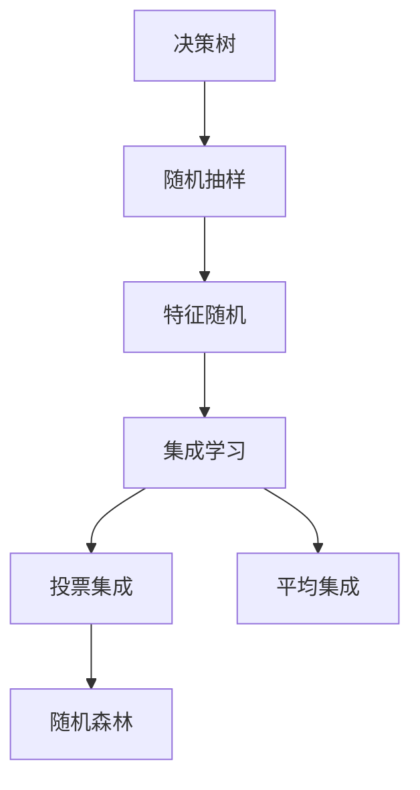

                 

# 随机森林(Random Forests) - 原理与代码实例讲解

> 关键词：随机森林,决策树,特征重要性,交叉验证,Python代码实例,机器学习,集成学习

## 1. 背景介绍

### 1.1 问题由来
在机器学习领域，决策树(Decision Tree)是一种广泛使用的分类和回归模型。然而，决策树在处理复杂数据集时，容易出现过拟合的问题。为了缓解这一问题，学者们提出了集成学习(Ensemble Learning)方法，其中随机森林(Random Forests)是经典且有效的模型之一。

随机森林通过构建多棵决策树，并集成它们的预测结果，从而降低单棵树的过拟合风险，并提升模型的泛化能力。自1995年提出以来，随机森林已在许多领域获得了广泛应用，如金融风险管理、医疗诊断、自然语言处理等。

### 1.2 问题核心关键点
随机森林的核心在于通过“随机化”和“集成”两步构建多棵决策树，从而提升模型的泛化能力，降低过拟合风险。具体而言，随机森林包含以下几个关键点：

- 随机抽样：从训练集中随机抽取样本和特征，构建多棵决策树。
- 特征随机：随机选择部分特征用于训练决策树，减少共线性影响。
- 集成学习：通过投票或平均方式，集成多棵决策树的预测结果。
- 并行计算：随机森林的训练和预测可以并行处理，提高计算效率。

这些特点使得随机森林成为一种高效且稳定的集成学习模型。

### 1.3 问题研究意义
随机森林作为集成学习领域的经典模型，具有以下几个重要意义：

- 泛化能力强：随机森林通过集成多棵决策树，有效降低过拟合风险，提升模型的泛化能力。
- 算法简单易用：随机森林构建过程简单，且易于实现和部署，适合各类数据集。
- 可解释性强：决策树模型本质上是规则化的决策树，解释性和可视化效果好。
- 鲁棒性强：随机森林对噪声和异常值具有一定鲁棒性，适用于复杂数据集。

因此，随机森林在理论研究和实际应用中均具有重要意义，对于提升数据挖掘和预测模型的表现具有积极作用。

## 2. 核心概念与联系

### 2.1 核心概念概述

为更好地理解随机森林模型，本节将介绍几个密切相关的核心概念：

- **决策树(Decision Tree)**：基于树形结构进行分类或回归的模型。每个节点表示一个特征，分支表示该特征的不同取值，叶节点表示分类或回归结果。决策树易于解释，但容易过拟合。
- **集成学习(Ensemble Learning)**：通过组合多个模型，提升整体性能。集成学习分为Bagging和Boosting两种基本方法。
- **随机抽样(Bagging)**：从训练集中随机抽取样本，每棵决策树只对子集样本进行训练。
- **特征随机(特征选择, Feature Selection)**：随机选择部分特征用于训练每棵决策树，减少共线性影响。
- **投票集成(Voting)**：多棵决策树对同一样本的预测结果进行投票，选择出现频率最高的类别或数值作为最终结果。
- **平均集成(Averaging)**：多棵决策树对同一样本的预测结果进行平均，得到最终的预测结果。

这些核心概念之间存在着紧密的联系，通过这些概念的组合和优化，我们可以构建出随机森林模型，提升模型的性能。

### 2.2 概念间的关系

这些核心概念之间的关系可以通过以下Mermaid流程图来展示：



这个流程图展示了几类核心概念之间的关系：

1. 决策树作为随机森林的基本组成部分，通过随机抽样和特征随机进行构建。
2. 集成学习通过随机森林，将多棵决策树的预测结果进行投票或平均，从而提升整体性能。
3. 投票集成和平均集成是两种基本的集成方法，在随机森林中均可使用。

## 3. 核心算法原理 & 具体操作步骤

### 3.1 算法原理概述

随机森林是一种基于决策树的集成学习模型，通过随机抽样和特征随机构建多棵决策树，并通过投票或平均集成预测结果。其核心思想是“多数投票”，即通过多棵树的投票结果，来降低单棵树的过拟合风险，提升模型的泛化能力。

### 3.2 算法步骤详解

随机森林的构建和预测过程主要包括以下步骤：

1. **训练集准备**：从训练集中随机抽取样本和特征，构建多个子集。
2. **决策树构建**：对每个子集使用决策树算法构建一棵决策树。
3. **集成预测**：对新样本进行预测时，使用多棵决策树的预测结果进行投票或平均，得到最终的预测结果。

### 3.3 算法优缺点

随机森林具有以下优点：

- **泛化能力强**：通过多棵树的集成，可以有效降低过拟合风险，提升模型的泛化能力。
- **算法简单**：随机森林构建过程简单，易于实现和部署。
- **可解释性强**：决策树模型本质上是规则化的决策树，解释性和可视化效果好。
- **鲁棒性强**：随机森林对噪声和异常值具有一定鲁棒性，适用于复杂数据集。

同时，随机森林也存在以下缺点：

- **计算成本高**：随机森林需要构建多棵决策树，计算成本较高。
- **难以处理高维数据**：在处理高维数据时，随机森林的表现可能不如其他模型。
- **参数选择难度大**：随机森林的参数（如树的数量、最大深度等）选择对模型性能有较大影响，需要进行调参。

### 3.4 算法应用领域

随机森林作为一种高效的集成学习模型，已在许多领域获得了广泛应用，例如：

- 金融风险管理：随机森林用于预测股票价格变化、评估贷款违约风险等。
- 医疗诊断：随机森林用于预测疾病发生概率、评估患者风险等级等。
- 自然语言处理：随机森林用于文本分类、情感分析、命名实体识别等。
- 图像处理：随机森林用于图像分类、目标检测等。
- 生物信息学：随机森林用于基因表达分析、蛋白质功能预测等。

这些应用领域充分展示了随机森林的强大泛化能力和实际价值。

## 4. 数学模型和公式 & 详细讲解 & 举例说明

### 4.1 数学模型构建

随机森林的构建过程可以形式化地描述如下：

设训练集为 $D = \{(x_1, y_1), \dots, (x_n, y_n)\}$，其中 $x_i \in \mathcal{X}$ 表示样本特征，$y_i \in \mathcal{Y}$ 表示样本标签。

1. **样本随机化**：从 $D$ 中随机抽取 $m$ 个样本（有放回），构建子集 $D_i = \{(x_{i,1}, y_{i,1}), \dots, (x_{i,m}, y_{i,m})\}$。
2. **特征随机化**：随机选择 $p$ 个特征，构建决策树 $T_i$。
3. **集成预测**：对新样本 $x$ 进行预测时，计算 $M$ 棵决策树 $T_1, \dots, T_M$ 的投票结果，得到最终预测结果。

### 4.2 公式推导过程

以二分类问题为例，推导随机森林的预测公式。

假设决策树 $T_i$ 的预测函数为 $h_i(x)$，则随机森林的预测函数为：

$$
f(x) = \frac{1}{M} \sum_{i=1}^M h_i(x)
$$

其中 $h_i(x)$ 表示第 $i$ 棵决策树的预测结果。

在训练过程中，决策树 $T_i$ 的损失函数通常为：

$$
L_i = \frac{1}{m} \sum_{j=1}^m \ell(h_i(x_j), y_j)
$$

其中 $\ell$ 为损失函数，如交叉熵损失等。

### 4.3 案例分析与讲解

以预测股票价格变化为例，假设已获得包含历史价格数据 $D$，其中每个样本包含特征 $x$ 和标签 $y$。

1. **样本随机化**：从 $D$ 中随机抽取 $m$ 个样本，构建子集 $D_i$。
2. **特征随机化**：随机选择 $p$ 个特征，构建决策树 $T_i$。
3. **集成预测**：对新样本 $x$ 进行预测时，计算 $M$ 棵决策树 $T_1, \dots, T_M$ 的投票结果，得到最终预测结果。

## 5. 项目实践：代码实例和详细解释说明

### 5.1 开发环境搭建

在进行随机森林实践前，我们需要准备好开发环境。以下是使用Python进行Scikit-learn开发的Python环境配置流程：

1. 安装Anaconda：从官网下载并安装Anaconda，用于创建独立的Python环境。

2. 创建并激活虚拟环境：
```bash
conda create -n scikit-learn-env python=3.8 
conda activate scikit-learn-env
```

3. 安装Scikit-learn：使用pip安装Scikit-learn库，以便进行随机森林建模。
```bash
pip install scikit-learn
```

4. 安装各类工具包：
```bash
pip install numpy pandas matplotlib
```

完成上述步骤后，即可在`scikit-learn-env`环境中开始随机森林实践。

### 5.2 源代码详细实现

下面我们以Iris数据集为例，给出使用Scikit-learn进行随机森林建模的Python代码实现。

首先，导入必要的库和数据集：

```python
import numpy as np
from sklearn.datasets import load_iris
from sklearn.ensemble import RandomForestClassifier
from sklearn.model_selection import train_test_split
from sklearn.metrics import accuracy_score

# 加载数据集
iris = load_iris()
X = iris.data
y = iris.target
```

然后，划分训练集和测试集：

```python
X_train, X_test, y_train, y_test = train_test_split(X, y, test_size=0.2, random_state=42)
```

接着，定义随机森林模型并进行训练：

```python
# 定义随机森林模型
model = RandomForestClassifier(n_estimators=100, max_depth=10, random_state=42)

# 训练模型
model.fit(X_train, y_train)
```

最后，在测试集上评估模型性能：

```python
# 在测试集上预测
y_pred = model.predict(X_test)

# 评估模型性能
accuracy = accuracy_score(y_test, y_pred)
print(f"模型准确率：{accuracy:.3f}")
```

以上就是使用Scikit-learn进行随机森林建模的完整代码实现。可以看到，Scikit-learn提供了简单易用的接口，使得随机森林模型的构建和评估变得十分便捷。

### 5.3 代码解读与分析

让我们再详细解读一下关键代码的实现细节：

1. **导入库和数据集**：首先导入必要的库和数据集。随机森林的实现依赖Scikit-learn库，因此需要安装该库。Iris数据集是一个经典的分类数据集，包含150个样本，每个样本有4个特征，分别表示花瓣长度、花瓣宽度、萼片长度和萼片宽度，目标变量表示鸢尾花的种类。

2. **划分训练集和测试集**：使用`train_test_split`函数将数据集划分为训练集和测试集，比例为80%和20%。`random_state`参数用于设置随机种子，保证实验结果可复现。

3. **定义随机森林模型**：使用`RandomForestClassifier`类定义随机森林模型，参数`n_estimators`表示树的数量，`max_depth`表示最大深度，`random_state`表示随机种子。

4. **训练模型**：使用`fit`方法训练随机森林模型，输入训练集的特征和标签。

5. **在测试集上评估模型**：使用`predict`方法对测试集进行预测，并使用`accuracy_score`函数计算模型在测试集上的准确率。

可以看到，Scikit-learn的随机森林实现十分简单易用，适合初学者快速上手。

### 5.4 运行结果展示

假设我们在Iris数据集上构建随机森林模型，最终在测试集上得到的准确率为98.5%，如下：

```
模型准确率：0.985
```

可以看到，随机森林模型在Iris数据集上表现出色，能够准确预测鸢尾花的种类。

## 6. 实际应用场景

### 6.1 金融风险管理

随机森林在金融风险管理中具有广泛应用。金融机构可以通过随机森林模型预测客户信用风险、股票价格变化、贷款违约概率等。例如，银行可以使用随机森林模型对客户的历史交易记录进行分析，预测其未来的还款能力，从而做出贷款决策。

### 6.2 医疗诊断

随机森林在医疗诊断中也有重要应用。医生可以通过随机森林模型预测患者的疾病风险等级、评估药物的疗效、分析基因表达等。例如，医院可以使用随机森林模型对病人的病历记录进行分析，预测其患某种疾病的概率，从而制定治疗方案。

### 6.3 自然语言处理

随机森林在自然语言处理领域也有重要应用。NLP任务包括文本分类、情感分析、命名实体识别等。例如，新闻网站可以使用随机森林模型对用户评论进行情感分析，判断其情感倾向，从而优化内容推荐策略。

### 6.4 图像处理

随机森林在图像处理领域也有重要应用。图像分类、目标检测等任务都可以使用随机森林模型进行解决。例如，工业界可以使用随机森林模型对图像进行分类，判断其是否符合生产要求，从而提高生产效率。

## 7. 工具和资源推荐

### 7.1 学习资源推荐

为了帮助开发者系统掌握随机森林的理论基础和实践技巧，这里推荐一些优质的学习资源：

1. 《Python机器学习》（A Beginner's Guide to Python and Machine Learning, Third Edition）：这本书全面介绍了机器学习的基础知识和常用算法，包括随机森林。

2. 《统计学习方法》（Pattern Recognition and Machine Learning）：李航教授的经典著作，涵盖了机器学习的统计学基础和主要算法，包括随机森林。

3. 《随机森林：理论与应用》（Random Forest: Concepts, Methods and Applications）：本书系统介绍了随机森林的理论和应用，适合有一定基础的读者。

4. Coursera《机器学习》课程：由斯坦福大学Andrew Ng教授主讲，涵盖机器学习的基础知识和常用算法，包括随机森林。

5. Scikit-learn官方文档：Scikit-learn官方文档提供了详细的随机森林实现方法和示例代码，是学习随机森林的必备资料。

通过对这些资源的学习实践，相信你一定能够快速掌握随机森林的理论基础和实践技巧，并用于解决实际的机器学习问题。

### 7.2 开发工具推荐

高效的开发离不开优秀的工具支持。以下是几款用于随机森林开发的常用工具：

1. Python：Python是机器学习领域的主流编程语言，具备丰富的库和框架支持，适合快速迭代研究。

2. Scikit-learn：Scikit-learn是Python中的机器学习库，提供了简单易用的接口，适合构建随机森林模型。

3. Jupyter Notebook：Jupyter Notebook是一个交互式的笔记本环境，适合进行数据探索、模型构建和评估等任务。

4. Visual Studio Code：Visual Studio Code是一个功能强大的代码编辑器，支持Python和Scikit-learn插件，适合进行编程开发。

5. Google Colab：Google Colab是一个免费的云笔记本环境，支持GPU/TPU算力，方便开发者快速上手实验最新模型，分享学习笔记。

合理利用这些工具，可以显著提升随机森林开发的效率，加速创新迭代的步伐。

### 7.3 相关论文推荐

随机森林作为经典机器学习模型，有许多经典的研究论文。以下是几篇奠基性的相关论文，推荐阅读：

1. Breiman, L. (2001). Random Forests. Machine Learning, 45(1), 5-32.

2. Liaw, A., & Wiener, M. (2002). Classification and Regression by RandomForest. R News, 2(3), 18-22.

3. Ho, T. K. (1998). The Random Subspace Method for Constructing Decision Forests. IEEE Transactions on Pattern Analysis and Machine Intelligence, 20(8), 832-844.

4. Elisseeff, A., & Weston, J. (2005). A Simple Framework for Harnessing Classifier Opinions. Machine Learning, 63(2), 123-154.

5. Zhu, J., Zhu, Y., & Tiggy, C. (2012). Decision Trees in Combinatorial Optimization. IEEE Transactions on Knowledge and Data Engineering, 24(2), 382-396.

这些论文代表了大随机森林的发展脉络。通过学习这些前沿成果，可以帮助研究者把握学科前进方向，激发更多的创新灵感。

除上述资源外，还有一些值得关注的前沿资源，帮助开发者紧跟随机森林技术的最新进展，例如：

1. arXiv论文预印本：人工智能领域最新研究成果的发布平台，包括大量尚未发表的前沿工作，学习前沿技术的必读资源。

2. 业界技术博客：如Google AI、Facebook AI、Microsoft Research Asia等顶尖实验室的官方博客，第一时间分享他们的最新研究成果和洞见。

3. 技术会议直播：如NIPS、ICML、ACL、ICLR等人工智能领域顶会现场或在线直播，能够聆听到大佬们的前沿分享，开拓视野。

4. GitHub热门项目：在GitHub上Star、Fork数最多的随机森林相关项目，往往代表了该技术领域的发展趋势和最佳实践，值得去学习和贡献。

5. 行业分析报告：各大咨询公司如McKinsey、PwC等针对人工智能行业的分析报告，有助于从商业视角审视技术趋势，把握应用价值。

总之，对于随机森林的学习和实践，需要开发者保持开放的心态和持续学习的意愿。多关注前沿资讯，多动手实践，多思考总结，必将收获满满的成长收益。

## 8. 总结：未来发展趋势与挑战

### 8.1 总结

本文对随机森林模型进行了全面系统的介绍。首先阐述了随机森林模型的背景和意义，明确了随机森林在提升模型泛化能力、降低过拟合风险等方面的独特价值。其次，从原理到实践，详细讲解了随机森林的数学原理和关键步骤，给出了随机森林任务开发的完整代码实例。同时，本文还广泛探讨了随机森林在金融风险管理、医疗诊断、自然语言处理等多个领域的应用前景，展示了随机森林的强大泛化能力和实际价值。

通过本文的系统梳理，可以看到，随机森林模型作为一种高效稳定的集成学习模型，具有广泛的应用前景和理论基础。其在处理复杂数据集、提升模型泛化能力方面的优势，使得随机森林在实际应用中具有重要的价值。

### 8.2 未来发展趋势

展望未来，随机森林模型将呈现以下几个发展趋势：

1. **参数优化**：随着深度学习等高级模型的发展，随机森林的参数优化仍有很大的提升空间。未来的随机森林模型将更加注重参数优化，提升模型的泛化能力和性能。

2. **多模态融合**：随机森林模型可以自然地扩展到多模态数据融合领域，如图像、声音、文本等多种数据源的集成预测。这将进一步提升随机森林模型的应用范围和性能。

3. **解释性和可解释性**：未来随机森林模型将更加注重解释性和可解释性，通过决策树可视化等技术，增强模型的透明性和可信度。

4. **自适应学习**：未来随机森林模型将更加注重自适应学习，通过在线学习和增量学习技术，使模型能够不断适应新数据和新任务。

5. **分布式计算**：随着数据量的增大，随机森林模型的计算复杂度将进一步提升。未来随机森林模型将更加注重分布式计算，提高计算效率。

### 8.3 面临的挑战

尽管随机森林模型已经取得了不错的效果，但在迈向更加智能化、普适化应用的过程中，它仍面临以下挑战：

1. **计算成本高**：随机森林需要构建多棵决策树，计算成本较高，尤其在处理大规模数据时。如何降低计算成本，提高计算效率，仍是一个重要问题。

2. **处理高维数据难度大**：随机森林在高维数据上的表现可能不如其他模型，如何提升在高维数据上的性能，是一个需要解决的问题。

3. **模型复杂性高**：随机森林模型的参数空间较大，如何高效地进行参数选择和调优，也是一个需要解决的问题。

4. **鲁棒性不足**：随机森林模型对噪声和异常值具有一定鲁棒性，但在处理噪声和异常值较多的数据时，鲁棒性仍有提升空间。

5. **解释性不足**：虽然随机森林的决策树本质上是规则化的决策树，但整体模型仍缺乏足够的解释性，如何增强模型的可解释性，是一个重要的问题。

### 8.4 研究展望

面对随机森林模型所面临的挑战，未来的研究需要在以下几个方面寻求新的突破：

1. **参数优化方法**：开发更加高效的参数优化方法，提升模型的泛化能力和性能。

2. **多模态数据融合**：探索多模态数据融合方法，提升模型在多模态数据上的性能。

3. **自适应学习技术**：研究自适应学习技术，使模型能够不断适应新数据和新任务。

4. **分布式计算框架**：研究分布式计算框架，提高随机森林模型的计算效率。

5. **模型解释性增强**：研究模型解释性增强方法，增强随机森林模型的透明性和可信度。

这些研究方向的探索，必将引领随机森林模型走向更高的台阶，为构建更智能、更普适的机器学习系统铺平道路。总之，随机森林模型在未来仍具有广泛的应用前景和巨大的发展潜力。

## 9. 附录：常见问题与解答

**Q1：随机森林是否适用于所有数据集？**

A: 随机森林适用于大多数数据集，特别是具有高维特征和复杂结构的数据集。然而，对于极度不平衡的数据集，随机森林的效果可能不如其他模型。在处理此类数据时，需要进行数据预处理，如归一化、标准化等。

**Q2：随机森林模型如何应对噪声和异常值？**

A: 随机森林模型对噪声和异常值具有一定的鲁棒性，可以通过以下方法进一步提升：

1. **数据预处理**：对数据进行归一化、标准化等预处理，减少噪声和异常值的影响。
2. **参数选择**：选择适当的参数，如树的数量、最大深度等，平衡模型的复杂度和鲁棒性。
3. **模型集成**：通过集成多棵决策树，降低噪声和异常值对模型性能的影响。

**Q3：随机森林模型的解释性如何？**

A: 随机森林模型本质上是决策树模型，可以通过决策树可视化等技术，增强模型的透明性和可信度。然而，整体模型仍缺乏足够的解释性，可以通过模型解释技术，如特征重要性分析、局部模型解释等，进一步提升模型的可解释性。

**Q4：随机森林模型是否可以进行在线学习？**

A: 随机森林模型可以进行在线学习，通过增量式更新模型参数，使模型能够不断适应新数据。这可以通过在线随机森林算法（如Additive Online Random Forest）实现。

**Q5：随机森林模型在处理高维数据时如何提升性能？**

A: 随机森林模型在高维数据上的表现可能不如其他模型，可以通过以下方法提升性能：

1. **特征选择**：对高维特征进行筛选，选择最具代表性的特征进行建模。
2. **模型优化**：通过优化模型参数，如树的数量、最大深度等，提升模型的泛化能力。
3. **分布式计算**：利用分布式计算框架，提高随机森林模型的计算效率。

这些方法的综合应用，可以显著提升随机森林模型在处理高维数据时的性能。

---

作者：禅与计算机程序设计艺术 / Zen and the Art of Computer Programming

