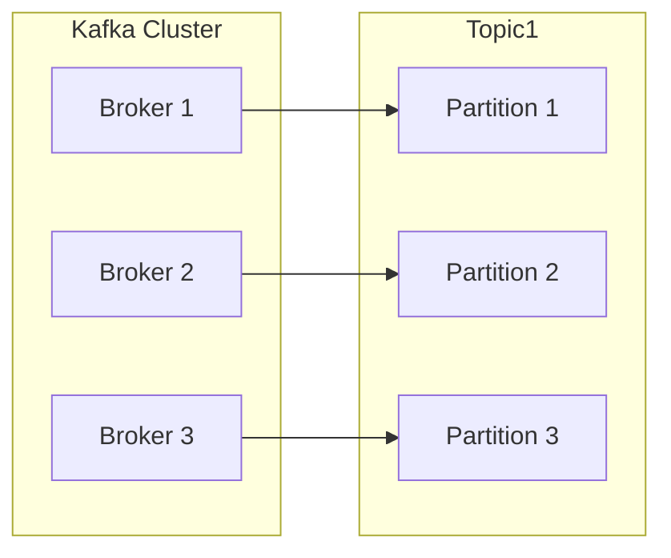
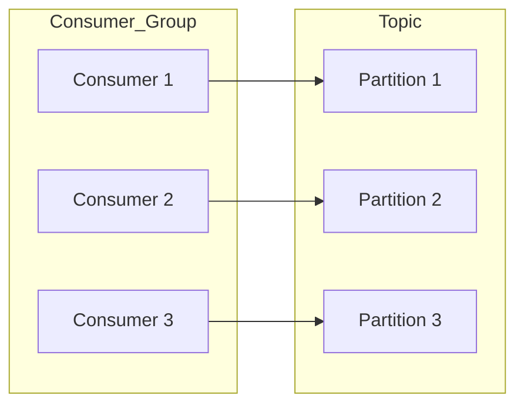
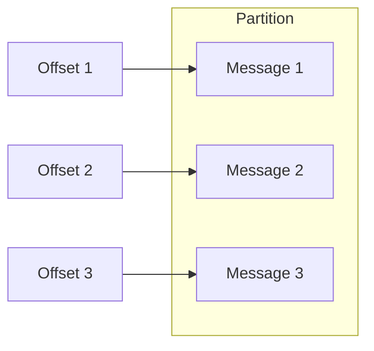
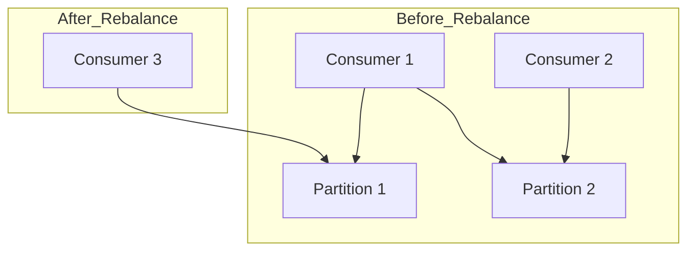

# Kafka Consumer原理与代码实例讲解

## 1. 背景介绍

### 1.1 问题的由来

在现代分布式系统中,数据流的实时处理和消费是一个非常关键的问题。传统的消息队列系统往往存在吞吐量有限、可扩展性差、运维复杂等问题,难以满足大规模分布式场景下的需求。Apache Kafka作为一种高吞吐量的分布式发布订阅消息系统,被广泛应用于大数据领域的数据管道构建、流式处理、持久化存储等场景。

Kafka Consumer作为Kafka体系中的核心组件之一,负责从Kafka的Topic中拉取消息并进行消费处理,是实现分布式数据流处理的关键环节。掌握Kafka Consumer的原理和使用方式,对于构建高效、可靠的分布式数据处理系统至关重要。

### 1.2 研究现状

目前,已有大量研究文献和开源项目探讨了Kafka Consumer的设计和实现。主要研究内容包括:

1. **消费者组(Consumer Group)机制**: 多个Consumer可以组成一个Consumer Group,实现消息的并行消费和负载均衡。
2. **消费位移(Offset)管理**: 记录每个Consumer在Topic中的消费进度,以实现消息的精确一次处理。
3. **消费者重平衡(Rebalance)**: 当Consumer加入或离开时,需要重新分配Partition的消费任务。
4. **容错与恢复**: 保证消息在消费过程中不会丢失或重复消费。
5. **性能优化**: 提高消费吞吐量,降低延迟。

### 1.3 研究意义

深入理解Kafka Consumer的原理和实现细节,对于以下方面具有重要意义:

1. **构建高性能分布式系统**: Kafka广泛应用于大数据、微服务、物联网等领域,Consumer是实现实时数据处理的核心组件。
2. **提高系统可靠性**: 合理配置和使用Consumer,可以保证消息的可靠传输和精确一次处理。
3. **优化系统性能**: 通过调优Consumer参数和实现细节,可以显著提升消费吞吐量和降低延迟。
4. **简化系统运维**: 掌握Consumer的工作原理,有助于排查和解决生产环境中的问题。

### 1.4 本文结构

本文将全面介绍Kafka Consumer的设计原理、实现细节和使用方式,具体内容安排如下:

1. 核心概念与联系
2. 核心算法原理和具体操作步骤
3. 数学模型和公式详细讲解及案例分析
4. 项目实践:代码实例和详细解释说明
5. 实际应用场景
6. 工具和资源推荐
7. 总结:未来发展趋势与挑战
8. 附录:常见问题与解答

## 2. 核心概念与联系

在深入探讨Kafka Consumer的原理之前,我们先介绍一些核心概念,为后续内容打下基础。

### 2.1 Topic和Partition

Kafka按Topic对消息进行分类,每个Topic又被分为多个有序的Partition,这些Partition可以分布在不同的Broker上,从而实现消息的并行处理。消费者从Partition中拉取消息进行消费。

### 2.2 消费者组(Consumer Group)

Kafka消费者通过Consumer Group实现消息的并行消费。一个Consumer Group由多个Consumer实例组成,每个Partition只能被同一个Consumer Group中的一个Consumer消费。

### 2.3 消费位移(Offset)

Offset记录了Consumer在Partition中的消费位置,Kafka通过维护Offset来实现消息的精确一次处理。每个Partition在每个Consumer Group内都有一个对应的Offset值。

### 2.4 消费者重平衡(Rebalance)

当Consumer实例加入或离开Consumer Group时,Partition的消费任务需要在Consumer Group内部重新分配,这个过程称为重平衡(Rebalance)。重平衡可能导致部分消息被重复消费或丢失,需要谨慎处理。

### 2.5 消费模式

Kafka Consumer支持两种消费模式:

1. **独立消费者(Independent Consumer)**: 每个Consumer实例独立消费,不属于任何Consumer Group。适用于单机场景或数据处理与存储解耦的场景。

2. **消费者组(Consumer Group)**: 多个Consumer实例组成一个Consumer Group,实现消息的并行消费。适用于分布式数据处理场景。

## 3. 核心算法原理与具体操作步骤

### 3.1 算法原理概述

Kafka Consumer的核心算法包括以下几个方面:

1. **Partition分配算法**: 决定如何在Consumer Group内部分配Partition的消费任务。
2. **消费位移管理算法**: 维护每个Consumer在Partition中的消费位置,实现精确一次处理。
3. **消费者重平衡算法**: 在Consumer加入或离开时,重新分配Partition的消费任务。
4. **消费流控算法**: 控制消费速率,避免消费过载。

### 3.2 算法步骤详解

#### 3.2.1 Partition分配算法

Kafka采用Range Partitioning Strategy算法在Consumer Group内部分配Partition。具体步骤如下:

1. 对Consumer Group内的所有Consumer实例进行排序,假设有N个Consumer。
2. 对订阅的所有Partition进行排序,假设有M个Partition。
3. 将M个Partition平均分配给N个Consumer,每个Consumer分配M/N个Partition。
4. 如果有余数,则将余数个Partition顺序分配给前余数个Consumer。

例如,有3个Consumer和8个Partition,则分配结果为:

- Consumer 1: Partition 0,1,2
- Consumer 2: Partition 3,4,5
- Consumer 3: Partition 6,7

该算法保证了Partition分配的均匀性,并且在Consumer实例数量发生变化时,只需重新分配部分Partition。

#### 3.2.2 消费位移管理算法

Kafka支持自动和手动两种Offset管理模式:

1. **自动位移提交(Automatic Commit)**: Consumer每隔一段时间自动将当前Offset提交到Kafka的内部主题(__consumer_offsets)中。这种模式简单,但如果Consumer发生崩溃,可能会导致部分消息被重复消费。

2. **手动位移提交(Manual Commit)**: 应用程序手动控制Offset的提交时机。这种模式更加灵活,可以结合应用程序的业务逻辑实现精确一次处理,但需要更多的代码编写。

无论采用哪种模式,Kafka都会定期将Offset信息从内存刷新到磁盘,以保证Offset的持久性。

#### 3.2.3 消费者重平衡算法

当Consumer Group内部的Consumer实例数量发生变化时,需要重新分配Partition的消费任务,这个过程称为重平衡(Rebalance)。重平衡算法如下:

1. 一个Consumer加入或离开Consumer Group时,会触发重平衡。
2. 所有Consumer实例向作为Rebalance协调者的一个Consumer发送请求,加入重平衡。
3. 协调者收集所有Consumer的订阅信息,并使用Partition分配算法重新分配Partition。
4. 协调者将新的Partition分配方案发送给所有Consumer。
5. 每个Consumer根据新的分配方案,释放旧的Partition并获取新的Partition。

在重平衡过程中,为了避免消息被重复消费或丢失,Consumer需要根据应用场景选择合适的策略,如:

- 读取已提交的最新Offset
- 从最新的Offset开始消费(可能丢失消息)
- 从最早的Offset开始消费(可能重复消费)

#### 3.2.4 消费流控算法

为了避免Consumer消费过载,Kafka提供了多种流控机制:

1. **限制拉取批次大小(Max Fetch Bytes)**: 限制每次拉取消息的最大字节数。
2. **限制拉取等待时间(Fetch Max Wait)**: 限制Consumer在拉取消息时的最大等待时间。
3. **限制拉取字节速率(Max Partition Fetch Bytes)**: 限制每秒从单个Partition拉取的最大字节数。

应用程序可以根据实际场景和性能需求,合理配置这些参数,在吞吐量和延迟之间寻求平衡。

### 3.3 算法优缺点

#### 3.3.1 优点

1. **高可扩展性**: 通过增加Consumer实例,可以线性提升消费能力。
2. **高容错性**: 单个Consumer实例失败不会影响整个Consumer Group的工作。
3. **有序性保证**: Partition内部消息是有序的,方便实现有序性需求的业务场景。
4. **精确一次处理**: 通过Offset管理,可以实现消息的精确一次处理。

#### 3.3.2 缺点

1. **重平衡开销**: 重平衡过程会导致短暂的性能下降和可能的消息重复或丢失。
2. **有序性限制**: 只能在单个Partition内保证消息有序,无法跨Partition保证。
3. **流控复杂性**: 需要合理配置多个参数以达到最佳性能。

### 3.4 算法应用领域

Kafka Consumer广泛应用于以下领域:

1. **大数据处理**: 作为流式数据的消费端,实现离线数据分析、ETL等任务。
2. **微服务架构**: 实现异步事件驱动架构,解耦微服务之间的通信。
3. **物联网(IoT)**: 实时消费来自传感器的大量数据流。
4. **日志收集**: 收集分布在多个节点上的日志数据,实现集中式日志处理。

## 4. 数学模型和公式详细讲解及举例说明

### 4.1 数学模型构建

为了更好地理解Kafka Consumer的工作原理,我们可以构建一个数学模型来描述其消费过程。

假设有一个Consumer Group,包含$N$个Consumer实例$C_1, C_2, \dots, C_N$,订阅了一个Topic,该Topic包含$M$个Partition$P_1, P_2, \dots, P_M$。我们定义以下变量和函数:

- $O_{i,j}$: Consumer $C_i$在Partition $P_j$中的消费位移(Offset)
- $R_{i,j}$: Consumer $C_i$从Partition $P_j$拉取消息的速率(条/秒)
- $W_{i,j}$: Consumer $C_i$处理从Partition $P_j$拉取的消息的速率(条/秒)
- $Q_{j}(t)$: 时刻$t$时,Partition $P_j$中待消费消息的数量
- $A_{j}(t)$: 时刻$t$时,向Partition $P_j$写入新消息的速率(条/秒)

我们的目标是使$Q_{j}(t)$保持在一个合理的范围内,即:

$$\lim_{t \to \infty} Q_{j}(t) = Q^{*}_{j}$$

其中$Q^{*}_{j}$是Partition $P_j$中待消费消息的期望值。

### 4.2 公式推导过程

根据上述定义,我们可以推导出Partition $P_j$中待消费消息数量$Q_{j}(t)$的变化率:

$$\frac{dQ_{j}(t)}{dt} = A_{j}(t) - \sum_{i=1}^{N}R_{i,j}(t)$$