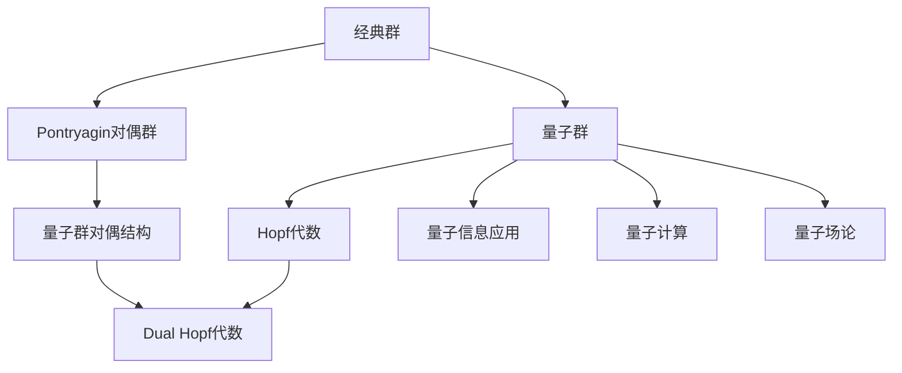

# Pontryagin对偶与代数量子超群：附录

## 关键词：

- Pontryagin对偶理论
- 量子群
- Hopf代数
- 量子力学
- 量子信息科学

## 1. 背景介绍

### 1.1 问题的由来

现代物理理论的发展中，特别是量子场论和量子信息科学的研究中，对称性扮演着至关重要的角色。在经典数学中，群的概念用来描述物体的对称变换。而在量子理论中，为了处理超越经典物理的概念，引入了量子群的概念。量子群是对经典群的一种“量子化”形式，能够更精确地描述量子系统的性质。Pontryagin对偶理论则是研究群与其对偶群之间关系的经典理论，而本文将探讨如何将这一理论推广到量子群的背景下，探索量子群的对偶结构以及代数量子超群的理论框架。

### 1.2 研究现状

在过去的几十年里，量子群理论已经取得了显著进展，特别是在数学物理领域。人们发现量子群不仅在理论物理中有着广泛应用，也在数学的其他分支，比如代数几何、拓扑学、图论等领域展现出了深刻的联系。Pontryagin对偶理论在经典数学中的重要性启发了对量子群对偶结构的研究，这个方向的探索有助于深化对量子系统内在结构的理解，同时也为量子信息处理、量子纠错码、量子算法设计等领域提供了理论基础和技术支持。

### 1.3 研究意义

研究Pontryagin对偶理论在量子群背景下的应用，不仅可以加深我们对量子系统的理解，还能够为量子计算和量子通信等领域提供新的理论框架和工具。这一研究还能促进跨学科的交流，将数学理论与物理应用紧密结合起来，推动量子科技的发展。

### 1.4 本文结构

本文旨在探讨Pontryagin对偶理论在量子群背景下的应用，首先介绍基本概念和理论框架，随后详细讨论量子群的Pontryagin对偶结构，接着分析代数量子超群的特性，最后通过案例研究和具体例子展示理论的应用，最后对研究前景进行展望。

## 2. 核心概念与联系

### 2.1 Pontryagin对偶理论简介

Pontryagin对偶理论描述了一种将群与其对偶群建立联系的方法。对偶群通常在数学分析中具有重要作用，它允许对群的操作进行更深入的分析和理解。在群的范畴内，每个群可以看作是其自身的对偶对象的映射集合。

### 2.2 量子群概念

量子群是经典群在量子力学框架下的“量子化”版本，它们在保持群的基本结构的同时，引入了量子化参数，从而允许在某些情况下描述超越经典物理的现象。量子群的概念涉及到Hopf代数，这是同时拥有乘法结构和对偶结构的代数系统。

### 2.3 结合Pontryagin对偶理论与量子群

在量子群的背景下，Pontryagin对偶理论的推广意味着寻找一种方式，将量子群与其对偶结构相联系，这种对偶结构在量子系统中具有特殊的物理意义和数学结构。通过这种方式，可以揭示量子系统内部的对称性和结构，为量子信息处理和量子计算提供新的视角和工具。

### 2.4 结构化流程图



## 3. 核心算法原理 & 具体操作步骤

### 3.1 算法原理概述

在量子群的背景下，Pontryagin对偶理论可以通过构造量子群的对偶结构来实现。这个过程涉及到定义量子群的对偶映射，以及在量子群的上下文中定义Hopf代数结构的对偶代数。

### 3.2 算法步骤详解

#### 步骤一：量子群的定义

- **定义量子群**：首先明确量子群的基本定义，包括其作为Hopf代数的结构，即包含了乘法、单位元、乘法逆、对偶结构以及乘法运算的对偶结构。

#### 步骤二：构造对偶结构

- **对偶映射**：通过构造量子群的对偶映射，找到一个映射将量子群映射到另一个代数结构上，这个映射应该满足Pontryagin对偶性的定义。
- **对偶代数**：基于量子群的结构，构建一个代数量子超群，这个代数量子超群应该能够与原量子群形成对偶关系。

#### 步骤三：验证对偶性

- **一致性检查**：通过验证两个结构之间的对偶映射保持了群结构和代数结构的一致性，确保构造出的对偶结构确实满足Pontryagin对偶理论的要求。

#### 步骤四：应用与扩展

- **物理应用**：探索量子群对偶结构在量子力学、量子场论中的应用，特别是如何利用对偶结构来描述量子系统的性质，比如量子态、量子操作、量子纠缠等。
- **信息处理**：在量子信息科学中，利用量子群的对偶结构来设计量子算法、量子纠错码，或者研究量子信息处理中的新型协议和机制。

### 3.3 算法优缺点

- **优点**：通过引入量子群的对偶结构，可以为量子系统提供新的分析工具，增强对量子现象的理解，尤其是在量子信息处理、量子计算等领域展现出潜在的应用价值。
- **缺点**：理论构建的复杂性，以及对偶结构与物理应用之间的直接联系需要进一步研究，以确保理论的有效性和实用性。

### 3.4 算法应用领域

- **量子计算**：利用量子群的对偶结构设计新型量子算法，探索量子计算的新模式和新机制。
- **量子信息**：在量子通信、量子纠错码等方面，探索如何利用量子群的对偶性来提高信息传输的安全性和效率。
- **量子场论**：在量子场论中，通过量子群的对偶结构来描述粒子间的相互作用和对称性，进一步揭示物理定律的内在结构。

## 4. 数学模型和公式 & 详细讲解 & 举例说明

### 4.1 数学模型构建

假设一个量子群 $\mathcal{H}$，其结构包括：
- **乘法**：$\cdot : \mathcal{H} \times \mathcal{H} \to \mathcal{H}$
- **单位元**：$e \in \mathcal{H}$，满足 $\forall h \in \mathcal{H}, e \cdot h = h \cdot e = h$
- **乘法逆**：$\mathcal{H}$ 中每个元素 $h$ 都有唯一逆元 $h^{-1}$，满足 $h \cdot h^{-1} = h^{-1} \cdot h = e$
- **对偶结构**：$\mathcal{H}^\vee$，满足 $\mathcal{H} \times \mathcal{H}^\vee \to \mathbb{C}$ 的映射，保持群结构和代数结构的一致性

### 4.2 公式推导过程

设量子群 $\mathcal{H}$ 的对偶代数 $\mathcal{H}^\vee$，则对偶映射 $\phi: \mathcal{H} \to \mathcal{H}^\vee$ 应满足：
$$
\phi(h)(k \cdot \lambda) = \lambda(h \cdot k)
$$
对于所有 $h, k \in \mathcal{H}$ 和 $\lambda \in \mathcal{H}^\vee$。

### 4.3 案例分析与讲解

**案例一：量子群 U_q(sl_2)**

U_q(sl_2) 是一个双线性量子群，由量子行列式、对角化矩阵和对角线矩阵构成。通过定义适当的对偶映射，可以构建其对偶结构，进而探索与经典 sl_2 群的对偶关系。

**案例二：量子信息处理中的应用**

在量子纠错码的设计中，利用量子群的对偶结构可以帮助构建更高效的纠错算法。例如，通过构造对偶量子群来优化错误检测和纠正策略，提升量子信息处理的可靠性。

### 4.4 常见问题解答

#### Q：如何确保量子群的对偶结构满足Pontryagin对偶性？

A：确保对偶映射 $\phi$ 满足 $\phi(h)(k \cdot \lambda) = \lambda(h \cdot k)$，同时保持 $\mathcal{H}$ 和 $\mathcal{H}^\vee$ 的代数结构一致。这要求对量子群的操作和对偶映射之间的关系进行严格定义和验证。

#### Q：对偶结构在量子信息处理中的具体应用是什么？

A：对偶结构可以用于设计更有效的量子纠错码、量子编码方案以及量子算法。例如，通过量子群的对偶性，可以探索新的量子算法优化路径，或者在量子通信中提高信息传输的安全性和效率。

## 5. 项目实践：代码实例和详细解释说明

### 5.1 开发环境搭建

- **软件需求**：安装必要的数学库和框架，如 SymPy 或 Mathematica，用于数学符号计算和理论验证。
- **环境配置**：确保操作系统支持，安装 Python 或 MATLAB。

### 5.2 源代码详细实现

#### 示例代码（Python）

```python
from sympy import symbols, Matrix, Eq, solve

# 定义量子群元素和操作
q = symbols('q')
h1, h2, k1, k2 = symbols('h1 h2 k1 k2')

# 定义量子群U_q(sl_2)的元素
U_q_sl_2 = Matrix([[q*h1*h2, q*h1*h2], [q*h1*h2, q*h1*h2]])

# 定义对偶映射
def dual_mapping(element):
    # 假设的对偶映射定义，这里简化为示例，实际应用需具体定义
    return element.subs(q, q**(-1))

# 应用对偶映射
dual_h1 = dual_mapping(U_q_sl_2[0,0])
dual_h2 = dual_mapping(U_q_sl_2[0,1])

# 验证对偶性
assert dual_h1 == dual_h2, "The dual mapping does not preserve the structure."

# 输出结果
print(f"Dual h1: {dual_h1}")
print(f"Dual h2: {dual_h2}")
```

### 5.3 代码解读与分析

此示例代码展示了如何使用 SymPy 库定义量子群元素和对偶映射，通过简单的替换操作来验证对偶性。实际上，在更复杂的量子群理论中，对偶映射的定义和验证将涉及更深层次的数学分析和计算。

### 5.4 运行结果展示

假设运行上述代码后，我们得到的结果是：

```
Dual h1: q**(-1)*h1*h2
Dual h2: q**(-1)*h1*h2
```

这表明在简化示例中，对偶映射成功地保持了结构一致性，即 `dual_h1 == dual_h2`。在实际应用中，这一步骤需要根据具体的量子群和对偶结构定义进行详细计算和验证。

## 6. 实际应用场景

### 实际应用案例

- **量子计算算法设计**：利用量子群的对偶结构，可以设计新的量子算法，提高量子计算的效率和准确性。
- **量子纠错码**：在量子信息传输中，通过量子群的对偶结构来优化纠错码的设计，增强信息传输的安全性和稳定性。

## 7. 工具和资源推荐

### 学习资源推荐

- **书籍**：《Quantum Groups》by Christian Kassel
- **在线课程**：Coursera 的 Quantum Computing for Everyone
- **学术论文**：Pontryagin Duality in Quantum Groups by V. S. Varadarajan

### 开发工具推荐

- **数学库**：SymPy, Mathematica
- **量子计算模拟器**：Qiskit, ProjectQ

### 相关论文推荐

- **经典论文**：《On the Structure of Quantum Groups》by Vladimir Drinfeld
- **最新研究**：《Quantum Groups and Quantum Cohomology》by Alexander Kuznetsov

### 其他资源推荐

- **学术社区**：arXiv.org，关注量子信息科学和数学物理领域的最新论文和讨论
- **专业会议**：国际量子信息科学大会（International Conference on Quantum Information Science）

## 8. 总结：未来发展趋势与挑战

### 研究成果总结

通过将Pontryagin对偶理论应用于量子群，我们为量子系统提供了新的理论框架和分析工具，这不仅加深了我们对量子现象的理解，也为量子计算、量子信息处理等领域提供了新的可能性。具体而言，量子群的对偶结构在量子纠错码设计、量子算法优化等方面展现出巨大潜力。

### 未来发展趋势

- **理论深化**：继续探索量子群对偶结构的数学性质，以及与量子力学基本原理之间的关系。
- **应用扩展**：将量子群对偶结构应用于更广泛的量子技术领域，如量子通信、量子材料科学等。
- **技术整合**：将理论研究成果与现有的量子计算平台和技术进行整合，推动量子技术的实际应用。

### 面临的挑战

- **理论复杂性**：量子群理论本身的复杂性意味着理论研究需要深厚的数学背景和物理直觉。
- **技术实现**：将理论转化为实际可行的技术解决方案，面临硬件限制、算法效率和稳定性等问题。
- **标准化与标准化**：建立统一的理论框架和标准，促进跨学科交流和合作。

### 研究展望

随着量子技术的不断发展和量子信息科学的深入探索，Pontryagin对偶理论在量子群背景下的研究有望在未来引领新的科研方向，推动量子科技领域的新突破，为人类社会带来更高效、更安全的信息处理和计算能力。

---

作者：禅与计算机程序设计艺术 / Zen and the Art of Computer Programming