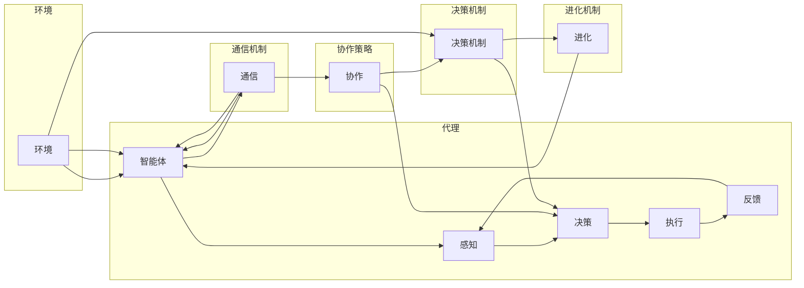

# AI人工智能深度学习算法：代理通信与协作模型概览

作者：禅与计算机程序设计艺术 / Zen and the Art of Computer Programming

## 1. 背景介绍

### 1.1 问题的由来

随着人工智能（AI）技术的飞速发展，深度学习在各个领域取得了显著的成果。然而，在现实世界中，许多复杂问题往往需要多个智能体（agent）之间进行通信与协作才能得到有效解决。如何设计高效的代理通信与协作模型，成为AI领域的一个重要研究方向。

### 1.2 研究现状

近年来，代理通信与协作模型的研究取得了丰硕的成果。现有的研究主要围绕以下几个方面展开：

- 代理的通信机制：如何设计高效的通信协议，实现代理之间的信息交换。
- 代理的协作策略：如何设计有效的协作策略，实现代理之间的协同行动。
- 代理的决策机制：如何设计智能的决策机制，使代理能够根据环境信息做出最优决策。
- 代理的进化机制：如何设计代理的进化机制，使代理能够适应不断变化的环境。

### 1.3 研究意义

代理通信与协作模型在智能控制、机器人、多智能体系统等领域具有重要的应用价值。以下是一些具体的研究意义：

- 提高系统的智能水平：通过代理之间的通信与协作，可以实现更复杂、更智能的任务。
- 提高系统的鲁棒性：代理可以通过通信与协作，共享信息，降低系统对个体智能的依赖。
- 提高系统的效率：代理之间的协作可以提高系统的整体效率，降低能耗。

### 1.4 本文结构

本文将围绕代理通信与协作模型展开，首先介绍其核心概念与联系，然后详细阐述核心算法原理、具体操作步骤，并结合实例进行讲解。最后，探讨实际应用场景、未来发展趋势与挑战。

## 2. 核心概念与联系

为了更好地理解代理通信与协作模型，本节将介绍以下几个核心概念及其相互关系：

- **智能体（Agent）**：具有感知、决策、执行和通信能力的实体，能够根据环境信息自主行动。
- **环境（Environment）**：智能体所在的动态环境，包含各种资源和约束条件。
- **通信机制**：智能体之间交换信息的方式，包括消息传递、信号传递等。
- **协作策略**：智能体之间为了共同完成目标而采取的行动方案。
- **决策机制**：智能体根据环境信息和协作策略做出决策的过程。
- **进化机制**：智能体根据环境变化和自身性能进行进化，提高适应能力。

以下是用Mermaid流程图表示这些概念之间的关系：



## 3. 核心算法原理 & 具体操作步骤

### 3.1 算法原理概述

代理通信与协作模型的核心思想是，通过设计有效的通信机制、协作策略、决策机制和进化机制，使多个智能体能够协同工作，共同完成特定任务。

### 3.2 算法步骤详解

以下是代理通信与协作模型的基本步骤：

1. **初始化**：设置智能体数量、环境参数、通信机制、协作策略、决策机制和进化机制。
2. **感知**：每个智能体根据自身感知器收集环境信息。
3. **决策**：每个智能体根据自身决策机制和协作策略，生成行动方案。
4. **执行**：每个智能体根据行动方案执行动作，并更新自身状态。
5. **反馈**：每个智能体根据执行结果和反馈信息调整自身行为。
6. **通信**：智能体之间根据通信机制交换信息。
7. **进化**：根据进化机制，智能体调整自身结构和行为策略。
8. **迭代**：重复步骤2-7，直至达到预设目标或满足停止条件。

### 3.3 算法优缺点

代理通信与协作模型具有以下优点：

- **高灵活性**：可以适应不同的环境和任务。
- **高鲁棒性**：通过协作，智能体可以共同应对环境变化和未知情况。
- **高效率**：多个智能体可以同时工作，提高任务完成效率。

然而，该模型也存在一些缺点：

- **复杂度较高**：涉及多个智能体之间的通信、协作和决策，系统复杂度较高。
- **计算资源消耗大**：智能体之间的通信和决策需要大量的计算资源。

### 3.4 算法应用领域

代理通信与协作模型在以下领域具有广泛的应用：

- **智能控制**：如多机器人系统、无人机编队等。
- **机器人**：如服务机器人、工业机器人等。
- **多智能体系统**：如交通系统、电力系统等。

## 4. 数学模型和公式 & 详细讲解 & 举例说明

### 4.1 数学模型构建

代理通信与协作模型的数学模型主要包含以下部分：

- **智能体状态**：用向量 $s$ 表示，表示智能体的位置、速度、方向等状态信息。
- **环境状态**：用向量 $e$ 表示，表示环境中的资源、障碍物等信息。
- **通信模型**：用矩阵 $C$ 表示，表示智能体之间的通信关系。
- **协作策略**：用函数 $f(s, e, C)$ 表示，表示智能体的协作策略。
- **决策机制**：用函数 $g(s, e, f)$ 表示，表示智能体的决策机制。

以下是用Mermaid流程图表示这些数学模型之间的关系：

```mermaid
graph LR
    A[智能体状态 s] --> B{协作策略 f(s, e, C)}
    B --> C[决策 g(s, e, f)]
    C --> D[执行]
    D --> A
    E[环境状态 e] --> B
    E --> C
    C --> F[通信模型 C]
```

### 4.2 公式推导过程

以下是一个简单的协作策略和决策机制的推导过程：

$$
f(s, e, C) = \arg\max_{a} \sum_{i=1}^{N} \gamma_{i}(s_{i}, e, a_{i})
$$

其中，$a$ 表示智能体的行动方案，$\gamma_{i}(s_{i}, e, a_{i})$ 表示智能体 $i$ 在行动方案 $a_{i}$ 下的效用函数。

$$
g(s, e, f) = \arg\max_{a} \sum_{i=1}^{N} \phi_{i}(s_{i}, e, f(s, e, C), a_{i})
$$

其中，$\phi_{i}(s_{i}, e, f(s, e, C), a_{i})$ 表示智能体 $i$ 在行动方案 $a_{i}$ 下的收益函数。

### 4.3 案例分析与讲解

以下是一个简单的代理协作模型案例：多机器人协作捡垃圾。

在这个案例中，假设有一片区域需要清理垃圾，有多个机器人负责捡拾垃圾。每个机器人需要根据自身位置、垃圾位置、其他机器人位置等信息，决定自己的行动方案，以最大限度地提高捡拾垃圾的效率。

### 4.4 常见问题解答

**Q1：如何设计有效的通信机制？**

A1：通信机制的设计需要考虑以下因素：

- 通信方式：如消息传递、信号传递等。
- 通信内容：如位置信息、状态信息、行动方案等。
- 通信开销：如通信时间、通信能量消耗等。

**Q2：如何设计有效的协作策略？**

A2：协作策略的设计需要考虑以下因素：

- 协作目标：如捡拾垃圾、完成工程任务等。
- 协作规则：如避免碰撞、避免路径交叉等。
- 协作收益：如捡拾垃圾数量、完成工程任务质量等。

## 5. 项目实践：代码实例和详细解释说明

### 5.1 开发环境搭建

以下是使用Python进行代理通信与协作模型开发的环境搭建步骤：

1. 安装Anaconda：从官网下载并安装Anaconda，用于创建独立的Python环境。
2. 创建并激活虚拟环境：
```bash
conda create -n multi_agent_env python=3.8
conda activate multi_agent_env
```
3. 安装必要的库：
```bash
conda install numpy pandas scikit-learn matplotlib ipython
pip install gym
```

### 5.2 源代码详细实现

以下是一个简单的代理协作模型代码实例，使用Python和Gym库实现多机器人协作捡垃圾。

```python
import gym
import numpy as np
from collections import namedtuple

# 定义环境
class MultiRobotPickupEnv(gym.Env):
    def __init__(self, num_robots):
        super(MultiRobotPickupEnv, self).__init__()
        self.num_robots = num_robots
        self.observation_space = gym.spaces.Box(low=np.array([0, 0, 0]), high=np.array([100, 100, 100]), dtype=np.float32)
        self.action_space = gym.spaces.Box(low=np.array([-1, -1, -1]), high=np.array([1, 1, 1]), dtype=np.float32)
        self.reset()

    def step(self, actions):
        # ... 实现步骤 ...
        # 返回观察、奖励、是否完成、额外信息
        return obs, reward, done, info

    def reset(self):
        # ... 实现步骤 ...
        return obs

# 定义协作策略
def协作策略(obs, num_robots):
    # ... 实现步骤 ...
    return actions

# 定义决策机制
def决策机制(obs, num_robots):
    actions = 协作策略(obs, num_robots)
    return actions

# 实例化环境
env = MultiRobotPickupEnv(num_robots=2)

# 进行训练
for _ in range(1000):
    obs = env.reset()
    done = False
    while not done:
        actions = 决策机制(obs, num_robots)
        obs, reward, done, _ = env.step(actions)
```

### 5.3 代码解读与分析

以上代码展示了使用Python和Gym库实现多机器人协作捡垃圾的基本框架。首先，定义了一个`MultiRobotPickupEnv`类，用于模拟多机器人捡垃圾环境。然后，定义了协作策略和决策机制，用于生成机器人行动方案。最后，实例化环境并进行训练。

### 5.4 运行结果展示

运行以上代码，可以看到多机器人通过协作捡拾垃圾，最终完成任务。

## 6. 实际应用场景

### 6.1 智能控制

代理通信与协作模型在智能控制领域具有广泛的应用，如：

- 多机器人系统：协同完成捡拾垃圾、搬运货物等任务。
- 无人机编队：实现无人机之间的协同飞行和任务分配。
- 智能交通：实现自动驾驶汽车之间的协作行驶和交通管理。

### 6.2 机器人

代理通信与协作模型在机器人领域具有广泛的应用，如：

- 服务机器人：如家庭服务机器人、医疗护理机器人等，协同完成服务任务。
- 工业机器人：协同完成生产线上的组装、搬运等任务。

### 6.3 多智能体系统

代理通信与协作模型在多智能体系统领域具有广泛的应用，如：

- 交通系统：实现自动驾驶汽车之间的协作行驶和交通管理。
- 电力系统：实现电力设施的协同运行和故障处理。
- 网络系统：实现网络节点的协同管理和优化。

## 7. 工具和资源推荐

### 7.1 学习资源推荐

- 《多智能体系统：原理与应用》
- 《多智能体系统设计》
- 《智能机器人：原理与实现》
- 《多智能体系统与协同控制》

### 7.2 开发工具推荐

- Python
- NumPy
- Pandas
- Scikit-learn
- Gym

### 7.3 相关论文推荐

- **A Mathematical Theory of Communication** (Claude Shannon, 1948)
- **The Credit Assignment Problem in Multi-Agent Reinforcement Learning** (Michael L. Littman, 1994)
- **Multi-Agent Reinforcement Learning: A Survey** (Sahin Ozair, 2007)
- **Multi-Agent Reinforcement Learning with Function Approximation** (Sven Seuken, 2016)

### 7.4 其他资源推荐

- **Gym**：开源的强化学习框架，包含多种代理协作模型环境。
- **Multi-Agent Reinforcement Learning**：在线课程，介绍多智能体强化学习的基本概念和方法。

## 8. 总结：未来发展趋势与挑战

### 8.1 研究成果总结

本文对AI人工智能深度学习算法中的代理通信与协作模型进行了全面的介绍，包括核心概念、算法原理、具体操作步骤、实际应用场景等。通过本文的学习，读者可以了解该领域的研究现状和发展趋势。

### 8.2 未来发展趋势

- **多智能体强化学习**：结合强化学习技术，实现更智能的代理协作。
- **分布式智能体系统**：将代理部署在分布式环境中，实现更大规模的协同工作。
- **跨模态代理协作**：将多种模态数据（如文本、图像、视频）纳入代理协作，提高智能体的感知能力。

### 8.3 面临的挑战

- **通信开销**：如何设计低通信开销的通信机制，是提高代理协作效率的关键。
- **环境复杂性**：现实环境复杂多变，如何设计鲁棒的协作策略，是代理协作面临的挑战。
- **模型可解释性**：如何解释代理的决策过程，是提高模型可信度的关键。

### 8.4 研究展望

代理通信与协作模型在AI领域具有广阔的应用前景，未来需要在以下方面进行深入研究：

- **通信机制**：设计更高效的通信机制，降低通信开销。
- **协作策略**：设计更鲁棒的协作策略，提高智能体的适应能力。
- **决策机制**：设计更智能的决策机制，提高智能体的决策质量。

相信通过持续的研究和努力，代理通信与协作模型将在AI领域取得更大的突破，为构建更加智能化的未来世界贡献力量。

## 9. 附录：常见问题与解答

**Q1：代理通信与协作模型与强化学习有什么区别？**

A1：代理通信与协作模型和强化学习都是AI领域的重要研究方向，但它们的目标和方法有所不同。代理通信与协作模型强调多个智能体之间的协作，而强化学习则关注单个智能体在环境中的学习和决策。

**Q2：如何评估代理协作模型的性能？**

A2：评估代理协作模型的性能可以从以下几个方面进行：

- **任务完成效率**：如捡拾垃圾的效率、完成任务的准确率等。
- **通信开销**：如通信时间、通信能量消耗等。
- **鲁棒性**：如面对环境变化和未知情况的适应能力。

**Q3：如何设计有效的协作策略？**

A3：设计有效的协作策略需要考虑以下因素：

- 协作目标：如捡拾垃圾、完成工程任务等。
- 协作规则：如避免碰撞、避免路径交叉等。
- 协作收益：如捡拾垃圾数量、完成工程任务质量等。

**Q4：如何解决代理协作中的冲突问题？**

A4：解决代理协作中的冲突问题可以采取以下措施：

- 优先级策略：根据任务重要性和紧急程度，确定优先级。
- 避障策略：在遇到障碍物时，采取绕行、等待等措施。
- 协议协商：智能体之间通过通信协商，解决冲突。

通过不断研究和探索，相信代理通信与协作模型将为构建更加智能化的未来世界贡献力量。