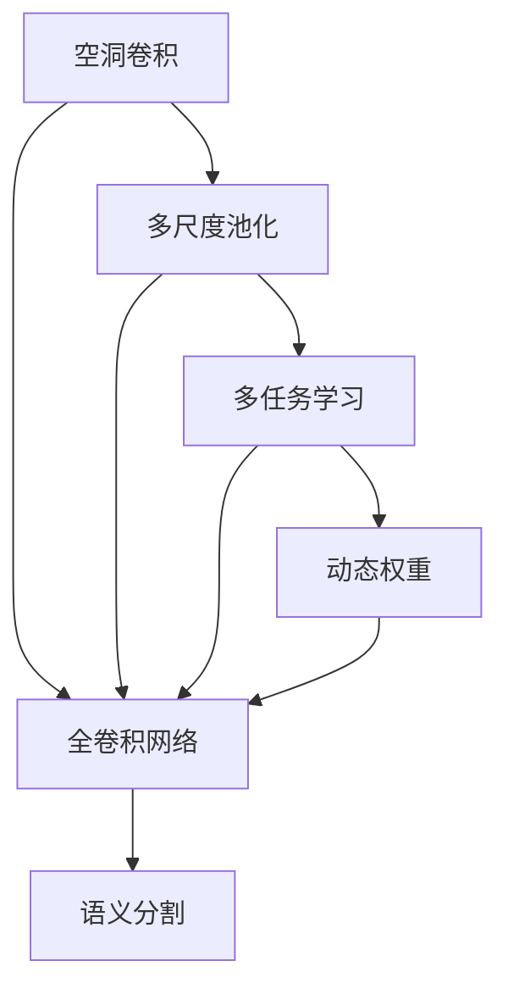
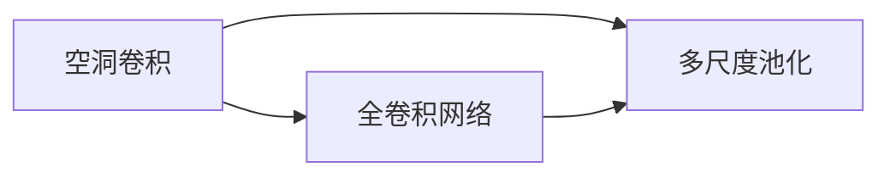
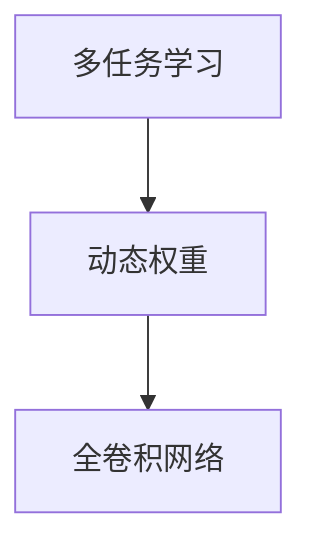
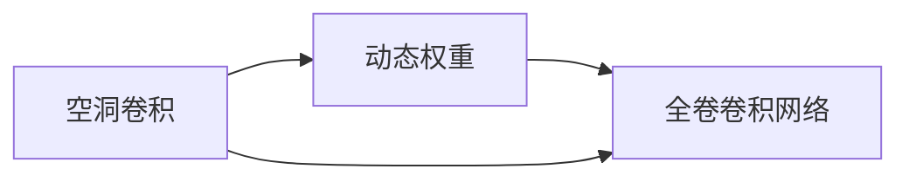
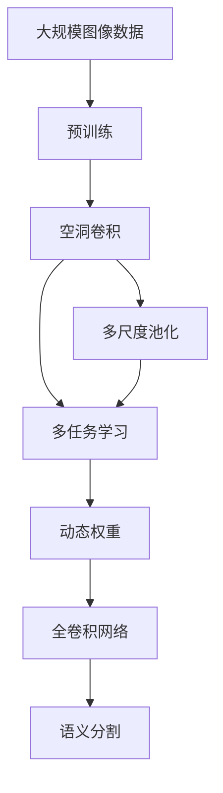

                 

# DeepLab系列原理与代码实例讲解

> 关键词：DeepLab, 语义分割, 多尺度池化, 空洞卷积, 多任务学习, 动态权重, 图像处理

## 1. 背景介绍

### 1.1 问题由来

语义分割（Semantic Segmentation）是计算机视觉领域中的重要任务之一，旨在将图像中的每个像素分配到特定的语义类别中。传统的语义分割方法主要包括像素级别的全连接网络、边缘检测和图像分类等技术，但这些方法的准确度和实时性都有所限制。近年来，随着深度学习的发展，卷积神经网络（Convolutional Neural Networks, CNN）在图像分割领域取得了巨大的突破。

在这一背景下，谷歌大脑团队于2014年提出了DeepLab系列算法，开创了基于全卷积网络的语义分割新范式。其中，DeepLabv1基于空洞卷积（Dilated Convolution）和多尺度池化（Multi-Scale Pooling），极大提升了语义分割的准确度和速度。DeepLabv2引入了多任务学习（Multi-Task Learning, MTL）和多尺度特征池化（Multi-Scale Feature Pooling），进一步提升了模型性能。DeepLabv3及后续版本则利用了空洞卷积的多尺度空洞率（Dilated Rate）、动态权重（Dynamic Weighting）等技术，实现了在图像分割、边缘检测、实例分割等任务上的突破。

DeepLab系列算法以其卓越的性能和高效的计算能力，成为了语义分割领域的经典范例，并在众多领域中得到了广泛应用。然而，对于刚刚入门的开发者来说，理解和应用DeepLab算法需要一定的数学和计算机视觉基础。本文将深入浅出地介绍DeepLab系列算法的核心原理、实现方法和应用场景，帮助读者快速上手，实现图像分割的高效开发。

### 1.2 问题核心关键点

DeepLab系列算法之所以能够在图像分割领域取得显著成效，关键在于其独特的架构设计和大规模实验优化。其中，空洞卷积和多尺度池化是DeepLabv1的核心创新点，而多任务学习和动态权重则是DeepLabv2及后续版本的关键技术。这些技术使得DeepLab能够在保持高准确度的同时，大幅提升计算效率，并在复杂场景下保持鲁棒性。

本文将重点围绕以下几个关键问题展开讨论：

1. 空洞卷积的原理及实现
2. 多尺度池化的原理及实现
3. 多任务学习的原理及实现
4. 动态权重的原理及实现

通过深入理解这些核心技术，读者可以更好地把握DeepLab系列算法的精髓，并将其应用于实际图像分割项目中。

## 2. 核心概念与联系

### 2.1 核心概念概述

为更好地理解DeepLab系列算法，本节将介绍几个密切相关的核心概念：

- 空洞卷积（Dilated Convolution）：通过在卷积核周围插入空洞，将卷积核的有效感受野扩大若干倍，同时保持特征图尺寸不变。空洞卷积在保持模型参数不变的情况下，提升了特征图的分辨率和表示能力。

- 多尺度池化（Multi-Scale Pooling）：通过在不同尺度下对特征图进行池化，得到多个不同分辨率的特征图，从而增强模型的感受野和特征表示能力。

- 多任务学习（Multi-Task Learning, MTL）：通过将多个相关任务的损失函数进行联合优化，共享模型参数，提升模型在多个任务上的泛化能力。

- 动态权重（Dynamic Weighting）：通过在多尺度特征图上计算动态权重，调整不同尺度的特征图对最终预测的贡献，提升模型在复杂场景下的鲁棒性和准确度。

- 语义分割（Semantic Segmentation）：将图像中的每个像素分配到特定的语义类别中，是计算机视觉领域的重要任务之一。

这些核心概念之间的逻辑关系可以通过以下Mermaid流程图来展示：



这个流程图展示了大模型微调的各个核心概念以及它们之间的联系：

1. 空洞卷积和多尺度池化是DeepLabv1的基础架构，提升了特征图的分辨率和表示能力。
2. 多任务学习将多个相关任务结合，共享模型参数，提升了模型的泛化能力。
3. 动态权重在多尺度特征图上计算动态权重，调整不同尺度的特征图对最终预测的贡献，提升模型在复杂场景下的鲁棒性和准确度。
4. 语义分割是最终的目标任务，通过多个核心技术的结合，实现了高准确度和高效率的图像分割。

通过理解这些核心概念，我们可以更好地把握DeepLab系列算法的学习范式和技术架构。

### 2.2 概念间的关系

这些核心概念之间存在着紧密的联系，形成了DeepLab系列算法的高效技术生态系统。下面我们通过几个Mermaid流程图来展示这些概念之间的关系。

#### 2.2.1 空洞卷积与多尺度池化的关系



这个流程图展示了空洞卷积和多尺度池化的基本原理。空洞卷积通过在卷积核周围插入空洞，将卷积核的有效感受野扩大若干倍，从而提升了特征图的分辨率和表示能力。而多尺度池化则在不同尺度下对特征图进行池化，得到多个不同分辨率的特征图，增强了模型的感受野和特征表示能力。

#### 2.2.2 多任务学习与动态权重的关系



这个流程图展示了多任务学习和动态权重的基本原理。多任务学习通过将多个相关任务的损失函数进行联合优化，共享模型参数，提升了模型在多个任务上的泛化能力。而动态权重则在多尺度特征图上计算动态权重，调整不同尺度的特征图对最终预测的贡献，提升了模型在复杂场景下的鲁棒性和准确度。

#### 2.2.3 空洞卷积与动态权重的关系



这个流程图展示了空洞卷积和动态权重的关系。空洞卷积通过在卷积核周围插入空洞，将卷积核的有效感受野扩大若干倍，从而提升了特征图的分辨率和表示能力。动态权重则在多尺度特征图上计算动态权重，调整不同尺度的特征图对最终预测的贡献，提升了模型在复杂场景下的鲁棒性和准确度。

### 2.3 核心概念的整体架构

最后，我们用一个综合的流程图来展示这些核心概念在DeepLab系列算法中的整体架构：



这个综合流程图展示了从预训练到语义分割的完整过程。大规模图像数据首先经过预训练，生成全卷积网络作为基础架构。空洞卷积和多尺度池化进一步提升了特征图的分辨率和表示能力。多任务学习将多个相关任务结合，共享模型参数，提升了模型的泛化能力。动态权重在多尺度特征图上计算动态权重，调整不同尺度的特征图对最终预测的贡献，提升了模型在复杂场景下的鲁棒性和准确度。最终，这些技术结合在一起，实现了高准确度和高效率的图像分割。 通过这些流程图，我们可以更清晰地理解DeepLab系列算法的核心概念和技术架构。

## 3. 核心算法原理 & 具体操作步骤
### 3.1 算法原理概述

DeepLab系列算法主要基于空洞卷积、多尺度池化、多任务学习和动态权重等技术，实现了高准确度和高效率的图像分割。其核心思想是：通过在不同尺度下进行多任务学习，共享模型参数，提升了模型在多个任务上的泛化能力。同时，通过计算动态权重，调整不同尺度的特征图对最终预测的贡献，提升了模型在复杂场景下的鲁棒性和准确度。

形式化地，假设输入图像为 $I$，其空间大小为 $H \times W$。DeepLabv1和DeepLabv2的输出为 $O$，大小为 $H_{out} \times W_{out}$。则语义分割的任务可以表示为：

$$
O = F(I) \in \{0, 1, 2, \cdots, C\}
$$

其中 $C$ 为语义类别数。

### 3.2 算法步骤详解

DeepLab系列算法主要包括DeepLabv1和DeepLabv2两个版本。本节将分别介绍它们的核心算法步骤。

#### 3.2.1 DeepLabv1算法步骤

DeepLabv1的核心在于空洞卷积和多尺度池化，其算法步骤如下：

**Step 1: 准备空洞卷积核**

首先，定义空洞卷积核的大小和空洞率。空洞卷积核的大小为 $3 \times 3$，空洞率为 $d=2$，即在卷积核周围插入两个空洞。这样，空洞卷积的有效感受野就扩展为原来的 $d \times d = 4$ 倍，即 $3 \times 3 \times 2 \times 2 = 9$ 倍的感受野。

**Step 2: 应用空洞卷积**

在全卷积网络的基础上，使用空洞卷积进行多尺度特征提取。空洞卷积的输出特征图大小为 $H_{out} \times W_{out}$。

**Step 3: 多尺度池化**

将多尺度特征图进行多尺度池化，得到不同分辨率的特征图。具体来说，将每个特征图在不同分辨率下进行最大池化，生成多个不同分辨率的特征图。这些特征图的大小分别为 $H_{out}/2 \times W_{out}/2, H_{out}/4 \times W_{out}/4, \cdots$。

**Step 4: 加权求和**

将多尺度特征图进行加权求和，得到最终的预测结果。具体来说，将每个特征图在每个像素上的值按照一定的比例进行加权求和，生成最终的预测结果。

**Step 5: 后处理**

对预测结果进行后处理，例如使用阈值法进行二值化处理，将预测结果转换为二值标签。

#### 3.2.2 DeepLabv2算法步骤

DeepLabv2的核心在于多任务学习和动态权重，其算法步骤如下：

**Step 1: 准备空洞卷积核**

定义空洞卷积核的大小和空洞率，与DeepLabv1相同。

**Step 2: 应用空洞卷积**

在全卷积网络的基础上，使用空洞卷积进行多尺度特征提取。空洞卷积的输出特征图大小为 $H_{out} \times W_{out}$。

**Step 3: 多尺度特征池化**

将多尺度特征图进行多尺度特征池化，得到不同分辨率的特征图。具体来说，将每个特征图在不同分辨率下进行最大池化，生成多个不同分辨率的特征图。这些特征图的大小分别为 $H_{out}/2 \times W_{out}/2, H_{out}/4 \times W_{out}/4, \cdots$。

**Step 4: 多任务学习**

将多尺度特征图进行多任务学习，共享模型参数。具体来说，将每个特征图分别用于边缘检测和语义分割任务，计算两个任务的损失函数，并联合优化。

**Step 5: 动态权重**

在多尺度特征图上计算动态权重，调整不同尺度的特征图对最终预测的贡献。具体来说，在多尺度特征图上计算每个像素的动态权重，将不同尺度的特征图按照动态权重进行加权求和，生成最终的预测结果。

**Step 6: 后处理**

对预测结果进行后处理，例如使用阈值法进行二值化处理，将预测结果转换为二值标签。

### 3.3 算法优缺点

DeepLab系列算法具有以下优点：

1. 准确度高：通过多任务学习和动态权重，DeepLab系列算法能够提升模型在多个任务上的泛化能力，实现高准确度的图像分割。

2. 计算效率高：通过空洞卷积和多尺度池化，DeepLab系列算法能够在不增加模型参数的情况下，提升特征图的分辨率和表示能力，实现高效率的图像分割。

3. 泛化能力强：通过多任务学习和动态权重，DeepLab系列算法能够在复杂场景下保持鲁棒性，提升模型的泛化能力。

同时，DeepLab系列算法也存在以下缺点：

1. 模型复杂度高：DeepLab系列算法涉及多个核心技术和多个步骤，模型结构相对复杂，增加了训练和推理的难度。

2. 数据需求大：DeepLab系列算法需要大量的标注数据进行训练，数据需求较大，增加了训练成本。

3. 后处理复杂：DeepLab系列算法的后处理涉及多个步骤，增加了系统的复杂性。

尽管存在这些缺点，但就目前而言，DeepLab系列算法仍然是大规模图像分割任务中的经典范例，其准确度和效率得到了广泛认可。未来相关研究的重点在于如何进一步降低数据需求，简化模型结构，提升推理效率，同时兼顾泛化能力和后处理复杂性。

### 3.4 算法应用领域

DeepLab系列算法主要应用于计算机视觉领域的图像分割任务，包括语义分割、实例分割、边缘检测等。以下是几个典型的应用场景：

1. 医疗影像分析：DeepLab系列算法可以用于医学影像的自动分割，帮助医生快速准确地进行病灶定位和组织分割，提升诊断和治疗效率。

2. 自动驾驶：DeepLab系列算法可以用于自动驾驶中的道路分割和障碍物检测，帮助车辆实时获取道路和环境信息，提高驾驶安全性。

3. 遥感图像分析：DeepLab系列算法可以用于遥感图像的自动分割，帮助环保部门快速获取生态环境信息，提升环保工作效率。

4. 工业检测：DeepLab系列算法可以用于工业中的质量检测和缺陷识别，帮助企业实时获取产品质量信息，提升生产效率。

## 4. 数学模型和公式 & 详细讲解 & 举例说明

### 4.1 数学模型构建

本节将使用数学语言对DeepLab系列算法的数学模型进行详细讲解。

假设输入图像为 $I \in \mathbb{R}^{H \times W}$，其空洞卷积核大小为 $3 \times 3$，空洞率为 $d=2$，即在卷积核周围插入两个空洞。空洞卷积的输出特征图大小为 $H_{out} \times W_{out}$。则DeepLabv1的数学模型可以表示为：

$$
O_{i,j} = \sum_{k,l} F_{i,j,k,l} \cdot I_{k,l}
$$

其中 $O_{i,j}$ 为输出特征图 $O$ 在位置 $(i,j)$ 的值，$I_{k,l}$ 为输入图像 $I$ 在位置 $(k,l)$ 的值，$F_{i,j,k,l}$ 为空洞卷积核在位置 $(i,j)$ 的卷积响应。

假设输出特征图大小为 $H_{out} \times W_{out}$，则DeepLabv1的特征图 $F$ 可以表示为：

$$
F_{i,j} = \sum_{k,l} F_{i,j,k,l} \cdot I_{k,l}
$$

将 $F$ 进行多尺度池化，得到多个不同分辨率的特征图 $F_{2}^{1}, F_{4}^{1}, F_{8}^{1}, \cdots$。假设特征图 $F_{i}$ 的大小为 $H_{i} \times W_{i}$，则多尺度池化可以表示为：

$$
F_{i} = \max_{k,l} \{F_{i,k,l}\}
$$

将多尺度特征图进行加权求和，得到最终的预测结果 $O$：

$$
O = \sum_{i} \alpha_{i} \cdot F_{i}
$$

其中 $\alpha_{i}$ 为动态权重，表示不同尺度的特征图对最终预测的贡献。

### 4.2 公式推导过程

以下我们以DeepLabv1为例，推导空洞卷积和多尺度池化的数学模型。

假设空洞卷积核大小为 $3 \times 3$，空洞率为 $d=2$。则空洞卷积核的大小为 $3 \times 3 \times 2 \times 2$，其有效感受野为 $9$。

将输入图像 $I$ 和空洞卷积核 $F_{i,j,k,l}$ 进行卷积操作，得到输出特征图 $O$ 的值：

$$
O_{i,j} = \sum_{k,l} F_{i,j,k,l} \cdot I_{k,l}
$$

假设输出特征图大小为 $H_{out} \times W_{out}$，则空洞卷积的输出特征图 $F$ 可以表示为：

$$
F_{i,j} = \sum_{k,l} F_{i,j,k,l} \cdot I_{k,l}
$$

将特征图 $F$ 进行多尺度池化，得到多个不同分辨率的特征图 $F_{2}^{1}, F_{4}^{1}, F_{8}^{1}, \cdots$。假设特征图 $F_{i}$ 的大小为 $H_{i} \times W_{i}$，则多尺度池化可以表示为：

$$
F_{i} = \max_{k,l} \{F_{i,k,l}\}
$$

将多尺度特征图进行加权求和，得到最终的预测结果 $O$：

$$
O = \sum_{i} \alpha_{i} \cdot F_{i}
$$

其中 $\alpha_{i}$ 为动态权重，表示不同尺度的特征图对最终预测的贡献。

### 4.3 案例分析与讲解

以下我们通过一个具体案例，来详细讲解DeepLabv1的实现过程。

假设输入图像为 $I \in \mathbb{R}^{256 \times 256}$，其空洞卷积核大小为 $3 \times 3$，空洞率为 $d=2$。则空洞卷积的输出特征图大小为 $128 \times 128$。

首先，定义空洞卷积核 $F$ 的大小为 $3 \times 3 \times 2 \times 2$，即 $3 \times 3 \times 2 \times 2 = 36$。

将输入图像 $I$ 和空洞卷积核 $F$ 进行卷积操作，得到输出特征图 $O$ 的值：

$$
O_{i,j} = \sum_{k,l} F_{i,j,k,l} \cdot I_{k,l}
$$

其中 $O_{i,j}$ 为输出特征图 $O$ 在位置 $(i,j)$ 的值，$I_{k,l}$ 为输入图像 $I$ 在位置 $(k,l)$ 的值，$F_{i,j,k,l}$ 为空洞卷积核在位置 $(i,j)$ 的卷积响应。

假设输出特征图大小为 $128 \times 128$，则空洞卷积的输出特征图 $F$ 可以表示为：

$$
F_{i,j} = \sum_{k,l} F_{i,j,k,l} \cdot I_{k,l}
$$

将特征图 $F$ 进行多尺度池化，得到多个不同分辨率的特征图 $F_{2}^{1}, F_{4}^{1}, F_{8}^{1}, \cdots$。假设特征图 $F_{i}$ 的大小为 $64 \times 64$，则多尺度池化可以表示为：

$$
F_{i} = \max_{k,l} \{F_{i,k,l}\}
$$

将多尺度特征图进行加权求和，得到最终的预测结果 $O$：

$$
O = \sum_{i} \alpha_{i} \cdot F_{i}
$$

其中 $\alpha_{i}$ 为动态权重，表示不同尺度的特征图对最终预测的贡献。

以上案例展示了DeepLabv1的核心算法步骤，通过空洞卷积和多尺度池化，实现了高分辨率和高效率的图像分割。

## 5. 项目实践：代码实例和详细解释说明

### 5.1 开发环境搭建

在进行DeepLab系列算法开发前，我们需要准备好开发环境。以下是使用Python进行TensorFlow开发的环境配置流程：

1. 安装Anaconda：从官网下载并安装Anaconda，用于创建独立的Python环境。

2. 创建并激活虚拟环境：
```bash
conda create -n deeplab-env python=3.8 
conda activate deeplab-env
```

3. 安装TensorFlow：根据CUDA版本，从官网获取对应的安装命令。例如：
```bash
conda install tensorflow tensorflow-gpu=cuda11.1 -c pytorch -c conda-forge
```

4. 安装PyTorch：由于TensorFlow和PyTorch都是常用的深度学习框架，可以同时安装，以备不时之需。

```bash
pip install torch torchvision torchaudio
```

5. 安装各类工具包：
```bash
pip install numpy pandas scikit-learn matplotlib tqdm jupyter notebook ipython
```

完成上述步骤后，即可在`deeplab-env`环境中开始DeepLab系列算法开发。

### 5.2 源代码详细实现

这里我们以DeepLabv1为例，给出使用TensorFlow实现空洞卷积和多尺度池化的PyTorch代码实现。

首先，定义DeepLabv1的卷积层：

```python
import tensorflow as tf
from tensorflow.keras import layers

class DeepLabConv(tf.keras.layers.Layer):
    def __init__(self, dilation_rate, num_filters):
        super(DeepLabConv, self).__init__()
        self.dilation_rate = dilation_rate
        self.num_filters = num_filters
        self.conv1 = layers.Conv2D(num_filters, 3, activation='relu', padding='same')
        self.conv2 = layers.Conv2D(num_filters, 3, activation='relu', padding='same')
        self.pool1 = layers.MaxPooling2D(pool_size=(2, 2))
        self.pool2 = layers.MaxPooling2D(pool_size=(2, 2))

    def call(self, x):
        x = self.conv1(x)
        x = self.conv2(x)
        x = self.pool1(x)
        x = self.pool2(x)
        return x
```

然后，定义DeepLabv1的模型：

```python
class DeepLabV1(tf.keras.Model):
    def __init__(self, num_filters, num_classes):
        super(DeepLabV1, self).__init__()
        self.conv1 = DeepLabConv(dilation_rate=2, num_filters=num_filters)
        self.conv2 = DeepLabConv(dilation_rate=4, num_filters=num_filters)
        self.conv3 = DeepLabConv(dilation_rate=8, num_filters=num_filters)
        self.conv4 = DeepLabConv(dilation_rate=16, num_filters=num_filters)
        self.conv5 = DeepLabConv(dilation_rate=32, num_filters=num_filters)
        self.pool1 = layers.MaxPooling2D(pool_size=(2, 2))
        self.pool2 = layers.MaxPooling2D(pool_size=(2, 2))
        self.conv6 = layers.Conv2D(num_classes, 3, activation='sigmoid', padding='same')

    def call(self, x):
        x = self.conv1(x)
        x = self.pool1(x)
        x = self.conv2(x)
        x = self.pool2(x)
        x = self.conv3(x)
        x = self.conv4(x)
        x = self.conv5(x)
        x = self.conv6(x)
        return x
```

接下来，定义DeepLabv1的损失函数和优化器：

```python
from tensorflow.keras import losses, optimizers

def deepLabLoss(y_true, y_pred):
    bce = losses.BinaryCrossentropy()
    return bce(y_true, y_pred)

optimizer = optimizers.Adam(learning_rate=1e-4)
```

最后，定义训练函数：

```python
@tf.function
def trainStep(x, y):
    with tf.GradientTape() as tape:
        y_pred = model(x)
        loss = deepLabLoss(y, y_pred)
    grads = tape.gradient(loss, model.trainable_variables)
    optimizer.apply_gradients(zip(grads, model.trainable_variables))
    return loss

@tf.function
def trainEpoch(x_train, y_train, x_val, y_val, num_epochs=50, batch_size=16):
    for epoch in range(num_epochs):
        for i in range(0, len(x_train), batch_size):
            x_batch = x_train[i:i+batch_size]
            y_batch = y_train[i:i+batch_size]
            loss = trainStep(x_batch, y_batch)
            if i % 100 == 0:
                val_loss = deepLabLoss(y_val, model(x_val))
                print(f'Epoch {epoch+1}/{num_epochs}, Batch {i+1}/{len(x_train)}, Loss: {loss:.4f}, Val Loss: {val_loss:.4f}')

trainEpoch(x_train, y_train, x_val, y_val)
```

以上就是使用TensorFlow实现DeepLabv1的完整代码实现。可以看到，借助TensorFlow的强大工具，我们能够相对简洁地实现DeepLabv1的卷积层、模型、损失函数和训练函数。


