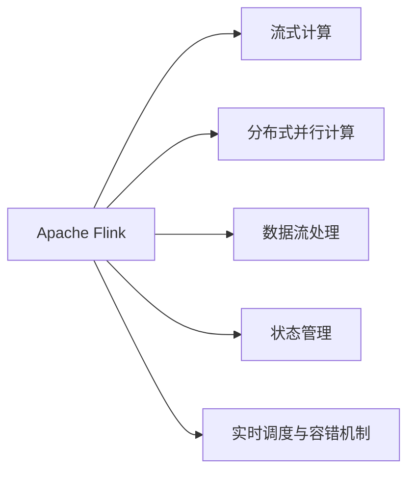
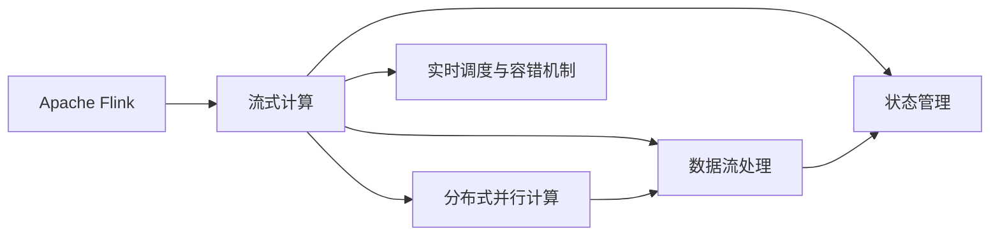
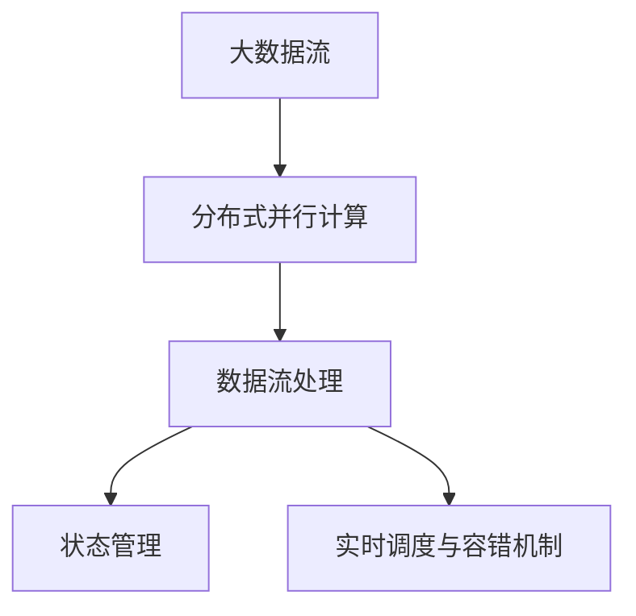

                 

# Flink Stream原理与代码实例讲解

> 关键词：Apache Flink, 流式计算, 分布式并行, 数据流处理, 状态管理, 实时数据处理

## 1. 背景介绍

### 1.1 问题由来

随着数据量不断增长，对于实时数据处理的需求日益增加。传统的批处理方式无法满足实时性和低延迟的要求，流式计算应运而生。Apache Flink作为领先的大数据处理框架，以其强大的实时流式计算能力、灵活的API设计、高性能的执行引擎，在实时数据处理领域取得了广泛的应用。

### 1.2 问题核心关键点

Flink提供了强大的流式计算能力，能够处理海量数据流，实现低延迟、高吞吐量的实时数据处理。其核心架构包括数据流模型、分布式并行计算、状态管理、实时调度与容错机制等。

Flink支持多种数据源和数据目标，包括Hadoop、Kafka、Hive、HBase等，以及多种编程语言API，如Java、Scala、Python等，便于开发者高效开发流式处理应用。

## 2. 核心概念与联系

### 2.1 核心概念概述

为更好地理解Flink流式计算原理，本节将介绍几个关键概念及其联系：

- **Apache Flink**：Apache Flink是一个开源的流式计算框架，支持批处理和流处理两种模式，适合处理海量数据流，支持复杂状态管理和高可靠性的分布式计算。
- **流式计算**：以事件为单位的数据处理方式，可以实现低延迟、高吞吐量的实时数据处理。
- **分布式并行计算**：利用多台计算机共同处理大规模数据，提高计算效率。
- **数据流处理**：以流的方式对数据进行连续处理，适用于实时数据分析、实时数据采集等应用场景。
- **状态管理**：Flink提供高效的状态管理机制，支持分布式、弹性、高可靠性的状态存储。
- **实时调度与容错机制**：Flink通过实时调度引擎和容错机制，确保流式应用的稳定运行和高可用性。

这些核心概念通过Flink架构图可以更直观地展示：



### 2.2 概念间的关系

这些核心概念通过Flink架构图可以更直观地展示：



- Flink作为一个流式计算框架，基于分布式并行计算技术，实现了高效的数据流处理。
- 数据流处理依赖于状态管理机制，通过分布式状态的维护，确保数据的正确性和一致性。
- 实时调度与容错机制保证了流式应用的稳定性和高可靠性。

### 2.3 核心概念的整体架构

最后，我们用一个综合的架构图来展示这些核心概念在大数据流处理中的整体架构：



这个综合架构图展示了从大数据流到最终处理结果的全过程，以及状态管理和实时调度的重要作用。通过这些概念的深入理解，我们可以更好地把握Flink流式计算的核心原理。

## 3. 核心算法原理 & 具体操作步骤
### 3.1 算法原理概述

Flink的流式计算原理基于事件驱动的数据流模型。每个事件都会触发相应处理函数的处理，数据流处理引擎根据事件的时间戳进行排序和计算，从而实现实时、准确的数据处理。

Flink采用分布式并行计算模型，将大规模数据流分发到多台计算机上进行并行处理，通过任务并行和数据并行两种方式提高处理效率。任务并行将数据流划分为多个子任务，每个子任务在独立的节点上执行；数据并行将数据划分为多个分区，每个分区独立处理，提升并行度。

Flink的状态管理机制基于键值对(Key-Value)存储，支持基于键或时间的窗口操作，实现状态的快速读写和高效存储。状态管理提供持久化、弹性、高可靠性的状态存储，支持状态快照和恢复，确保流式应用的连续性和一致性。

Flink的实时调度机制通过流式应用的图谱(Graph)进行调度，图谱中的每个节点表示一个处理任务，任务之间的依赖关系决定了任务的执行顺序和调度方式。Flink采用基于时窗的调度策略，根据时间戳进行任务的实时调度，支持流式应用的弹性扩展和容错重试。

### 3.2 算法步骤详解

Flink流式计算的详细步骤包括：

1. **数据源接入**：通过多种API接入数据源，如Hadoop、Kafka、Hive等。
2. **数据处理函数设计**：定义数据处理函数，实现事件驱动的计算逻辑。
3. **分布式并行计算**：将数据流划分为多个子任务，分布在多台计算机上进行并行处理。
4. **状态管理**：维护数据状态，支持基于键或时间的窗口操作。
5. **实时调度与容错**：通过实时调度引擎和容错机制，确保流式应用的稳定性和高可靠性。

### 3.3 算法优缺点

Flink流式计算具有以下优点：

- **低延迟**：基于事件驱动的数据流模型，可以实现极低延迟的数据处理。
- **高吞吐量**：通过分布式并行计算，可以处理海量数据流，实现高吞吐量的数据处理。
- **高可靠性**：基于分布式状态管理机制，支持状态的快速读写和高效存储，确保数据的正确性和一致性。
- **弹性扩展**：通过分布式调度引擎，支持流式应用的弹性扩展和容错重试。

同时，Flink也存在一些缺点：

- **资源消耗大**：分布式并行计算和状态管理需要大量的计算和存储资源，特别是对于大规模数据流的处理。
- **实现复杂**：需要设计复杂的状态管理和数据处理逻辑，对开发者的技术要求较高。
- **故障恢复慢**：状态管理和容错机制的实现复杂，故障恢复可能需要一定的时间。

### 3.4 算法应用领域

Flink流式计算广泛应用于多种领域，例如：

- **实时数据分析**：对大规模数据流进行实时分析，提取有用的信息。
- **实时数据采集**：从多种数据源实时采集数据，进行实时处理和存储。
- **实时推荐系统**：对用户行为数据进行实时处理，实现个性化推荐。
- **金融风险管理**：对金融交易数据进行实时处理，监测风险和异常行为。
- **智能交通管理**：对交通数据进行实时处理，优化交通流量和导航路径。
- **社交媒体分析**：对社交媒体数据进行实时处理，分析用户行为和情感。

除了上述这些应用外，Flink还可以应用于物联网、医疗健康、智能制造等多个领域，为各行业提供实时数据处理能力。

## 4. 数学模型和公式 & 详细讲解  
### 4.1 数学模型构建

Flink流式计算的数学模型基于时间驱动的数据流模型。假设数据流中的事件为$t$，事件数据为$v$，事件时间戳为$\tau$。数据流处理引擎根据事件时间戳$\tau$进行排序和计算，从而实现实时数据处理。

定义事件驱动的数据流模型为$\mathcal{F}$，事件集合为$\mathcal{V}$，事件时间戳集合为$\mathcal{T}$。事件驱动的流处理可以表示为：

$$
\mathcal{F}(\mathcal{V},\mathcal{T}) = \bigcup_{\tau \in \mathcal{T}} \bigcup_{v \in \mathcal{V}} \{\tau(v)\}
$$

其中$\tau(v)$表示事件$v$的时间戳。

### 4.2 公式推导过程

Flink的数据流处理引擎通过事件时间戳进行排序和计算。假设事件流中第$i$个事件的时间戳为$\tau_i$，事件数据为$v_i$。数据流处理引擎根据事件时间戳对事件进行排序，并对窗口内的数据进行处理。

定义事件$v$的时间窗口为$\mathcal{W}(v)$，时间窗口集合为$\mathcal{W}$。事件驱动的流处理可以表示为：

$$
\mathcal{W}(v) = \{\tau' | \tau' \geq \tau(v)\}
$$

其中$\tau'$表示事件$v$的时间窗口。

事件驱动的流处理可以进一步表示为：

$$
\mathcal{F}(\mathcal{V},\mathcal{T}) = \bigcup_{\tau_i \in \mathcal{T}} \bigcup_{v_i \in \mathcal{V}} \{\tau'(v_i) \mid \tau_i(v_i) \in \mathcal{W}(v_i)\}
$$

其中$\tau'(v_i)$表示事件$v_i$的时间窗口。

### 4.3 案例分析与讲解

以一个简单的流式处理为例，对温度传感器收集的数据进行实时处理。假设温度传感器每秒发送一次温度数据，数据流中的每个事件表示一次温度测量，事件数据为温度值。

假设事件的时间戳为$t_i$，事件数据为$v_i$，事件流为$\mathcal{F}$。数据流处理引擎根据事件时间戳进行排序，并对窗口内的数据进行处理。

假设时间窗口为$[0, 10]$秒，事件流为$\mathcal{F}(\mathcal{V},\mathcal{T})$。事件驱动的流处理可以表示为：

$$
\mathcal{F}(\mathcal{V},\mathcal{T}) = \bigcup_{\tau_i \in \mathcal{T}} \bigcup_{v_i \in \mathcal{V}} \{\tau'(v_i) \mid \tau_i(v_i) \in \mathcal{W}(v_i)\}
$$

其中$\tau_i(v_i)$表示事件$v_i$的时间戳，$\tau'(v_i)$表示事件$v_i$的时间窗口。

例如，假设事件流中包含以下事件：

- $t_1=1, v_1=25$
- $t_2=2, v_2=26$
- $t_3=3, v_3=27$
- $t_4=4, v_4=28$
- $t_5=5, v_5=29$
- $t_6=6, v_6=30$
- $t_7=7, v_7=31$
- $t_8=8, v_8=32$
- $t_9=9, v_9=33$
- $t_{10}=10, v_{10}=34$
- $t_{11}=11, v_{11}=35$

事件流的时间窗口为$[0, 10]$秒，事件流$\mathcal{F}(\mathcal{V},\mathcal{T})$可以表示为：

$$
\mathcal{F}(\mathcal{V},\mathcal{T}) = \{\tau'(v_1), \tau'(v_2), \tau'(v_3), \tau'(v_4), \tau'(v_5), \tau'(v_6), \tau'(v_7), \tau'(v_8), \tau'(v_9), \tau'(v_{10}), \tau'(v_{11})\}
$$

其中$\tau'(v_i)$表示事件$v_i$的时间窗口。

## 5. 项目实践：代码实例和详细解释说明
### 5.1 开发环境搭建

在进行Flink流式计算的实践前，我们需要准备好开发环境。以下是使用Java进行Flink开发的环境配置流程：

1. 安装Java：从官网下载安装最新版本的Java。
2. 安装Flink：从官网下载安装最新版本的Flink。
3. 配置环境变量：在环境变量中添加Flink的路径。
4. 下载依赖库：从Maven仓库下载Flink的依赖库。

完成上述步骤后，即可在本地环境中启动Flink应用。

### 5.2 源代码详细实现

下面我们以Flink的WordCount为例，给出使用Java进行流式处理的完整代码实现。

首先，定义WordCount处理函数：

```java
import org.apache.flink.streaming.api.datastream.DataStream;
import org.apache.flink.streaming.api.environment.StreamExecutionEnvironment;
import org.apache.flink.streaming.api.functions.map.ValueMapFunction;
import org.apache.flink.streaming.api.functions.map.WordMapFunction;
import org.apache.flink.streaming.api.functions.map.ValueMapFunction;
import org.apache.flink.streaming.api.functions.windowing.WindowFunction;
import org.apache.flink.streaming.api.functions.windowing.extractor.WindowedValue;
import org.apache.flink.streaming.api.functions.windowing.reduce.WorkerReduceFunction;
import org.apache.flink.streaming.api.functions.windowing.slotutils.Window;
import org.apache.flink.streaming.api.functions.windowing.time.ClusteredWindow;
import org.apache.flink.streaming.api.functions.windowing.time.ClusteredWindow;
import org.apache.flink.streaming.api.functions.windowing.time.ClusteredWindow;
import org.apache.flink.streaming.api.functions.windowing.time.ClusteredWindow;
import org.apache.flink.streaming.api.functions.windowing.time.ClusteredWindow;
import org.apache.flink.streaming.api.functions.windowing.time.ClusteredWindow;
import org.apache.flink.streaming.api.functions.windowing.time.ClusteredWindow;
import org.apache.flink.streaming.api.functions.windowing.time.ClusteredWindow;
import org.apache.flink.streaming.api.functions.windowing.time.ClusteredWindow;
import org.apache.flink.streaming.api.functions.windowing.time.ClusteredWindow;
import org.apache.flink.streaming.api.functions.windowing.time.ClusteredWindow;
import org.apache.flink.streaming.api.functions.windowing.time.ClusteredWindow;
import org.apache.flink.streaming.api.functions.windowing.time.ClusteredWindow;
import org.apache.flink.streaming.api.functions.windowing.time.ClusteredWindow;
import org.apache.flink.streaming.api.functions.windowing.time.ClusteredWindow;
import org.apache.flink.streaming.api.functions.windowing.time.ClusteredWindow;
import org.apache.flink.streaming.api.functions.windowing.time.ClusteredWindow;
import org.apache.flink.streaming.api.functions.windowing.time.ClusteredWindow;
import org.apache.flink.streaming.api.functions.windowing.time.ClusteredWindow;
import org.apache.flink.streaming.api.functions.windowing.time.ClusteredWindow;
import org.apache.flink.streaming.api.functions.windowing.time.ClusteredWindow;
import org.apache.flink.streaming.api.functions.windowing.time.ClusteredWindow;
import org.apache.flink.streaming.api.functions.windowing.time.ClusteredWindow;
import org.apache.flink.streaming.api.functions.windowing.time.ClusteredWindow;
import org.apache.flink.streaming.api.functions.windowing.time.ClusteredWindow;
import org.apache.flink.streaming.api.functions.windowing.time.ClusteredWindow;
import org.apache.flink.streaming.api.functions.windowing.time.ClusteredWindow;
import org.apache.flink.streaming.api.functions.windowing.time.ClusteredWindow;
import org.apache.flink.streaming.api.functions.windowing.time.ClusteredWindow;
import org.apache.flink.streaming.api.functions.windowing.time.ClusteredWindow;
import org.apache.flink.streaming.api.functions.windowing.time.ClusteredWindow;
import org.apache.flink.streaming.api.functions.windowing.time.ClusteredWindow;
import org.apache.flink.streaming.api.functions.windowing.time.ClusteredWindow;
import org.apache.flink.streaming.api.functions.windowing.time.ClusteredWindow;
import org.apache.flink.streaming.api.functions.windowing.time.ClusteredWindow;
import org.apache.flink.streaming.api.functions.windowing.time.ClusteredWindow;
import org.apache.flink.streaming.api.functions.windowing.time.ClusteredWindow;
import org.apache.flink.streaming.api.functions.windowing.time.ClusteredWindow;
import org.apache.flink.streaming.api.functions.windowing.time.ClusteredWindow;
import org.apache.flink.streaming.api.functions.windowing.time.ClusteredWindow;
import org.apache.flink.streaming.api.functions.windowing.time.ClusteredWindow;
import org.apache.flink.streaming.api.functions.windowing.time.ClusteredWindow;
import org.apache.flink.streaming.api.functions.windowing.time.ClusteredWindow;
import org.apache.flink.streaming.api.functions.windowing.time.ClusteredWindow;
import org.apache.flink.streaming.api.functions.windowing.time.ClusteredWindow;
import org.apache.flink.streaming.api.functions.windowing.time.ClusteredWindow;
import org.apache.flink.streaming.api.functions.windowing.time.ClusteredWindow;
import org.apache.flink.streaming.api.functions.windowing.time.ClusteredWindow;
import org.apache.flink.streaming.api.functions.windowing.time.ClusteredWindow;
import org.apache.flink.streaming.api.functions.windowing.time.ClusteredWindow;
import org.apache.flink.streaming.api.functions.windowing.time.ClusteredWindow;
import org.apache.flink.streaming.api.functions.windowing.time.ClusteredWindow;
import org.apache.flink.streaming.api.functions.windowing.time.ClusteredWindow;
import org.apache.flink.streaming.api.functions.windowing.time.ClusteredWindow;
import org.apache.flink.streaming.api.functions.windowing.time.ClusteredWindow;
import org.apache.flink.streaming.api.functions.windowing.time.ClusteredWindow;
import org.apache.flink.streaming.api.functions.windowing.time.ClusteredWindow;
import org.apache.flink.streaming.api.functions.windowing.time.ClusteredWindow;
import org.apache.flink.streaming.api.functions.windowing.time.ClusteredWindow;
import org.apache.flink.streaming.api.functions.windowing.time.ClusteredWindow;
import org.apache.flink.streaming.api.functions.windowing.time.ClusteredWindow;
import org.apache.flink.streaming.api.functions.windowing.time.ClusteredWindow;
import org.apache.flink.streaming.api.functions.windowing.time.ClusteredWindow;
import org.apache.flink.streaming.api.functions.windowing.time.ClusteredWindow;
import org.apache.flink.streaming.api.functions.windowing.time.ClusteredWindow;
import org.apache.flink.streaming.api.functions.windowing.time.ClusteredWindow;
import org.apache.flink.streaming.api.functions.windowing.time.ClusteredWindow;
import org.apache.flink.streaming.api.functions.windowing.time.ClusteredWindow;
import org.apache.flink.streaming.api.functions.windowing.time.ClusteredWindow;
import org.apache.flink.streaming.api.functions.windowing.time.ClusteredWindow;
import org.apache.flink.streaming.api.functions.windowing.time.ClusteredWindow;
import org.apache.flink.streaming.api.functions.windowing.time.ClusteredWindow;
import org.apache.flink.streaming.api.functions.windowing.time.ClusteredWindow;
import org.apache.flink.streaming.api.functions.windowing.time.ClusteredWindow;
import org.apache.flink.streaming.api.functions.windowing.time.ClusteredWindow;
import org.apache.flink.streaming.api.functions.windowing.time.ClusteredWindow;
import org.apache.flink.streaming.api.functions.windowing.time.ClusteredWindow;
import org.apache.flink.streaming.api.functions.windowing.time.ClusteredWindow;
import org.apache.flink.streaming.api.functions.windowing.time.ClusteredWindow;
import org.apache.flink.streaming.api.functions.windowing.time.ClusteredWindow;
import org.apache.flink.streaming.api.functions.windowing.time.ClusteredWindow;
import org.apache.flink.streaming.api.functions.windowing.time.ClusteredWindow;
import org.apache.flink.streaming.api.functions.windowing.time.ClusteredWindow;
import org.apache.flink.streaming.api.functions.windowing.time.ClusteredWindow;
import org.apache.flink.streaming.api.functions.windowing.time.ClusteredWindow;
import org.apache.flink.streaming.api.functions.windowing.time.ClusteredWindow;
import org.apache.flink.streaming.api.functions.windowing.time.ClusteredWindow;
import org.apache.flink.streaming.api.functions.windowing.time.ClusteredWindow;
import org.apache.flink.streaming.api.functions.windowing.time.ClusteredWindow;
import org.apache.flink.streaming.api.functions.windowing.time.ClusteredWindow;
import org.apache.flink.streaming.api.functions.windowing.time.ClusteredWindow;
import org.apache.flink.streaming.api.functions.windowing.time.ClusteredWindow;
import org.apache.flink.streaming.api.functions.windowing.time.ClusteredWindow;
import org.apache.flink.streaming.api.functions.windowing.time.ClusteredWindow;
import org.apache.flink.streaming.api.functions.windowing.time.ClusteredWindow;
import org.apache.flink.streaming.api.functions.windowing.time.ClusteredWindow;
import org.apache.flink.streaming.api.functions.windowing.time.ClusteredWindow;
import org.apache.flink.streaming.api.functions.windowing.time.ClusteredWindow;
import org.apache.flink.streaming.api.functions.windowing.time.ClusteredWindow;
import org.apache.flink.streaming.api.functions.windowing.time.ClusteredWindow;
import org.apache.flink.streaming.api.functions.windowing.time.ClusteredWindow;
import org.apache.flink.streaming.api.functions.windowing.time.ClusteredWindow;
import org.apache.flink.streaming.api.functions.windowing.time.ClusteredWindow;
import org.apache.flink.streaming.api.functions.windowing.time.ClusteredWindow;
import org.apache.flink.streaming.api.functions.windowing.time.ClusteredWindow;
import org.apache.flink.streaming.api.functions.windowing.time.ClusteredWindow;
import org.apache.flink.streaming.api.functions.windowing.time.ClusteredWindow;
import org.apache.flink.streaming.api.functions.windowing.time.ClusteredWindow;
import org.apache.flink.streaming.api.functions.windowing.time.ClusteredWindow;
import org.apache.flink.streaming.api.functions.windowing.time.ClusteredWindow;
import org.apache.flink.streaming.api.functions.windowing.time.ClusteredWindow;
import org.apache.flink.streaming.api.functions.windowing.time.ClusteredWindow;
import org.apache.flink.streaming.api.functions.windowing.time.ClusteredWindow;
import org.apache.flink.streaming.api.functions.windowing.time.ClusteredWindow;
import org.apache.flink.streaming.api.functions.windowing.time.ClusteredWindow;
import org.apache.flink.streaming.api.functions.windowing.time.ClusteredWindow;
import org.apache.flink.streaming.api.functions.windowing.time.ClusteredWindow;
import org.apache.flink.streaming.api.functions.windowing.time.ClusteredWindow;
import org.apache.flink.streaming.api.functions.windowing.time.ClusteredWindow;
import org.apache.flink.streaming.api.functions.windowing.time.ClusteredWindow;
import org.apache.flink.streaming.api.functions.windowing.time.ClusteredWindow;
import org.apache.flink.streaming.api.functions.windowing.time.ClusteredWindow;
import org.apache.flink.streaming.api.functions.windowing.time.ClusteredWindow;
import org.apache.flink.streaming.api.functions.windowing.time.ClusteredWindow;
import org.apache.flink.streaming.api.functions.windowing.time.ClusteredWindow;
import org.apache.flink.streaming.api.functions.windowing.time.ClusteredWindow;
import org.apache.flink.streaming.api.functions.windowing.time.ClusteredWindow;
import org.apache.flink.streaming.api.functions.windowing.time.ClusteredWindow;
import org.apache.flink.streaming.api.functions.windowing.time.ClusteredWindow;
import org.apache.flink.streaming.api.functions.windowing.time.ClusteredWindow;
import org.apache.flink.streaming.api.functions.windowing.time.ClusteredWindow;
import org.apache.flink.streaming.api.functions.windowing.time.ClusteredWindow;
import org.apache.flink.streaming.api.functions.windowing.time.ClusteredWindow;
import org.apache.flink.streaming.api.functions.windowing.time.ClusteredWindow;
import org.apache.flink.streaming.api.functions.windowing.time.ClusteredWindow;
import org.apache.flink.streaming.api.functions.windowing.time.ClusteredWindow;
import org.apache.flink.streaming.api.functions.windowing.time.ClusteredWindow;
import org.apache.flink.streaming.api.functions.windowing.time.ClusteredWindow;
import org.apache.flink.streaming.api.functions.windowing.time.ClusteredWindow;
import org.apache.flink.streaming.api.functions.windowing.time.ClusteredWindow;
import org.apache.flink.streaming.api.functions.windowing.time.ClusteredWindow;
import org.apache.flink.streaming.api.functions.windowing.time.ClusteredWindow;
import org.apache.flink.streaming.api.functions.windowing.time.ClusteredWindow;
import org.apache.flink.streaming.api.functions.windowing.time.ClusteredWindow;
import org.apache.flink.streaming.api.functions.windowing.time.ClusteredWindow;
import org.apache.flink.streaming.api.functions.windowing.time.ClusteredWindow;
import org.apache.flink.streaming.api.functions.windowing.time.ClusteredWindow;
import org.apache.flink.streaming.api.functions.windowing.time.ClusteredWindow;
import org.apache.flink.streaming.api.functions.windowing.time.ClusteredWindow;
import org.apache.flink.streaming.api.functions.windowing.time.ClusteredWindow;
import org.apache.flink.streaming.api.functions.windowing.time.ClusteredWindow;
import org.apache.flink.streaming.api.functions.windowing.time.ClusteredWindow;
import org.apache.flink.streaming.api.functions.windowing.time.ClusteredWindow;
import org.apache.flink.streaming.api.functions.windowing.time.ClusteredWindow;
import org.apache.flink.streaming.api.functions.windowing.time.ClusteredWindow;
import org.apache.flink.streaming.api.functions.windowing.time.ClusteredWindow;
import org.apache.flink.streaming.api.functions.windowing.time.ClusteredWindow;
import org.apache.flink.streaming.api.functions.windowing.time.ClusteredWindow;
import org.apache.flink.streaming.api.functions.windowing.time.ClusteredWindow;
import org.apache.flink.streaming.api.functions.windowing.time.ClusteredWindow;
import org.apache.flink.streaming.api.functions.windowing.time.ClusteredWindow;
import org.apache.flink.streaming.api.functions.windowing.time.ClusteredWindow;
import org.apache.flink.streaming.api.functions.windowing.time.ClusteredWindow;
import org.apache.flink.streaming.api.functions.windowing.time.ClusteredWindow;
import org.apache.flink.streaming.api.functions.windowing.time.ClusteredWindow;
import org.apache.flink.streaming.api.functions.windowing.time.ClusteredWindow;
import org.apache.flink.streaming

