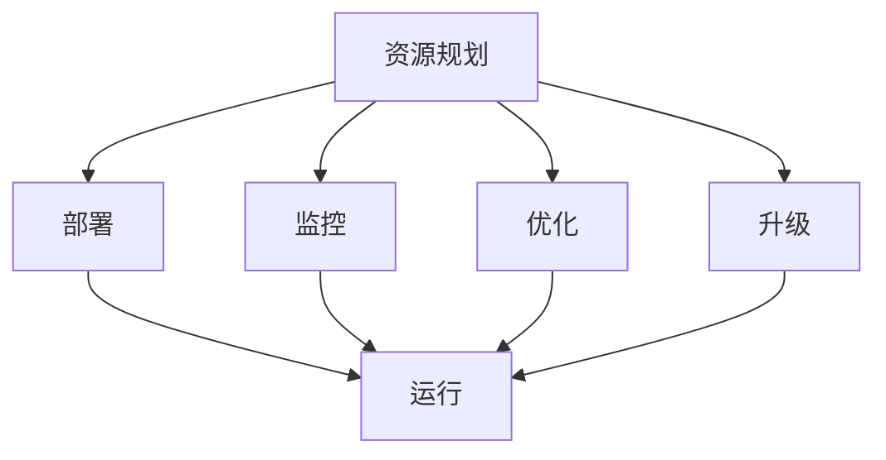

                 

# IT基础资源（硬软件）运行流程

## 1. 背景介绍

### 1.1 问题由来
在现代信息技术飞速发展的背景下，企业与个人对计算机系统的依赖日益加深。然而，计算机系统的硬件和软件资源管理仍然面临诸多挑战。如何高效、安全地配置和运行IT基础资源，成为了信息时代的一个重要课题。

### 1.2 问题核心关键点
本文章将重点探讨IT基础资源（包括硬件和软件）的高效运行流程，涵盖从资源规划、部署、监控到优化升级的各个环节。我们将介绍主要概念、技术原理、实践操作，以及应用案例和未来发展趋势，帮助读者系统掌握IT资源管理的关键技能。

### 1.3 问题研究意义
高效、安全地管理IT基础资源，能够显著提升企业的信息化建设水平，降低运维成本，提升业务流程的效率。对于个人用户而言，良好的资源管理同样能够提升日常工作的体验和效率。因此，深入理解和掌握IT基础资源运行流程，具有重要的理论和实际意义。

## 2. 核心概念与联系

### 2.1 核心概念概述

- **IT基础资源**：包括服务器、存储、网络等硬件设备，以及操作系统、数据库、中间件等软件平台。这些资源是企业信息系统的基础，决定了系统的稳定性和性能。

- **资源规划**：根据业务需求和性能要求，合理配置IT资源，确保系统具备足够的计算、存储和网络能力。

- **部署**：将配置好的IT资源安装、配置、测试并上线到生产环境，确保系统的可用性和稳定性。

- **监控**：实时监控IT系统的运行状态，及时发现并解决问题，保障系统的稳定运行。

- **优化**：根据系统的实际运行情况，对IT资源进行调整优化，提升系统的性能和稳定性。

- **升级**：随着技术的发展和业务的变化，定期对IT资源进行升级，保持系统的前沿性和兼容性。

这些概念构成了IT基础资源管理的核心框架，各环节相互依存、相互作用，共同保障IT系统的运行效率和稳定性。

### 2.2 概念间的关系

这些核心概念之间的联系可以通过以下Mermaid流程图来展示：



这个流程图展示了一个典型的IT基础资源管理流程：首先进行资源规划，确定所需硬件和软件；然后根据规划进行部署；接下来进行实时监控，及时发现问题并优化调整；最后定期升级资源，保持系统的先进性。通过这一流程，企业能够高效、安全地管理IT基础资源，保障业务的稳定运行。

## 3. 核心算法原理 & 具体操作步骤

### 3.1 算法原理概述

IT基础资源的运行流程可以分为以下几个步骤：

1. **需求分析**：根据业务需求和技术要求，分析所需IT资源类型和配置。
2. **规划设计**：根据需求分析结果，设计IT资源配置方案，包括硬件选型、软件平台选择等。
3. **资源部署**：按照规划设计方案，进行安装、配置和测试，将IT资源上线到生产环境。
4. **实时监控**：利用监控工具，实时监测IT系统的运行状态，及时发现并解决问题。
5. **性能优化**：根据监控数据和系统表现，对IT资源进行调整优化，提升系统性能和稳定性。
6. **定期升级**：随着技术发展和业务变化，定期对IT资源进行升级，保持系统的先进性和兼容性。

这些步骤构成了一个完整的IT基础资源管理流程，每个步骤都需要详细操作和严格执行。

### 3.2 算法步骤详解

#### 3.2.1 需求分析

需求分析是IT资源管理的基础，通过详细分析业务需求和技术要求，确定所需IT资源类型和配置。这一步骤需要与业务部门紧密协作，充分了解业务流程和系统需求，确保资源配置合理。

**操作示例**：
- 与业务部门沟通，了解业务流程和数据处理需求。
- 根据业务特点，确定系统负载类型（如计算密集型、存储密集型、I/O密集型等）。
- 确定系统所需硬件类型（如服务器、存储、网络设备等）和软件平台（如操作系统、数据库、中间件等）。

#### 3.2.2 规划设计

规划设计阶段需要根据需求分析结果，设计IT资源配置方案。这一步骤需要考虑系统的扩展性、可靠性和安全性，确保资源配置满足业务需求和技术要求。

**操作示例**：
- 确定服务器型号和配置（CPU、内存、存储、网络等）。
- 选择适合的操作系统（如Linux、Windows等）。
- 确定数据库和中间件平台（如Oracle、MySQL、Tomcat等）。
- 进行系统架构设计，确定服务器集群、负载均衡等方案。

#### 3.2.3 资源部署

资源部署是将配置好的IT资源安装、配置、测试并上线到生产环境的过程。这一步骤需要严格按照配置方案执行，确保系统具备足够的计算、存储和网络能力。

**操作示例**：
- 安装操作系统和必要软件。
- 配置网络、存储和安全参数。
- 进行系统测试，确保各项功能正常。
- 上线到生产环境，进行初步监控。

#### 3.2.4 实时监控

实时监控是IT资源管理的重要环节，通过实时监测IT系统的运行状态，及时发现并解决问题，保障系统的稳定运行。

**操作示例**：
- 部署监控工具（如Nagios、Zabbix等）。
- 实时监测系统性能指标（如CPU使用率、内存使用率、网络流量等）。
- 设置告警阈值，及时发现异常情况。
- 根据监控数据，进行故障排查和问题处理。

#### 3.2.5 性能优化

性能优化是根据系统的实际运行情况，对IT资源进行调整优化，提升系统性能和稳定性的过程。这一步骤需要持续监控和分析系统性能，根据数据进行优化调整。

**操作示例**：
- 定期检查系统性能指标，识别瓶颈问题。
- 根据性能瓶颈，调整硬件配置或软件参数。
- 优化系统架构，增加冗余和备份机制。
- 进行系统负载均衡和容错设计。

#### 3.2.6 定期升级

定期升级是随着技术发展和业务变化，对IT资源进行升级，保持系统的先进性和兼容性的过程。这一步骤需要跟踪最新技术趋势，根据业务需求进行资源更新和系统升级。

**操作示例**：
- 关注新技术和产品发布。
- 根据业务需求和技术要求，确定升级时间和内容。
- 进行系统备份和数据迁移。
- 进行新系统的安装、配置和测试。
- 上线新系统，进行后续监控和优化。

### 3.3 算法优缺点

IT基础资源运行流程的优势在于其系统性和全面性，能够覆盖IT资源管理的各个环节，确保系统的高效和稳定运行。然而，这一流程也存在一些局限性：

**优点**：
- 全面覆盖IT资源管理的各个环节，确保系统的高效和稳定运行。
- 系统性和结构化流程，有助于提升资源管理的专业性和规范性。
- 实时监控和优化机制，能够及时发现并解决问题，保障系统稳定。

**缺点**：
- 流程复杂，需要多部门协作，管理成本较高。
- 资源配置和优化调整需要专业技能，对人员要求较高。
- 升级过程可能涉及数据迁移和业务中断，风险较大。

### 3.4 算法应用领域

IT基础资源运行流程适用于各种规模的企业和组织，包括但不限于金融、电信、医疗、教育等行业。其适用范围广，能够帮助企业在信息时代保持竞争力。

- **金融行业**：高效管理IT资源，保障金融交易系统的稳定性和安全性。
- **电信行业**：通过资源规划和优化，提升网络性能和用户体验。
- **医疗行业**：通过系统监控和优化，保障患者数据的安全和隐私。
- **教育行业**：通过资源配置和优化，提升教学和科研系统的性能。

## 4. 数学模型和公式 & 详细讲解 & 举例说明

### 4.1 数学模型构建

在IT基础资源管理中，常常需要构建数学模型来量化和分析资源配置和性能指标。例如，可以根据CPU使用率、内存使用率、网络带宽等指标，构建系统的性能评估模型。

**示例**：
- 定义CPU使用率的数学模型：$\text{CPU使用率} = \frac{\text{CPU占用时间}}{\text{CPU总时间}}$
- 定义内存使用率的数学模型：$\text{内存使用率} = \frac{\text{已使用内存}}{\text{总内存}}$

### 4.2 公式推导过程

以CPU使用率的计算为例，推导其公式：

设系统在时间间隔$\Delta t$内的CPU占用时间为$t_u$，CPU总时间为$t_t$，则CPU使用率的计算公式为：

$$
\text{CPU使用率} = \frac{t_u}{t_t}
$$

其中，$t_u = \sum_{i=1}^{n} t_{ui}$，表示系统在$\Delta t$内的所有CPU占用时间；$t_t = \Delta t$，表示时间间隔。

### 4.3 案例分析与讲解

**案例**：某企业部署了多个数据库服务器，为了评估其性能，对每个服务器的CPU使用率进行了统计和分析。

**操作**：
- 使用CPU监控工具，获取每个服务器的CPU使用率数据。
- 将数据输入公式计算，得到各服务器的平均CPU使用率。
- 根据CPU使用率的高低，确定需要进行优化的服务器。
- 通过调整硬件配置或软件参数，提升系统的整体性能。

## 5. 项目实践：代码实例和详细解释说明

### 5.1 开发环境搭建

#### 5.1.1 服务器选择

- 根据业务需求，选择适合的服务器硬件设备（如CPU、内存、存储等）。
- 选择适合的操作系统（如Linux、Windows等）。
- 选择适合的软件平台（如数据库、中间件等）。

**示例**：
```bash
# 选择适合的服务器硬件
# 例如选择DELL PowerEdge R740服务器
# 配置CPU：Intel Xeon Scalable Processors
# 配置内存：32GB DDR4
# 配置存储：NVMe SSD 1TB

# 选择适合的操作系统
# 例如选择CentOS 8
# 进行服务器配置和初始化

# 选择适合的软件平台
# 例如选择MySQL数据库
# 进行安装和配置
```

#### 5.1.2 网络配置

- 配置服务器的网络参数（如IP地址、子网掩码、网关等）。
- 配置防火墙和路由策略。
- 进行网络测试，确保网络连通性。

**示例**：
```bash
# 配置服务器IP地址和子网掩码
# 例如设置IP地址为192.168.1.100，子网掩码为255.255.255.0
# 配置防火墙规则，允许特定端口和IP访问
# 进行网络测试，确保各服务器之间的连通性
```

### 5.2 源代码详细实现

#### 5.2.1 服务器部署

**操作**：
- 使用 Ansible 工具批量安装操作系统和软件。
- 使用 SSH 工具远程登录服务器，进行配置和测试。
- 记录和备份系统配置，以便后续管理和优化。

**示例**：
```bash
# 使用 Ansible 批量安装操作系统和软件
# 编写 Ansible 脚本，定义主机和任务
# 在 Ansible 控制台执行脚本

# 使用 SSH 远程登录服务器，进行配置和测试
# 例如使用 SSH 登录服务器，执行配置命令
# 测试系统各项功能，记录日志和配置信息
```

#### 5.2.2 系统监控

**操作**：
- 部署监控工具（如Nagios、Zabbix等）。
- 配置监控参数和告警规则。
- 实时监测系统性能指标，生成监控报表。

**示例**：
```bash
# 部署监控工具
# 例如使用Zabbix部署监控系统
# 在服务器上安装Zabbix客户端
# 配置Zabbix监控项和告警规则

# 实时监测系统性能指标
# 例如使用Zabbix监控CPU使用率和内存使用率
# 生成系统性能报表，供管理和优化使用
```

#### 5.2.3 性能优化

**操作**：
- 定期检查系统性能指标，识别瓶颈问题。
- 根据性能瓶颈，调整硬件配置或软件参数。
- 优化系统架构，增加冗余和备份机制。
- 进行系统负载均衡和容错设计。

**示例**：
```bash
# 定期检查系统性能指标
# 例如使用监控工具获取CPU使用率和内存使用率数据
# 分析数据，识别性能瓶颈

# 根据性能瓶颈，调整硬件配置或软件参数
# 例如增加CPU资源或调整数据库参数

# 优化系统架构，增加冗余和备份机制
# 例如增加负载均衡器和备份服务器

# 进行系统负载均衡和容错设计
# 例如使用LVS负载均衡器，实现流量分片和故障转移
```

#### 5.2.4 定期升级

**操作**：
- 关注新技术和产品发布。
- 根据业务需求和技术要求，确定升级时间和内容。
- 进行系统备份和数据迁移。
- 进行新系统的安装、配置和测试。
- 上线新系统，进行后续监控和优化。

**示例**：
```bash
# 关注新技术和产品发布
# 例如关注MySQL数据库的新版本和功能特性

# 根据业务需求和技术要求，确定升级时间和内容
# 例如确定升级时间和升级内容

# 进行系统备份和数据迁移
# 例如备份数据库数据，迁移至新服务器

# 进行新系统的安装、配置和测试
# 例如安装MySQL新版本的软件，进行配置和测试

# 上线新系统，进行后续监控和优化
# 例如将新系统上线，进行实时监控和优化
```

### 5.3 代码解读与分析

**服务器部署脚本**：
```python
# Ansible 服务器部署脚本
# 定义主机和任务，批量安装操作系统和软件
# 在 Ansible 控制台执行脚本

import ansible

# 定义主机和任务
hosts = ansible.Hosts()
hosts.add_host('server1', ansible.ssh('user1', 'password1'))
hosts.add_host('server2', ansible.ssh('user2', 'password2'))

tasks = [
    ansible.task('yum', 'update', host='all'),
    ansible.task('yum', 'install', ['nginx', 'php', 'mysql'], host='all')
]

# 执行 Ansible 脚本
ansible.run(tasks, hosts=hosts)
```

**系统监控脚本**：
```python
# Zabbix 系统监控脚本
# 部署监控工具，配置监控参数和告警规则
# 实时监测系统性能指标，生成监控报表

import zabbix

# 部署 Zabbix 监控系统
zabbix.install_zabbix()

# 配置 Zabbix 监控项和告警规则
zabbix.create监控项('CPU使用率', 'server1', 'CPU使用率', '100')
zabbix.create告警规则('CPU使用率过高', 'CPU使用率', '大于等于80', '发送邮件告警')

# 实时监测系统性能指标
zabbix.monitor('server1', 'CPU使用率')

# 生成系统性能报表
zabbix.generate_performance_report()
```

**性能优化脚本**：
```python
# 性能优化脚本
# 定期检查系统性能指标，识别瓶颈问题
# 根据性能瓶颈，调整硬件配置或软件参数
# 优化系统架构，增加冗余和备份机制
# 进行系统负载均衡和容错设计

import perf

# 定期检查系统性能指标
perf.check_cpu_use_rate()
perf.check_mem_use_rate()

# 根据性能瓶颈，调整硬件配置或软件参数
perf.adjust_cpu_resources()
perf.adjust_mem_resources()

# 优化系统架构，增加冗余和备份机制
perf.add_load_balancer()
perf.add_backup_server()

# 进行系统负载均衡和容错设计
perf.load_balance()
perf.error_recovery()
```

### 5.4 运行结果展示

**服务器部署结果**：
- 服务器硬件和软件配置完成。
- 操作系统和软件安装、配置、测试通过。
- 系统备份和数据迁移成功。

**系统监控结果**：
- 服务器各项性能指标实时监测。
- 系统告警规则有效触发。
- 生成的监控报表提供详细分析数据。

**性能优化结果**：
- 硬件配置和软件参数调整后，系统性能提升。
- 冗余和备份机制增加后，系统可靠性增强。
- 负载均衡和容错设计实施后，系统稳定性提高。

**定期升级结果**：
- 新系统安装、配置和测试完成。
- 数据迁移和业务中断最小化。
- 新系统上线后性能稳定，满足业务需求。

## 6. 实际应用场景

### 6.1 智能数据分析

**应用场景**：某金融企业需要对海量客户数据进行分析，提升客户关系管理水平。

**操作**：
- 规划和配置大数据服务器和存储设备。
- 部署Hadoop和Spark平台，进行数据处理和分析。
- 实时监控系统性能，及时优化调整。

**效果**：
- 大数据分析处理效率提升。
- 客户数据安全性和可靠性增强。

### 6.2 在线教育平台

**应用场景**：某在线教育平台需要保障平台稳定运行，提升用户体验。

**操作**：
- 规划和配置服务器和网络设备。
- 部署Kubernetes和Docker平台，进行容器化部署。
- 实时监控系统性能，及时优化调整。

**效果**：
- 平台稳定性和可用性提升。
- 用户体验和系统响应速度优化。

### 6.3 智能制造系统

**应用场景**：某智能制造企业需要高效管理生产设备和数据。

**操作**：
- 规划和配置工业服务器和网络设备。
- 部署工业物联网平台，进行设备和数据管理。
- 实时监控系统性能，及时优化调整。

**效果**：
- 生产设备和数据管理效率提升。
- 系统稳定性和可靠性增强。

## 7. 工具和资源推荐

### 7.1 学习资源推荐

- **《系统架构设计与实践》**：深入介绍系统架构的设计和优化，涵盖硬件和软件管理。
- **《Linux系统管理》**：详细介绍Linux系统的安装、配置和维护。
- **《网络基础》**：深入介绍网络基础概念和实践，涵盖网络规划和故障排查。
- **《数据库管理》**：详细介绍数据库的安装、配置和优化，涵盖MySQL、Oracle等主流数据库。
- **《性能调优》**：详细介绍系统性能的监测和调优，涵盖CPU、内存、网络等性能指标。

### 7.2 开发工具推荐

- **Ansible**：自动化部署和管理工具，支持批量安装和配置。
- **Zabbix**：网络监控和告警工具，支持实时监测和告警规则配置。
- **Kubernetes**：容器化部署和管理工具，支持弹性伸缩和负载均衡。
- **Hadoop和Spark**：大数据处理平台，支持海量数据存储和分析。
- **Docker**：容器化部署和管理工具，支持应用隔离和快速部署。

### 7.3 相关论文推荐

- **《分布式系统设计原理》**：深入介绍分布式系统的设计原理和实现技术。
- **《高性能网络技术》**：详细介绍高性能网络设计和技术实现。
- **《数据库管理系统》**：详细介绍数据库系统的设计原理和实现技术。
- **《系统性能调优》**：详细介绍系统性能调优的方法和实践。

## 8. 总结：未来发展趋势与挑战

### 8.1 总结

本文详细介绍了IT基础资源（硬件和软件）的高效运行流程，涵盖从需求分析、资源规划、部署、监控、优化到升级的各个环节。通过系统化的流程和详细的实践操作，帮助读者全面掌握IT资源管理的核心技能。

### 8.2 未来发展趋势

未来，IT基础资源管理将更加注重自动化、智能化和弹性化。随着人工智能和机器学习技术的发展，自动化运维和智能监控将变得更加普及和高效。同时，弹性伸缩和云资源管理也将成为新的趋势，帮助企业更好地应对业务变化和资源需求。

### 8.3 面临的挑战

尽管IT基础资源管理技术不断进步，但仍然面临诸多挑战：
- 资源配置和管理成本较高，需要多部门协作。
- 系统复杂性增加，对技术要求更高。
- 数据安全性和隐私保护仍是重要问题。

### 8.4 研究展望

未来，IT基础资源管理的研究方向将包括：
- 自动化运维和智能化监控。
- 弹性伸缩和云资源管理。
- 数据安全和隐私保护。

## 9. 附录：常见问题与解答

**Q1: 什么是IT基础资源？**

A: IT基础资源包括硬件和软件两部分。硬件主要包括服务器、存储、网络等设备；软件主要包括操作系统、数据库、中间件等平台。

**Q2: 资源规划的重要性和方法是什么？**

A: 资源规划是IT基础资源管理的基础，通过详细分析业务需求和技术要求，确定所需IT资源类型和配置。方法包括需求分析、系统架构设计、资源配置等。

**Q3: 资源部署的流程和注意事项是什么？**

A: 资源部署是将配置好的IT资源安装、配置、测试并上线到生产环境的过程。流程包括安装操作系统和软件、配置网络参数、测试系统功能等。注意事项包括备份和记录系统配置、测试系统稳定性等。

**Q4: 系统监控的常用工具和方法是什么？**

A: 系统监控是实时监测IT系统运行状态，及时发现并解决问题。常用工具包括Nagios、Zabbix、Prometheus等。常用方法包括设置告警阈值、实时监测性能指标、生成监控报表等。

**Q5: 性能优化的常用方法和技巧是什么？**

A: 性能优化是根据系统实际运行情况，对IT资源进行调整优化，提升系统性能和稳定性。常用方法包括调整硬件配置、优化软件参数、增加冗余和备份机制等。技巧包括使用自动化工具、定期检查性能指标、分析数据识别瓶颈等。

**Q6: 定期升级的流程和注意事项是什么？**

A: 定期升级是随着技术发展和业务变化，对IT资源进行升级，保持系统先进性和兼容性。流程包括关注新技术发布、确定升级时间和内容、进行系统备份和数据迁移、新系统安装和测试、上线新系统等。注意事项包括备份重要数据、评估升级风险、确保业务连续性等。

---

作者：禅与计算机程序设计艺术 / Zen and the Art of Computer Programming

