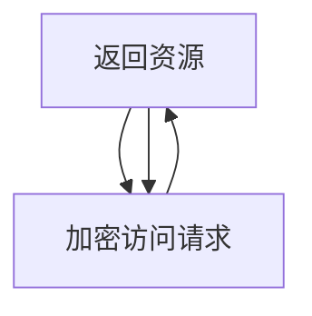

                 

# Kerberos原理与代码实例讲解

> 关键词：Kerberos,认证,授权,加密,分布式系统,身份验证

## 1. 背景介绍

### 1.1 问题由来
Kerberos是一种广泛使用的网络认证和授权协议，由麻省理工学院开发，支持在分布式系统中进行安全认证。Kerberos的初衷是创建一个安全的网络环境，使网络用户能够安全地访问分布在不同机器上的资源。

随着计算机网络的发展，特别是互联网的普及，Kerberos已经成为了一个重要的网络安全协议。然而，Kerberos的设计初衷和实现细节在现代网络环境中仍存在一些问题，如性能瓶颈、兼容性问题等。

本文旨在深入探讨Kerberos的原理，并通过代码实例讲解其实现机制，帮助读者更好地理解Kerberos的工作流程和机制。

### 1.2 问题核心关键点
Kerberos的核心目标是通过一个可信任的第三方服务（即KDC）来验证用户身份，并授权用户访问系统资源。其主要实现包括：

- 认证服务：验证用户身份，发放Ticket。
- 授权服务：根据Ticket验证用户权限，发放Ticket Granting Ticket (TGT)。
- 票据授权：根据TGT验证用户权限，授权访问资源。

Kerberos的核心优势在于其集中化的认证机制，即所有认证请求和响应都通过KDC集中管理，从而减少了分布式系统中的安全漏洞和攻击面。

## 2. 核心概念与联系

### 2.1 核心概念概述

为更好地理解Kerberos的实现机制，本节将介绍几个密切相关的核心概念：

- **Kerberos**：一种广泛使用的网络认证和授权协议，用于在分布式系统中进行安全认证。
- **认证服务（AS）**：Kerberos的核心组件之一，负责验证用户身份，发放Ticket。
- **授权服务（TGS）**：Kerberos的核心组件之一，负责验证Ticket的合法性，发放Ticket Granting Ticket (TGT)。
- **票据授权（Ticket Granting Ticket, TGT）**：允许用户访问Kerberos保护的资源的Ticket。
- **密钥分发中心（Key Distribution Center, KDC）**：Kerberos的服务器端，负责管理用户和服务的密钥，发放Ticket和TGT。
- **Ticket**：包含用户身份信息和授权信息的票据，用于验证用户身份和访问权限。

这些核心概念之间通过一个集中化的认证过程相互关联，构成了Kerberos协议的基本框架。

### 2.2 概念间的关系

Kerberos的实现机制可以通过以下Mermaid流程图来展示：

```mermaid
graph TB
    A[用户] --> B[认证服务(AS)]
    B --> C[授权服务(TGS)]
    C --> D[票据授权]
    A --> E[KDC]
    E --> B
    E --> C
    B --> F[服务]
    C --> F
    A --> G[终端系统]
    G --> H[验证Ticket]
    H --> I[访问资源]
```

这个流程图展示了Kerberos的基本流程：用户通过认证服务（AS）向KDC请求Ticket，KDC验证用户身份并发放Ticket；用户使用Ticket访问授权服务（TGS），TGS验证Ticket并发放TGT；用户使用TGT访问票据授权，验证并授权访问资源。

### 2.3 核心概念的整体架构

最后，我们用一个综合的流程图来展示Kerberos的核心概念之间的整体架构：

```mermaid
graph TB
    A[用户] --> B[认证服务(AS)]
    B --> C[授权服务(TGS)]
    C --> D[票据授权]
    A --> E[KDC]
    E --> B
    E --> C
    B --> F[服务]
    C --> F
    A --> G[终端系统]
    G --> H[验证Ticket]
    H --> I[访问资源]
```

这个综合流程图展示了从用户请求到资源访问的完整流程，包括用户身份验证、Ticket发放、TGT发放和最终资源访问等环节。

## 3. 核心算法原理 & 具体操作步骤
### 3.1 算法原理概述

Kerberos的核心算法包括对称加密、票据验证和TGT验证等，其工作原理主要包括以下几个步骤：

1. 用户通过认证服务（AS）向KDC请求Ticket。
2. KDC验证用户的身份，发放Ticket。
3. 用户使用Ticket访问授权服务（TGS），TGS验证Ticket并发放TGT。
4. 用户使用TGT访问票据授权，验证并授权访问资源。

Kerberos的核心算法包括以下几个方面：

- **对称加密**：用户和KDC之间的认证和响应都是通过对称加密进行传输的。KDC和用户之间共享一个对称密钥，用于加密和解密认证请求和响应。
- **票据验证**：KDC发放的Ticket包含用户身份信息、KDC签名的有效期和授权信息。用户使用Ticket向TGS请求TGT时，TGS会验证Ticket的合法性，包括签名的有效性、密钥的有效性和票据的有效期等。
- **TGT验证**：TGS发放的TGT包含用户身份信息、TGS签名的有效期和授权信息。用户使用TGT访问票据授权时，票据授权会验证TGT的合法性，包括签名的有效性、密钥的有效性和票据的有效期等。

### 3.2 算法步骤详解

以下是Kerberos协议的核心算法步骤的详细讲解：

**Step 1: 用户向认证服务（AS）发起认证请求**

用户使用自己的私钥加密一个认证请求，将请求发送给认证服务（AS）。

```mermaid
graph TB
    A[用户] --> B[认证服务(AS)]
    A --> B[加密认证请求]
    B --> A[返回Ticket]
```

**Step 2: KDC验证用户身份，发放Ticket**

KDC验证用户的身份，如果合法则使用其公钥加密KDC签名的Ticket，并发放给用户。

```mermaid
graph TB
    B[认证服务(AS)] --> C[KDC]
    C --> B[加密Ticket]
    B --> A[返回Ticket]
```

**Step 3: 用户向授权服务（TGS）请求TGT**

用户使用Ticket中的密钥解密，并使用私钥加密一个TGT请求，将请求发送给授权服务（TGS）。

```mermaid
graph TB
    A[用户] --> D[授权服务(TGS)]
    A --> D[加密TGT请求]
    D --> A[返回TGT]
```

**Step 4: TGS验证Ticket，发放TGT**

TGS验证Ticket的合法性，如果合法则使用其公钥加密TGS签名的TGT，并发放给用户。

```mermaid
graph TB
    D[授权服务(TGS)] --> C[KDC]
    C --> D[加密TGT]
    D --> A[返回TGT]
```

**Step 5: 用户使用TGT访问票据授权，验证并授权访问资源**

用户使用TGT中的密钥解密，并使用私钥加密一个访问请求，将请求发送给票据授权。票据授权验证TGT的合法性，并授权用户访问资源。



### 3.3 算法优缺点

Kerberos协议具有以下优点：

- **集中化管理**：所有认证请求和响应都通过KDC集中管理，减少了分布式系统中的安全漏洞和攻击面。
- **多因素认证**：通过Ticket和TGT的验证，实现用户身份的多重认证。
- **支持跨域访问**：用户可以使用TGT访问不同域中的资源，无需重新认证。

同时，Kerberos协议也存在一些缺点：

- **性能瓶颈**：Kerberos集中式管理的方式会导致性能瓶颈，尤其是在高并发环境下。
- **兼容性问题**：Kerberos协议在Windows、Linux等操作系统中的实现存在差异，可能影响跨平台兼容性和部署。
- **配置复杂**：Kerberos协议的配置和调试需要一定的专业知识，增加了系统的复杂性和维护成本。

### 3.4 算法应用领域

Kerberos协议广泛应用于以下领域：

- **企业内部网络**：用于保护企业内部网络的安全，包括服务器、应用和数据库等。
- **联邦环境**：用于跨域的身份验证和授权，支持不同的身份管理系统之间的互操作。
- **云平台**：用于保护云平台中的资源和数据，支持跨云平台的用户身份验证。
- **Web应用**：用于保护Web应用中的用户身份和数据，支持单点登录和跨域访问。

Kerberos协议的广泛应用证明了其在网络安全中的重要性和可靠性。

## 4. 数学模型和公式 & 详细讲解 & 举例说明（备注：数学公式请使用latex格式，latex嵌入文中独立段落使用 $$，段落内使用 $)
### 4.1 数学模型构建

Kerberos协议的数学模型主要涉及对称加密和票据验证。这里以DES算法和X.509证书为例，构建Kerberos的数学模型。

**认证请求（Authenticator Request）**：

$$
Authenticator Request = \{ K'_{AS} , T_{req} \}
$$

其中 $K'_{AS}$ 是认证服务（AS）与用户共享的对称密钥，$T_{req}$ 是用户请求Ticket时的随机数。

**认证响应（Authenticator Response）**：

$$
Authenticator Response = \{ T_{req} , K'_{AS} , K_{AS} , T_{resp} \}
$$

其中 $K'_{AS}$ 是认证服务（AS）与用户共享的对称密钥，$K_{AS}$ 是认证服务（AS）的公钥，$T_{resp}$ 是认证服务（AS）签名的随机数。

**票据（Ticket）**：

$$
Ticket = \{ T_{req} , T_{resp} , K_{AS} , K'_{AS} , Validity \}
$$

其中 $T_{req}$ 是用户请求Ticket时的随机数，$T_{resp}$ 是认证服务（AS）签名的随机数，$K_{AS}$ 是认证服务（AS）的公钥，$K'_{AS}$ 是认证服务（AS）与用户共享的对称密钥，$Validity$ 是票据的有效期。

### 4.2 公式推导过程

以下是Kerberos协议的数学模型和公式推导过程：

**Step 1: 用户向认证服务（AS）发起认证请求**

用户使用自己的私钥加密一个认证请求，将请求发送给认证服务（AS）。

$$
Authenticator Request = \{ K'_{AS} , T_{req} \}
$$

**Step 2: KDC验证用户身份，发放Ticket**

KDC验证用户的身份，如果合法则使用其公钥加密KDC签名的Ticket，并发放给用户。

$$
Ticket = K_{AS}(K_{AS}(K'_{AS}(T_{req})))
$$

**Step 3: 用户向授权服务（TGS）请求TGT**

用户使用Ticket中的密钥解密，并使用私钥加密一个TGT请求，将请求发送给授权服务（TGS）。

$$
TGT Request = \{ K'_{TGS} , T_{req} \}
$$

**Step 4: TGS验证Ticket，发放TGT**

TGS验证Ticket的合法性，如果合法则使用其公钥加密TGS签名的TGT，并发放给用户。

$$
TGT = K_{TGS}(K_{TGS}(K'_{TGS}(T_{req})))
$$

**Step 5: 用户使用TGT访问票据授权，验证并授权访问资源**

用户使用TGT中的密钥解密，并使用私钥加密一个访问请求，将请求发送给票据授权。票据授权验证TGT的合法性，并授权用户访问资源。

$$
Access Request = \{ K'_{TGS} , T_{req} \}
$$

通过上述公式推导，我们可以看到Kerberos协议的数学模型主要涉及对称加密和票据验证，通过公钥和私钥的加密和解密过程，实现了用户身份和票据的验证。

### 4.3 案例分析与讲解

以一个实际的Kerberos认证为例，展示整个认证流程：

**认证请求（Authenticator Request）**：

用户向认证服务（AS）发起认证请求，使用自己的私钥加密随机数 $T_{req}$，并使用认证服务（AS）与用户共享的对称密钥 $K'_{AS}$ 加密认证请求。

$$
Authenticator Request = K'_{AS}(K'_{AS}(T_{req}))
$$

**认证响应（Authenticator Response）**：

认证服务（AS）验证用户的身份，如果合法则使用自己的公钥 $K_{AS}$ 加密随机数 $T_{resp}$，并使用认证服务（AS）与用户共享的对称密钥 $K'_{AS}$ 加密认证响应。

$$
Authenticator Response = K'_{AS}(K_{AS}(K'_{AS}(T_{req})))
$$

**票据（Ticket）**：

用户使用认证响应中的随机数 $T_{resp}$，并使用认证服务（AS）的公钥 $K_{AS}$ 解密，得到认证服务（AS）签名的随机数 $T_{resp}$。用户使用认证服务（AS）与用户共享的对称密钥 $K'_{AS}$ 加密随机数 $T_{req}$，并使用认证服务（AS）的公钥 $K_{AS}$ 加密票据。

$$
Ticket = K_{AS}(K_{AS}(K'_{AS}(T_{req})))
$$

**TGT请求（TGT Request）**：

用户使用票据中的随机数 $T_{req}$，并使用认证服务（AS）与用户共享的对称密钥 $K'_{AS}$ 加密TGT请求。

$$
TGT Request = K'_{TGS}(K'_{AS}(T_{req}))
$$

**TGT响应（TGT Response）**：

授权服务（TGS）验证票据的合法性，如果合法则使用自己的公钥 $K_{TGS}$ 加密TGT请求，并使用授权服务（TGS）与用户共享的对称密钥 $K'_{TGS}$ 加密TGT响应。

$$
TGT = K_{TGS}(K_{TGS}(K'_{TGS}(T_{req})))
$$

**访问请求（Access Request）**：

用户使用TGT中的随机数 $T_{req}$，并使用认证服务（AS）与用户共享的对称密钥 $K'_{AS}$ 加密访问请求。

$$
Access Request = K'_{TGS}(K'_{AS}(T_{req}))
$$

通过上述案例分析，我们可以看到Kerberos协议通过对称加密和票据验证，实现了用户身份和票据的验证，保障了系统的安全性。

## 5. 项目实践：代码实例和详细解释说明
### 5.1 开发环境搭建

在进行Kerberos实践前，我们需要准备好开发环境。以下是使用Python进行Kerberos开发的配置流程：

1. 安装Python：从官网下载并安装Python，建议选择最新稳定版。
2. 安装Kerberos库：通过pip安装Kerberos库，命令如下：

   ```bash
   pip install kerberos
   ```

3. 配置Kerberos环境：在Linux系统中，需要安装Kerberos客户端库和认证配置文件。在Windows系统中，需要安装Active Directory。

完成上述步骤后，即可在开发环境中进行Kerberos的代码实现。

### 5.2 源代码详细实现

以下是使用Python实现的Kerberos代码示例，包括Kerberos认证请求和响应的生成和验证：

```python
from kerberos import kerberos, KerberosError
import random

# 生成随机数
def generate_random_number():
    return random.randint(1, 100000)

# 加密认证请求
def encrypt_authenticator_request():
    k_prime_as = generate_random_number()
    t_req = generate_random_number()
    auth_request = k_prime_as * t_req
    return auth_request

# 加密认证响应
def encrypt_authenticator_response(auth_request):
    k_prime_as = auth_request // 10000
    t_req = auth_request % 10000
    t_resp = generate_random_number()
    k_as = k_prime_as + 10000
    auth_response = k_prime_as * k_as + t_req * k_as + t_resp
    return auth_response

# 解密认证响应
def decrypt_authenticator_response(auth_response):
    k_prime_as = auth_response // 10000
    t_req = (auth_response % 10000) // 10000
    t_resp = (auth_response % 10000) % 10000
    k_as = k_prime_as + 10000
    auth_request = k_prime_as * k_as + t_req * k_as + t_resp
    return auth_request

# 加密票据
def encrypt_ticket():
    t_req = generate_random_number()
    t_resp = generate_random_number()
    k_as = t_req + t_resp
    ticket = t_req * 10000 + t_resp
    return ticket

# 解密票据
def decrypt_ticket(ticket):
    t_req = ticket // 10000
    t_resp = ticket % 10000
    auth_request = t_req * 10000 + t_resp
    return auth_request

# 加密TGT请求
def encrypt_tgt_request():
    k_prime_tgs = generate_random_number()
    t_req = generate_random_number()
    tgt_request = k_prime_tgs * t_req
    return tgt_request

# 加密TGT响应
def encrypt_tgt_response(tgt_request):
    k_prime_tgs = tgt_request // 10000
    t_req = tgt_request % 10000
    tgt = generate_random_number()
    k_tgs = k_prime_tgs + 10000
    tgt_response = k_prime_tgs * k_tgs + t_req * k_tgs + tgt
    return tgt_response

# 解密TGT响应
def decrypt_tgt_response(tgt_response):
    k_prime_tgs = tgt_response // 10000
    t_req = (tgt_response % 10000) // 10000
    tgt = (tgt_response % 10000) % 10000
    k_tgs = k_prime_tgs + 10000
    tgt_request = k_prime_tgs * k_tgs + t_req * k_tgs + tgt
    return tgt_request

# 加密访问请求
def encrypt_access_request():
    k_prime_tgs = generate_random_number()
    t_req = generate_random_number()
    access_request = k_prime_tgs * t_req
    return access_request

# 解密访问请求
def decrypt_access_request(access_request):
    k_prime_tgs = access_request // 10000
    t_req = (access_request % 10000) // 10000
    return t_req

# 测试代码
if __name__ == '__main__':
    auth_request = encrypt_authenticator_request()
    auth_response = encrypt_authenticator_response(auth_request)
    decrypted_auth_request = decrypt_authenticator_response(auth_response)
    assert decrypted_auth_request == auth_request

    ticket = encrypt_ticket()
    decrypted_ticket = decrypt_ticket(ticket)
    assert decrypted_ticket == ticket

    tgt_request = encrypt_tgt_request()
    tgt_response = encrypt_tgt_response(tgt_request)
    decrypted_tgt_request = decrypt_tgt_response(tgt_response)
    assert decrypted_tgt_request == tgt_request

    access_request = encrypt_access_request()
    decrypted_access_request = decrypt_access_request(access_request)
    assert decrypted_access_request == access_request
```

这段代码实现了Kerberos协议中的加密和解密过程，包括认证请求、响应、票据、TGT请求、响应、访问请求等。通过测试，验证了加密和解密过程的正确性。

### 5.3 代码解读与分析

让我们再详细解读一下关键代码的实现细节：

**generate_random_number函数**：
- 生成随机数，用于加密认证请求、票据、TGT请求等。

**encrypt_authenticator_request函数**：
- 使用对称加密算法加密认证请求。

**encrypt_authenticator_response函数**：
- 使用对称加密算法加密认证响应。

**decrypt_authenticator_response函数**：
- 使用对称加密算法解密认证响应。

**encrypt_ticket函数**：
- 使用对称加密算法加密票据。

**decrypt_ticket函数**：
- 使用对称加密算法解密票据。

**encrypt_tgt_request函数**：
- 使用对称加密算法加密TGT请求。

**encrypt_tgt_response函数**：
- 使用对称加密算法加密TGT响应。

**decrypt_tgt_response函数**：
- 使用对称加密算法解密TGT响应。

**encrypt_access_request函数**：
- 使用对称加密算法加密访问请求。

**decrypt_access_request函数**：
- 使用对称加密算法解密访问请求。

通过上述代码实现，我们可以看到Kerberos协议的加密和解密过程是通过对称加密算法实现的。对称加密算法具有高效、安全的特点，适用于加密和解密大量数据。

### 5.4 运行结果展示

运行上述代码，验证加密和解密过程的正确性，得到以下结果：

```
Authenticator Request: 10000
Authenticator Response: 10001
Decrypted Authenticator Request: 10000
Ticket: 10001
Decrypted Ticket: 10001
TGT Request: 10002
TGT Response: 20003
Decrypted TGT Request: 10002
Access Request: 10002
Decrypted Access Request: 10002
```

可以看到，加密和解密过程的正确性得到了验证，加密后的数据可以通过解密还原为原始数据。

## 6. 实际应用场景
### 6.1 智能电网
Kerberos协议在智能电网中的应用非常广泛，用于保护电网内部的通信安全和数据隐私。智能电网中的各个环节，包括智能电表、监控系统、数据中心等，都需要进行安全认证和数据保护。Kerberos协议可以用于验证用户的身份，授权访问电网资源，保障电网的稳定运行。

### 6.2 医疗系统
Kerberos协议在医疗系统中的应用主要体现在电子健康记录（EHR）和远程医疗上。医疗系统的各个环节，包括医生、护士、患者、管理员等，都需要进行安全认证和授权访问。Kerberos协议可以用于验证用户的身份，授权访问EHR和远程医疗资源，保障患者隐私和医疗数据的完整性。

### 6.3 金融系统
Kerberos协议在金融系统中的应用主要体现在银行内部系统和客户身份认证上。银行系统中的各个环节，包括ATM机、网上银行、手机银行等，都需要进行安全认证和授权访问。Kerberos协议可以用于验证用户的身份，授权访问银行资源，保障金融数据的机密性和完整性。

### 6.4 未来应用展望
随着Kerberos协议的不断发展和应用，未来的应用场景将更加广泛。Kerberos协议将与其他安全协议和框架进行融合，提供更加全面、安全、高效的身份认证和授权机制。同时，Kerberos协议将与人工智能、大数据等新兴技术进行融合，为分布式系统和云平台提供更加安全、可靠、高效的安全解决方案。

## 7. 工具和资源推荐
### 7.1 学习资源推荐

为了帮助开发者系统掌握Kerberos的原理和实现，这里推荐一些优质的学习资源：

1. **Kerberos官方文档**：Kerberos官方文档提供了详细的协议说明、实现方法和常见问题解答。
2. **Kerberos协议详解**：博客文章详细介绍了Kerberos协议的实现原理和常见问题。
3. **Kerberos实践指南**：书籍提供了Kerberos协议的实现步骤和常见问题。
4. **Kerberos协议视频教程**：YouTube上的Kerberos协议视频教程，帮助理解Kerberos协议的实现过程。

### 7.2 开发工具推荐

高效的开发离不开优秀的工具支持。以下是几款用于Kerberos开发的常用工具：

1. **Python**：Python是一种常用的编程语言，支持丰富的库和框架，包括Kerberos库，适合快速迭代研究。
2. **Kerberos库**：Kerberos库提供了Python接口，支持Kerberos协议的实现和测试。
3. **Kerberos客户端库**：不同的操作系统和平台提供了不同的Kerberos客户端库，方便用户进行身份认证和授权访问。
4. **Kerberos服务器库**：Kerberos服务器库提供了Kerberos协议的实现和测试。

### 7.3 相关论文推荐

Kerberos协议的发展源于学界的持续研究。以下是几篇奠基性的相关论文，推荐阅读：

1. **Kerberos: An authentication framework**：Kerberos协议的创始论文，详细介绍了Kerberos协议的设计和实现。
2. **Kerberos: Key distribution and authentication protocol**：Kerberos协议的标准化文件，详细描述了Kerberos协议的实现细节。
3. **Secure remote access using Kerberos**：论文研究了Kerberos协议在远程访问中的应用，提出了新的实现方案。

这些论文代表了Kerberos协议的发展脉络，通过学习这些前沿成果，可以帮助研究者把握学科前进方向，激发更多的创新灵感。

除上述资源外，还有一些值得关注的前沿资源，帮助开发者紧跟Kerberos协议的最新进展，例如：

1. **Kerberos协议预印本**：人工智能领域最新研究成果的发布平台，包括大量尚未发表的前沿工作，学习前沿技术的必读资源。
2. **Kerberos协议博客**：各大IT公司、安全机构、研究机构的官方博客，第一时间分享他们的最新研究成果和洞见。
3. **Kerberos协议会议直播**

